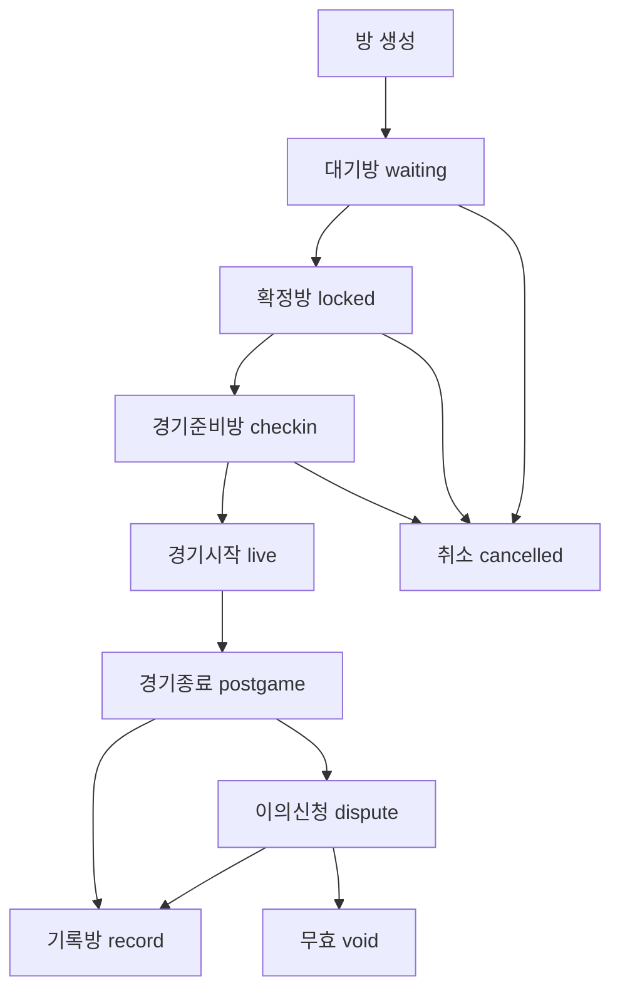
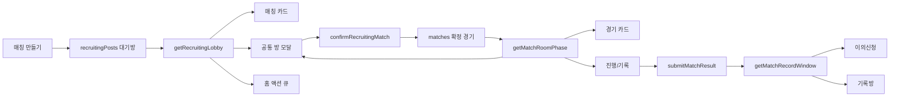
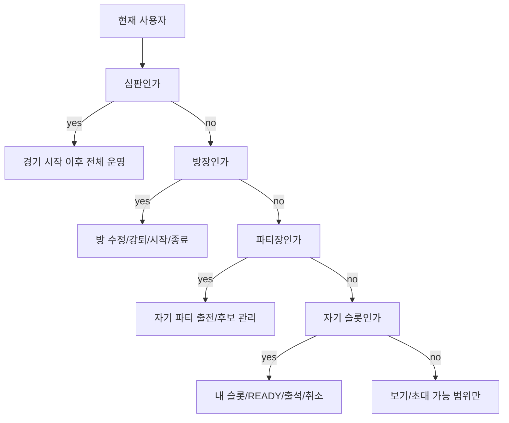

# RankBall 로직/용어/디자인 기준

## 2026-07-07 팀전 생성/표시 기준

- 팀전 방 생성 화면은 A/B 출전 명단을 고르지 않는다.
- 팀전 방 생성 시 저장하는 host `playerIds`는 방장 대표 1명만 둔다.
- 팀전 방은 공개/비공개 모두 `teamOnly=true`로 저장한다. 개인방과 팀방을 섞지 않는다.
- `createMatch`는 `solo`와 `match_record` 기록 생성만 담당한다. 일반 사전방은 `createRecruitingPost`로만 만든다.
- 모집방 create 서버 저장은 방장 A사이드, 팀전 대표 1명, 비공개 팀전 B대표 초대 1명, 생성 시 B로스터 미저장을 다시 검사한다.
- 팀전/팀 파티 표시 라벨은 참가자 2명 이상 여부가 아니라 `hostJoinMode`, `teamOnly`, `teamId`, `targetTeamId`, entry `kind/joinMode/teamId` 기준으로 판단한다.
- `isRecruitingPartyEntry`는 실제 파티 성립 조건이라 2명 이상 실제 참가/후보가 있을 때만 true로 둔다.
- 출전/후보 명단 확정은 방모달의 사이드장/팀 소집 경로에서 처리한다.

## 2026-07-07 방장 사이드 고정

- 사전 모집방과 경기방에서 방장은 생성 사이드를 유지한다.
- 방장 본인은 반대 사이드로 이동할 수 없다.
- UI는 방장에게 반대 사이드 이동 버튼을 보이지 않는다.
- 저장 함수도 방장 사이드 변경 요청을 무시한다.

## 2026-07-07 경기 메뉴 분기 필터

- 경기 메뉴는 내 일정 안에서 공개 모집, 비공개 초대, 개인전, 팀전을 분리해 볼 수 있다.
- 경기기록방은 경기 메뉴 일정 필터가 아니라 진행 메뉴 기록 확인 흐름에서 표시한다.
- 매칭 메뉴 공개 탐색 필터와 달리 경기 메뉴 분기 필터는 내가 관련된 방 안에서만 적용한다.
- 경기 메뉴 관계 필터의 `전체`는 실제 일정인 내가 만든 방과 내 참여방만 포함한다.
- `초대받은 방`은 아직 참가 확정 전 처리 항목이므로 별도 관계 필터에서만 표시한다.
- 경기 메뉴 일정 카드의 모집방 인원 숫자는 후보 자동충원 예상치가 아니라 현재 출전 슬롯 숫자를 표시한다.

## 2026-07-07 부분팀 허용 금지

- 팀전은 개인/부분팀 혼합을 만들지 않는다.
- 공개 팀전은 항상 팀 파티 전용으로 저장한다.
- 개인전은 개인 참여만, 팀전은 팀 파티만 사용한다.
- 팀 MMR 검증은 팀 파티 로스터가 확정된 뒤에만 가능하다.

## 2026-07-07 기록방 사이드장 로스터 저장 권한

- `match_record` 로스터 수정은 방장/심판 전용 액션이 아니다.
- 각 사이드장은 자기 사이드 로스터만 저장할 수 있다.
- 서버 action은 `setMatchRecordTeamRoster`로 분리한다.
- 기존 `setMatchRoomPlayerPlacement` 권한을 빌려 쓰지 않는다.
- 저장은 기존 match snapshot/RPC 경로를 사용하고 별도 DB 테이블을 추가하지 않는다.

## 2026-07-07 홈 확정 경기 표시 기준

- 홈의 내 확정 경기는 `user_room_feed.__feedRelations`만으로 내 경기로 인정하지 않는다.
- 실제 match row 기준의 방장/참가자/후보/심판 계산만 사용한다.
- feed row는 목록 로딩 보조값이며 홈 개인 일정의 권한 원본이 아니다.

## 2026-07-07 경기 목록 인원 표시 기준

- `room_feed_cards.card_json`은 목록 캐시이며 실제 인원 원본이 아니다.
- 경기 목록 카드의 A/B 인원 숫자는 가능하면 `match_players` 기준으로 다시 계산한다.
- 모집 목록 카드의 A/B 인원 숫자는 가능하면 `recruiting_posts`/`recruiting_applications` 얇은 row 기준 `listCounts`로 다시 계산한다.
- 모집 상세, 경기 메뉴 모집 일정, 내 모집 관계 목록, 서버 action 결과는 pending mutation 보호를 통과하면 같은 id의 기존 클라이언트 모집 row를 교체한다.
- 목록 보정은 숫자만 갱신하고 상세 로스터/프로필은 방 상세 로드에서 가져온다.

## 2026-07-07 진행 메뉴 선택 경기 상세 기준

- 진행 메뉴 첫 화면은 카드 목록만 보여주고, 점수판/기록자/후보/교체 출전 판단은 공통 방 모달 안에서 처리한다.
- 진행 메뉴에서 공통 방 모달을 열면 live/postgame/dispute 기록판과 live 선수 교체 패널은 슬롯보다 먼저 보여준다. 이 배치는 진행 진입점에만 적용한다.
- 진행 메뉴 카드는 얇은 목록 row 요약만 쓰고, 방 모달을 열 때 선택된 경기 1건만 상세 로드해 `statRecorders`, `playedPlayerIds`, `result.playerStats`를 맞춘다.
- 후보는 실제 출전 전까지 점수판 기록 대상이 아니며, `playedPlayerIds`에 들어간 뒤에만 기록 대상이 된다.
- 상세 로드 중에는 입력/저장을 잠깐 막아 늦게 도착한 상세 데이터가 사용자의 임시 입력을 덮지 않게 한다.
- live 경기 중 선수 교체는 운영자 또는 해당 사이드 기록자만 처리한다. UI는 현재 사용자가 후보인 교체 행만 노출한다. 후보를 출전으로 올리면 기존 출전 선수는 후보로 내려가고, 양쪽 선수 모두 `playedPlayerIds`에 남아 기록 대상이 된다.

## 2026-07-07 방 종류 표준값

- 방 종류 로직값은 화면 문구가 아니라 enum형 표준 문자열로 판단한다.
- `public_recruiting`: 앞으로 할 공개 모집방이다. 매칭 공개 목록에 노출한다.
- `private_invite`: 앞으로 할 비공개 초대방이다. 매칭 공개 목록에는 노출하지 않고 경기 메뉴 관계 목록에서만 다룬다.
- `match_record`: 이미 끝난 경기의 기록 검증방이다. 경기 일정이 아니라 진행 메뉴의 기록 확인 대상으로 시작한다.
- `personal_record`: 내 기록이다. 모집/초대/참가/READY/이의신청/MMR이 없고 프로필 기록에만 붙는다. 열람 UI는 방모달을 재사용할 수 있다.
- `tournament`: 대회방이다. 대회 메뉴와 대회 규칙을 따른다.
- 매칭 메뉴는 공개 모집 탐색만 담당한다. 내가 만든 방/내 참여방/초대받은 방은 경기 메뉴 관계 필터, 홈 알림, 직접 링크에서 다룬다.

## 2026-07-07 사전방/사후 기록방 기준

- 사전방은 `방만들기`에서 만든다. 공개 모집방과 비공개 초대방이 여기에 속한다.
- 사후 기록방은 `기록하기`에서 만든다. 이미 끝난 경기를 기록 확인 상태로 시작한다.
- 기본 `/app/create`는 사전 방만들기만 노출하고, 기록 생성 분기는 `/app/create?intent=record`에서만 노출한다.
- 사전방 용어는 `초대`, `참가`, `참가 확정`을 쓴다.
- 사후 기록방 용어는 `확인 요청`, `기록 확인`, `기록 대상`을 쓴다.
- READY는 신규 로직에서 쓰지 않는다. 초대 수락, 신청 수락, 기록 확인, 선수 확정이 각각의 확정 이벤트다.
- 사전방은 `모집/초대 -> 예정 -> 진행 -> 기록 확인 -> 완료 기록` 흐름을 따른다.
- 경기기록방은 `확인 대기 -> 이의중 -> 검증 완료 -> 공식 기록` 흐름을 따른다.
- 개인 내 기록은 저장 즉시 완료 기록이며 검증 흐름을 타지 않는다.
- `createMatch`가 `recordType:"match_record"`를 받으면 이미 종료된 기록 입력방으로 만들고, 경기 일정이 아니라 진행/기록 입력 흐름에서 처리한다.
- 경기기록방 생성 UI 1차 구현은 팀전만 허용한다. 개인 경기기록방은 개인 초대/검증 UX가 정리될 때까지 생성 단계에서 막는다.

## 2026-07-07 팀전 로스터 확정 기준

- 팀전은 부분팀을 허용하지 않는다. 개인전이거나 양쪽 모두 팀전이어야 한다.
- 팀전의 수락/확인 필수 주체는 팀원 전원이 아니라 각 사이드장/팀 대표다.
- 팀원은 초대 수락 대상이 아니라 `팀원 소집` 알림 대상이다.
- 팀 대표가 팀 초대를 수락하면 같은 팀원에게는 버튼 없는 참여 안내 알림만 보낸다. 실제 출전/후보 명단 확정은 방 안의 팀 소집/로스터 확정에서 한다.
- 공개 모집 팀전은 팀 대표/권한자만 팀으로 신청할 수 있다.
- 비공개 초대 팀전은 상대 B팀 대표 1명만 초대한다.
- 경기기록 팀전은 양팀 대표에게 확인 요청을 보낸다.
- 경기기록 팀전 생성 시 본인이 아닌 대표에게는 `targetUserId`가 지정된 경기 알림을 생성한다. 방 열람/기록 권한은 알림이 아니라 match roster가 결정한다.
- 각 사이드장은 방모달에서 팀을 고르고, 그 팀의 선수 명단에서 `출전/후보/제외`를 선택한 뒤 `선수 확정`을 눌러 저장한다.
- 팀전 출전/후보 선택은 클릭 즉시 저장하지 않는다. `선수 확정`을 누른 명단만 서버에 저장한다.
- 사이드장은 자기 사이드 로스터만 확정할 수 있다.
- 출전/후보 슬롯 미리보기는 저장 전 임시 표시일 수 있지만, 서버 저장 전에는 참가/기록 확정으로 보지 않는다.

## 2026-07-07 기록방 MMR 검증 기준

- 초대 수락이나 기록 확인 자체는 MMR 보상이 아니다.
- 기록 검증 판정은 중앙 helper `evaluateRecordVerification(match)` 결과를 기준으로 한다.
- MMR 반영은 정규전, 실제 출전, 기록 확정, 검증 통과 후에만 가능하다.
- 개인 경기기록의 개인 MMR은 확인 완료된 앱 회원 출전자만 가능하다.
- 팀 경기기록의 팀 MMR은 양팀 대표 확인, 양팀 팀 연결, 출전자 확정, 부분팀/용병/무기명 없음, 이의 없음 또는 처리 완료일 때만 가능하다.
- 무기명/비회원/미확인 회원은 기록에는 남길 수 있지만 MMR에는 반영하지 않는다.
- 팀 MMR은 팀전에서만 가능하다. 개인전과 내 기록은 팀 MMR이 없다.
- 팀명 자유 입력은 표시용 기록이며 팀 MMR 근거가 아니다.
- `approveMatch` 최종 확정은 기록방일 때 `evaluateRecordVerification(match)` 결과로 개인 MMR과 팀 MMR 적용을 각각 제한한다.
- 경기기록방 MMR 검증은 양측 기록 확인과 팀전 출전 명단 확정(`side.playerTeams[playerId] === side.teamId`)을 중앙 helper에서 함께 확인한다.
- 검증에서 제외된 선수는 기록에는 남아도 rating 계산 대상에서 제외한다.

## 2026-07-05 인증 컨텍스트 캐시

- 서버 API는 같은 bearer token, `profileSelect`, `allowMissingProfile` 조합의 Supabase auth/profile 확인 결과를 최대 30초만 메모리 캐시할 수 있다.
- 같은 `authUserId`/`profileId`의 admin level 조회도 최대 30초만 메모리 캐시할 수 있다.
- 캐시 만료는 JWT `exp`를 넘지 않는다.
- 이 캐시는 반복 메뉴 이동의 공통 인증/권한 조회 왕복만 줄인다.
- 홈/경기/매칭/진행/팀/설정의 feed, list, count payload는 이 캐시에 넣지 않는다.
- 다른 메뉴를 먼저 로드했다는 사실이 현재 메뉴의 숫자, 목록, badge 기준을 바꾸면 안 된다.
- 홈 Action Queue용 모집 feed는 유효한 `room_feed_cards.card_json`이 있으면 표시 참조용 프로필/팀/구장 row 보강을 생략할 수 있다. 방 상세와 매칭 목록은 기존처럼 명시 로드한다.
- 공개 모집 날짜/지역 목록 조회는 기본적으로 read-path feed repair RPC를 실행하지 않는다. feed 보수는 DB trigger, maintenance, 또는 명시 `allowFeedRepair:true`/`RANKBALL_ALLOW_READ_FEED_REPAIR=true`에서만 한다.
- `/app/matches`는 `recruitingScheduleChecked=true`가 되기 전까지 기존 state의 부분 일정 목록을 보여주지 않는다. SPA 이동 중 기존 홈/매칭 state가 있어도 최종 경기+모집 일정 snapshot이 도착하기 전에는 로더만 보여야 한다.

## 2026-07-04 승인 구장 FK 호환

- 승인 구장 원본은 `approved_courts`다.
- `recruiting_posts.court_id` 같은 기존 FK 경로와 호환하려고 승인 시 같은 id/name/region/type/region_key를 `courts`에도 미러링한다.
- 목록/검색/즐겨찾기/팀 홈구장은 `approved_courts`를 기준으로 읽고, `courts`는 방/경기 저장 FK 호환용으로만 유지한다.
- 기존 승인 구장은 migration backfill로 `courts`에 같은 id를 넣는다. 삭제나 재번호 부여는 하지 않는다.

## 2026-07-04 공유 방 URL 인증 redirect

- 공유 방 URL은 `/app/recruiting?post=...`를 canonical deep link로 사용한다.
- 비로그인 사용자는 `/login`으로 이동해도 원래 `/app/...` 경로와 query/hash를 잃지 않는다.
- 가입정보가 필요하면 `/app/signup?redirect=...`로 이동하고, 저장 완료 후 원래 방 URL로 돌아간다.
- redirect 값은 내부 `/app` 경로만 허용한다. 외부 URL, `/login`, `/app/signup` 자체는 목적지로 쓰지 않는다.
- 비공개방은 공유 URL로 열 수 있어도 초대/권한 없이는 참여할 수 없다. 공유 링크는 권한을 부여하지 않는다.
- `/api/recruiting/list` 단건 `postId` 상세 조회는 비공개방에서 방장, 참가자, 후보/예비, pending/accepted 초대 대상, 심판, 관리자만 상세를 응답한다.

## 2026-07-04 theme persistence

1. 다크/라이트 테마는 저장 버튼 없이 선택 즉시 local state에 반영하고 `/api/settings/sync`로 저장한다.
2. 통합 설정 저장은 privacy/discord 같은 나머지 설정만 처리한다.
3. 테마 저장 서버 호출은 화면 전체 차단 로더를 띄우지 않는다.

## 2026-07-04 경기 중 실시간 기록

- 경기 중 `submitMatchResult`로 저장된 `match.result`는 임시 진행 기록이다. `endedAt` 전에는 경기 종료 버튼과 실시간 기록 입력을 닫지 않는다.
- 종료 시 임시 기록이 이미 있으면 `status=approval`로 전환하고 양측 승인을 새로 받는다.
- 기존 꼬인 `status=agreed`, `endedAt` 있음, `match.result` 있음 상태는 승인 대기와 같은 단계로 취급해 승인/이의 흐름을 막지 않는다.

## 2026-07-03 경기 액션 후 재조회 실패 처리

- `startMatch`, `endMatch`, `submitMatchResult`처럼 DB write가 성공한 경기 액션은 후속 단일 상세 재조회가 늦거나 실패해도 전체 액션 실패로 롤백하지 않는다.
- 후속 재조회 실패 시 서버는 이미 계산된 최신 `match` snapshot을 응답하고, 클라이언트는 그 snapshot을 기준으로 진행 상태를 유지한다.
- 재조회 실패는 경고 로그로만 남긴다. DB write 자체가 실패한 경우에만 클라이언트 롤백 대상이다.

## 2026-07-03 이의신청 점수 요청

- 이의신청은 `playerId`, `requestedPoints`, `reason`을 구조화해 `disputeMatch`로 보낸다.
- `disputeMatch`는 `playerId === currentUserId`이고 해당 선수가 경기 기록 대상일 때만 요청 득점을 `disputeDraftResult`에 반영한다.
- 다른 선수 점수 요청은 무시한다. 사이드 점수는 반영된 개인 득점 합계로 다시 계산한다.
- 이의 사유 문자열에는 당시 점수판, 본인 득점 변경 요청, 선택 사유를 남긴다.

## 2026-07-03 경기 점수 원본

- 경기 최종 점수 원본은 `match_results.score_a/score_b`다.
- `matches.score_a/score_b`는 목록/feed/legacy 조회용 스냅샷이다.
- `match_results`가 insert/update/delete되면 DB trigger가 `matches.score_a/score_b`를 자동 동기화한다.
- `matches.score_a/score_b` 직접 쓰기는 DB guard가 `match_results` 값으로 되돌리며, 결과 row가 없으면 0으로 고정한다.
- 결과를 교체하지 않는 경기 액션은 기존 `match_results` 점수를 보존한다.
- 기존 `matches.score_a/score_b`만 있고 `match_results`가 없는 경기 기록은 migration에서 `match_results`로 백필한다.

## 2026-07-03 경기 일정 원본

- 경기 일정 원본은 `matches.scheduled_date/scheduled_time`과 `rules.timingType`이다.
- `matches.scheduled_at`은 legacy 표시/호환용 스냅샷이다.
- 서버 저장 경로는 `scheduled_at`을 직접 신뢰하지 않고 date/time/timingType에서 다시 만든다.
- DB guard는 `matches.scheduled_at` 직접 쓰기를 date/time/timingType 기준으로 되돌린다.
- legacy row만 `scheduled_at="즉시"`를 instant fallback으로 인정한다.

## 2026-07-03 경기 공개범위 원본

- 경기 공개범위 원본은 `matches.visibility`다.
- `rules.visibility`와 `user_room_feed.visibility`는 목록/호환 스냅샷이다.
- DB guard는 `rules.visibility` 직접 쓰기를 `matches.visibility` 기준으로 되돌린다.
- legacy insert에서 `matches.visibility`가 비어 있고 `rules.visibility`만 있으면 최초 1회 column으로 승격한다.

## 2026-07-03 모집 일정 원본

- 모집 일정 원본은 `recruiting_posts.scheduled_date/scheduled_time`과 `room_state.timingType`이다.
- `recruiting_posts.scheduled_at`은 legacy 표시/호환용 스냅샷이다.
- 서버 저장 경로는 `scheduled_at`을 직접 신뢰하지 않고 date/time/timingType에서 다시 만든다.
- DB guard는 `scheduled_at` 직접 쓰기를 date/time/timingType 기준으로 되돌린다.
- legacy row만 `scheduled_at="즉시"`를 instant fallback으로 인정한다.

## 2026-07-03 구장 원본

- 경기/모집/토너먼트 구장 원본 키는 `court_id`다.
- 경기/모집/토너먼트/개인기록 생성과 방룰 수정 경로는 선택된 등록 구장이 있으면 `court_name`만 쓰지 않고 `court_id`를 먼저 채운다.
- 방만들기 생성 경로는 등록 구장 `court_id`가 없으면 생성하지 않는다. `미정` 구장으로 새 방/기록을 만들 수 없다.
- `court_id`가 `courts.id`를 가리키면 `court_name`은 `courts.name`, 지역은 `courts.region`에서 DB guard가 스냅샷으로 보정한다.
- `court_id`가 legacy `courts`에 없고 active `approved_courts.id`를 가리키면 `approved_courts.name`과 `approved_courts.payload.region`을 fallback 원본으로 쓴다.
- `matches.rules.region`, `recruiting_posts.region`, `user_room_feed.region_key`는 목록/피드용 스냅샷이다.
- `court_id`가 없거나 legacy 구장 id라 active approved court를 찾지 못하면 기존 `court_name`/지역 텍스트를 유지한다. 이 경우 하드 FK를 강제하지 않는다.
- 구장 이름 fallback은 `court_id` 기준 legacy `courts` -> active `approved_courts` -> 기존 `court_name` 순서다. hidden/disabled approved court는 원본 보정에 쓰지 않는다.
- `court_id`가 비었고 `court_name`이 active `approved_courts` 또는 legacy `courts`에서 유일하게 매칭되면 DB guard가 `court_id`를 자동 보정한다. 같은 이름이 여러 구장에 걸리면 자동 보정하지 않는다.
- `court_id` hard FK는 `court_id` 없는 legacy row와 `approved_courts`/`courts` 이중 원본이 정리된 뒤에만 추가한다.

## 2026-07-03 개인기록 재조회 이름 보존

- 개인기록의 프리텍스트 팀명/상대명은 `rules.recordSummary.teamAName/teamBName`을 목록/상세 재조회 fallback 이름으로 사용한다.
- 실제 `team_a_id/team_b_id`가 있는 팀 경기는 DB 팀명이 우선이고, 없는 개인기록만 `Team A/Team B` 대신 recordSummary 이름을 쓴다.
- `/app/profile/records`처럼 사용자가 명시적으로 연 기록 화면은 feed card가 있어도 match row를 함께 읽어 `recordSummary`와 상세 기록 필드를 보정한다.
- `/app/profile`과 `/app/profile/records`의 개인기록 행은 현재 화면 위에서 기존 경기 방모달을 열고, 배경 페이지를 `/app/matches`로 강제 이동하지 않는다.
- 이때 feed card의 `result`/스탯은 row 보정으로 지우지 않고 유지한다.
- 방모달은 `anonymousPlayers`가 비었거나 늦게 도착해도 `rules.recordSummary.teamAPlayers/teamBPlayers` 순서로 개인기록 선수명을 표시한다.
- 경기 방모달은 명시적 상세 열람이므로 list card가 이미 있어도 해당 `matchId` 상세 API를 한 번 로드해 세부 필드를 보정한다.
- 열린 경기 방모달의 단일 상세 응답은 feed card보다 `updatedAt`이 과거여도 해당 `matchId`에 한해 병합한다. 목록 feed stale guard는 유지한다.
- 방모달 상세 요청은 실제 promise가 생긴 뒤에만 요청 완료로 기록한다. 인증 준비 전 false 반환이나 실패는 요청 잠금을 풀어 이후 재시도 가능해야 한다.

## 2026-07-02 개인 기록 기준

- `방만들기`의 개인 기록은 기존 `matches`, `match_results`, `player_match_stats`를 재사용한다.
- 저장 row는 `visibility="private"`, `rules.recordType="solo"`, `status="confirmed"`로 저장한다.
- 현재 사용자만 `match_players` 참가자로 저장하고, 프리텍스트 선수는 `playedPlayerIds`와 `anonymousPlayers`에 무기명 선수로 저장한다.
- 개인 기록은 `1v1`, `2v2`, `3v3`, `4v4`, `5v5`를 허용한다. 팀명, 상대팀명, 우리팀/상대팀 선수명은 자유 입력이며 부족한 슬롯은 `무기명 1`, `무기명 2`처럼 채운다.
- 개인 기록의 프리텍스트 선수는 방식 정원을 초과할 수 없고, 같은 선수가 우리/상대 또는 같은 사이드에 중복으로 들어갈 수 없다.
- 개인 기록 선수명 입력은 실제 유저를 해시태그로 검색해 `이름 #해시태그 포지션` 텍스트를 붙일 수 있지만, 저장은 프로필 ID 연결 없이 무기명 선수로만 한다.
- 개인 기록의 무기명 선수는 `position="free"`, `participationLabel="개인참여"`, `anonymous=true`로 저장한다.
- 개인 기록은 `ranked=false`, `ratingScale=0`, `mmrExcludedPlayerIds`에 현재 사용자와 무기명 선수를 모두 넣어 MMR/팀 MMR에 반영하지 않는다.
- 개인 기록 날짜는 오늘부터 과거 7일까지만 허용한다.
- 개인 기록 삭제는 소유자만 가능하며, 안전 삭제로 `status="cancelled"`를 저장해 기록 목록에서 제외한다.
- 개인 기록은 `/app/matches` 경기메뉴의 닫힘/일정 목록에 표시하지 않고 `/app/profile` 또는 `/app/profile/records`에서만 표시한다.
- 개인/팀 기록 상세는 최근 6개월 안쪽만 링크형 방모달로 열고, 6개월 초과 기록은 목록에서 텍스트 요약으로만 표시한다.

## 2026-07-02 공개 참여 MMR 경고 기준

- 공개 모집방 참여 버튼은 `mmrLimitMode="block"`일 때만 MMR 범위 밖 참여를 막는다.
- `mmrLimitMode="warn"` 또는 `"off"`는 티어 경고만 보여주고 개인/팀 참여 저장을 막지 않는다.
- 서버 reducer와 프론트 참여 버튼의 차단 조건은 같아야 한다.

## 2026-07-02 초대 수락 MMR/roster 기준

- 모집방 `mmrLimitMode`는 `roomState.mmrLimitMode`에 저장한다. `block`만 초대 수락을 MMR 범위 밖에서 차단하고, `warn`/`off`는 생성/수락을 막지 않는다.
- `/api/recruiting/list`가 방 상세 또는 feed card 보정으로 modal 상태를 만들 때는 scoped `team_members`를 같이 읽어야 한다. 팀 멤버가 빠진 thin team으로 normalize하면 팀 파티가 개인 참가처럼 축소되면 안 된다.

## 2026-07-01 중복 호출/egress fallback 기준

- 경기 상세, 경기/모집 page load, 기록판 경기, 프로필 기록, 모집방 상세는 같은 id 또는 같은 화면 scope 요청이 진행 중이면 기존 promise를 재사용한다.
- 완료 경기와 내 모집방 id 조회는 feed/RPC가 없을 때 자동 legacy broad fallback으로 빠지지 않는다.
- legacy fallback은 명시 `allowLegacyFallback:true` 또는 `RANKBALL_ALLOW_LEGACY_LIST_FALLBACK=true`일 때만 허용한다.
- 모집 count는 feed count가 있으면 fallback count와 병합하지 않는다. fallback count는 feed count가 없고 명시 요청된 복구 상황에서만 쓴다.
- maintenance의 모집 feed 수동 refresh는 기본 off다. DB trigger가 canonical이며, 트리거 없는 임시 환경은 `RANKBALL_MAINTENANCE_MANUAL_FEED_REFRESH=true`로만 켠다.

## 2026-07-01 홈/경기 feed snapshot 기준

- `/api/home/load`는 현재 프로필의 모집 feed를 경기 메뉴 일정 snapshot으로도 인정한다.
- 홈에서 경기 메뉴로 이동할 때 이미 받은 `user_room_feed` 기준 모집방을 다시 `/api/matches/list`로 자동 재호출하지 않는다.
- 경기 메뉴의 명시 상세 열기, 더보기, 기록/과거 범위 로드는 별도 endpoint로만 수행한다.
- 첫 화면 숫자는 최초 응답 snapshot 기준으로 고정하고, 사용자 액션 또는 명시 reload 없이 늦게 도착한 목록으로 다시 바꾸지 않는다.
- 화면별 endpoint 실패 뒤 profile-only fallback을 쓰더라도 요청한 목록 필터와 error meta를 유지해서 자동 보정 호출이 첫 목록/숫자를 늦게 바꾸지 않는다.
- 홈/경기 메뉴의 사용자 참여, 승인 필요, 동의 필요 판정은 `src/lib/matchUtils.js`의 중앙 helper를 사용한다.

## 2026-07-01 user_room_feed scope 기준

- `user_room_feed.feed_scope='profile'` row는 현재 프로필의 방/경기 feed다. 브라우저 RLS 직접 read는 이 row만 허용한다.
- `user_room_feed.feed_scope='public'` row는 공개 지역 모집 목록용 feed다. 이 row는 서버 API/service-role 전용 source이며 브라우저 직접 read 대상이 아니다.
- `profile_id='*'`는 기존 primary key와 운영 전환 fallback을 위한 legacy 저장키다. 신규 목록 API는 가능한 경우 `feed_scope='public'`을 우선 사용하고, `feed_scope` 컬럼이 없는 DB에서만 legacy `profile_id='*'` 조회로 물러난다.
- `region_public` relation은 `feed_scope='public'`이어야 하고, `owner`/`participant`/`invited`/`referee` relation은 `feed_scope='profile'`이어야 한다.
- `/api/matches/list`와 `/api/recruiting/list`는 목록/기록/심판/단건 보정에서도 broad `loadNormalizedRemoteStateFromClient()` fallback을 쓰지 않는다. feed card가 없거나 부족한 대상만 row 단위 compact load로 보정한다.
- `/api/matches/detail`는 방 1개 row와 그 child row만 읽는 단건 loader를 쓴다. 방 보기 클릭이 전체 state hydrate로 번지면 안 된다.
- `/api/directory/load`는 디렉터리 전용 데이터만 읽는다. 경기/모집/토너먼트 row를 같이 싣지 않는다.
- `/api/directory/load`의 팀 멤버는 현재 조회한 팀 id 범위 안에서만 읽고, `team_members` 전체를 broad scan하지 않는다.
- `/api/state/load`와 클라이언트 direct fallback은 profile-only fallback 전용이다. 경기/모집/토너먼트/디렉터리 scope 요청은 화면별 endpoint로 보내야 한다.
- server action authoritative replay도 matchId가 있는 일반 경기 action은 `scope:"matches"`로 단건 범위를 잡는다. `createMatch`, `approveMatch`, tournament 생성처럼 전체 팀/레이팅 history가 필요한 경로만 더 넓게 읽을 수 있다.

## 2026-06-30 프로필/모집 legacy 기본값 기준

- 프로필 저장 API는 요청값과 기존 DB값에 없는 지역을 `서울특별시 마포구`로 강제 보정하지 않는다.
- 원격 로그인 직후 임시 profile shell도 지역을 임의로 채우지 않는다.
- 가입/설정 화면이 선택한 `region`, `regionSido`, `regionDistrict`만 저장하고, 누락값은 null로 둔다.
- 모집 공개 feed의 전체 공개 profile id, legacy 즉시 라벨, 한국 행정구 suffix는 `/api/recruiting/list` 상수로만 관리한다.

## 2026-06-30 모집 relation feed 기준

- 모집 relation feed는 `user_room_feed`의 owner/participant/invited/referee row가 원본이다.
- 이 relation feed는 경기 메뉴 관계 필터, 홈 Action Queue, 직접 링크 보강에서 사용한다.
- `/app/recruiting` 공개 큐에는 내가 만든 방/내 참여방/초대받음 탭을 표시하지 않는다.
- 관계 숫자 badge는 표시하지 않는다. count가 필요한 운영/진단 호출만 `rankball_recruiting_feed_counts`/`user_room_feed` 기준을 쓴다.
- 모집 공개 목록 더보기는 현재 지역/날짜 필터의 `regionScope`, `regionKey`, `startFilter`를 그대로 이어서 호출해야 한다.
- 서버 목록 API는 `regionScope`의 `local`, `region`, `all` 값을 보존해야 하며, `region` 요청을 `local`로 낮추지 않는다.
- feed를 사용할 수 없는 fallback 경로도 `offset`을 유지해야 하며, 더보기 요청을 빈 목록으로 강제 종료하지 않는다.
- `/app/recruiting` 공개 첫 목록과 지역/날짜 필터 요청은 current-user mine 목록을 병합하지 않는다. current-user relation 목록은 경기 메뉴 관계 필터 또는 명시 action refresh에서만 읽는다.

## 2026-06-30 모집 슬롯/파티 actor 기준

- 모집 슬롯 배치와 파티 분리는 실제 요청자인 `currentUserId` 기준으로만 권한을 판단한다.
- 대상 선수 `playerId`를 임시 actor처럼 넣어 reducer 권한을 우회하지 않는다.

## 2026-06-30 경기 날짜 필터 기준

- 경기 메뉴에서 날짜를 선택하면 날짜가 없는 match는 목록에 남기지 않는다.
- 캘린더 배지 숫자와 날짜 선택 뒤 목록은 같은 날짜 기준을 써야 한다.

## 2026-06-30 모집 feed card 안전 조건

- 모집 목록은 `card_json.updatedAt`, host identity, `playerIds`, `applicants`가 모두 있는 feed card만 신뢰한다.
- 누락된 card는 stale 가능성이 있으므로 해당 방만 row fallback으로 읽어 목록 A/B 숫자를 맞춘다.

## 2026-06-30 선수 통계 summary feed

- 확정 경기의 선수 누적 통계는 `profile_match_summaries`에 저장한다.
- `matches`, `match_results`, `match_players`, `player_match_stats`가 확정 경기 기준으로 바뀌면 DB trigger가 해당 선수 summary를 다시 만든다.
- summary는 단순 +1 증분이 아니라 `status='confirmed'` 경기 기준 재집계다. 기록 수정, 이의 처리 뒤에도 누적값이 틀어지면 안 된다.
- `/api/profile/me`는 현재 사용자 `matchSummary`만 얇게 읽는다. 검색, 경기 목록, 홈 목록에는 선수 누적 통계를 붙이지 않는다.
- 팀/심판 summary는 아직 별도 과제다. 심판은 `trust_feedback`, 신고, 임명 상태까지 엮이므로 선수 summary와 같은 trigger로 단순 대체하지 않는다.

## 2026-06-30 egress 축소

- 모집 `feedCounts`는 운영/진단용으로 `rankball_recruiting_feed_counts(profileId)` RPC가 `created`, `joined`, `invited` 숫자만 반환한다. 공개 큐 UI는 이 숫자를 표시하지 않는다. 초대 카드, 수락/거절, 방 상세 데이터는 `room_feed_cards.card_json` 또는 상세 API가 계속 담당한다.
- 클라이언트는 모집 생성/신청/초대 수락/거절/참여 취소 성공 후 `feedCounts`를 로컬 증분으로 덧칠하지 않는다. 변경된 방은 sync 응답과 명시 상세/관계 재조회가 권위다.
- `/api/home/load`는 기본적으로 현재 사용자 경기/모집 feed와 프로필 bootstrap만 읽는다. 홈은 지역 모집 teaser를 읽지 않는다. 모집 count RPC는 `includeFeedCounts:true`일 때만 읽는다.
- `/api/home/load`의 홈 Action Queue 초대는 일반 current-user 모집 feed와 별도로 `roomScope="invited"` feed를 병합한다. 초대 relation은 owner/participant/referee page limit과 경쟁하면 안 된다.
- `/api/matches/list`의 모집 일정 병합은 카드 목록만 필요하므로 모집 `feedCounts`를 같이 읽지 않는다.
- 원격 `scripts/simulate-backend-flow.mjs --base-url=...`는 기본 smoke 모드로 초대 수락과 기본 1v1만 실행한다. 전체 플로우 검증은 `--full` 또는 `RANKBALL_SIM_FULL=true`를 명시한다.

## 2026-06-30 첫 로드 스냅샷 안정화

- 홈, 경기, 매칭 첫 화면은 최초 endpoint 응답 안의 feed snapshot으로 숫자와 목록을 같이 만든다.
- 경기 메뉴 모집 일정 feed 로드가 실패해도 `recruitingScheduleChecked=true`로 마감해서 빈 목록에서 로더가 영원히 남지 않게 한다.
- 첫 화면에서 숫자와 현재 목록 수가 다르다는 이유만으로 `scope=mine` 또는 profile 보강 호출을 자동 실행하지 않는다.
- 매칭 메뉴는 공개 모집 탐색만 담당하므로 `내가 만든 방`, `내 참여방`, `초대받음` relation scope를 자동 로드하지 않는다.
- 매칭 지역/날짜 필터 변경은 feed count를 다시 읽지 않는다. `includeFeedCounts:false`로 목록만 갱신한다.
- `user_room_feed`는 같은 방이 여러 relation row를 가질 수 있으므로 list API는 raw feed row를 여유 있게 읽고 unique entity 기준으로 첫 페이지를 만든다.
- 방 상세 모달과 기록/과거 범위처럼 사용자가 명시적으로 연 화면만 별도 상세 호출을 허용한다.
- `/app/recruiting?post=...` 직접 진입은 선택 방 상세만 보강 로드하고, 일반 지역 목록 자동 로드는 뒤에서 실행하지 않는다.
- 얇은 feed 카드에 팀 로스터가 없고 팀 호스트 `playerIds`가 비어 있으면 목록/요약 계산은 `playerId`를 최소 host 출전자로 본다.
- 모집 feed 카드도 `teamId`가 없으면 `hostJoinMode:"team"` legacy 값이 남아 있어도 player-hosted로 정규화한다.

## 2026-06-30 production 테스트 인증 차단

- RANKBALL_AUTH_CLEANUP: legacy `test-token-rankball-xxx` 인증은 제거됐다.
- RANKBALL_AUTH_CLEANUP: `RANKBALL_ALLOW_PRODUCTION_TEST_LOGIN`와 생산 테스트 토큰 allowlist 문서는 제거 대상이다.
- `/api/system/schema-health`의 `ensureTestActors`는 production DB를 기본 변경하지 않는다. production seed가 꼭 필요하면 `RANKBALL_ALLOW_PRODUCTION_TEST_SEED=true`를 별도로 명시한다.
- 원격 `scripts/simulate-backend-flow.mjs`는 기본적으로 schema-health actor seed를 요청하지 않는다. 필요한 경우 `RANKBALL_SIM_ENSURE_TEST_ACTORS=true`로 opt-in 한다.

## 2026-06-30 현장 이의 처리

- 경기 종료 후 결과/개인기록이 저장되면 이의신청방은 현장에서 점수판을 같이 확인하는 짧은 검토 단계다.
- 이의신청방은 경기 관계자가 열람할 수 있고, 점수판/개인기록 수정은 심판이 있으면 심판, 없으면 방장만 한다.
- 이의 수정 저장은 `match.result`를 바로 덮지 않고 `disputeDraftResult`를 갱신한다. 다른 기기는 방 상세 새로고침으로 최신 수정안을 확인한다.
- 서버도 `disputed` 결과 저장은 심판 또는 방장만 허용한다.
- 이의 처리자가 수정안을 확정하면 양팀 재승인 없이 바로 기록 확정으로 넘어간다.
- 선수의 이의신청은 점수판을 읽기 전용으로 확인하고 본인 개인 득점만 수정 요청으로 남긴다. 사이드 점수나 다른 선수 기록은 심판/방장 수정안 단계에서만 바꾼다.

## 2026-06-30 feed pagination offset

- `user_room_feed`는 한 entity가 여러 relation row를 가질 수 있다.
- 목록 API의 `nextOffset`은 unique entity 수가 아니라 실제 읽은 feed row 수 기준이어야 한다.
- 목록 API의 `exhausted`도 unique entity 수가 아니라 실제 읽은 feed row 수 기준이어야 한다.
- card_json이 unique entity마다 모두 있으면 relation 중복 row가 있어도 row fallback을 타지 않는다.
- 경기 메뉴 달력 날짜 숫자는 현재 선택된 상태 탭과 같은 기준으로 계산한다.

## 2026-06-30 모집 참여 검증 경로

- 새 참가자를 추가하는 `interestRecruitingPost`는 공개 개인 참여일 때 `rankball_recruiting_interest_player_action()` SQL reducer를 먼저 시도한다. 비공개방, 팀/심판 참여, 복합 배치, 지원하지 않는 연령/후보 제한은 기존 서버 JS authoritative replay와 age/team eligibility guard로 fallback한다.
- SQL reducer fast path는 공개 개인 참여, 준비, 포지션, 배치, 취소류 action에만 쓴다. 팀 파티 명단 변경 `setRecruitingTeamPartyRoster`는 서버 JS authoritative replay와 age/team eligibility guard를 반드시 지난다.

## 2026-06-29 방 초대 검색 선택

- 방 초대 검색의 프로필 row는 선택 후 개인 초대로 보낸다. 새 초대에는 `joinMode: "player"`를 명시해 기존 팀 파티 자동 추론과 구분한다.
- 팀 row 또는 팀 멤버 picker에서 보낸 초대만 `joinMode: "team"`과 `teamId`를 포함한다.
- 기존 초대 데이터처럼 `joinMode`가 없는 초대는 하위 호환을 위해 같은 사이드 팀 파티 추론을 유지한다.

## 2026-06-29 match feed 카드 계약

- `room_feed_cards.card_json`의 match 카드는 목록 판단용 최소 상태를 반드시 포함한다.
- 포함 필드: `teamA/teamB`, `agreements`, `approvals`, `disputes`, `result.statSubmissions`, `result.playerStats`, `startedAt`, `endedAt`, `confirmedAt`, `cancelledAt`, `voidedAt`.
- `match_agreements`, `match_approvals`, `match_disputes`, `match_results`, `player_match_stats` 변경은 match feed를 즉시 갱신해야 한다.
- 경기/홈 첫 목록은 feed 카드만으로 `todo`, `scheduled`, `record` 분류가 가능해야 하며, 상세 통계/기록 원본은 방 상세나 기록 화면 진입 때만 넓게 불러온다.
- `/api/system/maintenance` cron은 source room/match row를 삭제하지 않고 `user_room_feed.is_active=false`로만 만료 feed를 숨긴다. 모집방 feed는 orphan, `closed/cancelled`, 120분 지난 즉시방, 시작 시각이 지난 예약방을 숨긴다. 경기 feed는 orphan과 `closed`만 숨기며 `confirmed` 기록방은 기록 화면 진입 때 별도 로드한다.
- Vercel Hobby 배포 cron은 하루 1회만 허용되므로 `/api/system/maintenance`는 매일 03:00 KST 실행을 기본으로 한다.
- 경기 메뉴의 상태/날짜 버튼은 이미 받은 feed snapshot만 필터링한다. 추가 모집 일정 재호출은 하지 않으며, 과거 1/3/6개월 기록 API 호출을 경기 메뉴에서 하지 않는다. 기록 확정 후 24시간 이내 평가 가능한 `confirmed` 경기만 얇은 feed card로 함께 읽고, 그 이후 기록은 나/팀 기록 화면에서만 별도 호출한다.
- 경기방을 모집방 모달 UI로 변환할 때 `matches.reservePlayers`는 `roomState.pinnedReservePlayers`에도 반영한다. 경기방에서 후보로 내린 선수는 자동 fill slot으로 즉시 출전처럼 보이면 안 된다.

## 2026-06-29 초대 수락 최신화

- 방 초대 수락/거절 액션은 서버 반영 Promise를 반환해야 한다.
- 알림 화면에서 방 초대를 수락하면 해당 방 상세, 내 모집 feed, 경기 일정 feed를 즉시 재조회한 뒤 이동한다.
- 홈 Action Queue에서 방 초대를 수락해도 알림 화면과 같은 `acceptRecruitingInvitation` server action을 타고, 성공 뒤 해당 방으로 이동한다.
- 팀 초대를 수락하면 팀/디렉터리 상태를 강제 재조회하고, 팀 상세는 진입/포커스 복귀 때 최신 팀 상태를 다시 확인한다.
- 모집방 상세/목록 병합에서 `roomState.invitations: []`는 초대 삭제 신호다. 빈 배열이어도 기존 pending 초대를 보존하지 않는다.

## 2026-06-29 경기 메뉴 모집방 일정 판정

- 경기 메뉴의 모집방 일정은 방장, 선수, 후보뿐 아니라 배정된 심판도 내 일정으로 본다.
- 매칭 메뉴 feed count와 경기 메뉴 모집방 목록은 심판 배정 관계를 같은 참여 관계로 처리해야 한다.
- 모집방 feed/RLS/RPC는 `partyLeaders`, `partyReserves`, `pinnedReservePlayers`, `reserveReady`에만 남은 참가자도 현재 사용자 관계로 잡아야 한다.

## 2026-06-29 비공개 팀전 B사이드 초대

- 비공개 팀전 생성자는 B사이드 전체 출전/후보 명단을 미리 고르지 않는다. 상대팀과 초대 대상 1명만 선택한다.
- B사이드 초대 수락자는 해당 팀 파티장으로 지정된다. 수락 뒤 방 모달에서 자기 팀의 출전/후보 명단을 고른다.
- 비공개 팀전 B사이드 초대 수락 직후 방 모달은 수락자에게 팀원 선택 패널을 열어준다. 이 명단 선택은 추가 개인 초대가 아니라 B사이드 파티장의 강제 출전/후보 지정이다.
- B사이드 팀 파티장은 같은 팀, 같은 사이드, 같은 파티의 명단만 바꿀 수 있다. 상대 사이드 이동은 허용하지 않는다.
- 비공개 팀전 생성 조건은 A사이드 팀 선택 + B사이드 확인 대표 1명이다. A/B 출전·후보 명단은 방 안에서 각 사이드장이 확정한다.

## 2026-06-29 즐겨찾기 상태 원천

- `favorites` 테이블이 `favoritePlayerIds`, `favoriteTeamIds`, `favoriteCourtIds`, `favoriteRefereeIds`의 원본이다. 얇은 profile/directory 응답의 기본 빈 settings 배열이 이 값들을 덮어쓰면 안 된다.

## 2026-06-29 홈 feed 초기 로드

- `/login` auth 직후와 `/app` 첫 remote load는 broad `/api/state/load`가 아니라 `/api/home/load`를 사용한다.
- `/api/home/load`는 current-profile profile/team bootstrap과 `/api/matches/list` feed 기반 active match/recruiting schedule을 한 번에 합친다.
- `/api/home/load`는 active match feed와 current-user recruiting schedule만 병합한다. confirmed 기록방과 result/stat child rows는 홈에서 미리 읽지 않고 기록 화면 진입 시 읽는다.
- `/api/home/load`는 홈 지역 모집 teaser용 공개 모집 카드를 병합하지 않는다. 지역/공개 모집 목록은 `/app/recruiting`이 읽고, 홈 첫 로드는 current-user feed만 유지한다.
- 화면별 thin endpoint 실패 fallback은 profile-only로 제한한다. 홈/경기/모집/기록 첫 로드 실패가 broad `/api/state/load`나 direct full state read로 번지면 안 된다.
- `/api/home/load`에서 current-user 모집 일정 확인과 profile bootstrap이 끝났으면 홈 진입 effect가 같은 데이터를 `profile/me`, `scope=mine`/schedule 호출로 즉시 다시 읽지 않는다.

## 2026-06-28 목록 응답 속도 원칙

- `/api/recruiting/list`는 `rankball_recruiting_feed_counts()`가 성공하면 fallback count를 읽지 않는다. fallback count는 feed count RPC/table이 없거나 실패한 경우에만 보정용으로 읽는다.
- 모집/경기 목록 성능 정리는 데이터 삭제가 아니라 `CREATE INDEX IF NOT EXISTS` 기반으로만 한다.
- 목록 응답은 `user_room_feed` id와 `room_feed_cards.card_json`을 우선 쓰고, fallback은 feed 누락/보정용으로 유지한다.
- 경기 메뉴 `MY/내 일정` 카운트는 실제 목록에 쓰는 `shouldShowMatchInList` 기준과 일치해야 한다. 숨기는 확정/기록방을 숫자에만 포함하지 않는다.
- 홈 Action Queue는 모집 초대, 대회 초대뿐 아니라 pending 팀 초대도 표시해야 한다.
- 홈 팀 요약의 소속 팀 한도 표기는 `MAX_TEAM_MEMBERSHIPS`와 일치해야 한다.
- 홈 지역 모집 요약은 제거됐다. 지역 모집 목록은 매칭 메뉴에서만 표시하며 canonical region key는 매칭 필터가 사용한다.
- 홈 첫 진입 보강 로드는 전체 디렉터리가 아니라 current-user 모집방(`scope: mine`)과 경기 메뉴 모집 일정만 1회 읽는다.
- 홈/알림의 팀 초대 표시는 `/api/profile/me` current-user 보강 로드로 갱신하고, 전체 디렉터리 로드에 의존하지 않는다.

## 2026-06-28 팀 파티 판정 원칙

- 팀 파티는 실제 참가/후보 인원이 2명 이상일 때만 파티로 취급한다.
- `teamId`나 `hostJoinMode: "team"`만으로 1인 참가를 파티, 팀전, `match.parties`, 사이드 `teamId`로 승격하지 않는다.
- 같은 사이드의 1인 팀 entry에는 같은 실제 팀원이 합류할 수 있다. 합류 전에는 파티가 아니고, 합류로 실제 참가/후보가 2명 이상이 된 뒤에만 파티가 된다.
- 저장된 팀 entry의 `playerIds`가 빈 배열이면 팀 전체 멤버를 자동 출전자로 채우지 않는다. 최소 표시가 필요하면 `playerId` 1명만 쓴다.

이 문서는 앞으로 RankBall을 수정할 때 기준으로 삼는 원칙이다.
화면 문구, 방 로직, 권한, 데이터 변환, 디자인은 이 문서를 먼저 본다.

UI/CSS/반응형/라이트·다크 세부 기준은 `docs/design-system.md`를 우선한다.
로직을 고치면 이 문서, 디자인을 고치면 `docs/design-system.md`를 같은 커밋에서 갱신한다.

## 최상위 원칙

1. 방은 하나다.
   - 공개방, 비공개방, 매칭 메뉴, 경기 메뉴가 보는 방 모달은 같은 모델과 같은 컴포넌트를 써야 한다.
   - 메뉴마다 다른 모달, 다른 슬롯 계산, 다른 권한 계산을 만들지 않는다.

2. 카드와 모달은 같은 계산값을 쓴다.
   - 목록 카드, 방 모달, 경기 메뉴, 홈 액션 큐는 모두 `getRecruitingLobby`, `getMatchRoomPhase`, `getMatchRecordWindow` 같은 중앙 함수 결과를 써야 한다.
   - 화면에서 직접 인원수, 상태, 파티, 후보, READY를 다시 계산하지 않는다.

3. 팀과 파티를 섞지 않는다.
   - 팀은 실제 소속 단위다.
   - 파티는 한 방 안에서 MMR을 같이 반영받는 참가 묶음이다.
   - A/B는 팀이 아니라 사이드다.

4. 상태는 한 방향으로만 흐른다.
   - 대기방 -> 확정방 -> 경기준비방 -> 경기시작 -> 경기종료 -> 이의신청 -> 기록방.
   - 뒤로 돌리는 예외는 `dispute -> approval 재개`, `cancelled`, `void`처럼 명시된 함수로만 한다.

5. 버튼은 지금 가능한 행동만 보여준다.
   - 누르면 안 되는 버튼을 흐리게 남발하지 않는다.
   - 비활성 버튼이 필요하면 바로 옆에 이유가 보여야 한다.

6. 심판이 있으면 경기 시작 이후 권한은 심판이 우선한다.
   - 경기 전 운영은 방장.
   - 경기 시작 이후 기록, 종료, 이의 처리, 결과 처리 권한은 심판 우선.
   - 심판이 없으면 방장이 운영자다.

7. 후보는 보조 줄이 아니라 선수 슬롯이다.
   - 후보 슬롯도 출전 슬롯과 같은 너비/높이/아바타 규칙을 쓴다.
   - 후보는 출전 부족 시 자동 승격될 수 있다.
   - 후보는 기록자/교체/출석/신고 대상이 될 수 있다.

8. 라이트/다크는 같은 레이아웃과 같은 배경 좌표를 쓴다.
   - 라이트는 낮 이미지, 다크는 밤 이미지를 쓴다.
   - 같은 화면 위치면 같은 구도와 같은 크롭이어야 한다.
   - 배경 두 장을 겹쳐 쓰지 않는다.

9. 데모데이터도 실제 생성 플로우와 같은 shape이어야 한다.
   - 손으로 만든 예외 shape은 버그 원인이 된다.
   - 데모는 `createRecruitingPost`, `confirmRecruitingMatch`, `startMatch`, `submitMatchResult` 같은 실제 함수 경로로 만든 데이터와 맞춰야 한다.

10. Supabase 설정 환경에서는 `mockData/localStorage`를 앱 데이터 원천으로 쓰지 않는다.
    - `mockData`는 비-Supabase 개발/seed 생성용으로만 남긴다.
    - `repository.js`는 `mockData.js`를 정적으로 import하지 않고, 개발 빌드의 local/demo 모드에서만 동적으로 주입된 demo state를 쓴다.
    - Supabase 원격 로드가 실패해도 데모 state로 fallback하지 않는다.
    - 실제 버그 검증은 normalized Supabase 데이터와 server action 기준으로 한다.

## 고정 용어

| 용어 | 뜻 | 금지 표현/주의 |
| --- | --- | --- |
| 계정 | Supabase Auth user. Google OAuth 기준 | 데모 ID와 실제 UUID를 섞어 비교하지 않기 |
| 프로필 | 앱에서 쓰는 선수 정보. 이름, 해시태그, 포지션, 지역, 연령군, 티어 | 계정과 1:1 |
| 팀 | 실제 소속 팀. 예: Noeul Kings | 방의 A팀/B팀이라는 말 금지 |
| 파티 | 방 안에서 같은 실제 팀으로 묶인 참가 단위 | 팀과 같은 말로 쓰지 않기 |
| 사이드 | 경기방의 A/B 진영 | 화면 표기는 A사이드/B사이드 |
| 출전 슬롯 | 실제 경기에 뛰는 자리 | 후보와 합쳐서 인원수 혼동 금지 |
| 후보 슬롯 | 경기 밖 대기 선수 자리. 사이드별 최대 2명 | 후보팀, 충원팀 금지 |
| 방 | 매칭/경기 운영 단위 | 매칭방/경기방을 UI만 다르게 만들지 않기 |
| 대기방 | 확정 전 모집/초대 상태 | 매칭 목록에 노출 가능 |
| 확정방 | 출전 명단과 룰이 확정된 경기 전 방 | 점수판 노출 금지 |
| 경기준비방 | 출석 확인, 미도착 처리, 마지막 룰 수정 단계 | 출석/강퇴/수정 버튼 필요 |
| 경기시작 | 기록판이 열린 상태 | 심판/기록자 권한 우선 |
| 경기종료 | 결과 입력과 따봉, 사후 인원 추가가 가능한 상태 | 개인활약 수정 범위 제한 |
| 이의신청 | 짧은 분쟁 처리 상태 | 복잡한 중복 분쟁은 고객센터 |
| 기록방 | 확정된 기록 열람 상태 | 진행 메뉴에는 오래 노출하지 않기 |
| 방장 | 방 생성자. 공개방에서는 노란 왕관 | 팀 주장과 다름 |
| 파티장 | 해당 파티 대표. 팀전 B사이드 대표 등 | 방장 권한과 다름 |
| 사이드장 | 해당 사이드의 운영 대표. 비공개 팀전은 초대 수락자, 공개/비공개 개인전은 현재 사이드 첫 리더 | 팀장과 다름 |
| 팀장/주장 | 실제 팀 관리 권한자 | 방 모달 권한과 직접 연결하지 않기 |
| 심판 | 신뢰도/시험 조건을 통과한 경기 운영자 | 경기 시작 이후 방장보다 우선 |
| 기록자 | 심판이 없을 때 기록을 맡는 후보/참가자 | 심판 있으면 보조 권한 없음 |
| READY | 현재 룰과 현재 슬롯에 동의 완료 | 동의, 대기완료 등과 섞지 않기 |
| WAIT | 확인/동의 필요 | 대기방 상태와 섞지 않기 |
| CONFIRM | 룰 변경 후 다시 확인하는 버튼 | 단순 참가 버튼으로 쓰지 않기 |

## 2026-06-24 계정-프로필 1:1 원칙

1. 실제 Google/Supabase `auth.users.id` 하나는 RankBall 프로필 하나에만 연결한다.
2. 앱 상태에서는 `user.authUserId`로 연결하고, normalized Supabase에서는 `profiles.auth_user_id` unique index로 막는다.
3. 실제 auth 프로필은 Settings의 테스트 계정 전환으로 바꾸지 못한다.
4. `test-*`와 local demo 계정은 개발 검증용 전환을 유지한다.

## 2026-06-24 가입정보 고정 원칙

1. 최초 로그인 후 `onboardingComplete`, `handleLockedAt`이 없거나, `birthYearLockedAt`과 `birthYear` 중 하나라도 없으면 `/app/signup`으로 보낸다.
2. 해시태그는 `#` 접두어를 쓰고 최초 등록 후 수정할 수 없다.
3. 해시태그는 프로필 전체에서 중복될 수 없다.
4. 출생연도는 최초 등록 후 수정할 수 없다.
5. 닉네임은 변경 가능하지만 `nameUpdatedAt` 기준 월 1회만 허용한다.
6. 가입 해시태그는 닉네임을 영문 slug로 바꾼 앞 8자와 임의 숫자 4자리로 기본 추천값을 채운다. 사용자는 최초 저장 전까지 수정할 수 있다.
7. `#` 기호는 고정 prefix이며 저장값에는 항상 포함한다.
8. Supabase 로그인 직후 원격 프로필 hydration이 끝나기 전에는 shell profile만 보고 `/app/signup`으로 redirect하지 않는다.
9. 로그아웃은 local/test session과 React session을 먼저 지우고 Supabase signOut을 후처리한다. 로그아웃 중 이전 세션이 남아 `/app/signup` 또는 가입정보 버튼을 다시 띄우면 안 된다.
10. 가입정보 화면과 로컬 profile reducer는 `birthYearLockedAt`만 있고 `birthYear`가 없으면 출생연도를 잠금으로 보지 않는다.
11. 로컬 dev에서 API/env 미구성으로 만들어진 backend test shell profile은 가입정보 guard로 경기/매칭 메뉴 진입을 막지 않는다. server profile API 실패 시 direct Supabase fallback으로 가지 않고 shell state로 종료한다. 실제 Google profile에는 적용하지 않는다.

## 데이터 축

| 데이터 | 현재 위치 | 역할 |
| --- | --- | --- |
| `users` | Supabase `profiles`, repository state | 프로필, 티어, 포지션, 신뢰도, 심판 자격 |
| `teams` | Supabase `teams/team_members`, repository state | 실제 팀, 팀원, 팀 MMR, 팀장 |
| `recruitingPosts` | Supabase `recruiting_posts/recruiting_applications`, repository state | 대기방/매칭방 원본 |
| `matches` | Supabase `matches/match_*`, repository state | 확정 이후 실제 경기 원본 |
| `tournaments` | Supabase `tournaments/tournament_teams`, repository state | 리그/토너먼트 |
| `notifications` | Supabase `notifications`, repository state | 홈 액션/초대/오류 안내 |
| `settings` | Supabase settings-related tables, repository state | 테마, 즐겨찾기, 차단, 심판 시험 |
| `reports` | Supabase `reports`, repository state | 경기 후 신고, 설정 신고 |

## 관리자 메뉴 원칙

1. 관리자 메뉴는 권한자만 Settings 진입 카드와 `/app/admin` 화면을 볼 수 있다.
2. 현재 프론트 권한은 mock/localStorage UX 차단이며 배포 보안이 아니다.
3. 배포 전 관리자 작업은 서버 권한, Supabase RLS, server-side `auditLog`가 필요하다.
4. 신고/기록 검토는 전체 나열이 아니라 구장별, 플레이어별, 경기별 정렬 큐로 본다.
5. 구장별 큐는 해당 구장 경기, 구장 등록요청, 허위 구장 신고를 묶는다.
6. 플레이어별 큐는 신고 대상, 구장 요청자, 관련 경기 이력을 묶는다.
7. 경기별 큐는 한 경기의 신고, 기록 오류, 이의제기 상태를 묶는다.
8. 관리자 처리 액션은 나중에 서버 액션으로 붙이고, 모든 처리에는 사유와 로그가 필요하다.
9. 모든 신고 처리 결과는 신고자에게 알림으로 피드백한다.
10. 악성 신고자는 제재 대상이 될 수 있다.
11. 제재 기간은 3일, 1주, 2주, 4주, 6주, 8주, 24주, 40주 단계로 둔다.
12. 심판 임명과 관리자 임명은 `startsAt`, `endsAt`, `appointedBy`, `reason`을 가진 기간제 권한이다.
13. 관리자 등급은 `owner` 최고관리자, `senior` 선임관리자, `regionManager` 지역관리자, `matchManager` 경기관리자, `support` 보조관리자 순서로 둔다.
14. 최고관리자는 1명이며 선임관리자는 관리자 임명을 제안할 수 있다.
15. 지역관리자는 해당 지역 구장과 대회 관리를 맡는다.
16. 경기관리자는 플레이어, 경기, 기록, 신고 처리를 맡는다.
17. 심판 등급은 `official`, `platinum`, `gold`, `silver`, `candidate` 순서로 둔다.
18. `official`은 공인 자격증 인증 기준이며, 나머지는 경기 수행, 따봉, 신고율 기준으로 승급/강등한다.
19. 상위 등급만 하위 등급 임명을 제안할 수 있고, 최종 적용은 서버 권한과 `auditLog`를 통과해야 한다.
20. 만료된 임명은 자동 비활성으로 취급한다.
21. 관리자 액션은 커밋 직전 같은 신고의 최신 상태와 `adminAuditLog`를 다시 확인해야 한다.
22. 실시간 중복 방지는 프론트가 아니라 서버 트랜잭션 또는 DB constraint 기준으로 보장한다.

팀명:
- 생성 시 최대 14자.
- 경기/매칭 방 요약 박스에서 넘치는 팀명은 만들 수 없다.

## 중앙 계산 함수

이 함수들은 화면마다 새로 만들면 안 된다.

| 함수 | 파일 | 쓰임 |
| --- | --- | --- |
| `normalizeRecruitingPost` | `src/lib/recruiting.js` | 대기방 shape 정규화 |
| `getRecruitingLobby` | `src/lib/recruiting.js` | 방 슬롯, 사이드, 후보, 자동승격, 확정 가능 여부 |
| `getRecruitingRoomOwnerId` | `src/lib/recruiting.js` | 방장 판정 |
| `isRecruitingPostForUser` | `src/lib/recruiting.js` | 내 방/내 참여방/후보/초대 포함 여부 |
| `getPendingRecruitingInvitations` | `src/lib/recruiting.js` | 초대장 목록 |
| `getPublicRoomTimingStatus` | `src/lib/matchUtils.js` | 공개방 일정/확정 가능 시간 |
| `getMatchRoomPhase` | `src/lib/matchUtils.js` | 경기 단계 표시 |
| `getMatchRecordWindow` | `src/lib/matchUtils.js` | 기록/이의 시간 창 |
| `getAllowedStatFields` | `src/lib/matchUtils.js` | 누가 어떤 개인활약을 입력 가능한지 |
| `getStatSubmissionStatus` | `src/lib/matchUtils.js` | 개인활약 제출 상태 |
| `getResultPointAudit` | `src/lib/matchUtils.js` | 득점 합산과 팀 점수 일치 여부 |
| `calculatePlayerStatBoost` | `src/lib/matchUtils.js` | 개인활약 MMR 보정 |

## 화면과 데이터 연결

| 화면 | 경로 | 데이터 | 원칙 |
| --- | --- | --- | --- |
| 홈 | `/app` | 초대, 해야 할 일, 내 일정, 최근 기록 | 지금 처리할 일만 노출 |
| 매칭 만들기 | `/app/create` | draft -> 사전 매칭방/대회 생성 | 개인전/팀전/공개/비공개 분기 명확 |
| 경기 기록하기 | `/app/create?intent=record` | draft -> 사후 기록방/개인기록 생성 | 경기 메뉴가 아니라 진행/기록 흐름 |
| 경기 | `/app/matches` | 내 일정, 캘린더, 확정 이후 경기 | 매칭 메뉴와 같은 방 모달 사용 |
| 매칭 | `/app/recruiting` | 대기방 목록 | 공개/비공개 모두 같은 모달 |
| 진행 | `/app/recorder` | live/postgame/dispute 중 처리 가능한 경기 | 기록 확정 후 24시간 이후 숨김 |
| 팀 | `/app/teams` | 내 팀, 팀 관리, 팀 랭킹 | 팀은 실제 소속 단위만 |
| 나 | `/app/profile` | 내 프로필, 티어, 기록 더보기 | school/company 제거, 지역/연령 기반 |
| 설정 | `/app/settings` | 테마, 신고, 심판 신청, 구장 등록 요청 | 긴 내용은 별도 페이지로 분리 |

## 구장 등록 원칙

1. 구장 등록요청은 신뢰도 70점 이상만 가능하다.
2. 구장 등록요청에는 Naver 주소검색으로 선택한 실제 주소가 있어야 하며, 상세주소와 찾아가는 메모는 분리한다.
3. 지도 핀 저장은 Naver Maps JavaScript 키가 있을 때만 선택적으로 위도/경도를 저장한다.
4. 허위 구장 등록요청은 `court_request` 신고로 접수한다.
5. 같은 유저가 같은 구장 등록요청을 중복 신고할 수 없다.
6. 허위 구장 신고가 접수되면 요청자 신뢰도는 8점 감소한다.
7. 구장 등록요청 폼과 Naver 주소검색 버튼은 신뢰도 기준을 통과한 사용자에게만 렌더링한다.
8. 프론트 숨김은 API 사용량 완화용 UX일 뿐 보안이 아니다. 배포 백엔드는 읽기 전용 `GET /api/courts/address-search?q=...` endpoint에 인증, 신뢰도 검사, rate limit, 도메인 제한을 적용해야 한다.
9. 주소검색은 기존 브라우저 Naver Maps geocoder를 우선 사용한다. `/api/courts/address-search`는 브라우저 geocoder 실패 시 보조 fallback이다.
10. 서버 주소검색 fallback은 `VITE_NAVER_MAP_CLIENT_ID` 또는 `NAVER_MAP_CLIENT_ID`와 서버 전용 `NAVER_MAP_CLIENT_SECRET`이 필요하다.
11. 서버 주소검색 fallback의 프로필/권한 오류는 브라우저 Naver Maps geocoder 오류를 덮어쓰지 않는다.

## 방 속성

| 속성 | 값 | 의미 |
| --- | --- | --- |
| 공개 여부 | `public`, `private` | 목록 노출과 참여 방식 |
| 참가 방식 | 개인전, 팀전 | 팀을 미리 묶는지 여부 |
| 팀 전용 | `teamOnly` | 공개방에서 팀 파티만 참여 가능 |
| 경기 종류 | 정규전, 친선전 | MMR 반영 여부 |
| 일정 방식 | 예약, 즉시 | 날짜/시간 필요 여부 |
| 방식 | `1v1`, `2v2`, `3v3`, `5v5` | 사이드별 출전 슬롯 수 |
| 후보 | 사이드별 최대 2명 | 자동승격/기록/교체 대상 |
| MMR 허용구간 | 좁게, 보통, 넓게 | 넓을수록 MMR 반영 낮음 |
| 연령 제한 | Junior, Rising, Open 조합 | 세 개 선택이면 연령무관 |
| 심판 | 없음/있음 | 경기 시작 이후 권한 분기 |
| 구장 예약됨 | true/false | 예약금/비용은 룰 메모에 적음 |

## 방 생성 원칙

### 비공개 팀전

1. A사이드는 방장 사이드다.
2. 방장은 반드시 A사이드 파티장이다.
3. 방장은 자기 소속 팀 중 하나를 고른다.
4. 생성 시 출전 인원을 모두 채우지 않는다.
   - 방장은 A사이드 대표로 들어간다.
   - 출전/후보는 방 안에서 사이드장이 확정한다.
5. B사이드는 상대 팀 검색으로 고른다.
6. B사이드는 방장이 전체 명단을 채우지 않고 상대팀 대표 1명에게 초대장을 보낸다.
7. B사이드 초대 수락자가 B사이드 파티장/사이드장이며, 수락 뒤 자기 팀 출전/후보 명단을 지정한다.
8. B사이드 파티장의 명단 지정은 팀원별 추가 수락을 기다리지 않는 강제 참여 지정이다.
8-1. 비공개 팀전의 빈 B사이드 슬롯은 추가 초대 버튼으로 채우지 않고, B사이드 파티장의 출전/후보 명단 지정으로 채운다.
9. 팀전에서는 사이드 이동 금지.
10. 팀전에서 다른 사이드로 가려면 파티에서 나가 개인 참가로 전환해야 한다.

### 비공개 개인전

1. 팀 선택 없음.
2. 방장이 초대한 사람만 들어온다.
3. 직접 참여는 막고 초대 수락으로만 참가한다.
4. 같은 사이드에 같은 실제 팀 소속 선수가 있으면 파티 맺기 제안 가능.
5. A/B사이드는 각자 내 슬롯 관리에서 이동 가능.
6. 비공개 개인전도 같은 방 모달을 쓴다.

### 공개 개인방

1. 공개 목록에 노출된다.
2. 누구나 빈 슬롯에 개인으로 참여 가능.
3. 기본 참여 방식은 개인이다.
4. 같은 사이드에 같은 실제 팀 소속이 있으면 파티를 만들 수 있다.
5. 팀 파티 참여는 신규 기준에서 팀전 전용으로 정리한다.
6. 개인방은 개인 참여만 기본으로 처리하고, 부분팀 혼합을 새로 늘리지 않는다.
7. 기존 legacy 팀 파티 row는 상세 로드에서만 보정하고 새 공개 개인방 생성/참여 기준으로 삼지 않는다.
8. 출전 슬롯과 후보 슬롯이 모두 차면 추가 참여는 막는다.
9. 빠른참여는 쓰지 않는다.

### 공개 팀전/팀 전용

1. 방장 사이드는 팀 대표로 방을 열고, 출전/후보 명단은 방 안에서 확정한다.
2. 상대 사이드도 팀 파티로만 참여 가능하다.
3. 상대 팀으로 참여하는 사람이 B사이드 파티장이 된다.
4. 상대 팀 대표가 고른 출전/후보 명단은 팀 파티 로스터로 즉시 저장된다.
5. 팀원은 초대 수락 대상이 아니며 `팀원 소집` 알림과 방 보기 진입만 받는다.
6. 출전 슬롯과 후보 슬롯이 모두 차면 추가 참여는 막는다.
7. 팀원별 pending 초대 row를 만들지 않는다.
8. 출전은 경기 방식 수만큼, 후보는 최대 2명까지 가능하다.
9. 팀 전용 공개방에서는 개인 참여를 막는다.
10. 팀 전용 공개방에서는 다른 팀 초대/참여를 아무나 할 수 없다.
   - 각 사이드를 점유한 팀 entry의 사이드장만 자기 팀원을 `팀원 소집`으로 출전/후보 명단에 넣을 수 있다.
   - 팀원 소집은 pending 초대 row를 만들지 않고 기존 팀 파티 로스터를 직접 갱신한다.
   - 서버 roster insert guard도 `teamOnly + inviteRecruitingPlayers + joinMode:"team"` 팀원 소집만 예외로 허용한다. 일반 초대는 pending invite만 허용한다.
   - 파티 판정은 여전히 실제 참가/후보 2명 이상부터다.

### 즉시 방

1. 날짜/시간 입력 없이 생성 가능해야 한다.
2. 즉시 방은 경기준비방으로 바로 넘어갈 수 있다.
3. 즉시 대기방은 제한시간 안에 인원이 안 차면 자동 취소된다.
4. 즉시 방도 공개/비공개/개인/팀전 원칙은 그대로 따른다.

### 예약 방

1. 공개방은 5일 이내만 생성.
2. 공개방 확정은 경기 24시간 전부터 4시간 전까지만 가능.
3. 비공개방은 1개월 이내만 생성.
4. 과거 날짜 생성 금지.
5. 공개방은 너무 먼 날짜를 만들지 않는다.

## 방 단계

| 단계 | 표시 | 원본 상태 | 보여줄 것 | 주요 행동 |
| --- | --- | --- | --- | --- |
| 대기방 | `waiting` | `recruitingPosts.status=open` | 룰, 슬롯, 후보, 초대, 채팅 | 참여, 초대, READY, 방 수정, 취소 |
| 확정방 | `locked` | `matches.status=agreed/contract`, 시작 전 | 룰, 출전/후보, 채팅 | 방 수정, 취소, 일정 확인 |
| 경기준비방 | `checkin` | 즉시방 또는 경기 임박/도달 | 출석, 미도착, 룰, 슬롯 | 출석체크, 강퇴, 인원/룰 수정, 시작 |
| 경기시작 | `live` | `startedAt` 있음 | 기록판, 채팅 | 기록 입력, 기록자 인수인계, 경기 종료 |
| 경기종료 | `postgame` | `endedAt` 있음 | 기록판, 따봉, 사후 인원 | 결과/개인활약 제출, 사후 추가 |
| 이의신청 | `dispute` | `status=approval/disputed`이고 창 열림 | 기록, 이의 내역 | 참가자 열람, 심판/방장 수정/확정 |
| 기록방 | `record` | `status=confirmed` 또는 이의 시간 만료 | 읽기 전용 기록 | 열람만 |
| 취소 | `cancelled` | `status=cancelled` | 취소 사유 | 보기만 |
| 무효 | `void` | `status=void` | 무효 사유 | 보기만 |

## 상태 전환

## 권한 원칙

| 역할 | 대기방 | 확정방 | 경기준비방 | 경기시작 이후 |
| --- | --- | --- | --- | --- |
| 방장 | 방 수정, 초대, 강퇴, 확정, 취소 | 방 수정, 취소 | 심판 없을 때 출석 관리, 강퇴, 룰 수정, 시작 | 심판 없을 때 종료/결과/이의 처리 |
| 파티장 | 자기 파티 출전/후보 조정 | 자기 파티 확인 | 자기 파티 출석 독려 | 기록 보조 없음 |
| 팀장 | 팀 관리 화면 권한 | 방 모달 권한 없음 | 방 모달 권한 없음 | 방 모달 권한 없음 |
| 출전 선수 | 내 슬롯 관리, 초대, READY | 확인 | 출석 대상 | 자기 기록 확인/따봉/신고 |
| 후보 선수 | 내 후보 슬롯 관리, 초대, READY | 확인 | 출석 대상 | 기록자 가능, 교체 가능, 신고 가능 |
| 심판 | 심판 표시 | 심판 표시 | 심판 배정 경기의 출석, 강퇴, 룰 수정, 시작 | 기록/종료/이의/결과 처리 우선 |
| 기록자 | 심판 없을 때만 후보/참가자 기반 | 표시 | 대기 | 자기 사이드 기록 입력 |

권한 우선순위:

1. 심판
2. 방장
3. 파티장
4. 자기 슬롯 본인
5. 일반 참가자

단, 팀장은 방 모달 권한 우선순위에 들어오지 않는다.

사이드장 기준:

1. 비공개 팀전 대기방에서는 B사이드 초대를 받은 사람이 수락하면 그 사람이 B사이드장이다.
2. 확정 경기에서는 `match.parties[].partyLeaderId`가 현재 로스터에 있으면 그 사람이 사이드장이다.
3. 공개방 또는 비공개 개인전에서 사이드장이 미출석 강퇴되면 같은 파티의 다음 인원, 없으면 해당 사이드 다음 출전 선수가 즉시 사이드장이 된다.
4. 팀장/주장은 사이드장 fallback 기준이 아니다.
5. 팀 파티의 사이드장은 “파티 만든 사람”이라는 표현을 쓰지 않고, 팀 파티를 등록한 계정 또는 초대 수락자로 본다.

## 왕관 표시

| 표시 | 조건 |
| --- | --- |
| 노란 왕관 | 방장 |
| 파란 왕관 | 사이드장/파티장 |
| 팀장 표시 | 팀 관리 화면 또는 팀 프로필에서만 |

겹치면 노란 왕관만 표시한다.
공개방/비공개방 모두 사이드장 기준이 필요하면 파란 왕관을 표시한다.
팀 주장은 파란 왕관 기준이 아니다.

## 슬롯 원칙

1. 출전 슬롯과 후보 슬롯은 같은 컴포넌트 크기를 쓴다.
2. 슬롯 내용이 들어와도 너비와 높이가 변하면 안 된다.
3. 한 사이드 출전 슬롯은 최대 5개를 한 줄 기준으로 정렬한다.
4. 후보 슬롯은 사이드별 최대 2개다.
5. 빈 슬롯을 누르면 그 자리 기준 액션 팝업이 떠야 한다.
6. 액션 팝업은 최상단 포털로 떠야 하고, 부모 박스에 잘리면 안 된다.
7. 모바일에서는 팝업이 화면 안으로 들어오게 위치 보정한다.
8. 내 슬롯을 누르면 프로필 카드가 아니라 내 슬롯 관리 메뉴가 먼저 떠야 한다.
9. 다른 사람 슬롯은 프로필 미리보기 또는 초대/강퇴 권한 메뉴를 분리한다.
10. 팀 파티로 참여할 때 기본 출전 선택 수는 선택 사이드의 남은 출전 슬롯 수를 넘지 않는다.
11. 팀 파티로 참여할 때 기본 후보 선택 수는 선택 사이드의 남은 후보 슬롯 수를 넘지 않는다.

## 파티 원칙

1. 파티는 같은 방 안에서만 유효하다.
2. 파티 ID는 방 안에서 고정된다.
   - 방장 파티: `host`
   - 팀 파티: `team:{teamId}`
3. 파티원이 같은 사이드에 있으면 파티 유지.
4. 파티원이 후보로 내려가도 같은 사이드면 파티 유지.
5. 파티원이 다른 사이드로 가려면 먼저 파티에서 나가야 한다.
6. 같은 `team:{teamId}` 파티는 한 방에서 한 사이드에만 존재할 수 있다.
7. A/B에 같은 팀 파티를 동시에 만들거나 초대 수락/명단 수정 저장으로 만들면 서버가 거부한다.
8. 파티에서 나가면 슬롯 표시는 개인 참여로 바뀐다.
9. 파티에서 나가도 `sourceTeamId`, `sourceEntryId`는 보존한다.
10. 같은 사이드에 같은 실제 팀 파티가 있으면 다시 파티 합류 가능.
11. 초대/기존 데이터로 같은 사이드의 같은 실제 팀원이 개인 엔트리로 들어왔고 `sourceTeamId`가 없으면 같은 팀 파티로 정규화한다.
12. 같은 사이드에 같은 실제 팀 파티가 두 개 이상이면 선택 UI를 띄운다.
13. 혼자 남은 파티는 파티 테두리/연결선을 표시하지 않는다.
14. 공개 모집방에서는 파티원 출전/후보 이동, 파티 나가기/재합류, 파티 명단 조정이 기존 READY를 `waiting`으로 낮추지 않는다. 공개방에는 별도 READY 재동의 버튼이 없기 때문이다.

## 파티 시각화

1. 파티 전체를 하나의 연한 배경 박스로 감싼다.
2. 각 슬롯 간격은 변하지 않는다.
3. 파티 내부에 `o-o-o` 느낌의 연결선을 표시한다.
4. 연결선은 슬롯 위/아래 텍스트를 가리면 안 된다.
5. 모바일에서는 연결선보다 파티 전체 배경과 외곽선 우선.
6. 파티원이 1명뿐이면 파티 표시를 숨긴다.

## 후보/자동승격

1. 후보는 사이드별 최대 2명.
2. 경기 확정 시 출전 슬롯이 비어 있고 READY 후보가 있으면 왼쪽 후보부터 자동 승격.
3. 고정 후보는 자동 승격하지 않는다.
4. 자동 승격된 선수는 `promotedReserveIds`에 남긴다.
5. 후보가 자동 승격되면 후보 슬롯은 비워진다.
6. 후보가 경기 중 실제 출전하면 `playedPlayerIds`에 들어간다.
7. 경기 후 추가된 선수는 MMR 제외가 기본이다.

## 초대 원칙

1. 방에 참여한 사람만 초대 가능.
2. 빈 출전 슬롯과 빈 후보 슬롯에서 바로 초대 가능.
3. 해시태그로 선수/팀 검색 가능.
4. 팀 해시태그를 입력하면 팀원 선택 체크박스가 뜬다.
5. 출전 초대 수락 시 출전 슬롯이 차 있으면 후보로 자동 전환한다.
6. 출전 슬롯과 후보 슬롯이 모두 차 있으면 초대 수락 실패.
7. 출전 명단 확정 후 남은 초대장은 만료.
8. 초대받은 방은 홈 액션 큐와 매칭 필터에서 눈에 띄게 표시.
9. 초대 수락 후 바로 해당 방 모달을 연다.

## READY/CONFIRM 원칙

| 상황 | 버튼 |
| --- | --- |
| 처음 룰 확인 | `READY` |
| 룰 수정 후 재확인 | `CONFIRM` |
| 방장이 자기 방 수정 | 방장 본인 `CONFIRM` 불필요 |
| 후보 | 경기 확정 때 미확인 후보는 자동 취소 가능 |
| 참가 취소 | 내 슬롯/후보 슬롯을 비운다 |

`READY`가 된 사람이 다시 동의 버튼을 보게 하면 안 된다.
`CONFIRM`은 룰 변경 후 재확인에만 쓴다.
공개 모집방의 슬롯/파티 조정은 즉시 명시 행동이므로 기존 READY를 유지한다. 비공개방과 룰 변경은 기존 재확인 규칙을 따른다.

## 경기준비방 원칙

1. 확정방은 경기 시간 30분 전부터 경기준비방이 되는 것이 목표다.
2. 현재 구현은 즉시방 또는 예정 시간 도달 기준이 섞일 수 있으니 중앙 함수로만 판단한다.
3. 출석체크는 출전 선수와 후보 모두 대상이다.
4. 출석체크는 심판이 있으면 심판, 심판이 없으면 방장이 처리한다. 본인이 직접 출석 버튼으로 처리하지 않는다.
5. 미출석 선수는 심판이 있으면 심판, 심판이 없으면 방장이 강퇴할 수 있어야 한다.
6. 경기 직전 결원이 생기면 방 수정 가능. 심판이 있는 경기준비방에서는 심판이 처리한다.
7. 팀전이어도 경기준비방에서는 현실 대응을 위해 룰/인원 수정 가능.
8. 정규전에서 사후 인원 수정은 MMR 반영을 낮추거나 제외한다.
9. 심판이 있으면 경기준비방의 출석/인원/룰/시작과 경기 시작 이후 운영권은 심판이 우선한다.
10. 미출석 출전선수를 강퇴하거나 후보로 내렸을 때 같은 사이드에 출석한 후보가 있으면 자동으로 출전 슬롯에 올릴 수 있다.
11. 배정 심판이 경기준비방에 오지 않으면 방장이 `심판 미출석`을 요청하고 상대 사이드장이 인정해야 심판 없는 경기로 전환된다.
12. 심판 미출석 인정 후에는 `refereeId`를 비우고 `formerRefereeId`, `refereeAbsenceRequest`만 남긴다. 이후 출석/인원/룰/시작 권한은 심판 없는 방처럼 방장에게 간다.
13. 심판 없는 방에서 방장이 출전/후보 명단에 포함되어 있으면 경기 시작 시 방장 본인 출석은 자동 기록한다. 별도 self-check 버튼은 만들지 않는다.

## 경기 시작/종료 원칙

1. 경기 시작은 심판이 있으면 심판, 심판이 없으면 방장이 누른다.
2. 경기 종료는 심판이 있으면 심판, 심판이 없으면 방장이 누른다.
3. 심판이 있으면 심판이 우선한다.
4. 경기 중 기록은 실시간 저장되어야 한다.
5. 다른 사람이 저장한 값도 같은 기록판에 반영되어야 한다.
6. 경기 중 기록판의 점수 입력 대상은 출전 슬롯과 `playedPlayerIds`에 들어간 실제 출전 선수만이다.
   - 후보 슬롯에만 남은 선수는 기록자 권한을 가질 수 있지만, 자기 점수 row는 만들지 않는다.
   - 후보가 교체/추가 출전 처리되면 `playedPlayerIds`에 들어간 뒤 점수판에 표시된다.
6-1. 경기 중 기록 저장은 경기 종료를 의미하지 않는다. `startedAt`이 있고 `endedAt`이 없으면 결과 draft가 있어도 방 단계는 `live`이며, 방장/심판은 이후 `endMatch`로 종료할 수 있어야 한다.
7. 경기 종료 후에는 개인활약 수정 범위를 줄인다.
8. 점수와 파울은 중요하므로 종료 후에도 제한된 시간 안에 수정 가능해야 한다.
9. 경기 종료 후 갑자기 뛴 사람이 있으면 방장/심판이 등록 가능.
10. 결과가 아직 없는 경기 종료방은 시간 마감 뒤에도 방장/심판이 최초 결과와 사후 인원을 입력할 수 있다.
11. 결과가 아직 없는 `postgame` 모달은 결과 요약 대신 최초 결과 입력 폼을 보여준다.
12. 무기명 추가 선수는 기록에는 남기되 MMR 반영 제외.

## 기록 권한

| 조건 | 권한 |
| --- | --- |
| 심판 있음 | 심판이 전체 기록 |
| 심판 없음 + 후보 기록자 있음 | 기록자가 자기 사이드 전체 기록 |
| 심판 없음 + 기록자 없음 | 본인 득점 중심 입력 |
| 경기 후 방장/심판 사후 추가 | 추가 선수 득점 기록 가능, MMR 제외 |

개인활약 항목:

| 항목 | 의미 | 원칙 |
| --- | --- | --- |
| 득점 | 실제 득점 | 팀 점수 합산 기준 |
| 리바운드 | 공격/수비 리바운드 | 기록 가능하면 입력 |
| 어시스트 | 직접 득점으로 이어진 패스 | 기준 룰북 참고 |
| 스틸 | 상대 소유권을 뺏은 수비 | 단순 루즈볼과 구분 |
| 블록 | 슛 시도 방해 성공 | 파울과 구분 |
| 파울 | 개인 파울 | 평균 파울/신뢰도에 반영 |

득점만 입력해도 경기는 성립한다.
다만 심판/기록자가 있으면 전체 개인활약을 최대한 입력한다.

## 이의신청 원칙

1. 이의신청 창은 경기 종료 후 최대 30분.
2. 짧고 단순해야 한다.
3. 복잡한 모순 이의는 고객센터/관리자 처리로 넘긴다.
4. 이의제기는 경기 참가자, 후보, 기록자, 방장, 심판이 할 수 있다.
5. 심판이 있으면 심판이 처리한다.
6. 심판이 없으면 방장이 처리한다.
7. 이의신청부터 채팅 입력, 슬롯 관리, 초대, 방 수정, 경기 운영 버튼은 닫는다. 단, 점수판/개인기록은 심판 또는 방장만 현장 검토용으로 수정할 수 있다.
8. 이의신청이 접수되면 기존 결과를 `disputeDraftResult`로 복제한다.
9. 이의 수정 중에는 `match.result`를 직접 덮지 않고 `disputeDraftResult`만 임시 저장한다.
10. 이의 처리자는 심판이 있으면 심판, 심판이 없으면 방장이다.
11. 이의 처리자가 수정안을 확인하면 양팀 재승인 없이 바로 결과를 확정한다.
12. 확정 후 불복은 재승인이 아니라 신고로 처리한다.
13. 무효가 필요하면 무효 처리한다.
14. 결과가 있으면 시간이 지난 뒤 기록방으로 넘어간다.
15. 결과가 없으면 자동으로 0:0 확정하지 않고 방장/심판의 최초 결과 입력을 기다린다.

## 따봉/신뢰도 원칙

1. 선수 따봉과 방장 따봉은 같은 기록방 프로세스에서 준다.
2. 기록 확정 후 24시간 동안만 가능.
3. 안 주면 무효 처리, 패널티 없음.
4. 출전 선수 수의 절반 정도를 따봉 한도로 둔다.
5. 심판/기록자/방장도 따봉 대상이 될 수 있다.
6. 강퇴 남발, 잠수, 미출석, 확인 미응답은 신뢰도 하락.
7. 후보 기록자 수행, 좋은 평가, 안정적 방 운영은 신뢰도 상승.
8. 기록 확정 보상/파울/연승은 `rankball_commit_match_rating()`에서 커밋한다.
9. 따봉과 심판 미출석처럼 경기 확정 전후에 따로 생기는 신뢰도 변경은 `rankball_apply_profile_trust_deltas()`로 `profiles.trust_score`만 0~100 범위에서 커밋한다.
10. 심판 미출석이 양측 확인으로 확정되면 `formerRefereeId` 대상 심판 신뢰도는 `REFEREE_ABSENCE_TRUST_PENALTY`만큼 감소한다.
11. 방장/심판 강퇴는 실행 전 확인 팝업에서 신뢰도 하락 가능성을 경고해야 한다.

## 신고 원칙

1. 경기 종료 후 또는 설정 메뉴에서 신고 가능.
2. 경기 기반 신고는 최근 1주일 내 경기만 선택.
3. 신고 대상은 출전 선수, 후보, 심판, 기록자, 방장 모두 가능.
4. 신고 화면에는 해당 경기의 사이드, 역할, 활약 기록이 보여야 한다.
5. 신고는 사유를 먼저 선택하고, 선택한 사유에 맞는 대상 검색을 연다.
6. 선수 사유는 최근 1주일 내 내 경기 참여자만 검색한다.
7. 기록/결과 사유는 최근 1주일 내 내 경기기록만 검색한다.
8. 허위 구장 등록 사유는 신고 가능한 구장 등록요청만 검색한다.
9. 경기기록은 해시태그를 가진다. 해시태그는 기록 검색과 관리자 검토에서 같은 식별자로 쓴다.
10. 주요 사유:
   - 나이 속임
   - 티어/MMR 어뷰징
   - 미출석/잠수
   - 욕설/비매너
   - 기록 조작
   - 부당 강퇴

## MMR 원칙

1. 정규전만 MMR 반영.
2. 친선전은 티어 제한 없이 열 수 있다.
3. 좁게/보통/넓게에 따라 허용 구간과 반영률이 달라진다.
4. 넓게 선택하면 MMR 반영률을 낮춘다.
5. 팀 파티로 출전하면 팀 MMR에도 반영.
6. 팀 MMR은 실제 출전한 파티원 비율 기준.
7. 후보만 하고 뛰지 않은 선수는 MMR 반영 제외.
8. 경기 후 추가된 선수는 MMR 반영 제외.
9. 사후 인원 수정이 많으면 정규전 반영률을 낮추거나 무효 처리할 수 있어야 한다.

## 연령군 원칙

| 표시 | 의미 |
| --- | --- |
| Junior | 어린 연령군 |
| Rising | 성장/청소년 연령군 |
| Open | 성인/오픈 연령군 |

1. 방 만들기 기본값은 내 프로필 연령군.
2. 모두 버튼은 두지 않는다.
3. 세 개를 모두 선택하면 연령무관.
4. Junior + Open만 선택은 금지.
5. Junior + Rising 가능.
6. Rising + Open 가능.
7. 시즌이 바뀌면 연령군 재확인 필요.
8. 시즌은 상반기/하반기 기준으로 둔다.

## 팀 원칙

1. 한 계정은 최대 3개 팀 소속.
2. 팀장은 팀 관리 권한자다.
3. 팀장은 방 안에서 자동 권한을 갖지 않는다.
4. 팀전 방에서는 파티장이 방 권한자다.
5. 팀 카드는 엠블럼 중심으로 보여준다.
6. 프로필 사진 같은 장식은 팀 카드에서 쓰지 않는다.
7. 팀 랭킹 기준은 팀 MMR 우선, 동률이면 승률/경기수.
8. 팀 삭제는 팀장만 가능.

## 구장 원칙

1. 구장은 해시태그를 가진다.
2. 구장 해시태그는 사용자가 정하지 않고 요청 생성 시 랜덤 자동 부여.
3. 정식구장과 골대만 있는 장소를 구분할 수 있어야 한다.
4. 구장 등록요청은 Naver 주소검색으로 선택한 실제 주소를 필수로 가진다.
5. 등록 폼에서는 지역, 주소 프리텍스트, 위도, 경도를 직접 입력하지 않는다.
6. 지도 핀 저장은 좌표 보정용 선택값이다.
7. 구장 기본 이름은 주소의 동 이름과 입력 구장명을 합친다. 예: `망원동 나들목 골대`.
8. 주소, 위치 설명, 조명, 유료/무료 여부를 가진다.
9. 구장 예약 여부는 구장 데이터가 아니라 경기방의 `courtReserved` 룰로만 다룬다.
10. 구장 클릭/호버 시 구장 카드가 뜬다.
11. 지도는 카드에서 `지도로 보기`를 눌렀을 때만 연다.
12. 구장 등록 요청은 설정에서 한다.
13. 사진 업로드는 비용/트래픽 때문에 최소화한다.
14. 구장 리뷰는 해당 구장에서 열린 경기 참가자만 작성한다.
15. 구장 리뷰는 `match_id + reviewer_id` 기준 1개만 유지하며 다시 제출하면 수정으로 본다.
16. 구장 별점은 `court_reviews.rating` 평균과 리뷰 수로 표시한다.
17. 무효/취소 경기는 구장 리뷰 대상에서 제외한다.

## 심판 원칙

1. 심판은 신뢰도 기준 이상이고 활성 심판 자격 또는 활성 심판 임명이 있어야 가능.
2. 기본 신뢰도 기준은 `REFEREE_TRUST_MIN = 90`.
3. 심판 시험은 주 1회만 가능.
4. 문제 원문을 그대로 공개하지 않는다.
5. 학습자료는 별도 룰북 페이지로 제공한다.
6. 정식 심판은 자격증 제출 후 수동 등록하는 별도 등급.
7. 일반 심판은 앱 내부 시험/신뢰도 기반.
8. 심판 프로필에는 심판 횟수, 분쟁 처리, 신뢰도, 자격 상태가 보여야 한다.
9. 공개방 심판은 선수 슬롯을 쓰지 않고 `심판참여`로 직접 들어간다.
10. 비공개방 심판은 `roomState.invitations`의 `role: "referee"` 초대 수락으로만 배정된다.
11. 비공개방 심판 초대가 미수락이어도 경기 확정/시작을 막지 않는다. 확정 시점에 수락되어 `post.refereeId`가 있는 심판만 `match.refereeId`로 이동한다.
12. 심판 룰북은 모두에게 공개하지만 시험과 등록요청 폼은 신뢰도 기준 통과자에게만 렌더링한다.

## 메뉴별 노출 원칙

### 홈

홈은 알림판이다.

보여줄 것:

- 초대 수락 필요
- READY/CONFIRM 필요
- 출석체크 필요
- 기록 입력 필요
- 이의/승인 처리 필요
- 취소/변경 알림

보여주지 말 것:

- 그냥 내가 참여 중인 대기방
- 이미 처리한 동의/승인
- 단순 예정 경기 전체 목록
- 해결된 액션

### 경기

경기는 내 일정 중심이다.

- 기본은 내 일정.
- `내 일정`은 처리 필요, 예정, 닫힘을 포함하는 상위 전체 보기다.
- `내 일정` 카운트는 처리 필요, 예정, 닫힘 카운트의 합이다.
- 처리 필요, 예정, 닫힘 카운트는 서로 중복되지 않는다.
- 내 일정에 포함되는 열린 매칭방은 예정 카운트에 포함한다.
- 전체 일정은 기본 노출하지 않는다.
- 캘린더는 내 경기만 표시.
- 지난 경기는 필터 기간에 따라 달력에 표시.
- 날짜 클릭 시 해당 날짜 전체 일정 목록을 `MY` 집계 탭으로 표시한다. 캘린더 배지 숫자와 클릭 후 목록 수는 같은 후보 배열 기준이어야 한다.
- 확정 이후 경기만 주력으로 보여준다.

### 매칭

매칭은 대기방 목록이다.

- 공개 대기방 중심.
- 기본 목록은 공개 대기방만 보여준다.
- 비공개 대기방은 내가 만든 방, 내 참여방, 초대받음, 직접 링크 진입에서만 보여준다.
- 내가 만든 방/내 참여방/초대받은 방 필터.
- 카드에는 참여자 상세를 넣지 않는다.
- 카드에는 상태, 방식, 시간, 구장, 슬롯 현황, 방 보기만 간결하게 둔다.
- 빠른참여는 제거한다.

### 진행

진행은 지금 기록/처리가 필요한 경기만 보여준다.

- live
- postgame
- dispute
- record 전환 후 24시간 이내 필요한 처리

기록 확정 후 오래 지난 경기는 숨긴다.

## 카드 표시 원칙

태그 순서:

1. 단계: `waiting`, `locked`, `checkin`, `live`, `postgame`, `dispute`, `record`
2. 인원: `1v1`, `2v2`, `3v3`, `5v5`
3. 공개 여부: 공개방/비공개방/대회
4. 참가 방식: 개인전/팀전/팀 전용
5. 경기 종류: 정규전/친선전
6. 심판: 심판 있음/없음

금지:

- 공개확정
- 일반
- 사전등록 남발
- FLOW 접두어
- 팀A/팀B 표기
- 참여자 전체 나열
- 같은 정보를 카드 안에서 두 번 반복

## 방 모달 원칙

1. 공개/비공개 모두 같은 모달.
2. 대기방/확정방/준비방/진행방은 같은 골격에서 단계별 패널만 바뀐다.
3. 모달 외부 클릭으로 닫힌다.
4. 모달이 열리면 뒤 페이지 스크롤은 잠긴다.
5. 닫기 버튼은 크고 명확하게.
6. 경기취소는 닫기가 아니라 위험 버튼이다.
7. 규칙, 메모, 약속/벌칙, 구장 예약 정보는 방 모달에 항상 보인다.
8. 심판이 있으면 심판 프로필 진입점이 보인다.
9. 슬롯 액션은 슬롯에서 바로 연다.
10. 목록에서 들어오든 경기 메뉴에서 들어오든 같은 상태와 권한을 보여야 한다.
11. 새 모집방처럼 연결된 경기 row가 없는 방 모달은 경기 전용 `sourceMatch` 계산을 하지 않고 모집 lobby 기준으로 렌더링한다.

## 프로필/호버 원칙

1. 데스크톱: hover로 카드 표시.
2. 데스크톱 클릭: 카드 고정.
3. 카드 고정 중에는 다른 hover 카드가 뜨지 않는다.
4. 모바일: 길게 누르거나 탭해서 카드 표시.
5. 모바일에서 프로필 직접 이동은 카드 안의 `프로필 보기`로만 한다.
6. 카드가 부모 박스에 잘리면 안 된다.
7. 아래 공간이 없으면 프로필 상단 기준 위로 뜬다.
8. 팀도 같은 규칙을 쓴다.
9. 방 안에서 내 슬롯 클릭은 프로필 카드보다 내 슬롯 관리가 우선이다.
10. 데모 프로필의 소속 팀은 3개 이하로 유지한다.

## 아바타 원칙

1. 슬롯의 초성 원형 대신 포지션 아바타 사용.
2. 티어는 텍스트가 아니라 엠블럼 이미지로 표현.
3. 슬롯 안에서는 티어 문구/뱃지 제거.
4. hover 프로필에는 티어 상세 유지.
5. 아바타는 기존 슬롯 크기를 키우지 않는다.
6. `object-fit: cover`.
7. `contain` 금지.
8. 하반신은 숨기고 얼굴~상체 중심.
9. 자른 경계가 칼로 자른 느낌이면 안 된다.
10. PG/PF는 공이 보이게 조금 줄인다.
11. C는 엠블럼을 가리지 않게 크기를 줄인다.

## 디자인 시스템 원칙

### 레이아웃

| 항목 | 기준 |
| --- | --- |
| 페이지 최대폭 | 1220~1280px |
| 페이지 gap | 16~20px |
| 카드 radius | 8px 이하 |
| 카드 border | `var(--line)` |
| 카드 배경 | `var(--surface)` 계열 |
| 내부 박스 | 카드보다 한 단계 밝거나 어두운 배경 |
| 모바일 하단 메뉴 | 한 줄, 본문 가리지 않게 |

### 히어로

1. 모든 주요 메뉴는 같은 히어로 구조를 쓴다.
2. eyebrow, H1, 설명, 주요 버튼 순서.
3. 페이지별 배경은 하나만 쓴다.
4. 라이트/다크는 같은 위치/크롭.
5. 라이트는 낮 이미지, 다크는 밤 이미지.
6. 홈/경기/매칭/진행/팀/나/설정의 헤더 크기와 여백은 같은 기준.
7. 모바일에서 필요 없는 숫자 패널은 제거.

### 버튼

| 버튼 | 용도 |
| --- | --- |
| primary | 가장 중요한 1개 행동 |
| secondary | 일반 행동 |
| danger | 취소/강퇴/무효 |
| icon | 닫기, 설정, 검색, 초대 등 |

원칙:

- 한 카드 안에 primary는 최대 1개.
- 텍스트가 넘치면 버튼 폭이 커지는 게 아니라 줄임/축약.
- 위험 행동은 항상 색과 문구가 명확해야 한다.

### 뱃지 색

| 상태 | 색 |
| --- | --- |
| waiting | blue |
| locked | green |
| checkin | orange |
| live | blue/green |
| postgame | orange |
| dispute | orange/danger |
| record | green |
| cancelled/void | neutral |

### 라이트 모드

1. 투명 박스만으로 구분하지 않는다.
2. 카드와 내부 박스 배경 대비를 둔다.
3. 텍스트는 `var(--text)`, 보조는 `var(--muted)`.
4. 다크용 그림이 그대로 보이면 안 된다.
5. 아바타 배경/크롭 경계가 보이면 배경색 또는 마스크를 조정한다.

## 반응형 원칙

1. 가로 스크롤 금지.
2. 카드 내부 그리드는 줄바꿈 허용.
3. 필터가 많으면 가로 스크롤이 아니라 다음 줄로 이동.
4. 모바일에서는 상세 참여자 목록보다 방 보기 우선.
5. 모바일에서는 큰 요약 패널 제거.
6. 슬롯은 화면 폭에 맞게 줄이되 출전/후보 너비는 같아야 한다.
7. 텍스트가 버튼/카드 밖으로 나가면 해당 컴포넌트 문제로 본다.
8. 제목 크기, 카드 간격, 버튼 높이는 화면별 기준을 둔다.

## 상호 연결도

## 권한 연결도

## 수정 우선순위

버그가 날 때는 이 순서로 본다.

1. 데이터 shape이 `normalizeRecruitingPost`를 통과하는가.
2. 카드와 모달이 `getRecruitingLobby` 같은 결과를 쓰는가.
3. 메뉴별로 다른 모달/다른 계산 함수가 남아 있는가.
4. `teamA/teamB`를 화면에서 팀처럼 표시하고 있지 않은가.
5. 방장/파티장/팀장을 섞고 있지 않은가.
6. 심판 있음/없음 권한 분기가 맞는가.
7. 후보 자동승격과 파티 유지가 충돌하지 않는가.
8. `sourceTeamId/sourceEntryId`가 파티 나가기 후에도 보존되는가.
9. 데모데이터가 실제 생성 플로우와 같은 shape인가.
10. 라이트/다크/모바일에서 같은 컴포넌트 기준이 유지되는가.

## 삭제하거나 줄여야 하는 것

| 대상 | 이유 |
| --- | --- |
| 메뉴별 별도 방 모달 | 상태/권한 불일치 원인 |
| 카드 안 참여자 전체 표시 | 공간 낭비, 방 보기에서 확인 가능 |
| 빠른참여 | 약속 부도 위험, 티어/파티 검증 누락 위험 |
| 공개확정/일반/사전등록 남발 | 의미 불명확 |
| 후보팀/충원팀 표현 | 후보는 팀이 아님 |
| 팀A/팀B 화면 표기 | 팀과 사이드 혼동 |
| 팀 카드 프로필 사진 장식 | 시각 노이즈 |
| 설정 페이지 긴 학습자료 | 별도 페이지로 이동 |

## 유지해야 하는 것

| 대상 | 이유 |
| --- | --- |
| `partyReserves` | 팀 파티 후보 이동 |
| `pinnedReservePlayers` | 자동승격 제외 후보 |
| `reserveReady` | 후보 확인 상태 |
| `sourceTeamId/sourceEntryId` | 파티 재합류 |
| `playerTeams` | 팀 MMR 반영 |
| `promotedReserveIds` | 자동승격 기록 |
| `recruitingPostId` | 매칭방에서 생성된 경기 추적 |
| `statRecorders` | 심판 없을 때 기록자 권한 |
| `mmrExcludedPlayerIds` | 사후 추가 선수 MMR 제외 |
| `anonymousPlayers` | 가입 안 한 사후 추가 선수 기록 |

## 코드 레벨 원칙

1. 새 화면 로직은 `repository.js`에 직접 흩뿌리지 말고 중앙 helper를 먼저 만든다.
2. 같은 계산이 두 번 나오면 helper로 묶는다.
3. 화면 컴포넌트는 계산보다 표시를 담당한다.
4. 상태명은 영어 내부값, 화면 문구는 한국어.
5. 내부값은 `waiting/locked/checkin/live/postgame/dispute/record`로 고정.
6. `teamA/teamB`는 내부값으로만 허용.
7. 화면 문구는 `A사이드/B사이드`.
8. 새 버튼 추가 전 역할/단계/권한 표에 들어갈 수 있는지 확인한다.
9. 새 카드 스타일 추가 전 기존 카드 토큰으로 가능한지 확인한다.
10. 로직 수정 후 최소 10개 사용자 역할 시나리오를 돌린다.

## 필수 시뮬레이션 시나리오

1. 방장: 공개 개인방 생성 -> 개인 참여자 초대 -> 확정 -> 경기준비.
2. 방장: 공개 팀 전용방 생성 -> 상대 팀 파티 참여 -> 확정.
3. 방장: 비공개 팀전 즉시 생성 -> B사이드 파티장 초대 -> 수락 -> 경기준비.
4. 일반 선수: 초대 수락 -> 내 슬롯 관리 -> READY -> 출석.
5. 후보 선수: 후보 수락 -> 자동승격 -> 출석 -> 기록 확인.
6. 파티원: 파티 나가기 -> 개인 표시 확인 -> 같은 사이드 파티 재합류.
7. 파티원: 다른 사이드 이동 시 파티 해제/보존 규칙 확인.
8. 파티장: 자기 파티 출전/후보 조정.
9. 심판: 경기 시작 후 기록/종료/이의 처리 권한 확인.
10. 심판 없음: 방장/기록자 권한 확인.
11. 경기 종료: 득점/개인활약 저장 -> 다른 사용자 반영 확인.
12. 이의신청: 30분 창, 만료 후 기록방 전환.
13. 신고: 최근 1주일 경기, 후보 포함 대상 선택.
14. 라이트/다크 전환: 같은 히어로 구도, 같은 카드 정렬.
15. 모바일: 슬롯, 후보, 하단 메뉴, 기록방, 모달 스크롤 확인.

## 앞으로 작업 방식

1. 로직 변경 전 이 문서에서 해당 원칙을 찾는다.
2. 원칙이 없으면 먼저 문서에 원칙을 추가한다.
3. 코드 수정은 중앙 helper -> 페이지 연결 -> CSS 정리 순서.
4. 데모데이터는 실제 함수 플로우와 맞춘다.
5. 빌드 성공 후 브라우저에서 역할별 시뮬레이션을 한다.
6. 바로 커밋한다.

## 2026-06-23 관리자/구장 enforcement 업데이트

1. 활성 정지는 `settings.adminDisciplinaryActions`의 `type=suspension`, `status=active`, `startsAt/endsAt` 기준으로 판정한다.
2. 정지 사용자는 방/대회/팀 생성, 매칭 참여, 초대 수락, READY, 채팅, 출석 처리, 기록 저장, 이의제기, 신고, 구장/심판 등록요청을 local 상태에서 차단한다.
3. 현재 차단은 mock/localStorage enforcement다. 배포 전 서버 권한, Supabase RLS, server action, DB constraint로 다시 막아야 한다.
4. 관리자/심판 임명은 `startsAt`, `endsAt`, `appointedBy`, `reason`, `status`를 갖는 기간제 권한이다.
5. 관리자 임명은 선임관리자 이상, 심판 임명은 경기관리자 이상 권한을 기준으로 한다. 최고관리자는 추가 임명하지 않는다.
6. 임명 회수는 활성 임명만 가능하며, 회수 사유와 audit log를 남긴다.
7. 심판 등급 산정은 공인심판은 자격증 인증값을 우선하고, 나머지는 심판 수행 경기수, 따봉 수, 신고 수를 점수화한다.
8. 구장 등록요청 승인 시 `settings.approvedCourts`에 실제 구장 shape로 추가하고, 요청 상태를 `approved`로 바꾼다.
9. 구장 등록요청에는 `reservation`을 저장하지 않는다. 예약 여부는 경기방의 `courtReserved` 룰로만 남긴다.

## 2026-06-24 Discord 알림 연동 원칙

1. Discord는 로그인 수단이 아니라 프로필 선택 연동이다.
2. 기본 알림 경로는 항상 앱 내부 알림이다.
3. `user.discordConnection`이 `linked`이고 `settings.notificationChannels.discord.enabled`가 true일 때만 Discord DM을 추가 발송한다.
4. Discord DM 실패 시 앱 내부 알림은 유지한다.
5. Bot token, client secret, DM 발송은 프론트에 두지 않는다.
6. 배포 전 백엔드에는 Discord OAuth callback, `discordUserId` 저장, Bot DM 서버 액션, 실패 로그가 필요하다.
7. Discord 프로필 이미지가 있으면 `discordConnection.avatarUrl`을 개인 프로필 아바타로 우선 표시한다.
8. Discord DM은 앱 내부 알림을 원본으로 삼아 발송 큐에 쌓고, 서버 Bot이 큐를 처리해야 한다.
9. 방 채팅과 Discord 채팅 양방향 연동은 `room_discord_links`의 채널/thread 매핑과 `room_chat_messages.external_message_id` 중복 방지 키를 사용한다.
10. Discord DM 링크는 앱 내부 알림의 `recruitingPostId` 또는 `matchId`에서 만든 웹 경로를 포함한다.
11. 초대 알림에만 Discord 수락/거절 버튼 payload를 붙인다. 버튼은 권한 원본이 아니며 서버가 `discordUserId -> userId`, 초대 대상, pending 상태, 방 정원, 후보 정원, 징계 상태를 다시 검증해야 한다.
12. Discord 버튼 처리 실패 또는 충돌 시 앱 내부 초대/알림 상태를 원본으로 유지하고, Discord 응답은 웹 링크로 재확인하게 한다.
13. `/api/auth/discord/start`와 `/api/auth/discord/callback`은 Discord 공개 프로필 정보를 받아 OAuth state에 기록된 앱 프로필에 저장하는 연결 경로다.
14. normalized Supabase 저장에서는 `profiles.discord_connection`에 `discordConnection`을 보존한다.
15. Discord 계정 하나는 앱 프로필 하나에만 연결한다. 같은 `discordConnection.userId`가 다른 프로필에 있으면 새 연동은 거절한다.
16. OAuth 승인 직후 아직 원격 저장 전인 로컬 `discordConnection`은 Supabase hydration/subscription이 예전 state를 내려도 지우지 않는다. 단, 원격 state에 같은 Discord ID를 가진 다른 프로필이 있으면 보존하지 않는다.
17. Discord DM 큐는 DB `discordNotificationDeliveries`에 저장하고 `/api/discord/dm-worker`가 처리한다. 버튼 수락/거절 커밋은 `/api/discord/interactions`가 Discord signature 검증 후 초대 서버 action으로 처리한다.
18. `/api/discord/dm-worker`는 외부 스케줄러용 `GET`과 수동 점검용 `POST`를 모두 허용한다. 둘 다 `Authorization: Bearer <CRON_SECRET>` 검증을 통과해야 한다.
19. Vercel Hobby Cron은 알림 worker에 쓰지 않는다. 알파 테스트에서는 cron-job.org가 5분마다 `/api/discord/dm-worker`를 호출한다.
20. 수동 테스트 DM은 username을 받을 수 있지만 서버가 봇이 들어간 Discord 서버 멤버 검색으로 숫자 `discord_user_id`를 찾은 뒤 보낸다. 자동 발송 큐와 프로필 연동 원본은 username이 아니라 숫자 `discord_user_id`다.
21. 경기 Discord 자동 알림은 match server action이 `discord_notification_deliveries`에 직접 저장한다. 예정 경기는 시작 24시간 전, 2시간 전, 1시간 전 리마인더를 만들고, 경기 시작/종료는 즉시 발송 큐로 넣는다.
22. 경기 종료 알림은 점수 입력을 요청한다. 종료 30분 뒤에는 결과 확인과 이의신청 안내를 다시 보낸다.
23. 즉시 모집방 생성은 방 개설 DM을 즉시 발송 큐로 넣는다. 초대장 수락/거절 버튼은 cron reminder가 아니라 Discord interaction server action으로 처리한다.
24. 방관리자 Discord 알림은 심판이 있으면 심판, 없으면 방장에게 보낸다. 경기 10분 전에는 참여자 도착 여부 확인 안내, 경기 시작시간에는 준비 완료 후 시작 처리 안내를 보낸다. 일정/roster/방관리자가 바뀌면 아직 발송되지 않은 참가자 경기 시작 전 리마인더와 방관리자 안내를 현재 대상자 기준으로 재생성하고, 경기를 일찍 시작하면 취소한다.
25. 경기 종료, 점수 제출, 이의신청, 승인 처리, 이의 처리 재개가 일어나면 아직 발송되지 않은 시작 전 리마인더, 방관리자 안내, 경기 종료 점수 입력 안내, 종료 30분 뒤 이의신청 안내는 취소한다.
26. 경기 취소 또는 무효 처리 시 아직 발송되지 않은 해당 경기의 시작 전 리마인더, 방관리자 안내, 시작/종료/이의 안내는 모두 취소한다.
27. 경기 리마인더 stale 삭제는 현재 match snapshot의 참가자/방관리자 대상자가 0명이어도 먼저 실행한다. 대상자 없음은 새 row 생성을 막을 뿐 기존 예약 row 삭제를 막으면 안 된다.
27-1. Backend flow simulation seeds pending match notice/delivery rows and verifies stale cleanup for `startMatch`, `approveMatch`, and `voidMatch` action branches.
28. Discord 초대 버튼 interaction은 `custom_id` 길이와 ID 형식을 먼저 검증하고, 커밋 전 현재 DB snapshot에서 `postId + invitationId + discord_user_id`가 같은 pending 초대인지 다시 확인한다. 이미 처리/만료/닫힌 초대는 DB write 없이 stale 안내만 보낸다.
29. 웹 방 채팅은 서버 저장 후 같은 방의 enabled `room_discord_links`가 있으면 Discord REST로 전송한다. Discord 채팅은 `scripts/discord-room-chat-bridge.mjs`가 Gateway 이벤트를 받아 `POST /api/discord/room-chat`으로 넣고, 서버는 bridge secret, channel/thread 매핑, `discord_user_id -> profiles.id`, 방 참여 권한, `external_message_id` 중복을 다시 검증한다. Bot/webhook 메시지는 echo 방지를 위해 저장하지 않는다. Discord thread 메시지는 Gateway `channel_id`가 thread id로 들어와도 `room_discord_links`의 parent channel/thread id로 정규화해 저장한다.
29-1. Backend flow simulation verifies Discord-origin room chat import through `/api/discord/room-chat`, including thread-id normalization, duplicate `external_message_id` blocking, bot echo skip, and visibility in room detail chat.
30. `scripts/link-discord-room.mjs`는 `room_discord_links` 운영용 dry-run/confirm 스크립트다. 기본은 계획만 출력하고, 실제 쓰기는 `RANKBALL_CONFIRM_DISCORD_ROOM_LINK=rankball` 또는 `--confirm`이 필요하다.
31. Discord로 보내는 경기/방 안내는 앱 내부 알림도 원본으로 남겨야 한다. Discord 연결 여부와 무관하게 홈 별도 `알림` 카드에는 due 상태의 unread 앱 알림을 보여준다. 홈 `내가 처리할 일`은 버튼/진행 액션만 담는다. 예약 알림은 `payload.sendAt` 전까지 숨기고, 서버가 만든 예약 알림은 `skipDiscordSync`로 클라이언트 중복 DM 큐 생성을 막는다.
31-1. `/api/home/load`는 홈 `알림` 카드용으로 현재 프로필의 due unread 앱 알림을 소량 포함한다. 미래 `payload.sendAt` 알림은 내려와도 홈 표시 대상이 아니며, 첫 홈 진입이 알림 화면 방문 여부에 의존하면 안 된다.

## 2026-06-24 내 진행 일정 지난 경기 필터

- 경기 메뉴는 오늘 이전 날짜의 경기와 모집방을 기본적으로 숨긴다.
- 닫힘 view는 비개인기록 경기 중 `cancelled`, `void`, 또는 예정 시각 2시간 뒤까지 시작/종료/기록 흐름으로 넘어가지 않은 `contract`/`agreed` 경기만 표시한다.
- `confirmed` 기록방과 개인 기록은 경기 메뉴 닫힘 view에 표시하지 않고 나/팀 기록 화면에서만 표시한다.
- 1개월/3개월/6개월 같은 과거 기록 범위 조회는 경기 메뉴가 아니라 나/팀 기록 화면에서만 수행한다.
- 오늘 날짜의 경기와 모집방은 시간과 무관하게 지난 경기로 보지 않는다.
## 구장 속성

1. 구장은 `surfaceType`과 `courtLayout`을 가진다.
2. `surfaceType`은 아스팔트, 우레탄, 흙바닥, 실내 마루, 실내 합성, 확인 필요 중 하나다.
3. `courtLayout`은 풀코트, 반코트, 골대 1개, 확인 필요 중 하나다.
4. 반코트 또는 골대 1개 구장에서 5v5를 만들면 차단하지 않고 경고만 보여준다.
5. 경기 시작 전 방 수정 권한자는 구장을 바꿀 수 있다.

## 2026-06-24 구장 등록 실전 연결

1. 구장 등록요청은 Naver 주소검색으로 선택한 실제 주소를 기준으로 한다.
2. Naver Maps JavaScript 키가 있으면 주소 선택 직후 좌표 변환을 저장하고, 실패하면 지도 핀으로 보정한다.
3. 승인된 구장 또는 대기/신고 상태 구장요청과 같은 도로명/지번/주소 identity가 있으면 새 요청을 막는다.
4. 관리자 승인 시에도 같은 중복 기준을 다시 검사한다.
5. 허위 구장 신고가 접수되면 요청자 신뢰도를 `FALSE_COURT_REPORT_TRUST_PENALTY`만큼 차감하고, 차감 후 `COURT_REQUEST_TRUST_MIN` 미만이면 추가 구장 등록요청을 막는다.
6. 현재 enforcement는 mock/localStorage 기준이다. 배포 백엔드에서는 server action, DB unique constraint, RLS/admin 권한으로 같은 검사를 다시 해야 한다.

## 2026-06-24 normalized persistence tables

1. Supabase 환경에서 원격 저장은 전체 state snapshot 저장이 아니다.
2. 경기 진행 필드인 출석, 심판 미출석, 이의 draft, 후보, 사후 기록은 `matches` 컬럼으로 보존한다.
3. 알림, 신고, 구장요청, 관리자 처리, Discord 발송 큐는 전용 server action 또는 worker가 저장한다.
4. `mockData` / `localStorage`는 Supabase 환경의 앱 데이터 원천으로 쓰지 않는다.
5. 경기방/매칭방 전용 server action은 `operation` payload가 있으면 DB 현재 상태를 로드하고 중앙 reducer를 서버에서 다시 실행한 결과를 저장한다.
6. 아직 모든 방/경기 계산이 DB row-level authoritative RPC는 아니다. 개별 action reducer SQL 이전은 남은 작업이다. 토너먼트 후속 라운드는 backend full simulation에서 검증한다.

## 2026-06-26 dedicated server action write

1. 브라우저는 service-role key를 절대 갖지 않는다.
2. Supabase 설정 환경에서 브라우저는 전체 app state를 자동 저장하지 않는다.
3. 서버는 Supabase access token을 확인하고 `profiles.auth_user_id`로 현재 앱 프로필을 찾는다.
4. 일반 유저는 전용 server action이 허용한 자기 row만 쓸 수 있고, 관리자 row는 관리자 권한이 있어야 쓸 수 있다.
4-1. `reports`, `court_requests`, `approved_courts`, `court_reviews`, `matches`, 경기 하위 테이블, `recruiting_posts`, `recruiting_applications`는 browser role write grant와 browser write policy를 만들지 않는다. 브라우저는 scoped RLS read만 하고 write는 server action/RPC로만 커밋한다.
5. 최고관리자 bootstrap은 서버 env 또는 DB appointment로 한다.
6. 서버 관리자 권한 계산은 DB 함수 `rankball_admin_level_for_profile()`를 우선 쓰되, RPC가 관리자 level 30 미만을 반환하면 `admin_appointments` 직접 조회값과 비교해 더 높은 값을 쓴다.
7. Supabase 설정 환경에서는 구장 등록요청 제출, 구장 신고, 구장 승인이 전용 server action을 같이 호출한다. 끄려면 `VITE_ENABLE_SERVER_ACTIONS=false`를 명시한다.
8. 구장 승인은 `rankball_approve_court_request()`에서 승인 구장 생성, 요청 상태 변경, audit log, 알림을 한 transaction으로 처리한다.
9. 프론트는 구장 승인 성공 전 로컬 승인 구장을 만들지 않고, 서버가 반환한 `approvedCourtId`만 승인 구장 ID로 쓴다.
10. `POST /api/system/schema-health`의 `ensureCourtAdmins`는 `CRON_SECRET` 인증이 있을 때만 `boyakh` owner와 `rankball-001` regionManager appointment를 idempotent upsert한다.
11. 허위 구장 신고는 `rankball_report_court_request()`에서 신고 생성, 요청자 신뢰도 차감, 요청 상태 변경, 알림을 한 transaction으로 처리한다.
12. 구장 등록요청 제출은 `rankball_submit_court_request()`에서 신뢰도와 승인/대기 중복을 서버에서 다시 검사한다.
13. 일반 관리자 신고 처리, 임명/징계 처리, Discord DM 발송, Discord 초대 버튼 interaction은 별도 server action으로 분리한다.
14. Discord DM 발송 큐는 `POST /api/discord/sync-deliveries`가 현재 프로필의 `discord_user_id` 기준으로만 저장한다.
15. `/api/supabase/bridge`, `VITE_ENABLE_SERVER_BRIDGE_WRITE`, `VITE_ENABLE_BULK_REMOTE_WRITE`는 제거한다.

## 2026-06-24 admin server actions

1. 일반 관리자 신고 처리는 `rankball_commit_admin_review_action()`에서 report row를 lock한 뒤 상태 변경, audit log, 징계, 알림을 한 transaction으로 처리한다.
2. 같은 신고는 `status=open`이고 `admin_audit_log.type=report_action`, `status=committed`가 없을 때만 처리할 수 있다.
3. 신고 처리 권한은 관리자 level 30 이상이다. 직접 징계는 level 50 이상이다.
4. 관리자 임명/회수는 level 80 이상, 심판 임명/회수는 level 50 이상만 가능하다.
5. 최고관리자 `owner` 등급은 UI/server action에서 추가 임명하지 않는다. bootstrap owner는 server env 또는 DB seed로만 둔다.
6. 임명 row, 징계 row, audit row는 client insert/update/delete 대상이 아니며 service-role server action으로만 변경한다.
7. `admin_appointments`, `referee_appointments`, `admin_audit_log`, `admin_disciplinary_actions`는 browser role의 write/truncate/trigger/reference grant를 제거하고, authenticated admin select만 RLS로 허용한다.
8. 징계 기간은 `3, 7, 14, 28, 42, 56, 168, 280`일 중 하나로 제한한다.
9. 관리자끼리 중복 처리하지 않도록 server action은 대상 report/appointment row를 `for update`로 잠근다.
10. 임명 연장은 `rankball_extend_admin_appointment_action()`에서 appointment row를 lock한 뒤 만료일, audit log, 알림을 한 transaction으로 처리한다.
11. 플레이어 신고 최종판단은 선택한 report row 하나를 기준으로 처리한다. 플레이어 큐는 해당 플레이어의 신고, 경기, 제재 이력을 같이 보여준다.
12. 구장 심사와 경기 심사는 같은 관리자 화면 안에서 보되, 처리 대상 report type과 액션 후보를 분리한다.
13. Discord DM 발송은 `discord_notification_deliveries` 큐를 서버 worker가 처리한다. Discord 초대 버튼 interaction은 `/api/discord/interactions`가 처리한다.

## 2026-06-25 report submit server action

1. 경기/선수 신고 생성은 `POST /api/reports/submit`으로 서버에 저장한다.
2. 서버는 Supabase bearer를 검증하고 `profiles.auth_user_id`에 매핑된 `profileId`를 신고자 `user_id`로 강제한다.
3. 클라이언트가 보낸 `by`, `status`, `resolvedAt`, `resolvedBy`, `resolution`은 신뢰하지 않는다. 새 신고는 항상 `status=open`으로 시작한다.
4. `match` 신고는 경기 참가자, 후보, 출전 이력, 방장, 심판만 제출할 수 있으며 기존 7일 신고 기한을 서버에서도 확인한다.
5. `court_request` 신고는 기존 `rankball_report_court_request()` 전용 server action만 사용한다.
6. 이 단계는 신고 생성 저장 브리지다. 신고 판정, 징계, 피드백은 기존 관리자 server action에서 처리한다.

## 2026-06-25 team sync server action

1. 팀 생성, 삭제, 팀원 추가, 역할 변경, 팀원 제거 후 `POST /api/teams/sync-team`이 DB RPC transaction을 호출해 `teams`, `team_members`, 관련 알림을 한 번에 커밋한다.
2. 서버는 Supabase bearer를 검증하고 RPC가 현재 `profileId`가 해당 팀 주장인지 다시 확인한다.
3. 새 팀 생성은 현재 `profileId`가 주장으로 포함된 경우만 허용한다.
4. 서버는 팀명 14자 제한, 멤버 프로필 존재 여부, 1인 최대 3팀 제한을 다시 확인한다.
5. 팀 삭제는 `teams.deleted_at` soft delete, `team_members` 삭제, 팀 즐겨찾기 삭제, 해당 팀 모집방 닫기를 함께 수행한다.
6. 팀 MMR, 승수, 패수는 클라이언트 스냅샷으로 수정하지 않는다. 새 팀은 기본값으로 시작하고 기존 팀은 DB 기존 값을 유지한다.
7. 팀 저장/삭제는 `rankball_sync_team_membership()` / `rankball_delete_team()` RPC가 원본이다. 팀 초대/가입 승인 같은 별도 팀 운영 플로우는 아직 authoritative RPC가 아니다.

## 2026-06-25 tournament sync server action

1. 토너먼트/리그 생성과 팀 승인 후 `POST /api/tournaments/sync-tournament`이 서버 state를 다시 읽고 `createTournament` / `approveTournamentTeam` reducer를 서버에서 재실행한다.
1-1. Supabase frontend `createTournament` calls send operation-only draft payloads. `sync-tournament` must return the persisted tournament and generated matches so the client can merge server state without a client-created snapshot.
2. 새 토너먼트는 현재 `profileId`가 `createdBy`인 경우만 생성한다.
3. 기존 토너먼트 수정은 생성자만 가능하다. 단, 팀 참가 승인은 해당 팀 주장도 `action=approveTeam`으로 저장할 수 있다.
4. operation 없는 fallback snapshot 경로에서 팀 주장의 `approveTeam`은 자기 팀 승인 상태와 승인자 정보만 바꿀 수 있고, 대회 핵심 설정, 팀 목록, 상태, bracket, matchIds는 바꿀 수 없다.
5. 승인 완료로 생성된 경기들은 `sync-tournament` 안에서 `persistMatchSnapshot()`으로 함께 저장한다.
6. 토너먼트 경기 일정 수정은 토너먼트 생성자만 가능하며, 변경된 match snapshot을 기존 match sync로 저장한다.
7. 토너먼트 형식에서 확정된 경기의 승자가 다음 라운드 source pair를 완성하면 reducer가 후속 라운드 경기를 생성하고 `sync-match`가 tournament snapshot과 새 match snapshot을 같이 저장한다.
8. `sync-match`는 후속 라운드가 생성되면 서버가 실제 저장한 tournament snapshot과 새 match snapshot을 `state.tournaments`/`state.matches`로 응답한다.
9. 클라이언트는 같은 `tournamentId + tournamentRound + tournamentFixture`를 가진 optimistic 경기와 서버 경기를 같은 경기로 보고 서버 경기 id를 남긴다.
10. 토너먼트 생성/팀 승인/대진 1차 생성과 후속 라운드 생성은 서버 reducer 재실행 경로가 원본이다. tournament snapshot 저장은 `rankball_persist_tournament_snapshot_locked()`의 per-tournament advisory transaction lock을 거친다. 완전한 DB RPC reducer 이전은 아직 남아 있다.
11. `npm run simulate:backend -- --full`의 `tournament_followup_round`는 4팀 토너먼트 생성, 팀장 승인, 1라운드 2경기 확정, 2라운드 1경기 생성, DB `match_ids` 반영을 검증한다.

## 2026-06-25 referee request server action

1. 심판 시험 시작/종료와 심판 등록요청은 `POST /api/referee/sync`으로 `referee_exam_attempts`, `referee_requests`에 저장한다.
2. 서버는 Supabase bearer를 검증하고 `userId`, `requestedBy`를 현재 `profileId`로 강제한다.
3. 시험 시작과 등록요청은 신뢰도 `90` 이상일 때만 허용한다.
4. 시험 시작은 최근 attempt의 `available_after`를 확인해 주 1회 제한을 서버에서도 적용한다.
5. 커뮤니티 심판 등록요청은 같은 사용자, 같은 시험 버전의 passed attempt가 있어야 한다.
6. 서버는 시험 시작 때 문제를 추첨해 공개 문제만 반환하고, 시험 종료 때 저장된 `questionIds`와 제출 답안으로 직접 채점한다. 클라이언트가 보낸 `passed/failed`는 신뢰하지 않는다.
7. `referee_exam_attempts`, `referee_requests`는 브라우저 select self-read만 허용하고 insert/update/delete는 `/api/referee/sync` service-role 경로만 허용한다.
8. Backend flow simulation verifies referee exam start/finish on `/api/referee/sync`, public-question-only response, server-side grading, cooldown rejection, and request submission requiring a passed attempt.
9. 심판 임명/등급 부여는 기존 관리자 임명 server action에서 처리한다.

## 2026-06-24 RLS hardening

1. public tournament read는 `visibility='public'`만 허용한다.
2. private tournament read는 생성자, 참가 팀 멤버, 승인자, 관리자만 허용한다.
3. `profiles.auth_user_id`는 UUID와 `auth.users(id)` FK를 기준으로 한다.
4. `profiles.auth_user_id` 중복, non-uuid, orphan 값은 migration 실패로 처리한다.
5. 알림 읽음 처리는 row update가 아니라 `read_at` 전용 RPC로 처리한다.
6. 신고 목록은 관리자 read policy로만 운영자가 볼 수 있다.
7. 관리자/징계/audit write는 client policy를 만들지 않고 server action만 사용한다.
8. 승인 구장 테이블은 authenticated read만 허용하고 내부 요청자/승인자 정보를 payload에 섞지 않는다.
9. `recruiting_posts`는 `recruiting_read_all` 같은 permissive `SELECT true` 정책을 허용하지 않는다. raw table은 anon/public 전체 read를 허용하지 않고 authenticated 현재 프로필이 `player_id`, `player_ids`, `room_state.ownerId`, `room_state.invitations`, `referee_id` 중 하나와 관련될 때만 읽는다.
10. `/api/system/schema-health`는 `rankball_rls_policy_health()`와 `rankball_referee_rls_policy_health()`를 호출해 reports/court/matches/recruiting/feed/admin 대상 테이블의 `SELECT true` 정책, 필수 제한 policy 누락, admin read policy 누락, admin anon read grant, `user_room_feed` public-scope 브라우저 read, `room_feed_cards` browser table grant, admin/reports/court/matches/recruiting browser write grant/policy, 심판 시험/요청 browser write grant/policy를 회귀 검사한다.
11. `profiles` 전체 row는 공개 read 대상이 아니다. 공개 목록은 `public_profiles` view를 사용하고, 직접 `profiles` read는 현재 본인 row만 허용한다.
12. `matches.visibility`는 `public/private`를 가진다. 공개 경기는 public read, 비공개 경기는 방장/심판/출전자/후보/기록자/관리자만 read한다.
13. `match_disputes`는 공개 경기라도 전체 공개하지 않고 경기 관계자와 관리자만 read한다.

## 2026-06-25 테스트 계정 시뮬레이션 원칙

1. 운영용 Google/Supabase 계정은 계속 `profiles.auth_user_id` 1:1 원칙을 따른다.
2. 테스트 계정은 실제 Supabase Auth user로 만들고 `profiles.auth_user_id = auth.users.id`를 연결한다.
3. `profiles.test_login_id`는 seed/login handle이다. 소유권 증명으로 쓰지 않는다.
3-1. 시뮬레이션은 `rankball-010 -> u10` 같은 legacy id 추정을 우선하지 않고, 로그인 세션으로 로드한 실제 `profiles.id`를 사용한다.
3-2. 시뮬레이션 팀전은 `t1` 같은 legacy team id를 우선하지 않고 `/api/teams/list`가 반환한 실제 팀 멤버십의 team id를 사용한다.
4. 로컬 demo session은 server action 인증에 쓰지 않는다.
5. Vercel 배포 도메인에서는 테스트 계정 로그인을 기본 허용하지 않는다. 필요하면 `VITE_DEMO_LOGIN=true`를 명시한다.
6. 테스트 계정 server action은 실제 Supabase Auth session이 있으면 Google과 같은 `profiles.auth_user_id` 경로를 탄다.
7. 서버 action은 테스트 계정도 Supabase Auth JWT만 허용한다.
8. RANKBALL_AUTH_CLEANUP: legacy `test-token` fallback, `RANKBALL_ENABLE_TEST_LOGIN` 문구는 제거 대상이다.
9. 테스트 계정 프로필 저장은 실제 Auth 경로에서 `auth_user_id`를 유지한다.
10. 실제 Google 프로필 저장은 `test_login_id` 컬럼에 의존하지 않는다.
## 2026-06-25 심판 있음 방 초대 슬롯

1. 심판 있음 방은 `refereeWanted`를 가진다.
2. `refereeWanted && !refereeId`이면 공개/비공개 모두 방 모달에 심판 초대 슬롯을 보여준다.
3. 비공개방 심판은 심판 초대 수락으로만 `refereeId`가 배정된다.
4. 공개방 심판 직접참여는 `refereeWanted` 방에서만 가능하다.
5. 심판 초대 대상은 심판 자격이 있고 현재 방 참가자/선수 초대자가 아닌 사용자만 가능하다.
6. 심판 초대 발송은 방장/오너만 할 수 있고, 자격 심판의 공개방 직접참여와 초대 수락은 별도 참가 액션이다.

## 2026-06-25 1v1 개인방 파티 제한

1. `sideCapacity === 1`이고 방장이 개인인 방은 양쪽 모두 개인 1명으로만 참여한다.
2. 이 방에서는 팀/파티 참여, 같은 팀 파티 합류, 팀 초대 수락에 의한 파티 생성이 불가하다.
3. 기존 데이터에 team applicant가 남아 있어도 로비 계산에서는 개인 applicant로 취급한다.
4. 2v2 이상 공개 개인방의 팀 파티 참여 규칙은 유지한다.
5. 참여 신청 판정은 `joinMode`를 우선하며, `joinMode: "player"`이면 남아 있는 `teamId`만으로 팀 참여가 되지 않는다.

## 2026-06-26 서버 로드 전 방/경기 액션 차단

1. Supabase 모드에서 remote state 로드 전에는 방 생성, 경기 생성, 팀 생성, 토너먼트 생성, 방/경기/팀 변경을 실행하지 않는다.
2. 테스트계정 로그인 직후 임시 shell profile로 만든 방/경기는 서버 권한 검사에서 거부될 수 있으므로 로컬 임시 성공으로 보여주지 않는다.
3. server action 실패는 조용히 무시하지 않고 사용자 알림으로 노출한다.
4. 가입/프로필 저장 실패도 로컬 optimistic profile 상태를 되돌리고 사용자 오류로 노출한다.

## 2026-06-26 auth/admin 남은 원칙

1. RankBall 앱 유저 ID는 `profiles.id`다. Google/provider ID를 화면, 방, 경기, 팀, 신고의 공개 유저 ID로 쓰지 않는다.
2. 실제 로그인 소유권은 `profiles.auth_user_id = auth.users.id` unique 매핑으로만 판단한다.
3. 테스트 계정도 실제 Auth seed 계정으로 만들고 `profiles.auth_user_id = auth.users.id`로 매핑한다.
4. 최고관리자 권한은 frontend seed ID가 아니라 server env 또는 DB `admin_appointments`에서 나온다.
5. `src/lib/admin.js`의 `u1` owner fallback은 제거한다. 프론트는 `POST /api/admin/context`가 확인한 현재 사용자 권한만 임시 `server_context` row로 보여준다.
6. `server_context` row는 UI/로컬 reducer용이며 Supabase `admin_appointments` 저장 대상이 아니다.
7. 비관리자 state 응답은 본인 `adminAppointments`와 본인 `refereeAppointments`만 포함한다.

## 2026-06-26 match/recruiting sync action guard

1. `POST /api/recruiting/sync-post`는 `action` 값을 받아 생성, 참여, 초대, 후보/슬롯 이동, 확정을 구분한다.
2. 새 모집방 저장은 `createRecruitingPost` action이며 방장/생성자가 스냅샷 참가자에 포함되어야 한다.
3. 기존 모집방의 방 수정, 기록자 지정, 강퇴, 확정, 닫기는 기존 방장만 서버 저장할 수 있다.
4. 초대, READY, 채팅, 자기 슬롯/후보/파티 조정은 기존 참가자 또는 초대 대상자만 서버 저장할 수 있다.
5. 공개 참여/파티 참여는 공개방 또는 기존 초대가 있는 비공개방에서만 서버 저장할 수 있다.
6. `sideCapacity === 1`이고 `hostJoinMode === "player"`인 개인방은 팀/파티 applicant, teamId, party reserve를 서버에서 거부한다.
7. 심판 초대, 심판 직접참여, 심판 초대 수락은 active `referee_appointments`가 있는 사용자만 서버 저장할 수 있다.
8. `POST /api/matches/sync-match`는 `action` 값을 받아 생성, 출석, 시작/종료, 기록, 승인/이의, roster 수정을 구분한다.
9. 출석, 시작/종료, 사후 roster/룰 수정은 방장 또는 배정 심판만 서버 저장할 수 있다.
10. 심판 있음 경기의 결과 제출은 배정 심판만 서버 저장할 수 있다. 심판 없는 경기에서는 기록자, 방장, 참가자 경로를 허용한다.
11. 경기 스냅샷은 모드별 출전 정원 초과, 중복 선수, 심판-선수 겸임을 서버에서 거부한다.

## 2026-06-26 optimistic server rollback

1. Supabase/server action 모드에서 경기, 모집방, 팀, 토너먼트 생성/변경은 먼저 화면에 반영하되 server action 실패 시 이전 화면 상태로 되돌린다.
2. 서버가 권한, 정원, 심판 자격, 중복 선수, 1v1 파티 금지 같은 규칙으로 거부하면 해당 변경은 새로고침 전에도 남기지 않는다.
3. rollback은 사용자에게 `서버 저장 실패` 알림을 남긴다.
4. match/recruiting operation은 서버가 현재 Supabase 상태를 다시 로드하고 중앙 reducer를 실행한 뒤 저장한다.
5. 최종 완료 기준은 match/recruiting/team write를 DB transaction/RPC 단위로 옮기는 것이다.

## 2026-06-26 recruiting age eligibility server guard

1. Recruiting create/join/team party join/player invite/invite accept must be rejected by the server when any player is outside the room `allowedAgeGroups`.
2. Referee join/invite accept is not age-group gated because referee eligibility is handled by referee appointment rules.
3. Existing DB room age rules are authoritative over client snapshot rules for existing recruiting posts.
4. This is a server sync guard, not full authoritative match/tournament eligibility migration.

## 2026-06-26 recruiting locked core server guard

1. Participant and join actions must not change room core fields such as visibility, host side, mode, schedule, ranked/official flags, age rule, side capacity, host player/team, player ids, or referee id.
2. Referee direct join and referee invitation accept are the only participant/join actions allowed to assign `refereeId`.
3. Owner room-rule actions remain the explicit path for core room edits.

## 2026-06-26 match referee server guard

1. Match sync must reject `refereeId` assignment when the referee has no active `referee_appointments` row.
2. Referee trust must be checked against `refereeTrustMin` before create/confirm/start/end/result sync can keep a referee on the match.
3. Referee absence confirmation may remove `refereeId` and should not require the missing referee to stay eligible.

## 2026-06-26 match locked core server guard

1. Participant actions, check-in, start/end, and result submission must not change A/B roster order through a client snapshot.
2. Participant actions, check-in, start/end, and result submission must not change `refereeId`; referee absence confirmation is the explicit exception.
3. Roster edits must go through explicit roster actions such as late-player add/remove or room player placement actions.
4. Participant actions must not mutate score or player stats. Approval/dispute/thumb actions only carry their own action state.
5. Result submission stats may only target active match players or `playedPlayerIds`; reserve-only players can record but cannot create their own stat row.
6. Match score and player stats may only be written through `submitMatchResult` or dispute finalization by `resumeMatchApproval`; other match actions preserve existing DB score/stat fields.
7. `ratingResult` and `teamRatingResult` may be written only when `approveMatch` confirms an existing submitted result.

## 2026-06-26 roster membership server guard

1. `POST /api/recruiting/sync-post` must reject roster snapshots that reference missing profile ids.
2. Team-hosted recruiting rooms must keep host active players and host reserves inside the host `team_members` roster.
3. Team applicant, source-team applicant, team invitation, and party reserve ids must belong to the referenced team.
4. `POST /api/matches/sync-match` must reject missing match roster profile ids.
5. Match sides with `teamId` must keep active players, reserve players, and `playedPlayerIds` inside that team's `team_members` roster.
6. Personal sides without `teamId` are not team-membership gated.
7. Match postgame anonymous players stored in `anonymousPlayers` may appear in `playedPlayerIds` and result stats without a `profiles` row or `team_members` row.

## 2026-06-26 frontend server caller thinning

1. Supabase mode room, match, and tournament mutations keep the optimistic UI reducer, but the server action payload must prefer `{ operation }` over full client snapshots when the action supports operation replay.
2. The server loads current Supabase state and reruns the central reducer for operation payloads.
3. Full snapshot payload remains only as a legacy fallback for paths that do not yet provide an operation.

## 2026-06-26 room snapshot DB transaction RPC

1. `rankball_persist_recruiting_snapshot()` commits `recruiting_posts`, `recruiting_applications`, and related notifications in one DB function.
2. `rankball_persist_match_snapshot()` commits `matches`, match players, agreements, approvals, disputes, submitted results/stats, and related notifications in one DB function.
3. `rankball_persist_tournament_snapshot()` commits `tournaments`, `tournament_teams`, and related notifications in one DB function.
4. Server actions still calculate the next room/match/tournament state by loading Supabase state and rerunning the central reducer. The DB RPCs make persistence atomic, not reducer calculation fully SQL-native.
5. `rankball_match_action()` normalizes match dispute row ids before snapshot persistence so stale client/internal ids cannot break the whole match write.
6. `rankball_recruiting_action()` and `rankball_match_action()` take a per-room/per-match advisory transaction lock before branch-specific SQL reducers or snapshot persistence run. Row `for update` stale checks still apply after the advisory lock.

## 2026-06-26 match rating commit transaction

1. `approveMatch`가 양쪽 승인 완료로 `confirmed`가 되면 서버 reducer가 변경된 `profiles`와 `teams` 경쟁 수치만 추출한다.
2. MMR, streak, trust reward, team wins/losses는 `rankball_commit_match_rating()` RPC에서만 최종 커밋한다.
3. 따봉/심판 미출석처럼 경기 확정 커밋과 분리된 신뢰도 변경은 `rankball_apply_profile_trust_deltas()`에서만 커밋한다.
4. RPC는 `matches` row를 `for update`로 잠그고 `rating_result is not null`이면 재커밋하지 않는다.
5. `ratingResult/teamRatingResult/confirmedAt`이 포함된 경기 확정 상태는 RPC가 match row에 저장한다.
6. 경기 생성/기록 제출/출석/이의/룰 수정은 아직 별도 row upsert 경로이며, full DB RPC migration은 남아 있다.
7. MMR 커밋 후 `/api/matches/sync-match`는 영향받은 profiles/teams를 DB에서 다시 읽어 `state.users`/`state.teams`로 응답하고, 프론트는 DB 권위값을 즉시 병합한다.
8. `npm run simulate:backend -- --full`의 `ranked_mmr_commit_1v1`은 ranked 경기 확정 때 `ratingCommitted=true`와 DB profile state 반환을 검증하고, 테스트 profile rating snapshot을 cleanup에서 복구한다.

## 2026-06-26 Supabase test seed

1. `npm run seed:supabase` gives demo profiles `testLoginId` and stores them in `profiles.test_login_id`.
2. Default mapping is `u1 -> rankball-001`, `u2 -> rankball-002`, `u10 -> rankball-010`.
3. Test account seed can create Supabase Auth users when `RANKBALL_SEED_REAL_TEST_AUTH=true`.
4. `RANKBALL_SEED_AUTH_ONLY=true` links existing seeded test profiles to Auth users without reseeding rooms/matches/teams.
5. Backend simulations sign in as test Auth users and pass the Supabase Auth access token.
6. Real Google accounts and test accounts use `profiles.auth_user_id = auth.users.id` for ownership.
7. Abuse/integrity bulk Auth seed uses `npm run seed:supabase:auth-bulk` and defaults to `rankball-integrity-001..150`. It is dry-run unless `RANKBALL_CONFIRM_AUTH_BULK=rankball` is set.
8. Bulk Auth/Profile seed display labels and regions are deterministic seed-only values, not production profile identity policy.
9. Seed cleanup actually deletes rows only when `RANKBALL_CONFIRM_CLEANUP=rankball` is set.
10. This is backend simulation data setup, not completed authoritative room/match RPC migration.
11. Seeded test accounts are treated as onboarding-complete profiles, but birth year is locked in the UI only when DB `birth_year_locked_at` exists. Missing test birth fields must be fixed by seed/backfill, not by client-side lock fallback.

## 2026-06-26 hashtag canonical identity

1. 공개 사용자 식별자는 `profiles.hashtag`와 `getUserHashtag()`를 기준으로 한다.
2. `profiles.handle`은 기존 row와 과거 seed 호환용 alias이며, 신규 저장 시 `hashtag`와 같은 `#...` 값으로만 mirror한다.
3. UI 표시, 검색 haystack, Discord demo username 생성은 raw `.handle`을 직접 사용하지 않는다.
4. `@...` 형식은 신규 seed/runtime state에서 정규화되어 `#...`로 바뀌어야 한다.
5. DB에서 `handle` 컬럼을 삭제하는 것은 모든 서버 action, seed, migration, `handle_locked_at` 의존 정리가 끝난 뒤 별도 hard migration으로만 한다.
6. 2026-07-03부터 DB profile guard는 `profiles.hashtag`를 원본으로 정규화하고 `profiles.handle`을 같은 값으로 되돌린다.
7. `profiles.region_sido/region_district`가 있으면 `profiles.region`은 그 조합에서 만든 표시/검색 스냅샷이다. 프리텍스트 `region`이 구조화 지역보다 우선하면 안 된다.
8. `profiles.discord_connection`이 linked 상태면 `profiles.discord_user_id`는 그 숫자 ID 스냅샷이다. Discord 중복 검사는 `discord_user_id` unique 기준을 따른다.

## 2026-06-26 서버 상태 열람 규칙

1. Supabase 설정 환경의 초기 상태 로드는 화면별 thin endpoint를 우선 사용한다. `/api/state/load`는 profile-only fallback이다.
2. 실제 Google 계정과 테스트 계정은 Supabase Auth token으로 서버에서 현재 `profiles.id`를 확정한다.
3. 서버 상태 로드는 공개 경기/모집방/토너먼트는 모든 로그인 사용자에게 내려주고, 비공개 항목은 현재 프로필이 참여자, 초대자, 심판, 관련 팀원, 또는 관리자일 때만 내려준다.
4. 테스트 계정은 Google과 같은 JWT/RLS 경로를 따른다. 로컬 demo session은 권한 판단 기준이 아니다.
5. service-role로 읽은 전체 state를 그대로 클라이언트에 내려주지 않는다. 관리자 전용 row, 비공개 신고/징계/요청 row, 다른 사용자의 민감 프로필 값은 현재 프로필 기준으로 필터한다.
6. 방/경기 mutation server action은 operation payload에 반드시 `postId` 또는 `matchId`를 포함한다. 화면에서 찾은 객체 스냅샷은 rollback/fallback용이고 서버 reducer replay의 기본 키가 아니다.
7. 경기 목록의 "내 경기" 판정은 출전/후보뿐 아니라 `createdBy`, `refereeId`, `formerRefereeId`도 포함한다.
8. `reports`, `court_requests`, `referee_requests`, `referee_exam_attempts`, `admin_appointments`, `admin_audit_log`, `admin_disciplinary_actions`는 가능한 경우 DB query 단계에서 현재 프로필/관리자 여부로 먼저 좁힌다.

## 2026-06-26 court report server path

1. 구장 신고는 새 `target_type/reporter_id` 컬럼을 만들지 않고 기존 `reports.type/target_id/user_id` 구조를 쓴다.
2. `reports.type = 'court'`는 `approved_courts.id`를 대상으로 한다.
3. `reports.type = 'court_review'`는 `court_reviews.id`를 대상으로 한다.
4. 구장 등록요청 신고는 기존 `court_request` 전용 server action을 유지한다. 허위 등록 신고는 요청자 신뢰도 차감 로직과 연결되어 있기 때문이다.
5. Settings 신고 검색은 사유를 먼저 고른 뒤 경기, 선수, 구장요청, 승인 구장, 구장 리뷰 중 해당 타입만 보여준다.
6. 관리자 큐는 `court`, `court_review`, `court_request`, `match`, `player` 신고를 같은 `reports` 목록으로 정렬한다.
7. 관리자 `hideCourt` action은 `approved_courts.status = 'hidden'`으로 soft hide한다.
8. 관리자 `hideCourtReview` action은 `court_reviews.status = 'hidden'`으로 soft hide한다.
9. 일반 사용자는 active 구장/리뷰만 읽고, 관리자만 hidden row를 검토용으로 읽는다.
10. 물리 삭제는 신고/audit 추적을 깨므로 기본 운영 action으로 만들지 않는다.

## 2026-06-26 settings persistence

1. Supabase 모드에서 화면 테마는 `profiles.app_settings.theme`에 저장한다.
2. 밝기 UI는 선택과 저장을 분리하고, 저장 실패 시 로컬 변경을 롤백한다.
3. 관리자 메뉴 노출은 `POST /api/admin/context`의 `adminLevel >= 30` 또는 활성 admin appointment 기준이다. `u1` frontend seed fallback은 쓰지 않는다.
3-1. `/app/admin` 초기 로드는 `/api/state/load`의 `scope:"admin"`만 예외적으로 사용한다. 서버가 `adminLevel >= 30`을 확인한 뒤 신고, 구장 요청, 임명, 징계 큐를 내려준다.
3-2. `/api/directory/load`가 내려준 구장 요청, 승인 구장, 신고, 관리자 큐 배열은 명시적 directory merge에서만 클라이언트 state에 반영한다. `profile/me` 기본 빈 settings 배열은 기존 큐를 지우지 않는다.
4. 구장 등록요청 제출은 server action 성공 후에만 폼을 초기화한다.
5. 프로필/팀/구장 즐겨찾기는 타입별 최대 10개만 저장한다. 클라이언트 reducer와 `/api/favorites/sync`가 같은 제한을 적용한다.
6. 저장 버튼이 없는 설정 토글은 로컬 state 변경 뒤 `/api/settings/sync`로 즉시 저장한다.

## 2026-06-26 경기 생성자 저장 원칙

1. 직접 경기 생성은 `createdBy = state.currentUserId`를 저장한다.
2. DB `matches.created_by`는 생성자 프로필이며 A사이드 첫 선수가 아니다.
3. 방/경기 생성 reducer가 경고만 추가하고 새 row를 만들지 않으면 frontend action은 id를 반환하지 않고 성공처럼 이동하지 않는다.
4. 방/대회 생성 화면은 server action 저장 성공 id를 받은 뒤에만 목록 화면으로 이동한다.

## 2026-06-26 recruiting/match action RPC 1단계

1. `rankball_recruiting_action()`은 모집방 action persist를 위한 단일 DB RPC 진입점이다.
2. `rankball_match_action()`은 경기 action persist를 위한 단일 DB RPC 진입점이다.
3. 1단계에서는 기존 JS reducer와 server-side 권한/룰 검증을 유지하고, advisory transaction lock, DB row lock, snapshot persist를 action RPC 안에서 처리한다.
4. 다음 단계는 개별 action reducer를 SQL 내부로 옮겨 server action의 state load/read call을 더 줄이는 것이다.

## 2026-06-26 recruiting/match action snapshot fast path

1. Frontend server action payload may include both `operation` and the already reduced `post` or `match` snapshot.
2. When a valid snapshot is present, recruiting/match server actions skip `loadAuthoritativeState()` and persist through `rankball_recruiting_action()` or `rankball_match_action()`.
3. `confirmRecruitingMatch` uses server authoritative replay; client `createdMatch` is not a source of truth for persisting the closed recruiting room and created match. Frontend calls send operation-only `{ action, postId }` and merge the server returned post/match.
4. `approveMatch` remains on server replay because rating commit extraction needs before/after profile and team deltas.
5. `createRecruitingPost` and `createMatch` do not use the fast path; server actions replay the reducer with authenticated `profileId` so Google login profile ids become the room owner and creator. Supabase frontend calls for both creations send operation-only draft payloads; local reducer creation is only a non-Supabase fallback.
6. Google/auth actor-sensitive recruiting actions such as public join, side party join, applicant placement, and slot position change replay the reducer on the server with `context.profileId` and target recruiting scope instead of trusting a client snapshot.
7. `interestRecruitingPost` may use `rankball_recruiting_interest_player_action()` as a SQL reducer for public player joins. The RPC row-locks the room, checks open/public player-room shape, actor profile, allowed age groups, MMR range, duplicate membership, side capacity, and full-side auto-reserve placement. Private, team, referee, reserve-limit, and unsupported cases must fall back to server authoritative replay.
8. Recruiting core lock compares canonical room shape. `side_capacity` cannot exceed mode size, and rooms without `team_id` are treated as player-hosted even if older DB rows still say `host_join_mode='team'`.
9. Match sync success responses include the latest single match row when available, so client screens merge the server result instead of stale optimistic snapshots.

## 2026-06-27 recruiting mine scope

1. `scope=mine` 모집방 로드는 `player_id`, `player_ids`, 신청/파티 신청뿐 아니라 `room_state.ownerId`도 현재 프로필의 방장 기준으로 포함한다.
2. RPC가 0행을 반환해도 stale SQL 가능성이 있으므로 서버 fallback은 같은 방장/참여 기준을 다시 확인한다.

## 2026-06-27 server action auth 실패 노출

1. Supabase 모드 write action은 브라우저 action access token이 없을 때 조용히 skip하지 않는다.
2. 브라우저 access token 없음은 `server_action_missing_access_token`으로 노출한다.
3. server action 비활성화는 `server_actions_disabled`로 노출한다.
4. 모집/경기/팀/토너먼트 optimistic UI는 실패 시 rollback하고 정확한 server action 사유를 보여준다.
5. 브라우저 server action access token은 로그인 훅이 받은 session에서 메모리 캐시할 수 있다. 만료 30초 이내 token은 쓰지 않고 Supabase session 재조회로 fallback한다.
5. `VITE_ENABLE_SERVER_ACTIONS`는 문자열 `true` 또는 `false`만 사용한다. 잘못된 값은 Supabase 설정 기본값으로 fallback되며 배포 env에서 고쳐야 한다.

## 2026-06-27 모집 포지션 저장

1. 모집 슬롯별 최종 포지션은 `roomState.slotPositions`를 우선한다.
2. 서버 persist 시 `recruiting_posts.position`과 `recruiting_applications.position` 컬럼도 같은 최종 포지션으로 저장한다.
3. DB 테이블을 직접 확인해도 UI에서 보이는 슬롯 포지션과 어긋나면 안 된다.

## 2026-06-27 Google write preflight

1. Supabase 모드 방/경기/팀 write는 optimistic update 전에 server action 가능 여부를 확인한다.
2. Google OAuth session access token이 없으면 로컬 화면만 먼저 바꾸지 않는다.
3. 테스트 로그인은 localhost 기본 허용과 `VITE_DEMO_LOGIN=true` 명시 허용만 사용한다. `.vercel.app` 도메인이라는 이유만으로 허용하지 않는다.
4. 테스트 로그인 UI는 Supabase password Auth만 사용한다. 실패하면 로그인 실패로 처리한다.

## 2026-06-27 Google profile binding

1. Persistent Supabase auth의 currentUser 바인딩은 `authUserId`가 일치하는 프로필을 우선한다.
2. 소유권이 확인되지 않으면 관련 없는 public/demo user로 fallback하지 않는다.
3. 방/경기/대회 생성 local reducer 차단 응답은 `currentUserId`, `trustScore`, `authBound` actor debug를 포함해 stale binding과 DB 검증 실패를 구분한다.
4. 테스트 로그인 currentUser 바인딩은 `profiles.auth_user_id`를 우선한다. `profiles.test_login_id`는 표시/seed handle이다.
5. Supabase 방/경기 생성, 참여, 포지션 변경은 local reducer가 stale state로 no-op 또는 block이어도 operation payload로 server action replay를 호출한다.
6. 서버 action 성공 결과가 `post`, `match`, `createdMatch`를 반환하면 클라이언트 state는 그 서버 결과를 source of truth로 merge한다.

## 2026-06-27 recruiting list pagination

1. Recruiting list reads use `/api/recruiting/list` for additional pages.
2. Recruiting first client load uses `REMOTE_CLIENT_INITIAL_RECRUITING_LIMIT = 5`; direct `?post=` entry starts with 0 list rows and loads the target room through detail load. Additional page load uses `REMOTE_CLIENT_RECRUITING_LIMIT = 50`.
3. Additional recruiting pages must merge by id and keep server rows as source of truth.
4. List pagination must not load match result/stat child tables.
5. Recruiting scope state loads must fetch only related profiles, teams, team members, and courts for loaded recruiting rows.
6. Recruiting first list load uses `user_room_feed` region_public rows for the current user's local region only. It does not merge current-user owned/joined rooms into the base card list.
7. `/app/recruiting` base list and direct `?post=` entry must not run background `scope='mine'`. Direct post links load only that post detail; room-scope buttons load current-user related rooms on demand.
7-1. `/app/recruiting` does not render created/joined/invited relation count buttons. If a backend call requests those counts for diagnostics, stale local recruiting rows must not be used as confirmed counts.
8. Recruiting pagination uses server `offset`/`nextOffset` from the first public page, not older current-user rooms merged into the response. Timestamp-only cursors must not be used because equal `updated_at` rows can be skipped.
9. Recruiting public page reads must select only `status='open'` and `visibility='public'`; current-user owned/joined/private rooms are merged only through explicit `scope='mine'` user actions.
10. `/api/recruiting/list` list-only reads keep room participants and team member ids, but do not fetch profiles for every member of related teams. Single `postId` detail loads still fetch full related profiles.
11. `/api/recruiting/list` default reads are direct compact list-card queries when no explicit `postId` is requested. They load only recruiting_posts, recruiting_applications, current/host/referee compact profiles, compact teams/courts, and current profile settings. Chat, old notifications, reports, matches, tournaments, and broad app metadata stay out of the list response; full room state still comes from single post detail load or `listOnly=false`.
12. `user_room_feed` is the DB-maintained index for recruiting owner/participant/invited/referee and local public rows. SQL triggers/reducers update it; the frontend must not create or trust this feed.
12-0. If `user_room_feed` responds successfully, it is the source of truth for current-user room and invitation lists. An empty feed result is valid and must not be filled with stale fallback rows; fallback is only for missing or failed feed table/RPC paths.
12-1. `user_room_feed` is the relation/sort/filter index. Entity list cards are stored once per room/match in `room_feed_cards(entity_type, entity_id)`.
12-2. `room_feed_cards.card_json` is refreshed by DB triggers on `recruiting_posts`, `recruiting_applications`, `matches`, `match_players`, `team_members`, `match_results`, `player_match_stats`, and display-name dependencies from `profiles`, `teams`, `approved_courts`, and legacy `courts`.
12-3. `room_feed_cards.card_json` is not an authoritative detail record. It is `jsonb` and stores only list-visible projection fields: ids, schedule, status, region key, `courtId`, team ids, score/count, and small rule labels shown on cards. Rosters, applicants, invitations, agreements, approvals, disputes, parties, chat, result stats, and full rules belong to source tables or explicit detail endpoints.
12-3-1. Recruiting `room_feed_cards.card_json.listCounts` may be stored as compact keys: `a`/`b` arrays `[filled, projectedFilled, confirmationProjectedFilled, capacity]`, plus `f`, `p`, `c`, `pc`. Server and client readers must accept both compact keys and legacy `teamA`/`teamB` object keys.
12-4. Recruiting `room_feed_cards.card_json.regionKey` is the canonical district key for client display filtering. `card_json.region` remains display text or compatibility cache.
13. Recruiting room-scope counts come from `user_room_feed`, not from how many cards are currently loaded in `state.recruitingPosts`.
14. If `user_room_feed` is unavailable, `scope='mine'` and room-scope counts must still include pending `room_state.invitations.targetUserId` so invited rooms do not disappear before the feed SQL is applied.
15. Recruiting queue region selection uses `user_room_feed` `region_public` pages with a concrete `regionKey`. The default is the current user's local district; selecting another district reloads the first page for that region and `더 보기` continues the same region cursor. The frontend must not default to broad all-region loading.
15-1. `/app/recruiting` 지역 필터 UI는 `REGION_TREE`의 시도/시군구 2단 선택을 항상 노출한다. 필터 요청은 시군구 선택값에서 만든 `regionKey` 1개로만 보낸다.
15-2. Public recruiting room region is based on the selected court region. Server fallback must match the same canonical region key exactly; it must not widen one key into district/full-address string variants.
16. Recruiting room-scope loads may pass `roomScope: "created" | "joined" | "invited"` for 경기 메뉴 관계 필터, 홈 Action Queue, or explicit repair flows. `초대받음` must read the `invited` feed relation directly, not depend on the combined 50-row mine feed.
17. `/api/recruiting/list` default region pages use `user_room_feed` ids plus `room_feed_cards.card_json` first. When every page row has a usable thin card, the endpoint must not detail-read `recruiting_posts` or `recruiting_applications` for that page. It may read count-only row slices to refresh `listCounts`, and may attach only list-visible references such as host profile, team names, and court name by `courtId`.
17-1. If only some recruiting feed rows are missing usable `room_feed_cards.card_json`, `/api/recruiting/list` may row-read only those missing ids. It must not discard usable feed cards and reload the whole page.
17-2. If a concrete public region plus instant/scheduled-date feed page is empty, `/api/recruiting/list` may refresh bounded public `recruiting_posts` candidate ids and re-query `user_room_feed`. It must not return stale source rows for the selected region when the feed path itself responded successfully.
18. Recruiting list-card posts may omit full team rows. Central lobby helpers must still calculate team host/applicant slots from stored `playerIds`, and fall back to the entry `playerId` when `playerIds` is empty and the team object is not loaded.

## 2026-06-27 match list pagination

1. Match list additional pages use `/api/matches/list`.
2. Match additional page load uses `REMOTE_CLIENT_MATCH_LIMIT = 50`.
3. Match list scope must not return recruiting posts or tournaments.
4. Match scope state loads must fetch only related profiles, teams, team members, courts, and match child rows for loaded matches.
5. `/api/matches/list` is list-only and skips match result/stat/agreement/approval/dispute child rows.
6. Match room/detail open uses `/api/matches/detail` to load one full match before modal actions need record or approval data.
7. Initial client hydrate must not use broad `/api/state/load` for match lists. Match detail rows are fetched lazily through `/api/matches/detail`.
8. `/api/state/load` returns profile-only state. Related match/recruiting/directory data must come from screen-specific endpoints.
9. Full user/team directory data is loaded on demand through `/api/directory/load` for Rankings, Teams, Create Match, and Settings.
10. Initial client hydrate uses the current screen endpoint only. Unknown routes start profile-only; additional list pages use 50 rows.
11. `/app/recruiting` first hydrate does not load match rows; direct `?post=` entry also skips recruiting list rows. Recruiting list screens add more rows only through `더 보기` or targeted detail loads.
12. `/app/matches` first hydrate uses `/api/matches/list` compact scope and does not load tournaments or recruiting schedule rows by default. Direct `?match=` entry starts with 0 list rows and loads the target match through detail load.
13. Direct detail entry (`/app/recruiting?post=...`, `/app/matches?match=...`) uses `/api/profile/me` first, then loads only the requested post or match detail.
14. `/app/matches` first page uses `/api/matches/list` directly with compact current-profile data; it does not wait for `/api/profile/me` before loading the list.
15. `/api/matches/list` returns compact card state by default: no tournament rows, no notifications/reports/seasons, and only the users/teams needed by returned match cards. Full match room data must come from `/api/matches/detail`.
16. Match pagination cursor follows the server page cursor, not a cursor recalculated from locally merged match rows.
17. `/api/matches/list` list-only reads must not fetch full `team_members` rosters for related teams; full roster data belongs to `/api/matches/detail` or directory loads.
18. `/api/profile/me` bootstraps the current user's own teams, those teams' member ids, and compact public profiles for other team members so team-room creation and mine/joined filters do not wait for broad list hydration. It must not fetch the current user's public profile again after the private profile is already loaded.
19. `endMatch` may use `rankball_match_end_action()` as a SQL reducer only for no-referee host-operated matches. When `matchId` is present, the server can call this RPC without a client match snapshot. Referee matches and unsupported states must fall back to the existing authoritative match action path.
20. `agreeMatch` may use `rankball_match_agree_action()` as a SQL reducer only for active-player personal-side agreement that does not complete the whole match agreement. When `matchId`, `sideName`, and `playerId` are present, the server can call this RPC without a client match snapshot. Team, party, completion, and unsupported states must fall back to the existing authoritative match action path so status transition and notifications stay consistent.
21. `checkInMatchPlayer` may use `rankball_match_checkin_action()` as a SQL reducer only for no-referee host-operated active-player check-in. When `matchId`, `sideName`, and `playerId` are present, the server can call this RPC without a client match snapshot. Referee, reserve, party, self-check-in, future scheduled, and unsupported states must fall back to the existing authoritative match action path.
22. `startMatch` may use `rankball_match_start_action()` as a SQL reducer only for no-referee host-operated matches with active-player attendance complete. When `matchId` is present, the server can call this RPC without a client match snapshot, use DB `matches.attendance` as the attendance source, and auto-include the host actor's active-side attendance. Referee, reserve, party, future scheduled, and unsupported states must fall back to the existing authoritative match action path.
23. `addMatchLatePlayer`/`removeMatchLatePlayer` may use `rankball_match_late_player_action()` as a SQL reducer only for no-referee host-operated postgame matches inside the stat entry window. When `matchId` is present, the server can call this RPC without a client match snapshot by deriving the anonymous add/remove delta from the current DB row. The SQL path only accepts a single anonymous late-player add or a single excluded late-player remove; registered late-player add and unsupported states fall back to the existing authoritative match action path.
23-1. `rankball_match_action()` keeps the per-match transaction lock when a branch SQL reducer returns `fallback=true`, then persists the provided authoritative snapshot instead of returning the fallback payload as success.
23-2. `handoffMatchRecorder`/`substituteMatchPlayer` may use `rankball_match_roster_move_action()` as a SQL reducer for same-side active/reserve roster moves. The RPC updates `match_players`, `matches.reserve_players`, `matches.played_player_ids`, and `matches.stat_recorders` in one transaction. Referee handoff, non-live substitution, invalid roster targets, and unsupported states fall back to the existing authoritative match action path.
23-3. `approveMatch` may use `rankball_match_approval_action()` as a SQL reducer only when the approval does not complete both sides. The RPC validates the active player, complete stat rows, and point-score consistency before inserting `match_approvals`; final confirmation still falls back to server reducer replay and `rankball_commit_match_rating()`.
23-4. `submitMatchThumbs` may use `rankball_match_thumbs_action()` as a SQL reducer for confirmed matches inside the 24-hour trust feedback window. The RPC validates feedback participants, caps target count by match trust-feedback limit, updates `matches.trust_feedback`, and commits profile trust deltas in the same transaction. Unsupported states fall back to the existing authoritative match action path.
23-5. `toggleMatchStar` may use `rankball_match_star_toggle_action()` as a SQL reducer for single-target trust feedback toggles. The RPC keeps the same trust-feedback participant and limit rules as `submitMatchThumbs`; if a new star would exceed the limit, it falls back to the authoritative replay path so the existing limit notification is preserved.
23-6. Completed match lifecycle/roster/result/trust mutations are sent from the frontend as operation-only, including `agreeMatch`, `addMatchLatePlayer`, `approveMatch`, `checkInMatchPlayer`, `handoffMatchRecorder`, `removeMatchLatePlayer`, `substituteMatchPlayer`, `requestMatchRefereeAbsence`, `confirmMatchRefereeAbsence`, `startMatch`, `endMatch`, `cancelMatch`, `deleteSoloRecord`, `voidMatch`, `submitMatchResult`, `disputeMatch`, `resumeMatchApproval`, `submitMatchThumbs`, `toggleMatchStar`, `updateMatchRoomRules`, `setMatchRoomPlayerPlacement`, `setMatchRecordTeamRoster`, and `removeMatchRoomPlayer`. The server must use the SQL reducer when supported or reload authoritative match state and run the central reducer before persisting attendance, roster, lifecycle, room rules, record-room roster, postgame late-player changes, result rows, dispute rows, draft results, approvals, rating commits, and trust commits; client match snapshots are not accepted as the source of truth for these actions.
23-7. If `endedAt` already exists, `submitMatchResult` is a postgame result submission even when DB/server clock skew makes `endedAt` a few milliseconds later than the app server's current time.
23-8. `setMatchRecordTeamRoster` uses server authoritative replay before snapshot persistence. Each side captain can edit only their own team roster in a `match_record` room, and the server validates the changed side with the existing DB roster before committing.
24. `/api/matches/list` default reads use `rankball_match_list()` / `room_feed_cards.card_json` current-profile match cards first. It must not load `matches`, `match_players`, `public_profiles`, teams, or courts for the default card list when `card_json` is present. Full authoritative match state still belongs to `/api/matches/detail` or `listOnly=false`.
25. Screen-specific server state such as `/api/profile/me`, `/api/matches/list`, `/api/recruiting/list`, and `/api/state/load` is normalized on the client before render so direct route entry receives the same base arrays/settings shape as other app routes.
25-1. 클라이언트 정규화는 목록/방 컴포넌트 렌더 전에 `teams.members`를 배열로, `matches.teamA/teamB.players`를 기본 사이드 객체의 배열로 유지해야 한다.
26. Match `parties` must be an array in client state. DB/API rows that carry `rules.parties` or `parties` as an object are normalized to an array before room/list helpers read them.
27. Matches 화면은 idle `scope: "mine"` 모집 context load를 실행하지 않는다. 경기 메뉴 첫 화면은 current-profile match feed와 current-user open recruiting schedule만 명시적으로 로드한다.
28. `/api/matches/list` can include current-user open recruiting schedule rows when explicitly requested, and `/app/matches` first load sends `includeRecruitingSchedule=true` so owned/joined/invited matching rooms appear in the match menu schedule.
28-1. Instant recruiting rooms have no calendar date, but they still appear in the Matches `active` list when they are related to the current profile and the 2-hour instant window has not expired. They do not create calendar day counts or appear under the scheduled/date-filtered view.
28-2. Matches recruiting schedule rows are current-user relation rows, not a preview list. The API and UI must not cap them to 12; they load up to the active match-list cap and render all loaded related rooms without a "more" click.
28-3. Home `내 확정 경기` shows confirmed real match schedule rows from `matches` only. Current-user open recruiting schedule rooms stay in the Matches menu schedule source and Recruiting relation filters. Home does not render a recruiting teaser list.
28-3-1. Matches uses the recruiting schedule relation helper: owner/player/referee/applicant/reserve/lobby entry all count as the current user's recruiting schedule relation.
28-4. Matches recruiting schedule uses the same current-user `user_room_feed` + `room_feed_cards.card_json` loader as recruiting mine lists. When every schedule row has a feed card, it must not detail-read `recruiting_posts`, `recruiting_applications`, profiles, teams, or courts.
29. `user_room_feed` match rows are the first-page source for owned/participant/referee matches. `rankball_refresh_match_feed_for_match()` must keep match list `card_json` fresh whenever match or match player rows change. If the feed table/RPC is unavailable, `/api/matches/list` must fall back to current-profile candidate ids from `match_players.user_id`, `matches.created_by`, `matches.referee_id`, and `matches.former_referee_id`; it must not page through broad latest `matches` rows.
30. `/app/recorder` must load `recorderOnly` match state on direct entry or after thin-route navigation before showing the final empty state. Recorder state includes only active `agreed`/`approval`/`disputed` matches related to the current profile.
30-1. `recorderOnly` match loads must include fallback candidate ids from `matches.stat_recorders`, `matches.reserve_players`, and `matches.played_player_ids` so candidate/reserve stat recorders can enter `/app/recorder` even when their `user_room_feed` card is stale or missing.
30-1-1. `recorderOnly` match loads use the recorder candidate path directly and do not also load the normal match feed or closed notice feed. The client tracks `recorderMatchesLoaded` so direct `/app/recorder` entry does not immediately repeat the same request when the result is empty.
30-2. A current stat recorder may call `handoffMatchRecorder` for their own side even without host/referee operator status. Server authorization must check the existing `stat_recorders` value, because the next match snapshot may already point the recorder role to the replacement player.
30-2-1. Match room modal shows a direct recorder handoff panel only to the current recorder side. The target must be an active or reserve player on the same side. The SQL reducer may commit safe active/reserve swaps directly, and the central `handoffMatchRecorder` reducer remains the fallback authority for unsupported states.
30-3. 심판 없는 경기에서 `statRecorders`가 비었거나 출전/후보 이동으로 stale이면 현재 후보 슬롯을 기준으로 effective recorder를 계산한다. 후보가 있으면 후보를 우선하고, 슬롯 이동/강퇴/교체/기록 저장 시 `matches.stat_recorders`와 `rules.statRecorders`를 같은 값으로 저장한다.
31. `/api/matches/list` with `listOnly:false` must not force `matchListOnly:true`; recorder/detail-like reads need `match_results` and `player_match_stats`.
31-1. `/api/matches/list` with `completedOnly:true` loads current-profile participant confirmed match ids from `user_room_feed` first, then loads result/stat rows only for those ids and returns compact state. If the feed is unavailable, it falls back to `match_players` candidate ids before reading match rows. Home may load only recent 6-month completed feed cards for the `내 최근 전적` list, but must not pre-load confirmed record room detail rows; `/app/profile/records` loads them once on entry.
31-2. `/app/profile/records` loads completed detail rows for the latest 6 months only and computes date counts from that result. Older all-time records need a separate text/aggregate feed, not broad match/result/stat loading.
32. `/api/matches/list` may return `page.source` and optional `debugTiming` for diagnosis. `page.source='rpc_card'` or `feed_card` means list cards came from `room_feed_cards.card_json`; `page.source='feed'` means feed ids are active but card_json was missing; `page.source='fallback_mine'` means production is still using current-profile fallback and the feed SQL/deployment needs verification.
32-1. `/api/matches/list` must keep usable partial `room_feed_cards.card_json` cards. If only some feed cards are missing or invalid, it may row-read only those missing match ids and merge them back in feed order; it must not discard all valid cards and re-read the whole page.
33. Match `status='closed'` is a cleanup soft-close state, not a normal record-confirmed match state. `/api/matches/list` and `rankball_match_list()` exclude it from default current-user feed pages.
34. Match room phase `record` is a completed-record phase and `/app/matches` does not show it in the closed view. Closed view is only for non-solo cancelled, void, or lapsed scheduled matches.
35. `/app/matches` default list is not a paged "더 보기" feed. It loads current-user active matches in one request with `activeOnly=true` plus a small cancelled/void closed-notice feed card query, excluding record rows (`confirmed`) and cleanup rows (`closed`). Past-history expansion must be a separate deliberate read from profile/team records, not the match menu load.
36. `/api/matches/list` defaults to match feed only. It includes recruiting schedule rooms only when `includeRecruitingSchedule=true`; previously loaded recruiting state from `/app/recruiting` must not change `/app/matches` list results.
37. `/app/matches`는 SPA 이동으로 들어왔고 `recruitingScheduleChecked`가 false이면 현재 사용자 모집방 일정을 다시 로드한다. 경기 목록이 비어 있어도 match-page merge는 모집방 일정 row를 보존해야 한다.
37-1. `/app/matches` 화면은 전역 `recruitingPosts` 전체가 아니라 match schedule 응답 또는 현재 사용자 recruiting mutation이 기록한 `recruitingSchedulePostIds`만 일정 후보로 사용한다. 공개 매칭 목록 로드가 경기 메뉴 숫자에 섞이면 안 된다.
38. `/app/recruiting` 첫 목록 로드는 공개 큐 카드만 표시한다. `내가 만든 방/참여방/초대받음` 숫자는 표시하지 않는다.
38-1. `/app/recruiting` SPA 진입 때 기존 공개 목록 row가 이미 있으면 불필요한 relation count 보강을 위해 지역 첫 페이지를 다시 읽지 않는다.
38-2. `/api/recruiting/list`는 `user_room_feed`가 정상 응답하면 feed id만 source of truth로 사용한다. direct DB fallback id와 fallback count는 feed 테이블/RPC가 없거나 실패한 경우에만 보정 경로로 쓴다. fallback joined 판정은 `player_ids`, `referee_id`, `recruiting_applications.player_id/player_ids`, `room_state.partyReserves`, `room_state.pinnedReservePlayers`, `room_state.reserveReady`를 포함한다.
38-3. `/app/recruiting` 시작일 필터는 서버 feed 필터를 우선 사용한다. 기본값은 즉시방이며, 전체 공개 목록은 `/api/recruiting/list`가 `user_room_feed.timing_type/scheduled_date` 기준으로 즉시방 또는 해당 `scheduledDate`만 내려준다. legacy 즉시방 row는 `scheduledAt/scheduled_at="즉시"`도 즉시방으로 인정한다. 즉시방과 오늘 예약방은 별도 개념으로 분리한다. 직접 링크로 열린 `post`는 날짜 필터 때문에 숨기지 않는다.
38-3-1. `/app/recruiting`에서 시작일 버튼을 누르면 전체 공개 목록의 해당 시작일을 본다.
38-3-2. `/app/recruiting`에서 지역 `시도`/`시군구` 선택을 바꾸면 전체 공개 목록의 해당 지역을 본다.
38-4. `/app/recruiting`는 공개 목록 수와 relation feed count가 달라도 자동 `scope: "mine"` 보강 로드를 실행하지 않는다. 공개 큐 목록은 최초 feed snapshot 기준을 우선한다.
38-5. `/app/recruiting` 초기 공개 목록 요청은 current-user mine 방을 같은 응답에 병합하지 않는다. relation 목록은 경기 메뉴 관계 필터, 홈 Action Queue, 직접 링크 흐름에서만 읽는다.
38-6. 경기 메뉴의 `내가 만든 방`, `내 참여방`, `초대받은 방` scope는 날짜 필터 때문에 숨겨지면 안 된다. 날짜 필터는 공개 큐가 아니라 경기 일정 표시를 좁히는 용도이고, 관계 필터에서는 relation 표시가 우선이다.
39. 모집방 생성 서버 저장이 성공하면 클라이언트는 `created` feed count를 즉시 반영하고 경기 메뉴 모집 일정도 다시 읽는다.
39-1. `/app/matches` 모집 일정 로드는 경기 목록 페이지네이션 `loading`과 별도 `recruitingScheduleLoading` 상태로 관리한다. 경기 목록 로딩 중이어도 모집 일정 확인이 불필요하게 막히면 안 된다.
39-2. `/app` 홈 첫 로드는 `/api/home/load`가 홈 Action Queue용 현재 사용자 모집 feed를 소량 포함하지만, 경기 메뉴 전체 일정 확인 완료로 표시하지 않는다. 홈 화면은 진입 직후 `/api/matches/list includeRecruitingSchedule=true`를 자동 호출하지 않고, `/app/matches` 진입 시 `recruitingScheduleChecked=false`이면 경기 메뉴가 전체 일정 feed를 1회 읽는다. 프론트 공용 action으로 `scope:"mine"` 모집 목록을 직접 여는 경로는 두지 않는다.
39-3. 모집방 모달은 열릴 때 단건 상세를 즉시 한 번 읽고, 열린 상태에서는 visible 탭에서만 15초 간격으로 단건 refresh한다. 초대/수락/거절/참여 같은 현재 사용자 action은 서버 응답 merge와 관계 refresh hook으로 즉시 반영하고, 4초 polling에 의존하지 않는다.
39-4. 모집방 초대/수락/거절/참여/취소 성공 후에는 현재 프로필, 내 모집 feed, 경기 메뉴 모집 일정 feed, 해당 `postId` 단건 상세를 같은 refresh hook에서 갱신한다. 열린 모달과 홈/경기/매칭 숫자가 서로 다른 늦은 호출로 덮이면 안 된다.
39-4-1. 홈 Action Queue의 초대 수락은 pending 초대가 있으면 optimistic mutation 후 즉시 해당 방으로 이동한다. 서버 `/api/recruiting/sync-post` replay가 최종 권위이며 실패 시 기존 rollback 경고/복구 경로를 쓴다.
39-5. 방 생성/모집 작성 화면은 프로필 지역이 `서울특별시 마포구`처럼 저장되어도 앱 지역 키 `마포`로 정규화해 기본 구장, 지역 필터, 같은 지역 팀 추천을 고른다.
40. 모집방 선수/심판 초대는 기존 방 참가자만 보낼 수 있다. 단, 초대 수락/거절은 아직 참가자가 아니어도 자기 pending invitation이 있으면 가능하다.
41. `inviteRecruitingReferee`는 프론트와 서버 모두 기존 방 참가자 action이다. 초대 대상 심판은 active `referee_appointments`가 있어야 하며, pending invitation만 가진 사용자는 심판/선수 초대를 새로 보낼 수 없다.
42. 선수/심판 초대 생성, 초대 수락, 초대 거절은 stale 클라이언트 snapshot을 그대로 저장하지 않고 서버 최신 모집방 row 기준으로 replay한다.
42-1. 모집 목록/피드 응답의 `roomState.invitations`는 현재 사용자 관련 초대만 담는 부분 데이터다. 프론트는 `__invitationsPartial` 응답으로 열린 방 상세의 전체 초대 목록을 덮어쓰지 않는다.
42-2. `user_room_feed` 카드가 `invited` relation인데 현재 사용자의 pending invitation id를 담지 않으면 서버 목록 로더는 해당 방만 원본 row로 보강해야 한다. 홈 Action Queue는 초대 id 없이 수락 버튼을 만들지 않는다.
43. 심판 직접참여는 DB row 기준 `refereeWanted=true`이고 아직 `referee_id`가 없을 때만 허용한다. 심판 초대 수락은 해당 pending invitation의 대상자 본인만 `refereeId`로 배정될 수 있고, 방의 `refereeTrustMin`을 통과해야 한다.
44. 초대 수락 성공 후 같은 대상자의 다른 pending 선수 초대는 정리하고, 심판 배정 후 다른 pending 심판 초대도 정리한다. 팀 파티장이 나가면 남은 파티원에게 리더를 넘기고, 나간 사람이 보낸 pending 초대는 제거한다.

45. `/app/teams`와 `/app/teams/:teamId` 초기 로드는 `/api/teams/list` 또는 `/api/teams/detail`을 사용해 팀, 팀원, 관련 공개 프로필, 현재 설정, 현재 사용자 팀 초대만 읽는다. 팀 화면 첫 렌더는 넓은 `/api/directory/load`에 의존하면 안 된다.

## 2026-06-27 report scoped reads

1. Current-user report reads include rows where the profile is `user_id`, `target_id`, or inside `reported_user_ids`.
2. `reported_user_ids` is read with JSON contains `[currentUserId]`, not PostREST array syntax.
3. `reports_self_read` RLS는 인증 사용자가 신고자/대상자/신고 대상자에 해당하는 본인 관련 row만 읽게 한다. 더 넓은 신고 조회는 관리자 정책 또는 server action을 사용한다.

## 2026-06-27 recruiting confirm stale cache

1. 경기 확정은 클라이언트 recruiting cache가 stale일 수 있으므로 단일 방 재조회와 server action replay 결과를 기준으로 matchId를 확정한다.

## 2026-06-27 recruiting personal create and mine load

1. 매칭 만들기에서 내 팀이 없는 사용자는 기본 `hostJoinMode`를 `player`로 시작한다.
2. 경기 방식이 `1v1`로 바뀌면 개인전으로 보고 `hostJoinMode = "player"`를 우선 적용한다.
3. 공개방 전환은 사용자가 이미 고른 개인전/팀방 방식을 임의로 `team`으로 덮어쓰지 않는다.
4. `/api/recruiting/list`는 `postId`/`recruitingPostIds` 단일 로드와 `scope: "mine"` 로드를 지원한다.
5. Recruiting 화면은 최초 5개 목록 밖에 있는 내 생성/참여 open 방을 배경에서 보강 로드하지 않는다. 사용자가 `내가 만든 방`/`내 참여방`/`초대받음`을 누를 때만 `scope: "mine"`로 로드한다.
6. `scope: "mine"`은 `user_room_feed`를 우선 사용해 open owned/joined/invited/referee recruiting post id를 읽고, feed가 없을 때만 `rankball_current_recruiting_post_ids()` RPC와 기존 PostREST id 조회 fallback을 사용한다.
7. Recruiting mutation이 진행 중이거나 직후인 post는 목록 보강 로드가 오래된 row로 덮어쓰지 않는다.
8. 서버 core lock 검증은 구버전 DB row의 빈 `host_join_mode`, `age_restriction` 값을 앱 normalization 기본값과 같은 기준으로 비교한다.
9. 서버 reducer가 참여를 차단하면 `recruiting_sync_permission_denied`로 뭉개지 말고 reducer notification의 실제 차단 사유를 반환한다.
10. 초대받은 방은 초대 상태일 뿐 `내 참여방`으로 세지 않는다.
11. `interestRecruitingPost`, `joinRecruitingSideParty`, `acceptRecruitingInvitation`이 아닌 recruiting snapshot 저장은 기존 DB roster에 없던 참가자를 새로 끼워 넣을 수 없다.
12. Recruiting 단일 방 상세 로드는 최신 서버 row가 기준이다. 목록 보강 로드의 최근 mutation 보호막으로 단일 상세 row를 버리면 안 된다.
13. Supabase auth 사용자가 바뀌면 이전 계정의 room/list state를 화면에 남기지 않고 shell state로 비운 뒤 새 서버 state를 로드한다.

14. `interestRecruitingPost`, `setRecruitingSlotPosition`, `setRecruitingApplicantPlacement`, `setRecruitingReady`, `cancelRecruitingParticipation`은 SQL reducer 이식 대상이다. 서버는 `rankball_recruiting_interest_player_action()`/`rankball_recruiting_slot_position_action()`/`rankball_recruiting_applicant_placement_action()`/`rankball_recruiting_ready_action()`/`rankball_recruiting_cancel_participation_action()`을 우선 호출하고, SQL이 아직 적용되지 않았거나 복합 조건처럼 SQL reducer가 지원하지 않는 케이스면 기존 authoritative replay 경로로 fallback한다.
15. Recruiting 화면의 user-triggered `scope: "mine"` 로드는 요청이 성공했을 때만 완료 처리한다. 초기 auth/token 타이밍 실패가 나면 재시도하고, 실패한 1회 요청 때문에 `내가 만든 방`/`내 참여방` 카운트를 초기 목록 상태로 고정하지 않는다.
16. Supabase remote state는 서버/DB가 source of truth다. 클라이언트 자동관리 함수는 원격 모집방/경기 상태를 로컬에서 임의로 취소/종료 처리하지 않는다. 만료, 자동취소, 자동확정 같은 lifecycle 변경은 server action/RPC로 저장된 뒤에만 화면 source of truth로 취급한다.

17. `rankball_recruiting_slot_position_action()`은 선택 포지션을 `room_state.slotPositions`뿐 아니라 방장은 `recruiting_posts.position`, 개인 신청자는 `recruiting_applications.position`에도 저장한다.
18. `/api/recruiting/list`가 `room_feed_cards.card_json`으로 목록을 응답하더라도 카드에 들어 있는 방장, 참가자, 초대자, 초대 대상, 팀 프로필은 관련 공개 프로필/팀으로 같이 붙인다. 피드 카드는 id source이고, 표시용 user/team attachment를 생략하면 안 된다.
19. Recruiting mutation 응답은 최신 post만 반환해도 클라이언트가 초대 대상/참가자 표시를 잃지 않도록 얇은 `state.users`/`state.teams`를 같이 병합한다.
20. 팀 초대 목록과 현재 프로필 state는 팀원이 아닌 pending 초대의 `fromUserId`/`targetUserId` 공개 프로필도 같이 붙인다.
21. Supabase 테스트 로그인은 Google auth 계정처럼 서버 프로필에 고정된 세션이다. Settings에서 임의 계정 전환 대상으로 취급하지 않는다.
22. Settings 저장 UI는 서버 저장 결과를 기다린 뒤 성공/실패를 표시한다. Privacy/Discord 설정은 실패했는데도 `저장됨`으로 표시하면 안 된다.

23. `setRecruitingReady` may use `rankball_recruiting_ready_action()` for active host/direct player readiness. Team-party, reserve, and other complex readiness cases must fall back to authoritative replay.
24. Recruiting server action replay must load the acting profile's current teams, explicit draft/application team ids, and their team members. Team-hosted room creation, private opponent team creation, and team-party participation cannot rely only on teams already related to the target recruiting post.
25. Recruiting replay scope must also include explicit invite targets, referee invite targets, and team ids stored on pending room invitations. Expired, declined, or cancelled invitations are not active eligibility targets and must not block age/team roster validation.
26. Recruiting snapshot persist must pass the replay base `updated_at` into `rankball_recruiting_action`. The DB function locks the row and rejects stale writes with `recruiting_stale_snapshot` instead of overwriting a newer room state.
27. `setRecruitingApplicantPlacement`는 방장 자기 슬롯 이동으로도 `hostSide`를 변경하지 않는다. 방장은 생성 사이드를 유지하고, 다른 참가자 배치 변경도 방 core field를 바꾸면 안 된다.
28. `rankball_recruiting_applicant_placement_action()`은 self player applicant의 선출/후보/사이드 배치만 처리한다. 방장 자기 배치, 팀/파티/복합 참가자, 정원 초과, 후보 제한 초과는 기존 authoritative replay로 fallback한다. SQL 성공 시 이동한 본인은 `room_state.statRecorders`에서 제거되어 후보/대기 상태의 stale 기록권한이 남지 않는다.
29. `interestRecruitingPost`, `inviteRecruitingReferee`, `inviteRecruitingPlayers`, `acceptRecruitingInvitation`, `declineRecruitingInvitation`, `cancelRecruitingParticipation`, `updateRecruitingRoomRules`, `setRecruitingApplicantReserve`, `setRecruitingApplicantPlacement`, `joinRecruitingSideParty`, `setRecruitingSlotPosition`, `setRecruitingPartyPlayerReserve`, `setRecruitingPartyPlayerPlacement`, `setRecruitingTeamPartyRoster`, `detachRecruitingPartyPlayer`, `removeRecruitingPartyPlayer`, `setRecruitingStatRecorder`, `kickRecruitingApplicant`, `confirmRecruitingMatch`, and `closeRecruitingPost` are sent from the frontend as operation-only. The server must use the SQL reducer when supported or replay the operation from authoritative DB state; client recruiting snapshots are not accepted as the source of truth for these actions.

## 2026-06-28 public feed access

1. `public_profiles`는 공개 표시용 프로필 컬럼만 제공한다. `school`, `company`, `club`, 테스트 로그인 ID와 Discord 연결 원본은 현재 사용자 private profile 또는 server action에서만 읽는다.
2. `user_room_feed.feed_scope='public'` 지역 공개 feed는 서버 API/service-role 전용 source다. `profile_id='*'`는 legacy 저장키/fallback일 뿐 공개 feed 의미 기준이 아니다. 브라우저 RLS 직접 read는 `feed_scope='profile'`인 현재 프로필 feed row만 허용한다.
3. 구장 이름/지역은 `court_id`가 있으면 legacy `courts`를 먼저 보고, 없거나 찾지 못하면 active `approved_courts`와 기존 `court_name`/지역 텍스트를 fallback으로 쓴다. hidden/disabled approved court는 공개 목록 fallback에 쓰지 않는다.

## 2026-06-27 remote mutation stale guard

1. 모집방 write action 직후에는 `/api/recruiting/list` 목록, 내방, 단일 상세 응답이 같은 post의 이전 row로 로컬 최신 상태를 덮지 않는다.
2. 경기 write action 직후에는 `/api/matches/list`, `/api/matches/detail` 응답이 같은 match의 이전 row로 기록판/점수/무기명 선수 변경을 덮지 않는다.
3. SQL reducer가 성공한 모집방 action은 최신 post를 응답에 포함한다. SQL reducer fallback인 경기 action은 local optimistic snapshot을 저장하지 않고 authoritative replay를 강제한다.
4. 서버 action 결과가 `post`, `createdMatch`, `match`를 반환하면 그 결과를 source of truth로 merge한다.
5. stale 보호는 write 요청 진행 중인 row에만 적용한다. 요청 완료 후에는 fixed delay를 두지 않고, client merge가 `updatedAt`/`createdAt` 기준으로 더 오래된 room row를 덮지 않는다.
6. stale 보호로 pending row를 client merge에서 제외해도 pagination exhausted/cursor/offset은 필터 전 서버 page count 기준으로 계산한다.
7. 경기 snapshot persist는 reducer 적용 전 match `updatedAt`을 `__expectedUpdatedAt`으로 전달하고, DB `rankball_match_action()`은 현재 row와 다르면 `match_stale_snapshot`으로 거부한다.

## 2026-06-27 simulation cleanup safety

1. 운영 시뮬레이션 정리는 물리 삭제하지 않는다.
2. `/api/system/cleanup-sim`과 backend simulation cleanup은 `sim_m_%` 경기와 `sim_q_%` 모집방을 `status = 'closed'`로 soft close한다.
3. child row, notification, stat row는 감사/재현 근거이므로 cleanup endpoint에서 지우지 않는다.
4. cleanup prefix 판정은 SQL `LIKE` wildcard가 아니라 literal prefix range로 해야 한다. `_`가 임의 한 글자 wildcard로 해석되어 non-sim row가 닫히면 안 된다.

## 2026-06-27 시스템 경기 유지보수

1. Supabase remote mode에서는 클라이언트가 경기 lifecycle write를 실행하지 않는다.
2. `/api/system/maintenance`는 서버 전용 유지보수 진입점이고 `CRON_SECRET`이 필요하다.
3. 첫 유지보수 범위는 `status = 'approval'`, 결과 row 있음, dispute draft 없음, rating commit 없음, 이의제기 시간이 만료된 경기로 제한한다.
4. 유지보수는 경기를 1개씩 로드하고 기존 JS 자동 reducer를 실행한 뒤 `rankball_commit_match_rating()`으로 레이팅을 커밋하고 누락된 승인 row를 upsert한다.
5. 제출된 결과가 없는 postgame 경기는 자동 확정하지 않고, 허용된 기록자/운영자가 결과를 제출할 때까지 postgame에 남긴다.
6. 기존 외부 스케줄러가 `/api/discord/dm-worker`를 호출할 때도 같은 유지보수를 함께 실행한다.

## 2026-06-28 팀 관리 안정화

1. 팀 생성자는 항상 새 팀의 팀장이다. 프론트에서 다른 사용자를 팀장으로 선택해 팀을 만들 수 없다.
2. 팀원 추가, 역할 변경, 제외는 현재 팀장만 실행할 수 있다. UI 숨김에만 의존하지 않고 reducer도 권한을 확인한다.
3. 팀장 본인 강등/제외와 암묵적 팀장 자동 이전은 금지한다. 별도 팀장 이전 기능/RPC가 생기기 전까지 팀 삭제 또는 유지 중 하나만 가능하다.
4. 팀 저장 payload는 클라이언트의 `mmr`, `wins`, `losses`를 원본으로 보내지 않는다. DB/RPC가 기존 팀 전적을 보존한다.
5. 팀 멤버 role은 `captain`, `regular`, `mercenary`만 쓴다. 표시 라벨은 팀장, 정규멤버, 용병이다. `captain`은 기존 팀장에게만 유지하고, 초대/관리 드롭다운은 `regular`, `mercenary`만 연다.
5-1. legacy role은 읽거나 들어와도 canonical role로 정규화한다. `candidate`, `substitute`는 `regular`, `guest`는 `mercenary`로 저장/표시한다.
5-2. 팀 초대는 role을 함께 저장하고, 대상자가 수락하면 정규화된 `team_invitations.role`이 `team_members.role`로 보존된다. 용병은 팀 MMR 기여 가중치가 낮고, 정규멤버보다 느슨한 임시 참여 성격이다.
6. 한 팀의 등록 인원은 최대 10명이다. 정규멤버와 용병을 합친 운영 단위로 보며 프론트, 서버 action, DB RPC/trigger가 모두 차단한다.
7. 팀 가입은 팀장의 직접 추가가 아니라 pending 팀 초대 발송 후 대상자가 수락하는 흐름이다. 팀 정원 10명 도달 시 같은 서버 transaction에서 남은 pending 팀 가입 초대를 `expired`로 만료 처리한다. 정원 도달 뒤 새 팀 가입 초대 발송도 막는다.
8. 매칭 만들기에서 팀전은 내 팀이 있는 사용자만 만들 수 있다. A사이드는 내 소속 팀만 선택하고, B사이드는 상대 팀 검색/초대로만 선택한다.
9. 기존 팀에 새 멤버를 넣는 것은 `/api/teams/sync-team`의 일반 팀 저장 payload로 허용하지 않는다. 새 가입은 `rankball_invite_team_member`와 `rankball_respond_team_invitation` 수락 경로만 쓴다.
10. `/api/profile/me` 초기 부트스트랩은 현재 사용자 소속 팀뿐 아니라 관련 pending 팀 초대와 초대 대상 팀 정보를 함께 싣는다. 전체 state 로드 전에도 팀 초대 수락/거절 UI가 빈 상태로 보이면 안 된다.
11. `/app/teams/:teamId` 직접 진입한 주장 화면은 팀 관리 후보와 pending 팀 초대 상태를 위해 팀 디렉터리를 보강 로드하고, 디렉터리 응답의 `teamInvitations`를 기존 state에 병합해야 한다.
12. 팀 초대 수락은 기존 모집방 party row를 자동 재작성하지 않는다. 이미 방에 개인으로 들어온 사용자는 내 슬롯 관리의 `파티 새로고침`으로 기존 `joinRecruitingSideParty` 액션을 다시 호출해 같은 사이드 팀 파티에 합류한다.

## 2026-06-29 초대 수락 서버 반영 원칙
1. 팀 초대 `invite/accept/decline/cancel`은 RPC 성공 뒤 현재 사용자 `/api/profile/me` 범위 state를 같이 반환하고, 프론트는 그 state를 즉시 병합한다. 화면은 optimistic state가 아니라 서버 최신 팀/초대 상태로 정렬되어야 한다.
2. `/api/profile/me` 실패 후 직접 Supabase profile fallback을 쓰더라도 현재 사용자 관련 `team_invitations`, 소속 팀, 초대 대상 팀은 함께 읽는다. 초대장이 loader 이후 따로 붙는 상태를 기본 흐름으로 만들지 않는다.
3. 모집방 초대 수락은 `recruiting_applications`와 `recruiting_posts.room_state.invitations`가 서버에 반영된 뒤 상세 조회 결과가 권위 상태다. 열린 모집방/경기 메뉴 방 모달은 해당 `postId` 상세만 주기적으로 재조회해 상대 화면의 stale 참가자 표시를 줄인다.
4. 팀 사이드 경기초대 검색은 오래된 로컬 `team.members`만 믿지 않고 서버 `team_members` 기준 검색 결과도 허용한다. 알림 화면은 현재 프로필뿐 아니라 `roomScope="invited"` 모집방도 같이 보강 로드해 초대 수락 카드가 늦게 붙거나 빠지지 않게 한다.

## 2026-06-29 홈/경기 feed 보강 호출

- `/api/home/load`가 현재 프로필, 내 모집 일정, 경기 메뉴 모집 일정을 이미 반환하면 홈 화면은 같은 데이터를 즉시 다시 호출하지 않는다. 홈 기본 응답은 모집 feed count를 포함하지 않는다.
- 홈 보강 호출은 프로필/디렉터리, 모집 feed count, 경기 모집 일정 중 사용자가 실제 진입한 화면에 필요한 빠진 항목만 개별 호출한다.
- 프로필 보강, 내 모집방 보강, 경기 메뉴 모집 일정 보강은 같은 요청이 진행 중이면 기존 promise를 재사용한다. 초대 수락 직후 보강 재조회는 완료될 때까지 기다려 알림/홈/경기 숫자가 늦게 다시 덮이지 않게 한다.
- 경기 메뉴의 `MY/ACTION/SOON/CLOSED` 숫자는 현재 화면 필터와 같은 후보 배열에서 계산한다. 상단 숫자, 상태 버튼 숫자, 실제 목록 숫자가 서로 다른 기준을 쓰면 안 된다.
- 모집방 초대 수락은 수락자 상태만 바꾸지 않고 방장에게도 `targetUserId`가 있는 알림을 남긴다.
- feed trigger health는 `approved_courts`와 legacy `courts` 변경 모두 검사한다.

## 2026-06-29 프로필/팀 초대 저장 최신화

- 프로필 저장 성공 후에는 `/api/profile/me`를 다시 읽어 birthYear 잠금값, theme, team invitations 같은 서버 최신값으로 화면 상태를 덮는다.
- 팀 초대 수락 성공 후에는 현재 프로필/팀 상태뿐 아니라 내 모집 feed와 경기 메뉴 모집 일정 feed도 즉시 재조회한다.
- `rankball_room_state_participant_ids(jsonb)`는 profile update feed dependency trigger에서 쓰는 필수 helper다. 누락되면 프로필 저장이 500으로 실패한다.

## 2026-06-29 홈/경기 모집 일정 카운트 기준

- 홈 `내 확정 경기`는 확정된 실제 경기(`matches`)만 표시한다. 모집방(`recruitingPosts`) 일정은 경기 메뉴 `MY/SOON` 관계 필터에서 current-user recruiting feed 참여 판정으로 표시한다. 홈은 처리 가능한 모집 초대/준비/확정/취소만 Action Queue에 표시한다.
- 경기 메뉴에서 모집방 일정을 고를 때는 `isRecruitingPostForUser`를 먼저 사용하고, 부족한 표시 정보만 lobby 계산으로 보강한다.
- 팀 신청 row처럼 list card에 전체 팀원 명단이 없더라도 `playerId`, `playerIds`, applicant, reserve 기준으로 현재 사용자의 참여 관계가 있으면 경기 메뉴 일정에 포함한다.
- 2026-07-04: The frontend homeLoad request sends includeFeedCounts:false because home does not render recruiting relation badges. Recruiting relation counts are not displayed in `/app/recruiting`; count reads are diagnostics or explicit relation maintenance only.
- 2026-06-30: Matches calendar day clicks keep the current status view. Calendar day counts and the list after click must use the same selected status view; date selection must not force the active aggregate view.
- 2026-06-30: Profile upsert treats birth year as locked only when both birth_year_locked_at and birth_year exist. A row with a lock timestamp but no birth_year may accept the setup birth year and lock it again.
- 2026-06-30: Current-profile remote state may merge explicit theme values for both light and dark. Missing theme metadata must not cause a saved dark/light choice to bounce back.
- 2026-06-30: Matches first-page load does not request recent completed matches. Active schedule counts must start from the same active match/recruiting feed that the visible list uses; completed records belong to explicit record/review flows.
- 2026-06-30: Recruiting mutations keep the target post in the pending-refresh guard until relation refresh and single-post reload finish. Stale feed cards from list/schedule refresh must not overwrite the authoritative mutation result during that window.
- 2026-06-30: Recruiting feed count fallback is opt-in only. Public first list loads do not need relation counts and must not run broad fallback count queries that can change list state after the first response.
- 2026-06-30: Recruiting feed cards are safe for list counts only when they include a host identity (`playerId`, `ownerId`, or `roomState.ownerId`). Cards missing host identity must fall back to the row path so list A/B counts match the room modal.
- 2026-06-30: Recruiting lobby helpers must always return `sides.teamA` and `sides.teamB` with empty arrays/counts when the source post or feed card is malformed. UI must not crash on a null lobby side.
- 2026-06-30: Recruiting and match feed cards may drive first-list counts only when the card includes the roster arrays needed by the shared lobby/list selectors. Cards missing `applicants`, `playerIds`, or `teamA/teamB.players` fall back to row reads instead of showing stale counts.
- 2026-06-30: `/app/recruiting` must not expand the initial `instant` page just to reach a larger page size. Relation filters (`created`, `joined`, `invited`) use the explicit mine/feed request and must not trigger a second region page load.
- 2026-06-30: Recruiting region/date list loads reuse an in-flight request with the same region/start filter/page size. A render loop must not issue the same `/api/recruiting/list` request twice and then replace counts a few seconds later.
- 2026-06-30: Recruiting sync responses must include the latest DB post after any successful write when possible. Invite accept/decline and roster changes must not return the pre-write snapshot as authoritative UI state.
- 2026-06-30: When public recruiting feed cards and current-user recruiting feed cards contain the same room, the newest card wins and the current-user card wins ties. A stale public region card must not override the user's invite/participant card.
- 2026-07-03: Production DB must apply `20260703174500_room_feed_card_cache.sql` so `rankball_refresh_recruiting_feed_for_post` and `rankball_refresh_match_feed_for_match` write list cards once into `room_feed_cards.card_json`, while `user_room_feed` stays a relation/filter index.
- 2026-06-30: Matches calendar day counts must use the same `getScheduleItemsForView` selector as the visible list. A day chip must not show a count for items that the selected view/list would hide.
- 2026-06-30: Recruiting mutation success must not fan out into profile + mine list + match schedule + detail reloads. The sync response is authoritative for the changed room; any retained relation count state is diagnostic and must not drive visible list reloads.
- 2026-06-30: Notifications page must trust the first route state for current-user notifications and recruiting invites. It must not auto-run profile refresh plus invited-room reload after the loader finishes.
- 2026-06-30: Recruiting list `feed_card` responses may fall back to row reads only for invalid/missing cards. `page.source` must include `+row` when any row fallback was used so timing and egress diagnostics do not misread the path.
- 2026-06-30: Recruiting team-host feed cards do not require `playerIds` to be non-empty when a host identity is present. List and modal lobby calculation both use the shared `playerId`/owner fallback for host occupancy.
- 2026-06-30: Recruiting sync rejects any saved room snapshot whose active `teamA` or `teamB` player count exceeds side capacity. This guard runs after host/player fallback normalization and before DB persistence.
- 2026-06-30: `/api/home/load` keeps current-user team membership and team invitations, but skips teammate public profile expansion on the first home bootstrap. Full directory/profile expansion stays lazy via `/api/directory/load`, `/api/teams/list`, `/api/teams/detail`, or `/api/profile/me`. Home state merge preserves existing team `members` when match/recruiting thin feed teams with the same id are merged later in the response.
- 2026-07-05: `/api/home/load` does not load match closed/cancelled notice feed on first bootstrap. Closed/cancelled match notices belong to `/app/matches` explicit views so Home first paint is not blocked by that feed branch.
- 2026-07-05: `/app/profile` direct bootstrap uses `/api/profile/me` with profile-only options. Teams, favorites, team invitations, and extra public profile rows stay lazy for Teams, Settings, Notifications, or explicit refresh flows.
- 2026-07-05: `/app` and `/app/matches` first bootstrap request 50 current-user match feed rows, not the 200-row active-match ceiling. Additional rows stay behind explicit pagination or menu-specific reloads.
- 2026-07-05: profile-only direct entry and thin endpoint fallback use `/api/profile/me` with profile-only options. A failed list endpoint must not refill teams/favorites/invitations through a full profile fallback that changes another menu later.
- 2026-07-06: SPA navigation from a profile-only or room-detail route into `/app` runs one thin `/api/home/load` merge so Home confirmed matches and action items do not depend on visiting Matches first. The merge preserves existing route state instead of replacing it.
- 2026-06-30: Recruiting room modals opened from `/app/recruiting` or `/app/matches` must not show stale cached detail rows as final. A user-opened room waits for one fresh single-post detail response before rendering the modal body, then list/card rows must not downgrade that detail row.
- 2026-06-30: `/api/profile/me` and `/api/home/load` may start the current user's `team_members` membership query in parallel with match summary and team invitation queries, then reuse that membership result when expanding current-user teams. This changes timing only; team membership semantics stay the same.
- 2026-07-04: `/api/teams/list` keeps team list cards thin. It returns current user and invitation-related public profiles, but does not expand every team member public profile on the list route. It reads `team_members` only for returned team ids and does not broad-scan the whole table. `/api/teams/detail` still expands member profiles for the selected team.
- 2026-06-30: `/api/system/schema-health` treats `profile_match_summaries` and `rankball_recruiting_feed_counts(text)` as required production feed/summary dependencies. It does not call feed refresh functions because those can write backfill rows.
- 2026-06-30: `/api/system/maintenance` also normalizes open recruiting rooms whose active applications exceed side capacity. It never deletes application rows; overflow applications are moved to reserve with `reserve=true`, then the recruiting feed card is refreshed when the refresh RPC exists.
- 2026-06-30: Recruiting capacity cleanup runs from `/api/system/maintenance` cron/direct calls by default, but `/api/discord/dm-worker` disables it so frequent Discord delivery polling does not scan open recruiting rooms on every worker run.
- 2026-06-30: `/api/recruiting/list` exposes feed card row-fallback diagnostics only when `debugTiming:true`; normal responses keep fallback details omitted to avoid payload growth.
- 2026-06-30: `/api/recruiting/sync-post` exposes step timings only when `debugTiming:true`; timing diagnostics must not skip room, team, invite, referee, or age validation.
- 2026-06-30: `/api/recruiting/sync-post` post-write reloads must use recruiting-post scope, not full app state scope; create/join/invite validation stays unchanged.
- 2026-06-30: `createRecruitingPost` sync returns the server-replayed post after successful persistence and must not run a second post reload. Existing-room mutations still reload the single changed recruiting post so invite/roster state stays DB-authoritative.
- 2026-06-30: In Supabase mode, recruiting room creation is server-first. The frontend must not run the local create reducer before `/api/recruiting/sync-post`; it merges the returned server post instead. Local/demo mode keeps the reducer path.
- 2026-06-30: Instant recruiting room Discord delivery queueing is post-response work for `/api/recruiting/sync-post`; room validation and DB persistence stay before the response, and Discord queue failure must not fail room creation.
- 2026-06-30: `createRecruitingPost` sync checks only existing post `id` before persistence and rejects duplicate ids with `recruiting_post_already_exists`; it must not load existing application rows for a new room.
- 2026-06-30: Recruiting authoritative loads include current-user team membership only for team-context actions. Single-post reloads and player-only room creation must avoid loading all current-user teams.
- 2026-06-30: Recruiting roster validation may skip the extra `profiles` existence query only when the roster contains exactly the already-authenticated profile and no team roster checks are needed. Team, invite, reserve, and multi-player rosters must still run profile/team validation.
- 2026-06-30: Recruiting invite authorization treats only `pending` invitations as active. Cancelled, declined, and expired invitations must not permit private-room join/accept/decline/referee actions. Recruiting snapshots also reject oversized host/applicant active rosters and the same active player appearing on both sides before DB persistence.

## 2026-07-02 room chat persistence

- `sendRecruitingChat` stores new recruiting room chat in `room_chat_messages`, not `recruiting_posts.room_state.chatMessages`.
- Room chat is plain text only. React renders message bodies as text; no HTML/Markdown/link behavior is allowed.
- Open room modals do not subscribe to Supabase Realtime for chat. Chat uses local polling only while the room modal chat area is visible.
- `RecruitingRoomModal` owns open-room chat polling and detail refresh so the same room behaves identically from Matches and Recruiting.
- Recruiting list/feed responses stay thin. Room chat is included only for explicit post detail loads.
- Legacy `roomState.chatMessages` is read/merged only as fallback for older rooms or unapplied migration states.
- `sendRecruitingChat` may render optimistically before server-action availability checks, but server failure must roll back the local message.
- Chat writes must not refresh room feed rows or mutate `recruiting_posts.updated_at`.
- Chat detail load reads only the latest 30 messages. Polling reads only messages newer than the local `messageSeq` cursor, up to 20 rows per poll, and stops when the tab is hidden or the game/room is closed.
- Chat body is one-line plain text, 60 characters or fewer. Client-side cooldown/rate checks are UX only; DB trigger/RLS blocks direct insert abuse and closed-room inserts.
- Discord-origin room chat also lands in `room_chat_messages`, keeps the same one-line 60-character body rule, and must carry a unique Discord message ID to avoid duplicate imports.

## 2026-07-01 test login and shared rule constants

- RANKBALL_AUTH_CLEANUP: production test-token allowlist flow is dead. Remove old env docs after deployment env cleanup.
- Test login token formatting, test account count, team role normalization, team member limits, referee trust minimum, and court request trust minimum are shared from `src/lib/constants.js`.
- Server endpoints must not keep separate copies of those rule values. If a limit changes, update `src/lib/constants.js` first.
- 2026-07-02: Supabase Auth test accounts are seeded as `rankball-001` through `rankball-050`; all use `profiles.auth_user_id = auth.users.id`, completed adult profile fields, and no active `test-token` server path.
- Backend test login must not depend on Supabase OAuth sign-out success. A stale OAuth session cannot block replacing the active server action token with the selected test account token.
- Server actions prefer a fresh backend test session token before any Supabase OAuth session, and refresh OAuth sessions before sending a near-expired bearer token.
- If a test login gets `invalid_bearer_token`, the test Auth user is missing or not linked to `profiles.auth_user_id`.
- Malformed backend test session cache is removed on read so it cannot keep blocking later test login or server action token selection.

## 2026-07-01 feed-first list fallback

- `/api/matches/list` and `/api/recruiting/list` use feed rows/cards as the default list source.
- If the feed table/RPC is unavailable, broad legacy list fallback is disabled by default to prevent delayed count changes and PostREST egress spikes.
- Legacy list fallback may be enabled only for diagnostics or migration recovery with request `allowLegacyFallback:true` or `RANKBALL_ALLOW_LEGACY_LIST_FALLBACK=true`.
- Row fallback for specific missing/invalid feed cards is still allowed because it repairs a bounded set of already selected ids.
- Single recruiting post detail reloads are deduped by post id while in flight and ignore pending mutation rows until the authoritative write response or newer row timestamp arrives.

## 2026-07-01 settings subpages and Discord save

- Settings long forms are routed under `/app/settings/favorites`, `/app/settings/profile`, `/app/settings/discord`, `/app/settings/courts`, and `/app/settings/referee`; the root settings screen is the hub.
- Profile exposure toggles are draft-only until the user presses save, then one settings patch writes `privacy`.
- Discord OAuth callback returns to `/app/settings/discord`. Profile no longer owns Discord notification controls. Discord DM/event toggles are draft-only until save, then one settings patch writes `notificationChannels.discord`.

## 2026-07-02 recruiting invite and host trust

- Migration-only DB must include `rankball_recruiting_action`, `rankball_persist_recruiting_snapshot`, and recruiting feed refresh triggers. Invite/create/accept must not depend on functions that exist only in `schema.sql`.
- Recruiting invite accept must remove the pending invited relation and add the accepted player to the joined/participant relation in the same authoritative DB write/reload flow.
- `roomScope="invited"` verifies pending invites directly from the invited relation. `roomScope="joined"` verifies accepted participants from the participant relation.
- `HOST_TRUST_MIN` and `getHostTrustRequirement()` in `src/lib/constants.js` are the shared source for ranked/private/public/official host trust gates. CreateMatch blocks impossible low-trust room creation before `/api/recruiting/sync-post`, matching server validation.
- Recruiting invite send follows the same MMR gate as direct join and invite accept. Only `mmrLimitMode="block"` blocks out-of-range targets; `warn` and `off` do not block the invite.
- Assigned recruiting referees count as room members for chat permission, but not as slot participants.

## 2026-07-02 recruiting region filter count 기준

- `/app/recruiting` 지역/시작일 변경은 공개 `region_public` 목록만 다시 읽는다. `created`/`joined`/`invited` count는 공개 큐 UI에 표시하지 않으며, 지역 변경마다 다시 읽지 않는다.

## 2026-07-03 frontend list/profile guards

- Recruiting region/start-filter and load-more responses are latest-request-only on the frontend. A slower previous request must not merge rows or pagination into the currently selected list.
- Recruiting load-more errors are separate from first-page/region errors. The load-more row may show a failure only after an explicit load-more request fails.
- Recruiting region select must include active court/room regions such as `광진`; otherwise date-filtered public rooms can be hidden even when their feed row exists.
- Recruiting public list filtering applies the selected region/start-date to already-loaded current-user rooms too. Direct target rooms and pending invites may still appear so explicit navigation and acceptance flows are not hidden. Mine scopes must not auto-load just to fill the public list.
- Recruiting list screens hide expired instant rooms even if a stale open row remains locally or in feed cache.
- Profile region edits use the canonical `REGION_TREE` selects and save `region`, `regionSido`, and `regionDistrict` together. Region must not be edited as free text.
- `REGION_TREE` uses `전남광주통합특별시` as the canonical Gwangju/Jeonnam sido. Existing `광주광역시`, `전라남도`, `전남광주특별시`, `광주특별시`, and `광주전남특별통합시` values infer to that canonical sido before saving.
- Recruiting public join waits for the server action result. On success the frontend keeps the joined room selected, refreshes that room detail explicitly, and pins the URL to `?post=`. Direct `?post=` entry selects the pending room id while detail loads. Badge/feed counts still must not trigger unrelated list reloads.
- Recruiting room modal open is an explicit detail view and may reload that single `postId` even when a list card already exists. Open modals subscribe to recruiting post/application row changes and reload only that room detail; they must not refresh the whole recruiting list.
- Recruiting invite search keeps selected players across query/result clicks, sends selected players in one invite action, and refreshes the same room detail after invite success.
- Recruiting invite search must apply the same `mmrLimitMode="block"` gate as the server before selection, including remote search results.
- In Supabase mode, recruiting referee invite search must use `/api/search` referee results backed by active `referee_appointments`; local profile/settings caches are not authoritative for inviting other referees.
- Recruiting explicit room detail loads return every room invitation row needed for slot blocking, invite list display, and accept/decline state. List/feed card responses keep invitations scoped to the current profile only.
- Recruiting room invite UI must not hide a pending invitation that server-side invite validation already treats as occupying an invite target.
- Recruiting explicit room detail loads attach public profiles for team members already returned by `team_members` so roster management does not show `알 수 없음`.

## 2026-07-03 match room roster fallback

- Matches room modal uses `match.teamA/teamB.players` first. If a confirmed match row is temporarily missing one side roster but still has `recruitingPostId`, the modal may use the original recruiting lobby projected players as a display-only fallback until `/api/matches/detail` returns `match_players`.

## 2026-07-04 court region key authority

- 구장 지역 필터 원본은 승인 구장 `approved_courts.region_key`다.
- legacy `courts`가 남아 있는 DB에서는 `courts.region_key`도 같은 규칙으로 자동 계산한다.
- legacy 구장 지역이 동네명인 경우 `성수→성동`, `잠실→송파`처럼 필터 구 단위 key로 보정한다.
- `region_key`는 구장 주소/좌표 payload에서 구/군/시 단위로 자동 계산한다.
- 방/경기/모집 feed의 `user_room_feed.region_key`는 `rankball_court_snapshot()`의 `regionKey` 또는 정규화된 구장 지역을 기준으로 만든다.
- `court_name`, `recruiting_posts.region`, `matches.rules.region`은 표시/호환 캐시다. 구장 원본 변경 시 trigger가 feed와 표시 캐시를 다시 만든다.
- 기존 legacy `courts`와 텍스트 `court_name` fallback은 삭제하지 않는다. `court_id`가 없고 이름+지역이 단일 구장으로 매칭될 때만 자동 보정한다.

## 2026-07-04 대표팀 설정

- 한 사용자는 소속 팀 중 1개를 대표팀으로 설정할 수 있다.
- 대표팀 id는 `profiles.app_settings.representativeTeamId`에 저장한다.
- 설정된 대표팀 id가 현재 소속 팀에 없거나 비어 있으면 현재 로드된 소속 팀 중 가장 먼저 입단한 팀을 대표팀으로 본다. 입단 시각 원본이 없으면 팀 생성 시각 기준으로 fallback한다.
- 프로필 카드의 팀 표시는 대표팀을 우선한다. 전체 `app_settings`를 공개 프로필로 노출하지 않는다.
- 대표팀 변경은 팀 메뉴의 내 팀 관리에서만 자유롭게 바꾼다.

## 2026-07-06 모집방 상세/목록 병합

- `listCardOnly` 모집방 카드는 목록 전용 얇은 스냅샷이다.
- 같은 모집방의 상세 row가 로드되면 상세 row가 항상 우선한다.
- 이미 상세 row가 있는 상태에서 더 최신 목록 카드가 들어와도 상세 row를 `listCardOnly`로 되돌리지 않는다.
- 상세 row가 들어오면 이전 목록 카드의 `listCounts`를 제거한다. 상세/모달/경기 일정은 원본 row 기준 인원만 쓴다.
- 목록 카드의 `updatedAt`은 피드/카드 갱신 시각일 수 있으므로 방 상세 신뢰도 판단에 쓰지 않는다.
- 경기/매칭 목록에서 사용자가 방을 명시적으로 열면 기존 상세 캐시가 있어도 단건 상세를 새로 받은 뒤 모달을 보여준다. 빈 슬롯/초대 클릭이 늦은 상세 동기화 트리거처럼 보이면 안 된다.

## 2026-07-06 모집방 READY 제거

- 모집방 참가자는 별도 READY 단계를 거치지 않는다.
- 초대 수락, 공개방 참여, 방장 승인 시점이 참가 확정이다.
- 기존 `waiting` 모집 신청 row는 열린 방 로비 계산에서 참가 확정으로 읽는다.
- 방 룰 수정은 이미 참가한 사람을 다시 READY 필요 상태로 돌리지 않는다.
- `/app/recruiting`은 공개 매칭 큐다. 내가 만든 방, 내 참여방, 초대받음 같은 관계 목록은 경기/Home 직접 처리 흐름에서 다룬다.
- 방장 self-placement는 원래 host side를 바꿀 수 없다. 방장은 A사이드에서 B사이드로 이동하지 않는다.
- legacy `setRecruitingReady` DB/RPC 경로는 호환용으로 남길 수 있지만 새 UI/server allowlist는 사용하지 않는다.

## 2026-07-06 경기 메뉴 관계 필터

- 경기 메뉴는 내가 만든 방, 내 참여방, 초대받은 방을 관계 필터로 나눌 수 있다.
- 경기 메뉴는 이미 내 관련 일정만 보므로 인원수/경기 방식 필터를 두지 않는다.
- 초대받은 모집방은 아직 참가 확정 전이어도 경기 메뉴의 초대받은 방 필터에서 볼 수 있다.
- 경기 메뉴의 모집 일정은 `user_room_feed`로 ID를 고르되, 인원/참여 상태 표시는 최신 `recruiting_posts`/`recruiting_applications` row를 읽어 계산한다. `room_feed_cards.card_json` 숫자만 믿으면 다른 계정에서 stale 인원수가 보일 수 있다.
- 경기 메뉴 방 분기 필터는 방만들기 생성 흐름 기준으로 `공개 모집`, `비공개 초대`, `개인전`, `팀전`을 나눈다.
- `공개 모집`/`비공개 초대`는 `visibility` 기준이고, `개인전`/`팀전`은 실제 팀 파티/팀 id/`hostJoinMode` 기준이다.
- 경기 메뉴 분기 필터는 `getRoomKindFromMatch`/`getRoomKindFromRecruitingPost`가 반환한 방 종류를 기준으로 공개/비공개/기록방을 판정한다.
- `rules.recordType='solo'`인 내 기록은 경기 메뉴에 붙이지 않는다.
- `rules.recordType='match_record'`인 경기기록방은 진행 메뉴의 기록 확인 흐름에 붙인다.
- `/api/matches/list` 일반 일정 조회는 `match_record`를 제외하고, `recorderOnly` 조회에서만 경기기록방을 읽는다.

## 2026-07-06 경기 메뉴 관계/초대 판정

- 경기 메뉴 `전체` 관계 필터는 실제 일정인 `created`/`joined`만 보여준다.
- `invited`는 일정 확정 전 처리 항목이므로 `초대받은 방` 필터에서만 보여준다.
- 같은 방에서 `joined`와 `invited` 힌트가 같이 있으면 `joined`가 우선이다.
- 모집 리스트 row에 현재 사용자 초대 snapshot이 있으면 `__feedRelations=["invited"]`보다 실제 pending invitation row를 우선한다.
- 관계 필터 버튼에는 created/joined/invited 숫자 badge를 표시하지 않는다.
- 모집/경기 관계 목록 기본 호출은 `includeFeedCounts:false`이며, count가 필요한 유지보수 호출만 명시적으로 `true`를 넘긴다.

## 2026-07-06 모집 초대/파티 서버 판정

- 방만들기 분기는 생성 payload 기준으로 고정한다.
- `공개 매칭방 + 개인전`: `visibility:"public"`, `hostJoinMode:"player"`로 만들고 매칭 메뉴 공개 큐에 노출한다.
- `공개 매칭방 + 팀전`: `visibility:"public"`, `hostJoinMode:"team"`으로 만들고 A사이드 팀 파티를 선택한다. `teamOnly:true`로 고정하며 개인 참여를 막는다. `teamOnly:false` 공개 팀전 생성 요청은 서버에서 거부한다.
- `비공개 경기방 + 개인전`: `visibility:"private"`, `hostJoinMode:"player"`로 만들고 선택한 `invitePlayerIds`만 개인 초대로 보낸다.
- `비공개 경기방 + 팀전`: `visibility:"private"`, `hostJoinMode:"team"`으로 만들고 A사이드 팀과 B사이드 대표 1명만 정한다. A/B 라인업은 각 사이드장이 방에서 고른다.
- `경기 기록방 + 팀전`: `recordType:"match_record"`, `visibility:"private"`, `hostJoinMode:"team"`으로 만들고 2v2 이상만 허용한다. 생성 시에는 A/B 팀과 각 사이드 대표 1명만 저장한다. 출전/후보 명단은 진행 메뉴의 기록방에서 각 사이드장이 자기 팀 명단만 확정한다.
- `match_record` 생성 reducer/server replay도 private/team/teamOnly/2v2 이상/A팀 소속 방장/B팀 대표 조건을 다시 검사한다.
- `경기 기록방`은 생성 직후 `endedAt`이 있어도 결과 확정 전에는 방모달을 읽기전용으로 잠그지 않는다. 명단 확정과 기록 입력이 끝난 뒤 확정 기록으로 넘어간다.
- `개인 기록`: `recordType:"solo"`이고 모집/초대/MMR 반영 없이 기록만 저장한다.
- `비공개 대회방`: `visibility:"tournament"`이고 팀 초대/대진 생성 흐름으로 처리한다.
- 초대 수락/거절 권한은 현재 사용자의 pending 초대 전체가 아니라 요청한 `invitationId`의 pending 초대 기준으로 판정한다.
- 초대 수락/거절 요청에 `invitationId`가 없으면 서버가 거부한다.
- 비공개방은 초대 없이 신규 참여할 수 없지만, 이미 참가 확정된 사용자의 같은 방 파티 합류/정리는 허용한다.
- 팀 초대는 legacy 추론에 기대지 않고 `joinMode:"team"`을 명시한다.
- 비공개 개인전 생성 화면에서 선택한 `invitePlayerIds`는 생성 시 `joinMode:"player"`, `teamId:null`, `side:"teamB"` pending 초대로 저장한다. 수락은 기존 초대 수락 서버 검사를 다시 통과해야 한다.
- 팀 호스트 A사이드 팀원이 초대를 수락해 `playerIds`가 늘어나는 것은 수락된 초대 범위 안에서만 허용한다. 그 외 핵심 룰 변경은 계속 `recruiting_core_locked`로 막는다.
- 공개/비공개 모집방의 모든 다중 초대는 대상별 pending 초대이며, 각 수락은 서버에서 슬롯/사이드/파티/나이/MMR/권한 검사를 다시 통과해야 한다.

## 2026-07-06 feed stale 감사

- `user_room_feed`는 관계/filter index이고 `room_feed_cards.card_json`은 목록용 얇은 카드 cache다.
- stale 감사는 읽기 전용으로 먼저 수행한다. active feed row, missing card, stale card, source status mismatch, orphan source, trigger health를 확인한다.
- `feed-audit`는 refresh/cleanup을 직접 실행하지 않는다. repair는 감사 결과의 제한된 id를 대상으로 별도 maintenance/refresh 경로에서만 수행한다.
- 목록 read path는 기본적으로 repair RPC를 호출하지 않는다. 명시 repair flag나 maintenance가 아닌 일반 목록 조회에서 feed를 고치지 않는다.

## 2026-07-06 경기 출석 저장 병합

- 경기준비방 출석체크는 여러 선수를 빠르게 누를 수 있다.
- 같은 경기의 출석 저장이 여러 개 겹쳐도 먼저 끝난 서버 응답이 나중에 누른 optimistic 출석을 지우면 안 된다.
- `checkInMatchPlayer` 응답 병합은 서버 attendance와 현재 화면 attendance를 side별 union으로 합친다.
- 같은 경기 pending write는 Set 하나가 아니라 pending count로 추적해, 첫 요청 완료가 아직 남은 요청의 pending guard를 지우지 않게 한다.

## 2026-07-06 seed match display guard

- `m_seed_upcoming_*`/`Upcoming match sample *` seed 경기는 production DB에 남아 있어도 홈 `내 확정 경기`와 경기 일정 목록의 실제 사용자 일정으로 표시하지 않는다.

## 2026-07-06 recruiting applicants merge authority

- 모집방 상세 row가 `applicants` 키를 포함하면 빈 배열도 서버 원본으로 본다.
- 이 경우 기존 목록/상세 캐시의 `applicants`를 보존하지 않는다.
- `applicants` 키가 없는 partial payload 또는 `listCardOnly` 카드만 기존 `applicants`를 보존할 수 있다.
- 목록 카드 인원은 상세 row가 들어오면 기존 `listCounts`가 아니라 원본 row 기준으로 다시 계산한다.
- 경기/매칭 목록의 모집방 요청은 feed를 ID/filter index로 쓰되, `preferFreshRows:true`로 최신 row를 읽어 인원/참가 상태를 계산한다.

## 2026-07-06 bounded feed repair

- `/api/system/feed-audit`는 계속 read-only다. `repair`/`cleanup` 요청을 받으면 거부한다.
- 실제 feed repair는 `/api/system/maintenance` 직접/cron 호출에서 기본 실행한다. 필요하면 `includeFeedRepair:false`로 끈다.
- repair는 active `user_room_feed` 샘플에서 누락/invalid/stale `room_feed_cards` 후보만 찾아 `rankball_refresh_recruiting_feed_for_post` 또는 `rankball_refresh_match_feed_for_match` RPC를 호출한다.
- repair는 source room/match row를 삭제하거나 직접 수정하지 않는다.

## 2026-07-07 경기기록방 사이드장 로스터 기준

- 경기기록방 팀전의 사이드장은 해당 사이드 로스터 저장 권한의 기준점이다.
- 현 DB/서버 저장 경로는 사이드장을 첫 출전자로 보고 검증한다.
- 사이드장을 비출전 대표로 분리하려면 별도 `sideLeaderId` 원본을 먼저 설계해야 한다.
- 그 전까지 UI는 사이드장을 후보/해제 상태로 내리지 않는다.
## 2026-07-07 경기/진행 메뉴 범위

- `방만들기` 진입은 사전 매칭방을 만든다. 화면 문구는 `매칭 만들기`로 쓴다.
- `기록하기` 진입은 이미 끝난 경기를 기록하는 흐름이다. 화면 문구는 `경기 기록하기`로 쓴다.
- 경기 메뉴는 경기 시작 이후부터 이의신청 종료 전까지의 내 경기만 보여준다.
- 경기 메뉴는 `locked`, `checkin` 같은 경기 시작 전 방과 공개 모집/비공개 초대 모집방을 직접 목록에 붙이지 않는다.
- 진행 메뉴는 기록/점수 처리 화면이다. 같은 방 모달을 열 수 있고, `match_record`는 여기서 기록 확인 흐름으로 다룬다.

## 2026-07-13 모집 개인 초대 DB 전이

- 개인 참가 방의 선수 초대, 수락, 거절은 방 id advisory transaction lock과 `recruiting_posts` row lock 안에서 처리한다.
- SQL 직접 경로는 `hostJoinMode=player`, `joinMode=player`, 개인 대상, `mmrLimitMode=off|warn`인 단순 초대만 담당한다.
- 팀/파티/심판 초대와 `mmrLimitMode=block`은 팀 MMR, 파티 정원, 심판 자격 계산을 보존하기 위해 서버 authoritative replay를 사용한다.
- 초대 수락은 연령 제한, 출전 정원, 후보 2명 제한을 DB에서 다시 확인하고 `recruiting_applications`, `roomState.invitations`, `pinnedReservePlayers`, 알림을 한 트랜잭션으로 갱신한다.
- 초대 거절은 대상 본인의 pending invitation만 같은 잠금 안에서 제거한다.

## 2026-07-13 경기 종료 상태 DB 전이

- `cancelMatch`, `voidMatch`, `deleteSoloRecord`는 경기 id advisory transaction lock과 `matches` row lock 안에서 상태를 바꾼다.
- 경기 시작 전 취소는 방장만, 시작 후 취소와 이의 결과 무효는 심판이 있으면 심판만, 심판이 없으면 방장만 처리한다.
- 개인 기록 삭제는 `created_by` 본인이고 `rules.recordType=solo`인 기록만 `cancelled` soft delete로 처리한다.
- 취소/무효 SQL 전이 뒤에도 기존 Discord/app stale notice cleanup을 실행한다.

## 2026-07-13 경기 이의제기 DB 전이

- `disputeMatch`는 경기 id advisory transaction lock과 `matches` row lock 안에서 접수한다.
- DB는 경기 참가자, 후보, 기록자, 방장, 심판 관계와 경기 종료 후 이의 시간창을 다시 확인한다.
- 접수 시 기존 `match_results`와 `player_match_stats`로 `dispute_draft_result`를 만들고 `match_disputes`와 알림을 같은 트랜잭션에 저장한다.
- 본인 득점 수정 요청이 있으면 본인 기록만 draft에 반영하고 해당 사이드 점수를 다시 합산한다.
- `resumeMatchApproval`의 최종 결과 확정과 MMR commit은 기존 서버 계산 + DB commit 경로를 유지한다.

## 2026-07-13 관리자 화면 반영 순서

- Supabase 환경의 신고 조치와 관리자/심판 임명은 로컬 reducer를 먼저 적용하지 않는다.
- 관리자 RPC 성공 후 `scope=admin` 서버 상태를 다시 읽어 화면에 반영한다.
- 서버 거절 또는 통신 실패 시 화면에 가짜 audit, 징계, 임명 상태를 만들지 않는다.
- local demo mode만 기존 로컬 reducer를 사용한다.
## 2026-07-13 경기 확정과 MMR 원자 커밋

1. 최종 `approveMatch`는 `rankball_match_action_with_rating()` RPC를 사용한다.
2. 경기 snapshot, 승인 완료, 개인/팀 MMR, trust/streak, `confirmed_at`은 한 DB transaction에서 커밋한다.
3. 어느 단계든 실패하면 경기 확정과 레이팅 변경을 모두 롤백한다.
4. 유지보수 백필은 이미 저장된 경기만 보정하므로 `rankball_commit_match_rating()` 단독 RPC를 계속 사용할 수 있다.
