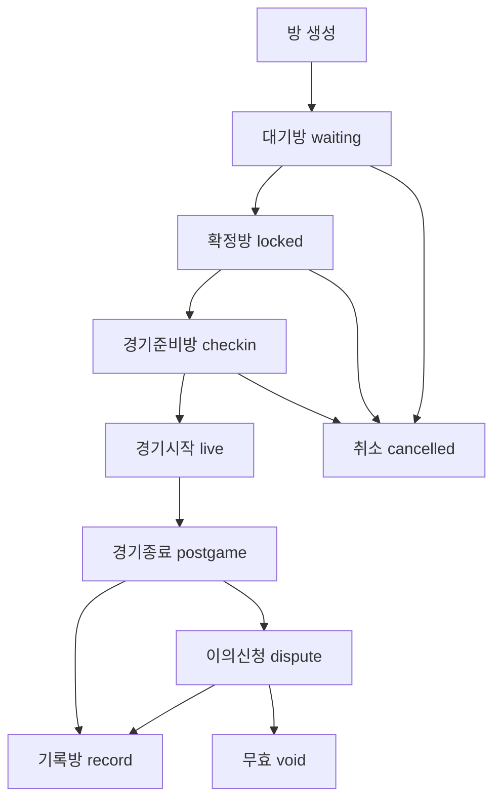
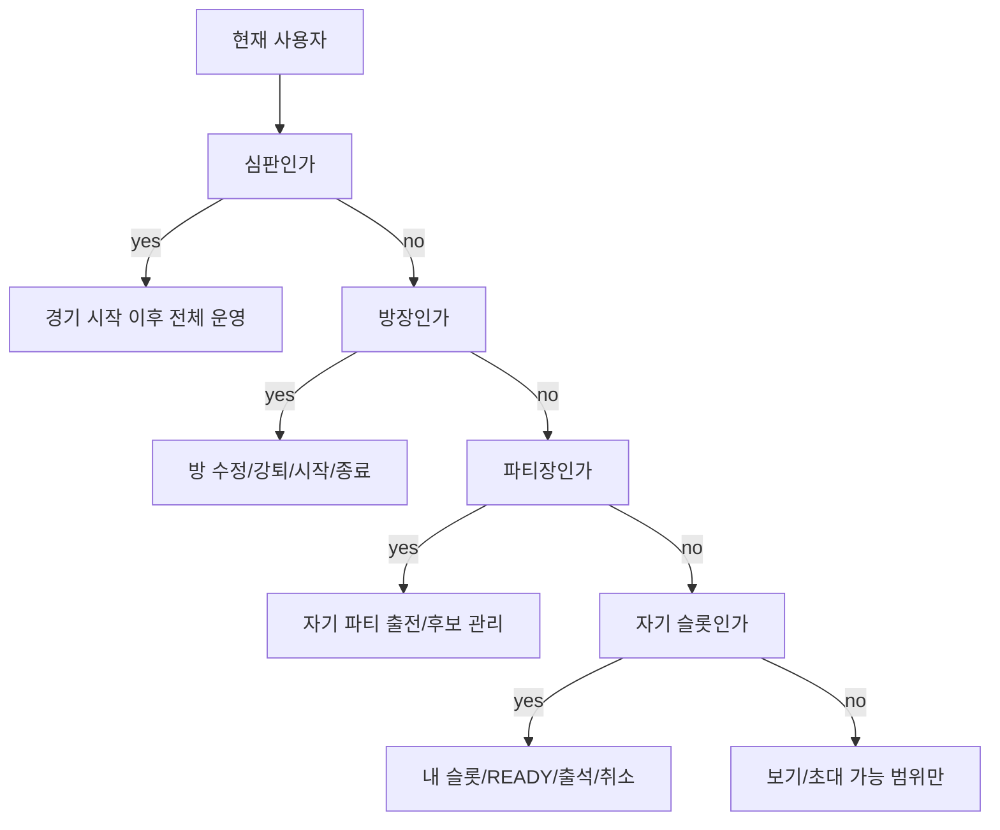

# RankBall 로직/용어/디자인 기준

이 문서는 앞으로 RankBall을 수정할 때 기준으로 삼는 원칙이다.
화면 문구, 방 로직, 권한, 데이터 변환, 디자인은 이 문서를 먼저 본다.

UI/CSS/반응형/라이트·다크 세부 기준은 `docs/design-system.md`를 우선한다.
로직을 고치면 이 문서, 디자인을 고치면 `docs/design-system.md`를 같은 커밋에서 갱신한다.

## 최상위 원칙

1. 방은 하나다.
   - 공개방, 비공개방, 매칭 메뉴, 경기 메뉴가 보는 방 모달은 같은 모델과 같은 컴포넌트를 써야 한다.
   - 메뉴마다 다른 모달, 다른 슬롯 계산, 다른 권한 계산을 만들지 않는다.

2. 카드와 모달은 같은 계산값을 쓴다.
   - 목록 카드, 방 모달, 경기 메뉴, 홈 액션 큐는 모두 `getRecruitingLobby`, `getMatchRoomPhase`, `getMatchRecordWindow` 같은 중앙 함수 결과를 써야 한다.
   - 화면에서 직접 인원수, 상태, 파티, 후보, READY를 다시 계산하지 않는다.

3. 팀과 파티를 섞지 않는다.
   - 팀은 실제 소속 단위다.
   - 파티는 한 방 안에서 MMR을 같이 반영받는 참가 묶음이다.
   - A/B는 팀이 아니라 사이드다.

4. 상태는 한 방향으로만 흐른다.
   - 대기방 -> 확정방 -> 경기준비방 -> 경기시작 -> 경기종료 -> 이의신청 -> 기록방.
   - 뒤로 돌리는 예외는 `dispute -> approval 재개`, `cancelled`, `void`처럼 명시된 함수로만 한다.

5. 버튼은 지금 가능한 행동만 보여준다.
   - 누르면 안 되는 버튼을 흐리게 남발하지 않는다.
   - 비활성 버튼이 필요하면 바로 옆에 이유가 보여야 한다.

6. 심판이 있으면 경기 시작 이후 권한은 심판이 우선한다.
   - 경기 전 운영은 방장.
   - 경기 시작 이후 기록, 종료, 이의 처리, 결과 처리 권한은 심판 우선.
   - 심판이 없으면 방장이 운영자다.

7. 후보는 보조 줄이 아니라 선수 슬롯이다.
   - 후보 슬롯도 출전 슬롯과 같은 너비/높이/아바타 규칙을 쓴다.
   - 후보는 출전 부족 시 자동 승격될 수 있다.
   - 후보는 기록자/교체/출석/신고 대상이 될 수 있다.

8. 라이트/다크는 같은 레이아웃과 같은 배경 좌표를 쓴다.
   - 라이트는 낮 이미지, 다크는 밤 이미지를 쓴다.
   - 같은 화면 위치면 같은 구도와 같은 크롭이어야 한다.
   - 배경 두 장을 겹쳐 쓰지 않는다.

9. 데모데이터도 실제 생성 플로우와 같은 shape이어야 한다.
   - 손으로 만든 예외 shape은 버그 원인이 된다.
   - 데모는 `createRecruitingPost`, `confirmRecruitingMatch`, `startMatch`, `submitMatchResult` 같은 실제 함수 경로로 만든 데이터와 맞춰야 한다.

10. `mockData/localStorage/Supabase` 혼합 구조는 당장 갈아엎지 않는다.
    - 지금은 UI/로직 개발 우선.
    - 프로덕션 전환 TODO는 `docs/data-storage-model.md`에 둔다.

## 고정 용어

| 용어 | 뜻 | 금지 표현/주의 |
| --- | --- | --- |
| 계정 | Supabase Auth user. Google OAuth 기준 | 데모 ID와 실제 UUID를 섞어 비교하지 않기 |
| 프로필 | 앱에서 쓰는 선수 정보. 이름, 해시태그, 포지션, 지역, 연령군, 티어 | 계정과 1:1 |
| 팀 | 실제 소속 팀. 예: Noeul Kings | 방의 A팀/B팀이라는 말 금지 |
| 파티 | 방 안에서 같은 실제 팀으로 묶인 참가 단위 | 팀과 같은 말로 쓰지 않기 |
| 사이드 | 경기방의 A/B 진영 | 화면 표기는 A사이드/B사이드 |
| 출전 슬롯 | 실제 경기에 뛰는 자리 | 후보와 합쳐서 인원수 혼동 금지 |
| 후보 슬롯 | 경기 밖 대기 선수 자리. 사이드별 최대 2명 | 후보팀, 충원팀 금지 |
| 방 | 매칭/경기 운영 단위 | 매칭방/경기방을 UI만 다르게 만들지 않기 |
| 대기방 | 확정 전 모집/초대 상태 | 매칭 목록에 노출 가능 |
| 확정방 | 출전 명단과 룰이 확정된 경기 전 방 | 점수판 노출 금지 |
| 경기준비방 | 출석 확인, 미도착 처리, 마지막 룰 수정 단계 | 출석/강퇴/수정 버튼 필요 |
| 경기시작 | 기록판이 열린 상태 | 심판/기록자 권한 우선 |
| 경기종료 | 결과 입력과 따봉, 사후 인원 추가가 가능한 상태 | 개인활약 수정 범위 제한 |
| 이의신청 | 짧은 분쟁 처리 상태 | 복잡한 중복 분쟁은 고객센터 |
| 기록방 | 확정된 기록 열람 상태 | 진행 메뉴에는 오래 노출하지 않기 |
| 방장 | 방 생성자. 공개방에서는 노란 왕관 | 팀 주장과 다름 |
| 파티장 | 해당 파티 대표. 팀전 B사이드 대표 등 | 방장 권한과 다름 |
| 사이드장 | 해당 사이드의 운영 대표. 비공개 팀전은 초대 수락자, 공개/비공개 개인전은 현재 사이드 첫 리더 | 팀장과 다름 |
| 팀장/주장 | 실제 팀 관리 권한자 | 방 모달 권한과 직접 연결하지 않기 |
| 심판 | 신뢰도/시험 조건을 통과한 경기 운영자 | 경기 시작 이후 방장보다 우선 |
| 기록자 | 심판이 없을 때 기록을 맡는 후보/참가자 | 심판 있으면 보조 권한 없음 |
| READY | 현재 룰과 현재 슬롯에 동의 완료 | 동의, 대기완료 등과 섞지 않기 |
| WAIT | 확인/동의 필요 | 대기방 상태와 섞지 않기 |
| CONFIRM | 룰 변경 후 다시 확인하는 버튼 | 단순 참가 버튼으로 쓰지 않기 |

## 2026-06-24 계정-프로필 1:1 원칙

1. 실제 Google/Supabase `auth.users.id` 하나는 RankBall 프로필 하나에만 연결한다.
2. 앱 상태에서는 `user.authUserId`로 연결하고, normalized Supabase에서는 `profiles.auth_user_id` unique index로 막는다.
3. 실제 auth 프로필은 Settings의 테스트 계정 전환으로 바꾸지 못한다.
4. `test-*`와 local demo 계정은 개발 검증용 전환을 유지한다.

## 2026-06-24 가입정보 고정 원칙

1. 최초 로그인 후 `onboardingComplete`, `handleLockedAt`, `birthYearLockedAt` 중 하나라도 없으면 `/app/signup`으로 보낸다.
2. 해시태그는 `#` 접두어를 쓰고 최초 등록 후 수정할 수 없다.
3. 해시태그는 프로필 전체에서 중복될 수 없다.
4. 출생연도는 최초 등록 후 수정할 수 없다.
5. 닉네임은 변경 가능하지만 `nameUpdatedAt` 기준 월 1회만 허용한다.

## 데이터 축

| 데이터 | 현재 위치 | 역할 |
| --- | --- | --- |
| `users` | `src/lib/mockData.js`, repository state | 프로필, 티어, 포지션, 신뢰도, 심판 자격 |
| `teams` | repository state | 실제 팀, 팀원, 팀 MMR, 팀장 |
| `recruitingPosts` | repository state | 대기방/매칭방 원본 |
| `matches` | repository state | 확정 이후 실제 경기 원본 |
| `tournaments` | repository state | 리그/토너먼트 |
| `notifications` | repository state | 홈 액션/초대/오류 안내 |
| `settings` | repository state | 테마, 즐겨찾기, 차단, 심판 시험 |
| `reports` | repository state | 경기 후 신고, 설정 신고 |

## 관리자 메뉴 원칙

1. 관리자 메뉴는 권한자만 Settings 진입 카드와 `/app/admin` 화면을 볼 수 있다.
2. 현재 프론트 권한은 mock/localStorage UX 차단이며 배포 보안이 아니다.
3. 배포 전 관리자 작업은 서버 권한, Supabase RLS, server-side `auditLog`가 필요하다.
4. 신고/기록 검토는 전체 나열이 아니라 구장별, 플레이어별, 경기별 정렬 큐로 본다.
5. 구장별 큐는 해당 구장 경기, 구장 등록요청, 허위 구장 신고를 묶는다.
6. 플레이어별 큐는 신고 대상, 구장 요청자, 관련 경기 이력을 묶는다.
7. 경기별 큐는 한 경기의 신고, 기록 오류, 이의제기 상태를 묶는다.
8. 관리자 처리 액션은 나중에 서버 액션으로 붙이고, 모든 처리에는 사유와 로그가 필요하다.
9. 모든 신고 처리 결과는 신고자에게 알림으로 피드백한다.
10. 악성 신고자는 제재 대상이 될 수 있다.
11. 제재 기간은 3일, 1주, 2주, 4주, 6주, 8주, 24주, 40주 단계로 둔다.
12. 심판 임명과 관리자 임명은 `startsAt`, `endsAt`, `appointedBy`, `reason`을 가진 기간제 권한이다.
13. 관리자 등급은 `owner` 최고관리자, `senior` 선임관리자, `regionManager` 지역관리자, `matchManager` 경기관리자, `support` 보조관리자 순서로 둔다.
14. 최고관리자는 1명이며 선임관리자는 관리자 임명을 제안할 수 있다.
15. 지역관리자는 해당 지역 구장과 대회 관리를 맡는다.
16. 경기관리자는 플레이어, 경기, 기록, 신고 처리를 맡는다.
17. 심판 등급은 `official`, `platinum`, `gold`, `silver`, `candidate` 순서로 둔다.
18. `official`은 공인 자격증 인증 기준이며, 나머지는 경기 수행, 따봉, 신고율 기준으로 승급/강등한다.
19. 상위 등급만 하위 등급 임명을 제안할 수 있고, 최종 적용은 서버 권한과 `auditLog`를 통과해야 한다.
20. 만료된 임명은 자동 비활성으로 취급한다.
21. 관리자 액션은 커밋 직전 같은 신고의 최신 상태와 `adminAuditLog`를 다시 확인해야 한다.
22. 실시간 중복 방지는 프론트가 아니라 서버 트랜잭션 또는 DB constraint 기준으로 보장한다.

팀명:
- 생성 시 최대 14자.
- 경기/매칭 방 요약 박스에서 넘치는 팀명은 만들 수 없다.

## 중앙 계산 함수

이 함수들은 화면마다 새로 만들면 안 된다.

| 함수 | 파일 | 쓰임 |
| --- | --- | --- |
| `normalizeRecruitingPost` | `src/lib/recruiting.js` | 대기방 shape 정규화 |
| `getRecruitingLobby` | `src/lib/recruiting.js` | 방 슬롯, 사이드, 후보, 자동승격, 확정 가능 여부 |
| `getRecruitingRoomOwnerId` | `src/lib/recruiting.js` | 방장 판정 |
| `isRecruitingPostForUser` | `src/lib/recruiting.js` | 내 방/내 참여방/후보/초대 포함 여부 |
| `getPendingRecruitingInvitations` | `src/lib/recruiting.js` | 초대장 목록 |
| `getPublicRoomTimingStatus` | `src/lib/matchUtils.js` | 공개방 일정/확정 가능 시간 |
| `getMatchRoomPhase` | `src/lib/matchUtils.js` | 경기 단계 표시 |
| `getMatchRecordWindow` | `src/lib/matchUtils.js` | 기록/이의 시간 창 |
| `getAllowedStatFields` | `src/lib/matchUtils.js` | 누가 어떤 개인활약을 입력 가능한지 |
| `getStatSubmissionStatus` | `src/lib/matchUtils.js` | 개인활약 제출 상태 |
| `getResultPointAudit` | `src/lib/matchUtils.js` | 득점 합산과 팀 점수 일치 여부 |
| `calculatePlayerStatBoost` | `src/lib/matchUtils.js` | 개인활약 MMR 보정 |

## 화면과 데이터 연결

| 화면 | 경로 | 데이터 | 원칙 |
| --- | --- | --- | --- |
| 홈 | `/app` | 초대, 해야 할 일, 내 일정, 최근 기록 | 지금 처리할 일만 노출 |
| 경기 만들기 | `/app/create` | draft -> 방/대회 생성 | 개인전/팀전/공개/비공개 분기 명확 |
| 경기 | `/app/matches` | 내 일정, 캘린더, 확정 이후 경기 | 매칭 메뉴와 같은 방 모달 사용 |
| 매칭 | `/app/recruiting` | 대기방 목록 | 공개/비공개 모두 같은 모달 |
| 진행 | `/app/recorder` | live/postgame/dispute 중 처리 가능한 경기 | 기록 확정 후 24시간 이후 숨김 |
| 팀 | `/app/teams` | 내 팀, 팀 관리, 팀 랭킹 | 팀은 실제 소속 단위만 |
| 나 | `/app/profile` | 내 프로필, 티어, 기록 더보기 | school/company 제거, 지역/연령 기반 |
| 설정 | `/app/settings` | 테마, 신고, 심판 신청, 구장 등록 요청 | 긴 내용은 별도 페이지로 분리 |

## 구장 등록 원칙

1. 구장 등록요청은 신뢰도 70점 이상만 가능하다.
2. 구장 등록요청에는 Naver 주소검색으로 선택한 실제 주소와 상세 위치 메모가 있어야 한다.
3. 지도 핀 저장은 Naver Maps JavaScript 키가 있을 때만 선택적으로 위도/경도를 저장한다.
4. 허위 구장 등록요청은 `court_request` 신고로 접수한다.
5. 같은 유저가 같은 구장 등록요청을 중복 신고할 수 없다.
6. 허위 구장 신고가 접수되면 요청자 신뢰도는 8점 감소한다.
7. 구장 등록요청 폼과 Naver 주소검색 버튼은 신뢰도 기준을 통과한 사용자에게만 렌더링한다.
8. 프론트 숨김은 API 사용량 완화용 UX일 뿐 보안이 아니다. 배포 백엔드는 읽기 전용 `GET /api/courts/address-search?q=...` endpoint에 인증, 신뢰도 검사, rate limit, 도메인 제한을 적용해야 한다.

## 방 속성

| 속성 | 값 | 의미 |
| --- | --- | --- |
| 공개 여부 | `public`, `private` | 목록 노출과 참여 방식 |
| 참가 방식 | 개인전, 팀전 | 팀을 미리 묶는지 여부 |
| 팀 전용 | `teamOnly` | 공개방에서 팀 파티만 참여 가능 |
| 경기 종류 | 정규전, 친선전 | MMR 반영 여부 |
| 일정 방식 | 예약, 즉시 | 날짜/시간 필요 여부 |
| 방식 | `1v1`, `2v2`, `3v3`, `5v5` | 사이드별 출전 슬롯 수 |
| 후보 | 사이드별 최대 2명 | 자동승격/기록/교체 대상 |
| MMR 허용구간 | 좁게, 보통, 넓게 | 넓을수록 MMR 반영 낮음 |
| 연령 제한 | Junior, Rising, Open 조합 | 세 개 선택이면 연령무관 |
| 심판 | 없음/있음 | 경기 시작 이후 권한 분기 |
| 구장 예약됨 | true/false | 예약금/비용은 룰 메모에 적음 |

## 방 생성 원칙

### 비공개 팀전

1. A사이드는 방장 사이드다.
2. 방장은 반드시 A사이드 파티장이다.
3. 방장은 자기 소속 팀 중 하나를 고른다.
4. 출전 인원은 경기 방식에 맞게 모두 채워야 한다.
   - 3v3이면 A사이드 출전 3명 필요.
   - 후보는 0~2명 가능.
5. B사이드는 상대 팀 검색으로 고른다.
6. B사이드도 출전 인원을 모두 채워야 한다.
7. B사이드 파티장을 방장이 지정한다.
8. 초대 방식은 둘 중 하나다.
   - 파티장만 수락: B사이드 파티장이 수락하면 B사이드 전체 READY.
   - 전원 수락: 초대된 전원이 수락해야 READY.
9. 팀전에서는 사이드 이동 금지.
10. 팀전에서 다른 사이드로 가려면 파티에서 나가 개인 참가로 전환해야 한다.

### 비공개 개인전

1. 팀 선택 없음.
2. 방장이 초대한 사람만 들어온다.
3. 직접 참여는 막고 초대 수락으로만 참가한다.
4. 같은 사이드에 같은 실제 팀 소속 선수가 있으면 파티 맺기 제안 가능.
5. A/B사이드는 각자 내 슬롯 관리에서 이동 가능.
6. 비공개 개인전도 같은 방 모달을 쓴다.

### 공개 개인방

1. 공개 목록에 노출된다.
2. 누구나 빈 슬롯에 개인으로 참여 가능.
3. 기본 참여 방식은 개인이다.
4. 같은 사이드에 같은 실제 팀 소속이 있으면 파티를 만들 수 있다.
5. 팀 파티 참여도 가능하지만 팀 전용이 아니면 개인 참여가 기본이다.
6. 팀 파티로 참여하면 본인만 즉시 슬롯에 들어가고, 선택한 나머지 팀원에게는 초대장이 간다.
7. 초대받은 팀원이 수락하기 전에 출전 슬롯이 차면 후보로 자동 전환된다.
8. 출전 슬롯과 후보 슬롯이 모두 차면 초대장은 만료된다.
9. 빠른참여는 쓰지 않는다.

### 공개 팀전/팀 전용

1. 방장 사이드는 팀으로 채워야 한다.
2. 상대 사이드도 팀 파티로만 참여 가능하다.
3. 상대 팀으로 참여하는 사람이 B사이드 파티장이 된다.
4. 상대 팀 참여자는 자기 자신만 즉시 슬롯에 들어가고, 선택한 나머지 팀원에게는 초대장이 간다.
5. 초대받은 팀원은 수락해야 출전/후보 슬롯에 들어간다.
6. 초대받은 팀원이 수락하기 전에 출전 슬롯이 차면 후보로 자동 전환된다.
7. 출전 슬롯과 후보 슬롯이 모두 차면 초대장은 만료된다.
8. 출전은 경기 방식 수만큼, 후보는 최대 2명까지 가능하다.
9. 팀 전용 공개방에서는 개인 참여를 막는다.
10. 팀 전용 공개방에서는 다른 팀 초대/참여를 아무나 할 수 없다.
   - B사이드를 점유한 팀 파티 구성원만 자기 팀원을 초대할 수 있다.

### 즉시 방

1. 날짜/시간 입력 없이 생성 가능해야 한다.
2. 즉시 방은 경기준비방으로 바로 넘어갈 수 있다.
3. 즉시 대기방은 제한시간 안에 인원이 안 차면 자동 취소된다.
4. 즉시 방도 공개/비공개/개인/팀전 원칙은 그대로 따른다.

### 예약 방

1. 공개방은 5일 이내만 생성.
2. 공개방 확정은 경기 24시간 전부터 4시간 전까지만 가능.
3. 비공개방은 1개월 이내만 생성.
4. 과거 날짜 생성 금지.
5. 공개방은 너무 먼 날짜를 만들지 않는다.

## 방 단계

| 단계 | 표시 | 원본 상태 | 보여줄 것 | 주요 행동 |
| --- | --- | --- | --- | --- |
| 대기방 | `waiting` | `recruitingPosts.status=open` | 룰, 슬롯, 후보, 초대, 채팅 | 참여, 초대, READY, 방 수정, 취소 |
| 확정방 | `locked` | `matches.status=agreed/contract`, 시작 전 | 룰, 출전/후보, 채팅 | 방 수정, 취소, 일정 확인 |
| 경기준비방 | `checkin` | 즉시방 또는 경기 임박/도달 | 출석, 미도착, 룰, 슬롯 | 출석체크, 강퇴, 인원/룰 수정, 시작 |
| 경기시작 | `live` | `startedAt` 있음 | 기록판, 채팅 | 기록 입력, 기록자 인수인계, 경기 종료 |
| 경기종료 | `postgame` | `endedAt` 있음 | 기록판, 따봉, 사후 인원 | 결과/개인활약 제출, 사후 추가 |
| 이의신청 | `dispute` | `status=approval/disputed`이고 창 열림 | 기록, 이의 내역 | 열람만 |
| 기록방 | `record` | `status=confirmed` 또는 이의 시간 만료 | 읽기 전용 기록 | 열람만 |
| 취소 | `cancelled` | `status=cancelled` | 취소 사유 | 보기만 |
| 무효 | `void` | `status=void` | 무효 사유 | 보기만 |

## 상태 전환

## 권한 원칙

| 역할 | 대기방 | 확정방 | 경기준비방 | 경기시작 이후 |
| --- | --- | --- | --- | --- |
| 방장 | 방 수정, 초대, 강퇴, 확정, 취소 | 방 수정, 취소 | 심판 없을 때 출석 관리, 강퇴, 룰 수정, 시작 | 심판 없을 때 종료/결과/이의 처리 |
| 파티장 | 자기 파티 출전/후보 조정 | 자기 파티 확인 | 자기 파티 출석 독려 | 기록 보조 없음 |
| 팀장 | 팀 관리 화면 권한 | 방 모달 권한 없음 | 방 모달 권한 없음 | 방 모달 권한 없음 |
| 출전 선수 | 내 슬롯 관리, 초대, READY | 확인 | 출석 대상 | 자기 기록 확인/따봉/신고 |
| 후보 선수 | 내 후보 슬롯 관리, 초대, READY | 확인 | 출석 대상 | 기록자 가능, 교체 가능, 신고 가능 |
| 심판 | 심판 표시 | 심판 표시 | 심판 배정 경기의 출석, 강퇴, 룰 수정, 시작 | 기록/종료/이의/결과 처리 우선 |
| 기록자 | 심판 없을 때만 후보/참가자 기반 | 표시 | 대기 | 자기 사이드 기록 입력 |

권한 우선순위:

1. 심판
2. 방장
3. 파티장
4. 자기 슬롯 본인
5. 일반 참가자

단, 팀장은 방 모달 권한 우선순위에 들어오지 않는다.

사이드장 기준:

1. 비공개 팀전 대기방에서는 B사이드 초대를 받은 사람이 수락하면 그 사람이 B사이드장이다.
2. 확정 경기에서는 `match.parties[].partyLeaderId`가 현재 로스터에 있으면 그 사람이 사이드장이다.
3. 공개방 또는 비공개 개인전에서 사이드장이 미출석 강퇴되면 같은 파티의 다음 인원, 없으면 해당 사이드 다음 출전 선수가 즉시 사이드장이 된다.
4. 팀장/주장은 사이드장 fallback 기준이 아니다.
5. 팀 파티의 사이드장은 “파티 만든 사람”이라는 표현을 쓰지 않고, 팀 파티를 등록한 계정 또는 초대 수락자로 본다.

## 왕관 표시

| 표시 | 조건 |
| --- | --- |
| 노란 왕관 | 방장 |
| 파란 왕관 | 사이드장/파티장 |
| 팀장 표시 | 팀 관리 화면 또는 팀 프로필에서만 |

겹치면 노란 왕관만 표시한다.
공개방/비공개방 모두 사이드장 기준이 필요하면 파란 왕관을 표시한다.
팀 주장은 파란 왕관 기준이 아니다.

## 슬롯 원칙

1. 출전 슬롯과 후보 슬롯은 같은 컴포넌트 크기를 쓴다.
2. 슬롯 내용이 들어와도 너비와 높이가 변하면 안 된다.
3. 한 사이드 출전 슬롯은 최대 5개를 한 줄 기준으로 정렬한다.
4. 후보 슬롯은 사이드별 최대 2개다.
5. 빈 슬롯을 누르면 그 자리 기준 액션 팝업이 떠야 한다.
6. 액션 팝업은 최상단 포털로 떠야 하고, 부모 박스에 잘리면 안 된다.
7. 모바일에서는 팝업이 화면 안으로 들어오게 위치 보정한다.
8. 내 슬롯을 누르면 프로필 카드가 아니라 내 슬롯 관리 메뉴가 먼저 떠야 한다.
9. 다른 사람 슬롯은 프로필 미리보기 또는 초대/강퇴 권한 메뉴를 분리한다.
10. 팀 파티로 참여할 때 기본 출전 선택 수는 선택 사이드의 남은 출전 슬롯 수를 넘지 않는다.
11. 팀 파티로 참여할 때 기본 후보 선택 수는 선택 사이드의 남은 후보 슬롯 수를 넘지 않는다.

## 파티 원칙

1. 파티는 같은 방 안에서만 유효하다.
2. 파티 ID는 방 안에서 고정된다.
   - 방장 파티: `host`
   - 팀 파티: `team:{teamId}`
3. 파티원이 같은 사이드에 있으면 파티 유지.
4. 파티원이 후보로 내려가도 같은 사이드면 파티 유지.
5. 파티원이 다른 사이드로 가려면 먼저 파티에서 나가야 한다.
6. 파티에서 나가면 슬롯 표시는 개인 참여로 바뀐다.
7. 파티에서 나가도 `sourceTeamId`, `sourceEntryId`는 보존한다.
8. 같은 사이드에 같은 실제 팀 파티가 있으면 다시 파티 합류 가능.
9. 같은 사이드에 같은 실제 팀 파티가 두 개 이상이면 선택 UI를 띄운다.
10. 혼자 남은 파티는 파티 테두리/연결선을 표시하지 않는다.

## 파티 시각화

1. 파티 전체를 하나의 연한 배경 박스로 감싼다.
2. 각 슬롯 간격은 변하지 않는다.
3. 파티 내부에 `o-o-o` 느낌의 연결선을 표시한다.
4. 연결선은 슬롯 위/아래 텍스트를 가리면 안 된다.
5. 모바일에서는 연결선보다 파티 전체 배경과 외곽선 우선.
6. 파티원이 1명뿐이면 파티 표시를 숨긴다.

## 후보/자동승격

1. 후보는 사이드별 최대 2명.
2. 경기 확정 시 출전 슬롯이 비어 있고 READY 후보가 있으면 왼쪽 후보부터 자동 승격.
3. 고정 후보는 자동 승격하지 않는다.
4. 자동 승격된 선수는 `promotedReserveIds`에 남긴다.
5. 후보가 자동 승격되면 후보 슬롯은 비워진다.
6. 후보가 경기 중 실제 출전하면 `playedPlayerIds`에 들어간다.
7. 경기 후 추가된 선수는 MMR 제외가 기본이다.

## 초대 원칙

1. 방에 참여한 사람만 초대 가능.
2. 빈 출전 슬롯과 빈 후보 슬롯에서 바로 초대 가능.
3. 해시태그로 선수/팀 검색 가능.
4. 팀 해시태그를 입력하면 팀원 선택 체크박스가 뜬다.
5. 출전 초대 수락 시 출전 슬롯이 차 있으면 후보로 자동 전환한다.
6. 출전 슬롯과 후보 슬롯이 모두 차 있으면 초대 수락 실패.
7. 출전 명단 확정 후 남은 초대장은 만료.
8. 초대받은 방은 홈 액션 큐와 매칭 필터에서 눈에 띄게 표시.
9. 초대 수락 후 바로 해당 방 모달을 연다.

## READY/CONFIRM 원칙

| 상황 | 버튼 |
| --- | --- |
| 처음 룰 확인 | `READY` |
| 룰 수정 후 재확인 | `CONFIRM` |
| 방장이 자기 방 수정 | 방장 본인 `CONFIRM` 불필요 |
| 후보 | 경기 확정 때 미확인 후보는 자동 취소 가능 |
| 참가 취소 | 내 슬롯/후보 슬롯을 비운다 |

`READY`가 된 사람이 다시 동의 버튼을 보게 하면 안 된다.
`CONFIRM`은 룰 변경 후 재확인에만 쓴다.

## 경기준비방 원칙

1. 확정방은 경기 시간 30분 전부터 경기준비방이 되는 것이 목표다.
2. 현재 구현은 즉시방 또는 예정 시간 도달 기준이 섞일 수 있으니 중앙 함수로만 판단한다.
3. 출석체크는 출전 선수와 후보 모두 대상이다.
4. 출석체크는 심판이 있으면 심판, 심판이 없으면 방장이 처리한다. 본인이 직접 출석 버튼으로 처리하지 않는다.
5. 미출석 선수는 심판이 있으면 심판, 심판이 없으면 방장이 강퇴할 수 있어야 한다.
6. 경기 직전 결원이 생기면 방 수정 가능. 심판이 있는 경기준비방에서는 심판이 처리한다.
7. 팀전이어도 경기준비방에서는 현실 대응을 위해 룰/인원 수정 가능.
8. 정규전에서 사후 인원 수정은 MMR 반영을 낮추거나 제외한다.
9. 심판이 있으면 경기준비방의 출석/인원/룰/시작과 경기 시작 이후 운영권은 심판이 우선한다.
10. 미출석 출전선수를 강퇴하거나 후보로 내렸을 때 같은 사이드에 출석한 후보가 있으면 자동으로 출전 슬롯에 올릴 수 있다.
11. 배정 심판이 경기준비방에 오지 않으면 방장이 `심판 미출석`을 요청하고 상대 사이드장이 인정해야 심판 없는 경기로 전환된다.
12. 심판 미출석 인정 후에는 `refereeId`를 비우고 `formerRefereeId`, `refereeAbsenceRequest`만 남긴다. 이후 출석/인원/룰/시작 권한은 심판 없는 방처럼 방장에게 간다.
13. 심판 없는 방에서 방장이 출전/후보 명단에 포함되어 있으면 경기 시작 시 방장 본인 출석은 자동 기록한다. 별도 self-check 버튼은 만들지 않는다.

## 경기 시작/종료 원칙

1. 경기 시작은 심판이 있으면 심판, 심판이 없으면 방장이 누른다.
2. 경기 종료는 심판이 있으면 심판, 심판이 없으면 방장이 누른다.
3. 심판이 있으면 심판이 우선한다.
4. 경기 중 기록은 실시간 저장되어야 한다.
5. 다른 사람이 저장한 값도 같은 기록판에 반영되어야 한다.
6. 경기 중 기록판은 후보까지 함께 열어 교체 때마다 기록 입력 대상이 열리고 닫히지 않게 한다.
7. 경기 종료 후에는 개인활약 수정 범위를 줄인다.
8. 점수와 파울은 중요하므로 종료 후에도 제한된 시간 안에 수정 가능해야 한다.
9. 경기 종료 후 갑자기 뛴 사람이 있으면 방장/심판이 등록 가능.
10. 무기명 추가 선수는 기록에는 남기되 MMR 반영 제외.

## 기록 권한

| 조건 | 권한 |
| --- | --- |
| 심판 있음 | 심판이 전체 기록 |
| 심판 없음 + 후보 기록자 있음 | 기록자가 자기 사이드 전체 기록 |
| 심판 없음 + 기록자 없음 | 본인 득점 중심 입력 |
| 경기 후 방장/심판 사후 추가 | 추가 선수 득점 기록 가능, MMR 제외 |

개인활약 항목:

| 항목 | 의미 | 원칙 |
| --- | --- | --- |
| 득점 | 실제 득점 | 팀 점수 합산 기준 |
| 리바운드 | 공격/수비 리바운드 | 기록 가능하면 입력 |
| 어시스트 | 직접 득점으로 이어진 패스 | 기준 룰북 참고 |
| 스틸 | 상대 소유권을 뺏은 수비 | 단순 루즈볼과 구분 |
| 블록 | 슛 시도 방해 성공 | 파울과 구분 |
| 파울 | 개인 파울 | 평균 파울/신뢰도에 반영 |

득점만 입력해도 경기는 성립한다.
다만 심판/기록자가 있으면 전체 개인활약을 최대한 입력한다.

## 이의신청 원칙

1. 이의신청 창은 경기 종료 후 최대 30분.
2. 짧고 단순해야 한다.
3. 복잡한 모순 이의는 고객센터/관리자 처리로 넘긴다.
4. 이의제기는 경기 참가자, 후보, 기록자, 방장, 심판이 할 수 있다.
5. 심판이 있으면 심판이 처리한다.
6. 심판이 없으면 방장이 처리한다.
7. 이의신청부터 방 모달은 열람 전용이다. 채팅 입력, 슬롯 관리, 초대, 방 수정, 경기 운영 버튼은 닫는다.
8. 이의신청이 접수되면 기존 결과를 `disputeDraftResult`로 복제한다.
9. 이의 수정 중에는 `match.result`를 직접 덮지 않고 `disputeDraftResult`만 임시 저장한다.
10. 이의 처리자는 심판이 있으면 심판, 심판이 없으면 방장이다.
11. 이의 처리자가 수정안을 확인하면 양팀 재승인 없이 바로 결과를 확정한다.
12. 확정 후 불복은 재승인이 아니라 신고로 처리한다.
13. 무효가 필요하면 무효 처리한다.
14. 시간이 지나면 기록방으로 넘어간다.

## 따봉/신뢰도 원칙

1. 선수 따봉과 방장 따봉은 같은 기록방 프로세스에서 준다.
2. 기록 확정 후 24시간 동안만 가능.
3. 안 주면 무효 처리, 패널티 없음.
4. 출전 선수 수의 절반 정도를 따봉 한도로 둔다.
5. 심판/기록자/방장도 따봉 대상이 될 수 있다.
6. 강퇴 남발, 잠수, 미출석, 확인 미응답은 신뢰도 하락.
7. 후보 기록자 수행, 좋은 평가, 안정적 방 운영은 신뢰도 상승.

## 신고 원칙

1. 경기 종료 후 또는 설정 메뉴에서 신고 가능.
2. 경기 기반 신고는 최근 1주일 내 경기만 선택.
3. 신고 대상은 출전 선수, 후보, 심판, 기록자, 방장 모두 가능.
4. 신고 화면에는 해당 경기의 사이드, 역할, 활약 기록이 보여야 한다.
5. 신고는 사유를 먼저 선택하고, 선택한 사유에 맞는 대상 검색을 연다.
6. 선수 사유는 최근 1주일 내 내 경기 참여자만 검색한다.
7. 기록/결과 사유는 최근 1주일 내 내 경기기록만 검색한다.
8. 허위 구장 등록 사유는 신고 가능한 구장 등록요청만 검색한다.
9. 경기기록은 해시태그를 가진다. 해시태그는 기록 검색과 관리자 검토에서 같은 식별자로 쓴다.
10. 주요 사유:
   - 나이 속임
   - 티어/MMR 어뷰징
   - 미출석/잠수
   - 욕설/비매너
   - 기록 조작
   - 부당 강퇴

## MMR 원칙

1. 정규전만 MMR 반영.
2. 친선전은 티어 제한 없이 열 수 있다.
3. 좁게/보통/넓게에 따라 허용 구간과 반영률이 달라진다.
4. 넓게 선택하면 MMR 반영률을 낮춘다.
5. 팀 파티로 출전하면 팀 MMR에도 반영.
6. 팀 MMR은 실제 출전한 파티원 비율 기준.
7. 후보만 하고 뛰지 않은 선수는 MMR 반영 제외.
8. 경기 후 추가된 선수는 MMR 반영 제외.
9. 사후 인원 수정이 많으면 정규전 반영률을 낮추거나 무효 처리할 수 있어야 한다.

## 연령군 원칙

| 표시 | 의미 |
| --- | --- |
| Junior | 어린 연령군 |
| Rising | 성장/청소년 연령군 |
| Open | 성인/오픈 연령군 |

1. 방 만들기 기본값은 내 프로필 연령군.
2. 모두 버튼은 두지 않는다.
3. 세 개를 모두 선택하면 연령무관.
4. Junior + Open만 선택은 금지.
5. Junior + Rising 가능.
6. Rising + Open 가능.
7. 시즌이 바뀌면 연령군 재확인 필요.
8. 시즌은 상반기/하반기 기준으로 둔다.

## 팀 원칙

1. 한 계정은 최대 3개 팀 소속.
2. 팀장은 팀 관리 권한자다.
3. 팀장은 방 안에서 자동 권한을 갖지 않는다.
4. 팀전 방에서는 파티장이 방 권한자다.
5. 팀 카드는 엠블럼 중심으로 보여준다.
6. 프로필 사진 같은 장식은 팀 카드에서 쓰지 않는다.
7. 팀 랭킹 기준은 팀 MMR 우선, 동률이면 승률/경기수.
8. 팀 삭제는 팀장만 가능.

## 구장 원칙

1. 구장은 해시태그를 가진다.
2. 구장 해시태그는 사용자가 정하지 않고 요청 생성 시 랜덤 자동 부여.
3. 정식구장과 골대만 있는 장소를 구분할 수 있어야 한다.
4. 구장 등록요청은 Naver 주소검색으로 선택한 실제 주소를 필수로 가진다.
5. 등록 폼에서는 지역, 주소 프리텍스트, 위도, 경도를 직접 입력하지 않는다.
6. 지도 핀 저장은 좌표 보정용 선택값이다.
7. 구장 기본 이름은 주소의 동 이름과 입력 구장명을 합친다. 예: `망원동 나들목 골대`.
8. 주소, 위치 설명, 조명, 유료/무료 여부를 가진다.
9. 구장 예약 여부는 구장 데이터가 아니라 경기방의 `courtReserved` 룰로만 다룬다.
10. 구장 클릭/호버 시 구장 카드가 뜬다.
11. 지도는 카드에서 `지도로 보기`를 눌렀을 때만 연다.
12. 구장 등록 요청은 설정에서 한다.
13. 사진 업로드는 비용/트래픽 때문에 최소화한다.

## 심판 원칙

1. 심판은 신뢰도 기준 이상만 가능.
2. 기본 기준은 `REFEREE_TRUST_MIN = 90`.
3. 심판 시험은 주 1회만 가능.
4. 문제 원문을 그대로 공개하지 않는다.
5. 학습자료는 별도 룰북 페이지로 제공한다.
6. 정식 심판은 자격증 제출 후 수동 등록하는 별도 등급.
7. 일반 심판은 앱 내부 시험/신뢰도 기반.
8. 심판 프로필에는 심판 횟수, 분쟁 처리, 신뢰도, 자격 상태가 보여야 한다.
9. 공개방 심판은 선수 슬롯을 쓰지 않고 `심판참여`로 직접 들어간다.
10. 비공개방 심판은 `roomState.invitations`의 `role: "referee"` 초대 수락으로만 배정된다.
11. 비공개방 심판 초대가 미수락이어도 경기 확정/시작을 막지 않는다. 확정 시점에 수락되어 `post.refereeId`가 있는 심판만 `match.refereeId`로 이동한다.
12. 심판 룰북은 모두에게 공개하지만 시험과 등록요청 폼은 신뢰도 기준 통과자에게만 렌더링한다.

## 메뉴별 노출 원칙

### 홈

홈은 알림판이다.

보여줄 것:

- 초대 수락 필요
- READY/CONFIRM 필요
- 출석체크 필요
- 기록 입력 필요
- 이의/승인 처리 필요
- 취소/변경 알림

보여주지 말 것:

- 그냥 내가 참여 중인 대기방
- 이미 처리한 동의/승인
- 단순 예정 경기 전체 목록
- 해결된 액션

### 경기

경기는 내 일정 중심이다.

- 기본은 내 일정.
- `내 일정`은 처리 필요, 예정, 닫힘을 포함하는 상위 전체 보기다.
- `내 일정` 카운트는 처리 필요, 예정, 닫힘 카운트의 합이다.
- 처리 필요, 예정, 닫힘 카운트는 서로 중복되지 않는다.
- 내 일정에 포함되는 열린 매칭방은 예정 카운트에 포함한다.
- 전체 일정은 기본 노출하지 않는다.
- 캘린더는 내 경기만 표시.
- 지난 경기는 필터 기간에 따라 달력에 표시.
- 날짜 클릭 시 해당 날짜 경기 목록 표시.
- 확정 이후 경기만 주력으로 보여준다.

### 매칭

매칭은 대기방 목록이다.

- 공개 대기방 중심.
- 기본 목록은 공개 대기방만 보여준다.
- 비공개 대기방은 내가 만든 방, 내 참여방, 초대받음, 직접 링크 진입에서만 보여준다.
- 내가 만든 방/내 참여방/초대받은 방 필터.
- 카드에는 참여자 상세를 넣지 않는다.
- 카드에는 상태, 방식, 시간, 구장, 슬롯 현황, 방 보기만 간결하게 둔다.
- 빠른참여는 제거한다.

### 진행

진행은 지금 기록/처리가 필요한 경기만 보여준다.

- live
- postgame
- dispute
- record 전환 후 24시간 이내 필요한 처리

기록 확정 후 오래 지난 경기는 숨긴다.

## 카드 표시 원칙

태그 순서:

1. 단계: `waiting`, `locked`, `checkin`, `live`, `postgame`, `dispute`, `record`
2. 인원: `1v1`, `2v2`, `3v3`, `5v5`
3. 공개 여부: 공개방/비공개방/대회
4. 참가 방식: 개인전/팀전/팀 전용
5. 경기 종류: 정규전/친선전
6. 심판: 심판 있음/없음

금지:

- 공개확정
- 일반
- 사전등록 남발
- FLOW 접두어
- 팀A/팀B 표기
- 참여자 전체 나열
- 같은 정보를 카드 안에서 두 번 반복

## 방 모달 원칙

1. 공개/비공개 모두 같은 모달.
2. 대기방/확정방/준비방/진행방은 같은 골격에서 단계별 패널만 바뀐다.
3. 모달 외부 클릭으로 닫힌다.
4. 모달이 열리면 뒤 페이지 스크롤은 잠긴다.
5. 닫기 버튼은 크고 명확하게.
6. 경기취소는 닫기가 아니라 위험 버튼이다.
7. 규칙, 메모, 약속/벌칙, 구장 예약 정보는 방 모달에 항상 보인다.
8. 심판이 있으면 심판 프로필 진입점이 보인다.
9. 슬롯 액션은 슬롯에서 바로 연다.
10. 목록에서 들어오든 경기 메뉴에서 들어오든 같은 상태와 권한을 보여야 한다.

## 프로필/호버 원칙

1. 데스크톱: hover로 카드 표시.
2. 데스크톱 클릭: 카드 고정.
3. 카드 고정 중에는 다른 hover 카드가 뜨지 않는다.
4. 모바일: 길게 누르거나 탭해서 카드 표시.
5. 모바일에서 프로필 직접 이동은 카드 안의 `프로필 보기`로만 한다.
6. 카드가 부모 박스에 잘리면 안 된다.
7. 아래 공간이 없으면 프로필 상단 기준 위로 뜬다.
8. 팀도 같은 규칙을 쓴다.
9. 방 안에서 내 슬롯 클릭은 프로필 카드보다 내 슬롯 관리가 우선이다.
10. 데모 프로필의 소속 팀은 3개 이하로 유지한다.

## 아바타 원칙

1. 슬롯의 초성 원형 대신 포지션 아바타 사용.
2. 티어는 텍스트가 아니라 엠블럼 이미지로 표현.
3. 슬롯 안에서는 티어 문구/뱃지 제거.
4. hover 프로필에는 티어 상세 유지.
5. 아바타는 기존 슬롯 크기를 키우지 않는다.
6. `object-fit: cover`.
7. `contain` 금지.
8. 하반신은 숨기고 얼굴~상체 중심.
9. 자른 경계가 칼로 자른 느낌이면 안 된다.
10. PG/PF는 공이 보이게 조금 줄인다.
11. C는 엠블럼을 가리지 않게 크기를 줄인다.

## 디자인 시스템 원칙

### 레이아웃

| 항목 | 기준 |
| --- | --- |
| 페이지 최대폭 | 1220~1280px |
| 페이지 gap | 16~20px |
| 카드 radius | 8px 이하 |
| 카드 border | `var(--line)` |
| 카드 배경 | `var(--surface)` 계열 |
| 내부 박스 | 카드보다 한 단계 밝거나 어두운 배경 |
| 모바일 하단 메뉴 | 한 줄, 본문 가리지 않게 |

### 히어로

1. 모든 주요 메뉴는 같은 히어로 구조를 쓴다.
2. eyebrow, H1, 설명, 주요 버튼 순서.
3. 페이지별 배경은 하나만 쓴다.
4. 라이트/다크는 같은 위치/크롭.
5. 라이트는 낮 이미지, 다크는 밤 이미지.
6. 홈/경기/매칭/진행/팀/나/설정의 헤더 크기와 여백은 같은 기준.
7. 모바일에서 필요 없는 숫자 패널은 제거.

### 버튼

| 버튼 | 용도 |
| --- | --- |
| primary | 가장 중요한 1개 행동 |
| secondary | 일반 행동 |
| danger | 취소/강퇴/무효 |
| icon | 닫기, 설정, 검색, 초대 등 |

원칙:

- 한 카드 안에 primary는 최대 1개.
- 텍스트가 넘치면 버튼 폭이 커지는 게 아니라 줄임/축약.
- 위험 행동은 항상 색과 문구가 명확해야 한다.

### 뱃지 색

| 상태 | 색 |
| --- | --- |
| waiting | blue |
| locked | green |
| checkin | orange |
| live | blue/green |
| postgame | orange |
| dispute | orange/danger |
| record | green |
| cancelled/void | neutral |

### 라이트 모드

1. 투명 박스만으로 구분하지 않는다.
2. 카드와 내부 박스 배경 대비를 둔다.
3. 텍스트는 `var(--text)`, 보조는 `var(--muted)`.
4. 다크용 그림이 그대로 보이면 안 된다.
5. 아바타 배경/크롭 경계가 보이면 배경색 또는 마스크를 조정한다.

## 반응형 원칙

1. 가로 스크롤 금지.
2. 카드 내부 그리드는 줄바꿈 허용.
3. 필터가 많으면 가로 스크롤이 아니라 다음 줄로 이동.
4. 모바일에서는 상세 참여자 목록보다 방 보기 우선.
5. 모바일에서는 큰 요약 패널 제거.
6. 슬롯은 화면 폭에 맞게 줄이되 출전/후보 너비는 같아야 한다.
7. 텍스트가 버튼/카드 밖으로 나가면 해당 컴포넌트 문제로 본다.
8. 제목 크기, 카드 간격, 버튼 높이는 화면별 기준을 둔다.

## 상호 연결도

## 권한 연결도

## 수정 우선순위

버그가 날 때는 이 순서로 본다.

1. 데이터 shape이 `normalizeRecruitingPost`를 통과하는가.
2. 카드와 모달이 `getRecruitingLobby` 같은 결과를 쓰는가.
3. 메뉴별로 다른 모달/다른 계산 함수가 남아 있는가.
4. `teamA/teamB`를 화면에서 팀처럼 표시하고 있지 않은가.
5. 방장/파티장/팀장을 섞고 있지 않은가.
6. 심판 있음/없음 권한 분기가 맞는가.
7. 후보 자동승격과 파티 유지가 충돌하지 않는가.
8. `sourceTeamId/sourceEntryId`가 파티 나가기 후에도 보존되는가.
9. 데모데이터가 실제 생성 플로우와 같은 shape인가.
10. 라이트/다크/모바일에서 같은 컴포넌트 기준이 유지되는가.

## 삭제하거나 줄여야 하는 것

| 대상 | 이유 |
| --- | --- |
| 메뉴별 별도 방 모달 | 상태/권한 불일치 원인 |
| 카드 안 참여자 전체 표시 | 공간 낭비, 방 보기에서 확인 가능 |
| 빠른참여 | 약속 부도 위험, 티어/파티 검증 누락 위험 |
| 공개확정/일반/사전등록 남발 | 의미 불명확 |
| 후보팀/충원팀 표현 | 후보는 팀이 아님 |
| 팀A/팀B 화면 표기 | 팀과 사이드 혼동 |
| 팀 카드 프로필 사진 장식 | 시각 노이즈 |
| 설정 페이지 긴 학습자료 | 별도 페이지로 이동 |

## 유지해야 하는 것

| 대상 | 이유 |
| --- | --- |
| `partyReserves` | 팀 파티 후보 이동 |
| `pinnedReservePlayers` | 자동승격 제외 후보 |
| `reserveReady` | 후보 확인 상태 |
| `sourceTeamId/sourceEntryId` | 파티 재합류 |
| `playerTeams` | 팀 MMR 반영 |
| `promotedReserveIds` | 자동승격 기록 |
| `recruitingPostId` | 매칭방에서 생성된 경기 추적 |
| `statRecorders` | 심판 없을 때 기록자 권한 |
| `mmrExcludedPlayerIds` | 사후 추가 선수 MMR 제외 |
| `anonymousPlayers` | 가입 안 한 사후 추가 선수 기록 |

## 코드 레벨 원칙

1. 새 화면 로직은 `repository.js`에 직접 흩뿌리지 말고 중앙 helper를 먼저 만든다.
2. 같은 계산이 두 번 나오면 helper로 묶는다.
3. 화면 컴포넌트는 계산보다 표시를 담당한다.
4. 상태명은 영어 내부값, 화면 문구는 한국어.
5. 내부값은 `waiting/locked/checkin/live/postgame/dispute/record`로 고정.
6. `teamA/teamB`는 내부값으로만 허용.
7. 화면 문구는 `A사이드/B사이드`.
8. 새 버튼 추가 전 역할/단계/권한 표에 들어갈 수 있는지 확인한다.
9. 새 카드 스타일 추가 전 기존 카드 토큰으로 가능한지 확인한다.
10. 로직 수정 후 최소 10개 사용자 역할 시나리오를 돌린다.

## 필수 시뮬레이션 시나리오

1. 방장: 공개 개인방 생성 -> 개인 참여자 초대 -> 확정 -> 경기준비.
2. 방장: 공개 팀 전용방 생성 -> 상대 팀 파티 참여 -> 확정.
3. 방장: 비공개 팀전 즉시 생성 -> B사이드 파티장 초대 -> 수락 -> 경기준비.
4. 일반 선수: 초대 수락 -> 내 슬롯 관리 -> READY -> 출석.
5. 후보 선수: 후보 수락 -> 자동승격 -> 출석 -> 기록 확인.
6. 파티원: 파티 나가기 -> 개인 표시 확인 -> 같은 사이드 파티 재합류.
7. 파티원: 다른 사이드 이동 시 파티 해제/보존 규칙 확인.
8. 파티장: 자기 파티 출전/후보 조정.
9. 심판: 경기 시작 후 기록/종료/이의 처리 권한 확인.
10. 심판 없음: 방장/기록자 권한 확인.
11. 경기 종료: 득점/개인활약 저장 -> 다른 사용자 반영 확인.
12. 이의신청: 30분 창, 만료 후 기록방 전환.
13. 신고: 최근 1주일 경기, 후보 포함 대상 선택.
14. 라이트/다크 전환: 같은 히어로 구도, 같은 카드 정렬.
15. 모바일: 슬롯, 후보, 하단 메뉴, 기록방, 모달 스크롤 확인.

## 앞으로 작업 방식

1. 로직 변경 전 이 문서에서 해당 원칙을 찾는다.
2. 원칙이 없으면 먼저 문서에 원칙을 추가한다.
3. 코드 수정은 중앙 helper -> 페이지 연결 -> CSS 정리 순서.
4. 데모데이터는 실제 함수 플로우와 맞춘다.
5. 빌드 성공 후 브라우저에서 역할별 시뮬레이션을 한다.
6. 바로 커밋한다.

## 2026-06-23 관리자/구장 enforcement 업데이트

1. 활성 정지는 `settings.adminDisciplinaryActions`의 `type=suspension`, `status=active`, `startsAt/endsAt` 기준으로 판정한다.
2. 정지 사용자는 방/대회/팀 생성, 매칭 참여, 초대 수락, READY, 채팅, 출석 처리, 기록 저장, 이의제기, 신고, 구장/심판 등록요청을 local 상태에서 차단한다.
3. 현재 차단은 mock/localStorage enforcement다. 배포 전 서버 권한, Supabase RLS, server action, DB constraint로 다시 막아야 한다.
4. 관리자/심판 임명은 `startsAt`, `endsAt`, `appointedBy`, `reason`, `status`를 갖는 기간제 권한이다.
5. 관리자 임명은 선임관리자 이상, 심판 임명은 경기관리자 이상 권한을 기준으로 한다. 최고관리자는 추가 임명하지 않는다.
6. 임명 회수는 활성 임명만 가능하며, 회수 사유와 audit log를 남긴다.
7. 심판 등급 산정은 공인심판은 자격증 인증값을 우선하고, 나머지는 심판 수행 경기수, 따봉 수, 신고 수를 점수화한다.
8. 구장 등록요청 승인 시 `settings.approvedCourts`에 실제 구장 shape로 추가하고, 요청 상태를 `approved`로 바꾼다.
9. 구장 등록요청에는 `reservation`을 저장하지 않는다. 예약 여부는 경기방의 `courtReserved` 룰로만 남긴다.

## 2026-06-24 Discord 알림 연동 원칙

1. Discord는 로그인 수단이 아니라 프로필 선택 연동이다.
2. 기본 알림 경로는 항상 앱 내부 알림이다.
3. `user.discordConnection`이 `linked`이고 `settings.notificationChannels.discord.enabled`가 true일 때만 Discord DM을 추가 발송한다.
4. Discord DM 실패 시 앱 내부 알림은 유지한다.
5. Bot token, client secret, DM 발송은 프론트에 두지 않는다.
6. 배포 전 백엔드에는 Discord OAuth callback, `discordUserId` 저장, Bot DM 서버 액션, 실패 로그가 필요하다.
7. Discord 프로필 이미지가 있으면 `discordConnection.avatarUrl`을 개인 프로필 아바타로 우선 표시한다.
8. Discord DM은 앱 내부 알림을 원본으로 삼아 발송 큐에 쌓고, 서버 Bot이 큐를 처리해야 한다.
9. 방 채팅과 Discord 채팅 양방향 연동은 백엔드 채널/thread 매핑과 중복 방지 키가 생긴 뒤 구현한다.
10. Discord DM 링크는 앱 내부 알림의 `recruitingPostId` 또는 `matchId`에서 만든 웹 경로를 포함한다.
11. 초대 알림에만 Discord 수락/거절 버튼 payload를 붙인다. 버튼은 권한 원본이 아니며 서버가 `discordUserId -> userId`, 초대 대상, pending 상태, 방 정원, 후보 정원, 징계 상태를 다시 검증해야 한다.
12. Discord 버튼 처리 실패 또는 충돌 시 앱 내부 초대/알림 상태를 원본으로 유지하고, Discord 응답은 웹 링크로 재확인하게 한다.
13. `/api/auth/discord/start`와 `/api/auth/discord/callback`은 Discord 공개 프로필 정보를 받아 OAuth state에 기록된 앱 프로필에 저장하는 연결 경로다.
14. normalized Supabase 저장에서는 `profiles.discord_connection`에 `discordConnection`을 보존한다.
15. Discord 계정 하나는 앱 프로필 하나에만 연결한다. 같은 `discordConnection.userId`가 다른 프로필에 있으면 새 연동은 거절한다.
16. OAuth 승인 직후 아직 원격 저장 전인 로컬 `discordConnection`은 Supabase hydration/subscription이 예전 state를 내려도 지우지 않는다. 단, 원격 state에 같은 Discord ID를 가진 다른 프로필이 있으면 보존하지 않는다.
17. 현재 앱 상태는 localStorage 중심이므로 Discord DM 자동 발송과 버튼 수락/거절 커밋은 DB에 `discordNotificationDeliveries`와 초대 상태가 서버에서 읽히기 전까지 완료 기능으로 보지 않는다.

## 2026-06-24 내 진행 일정 지난 경기 필터

- `지난 경기: 안보기`는 오늘 이전 날짜의 경기와 모집방을 상태와 무관하게 숨긴다.
- `1개월`, `3개월`, `6개월`은 오늘 이전 항목도 선택 기간 안이면 다시 보여준다.
- 오늘 날짜의 경기와 모집방은 시간과 무관하게 지난 경기로 보지 않는다.
## 구장 속성

1. 구장은 `surfaceType`과 `courtLayout`을 가진다.
2. `surfaceType`은 아스팔트, 우레탄, 흙바닥, 실내 마루, 실내 합성, 확인 필요 중 하나다.
3. `courtLayout`은 풀코트, 반코트, 골대 1개, 확인 필요 중 하나다.
4. 반코트 또는 골대 1개 구장에서 5v5를 만들면 차단하지 않고 경고만 보여준다.
5. 경기 시작 전 방 수정 권한자는 구장을 바꿀 수 있다.

## 2026-06-24 구장 등록 실전 연결

1. 구장 등록요청은 Naver 주소검색으로 선택한 실제 주소를 기준으로 한다.
2. Naver Maps JavaScript 키가 있으면 주소 선택 직후 좌표 변환을 저장하고, 실패하면 지도 핀으로 보정한다.
3. 승인된 구장 또는 대기/신고 상태 구장요청과 같은 도로명/지번/주소 identity가 있으면 새 요청을 막는다.
4. 관리자 승인 시에도 같은 중복 기준을 다시 검사한다.
5. 허위 구장 신고가 접수되면 요청자 신뢰도를 `FALSE_COURT_REPORT_TRUST_PENALTY`만큼 차감하고, 차감 후 `COURT_REQUEST_TRUST_MIN` 미만이면 추가 구장 등록요청을 막는다.
6. 현재 enforcement는 mock/localStorage 기준이다. 배포 백엔드에서는 server action, DB unique constraint, RLS/admin 권한으로 같은 검사를 다시 해야 한다.

## 2026-06-24 normalized persistence bridge

1. 원격 저장은 전면 백엔드 전환이 아니라 브리지 단계다.
2. 경기 진행 필드인 출석, 심판 미출석, 이의 draft, 후보, 사후 기록은 `matches` 컬럼으로 보존한다.
3. 알림, 신고, 구장요청, 관리자 처리, Discord 발송 큐는 브리지 테이블의 `payload`에 현재 state shape를 보존한다.
4. 브리지 테이블 load/write 실패는 기존 mock/localStorage 흐름을 막지 않는다.
5. 관리자 처리, 허위 구장 신고 제재, Discord DM 발송, 실시간 중복 방지는 server action, RLS, transaction 전까지 완료 기능으로 보지 않는다.

## 2026-06-24 server bridge write

1. 브라우저는 service-role key를 절대 갖지 않는다.
2. `VITE_ENABLE_SERVER_BRIDGE_WRITE=true`일 때 bridge write는 `/api/supabase/bridge`를 통해서만 보낸다.
3. 서버는 Supabase access token을 확인하고 `profiles.auth_user_id`로 현재 앱 프로필을 찾는다.
4. 일반 유저는 자기 row만 쓸 수 있고, 관리자 row는 관리자 권한이 있어야 쓸 수 있다.
5. 최고관리자 bootstrap은 서버 env 또는 DB appointment로 한다.
6. `VITE_ENABLE_SERVER_ACTIONS=true`일 때 구장 신고와 구장 승인은 전용 server action을 같이 호출한다.
7. 구장 승인은 `rankball_approve_court_request()`에서 승인 구장 생성, 요청 상태 변경, audit log, 알림을 한 transaction으로 처리한다.
8. 허위 구장 신고는 `rankball_report_court_request()`에서 신고 생성, 요청자 신뢰도 차감, 요청 상태 변경, 알림을 한 transaction으로 처리한다.
9. 일반 관리자 신고 처리, 임명/징계 처리, Discord DM 발송은 아직 별도 server action으로 분리해야 한다.
