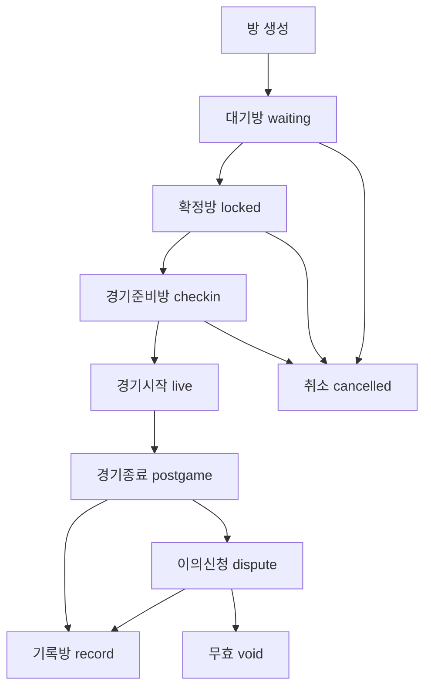
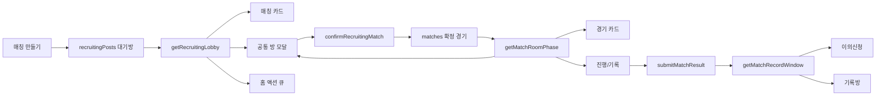
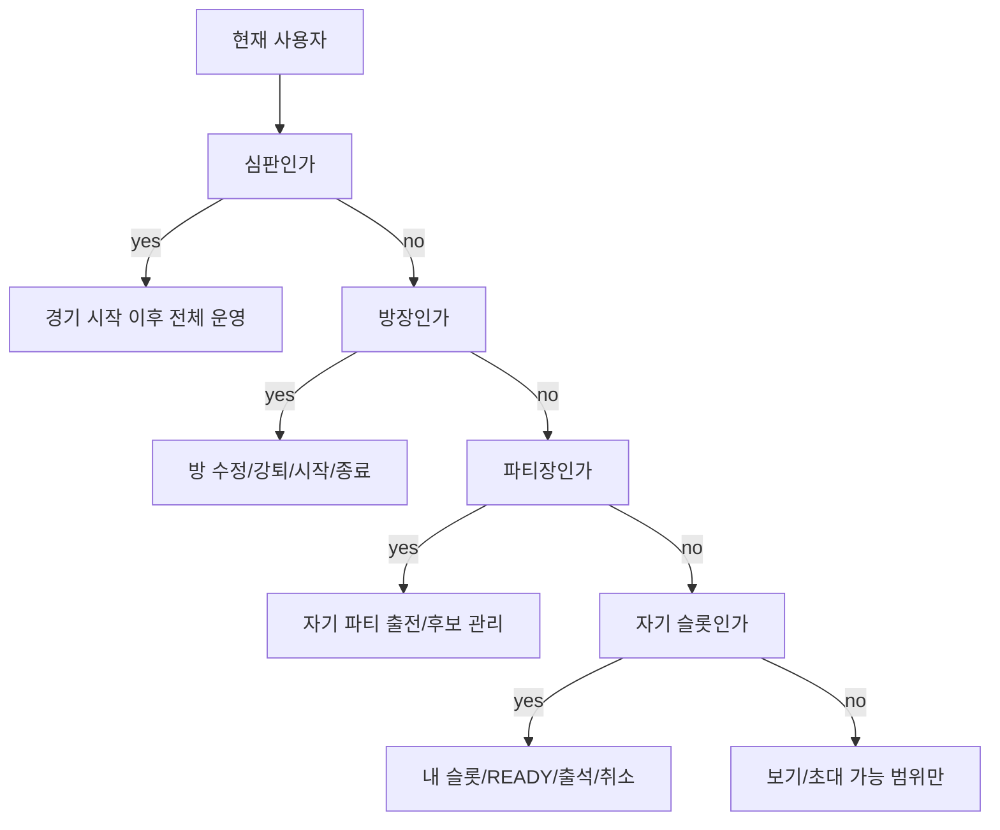

# BOXTIER 로직/용어/디자인 기준

## 2026-07-31 팀 슬롯 이동 정원

1. 팀 파티의 출전·후보 이동도 개인 슬롯과 같은 사이드 정원 검사를 사용한다.
2. 대상 출전 또는 후보 정원이 찼으면 이동 action을 실행하지 않고 현재 배치를 유지한다.

## 2026-07-31 운영 변경 실패 처리

1. 차단·차단 해제, 심판 등록요청, 관리자 임명·연장·회수, 팀 변경은 서버 저장 성공을 확인한 뒤 완료로 표시한다.
2. 서버 저장 실패 시 입력을 지우거나 성공처럼 표시하지 않으며, 낙관 반영한 상태는 이전 상태로 되돌린다.

## 2026-07-31 경기시계 연장 구간

1. 정규 구간 종료 뒤 동점이면 연장을 시작할 수 있다.
2. 연장 진행 중 구간 종료 버튼과 휴식 표시는 현재 연장 번호를 사용하며 정규 구간 종료로 표시하지 않는다.

## 2026-07-31 비관리자 관리자 컨텍스트 판정

1. 일반 사용자의 `admin_required` 응답은 정상 권한 판정이며 콘솔 경고로 취급하지 않는다.
2. 같은 로그인 세션에서는 비관리자 판정을 캐시해 관리자 컨텍스트를 반복 요청하지 않는다.

## 2026-07-31 이의제기 점수 초깃값

1. 일반 경기 종료 뒤 점수 이의제기 입력은 확정 대기 중인 최신 A/B 점수로 시작한다.
2. 경기 중 점수가 바뀐 뒤 같은 방에서 종료 단계로 전환되어도 과거 점수 초깃값을 유지하지 않는다.

## 2026-07-31 1v1 팀방 분류

1. 1v1이어도 `hostJoinMode=team` 또는 `teamOnly=true`인 방은 팀방이다.
2. 팀 선택 전 `teamId`가 비어 있는 상태만으로 개인방으로 분류하지 않는다.

## 2026-07-31 알림 팀 초대 초기 로딩

1. 알림 페이지 직접 진입과 홈 액션 큐 경유 진입은 모두 현재 사용자의 대기 중 팀 초대, 초대 팀, 발신자 프로필을 초기 응답에 포함한다.
2. 초기 프로필 응답과 알림 화면의 최신 디렉터리 갱신 순서가 바뀌어도 수락·거절 action이 사라지지 않아야 한다.

## 2026-07-31 사후 경기기록 확인 현황 투영

1. 사후 경기기록의 `내 참가 확인` 한 번은 참가 사실과 결과를 함께 확인한다.
2. 경기 상세 응답이 별도 승인 행을 포함하지 않아도 `rules.participantAcceptedIds`와 확정 스냅샷으로 팀별 확인 인원과 전체 2/3 기준을 복원한다.

## 현재 유효한 사용자 용어 (2026-07-29)

1. 튜토리얼, 쉬운 룰북, 버튼, 안내문에는 `revision`, `match_record`, `personal_record`, `transaction`, `RPC`, `live` 같은 내부 식별자를 노출하지 않는다.
2. 사용자 문구는 `revision=최신 결과 여부`, `match_record=경기 후 함께 확인하는 기록`, `personal_record=내가 직접 쓴 기록`, `live=현장 일반 경기`, `transaction=한 번에 안전하게 처리`로 설명한다.
3. `MMR`은 계속 사용하는 서비스 용어다. 각 독립 안내 화면의 첫 설명에서 `실력이 비슷한 상대를 찾고 순위를 계산하는 경기력 점수`라고 풀어 쓰고, 이후에만 MMR로 줄여 쓴다.
4. `통합 MMR`은 지원하는 경기 방식의 결과를 함께 반영한 개인 점수, `경기 방식별 MMR`은 1v1·2v2·3v3·5v5를 따로 본 점수, `팀 MMR`은 확인된 실제 참여 명단과 확정 경기로 계산한 팀 점수라고 설명한다.
5. `로스터`는 사용자 문구에서 `실제 참여 명단` 또는 `출전 명단`으로, `사이드`는 처음 설명할 때 `이번 경기의 A팀·B팀` 또는 `경기 편`으로 풀어 쓴다.
6. 내부 코드, DB, migration, 감사 로그, 개발 문서의 식별자는 호환성을 위해 유지한다. 표시 문구 변경으로 저장값이나 권한 규칙을 바꾸지 않는다.

## 현재 유효한 MMR 공개 범위 (2026-07-29)

1. 튜토리얼, 룰북, 방 만들기, 방 상세, 매칭 안내 같은 사용자 화면에는 MMR 결과, 반영 대상 여부, 배치 진행 상태만 설명한다.
2. 계산 계수, 모드별 배율, 로스터 평균 표본 수, 참가 비율 가중치, 보정값과 제한 범위, 내부 임계값은 사용자 화면에 공개하지 않는다.
3. 사용자 문구는 `서버 정책으로 계산`, `서버 검증 후 반영`, `상세 산식 비공개` 수준으로 통일한다. 실제 계산값과 판정은 서버 결과를 기준으로 한다.
4. 정확한 계산식·계수표·보정값은 `server/lib/ratingEngine.js`, `server/lib/ratingAuthority.js`, DB finalizer와 서버 전용 테스트에서만 유지한다. `src/**`, `public/**`, 브라우저 번들에는 복제하지 않는다.
5. 브라우저의 공용 repository는 경기 확정 상태를 낙관적으로 표시할 수 있지만 MMR을 직접 계산하지 않는다. 개인·팀 MMR, 신뢰도, 연승 변경은 서버 transaction 결과로만 교체한다.
6. 최고관리자 정책 편집 schema와 기본값은 level 100 인증 뒤 `/api/admin/rating-policy`가 반환한다. 정적 클라이언트 모듈에는 실제 정책값을 넣지 않는다.
7. 과거 클라이언트 `rating.js`, `ratingPolicy.js`가 계산식과 실제 기본값을 소유하던 구조는 대체됨이다. 클라이언트 파일은 배치 표시와 서버 응답 편집용 일반 helper만 유지한다.

## 현재 유효한 QR 출석·조기 시작·경기 전 알림 (2026-07-29)

1. QR 출석은 예정시간 20분 전부터 연다. 경기 ID와 5분 구간에 묶인 서버 서명 토큰을 사용하며 5분은 보안 회전 주기일 뿐 알림 시각이 아니다.
2. 출전선수와 후보선수는 모두 출석 대상이다. 선수로 참가하는 방장도 포함하고 비선수 방장과 배정 심판은 제외한다. 선수 방장은 참가자 관리의 자기 행에서 다른 선수와 같은 서버 출석 action을 실행할 수 있으며 `확인 생략`으로 처리하지 않는다. 시작 전 스캔 또는 운영자 확인은 `on_time`, 시작 시 남은 `pending`은 같은 DB transaction에서 `no_show`, 사전 등록 `no_show`의 시작 후 스캔은 `late`로 저장한다.
3. QR 경기의 방 단계는 20분 전부터 `checkin`이다. 예정시간 전에는 출석 대상 전원이 완료된 경우만 시작할 수 있고, 예정시간이 되면 미출석자가 있어도 권한자가 시작할 수 있다. 마지막 출석과 시작은 같은 경기 advisory lock과 row lock으로 직렬화한다.
4. QR 미사용 경기는 기존 비QR 정책을 유지한다. 예정시간 10분 전부터 운영자가 자기 출석을 함께 확정하고 나머지 출전·후보의 출석을 확인해야 시작할 수 있다.
5. 경기 전 예약 웹 알림은 1시간·20분·10분만 사용한다. 1시간 알림은 참가자와 심판, 20분·10분 알림은 현재 미출석 선수, 10분 운영 알림은 심판이 있으면 심판, 없으면 방장이 받는다. 전원 출석 순간 운영자 웹 알림은 고유 ID로 한 번만 만들고 추가 Discord DM은 만들지 않는다.
6. 웹 알림이 원본이고 Discord DM은 수신 설정을 통과한 추가 전달 경로다. 예약 웹 알림은 `sendAt` 전까지 숨기며 Discord worker는 Supabase Cron이 1분마다 실행한다. worker는 발송 직전 경기 상태·현재 명단·출석·운영자·Discord 연결 ID·수신 설정·차단을 다시 확인하고 예약시각에서 90초 이상 늦은 경기 전 delivery를 `discord_notification_expired`로 취소한다.
7. 일정·명단·심판·방장 변경, 경기 시작, 취소, 무효 시 아직 발송되지 않은 기존 경기 전 알림을 취소하고 현재 상태에 필요한 알림만 다시 만든다. 새 일정이 20분 이내면 20분·10분 안내를 몰아서 만들지 않고 현재 미출석자에게 한 건만 만든다.

### 폐기된 경기 전 정책

- QR 출석 10분 전 시작.
- 예정시간 10분 전 QR 경기 무조건 시작.
- 5분 주기 Discord worker.
- 경기 24시간·2시간·5분·2분 전 및 정각 알림.
- 실제 경기 시작 완료 알림.

## 현재 유효한 경기 운영 권한 (2026-07-28)

| 상황 | 경기시계 | 팀 점수 | 개인기록 | 문제 처리 | 최종 승인 |
| --- | --- | --- | --- | --- | --- |
| 일반·심판 있음 | 지정 담당자 | 심판만 | 심판만 | 심판 | 심판 |
| 일반·무심판·시계 있음 | 지정 담당자 | 시계 담당자 | 없음 | 방장 | 방장 |
| 일반·무심판·시계 없음 | 없음 | 방장 | 없음 | 방장 | 방장 |
| 대회 | 지정 담당자 | 심판만 | 심판만 | 심판 | 심판 |
| 심판 부재 확인 일반 경기 | 무심판 규칙 | 무심판 규칙 | 없음 | 방장 | 방장 |
| `match_record` | 없음 | 생성 과정에서 입력 | 생성하지 않음 | 공통 신고 | 내 참가 확인 |
| `personal_record` | 없음 | 본인 입력 | 본인만 | 공통 신고 | 본인 저장 |

룰북은 `쉬운 규칙`과 `상세 규칙`을 분리한다. 쉬운 규칙은 이 권한표와 현재 유효한 출석·교체·기록·이의·확정 정책을 처음 보는 사용자에게 요약하며 별도 권한이나 예외를 만들지 않는다. 상세 규칙은 기존 FIBA·BOXTIER 세부 기준을 그대로 제공한다.

1. 일반 live 경기의 운영 역할은 `방장`, `출전선수`, `후보선수`, `배정 심판`, `경기시계 담당자`만 사용한다. 사이드 기록자, 자동 기록자, 기록 후보, 기록권한 교대·승계·takeover는 신규 UI·API·RPC 실행 경로에서 사용하지 않는다. 레거시 field는 과거 데이터 읽기 호환에만 사용한다.
2. 경기시계 담당자는 현재 출전선수, 후보선수, 배정 심판 중 현장에서 지정하고 자유롭게 넘길 수 있다. 담당자 지정과 이전은 서버 권한·서버시간으로 검증한다.
3. 배정 심판이 있는 일반 경기는 배정 심판만 A/B 양 팀 점수를 조작한다. 경기시계 담당자는 시간과 샷클락만 조작하며, 방장·출전선수·후보선수는 역할만으로 점수 권한을 얻지 않는다. 무심판 경기에서 경기시계를 사용하면 현재 담당자가 A/B 양 팀 점수를 조작하고, 경기시계를 사용하지 않을 때만 방장이 A/B 양 팀 점수를 조작한다.
4. 배정 심판 경기의 개인 스탯은 배정 심판만 입력·수정한다. 일반 무심판 경기는 개인 스탯을 생성하지 않는다. `personal_record`는 작성자가 자기 스탯을 입력하는 별도 기록 유형이며 일반 live 권한과 섞지 않는다.
5. 교체는 같은 사이드의 현재 출전선수와 후보선수 사이에서만 수행한다. 후보 본인은 자신이 들어가는 자진 교체를 실행할 수 있고 배정 심판은 양 사이드를 교체할 수 있다. 무심판 방장·파티장·다른 출전선수는 타인의 교체를 실행할 수 없다.
6. 교체 transaction은 출전·후보 명단, 교체 이벤트, 출전시간 interval만 하나의 서버 transaction·서버시간으로 갱신한다. 기록자 생성·승계·교대는 포함하지 않는다.
7. 신규 교체 사유는 `self`, `late`, `ejection`, `operator`만 허용한다. `injury`와 `recorder_handoff` 신규 저장은 거부한다. 과거 `injury`는 화면에서 `일반 교체`로 읽을 수 있다.
8. 일반 경기의 최종 승인은 결과 제출과 경기 종료 중 늦은 시각부터 3분 뒤 배정 심판이 있으면 배정 심판만, 무심판이면 방장만 실행한다. 방 화면에 머무는 중에도 3분 경계가 되면 새로고침 없이 승인 버튼을 활성화한다. 실행 직전 `더 이상 이의가 없음을 확인하셨나요?` 확인창에서 명시적으로 확인하고 `disputesAcknowledged=true`를 서버에 보낸다. 과반 승인, 전원 승인, 팀장 승인은 일반 경기에 적용하지 않는다.
9. 참가자는 최종 승인 전에 이의신청을 제출할 수 있다. 배정 심판 경기의 이의는 배정 심판만, 무심판 경기의 이의는 방장만 처리하며 처리 사유·처리자·서버시각·이전값·변경값을 감사 기록으로 남긴다. 열린 이의신청이 하나라도 있으면 최종 승인을 거부하고 마지막 판정은 경기를 `approval`로 되돌릴 뿐 자동 확정하지 않는다. 승인 뒤 신규 이의신청은 거부하고 이후 문제 제기는 경기 신고로 전환한다.
10. `governanceVersion=2` 대회 경기는 중립 배정 심판이 필수다. 배정 심판만 점수·개인 스탯·이의 처리·최종 승인을 수행하며 대회 방장은 해당 권한을 갖지 않는다.
11. 일반 live 경기, `match_record`, `personal_record`는 서로 다른 기록 유형이다. `match_record`는 실제 참가자의 2/3 이상이 `내 참가 확인`으로 본인 참가 사실과 결과를 확인한다. 확인자는 1v1 10%, 2v2 20%, 3v3 35%, 5v5 50%의 개인 MMR만 반영하고 미확인자는 승패·개인/모드 MMR·연승에서 제외하며 팀 MMR과 개인 스탯은 만들지 않는다. 24시간 뒤 기준 미달이면 `확인 부족`, 기준 충족과 열린 공통 신고 0건이면 시스템이 확정한다. `personal_record`는 작성자 본인 소유·본인 저장·MMR 미반영 규칙을 유지한다.
12. 무심판 경기의 방장이 부재하거나 계정 문제로 승인할 수 있어도 다른 참가자에게 최종 승인 권한을 자동 승계하지 않는다. 경기 신고를 통해 관리자 처리 경로로 전환하며 관리자 조치는 사유와 감사 기록을 필수로 남긴다.
13. 일반 경기의 수동 승인이 없으면 결과 제출과 경기 종료 중 늦은 시각부터 전체 `disputeMinutes`가 지난 뒤 유효한 결과, 열린 이의 0건, 심판 경기의 실제 출전자 개인 스탯 완성을 확인해 `system`이 자동 확정할 수 있다. 자동 확정은 0 개인기록을 보충하지 않으며 수동 확정과 같은 lock·멱등 MMR transaction을 사용한다.
14. 프로필 통계는 서버가 검증 출처로 읽어 준 대회 개인 스탯을 집계한다. 대회 row가 축약되어 클라이언트에 심판 ID가 없더라도 `tournamentId`와 확정 스탯이 있으면 통계에서 누락하지 않는다.
15. 타인 선수 프로필의 기록 API는 대상 선수가 참가한 공개 경기와 대상 선수가 작성한 공개 `personal_record`를 함께 제공한다. 비공개 기록은 제외하고, 프로필의 `teamHistory`·`statSummary` 공개 설정은 기존대로 각 섹션 노출에 적용한다. `statSummary`가 켜져 있을 때만 대상 선수의 심판 검증 스탯과 공개 개인기록 통계를 반환하며, 꺼져 있으면 서버 응답에서도 통계값을 제거한다. 공개 개인 기록은 공식 통계·업적·MMR과 합산하지 않는다.
16. `personal_record` 이름 기록의 다른 선수는 실제 경기 참가자로 등록하지 않는다. 유효한 선수 해시태그를 선택하거나 입력하면 익명 슬롯에 `linkedProfileId`와 서버가 정규화한 이름·포지션만 연결한다. 이 참조는 프로필 열람 보조이며 일정·알림·승패·MMR·출전 통계의 참가 관계를 만들지 않는다. 저장 표시명에는 해시태그를 남기지 않는다.
17. `personal_record`의 우리팀 점수와 작성자 본인의 PTS는 서로 다른 값이다. 팀 점수는 경기 결과에, PTS와 나머지 개인 스탯은 작성자 본인의 단일 `playerStats` row에 저장한다.

### 대체된 규칙

> 폐기됨: 경기시계·심판 중심 운영 정책으로 대체됨.
> 신규 UI·API·권한 판정에서 사용하지 않는다.
> 과거 데이터 해석 목적으로만 남긴다.

- 기록자 점수 권한, 자동 기록자, 양면 점수 위임, 기록권한 승계·교대·takeover 규칙.
- 기록자 변경을 교체 transaction에 포함하거나 `recorder_handoff` 교체 사유를 신규 저장하는 규칙.
- 심판 경기에서 경기시계 담당자에게 점수 권한을 주거나 방장에게 이의 처리·최종 승인 권한을 주는 규칙.
- 일반 경기의 과반 승인·전원 승인·팀장 승인과 마지막 이의 판정 즉시 자동 확정 규칙.
- 아래 날짜별 기록이 이 절과 충돌하면 이 절이 우선한다.

## 2026-07-26 홈 독립 bootstrap

1. 홈의 내 소속 팀, 지역 라이벌, 지역 랭킹, 즐겨찾기는 다른 메뉴에서 directory를 먼저 불러왔는지와 무관하게 `/api/home/load` 응답만으로 동일해야 한다.
2. 홈은 전체 directory를 읽지 않는다. 현재 사용자의 소속 팀, 최대 10개 즐겨찾기 대상, 지역 MMR 상위 5명, 소속팀을 제외한 지역 라이벌 최대 4개만 제한 조회한다.
3. 홈 응답은 `ownTeamIds`, `rivalTeamIds`, `regionalPlayerIds`, 현재 사용자의 `regionalRank`를 snapshot으로 반환한다. 이후 다른 화면의 목록이 전역 상태에 병합돼도 홈 카드의 구성과 순서를 다시 계산하지 않는다.
4. 로스터 일부만 포함한 팀 응답은 반드시 `membersPartial=true`를 가진다. 완전한 팀 로스터를 이미 가진 클라이언트에는 부분 응답이 이를 덮어쓰지 않으며, 서로 다른 부분 응답끼리는 확인된 팀원을 합친다.
5. 홈에 노출하는 팀은 제한된 `team_members` 집계로 정확한 `memberCount`를 함께 받는다. 정확한 집계도 완전한 로스터도 없으면 hover 카드에 `0명`으로 추정하지 않고 미확인으로 표시한다.
6. 홈의 선택 section 조회가 실패하면 성공한 프로필·팀·즐겨찾기 응답은 유지하고 section 오류를 표시용 meta로 남긴다. 클라이언트는 홈 진입당 전체 요청을 최대 한 번만 재시도하고 오류 section 수가 더 적은 응답을 사용하며, 반복 polling으로 바꾸지 않는다.

## 2026-07-25 대회·리그 심판 및 지역 승인

1. 리그·토너먼트 주최자는 생성 시점부터 종료일까지 유효한 `자격심판(candidate)` 이상 자격과 활동 유지 신뢰도 70 이상을 가져야 한다. 신규 자격 취득 기준 90은 별도이며, `후보심판`, `긴급 소속 심판` 역할은 만들지 않는다.
2. 생성 시 필수 심판 수는 2~4팀 2명, 5~8팀 3명, 9팀 이상 4명이다. 주최자는 대회 생성 전에 해당 수 이상을 초대하고, 심판은 각자 참여를 승인한다.
3. 필수 심판 승인과 모든 팀장 승인이 끝나기 전에는 대진·경기를 생성하지 않는다. 팀장 승인만으로 대회를 자동 시작하는 구형 흐름은 `governanceVersion=2` 대회에서 사용하지 않는다.
4. 심판 풀은 모든 가능한 팀 조합마다 양 팀 어느 쪽의 현재 팀원도 아니고 생성 시점 대표팀 명단 스냅샷에도 없는 중립 심판을 최소 1명 제공해야 한다.
5. 지역관리자가 자기 활성 appointment의 `payload.region`과 같은 지역 대회만 승인하면 `sanctionStatus=approved`, `official=true`, MMR 계수 1의 공식 대회가 된다. 기존 appointment에 관할 지역이 없으면 현재 프로필 지역을 임시 관할로 사용하고, `senior`·`owner`는 전역 승인할 수 있다.
6. 지역 승인이 없거나 거절돼도 주최자는 `sanctionStatus=community`, `official=false`, MMR 계수 0.8의 지역 비승인 대회로 개최할 수 있다. 지역 비승인도 공식 대회와 같은 필수 심판 수·심판 승인·중립 심판 조건을 모두 지켜야 한다.
7. 실제 경기는 승인된 대회 심판 중 양 팀과 무관한 심판을 1명 배정한다. 같은 심판의 예상 경기 구간이 겹치는 배정을 금지하고, 심판 미배정·자격 만료·소속 충돌 시 일정 저장과 경기 시작을 DB에서 거부한다.
8. 진행 중 대회의 승인 심판은 참여를 철회할 수 없다. 미출석 시 무심판 경기로 바꾸지 않고 승인된 중립 교체 심판을 배정할 때까지 시작을 막는다.
9. 기존 진행 중 대회는 갑자기 멈추지 않도록 구형 흐름을 유지한다. 새 권위 규칙은 생성 시 `rules.governanceVersion=2`가 저장된 대회부터 적용한다.

## 2026-07-25 대회 경기 일정 수정·명단 잠금

1. 대회 경기 일정의 최초 지정은 수정 횟수에 포함하지 않는다. 최초 지정 뒤 날짜·시간·구장 중 하나라도 실제로 달라지는 수정은 경기당 한 번만 허용한다.
2. 날짜·시간·구장이 모두 같은 재저장과 네트워크 재시도는 수정 횟수를 쓰지 않는 멱등 요청으로 처리한다.
3. 양 팀 중 한 팀이라도 출전 명단을 제출하면 일정을 즉시 잠근다. 일정 변경을 이유로 제출된 명단을 초기화하거나 새 일정을 일방 적용하지 않는다.
4. 수정 횟수와 명단 제출 잠금은 클라이언트 표시뿐 아니라 service-role 전용 DB RPC에서 tournament/match advisory lock과 row lock으로 강제한다.
5. 대회 경기의 출전 명단 구성 권한은 경기 `confirmedAt` 유무가 아니라 일정 존재, 경기 생명주기, 해당 팀 주장 여부로 판정한다. 현재 팀 directory가 부분 로드됐으면 대회 생성 시점의 `teamRosterSnapshot`으로 주장과 팀원을 보강한다.
6. 일정이 지정된 예정 대회 경기의 방 모달은 일반 경기 단계와 별개로 `출전 명단 구성 → A/B 슬롯 → 기록 상태` 순서를 사용한다. 각 팀장은 자기 팀 명단만 제출한다.

## 2026-07-25 경기시간 입력·강제 종료 상한

1. 목표 점수, 구간 시간, 휴식, 연장 같은 숫자 입력은 편집 중 빈 문자열을 허용한다. `onChange` 시점에 최솟값으로 보정하지 않고, 빈 값·정수 아님·허용 범위 밖 상태를 화면에서 표시하며 생성·수정 저장만 막는다.
2. 목표 점수는 `7~99점`, 연장 1회는 `1~20분`, 휴식은 `0~30분`이다. 정규 경기시간 합계(`periodCount × periodMinutes`)는 서버 강제 종료 90분의 70%인 63분을 넘을 수 없다.
3. 실제 경기시계 시작 시각은 클라이언트가 아니라 `match_clock_sessions.clock_started_at` 서버시간이다. 시작 후 90분이 지나면 일시정지·스톱타임 여부와 무관하게 서버가 경기시계를 끝내고 경기 생명주기를 사후 기록 단계로 보낸다.
4. 90분 상한은 4쿼터 10분 스톱타임, 휴식, 파울 중단과 연장 가능성을 수용하면서 무기한 live 경기로 인한 어뷰징을 막기 위한 운영 상한이다. 정규 설정 최대 63분과 남은 27분을 중단·휴식·연장 여유로 사용한다.
5. 클라이언트 정규화, 생성 검증, 방 수정 DB 함수는 같은 63분 상한을 사용한다. API 우회 입력도 DB에서 `match_regulation_duration_exceeded`로 거부한다.
6. QR 예정 경기는 전원 출석 시 예정시각 20분 전부터 시작할 수 있고, 미출석자가 있으면 예정시각 전 시작을 막는다. QR 미사용 예정 경기는 기존 10분 전 시작 정책을 유지한다. 늦은 시작은 별도 마감으로 취소하지 않되, 동일 심판의 다른 live 경기가 있으면 시작을 막는다.
7. 예정시각은 약속과 심판 일정 충돌 판정에 사용한다. 출전시간, 경기 종료, MMR 검증은 실제 서버 경기시계 시작·일시정지·재개·종료 기록만 사용한다.

## 2026-07-25 충돌 제거와 구조 정리 로드맵

1. P0 실행 경로: 같은 상태 전이를 만드는 구형 action·RPC·권한 예외를 먼저 제거한다. 경기 이의는 `resolveMatchDispute`와 `rankball_match_resolve_dispute_action()`만 사용하며 심판 경기는 배정 심판, 무심판 경기는 방장이 각 open 항목을 판정한다. 마지막 판정 뒤에는 별도 최종 승인 확인을 거쳐야 경기 확정과 MMR commit이 실행된다.
2. P1 계약 단일화: 클라이언트 operation-only 목록, 서버 지원 action 목록, SQL reducer 목록, 권한·결과·알림 후처리 목록을 공용 정책 모듈에서 파생한다. 역할이 다른 목록은 이름만 같게 합치지 않고 차이를 테스트로 고정한다.
3. P2 도메인 분리: `repository.js`는 순수 계산·로컬 데모 reducer·원격 저장소를 분리한다. 호출 경로와 순환 의존성을 먼저 확인하고 한 번에 한 도메인씩 옮긴다.
4. P3 화면 분리: `Recruiting.jsx`, `useAppData.js`, `sync-match.js`는 단계 panel, 데이터 로드, mutation adapter를 분리한다. 방 phase·party·permission 계산은 페이지에 복제하지 않는다.
5. P4 스타일 정리: 전역 CSS는 현재 import manifest와 selector 사용처를 기준으로만 줄인다. desktop/mobile, dark/light computed style과 overflow 검증 없이 selector를 삭제하지 않는다.
6. P5 DB 정리: 적용된 migration은 운영 이력이라 수정·삭제하지 않는다. 현재 스키마에서 참조 0인 함수만 새 migration으로 제거하고, 새 환경용 baseline은 운영 schema 검증 뒤 별도로 만든다.
7. 각 단계는 역할별 흐름, 정책 테스트, build, 운영 schema health를 모두 통과해야 완료다. 파일 크기만으로 코드를 삭제하거나 서로 다른 권한 경로를 억지로 합치지 않는다.
8. 공개 팀전은 현재 소속 팀원 1명이 대표로 참가해 해당 사이드장이 된 뒤 출전·후보 명단을 직접 확정한다. 참가 시 정원 전체를 강제하거나 팀원별 pending 초대 row를 만드는 구형 경로는 사용하지 않는다.
9. 데모 전체 흐름은 파일을 쓰지 않는 `npm run seed:demo-flow:check`로 정책 테스트마다 검증한다. 생성 snapshot이 현재 reducer를 통과한다는 사실과 실제 로컬 seed 파일 갱신을 분리한다.
10. 공개 팀전 참가의 대표 1명 제한은 UI가 아니라 DB reducer가 원본이다. 현재 소속된 참가 가능 팀원은 상대 사이드 대표로 참가할 수 있고 요청에 다른 팀원·후보가 섞여도 신청자 1명으로 정규화한다. 같은 사이드를 다른 팀이 선점하거나 비소속·조건 불일치 사용자가 대표가 되는 요청은 거부한다.
11. 결과가 제출됐고 이의 시간이 끝난 경기의 자동 확정은 개인기록 row를 자동 생성하지 않는다. 심판 경기는 실제 출전자 전원의 심판 확인 기록이 완성된 경우에만 확정하고, 무심판 경기는 개인기록 없이 팀 점수만으로 확정한다.
12. exact simulation cleanup은 기존 non-simulation 경기 ID를 계속 거부하되 이미 삭제된 ID의 동일 요청 재시도는 no-op으로 허용한다. 파생 프로필·구장 집계는 삭제 transaction 안에서 다시 계산해 응답 유실 뒤에도 일관성을 유지한다.
13. 공개 팀전의 상대 application은 소속 팀원 대표 1명 row를 DB 참가 trigger에서도 허용한다. 비공개 지목 초대는 상대 팀의 현재 주장에게 연락용 초대 1건을 보낸다. 팀 자체의 참가 가능 인원 검사는 유지하고 실제 출전 정원은 참가 뒤 사이드장의 출전·후보 명단 확정 단계에서 강제한다.

## 2026-07-24 공개 매칭·대회 QR 출석·현장 교체

1. 사후 경기기록(`match_record`) 외 모든 경기방은 출석 단계를 표시한다. 경기시계를 사용하는 공개·비공개 경쟁전과 대회는 QR 출석을 기본 사용하고, 친선전·내 기록은 QR을 선택한 경우 사용한다. 대회는 배정 심판만 QR을 표시하고 출석판을 운영한다. QR 미사용 방은 같은 출석 명단을 방장 수동 확인으로 처리한다.
2. QR은 경기 ID와 5분 구간에 묶인 서버 서명 토큰이다. 로그인한 사전 등록 선수만 스캔할 수 있고 만료되거나 다른 경기에서 가져온 토큰은 거부한다. 별도 전역 3초 polling을 만들지 않으며 준비 패널은 15초 갱신, 경기시계 QR은 기존 시계 조회 응답을 사용한다.
3. 예정 경기는 시작 20분 전부터 QR 출석을 받는다. 경기 시작 전 스캔은 `on_time`으로 저장한다. 실제 경기 시작 시점에 기존 `pending` 출석을 원자적으로 `no_show`로 확정하고, 진행 중에는 이 `no_show` 사전 등록 선수만 QR로 `late` 전환해 원래 사이드 후보에 등록한다. 경기 시작 뒤 새로 등록됐거나 이미 끝난 경기의 선수는 지각 합류할 수 없다. 사이드 후보는 방의 후보 정원을 따르며 QR 출석만으로 실제 출전 선수와 자리를 바꾸지 않는다.
4. 방장 또는 배정 심판은 경기 시작 전에 출석 인원 기준 정리를 실행할 수 있다. 양쪽 출석 인원이 들어가는 가장 큰 지원 방식 `5v5 → 3v3 → 2v2 → 1v1`을 고르되 현재 방식보다 키우지 않고 사이드별 후보 3명 한도를 지킨다. 미출석자는 `no_show`로 남기며 이 정리와 축소는 방 수정 1회를 소모하지 않는다.
5. 실제 출전은 후보 본인이 같은 사이드 출전 선수를 골라 `교체`를 누르면 성립한다. 후보 본인에게는 자기 행만 보인다. 배정 심판만 양 사이드 후보 전체를 교체하고 `일반 교체·지각·퇴장` 사유를 지정한다. 심판 없는 경기의 방장·파티장·출전 선수는 타인을 교체할 수 없다. `지각` 사유는 DB 출석 상태가 실제 `late`인 선수에게만 허용한다. 교체 시각, 들어간 선수, 나온 선수, 사이드, 실제 요청자, 경기시계 상태와 사유를 저장한다.
6. 교체로 들어온 후보의 의미 있는 최소 출전시간은 예상 경기시간의 10%이며 최소 1분, 최대 3분이다. 실제 출전 구간은 경기시계의 누적 진행시간으로 계산해 일시정지·휴식 시간을 제외한다. 합계가 기준보다 짧으면 MMR 반영 대상에서 제외하고, 기준을 채운 선수의 정확한 MMR 계수는 별도 정책 확정 전까지 기존 반영 방식을 유지한다.
7. 경기 종료 뒤 결과 제출 전 기록 입력 가능 시간에는 방장 또는 배정 심판이 누락된 가입 선수나 무기명 선수를 실제 출전 명단에 추가할 수 있다. 실시간 팀 점수만 저장된 `match_results` 행은 결과 제출로 보지 않는다. 이 흐름으로 추가된 선수만 다시 제거할 수 있으며 모두 MMR에서 제외한다.
8. 출석 신뢰도 정책의 목표값은 지각 `-1`, 미출석 `-4`다. 다른 신뢰도 규칙과 함께 확정하기 전에는 자동 차감하지 않는다.
9. QR 링크는 공용 매칭 목록의 `match` query로 해당 경기의 공통 방 모달을 연다. 구형 `/app/matches/:matchId` QR 링크는 기존 query와 hash를 보존한 채 canonical `/app/matches?match=:matchId`로 `replace` 이동하며, 독립 경기 상세 화면을 렌더하지 않는다. 출석 결과는 스캔한 경기 모달 안에서 표시한다.
10. 얇은 경기 일정 카드는 이미 불러온 경기 상세의 `rules`, 출전·후보 명단, 출석, 동의, 기록 데이터를 덮지 않는다. 목록 표기값은 합치되 상세 응답을 우선한다.
11. QR 예정 경기의 공통 방 단계는 QR API와 같은 시작 20분 전부터 `checkin`으로 전환한다. 선수로 참가하는 방장은 일반 선수와 같은 출석 대상이고, 선수로 참가하지 않는 방장과 배정 심판은 출석 완료 인원에서 제외한다.
12. 경기시계 점수판은 기존 시계 조회와 함께 3초마다 `match_results`를 다시 읽는다. 현재 경기시계 담당자나 심판이 저장한 점수는 별도 전역 polling 없이 다음 시계 조회에 반영한다.
13. 일반 경기 결과 승인 action도 `최종 승인`으로 표시한다. 참가자는 실행 직전 이의신청을 마지막으로 확인한다. 결과·이의 화면의 수동 새로고침은 방장 또는 경기관리자에게만 제공한다.

## 2026-07-24 점유 슬롯 방 수정

1. 모집방과 확정 경기방의 수정은 같은 규칙 payload를 사용한다. 종료 기준, 목표 점수, 구간 수·시간, 휴식, 하프타임, 연장, 시계 방식, 마지막 스톱 시간, 공, 공격권, 파울, 만남 장소, 집결 시간, 구장, 출전·후보 정원, 메모와 약속을 DB 원자 작업에서 함께 저장한다.
2. 지원 출전 정원은 사이드당 `1·2·3·5명`, 후보 정원은 `0~3명`이다. 일반 구성은 현재 각 사이드의 출전 인원이나 후보 인원보다 정원을 작게 줄이는 수정을 클라이언트와 DB에서 모두 거부한다. 현장 픽업은 임시 A/B·대기값이 아니라 `현재 통합 참가자 수 <= (출전 정원 + 추가 참가 정원) × 2`만 검증한다. 저장 시 `onCourtCount`, `starterCount`, `teamCapacity`, `participantCapacity`, `waitingPlayerCapacity`도 같은 정원에서 다시 계산한다.
3. 공개 개인전, 공개 팀전, 비공개 초대전은 모집방 수정 뒤 현재 참가 row, 참가 상태, A/B·출전·후보 배치를 유지한다. 현장 픽업도 참가 row와 참가 상태를 유지하되 정원 변경 뒤 서버 호환용 임시 A/B·대기값만 새 총정원에 맞게 재배치한다. 모집방 규칙 변경을 이유로 참가자를 미확정 상태로 되돌리거나 재수락을 요구하지 않는다.
4. 확정 경기방은 방장 또는 경기준비 단계의 배정 심판만 수정한다. 수정 뒤 출전·후보 명단은 유지하고 경기 전 동의와 출석만 초기화해 변경된 규칙을 다시 확인한다. 일반 선수, 파티장, 후보는 방을 수정할 수 없다.
5. 구장 변경은 활성 승인 구장의 ID를 받아 서버가 공식 구장명과 지역을 다시 조회해 저장한다. 목록 응답에 현재 구장이 빠져 있어도 기존 구장 ID와 이름은 수정 draft에서 유지한다.
6. 방 수정 API는 일부 필드만 저장하고 성공을 반환하면 안 된다. 전체 payload 저장이 끝난 뒤 갱신된 방을 반환하며, 실패하면 원인 code와 HTTP 상태를 반환하고 기존 방 상태를 유지한다.
7. 확정 경기의 수정 draft는 닫힌 모집방 snapshot이 아니라 최신 `sourceMatch`를 원본으로 사용한다. 경기 상세 API와 수정 패널의 규칙·구장·메모·약속 값이 달라지면 안 된다.
8. 방 수정은 방마다 총 1회만 허용한다. DB가 유효한 수정 요청 또는 일정 변경 제안을 접수한 시점에 `roomEditCount=1`을 원자적으로 저장한다. 저장 실패는 횟수를 소모하지 않지만 참가자가 일정 변경안을 거절해도 횟수를 복구하지 않는다. 이후 변경은 기존 방 취소와 새 방 만들기 흐름을 사용한다.

## 2026-07-23 매칭 생성 분류와 사후 기록방

1. 매칭 생성은 `matchPurpose`와 `formationMode`를 독립된 원본 필드로 저장한다. `matchPurpose`는 `friendly` 또는 `competitive`, `formationMode`는 `prearranged` 또는 `pickup`만 허용한다. 기존 `matchIntent=friendly`는 `friendly+prearranged`, `standard_competitive`는 `competitive+prearranged`, `pickup`은 `friendly+pickup`으로 읽는다.
2. `픽업`은 경기 목적이 아니라 팀 구성 방식이다. `prearranged`는 시작 전에 A/B사이드와 출전·대기를 정하고, `pickup`은 모집 중 하나의 참가자 풀만 사용한 뒤 체크인에서 A/B와 대기 선수를 정한다. 픽업도 `friendly` 또는 `competitive`를 선택할 수 있다.
3. 후보 출전정책은 후보 정원 아래의 단일 control만 원본으로 사용한다. 경기 목적을 바꿔도 사용자가 고른 `최소 1회 출전`, `균등 순환`, `출전 보장 없음`을 덮어쓰지 않는다. 픽업은 기본값으로 `균등 순환`을 사용하되 체크인 전 팀 배치 방식과는 독립적으로 저장한다.
4. 경기 기록방은 `구성 방식·경기 인원·시작 일시·구장·메모`를 한 화면에서 입력하고 바로 확인·생성한다. 종료시각은 서버가 시작시각 30분 뒤로 계산한다. 단계 nav를 만들지 않는다.
5. 경기 기록방은 사용자가 규칙을 입력하지 않으므로 일반 경기 기본 규칙을 만들어 저장하거나 방 모달에 표시하지 않는다. 구장은 검색해 선택할 수 있고 선택하지 않으면 `구장 미정`으로 저장한다.
6. 사후 기록방은 참가 사실 확인과 결과 확인을 참가자 본인의 `내 참가 확인` 한 번으로 처리한다. 확인은 본인이 실제 참가했고 팀 점수가 맞다는 뜻이며 개인기록은 생성하지 않는다. 방장, 팀장, 심판은 다른 사람을 대신해 확인할 수 없다.
7. 개인 구성 기록방은 `명단 제출 → 팀 점수 입력 → 각 참가자 내 참가 확인` 순서다. 팀 구성 기록방은 `팀 선택 → 각 팀장 출전 명단 제출 → 팀 점수 입력 → 양 팀 참가자 내 참가 확인` 순서다. 팀 선택·명단 제출과 참가 확인을 같은 상태로 표시하지 않는다. 팀 구성이 저장되어 A/B 팀이 모두 정해지면 팀 선택 패널은 닫고 각 팀장의 출전 명단 패널만 표시한다.
8. 사후 기록방을 중단하는 행동과 알림은 `경기 취소`가 아니라 `기록 취소`로 표시한다. 예정 경기 취소·경기 무효와 구분한다.
9. 사후 기록은 결과 제출 직후·1시간·12시간에 미확인 참가자에게 `내 참가 확인` 알림을 보낸다. 참가자는 본인 참가 사실과 결과를 한 번에 확인하거나 공통 경기 신고를 제출한다.
10. 결과 제출 24시간 뒤 전체 실제 참가자의 2/3 이상이 확인했고 열린 공통 신고가 없으면 시스템이 기록을 확정한다. 2/3 미만이면 무응답자를 승인하지 않고 `확인 부족`으로 둔다.
11. 확정 전까지 확인 인원·확정 기준·미확인 인원을 표시한다. 확정 뒤 문제도 기록 재승인이 아니라 공통 경기 신고로 처리한다.
12. 문제 신고자는 내 참가 확인자로 계산하지 않는다. 열린 신고가 있으면 기록과 MMR 반영을 보류하고 `검토 중`으로 표시한다.
13. `match_record` 전용 이의조정 workflow를 만들지 않는다. 관리자는 공통 신고를 기각하면 기존 확인 상태로 확정할 수 있고, 인정하면 감사 기록과 함께 정보를 수정하거나 경기를 무효 처리한다.
14. 내 참가 확인 요청은 멱등 키를 사용하고 요청자·응답자·시각·위험 신호를 감사 로그에 남긴다. 같은 계정의 다중 슬롯, 본인 대리 확인, 명단·결과 변경 뒤 이전 확인 재사용을 서버에서 거부한다.
15. 팀 사후 기록방은 방을 열 때 선택된 두 팀의 최신 팀원 명단을 직접 조회한다. 팀 메뉴 방문 여부나 디렉터리 캐시에 의존하지 않는다.
16. 사후 기록 점수는 실시간 증감으로 저장하지 않는다. 방장이 양 팀 점수를 입력한 뒤 `점수 입력 완료`를 누르면 한 번에 저장하고, 저장 성공 뒤 미확인 실제 참가자에게 즉시·1시간·12시간 `내 참가 확인` 알림을 보낸다.
17. 결과 제출 전에는 참가 확인을 저장하지 않으며 UI는 `내 참가 확인` 대신 `점수 입력 대기`를 표시한다. 24시간 확인 기산점은 방 생성 시각이 아니라 결과 제출 시각이다.

## 2026-07-23 픽업방 개인 참가·초대·슬롯 원칙

1. 픽업방의 참가 단위는 항상 개인이다. 등록팀 검색, 팀원 일괄 소집, 팀 파티 합류, 파티장, 팀 로스터 편집을 노출하거나 저장하지 않는다.
2. 픽업방에서 여러 선수를 한 번에 선택해도 각 선수에게 독립된 `joinMode=player` 초대를 만든다. 팀 ID와 팀 엔트리는 생성하지 않는다.
3. 픽업 초대는 A/B 슬롯이 아니라 하나의 참가자 풀로 수락한다. 초대에는 A/B·출전·대기를 고정하지 않고, 공용 management RPC를 포함한 수락 서버 transaction이 현재 양쪽 임시 점유 인원을 다시 계산해 빈 쪽에 균형 배치한다. 이 임시 배치는 통합 정원 검증과 레거시 모집방 호환에만 사용하며 체크인 팀 배정으로 간주하지 않는다. 모집·잠금 단계에서는 참가자의 A/B, 출전, 대기 위치를 표시하거나 이동 기능을 제공하지 않으며 방장도 생성 사이드를 갖지 않는 운영자로 표시한다.
4. 홈, 알림, 방 모달의 초대 수락은 같은 원자적 서버 작업을 사용한다. 처리된 초대는 행동 큐에서 빠지고 개인 참가 row와 인원수가 같은 응답에서 갱신돼야 한다. 픽업 초대 알림에는 팀·파티장 문구를 표시하지 않는다.
5. 선수 초대 수락으로 출전·후보를 합친 전체 참가 정원이 차면 같은 원자 작업에서 남은 `pending` 선수 초대를 모두 `expired`로 바꾼다. 만료된 초대 대상자에게 슬롯 마감 안내를 보내고 방장에게 방 확인·경기 확정 안내를 한 번만 보낸다. 심판 자리가 비어 있는 동안 `joinMode=referee` 초대는 유지한다.
6. 과거 픽업방에 남은 팀 엔트리는 참가자를 잃지 않고 개인 참가 row로 변환하고, 팀·파티 메타데이터와 팀 초대값만 제거한다.
7. 픽업 체크인에서는 먼저 참석 여부를 확정한 뒤 방장 또는 배정 심판이 팀 나누기 방식을 선택해 `draft`를 만든 다음 참석자만 A/B 출전과 사이드별 대기에 배정한다. 표시와 조작은 승격 전 모집방 호환 row가 아니라 현재 경기의 `match_players`와 `reserve_players`를 기준으로 한다. 양쪽 정원이 이미 찬 상태에서는 두 참가자를 선택해 각자의 A/B·출전·대기 자리를 원자적으로 교환하며 교환 뒤에도 `draft` 상태를 유지한다. `배정 확정` 전에는 경기 시작을 허용하지 않는다.
8. 초대 권한은 현재 방 참가자와 배정 심판에게만 준다. 팀으로만 참여하는 방은 해당 사이드를 점유한 팀원이 같은 팀원을 부르는 범위로 제한한다. 초대에는 `fromUserId`를 저장하고 처리할 일과 알림에서 초대한 사람을 표시한다.
9. 수락 대기 중인 초대방은 일정의 `초대받은 방`뿐 아니라 관계 필터 `전체`에도 포함한다. 정원 마감으로 만료된 초대는 처리할 일과 일정 관계에서 즉시 제거한다.
10. 배정 확정은 `sideAssignmentStatus=draft`이고 `sideAssignmentRevision`이 1 이상이며, A/B 출전 인원이 경기 방식의 정원과 일치하고, 모든 참석자가 출전 또는 대기 중 하나에만 배치되며, 한 선수가 양쪽 사이드에 중복되지 않을 때만 성공한다.
11. 배정 확정 뒤 경기 중에는 사이드를 바꾸지 않는다. 교대는 같은 사이드의 출전·대기 사이에서만 수행해 결과와 선수 기록의 소속을 유지한다.
12. 균등 교대 방식은 경기 구간이 4개면 `매 쿼터`, 2개면 `하프 종료`, 단일 구간이면 `3분`, `5분`, `7분`, `10분` 간격 또는 `직접 교대`를 사용한다. 시스템은 자동으로 팀이나 슬롯을 변경하지 않는다.
13. 교대 순서와 대상은 방장 또는 배정 심판이 직접 정하고 확정해야 반영한다. 실제 교대 시각, 들어간 선수, 나온 선수, 사이드, 확정자를 교대 이벤트로 저장하며 지각·부상·퇴장·운영자 직접 변경을 허용하고 사유를 남긴다.

## 2026-07-23 경기 생성 정책과 방 모달 규칙 일치

1. 생성 중 편집값은 draft 최상위가 원본이고 저장된 모집방의 정책값은 `rules`가 원본이다. 공용 정책 helper는 `rules`를 먼저 펼친 뒤 존재하는 최상위 값을 우선해 생성 화면, 최종 요약, 목록 카드, 방 모달이 같은 값을 읽는다.
2. 픽업은 개인 참가만 허용한다. 선택 즉시 팀 ID·팀 명단·상대팀 대표값을 지우고 `hostJoinMode=player`, `teamOnly=false`, `official=false`, `mmrLimitMode=off`를 적용한다. `ranked`는 독립적으로 고른 경기 목적이 경쟁전이면 `true`, 친선전이면 `false`다. 숨겨진 팀 정원 검사나 팀 부족 문구를 실행하지 않는다.
3. 픽업 정원은 사이드별 후보 정원이 아니라 `출전 필요 2N명 · 참가 정원 총 M명`으로 표시한다. 출전 필요 인원을 초과한 참가자는 체크인 뒤 사이드별 `대기 선수`로 배정하며 `후보`, `순환 대기` 명칭을 사용하지 않는다.
4. 방 모달 규칙은 경기 구성, BOXTIER 경기시계 사용 여부와 선택된 시간 운영 방식, 종료 기준, 휴식, 연장, 사용 공, 공격권, 파울, 만남 장소를 저장된 값으로 표시한다. 경기계약서도 같은 중앙 rule formatter를 사용한다.
5. 압축 모집방 응답도 모달을 여는 즉시 잘못된 기본값을 잠깐 보여주지 않도록 `matchPurpose`, `formationMode`, 출전정책, 마지막 스톱 구간과 표시용 운영 정책을 보존한다. 레거시 `matchIntent`는 읽기 호환에만 사용하고 신규 저장 원본으로 사용하지 않는다.

## 2026-07-22 경기 생성 프리셋·정원·MMR 연결

1. 공개 모집, 비공개 초대, 대회, 개인 기록 생성은 같은 단계형 탐색을 사용한다. 공개·비공개 경기는 `기본 설정 → 규칙·운영 → 구장·비용`의 3단계다. 경기 목적, 인원, 팀, 일정은 기본 설정에 포함하고 운영·취소 정책은 규칙 단계에 포함한다. 별도 확인 단계는 두지 않고 마지막 입력 단계 아래에서 최종 요약·오류·주의를 확인한 뒤 생성한다. 경기 기록방은 입력량이 적으므로 단일 화면을 사용하며, 모든 유형은 비용·후보·MMR처럼 해당 유형에 없는 항목을 렌더링하거나 저장하지 않는다.
2. 지원 경기 방식은 `1v1`, `2v2`, `3v3`, `5v5`다. 사이드 실제 출전 정원은 공용 `MATCH_MODES`와 `getModeSize()`에서 각각 1·2·3·5명으로 계산하며 페이지, 모집방, 결과 확정, MMR, 관리자 MMR 정책에서 별도 숫자를 복제하지 않는다.
3. 후보 정원은 `1v1`, `2v2`, `3v3`, `5v5` 모두 사이드별 `0~3명`이다. 저장값이 없는 기존 방은 2명으로 해석한다. 0명이면 생성 요약, 목록, 공용 방 모달, 슬롯, 후보 기록자 안내를 렌더링하지 않으며 서버는 후보 배치와 후보 초대를 거부한다.
4. `친선전`, `경쟁전`은 네 경기 방식에서 모두 사용할 수 있는 경기 목적이다. `픽업`은 같은 축에 두지 않고 `경기 전 구성`, `현장 픽업`의 팀 구성 축에 둔다. `완전 경쟁`은 `경쟁전 + 출전 보장 없음`과 중복되므로 별도 경기 목적으로 노출하지 않는다. 일반 구성의 출전 정책은 독립적으로 선택하고 현장 픽업만 `균등 순환`으로 고정한다.
5. 5v5 경쟁전 기본 시계는 `8분 × 4쿼터 러닝타임, 마지막 2분 스톱타임`이다. `10분 × 4쿼터 스톱타임`은 경기 지위로 오해하지 않도록 `스톱타임 10분×4` 시간 프리셋으로 표시한다. 1v1·2v2·3v3은 해당 방식의 공용 기본 규칙을 사용한다.
6. 비용은 구장비·심판비·기록비·장비비·기타비와 분담 기준을 구조화해 저장하고 예상 금액만 계산한다. 실제 결제, PG, 자동 환불, 정산 원장은 이 단계에서 만들지 않는다.
7. 경기의 `mode`는 결과 확정 RPC가 갱신할 모드 MMR key와 관리자 `rating_policy.playerMmr.modeScalePercent`·`integratedScalePercent` key에 그대로 연결한다. 알 수 없는 방식만 기존 호환 기본값으로 보정하며 지원 방식이 5v5로 묵시 변환되면 안 된다.
8. 픽업은 개인 참가 모집방을 사용한다. `teamOnly=false`, `official=false`, `playingTimePolicy=equal_rotation`, `lineupSelectionPolicy=no_fixed_starter`로 저장하고 확정 인원 균등 비용을 기본값으로 사용한다. 친선 픽업은 `ranked=false`, 경쟁 픽업은 `ranked=true`다. 모집·잠금에서는 통합 참가자 풀을 사용하고 체크인에서 방장 또는 배정 심판이 A/B와 교대 순서를 직접 확정한다. 자동 팀배정이나 자동 로테이션으로 표시하지 않는다.
9. 픽업의 선수 참가·초대는 개인으로 정규화하지만 `joinMode=referee` 심판 지원은 선수 참가로 바꾸지 않는다. 자격·신뢰점수 검증을 통과한 심판 지원은 다른 공개방과 같은 원자적 심판 배정 경로를 사용한다.

## 2026-07-22 경기 규칙과 병렬 이의제기 큐

1. 방 생성의 이의제기 시간은 `10분`, `15분`, `20분`만 허용하며 기본값은 `15분`이다. 클라이언트, 서버, DB는 그 밖의 값을 기본값으로 정규화한다.
2. 경기 규칙은 종료 기준, 쿼터/하프 수, 구간당 시간(분), 휴식(분), 하프타임(분), 연장(분), 러닝/스톱타임과 마지막 구간 스톱 시간을 구조화해 저장한다. 프리셋 기본값은 위 경기 생성 원칙을 따른다.
3. 개인 기록을 제외한 경기방은 실제 만남 장소를 2자 이상 저장한다. 예정 경기는 시작 전 집결 시간도 분 단위로 저장한다.
4. 경기 종료 뒤 실제 출전 선수는 설정된 시간 안에 본인 기록 이의를 제기할 수 있다. 후보, 기록 담당자, 심판, 출전하지 않은 방장은 이의제기 권한을 얻지 않는다.
5. 한 선수는 같은 경기에 처리 중 이의 1건만 둘 수 있고, 서로 다른 선수의 이의는 동시에 접수한다. 경기 전체에 open 이의 1건만 두던 직렬 제한은 사용하지 않는다.
6. 이의는 `match_disputes`에 요청 내용, 상태, 접수·처리 시각, 처리자를 건별로 저장한다. 새로고침 뒤에도 경기 상세와 방장 `내가 처리할 일`에서 open 큐를 다시 조회한다.
7. 방장만 각 큐 항목을 `가결` 또는 `부결`한다. 가결은 해당 요청만 작업 결과에 반영하고 부결은 반영하지 않는다. 다른 open 항목이 남으면 경기를 계속 보류하고, 마지막 항목 판정을 방장 완료로 간주해 결과와 MMR을 즉시 확정한다. 참가자 재승인은 받지 않는다.
8. open 이의가 남아 있는 경기는 이의제기 시간이 지나도 자동으로 기록 단계로 넘기지 않는다. 경기 무효 처리는 별도 사유와 기존 무효 규칙을 유지한다.
9. 팀명과 팀 엠블럼 신고는 팀 상세에 노출하지 않고 `설정 > 신고`의 공용 검색·접수 흐름에서 처리한다. 사진 엠블럼 신고는 현재 업로드 사진을 사용 중인 팀만 허용한다.
10. 경기 확정 뒤 추천 저장은 `rankball_match_thumbs_action()`의 정제된 대상 ID를 응답으로 사용해 현재 경기의 `trustFeedback.stars`를 즉시 갱신한다. 추천 저장 성공 응답을 위해 전체 경기 관계 데이터를 다시 조회하지 않는다.

## 2026-07-21 외부 서비스명과 내부 식별자

1. 사용자 화면, 공유 문구, 브라우저 제목, Discord 안내에서 서비스명은 `BOXTIER`를 사용한다.
2. 운영 도메인은 `boxtier.kr`이다. `rankball_*` RPC와 DB 함수, 환경변수, 저장소 key, 테스트 로그인 ID, 패키지명은 기존 연결을 유지하는 내부 식별자다. 서비스명·운영 도메인 변경만으로 내부 식별자를 바꾸지 않으며, 테스트 로그인 ID는 화면에서 번호 기반 표시명으로 변환한다.
3. 서버 오류의 내부 code와 detail은 판정·로그용으로 유지하되 사용자 화면에는 승인된 한국어 안내만 표시한다.
4. 룰북의 사용자 노출 서비스명은 `BOXTIER`로 바꾼다. 심판 시험의 내부 version key와 저장 식별자는 기존 연결을 유지한다.

## 2026-07-22 OAuth 브랜딩 정적 응답

1. `/`, `/privacy`, `/terms`는 JavaScript 실행 전 HTML 본문에서도 `BOXTIER` 서비스명과 해당 공개 정보를 확인할 수 있어야 한다.
2. `/privacy`와 `/terms`는 각각 `privacy.html`, `terms.html`을 초기 응답으로 사용하고 React 실행 뒤 같은 URL의 기존 공개 화면으로 교체한다.
3. 홈페이지 초기 HTML은 앱 목적, Google 로그인 데이터 항목과 사용 목적, `/privacy` 링크를 포함한다. 브라우저용 React 랜딩과 의미가 달라지면 안 된다.
4. 정적 개인정보처리방침은 Google 데이터의 수집 항목, 사용, 공유 제한, 보관·삭제, 보호조치와 문의처를 포함한다.

## 2026-07-21 신고 접수와 관리자 판정 안전성

1. 플레이어 사유는 `reports.type='player'`로 저장하고 서버가 최근 7일 안에 신고자와 대상이 함께 참여한 `sourceMatchId`를 검증해 snapshot으로 남긴다. 경기 기록 전체 신고만 `type='match'`를 사용한다.
2. 플레이어 신고는 한 번에 한 명만 선택한다. 신고자 본인, 공동 경기 없음, 7일 초과 경기는 서버에서 거부한다.
3. 신고 폼은 서버 저장 완료 전 입력을 지우지 않는다. 저장 중·성공·실패를 표시하고 실패하면 선택 대상, 사유, 메모를 유지한다.
4. 관리자 section state는 현재 탭 응답으로 교체한다. 이전에 방문한 탭의 신고를 다음 탭 모델에 섞지 않으며 페이지 추가 로드만 같은 section 안에서 병합한다.
5. `validReport`, `dismissReport`는 level 30 이상이 처리할 수 있다. 직접 제재, 악성신고자 제재, 구장·리뷰 숨김, 이름·엠블럼 강제조치, 무효 경기 판정은 level 50 이상만 실행한다.
6. `maliciousReporter` 대상은 선택한 신고의 신고자로 고정한다. `suspendTarget`은 서버가 검증해 저장한 `reportedUserIds`만, `refereeDiscipline`은 해당 경기의 현재·이전 심판 중 신고 대상에 포함된 사용자만 허용한다.
7. 모든 관리자 판정은 처리 사유와 신고자 안내를 각각 4자 이상 요구한다. 직접 제재·숨김·강제변경은 최종 확인 단계를 한 번 더 거친다.
8. 처리 이력에는 신고 유형, 신고자, 접수 시각, 처리 액션, 처리자, 처리 사유, 신고자 안내를 남긴다. 같은 이름의 구장도 구장·신청·리뷰 ID별로 별도 큐 항목을 유지한다.
9. 허위 구장 등록요청 신고 접수는 요청을 검토 대기로 전환할 뿐 신뢰도를 바꾸지 않는다. 관리자가 신고를 인정할 때만 활성 정책값을 요청자에게 요청별 1회 차감한다. 운영 데이터 검증은 전용 테스트 요청과 원복 transaction이 준비된 경우에만 실행한다.
10. 플레이어 신고의 `sourceMatchId`는 사용자가 선택한 그 경기 ID를 서버에서 직접 조회해 공동 참여와 7일 범위를 검증한다. 다른 최근 공동경기로 대체하지 않는다. 중복 응답은 기존 신고를 뜻하므로 새 로컬 신고·알림·신뢰도 변화를 다시 만들지 않는다.
11. 승인 구장과 타인 구장 리뷰는 최신 일부를 기본 후보로 보여주되, 원격 이름·메모 검색으로 전체 활성 대상에서 찾을 수 있어야 한다. 자기 리뷰와 비활성 대상은 서버 검색에서 제외한다.

## 2026-07-21 팀전 로스터 소집 원자성

1. 팀전의 이미 확정된 A/B 팀 엔트리에서는 해당 사이드장이 출전·후보 명단을 저장하는 순간 팀원이 즉시 로스터에 들어간다. 팀원별 수락은 요구하지 않는다.
2. 상대 팀 대표를 아직 정하지 않은 팀 초대와 개인전 선수 초대만 `pending` 초대 및 수락·거절 절차를 사용한다.
3. 한 사용자가 양 팀 소속이어도 같은 방의 양 사이드에 동시에 들어갈 수 없다. 먼저 확정된 사이드가 유지되며 반대 사이드의 미처리 초대는 만료 처리한다.
4. 초대 수락·거절 또는 팀장 소집 완료는 로스터, `room_state.invitations`, 알림 `read_at`/완료 상태, `user_room_feed`, 목록 인원수를 한 DB 트랜잭션에서 함께 갱신한다.
5. 처리된 초대는 홈 `내가 해야 할 일`과 알림의 액션 버튼에서 즉시 빠진다. 팀원 소집 알림은 수락 버튼 없는 안내 알림이다.
6. 팀전 모집방은 확정 경기 전까지 경기 메뉴의 `내 참여방`/`팀전` 관계로 표시한다. 홈 `내 팀 경기`는 기존 원칙대로 `matches.team_a_id`/`team_b_id`가 확정된 뒤 표시한다.

## 2026-07-20 프로필 아이콘·팀 엠블럼 편집과 교체 제한

1. 개인용은 `프로필 아이콘`, 팀용은 `팀 엠블럼`이라고 부른다.
2. 프로필 아이콘 표시 원본은 이름 첫 글자 기반 `initial`, 연결된 Discord 사진 `discord`, 검수 카탈로그 `icon` 중 하나다. 직접 사진 업로드는 제공하지 않고 기존 개인 업로드 object key는 삭제하지 않는다. `01-first-bucket`부터 `05-playbook`까지는 기본 지급하고 나머지는 아래 업적 달성 시 해금한다.
2-1. 프로필 아이콘은 검수된 활성 340개 allowlist의 확장자 없는 icon key만 `profiles.avatar_icon_key`에 저장한다. 기존 `01~80`은 2자리, 확장 `081~340`은 3자리 번호를 사용한다. 화면은 key로 자산 경로를 계산하며 allowlist 밖 key, 삭제된 파일, 이미지 로드 실패는 이름 첫 글자로 대체한다.
2-2. 아이콘 선택 카탈로그에는 기본 지급 또는 해금으로 보유한 아이콘만 표시한다. 미해금 아이콘은 업적 화면에서 원화를 숨긴 검은 실루엣으로만 표시하며 선택·저장은 서버에서 거부한다. 달성한 icon key는 `profile_icon_unlocks`에 저장하며 MMR·신뢰도·연승이 내려가도 다시 잠그지 않는다.
2-3. `06~20`은 순서대로 팀 가입 1회, 확정 경기 3·5·10·15회, 3승, 팀 주장, 수락된 초대 5회, 매칭 성사 10회, 비공개 경기 10회, 랭크 경기 10회, 2점 차 이내 승리 3회, 심판·기록원 수행 5회, 팀 경기 승리 10회, 경기 10회와 신뢰도 90을 조건으로 한다.
2-4. `21~25`는 PG·SG·SF·PF·C 해당 포지션 출전 1회다. `26~50`은 포지션별 다섯 아이콘을 각각 해당 포지션 출전 5·10·20·35·50회에 해금한다. 모집방에서 선택한 포지션은 경기 확정 시 `match_players.position`에 snapshot으로 저장하고 값이 없는 경기만 당시 프로필 주 포지션으로 보정한다. 기능 도입 전 경기의 포지션은 마이그레이션 시점 주 포지션으로 1회 보정한다.
2-5. `51~65`는 순서대로 첫 승, 3연승, 2점 차 이내 승리, 야간 경기 10회, 다섯 포지션 모두 출전, 경기 50회, 공인 경기 50회, 팀 경기 10회, 수락된 초대 25회, 심판 5회, 기록원 5회, 구장 후기·승인 제보 3회, 팀 주장, 경기 100회와 신뢰도 95, 경기 300회와 신뢰도 98을 조건으로 한다.
2-6. `66`은 확정 경기 1회다. `67~75`는 통합 MMR 800·1000·1200·1400·1600·1800·2000·2200·2400 도달 시 순서대로 해금한다.
2-7. `76~80`은 순서대로 확정 경기 75회, 밤 9시 이후 경기 10회, 5연승, 확정 경기 300회, 확정 경기 500회·300승·통합 MMR 2000·신뢰도 95를 조건으로 한다.
2-8. 프로필 아이콘 팝업의 `저장`은 표시 원본, icon key, 배경색 사용 여부와 색, 테두리 사용 여부와 색을 한 DB 함수에서 함께 검증·저장한다. 기존 프로필은 배경색 사용을 기본값으로 유지하며 `initial` 또는 `discord`로 전환해도 기존 `avatar_icon_key`를 삭제하지 않는다.
2-9. `081~340`은 활성 52개 업적 계열을 브론즈·실버·골드·플래티넘·레전드 또는 동일한 5단계로 나눈다. 업적은 서버가 확인한 확정 경기·승리·출전 snapshot·매칭 확정·초대 수락·운영 수행·승인 구장·대회 상태·채점 완료 시험만 사용한다. 사용자가 입력할 수 있는 득점·리바운드·어시스트·스틸·블록, 더블더블·트리플더블, 경기별 기록 순위는 해금 조건에 사용하지 않는다. 조건 변경 전에 해금된 활성 icon key는 회수하지 않는다.
2-10. `081~140`은 확정 경기, 승리, 최고 연승, 접전 승리, 랭크 경기, 공인 경기, 공개 경기, 비공개 경기, 팀 경기, 팀 경기 승리, 비공개 팀전, 매칭 성사 횟수의 단계 업적이다. 장기 계열은 레전드 조건을 300회 또는 500회까지 둔다. 매칭 성사는 `recruiting_posts.confirmed_at`이 있고 해당 프로필이 방장·출전자·신청자·파티 후보 중 하나일 때만 센다.
2-11. `141~180`은 PG·SG·SF·PF·C 장기 출전, 야간 경기, 본인이 개최한 확정 경기, 출전한 서로 다른 구장 수의 단계 업적이다. 포지션은 확정 경기의 `match_players.position`, 구장은 확정 경기의 `matches.court_id`, 개최는 확정 경기의 `matches.created_by`를 원본으로 한다.
2-12. `181~205`는 함께 뛴 서로 다른 팀 동료, 상대한 서로 다른 선수, 수락된 매칭·팀 초대 합계, 심판·기록원 수행 합계, 대회 확정 경기 횟수의 단계 업적이다. 같은 경기·같은 사용자는 중복 집계하지 않고 양 사이드 snapshot으로 팀 동료와 상대를 구분한다.
2-13. `206~220`, `226~230`은 `1v1`, `2v2`, `3v3`, `5v5` 확정 경기 5·25·75·150·300회의 단계 업적이다. BOXTIER 경기 방식에 없는 기존 `4v4` 자산은 사용하지 않는다.
2-14. `231~270`은 심판, 기록원, 수락된 매칭 초대, 수락된 팀 초대, 승인된 구장 등록, 활성 구장 리뷰, 후보 등록 경기, 후보 출전 승격 횟수의 단계 업적이다. 심판·기록원 레전드는 500회, 초대·리뷰·후보 레전드는 최대 300회까지 둔다. 초대는 발송 수가 아니라 상대가 수락해 저장된 건만 센다.
2-15. `271~300`은 대회 확정 경기, 참가한 서로 다른 대회, 대회 경기 승리, 토너먼트 결승 진출, 토너먼트 우승, 실제 시작한 대회 개최 횟수의 단계 업적이다. 토너먼트 결승은 해당 대회의 가장 높은 저장 라운드로 판정하며 대회 경기 레전드는 200회, 개최 레전드는 50회다.
2-16. `301~340`은 주니어·라이징·오픈의 상대 연령군별 교차 출전 6계열, 하위 연령군의 상위 연령군 상대 랭크 승리, 경기 확정 직전 양 팀 실제 출전자 평균 모드 MMR이 200 이상 낮은 팀의 랭크 승리 계열이다. 교차 출전은 확정 경기, 두 승리 계열은 랭크 확정 경기만 센다. 후보·경기 후 추가 선수·MMR 반영 제외 선수는 MMR 언더독 판정에서 제외한다. 경기 확정 직전 연령군과 모드 MMR을 `match_player_competitive_snapshots`에 고정하며, 기존 경기는 당시 MMR을 복원하지 않고 연령군만 경기 날짜 기준으로 소급한다. 낮은 MMR 상대에게 진 횟수는 고의 패배를 유도하므로 해금 조건으로 쓰지 않는다.
2-17. `221~225`는 심판 시험을 채점까지 완료한 1·3·5·10·20회에 해금한다. `referee_exam_attempts.status`가 `passed` 또는 `failed`이고 `finished_at`이 저장된 본인 시험만 세며 시작만 한 시험은 제외한다. 기존 주 1회 응시 제한은 유지한다.
3. 팀 엠블럼 표시 원본은 `initial`, `upload` 중 하나다. 기본값으로 전환해도 저장된 사진 key를 삭제하지 않으며, 다시 `upload`를 선택하면 같은 사진을 사용한다.
3-1. 팀 기본값 글자 기준은 기존 첫 글자 `initial`, 전체 `팀 이름`, 팀장이 입력한 공백 제외 1~4자 `약칭` 중 하나다. 약칭은 공백·줄바꿈만 저장할 수 없고 `Enter`로 최대 두 줄을 명시한다. 기존 팀은 `initial`을 유지한다. 팀 이름은 공백을 우선하고 필요하면 문자 경계에서 최대 세 줄로 균형 배치해 원형 안전영역을 넘지 않는다.
3-2. 팀 기본값 글꼴은 `sport`, `gothic`, `serif`, `mono` 프리셋 중 하나다. 글자 기준·약칭·글꼴 변경은 팀장만 가능하고 이미지 업로드 횟수에 포함하지 않는다.
4. 팀 직접 업로드는 저장 전 정사각 미리보기에서 확대·축소와 가로·세로 위치를 사용자가 정한다. 서버는 최종 WebP의 형식, 크기, 최대 변 길이를 다시 검사한다.
5. 팀은 새 이미지 업로드를 처음 2회까지 대기 없이 허용한다. 세 번째 새 이미지부터는 직전 성공 업로드 뒤 30일이 지나야 한다. 제한은 DB transaction lock 안에서 검사하며 클라이언트 시각만 믿지 않는다.
6. 기본색·테두리 변경, 프로필 아이콘의 `initial`/`discord`/`icon` 전환, 팀의 `initial`/`upload` 전환은 이미지 업로드 횟수에 포함하지 않는다.
7. 팀 엠블럼 이미지·원본·색상·글자 디자인 변경은 팀장만 가능하다. 프로필 아이콘 원본·기본값 색상은 본인 프로필에서만 변경할 수 있다.
8. 개인·팀 목록, 상세, hover, 검색, 홈, 시즌, 경기 화면은 공용 아이콘/엠블럼 컴포넌트를 사용한다. 선택 이미지가 없거나 로드에 실패하면 개인은 이름 첫 글자, 팀은 저장된 팀명/약칭 디자인으로 대체한다.
9. 팀 사진 내용은 자동 판별하지 않고 형식·용량·변 크기만 검사한다. 현재 표시 중인 `upload` 엠블럼만 다른 인증 사용자가 신고할 수 있으며 팀 주장은 자기 팀 엠블럼을 신고할 수 없다.
10. 팀 엠블럼 신고는 `reports.type='team_emblem'`으로 저장하고 서버가 현재 팀명, 주장, object key, 변경 시각을 접수 snapshot으로 강제한다. 같은 신고자의 같은 미종결 팀 신고는 중복 생성하지 않는다. 처리 직전 snapshot key와 현재 key를 같은 DB transaction에서 잠금 비교하며 달라졌으면 오래된 신고로 거부한다.
11. 경기관리자 level 50 이상이 신고를 인정하면 한 transaction에서 팀 엠블럼을 즉시 `initial`로 전환하고 key를 비우며 report, audit, 신고자·주장 알림을 함께 커밋한다. DB 커밋 뒤 R2 object를 삭제한다.
12. 인정된 위반은 1회 30일, 2회 90일, 3회 이상 365일 동안 새 사진 업로드와 기존 사진 재선택을 제한한다. 기존 2회 이후 30일 교체 제한과 동시에 적용될 때 더 늦은 시각을 사용한다.
13. 신고 기각과 악성 신고자 제재는 기존 관리자 신고 처리 흐름을 사용한다. 자동 차단·AI 내용 판별·영구 제한은 별도 운영 정책 없이는 추가하지 않는다.

## 2026-07-20 폐기된 5분 Discord worker 알림 시각

> 이 절의 5분 worker·5분 전 시작 준비 알림은 폐기됐다. 현재 정책은 상단 `현재 유효한 QR 출석·조기 시작·경기 전 알림`을 따른다.

1. 과거 5분 주기 worker에서 경기 시작 시각 정각 알림은 최대 약 5분 늦을 수 있어 만들지 않았다.
2. 과거 방관리자 시작 안내는 경기 10분 전 출석 확인과 5분 전 시작 준비로 예약했다.
3. 실제 `startMatch` 뒤에는 늦게 도착할 수 있는 `경기가 시작됐습니다` Discord·웹 알림을 새로 만들지 않는다. 시작 전 안내와 방의 실시간 상태를 원본으로 사용한다.
4. 모집방 방장 취소는 기존 초대·예약 안내를 종료한 뒤 모든 참가자에게 `방 취소` 웹 알림 원본과 같은 ID의 Discord delivery를 만든다. 웹 알림은 `종료됨`으로 표시하고 Discord에는 취소된 실제 방 URL을 포함한다.
5. 확정 경기 취소와 무효도 모든 참가자·심판에게 참가자별 웹 알림 원본과 Discord delivery를 만든다.
6. `match-manager-start-5m`과 `match-manager-start-now`는 신규 생성하지 않고 과거 대기 row 정리 목록에만 남긴다.

## 2026-07-20 모집방 홈·Discord 알림

1. 모집방 생성 자체는 앱 내부 알림이나 Discord delivery를 만들지 않는다. 새 방 탐색은 매칭 목록을 사용한다.
2. 수동·자동 방 취소 시 Discord 연결 여부와 무관하게 모든 참가자의 앱 내부 알림을 원본으로 생성하고, 연동·수신 설정이 켜진 참가자에게 같은 알림 ID와 실제 모집방 URL을 가진 Discord delivery를 만든다. 원본 알림에는 `skipDiscordSync=true`를 넣어 클라이언트 중복 큐 생성을 막는다.
3. 방 권한, 공개 범위, MMR, 경기 상태 규칙은 변경하지 않는다.
4. `status=closed`이고 확정 경기가 없는 모집방은 방장 취소 상태다. 직접 URL로 열어도 `취소됨` 읽기 전용 상태로 표시하고 모집·수정·취소 액션을 제공하지 않는다.
5. 방이 취소·만료되면 종료 정리에서 기존 초대·예약 알림과 미발송 Discord delivery를 제거하고, 명시적인 취소에는 참가자별 취소 알림을 남긴다.

## 2026-07-20 Discord OAuth 프로필 저장

1. Discord OAuth 시작은 인증된 `POST /api/auth/discord/start`만 허용한다. 서버가 무작위 state를 만들고 현재 프로필과 서명해 `HttpOnly`, `SameSite=Lax` 쿠키에 저장한다. 사용자 ID나 Supabase token을 OAuth 시작 URL query로 받지 않는다.
2. Discord callback은 state query와 서명 쿠키를 함께 검증한다. Discord identity 증명값은 URL에 넣지 않고 callback 전용 `HttpOnly` 쿠키로 `/api/auth/discord/complete`에만 전달한다. 앱 복귀 URL에는 `discord=pending` 또는 오류 코드만 둔다.
3. 콜백 결과는 Supabase 원격 프로필 로딩이 끝난 뒤 인증된 completion 요청으로 소비한다. completion은 현재 Supabase 프로필, OAuth state, 서명된 Discord identity가 모두 일치할 때만 연결 payload를 반환하며 쿠키는 한 번 사용한 뒤 만료한다.
4. 운영 프로필을 찾지 못한 프로필 저장은 성공으로 처리하지 않는다. 서버 저장 payload는 비동기 `setState` updater 실행 순서에 의존하지 않고 현재 state snapshot에서 먼저 계산한다. Discord 연결은 서버 프로필 저장 성공 후에만 `연동됨`으로 확정한다.

## 2026-07-17 프론트 실사용 조회 보정

1. 현재 사용자가 참가·후보·기록자로 연결된 확정 경기와 즉시 경기 준비방은 날짜 필터가 없어도 경기 메뉴의 `내 일정` 또는 `처리 필요`에 표시한다.
2. `내 팀 경기`에는 현재 사용자의 소속팀이 `team_a_id` 또는 `team_b_id`로 확정된 경기만 표시한다. 모집방 참가 관계만으로 팀 경기로 분류하지 않는다.
3. 비공개 대회 목록과 대회 초대 처리 항목은 차단한 생성자의 대회와 종료일이 지난 draft 대회를 제외한다.
4. 경기 조회는 `match_players` 출전 관계와 `matches.stat_recorders`, `played_player_ids`, `reserve_players` JSON 관계를 서버에서 직접 보강해 오래된 feed 때문에 출전자·후보·기록자 일정이 누락되지 않게 한다.
5. 팀 엔트리는 참가자가 1명이어도 명시된 `kind`, `joinMode`, `teamId`를 팀 소속·팀명·팀 MMR 판정에 사용한다. `isRecruitingPartyEntry`의 2명 기준은 슬롯을 하나의 파티 묶음으로 그릴 때만 사용한다.
6. 대회 승인 권한은 명시적으로 저장된 대표팀만 사용한다. 대회 경기 집계는 몰수 side와 저장 점수를 결과 객체보다 우선 보강하고, 저장된 `matchIds`와 후속 생성 경기를 합쳐 계산한다.
7. 홈 처리 항목은 상태 문자열만 믿지 않는다. 만료된 즉시 경기와 오늘보다 이전 일정에 머문 준비·동의 경기는 숨기고, 유효한 기록 입력·이의·승인 기간만 예외로 유지한다.
8. 팀전 모집방은 한 사이드에 하나의 팀 엔트리만 허용한다. A/B 양쪽 팀이 확정되면 제3팀 참가 폼을 열지 않으며 reducer도 다른 팀의 후보 엔트리 삽입을 거절한다.
9. 확정 경기를 방모달용 모집방으로 합성할 때는 한 사이드의 참가자가 1명이어도 저장된 `teamId`를 팀 정체성으로 유지한다. 양 사이드 인원수가 파티 성립 기준보다 적다는 이유로 `hostJoinMode`, applicant `kind/joinMode`, `teamOnly`를 개인전으로 낮추지 않는다.

## 2026-07-16 라우트 전용 조회·차단 즉시 반영·KST 일정

1. 일반 일정 목록 조회는 `recorderMatchesLoaded`를 완료 처리하지 않는다. 이 플래그는 `recorderOnly` 응답만 소유하며 플레이 메뉴는 기존 일반 일정 유무와 관계없이 기록 전용 조회를 한 번 수행한다.
2. 설정의 경기·선수 신고 사유를 선택하면 최근 7일 확정 경기와 현재 처리 중 경기 관계를 서버에서 추가 조회한다. 설정 직접 진입도 다른 메뉴 방문 이력에 의존하지 않는다.
2-1. Supabase가 없는 로컬 프론트 시뮬레이션은 현재 데모 상태의 경기 목록을 사용하며, 원격 조회 실패 안내로 로컬 신고 검색을 막지 않는다.
3. 경기·선수 신고 대상 조회 실패는 검색 영역에 표시하고 기존 프로필·설정 저장 흐름을 막지 않는다.
4. 공개방 4시간 생성 마감, 비공개방 미래 시각 검증, 경기 신고 시각은 브라우저 시간대가 아니라 KST로 계산한다.
5. 사용자를 차단하는 즉시 현재 메모리의 해당 발신자 팀·모집 초대와 초대 알림을 숨긴다. 서버 재조회나 새로고침을 기다리지 않는다.
6. 팀 생성은 서버 저장 성공 뒤에만 폼을 초기화한다. reducer 또는 서버가 거절하면 입력값과 선택 구장을 유지하고 실패 사유를 표시한다.
7. 경기 compact feed 카드는 `recordType`을 필수 분류값으로 보존한다. 값이 없는 레거시 카드는 일반 경기로 추정하지 않고 원본 경기 row를 조회한다. `match_record`와 `personal_record`는 일정 메뉴의 상태·기간 필터와 무관하게 제외하며, 플레이 메뉴의 기록 전용 조회 전후에도 일정 메뉴 포함 여부가 바뀌면 안 된다.

## 2026-07-15 대회 경기 제목과 시뮬레이션 표기

1. 대회 경기의 사용자 노출 제목은 `라운드-경기 · A팀 vs B팀` 형식으로 만든다. 대회명은 대회 카드와 대진표에서 이미 표시하므로 경기 제목에 반복하지 않는다.
2. 기존 대회 경기 row에 긴 제목이 남아 있어도 프론트는 `tournamentId`, 라운드, 경기 번호, 양 팀 이름으로 동일한 표시 제목을 계산한다.
3. 백엔드 시뮬레이션의 내부 시나리오 키는 ID와 실행 로그에만 남긴다. 방·경기·대회 제목에는 `tournament_bye_round` 같은 내부 키를 저장하지 않는다.
4. 시뮬레이션 종료 시 `sim_m_*`, `sim_trn_*` 경기·대회와 이번 실행에서 추적한 모집방, 연결 기록·알림·채팅·Discord 링크·피드를 hard delete하고 영향받은 프로필 경기 요약을 재계산한다.
5. `sim_q_*` 모집방의 초대 알림과 해당 Discord 배송 row도 시뮬레이션 정리 대상이다. 정리 완료 조건은 `sim_m_*`, `sim_trn_*`, `sim_q_*` 연결 알림이 모두 0건인 상태다.
6. 관계 row가 없는 `sim_notice_*` 직접 알림과 `payload.simulation=true` 알림도 전용 정리 RPC가 Discord 배송 row보다 먼저 식별하고 함께 제거한다.

## 2026-07-15 비공개 대회 조회와 내 경기 일치

1. 홈과 경기 메뉴의 초기 경기 목록 응답은 현재 사용자가 만든 대회와 현재 소속팀이 초대된 대회를 함께 반환한다. 새로고침 뒤에도 비공개 대회 카드는 유지돼야 한다.
2. 대회경기는 일정이 저장됐고 현재 사용자가 출전 또는 후보 명단에 포함된 경우에만 `내 확정 경기`와 경기 메뉴 `내 경기`에 표시한다. 압축 목록 응답에서는 선수 배열 대신 서버의 `participant` 관계를 동일한 참가 근거로 사용한다.
3. 대회 생성자나 팀장이라는 이유만으로 대회경기를 개인 일정에 넣지 않는다. 생성자는 대회 카드에서 일정을 관리하고, 팀장은 `내가 처리할 일`의 명단 구성 알림에서 출전·후보를 확정한다.
4. 경기 메뉴 목록이 관련 대회·모집방의 공개 프로필을 병합해도 현재 사용자의 가입 완료, 연령, 잠금, 지역 필드는 본인용 프로필 값으로 마지막에 복원한다. 공개 카드 값이 본인 프로필을 덮어써 가입 화면으로 되돌리면 안 된다.

## 2026-07-15 대회/리그 초대 알림

1. 대회/리그 팀 초대는 `tournament_teams.status='invited'`를 기준으로 DB 트리거가 주장 웹 알림, 홈 처리 항목, Discord opt-in 배송 큐를 함께 만든다.
2. 초대팀 상태가 `accepted` 또는 `declined`로 바뀌면 기존 미처리 초대 알림은 자동 종료하고, 아직 전송되지 않은 Discord 배송 큐는 취소한다.

## 2026-07-15 구현·자동 검증 인벤토리

| 영역 | 현재 원본/구현 | 전체 시뮬레이션 |
| --- | --- | --- |
| Auth/Profile | `auth.users.id = profiles.auth_user_id` 1:1, 해시태그·생년 잠금, 이름 월 1회, Discord ID unique, 목록 응답의 본인 프로필 보존 | `profile_identity_lock`, `match_list_profile_integrity`, `discord_unique_profile`, schema health |
| 공개 범위 | 지역 랭킹·소속팀 이력·개인 스탯 공개값만 directory 응답에 포함하고 타인 화면에서 적용 | `profile_privacy` |
| 팀 | 생성·수정·soft delete, 팀원 초대·수락·거절·취소, 1인 3팀·팀당 10명 | `team_membership_invite_decline`, `team_lifecycle` |
| 구장 | 등록 요청, 관리자 승인, 승인 구장 생성, 신청자 알림 | `court_request_approval` |
| 모집방 | 공개/비공개, 개인/팀, 즉시/예약, 만료, 방 규칙, 관심·참가·취소, 후보·배치·분리·강퇴 | `private_player_invite_accept*`, `public_team_region_feed`, `bulk_home_invite_*`, `recruiting_actor_join_position`, `recruiting_room_expiry` |
| 모집 초대/심판 | 선수·팀·파티 초대 응답, 심판 초대, 부적격 심판 차단 | `bulk_home_invite_*`, `referee_absence_confirmation`, `ineligible_referee_join_blocked` |
| 경기방 | 출석, 방 규칙, 출전/후보 배치, 선수 제거, 심판 부재 합의, 시작·종료·취소·무효 | `recorder_handoff_1v1`, `basic_1v1_no_referee`, `referee_1v1`, `dispute_void` |
| 기록 | 점수·부분 선수기록 병합, 기록권한 이관, 선수 교체, 이의제기·재개, 최종 승인 | `solo_record`, `match_record_roster_operation`, `recorder_handoff_1v1`, `dispute_resume_thumbs` |
| MMR/신뢰 | 정규전 최종 승인과 개인·팀 MMR/trust/streak 원자 커밋, 비정규·개인기록 제외 | `ranked_mmr_commit_1v1`, `basic_1v1_no_referee`, `solo_record` |
| 대회/리그 | 대표팀만 참가, 생성 시 명단 스냅샷, 일정·로스터, 1라운드·부전승·후속 라운드 자동 생성 | `tournament_representative_team_guard`, `tournament_followup_round`, `tournament_bye_round` |
| 홈/알림 | 처리할 일과 알림 분리, due unread 표시, 미래 알림 숨김 | `home_alert_notifications` |
| 경기 리마인더 | 24h·2h·1h·10m·시작·종료·이의 안내와 시작/승인/취소/무효 stale 제거 | `match_reminder_cancel`, `match_reminder_cleanup_probe` |
| Discord | 웹↔방 채팅 bridge, 중복/echo 차단, 이벤트별 opt-in, opt-out 시 queued 취소 | `discord_room_chat_bridge`, `discord_notification_opt_in` |
| 심판 시험 | 서버 문제 출제·채점·합격 확인·주 1회 cooldown·등록 요청 | `referee_exam_server` |
| 신고/Admin/RLS | 최근 7일 같이 뛴 선수 신고, 중복 멱등, 임명·회수·징계·audit RPC, raw write 차단 | `player_report_scope_dedup`, `admin_appointment_discipline`, `raw_table_rls` |

- `scripts/simulate-backend-flow.mjs --full`은 위 흐름을 서로 다른 테스트 계정으로 실행하고 생성한 방·경기·대회·팀·알림·Discord 큐·관리자 행과 임시 프로필/MMR 변경을 종료 시 복구한다.
- 실제 Discord Bot DM/OAuth/Gateway 상시 worker, 외부 스케줄러 호출, 실사용 브라우저 세션은 코드/DB 시뮬레이션과 별도 운영 검증 대상이다.
- 플레이 메뉴는 경기 시작부터 이의신청 종료 전까지만 경기방을 유지한다. 기록 확정 후 신뢰 평가는 나/팀 기록에서 처리한다. 대회 승인과 경기 신고 버튼은 각각 대표팀, 참가 관계와 최근 7일 서버 조건을 화면에서도 먼저 적용한다.

## 2026-07-20 일정·플레이·기록 분리

1. `/app/matches`의 화면 메뉴명은 `일정`, `/app/recorder`의 화면 메뉴명은 `플레이`다.
2. 일정 메뉴는 공개/비공개 모집방과 `locked`, `checkin` 단계의 시작 전 경기만 표시한다.
3. 경기 시작으로 `startedAt`이 생기면 해당 경기는 일정 메뉴에서 즉시 빠지고 플레이 메뉴로 이동한다.
4. 플레이 메뉴는 `live`, `postgame`, `dispute` 단계만 표시한다. 방장, 현재·이전 심판, 출전·후보·교체 선수, 기록자, 결과 제출자 관계를 인정한다.
5. 이의신청 시간이 끝나 phase가 `record`가 되거나 status가 `confirmed`가 되면 플레이 메뉴에서 즉시 빠지고 나/팀 기록에서만 조회한다.
6. 취소·무효·만료 경기는 일정 메뉴 상태 카드로 유지하지 않는다. 알림과 직접 URL에서는 종료 상태를 확인할 수 있어야 한다.

## 2026-07-14 일정 메뉴 상태와 모집방 만료

1. 일정 메뉴 상태는 `내 일정(MY)`, `처리 필요(ACTION)`, `예정(SOON)` 세 가지다.
2. `내 일정`은 나와 관계된 같은 시작 전 후보 목록을 `처리 필요 + 예정`으로 나눈 합집합이다. 두 하위 상태는 서로 중복되지 않는다.
3. `처리 필요`는 현재 사용자의 시작 전 승인·동의·명단 구성 액션이 남은 일정이다. `예정`은 처리할 액션이 없는 시작 전 일정이다.
4. 얇은 feed 카드도 `__feedRelations`의 방장·참가자·심판·대회 팀장 관계를 일정 관계로 인정한다.
5. `match_record`와 `personal_record`는 일정 메뉴에 표시하지 않는다. 경기기록방은 플레이 메뉴, 확정 기록은 나/팀 기록에서 처리한다.
6. 원격 모집방 만료는 클라이언트 reducer가 아니라 `rankball_expire_recruiting_rooms()` DB RPC가 원본이다.
7. 즉시방은 생성 후 120분, 예약방은 시작 시각까지 양쪽 출전 정원이 차지 않았을 때 자동 취소한다. 예약방 정원이 찼으면 만료시키지 않는다.
8. 자동 취소는 방별 transaction lock 안에서 방 상태, 대기 초대, feed, Discord 방 연결, 관계자 알림을 함께 정리하며 재실행해도 중복 알림을 만들지 않는다.
9. `YYYY-MM-DD HH:mm` 일정은 브라우저와 서버 실행 지역에 관계없이 `Asia/Seoul(+09:00)`로 해석한다. 공개방 확정 가능 시간과 리마인더 시각은 같은 KST 기준을 쓴다.
10. backend simulation cleanup은 `sim_trn_` 대회뿐 아니라 해당 대회의 동적 후속 경기와 feed까지 닫아 운영 일정에 테스트 카드가 남지 않게 한다.
11. source `status=closed` 경기는 팀장 토너먼트 보강 조회나 stale feed에 남아도 일정 메뉴 active 목록에 다시 합치지 않는다.

## 2026-07-14 팀 경기 참가 자격·대회 일정

1. 공개/비공개 팀전과 대회는 팀장 지정 및 경기 인원수 이상의 참가 가능 팀원을 팀 선택·초대·참가 전에 검사한다. 일반 팀전의 생성·A팀 선택·공개 B팀 참가는 팀장 여부가 아니라 현재 소속과 신청자의 경기 조건을 검사한다. 빈 팀방 생성 자체는 팀을 확정하지 않는다. 대회는 각 사용자의 대표팀 배정도 함께 검사한다.
2. 일반 팀전 참가 가능 팀원은 팀에 실제 등록된 정규 팀원 또는 용병 중 연령 조건을 충족한 선수다. 대회 참가 가능 팀원은 이 조건에 더해 해당 팀이 자신의 대표팀이어야 한다. 정규전의 `mmrLimitMode="block"`에서만 선수 MMR 범위도 강제한다.
3. 공개/비공개 팀방은 빈 상태로 만든다. A팀 선택은 방장만 수행하며 방장이 선택 팀의 현재 소속 선수이고 참가 조건을 충족해야 한다. 공개 B팀은 현재 소속된 참가 가능 팀원이 대표로 참가한다. 각 대표는 해당 경기의 사이드장이 된다. 팀장은 팀 자체 관리 권한일 뿐 경기 운영 권한의 자동 기준이 아니다.
4. 대회 팀장은 운영 대표라 출전 의무가 없지만 해당 팀을 자신의 대표팀으로 둔 팀장만 대회 참가를 승인할 수 있다. 한 사용자가 여러 팀의 팀장이더라도 한 대회에는 대표팀 1개로만 참가한다.
5. 용병은 먼저 해당 팀의 팀원으로 등록되고 해당 팀을 대표팀으로 둬야 대회 참가 가능 인원에 포함된다.
6. 대회 생성 시점에 초대팀별 대표팀 소속원, 연령대, MMR, 참가 가능 여부를 `rules.teamRosterSnapshot`으로 고정한다. 이후 대표팀 변경은 이미 생성된 대회의 참가 명단 기준을 바꾸지 않는다.
7. 대회 경기는 모든 유효 초대팀 승인 후 생성하되 출전·후보 명단은 비워 둔다. 일정 저장은 이미 생성된 경기 row만 수정하며 새 경기 생성이나 자동 선발을 대신하지 않는다.
8. 대회 일정 저장은 경기와 대회를 transaction lock으로 잠근 뒤 날짜·시간을 저장한다. 최초 지정 뒤 실제 수정은 한 번만 허용하고, 어느 팀이든 로스터를 제출한 뒤에는 잠그며 기존 로스터 확정을 해제하지 않는다.
9. 대회 일정 저장은 경기 시작 전까지만 허용하되 `confirmedAt`만으로 명단 구성 UI를 숨기지 않는다. 시작·종료·결과 확정·취소·무효·닫힘 상태는 일정 변경을 막는다.
10. 일정 저장 후 양 팀장에게 홈 처리 항목·웹 알림·Discord 전달 대상 알림을 만들고, 팀장은 생성 시점 스냅샷에서 출전 인원 정확히 N명과 후보 최대 3명을 확정한다.
11. 양 팀 로스터가 모두 확정되지 않으면 대회 경기를 시작할 수 없다. 대회 팀장은 현재 로스터에 없어도 해당 경기 조회와 자기 팀 로스터 저장 권한을 가진다.
12. 팀 초대·참가 전 검사는 가용 인원 검증이고, 경기 결과의 팀 MMR 반영 여부는 최종 출전 로스터를 기준으로 별도 검증한다.
13. 경기 메뉴 일반 내 일정에는 대회 경기 전체를 섞지 않는다. 대회 경기 목록은 대회 카드의 자세히/대진표/대회 상세에서 보고, 일정이 있고 현재 사용자가 출전 또는 후보 roster에 포함된 경기만 내 일정에 표시한다. 단, 대회 경기 명단 확정이 필요한 팀장은 개인 일정으로 분류하지 않는 `tournament_captain` 관계 row를 기본 active 목록 응답에서 읽을 수 있다.

## 2026-07-14 초대 생성·수신 규칙

1. 비공개 개인방은 방 생성 단계에서 여러 선수를 초대할 수 있다.
2. 비공개 팀방은 빈 상태로 생성한 뒤 공용 방 모달에서 A팀, B팀 순서로 고른다. B팀 선택 시 DB가 현재 팀장에게 초대 1건을 만들고, 수락한 팀장이 팀 명단을 확정한다.
3. 공개 개인방과 공개 팀방은 방 생성 단계에서 상대 초대를 받지 않는다. 생성 후 빈 슬롯 초대 또는 공개 참가를 사용한다.
4. 토너먼트는 생성 단계에서 여러 팀을 초대한다. 초대팀 팀장은 홈 처리 항목과 알림에서 대회 상세로 진입해 승인한다.
5. 비공개 토너먼트 상세은 생성자 또는 초대팀 소속원만 읽을 수 있다. 승인 명령은 해당 팀 팀장만 실행한다.
6. 토너먼트 팀 상태가 `accepted` 또는 `declined`로 바뀌면 기존 미처리 초대 알림은 자동 종료한다.
7. 부전승 또는 후속 라운드에서 아직 경기 row가 없는 대진 노드는 결과 없음으로 처리한다.

## 2026-07-14 대회 생성 ID/날짜 기준

- 신규 대회 ID는 `/api/tournaments/sync-tournament`가 생성 operation에 보강하고 DB RPC는 그 ID를 transaction lock과 저장의 단일 키로 사용한다.
- 방/대회 생성 화면의 오늘, 과거 7일, 7일 후, 30일 후, 365일 후 날짜는 브라우저 로컬 달력 날짜 기준으로 계산한다. UTC 날짜 문자열로 기본값을 만들지 않는다.

## 2026-07-27 팀방 생성·팀 선택 기준

- 팀방 생성 화면은 A/B 팀, 대표, 출전/후보 명단을 고르지 않는다. 공개/비공개 모두 `teamOnly=true`, 빈 `teamId`, 빈 `targetTeamId`, 빈 `playerIds`로 저장한다.
- 팀 선택은 공용 방 모달의 중앙 action만 사용한다. A사이드는 owner만 선택할 수 있고 owner가 선택 팀의 DB 현재 소속 선수여야 한다.
- 비공개 B사이드는 owner가 A팀과 다른 팀을 선택한다. DB가 선택 시점의 현재 팀장을 조회해 pending 팀 초대를 정확히 1건 만들며 클라이언트가 대표 ID를 지정하지 않는다.
- 공개 B사이드는 상대 팀의 현재 소속·참가 가능 팀원 1명이 대표로 참가해 B사이드장이 된다. 팀원별 pending 초대나 생성 시점 로스터를 만들지 않는다.
- A/B 팀 선택은 각 사이드에서 1회만 허용하고 선택 뒤 해제·교체하지 않는다. 팀 미선택 상태에서는 팀원 소집, 참가 확정, 방 확정, 경기 확정을 거부한다.
- `createMatch`는 `solo`와 `match_record` 기록 생성만 담당한다. 일반 사전방은 `createRecruitingPost`로만 만든다.
- 팀전/팀 파티 표시 라벨은 참가자 2명 이상 여부가 아니라 `hostJoinMode`, `teamOnly`, `teamId`, `targetTeamId`, entry `kind/joinMode/teamId` 기준으로 판단한다.
- `teamOnly=true`인 방 모달은 상대 팀 참가 전이라 팀 entry가 한쪽에만 있어도 `팀전`으로 표시한다. `isRecruitingPartyEntry` 성립 여부로 방 종류 라벨을 낮추지 않는다.
- `isRecruitingPartyEntry`는 실제 파티 성립 조건이라 2명 이상 실제 참가/후보가 있을 때만 true로 둔다.
- A팀을 선택한 owner는 해당 경기의 A사이드장이 된다. 출전/후보 명단 확정은 팀장이 아니라 방모달의 사이드장/팀 소집 경로에서 처리한다.
- 공개 팀전 참가 화면은 방 상세에 포함된 팀만으로 `내 팀`을 판정하지 않는다. 방모달 진입 시 현재 사용자 팀 디렉터리를 보강 로드한 뒤 현재 소속된 참여 가능 팀을 표시한다.

## 2026-07-07 방장 사이드 고정

- 사전 모집방과 경기방에서 방장은 생성 사이드를 유지한다.
- 방장 본인은 반대 사이드로 이동할 수 없다.
- UI는 방장에게 반대 사이드 이동 버튼을 보이지 않는다.
- 저장 함수도 방장 사이드 변경 요청을 무시한다.

## 2026-07-07 경기 메뉴 분기 필터

- 경기 메뉴는 내 일정 안에서 공개 모집, 비공개 초대, 개인전, 팀전을 분리해 볼 수 있다.
- 경기기록방은 경기 메뉴 일정 필터가 아니라 진행 메뉴 기록 확인 흐름에서 표시한다.
- 매칭 메뉴 공개 탐색 필터와 달리 경기 메뉴 분기 필터는 내가 관련된 방 안에서만 적용한다.
- 경기 메뉴 관계 필터의 `전체`는 실제 일정인 내가 만든 방과 내 참여방만 포함한다.
- `초대받은 방`은 아직 참가 확정 전 처리 항목이므로 별도 관계 필터에서만 표시한다.
- 경기 메뉴 일정 카드의 모집방 인원 숫자는 후보 자동충원 예상치가 아니라 현재 출전 슬롯 숫자를 표시한다.

## 2026-07-07 부분팀 허용 금지

- 팀전은 개인/부분팀 혼합을 만들지 않는다.
- 공개 팀전은 항상 팀 파티 전용으로 저장한다.
- 개인전은 개인 참여만, 팀전은 팀 파티만 사용한다.
- 팀 초대·참가 전에는 경기 인원수 기준 가용 팀원 수를 검사하고, 팀 MMR 반영 검증은 팀 파티 최종 로스터가 확정된 뒤에 수행한다.

## 2026-07-07 기록방 사이드장 로스터 저장 권한

- `match_record` 로스터 수정은 방장/심판 전용 액션이 아니다.
- 각 사이드장은 자기 사이드 로스터만 저장할 수 있다.
- 서버 action은 `setMatchRecordTeamRoster`로 분리한다.
- 기존 `setMatchRoomPlayerPlacement` 권한을 빌려 쓰지 않는다.
- 저장은 operation-only match RPC 경로를 사용하고 별도 DB 테이블을 추가하지 않는다.

## 2026-07-07 홈 확정 경기 표시 기준

- 홈의 내 확정 경기는 `user_room_feed.__feedRelations`만으로 내 경기로 인정하지 않는다.
- 실제 match row 기준의 방장/참가자/후보/심판 계산만 사용한다.
- feed row는 목록 로딩 보조값이며 홈 개인 일정의 권한 원본이 아니다.

## 2026-07-07 경기 목록 인원 표시 기준

- `room_feed_cards.card_json`은 목록 캐시이며 실제 인원 원본이 아니다.
- 경기 목록 카드의 A/B 인원 숫자는 가능하면 `match_players` 기준으로 다시 계산한다.
- 모집 목록 카드의 A/B 인원 숫자는 가능하면 `recruiting_posts`/`recruiting_applications` 얇은 row 기준 `listCounts`로 다시 계산한다.
- 모집 상세, 경기 메뉴 모집 일정, 내 모집 관계 목록, 서버 action 결과는 pending mutation 보호를 통과하면 같은 id의 기존 클라이언트 모집 row를 교체한다.
- 목록 보정은 숫자만 갱신하고 상세 로스터/프로필은 방 상세 로드에서 가져온다.
- 상세 모집 row가 클라이언트에 남아 있어도 새 목록 응답의 `listCounts`와 관계값은 합쳐야 하며, 목록 카드의 A/B 숫자는 상세 row의 축약 로스터보다 `listCounts`를 우선한다.

## 2026-07-07 진행 메뉴 선택 경기 상세 기준

- 진행 메뉴 첫 화면은 카드 목록만 보여주고, 점수판/기록자/후보/교체 출전 판단은 공통 방 모달 안에서 처리한다.
- 진행 메뉴에서 공통 방 모달을 열면 live/postgame/dispute 기록판과 live 선수 교체 패널은 슬롯보다 먼저 보여준다. 이 배치는 진행 진입점에만 적용한다.
- 진행 메뉴 카드는 얇은 목록 row 요약만 쓰고, 방 모달을 열 때 선택된 경기 1건만 상세 로드해 `statRecorders`, `playedPlayerIds`, `result.playerStats`를 맞춘다.
- 후보는 실제 출전 전까지 점수판 기록 대상이 아니며, `playedPlayerIds`에 들어간 뒤에만 기록 대상이 된다.
- 상세 로드 중에는 입력/저장을 잠깐 막아 늦게 도착한 상세 데이터가 사용자의 임시 입력을 덮지 않게 한다.
- live 경기 중 후보는 자기 행에서 같은 사이드 출전 선수와 본인 교체를 처리한다. 배정 심판은 양쪽 후보의 교체와 운영 사유를 관리한다. 심판 없는 경기의 방장·파티장·출전 선수는 타인을 교체할 수 없다. 후보를 출전으로 올리면 기존 출전 선수는 후보로 내려가고, 양쪽 선수 모두 `playedPlayerIds`에 남아 기록 대상이 된다. 교체로 들어온 후보가 의미 있는 최소 출전시간을 채우지 못하면 MMR에서는 제외한다.

## 2026-07-07 방 종류 표준값

- 방 종류 로직값은 화면 문구가 아니라 enum형 표준 문자열로 판단한다.
- `public_recruiting`: 앞으로 할 공개 모집방이다. 매칭 공개 목록에 노출한다.
- `private_invite`: 앞으로 할 비공개 초대방이다. 매칭 공개 목록에는 노출하지 않고 경기 메뉴 관계 목록에서만 다룬다.
- `match_record`: 이미 끝난 경기의 기록 검증방이다. 경기 일정이 아니라 진행 메뉴의 기록 확인 대상으로 시작한다.
- `personal_record`: 내 기록이다. 모집/초대/참가/READY/이의신청/MMR이 없고 프로필 기록에만 붙는다. 기본은 비공개이며 생성자가 공개를 선택하면 다른 사용자도 생성자 프로필의 기록에서만 볼 수 있다. 열람 UI는 방모달을 재사용한다. 무심판 개인 스탯 금지의 유일한 예외이며, 생성자 본인의 단일 스탯만 저장한다.
- `tournament`: 대회방이다. 대회 메뉴와 대회 규칙을 따른다.
- 매칭 메뉴는 공개 모집 탐색만 담당한다. 내가 만든 방/내 참여방/초대받은 방은 경기 메뉴 관계 필터, 홈 알림, 직접 링크에서 다룬다.

## 2026-07-07 사전방/사후 기록방 기준

- 사전방은 `방만들기`에서 만든다. 공개 모집방과 비공개 초대방이 여기에 속한다.
- 사후 기록방은 `기록하기`에서 만든다. 이미 끝난 경기를 기록 확인 상태로 시작한다.
- 기본 `/app/create`는 사전 방만들기만 노출하고, 기록 생성 분기는 `/app/create?intent=record`에서만 노출한다.
- 사전방 용어는 `초대`, `참가`, `참가 확정`을 쓴다.
- 사후 기록방 용어는 `확인 요청`, `기록 확인`, `기록 대상`을 쓴다.
- READY는 신규 로직에서 쓰지 않는다. 초대 수락, 신청 수락, 기록 확인, 선수 확정이 각각의 확정 이벤트다.
- 사전방은 `모집/초대 -> 예정 -> 진행 -> 기록 확인 -> 완료 기록` 흐름을 따른다.
- 경기기록방은 `확인 대기 -> 이의중 -> 검증 완료 -> 공식 기록` 흐름을 따른다.
- 개인 내 기록은 저장 즉시 완료 기록이며 검증 흐름을 타지 않는다.
- `createMatch`가 `recordType:"match_record"`를 받으면 이미 종료된 기록 입력방으로 만들고, 경기 일정이 아니라 진행/기록 입력 흐름에서 처리한다.
- 경기기록방은 인원수와 별개로 `개인 구성` 또는 `팀 구성`만 허용한다. 생성 시 빈 기록방을 만들고, 개인 구성은 방장이 A/B 참가자를 채우며 팀 구성은 두 팀을 고른 뒤 각 팀장이 실제 출전 명단과 사이드당 최대 3명의 후보를 확정한다. 혼합 구성은 허용하지 않는다.

## 2026-07-07 팀전 로스터 확정 기준

- 팀전은 부분팀을 허용하지 않는다. 개인전이거나 양쪽 모두 팀전이어야 한다.
- 팀전의 수락/확인 필수 주체는 팀원 전원이 아니라 각 사이드장/팀 대표다.
- 팀원은 초대 수락 대상이 아니라 `팀원 소집` 알림 대상이다.
- 팀 대표가 팀 초대를 수락하면 같은 팀원에게는 버튼 없는 참여 안내 알림만 보낸다. 실제 출전/후보 명단 확정은 방 안의 팀 소집/로스터 확정에서 한다.
- 공개 모집 팀전은 현재 소속된 참가 가능 팀원이 팀 대표로 신청하고 해당 경기의 사이드장이 된다.
- 비공개 초대 팀전은 상대 B팀 대표 1명만 초대한다.
- 경기기록 팀전은 양팀 대표에게 확인 요청을 보낸다.
- 경기기록 팀전 생성 시 본인이 아닌 대표에게는 `targetUserId`가 지정된 경기 알림을 생성한다. 방 열람/기록 권한은 알림이 아니라 match roster가 결정한다.
- 각 사이드장은 방모달에서 팀을 고르고, 그 팀의 선수 명단에서 `출전/후보/제외`를 선택한 뒤 `선수 확정`을 눌러 저장한다.
- 팀전 출전/후보 선택은 클릭 즉시 저장하지 않는다. `선수 확정`을 누른 명단만 서버에 저장한다.
- 경기방 진입 시 목록 카드의 축약 경기나 브라우저 팀 캐시를 상세 데이터로 간주하지 않는다. 서버의 최신 경기 상세와 양 팀 명단을 다시 읽은 뒤 명단 편집을 제공한다.
- `선수 확정`은 출전 인원이 경기 정원과 정확히 같을 때만 허용하며, 저장 완료 응답에 확정한 출전·후보 명단이 반영될 때까지 서버 상세를 재확인한다.
- 새 배포 뒤 기존 브라우저가 삭제된 이전 route chunk를 요청하면 `vite:preloadError`에서 최신 문서를 한 번 다시 읽는다. 30초 안에는 재실행하지 않아 네트워크 장애나 실제 코드 오류가 무한 새로고침으로 가려지지 않게 한다.
- 사이드장은 자기 사이드 로스터만 확정할 수 있다.
- 출전/후보 슬롯 미리보기는 저장 전 임시 표시일 수 있지만, 서버 저장 전에는 참가/기록 확정으로 보지 않는다.

## 2026-07-07 기록방 MMR 검증 기준 (대체됨)

> 대체됨: 문서 상단 `현재 유효한 경기 운영 권한`의 `match_record` 제한 반영 정책을 적용한다.

- 초대 수락이나 기록 확인 자체는 MMR 보상이 아니다.
- 기록 검증 판정은 중앙 helper `evaluateRecordVerification(match)` 결과를 기준으로 한다.
- 일반 사전 경기의 MMR 반영은 정규전, 실제 출전, 기록 확정, 검증 통과 후에만 가능하다.
- 경기기록의 개인 MMR은 2/3 확인 기준을 충족한 기록에서 확인 완료된 앱 회원 출전자만 경기 방식별 10%·20%·35%·50%로 반영한다.
- 경기기록은 구성 방식과 관계없이 팀 MMR에 반영하지 않는다.
- 무기명/비회원/미확인 회원은 기록에는 남길 수 있지만 MMR에는 반영하지 않는다.
- 일반 live 팀전만 팀 MMR 대상이다. 경기기록과 내 기록은 팀 MMR이 없다.
- 팀명 자유 입력은 표시용 기록이며 팀 MMR 근거가 아니다.
- `approveMatch`의 내 참가 확인은 `evaluateRecordVerification(match)` 결과로 확인 참가자의 개인 MMR만 제한 반영한다.
- 경기기록방 MMR 검증은 전체 실제 참가자의 2/3 확인, 열린 공통 신고 0건, 출전 명단 확정을 중앙 helper에서 함께 확인한다.
- 검증에서 제외된 선수는 기록에는 남아도 rating 계산 대상에서 제외한다.
- 신규 사후 경기기록방은 생성 중에는 `ranked=false`, `official=false`, `preRegistered=false`, `mmrLimitMode=off`를 서버가 강제한다. 확인 기준 충족 시 확인 참가자의 개인 MMR만 제한 배율로 같은 확정 transaction에서 반영한다.
- 사후 기록방은 연령/MMR 참가 제한, 구장 예약, 사전등록, 약속/벌칙, 경기 규칙을 받지 않는다. 구장, 경기일, 이의제기 시간, 경기 메모만 기록 근거로 남긴다.

## 2026-07-05 인증 컨텍스트 캐시

- 서버 API는 같은 bearer token, `profileSelect`, `allowMissingProfile` 조합의 Supabase auth/profile 확인 결과를 최대 30초만 메모리 캐시할 수 있다.
- 같은 `authUserId`/`profileId`의 admin level 조회도 최대 30초만 메모리 캐시할 수 있다.
- 캐시 만료는 JWT `exp`를 넘지 않는다.
- 이 캐시는 반복 메뉴 이동의 공통 인증/권한 조회 왕복만 줄인다.
- 홈/경기/매칭/진행/팀/설정의 feed, list, count payload는 이 캐시에 넣지 않는다.
- 다른 메뉴를 먼저 로드했다는 사실이 현재 메뉴의 숫자, 목록, badge 기준을 바꾸면 안 된다.
- 홈 Action Queue용 모집 feed는 유효한 `room_feed_cards.card_json`이 있으면 표시 참조용 프로필/팀/구장 row 보강을 생략할 수 있다. 방 상세와 매칭 목록은 기존처럼 명시 로드한다.
- 공개 모집 날짜/지역 목록 조회는 기본적으로 read-path feed repair RPC를 실행하지 않는다. feed 보수는 DB trigger, maintenance, 또는 명시 `allowFeedRepair:true`/`RANKBALL_ALLOW_READ_FEED_REPAIR=true`에서만 한다.
- `/app/matches`는 `recruitingScheduleChecked=true`가 되기 전까지 기존 state의 부분 일정 목록을 보여주지 않는다. SPA 이동 중 기존 홈/매칭 state가 있어도 최종 경기+모집 일정 snapshot이 도착하기 전에는 로더만 보여야 한다.

## 2026-07-04 승인 구장 FK 호환

- 승인 구장 원본은 `approved_courts`다.
- `recruiting_posts.court_id` 같은 기존 FK 경로와 호환하려고 승인 시 같은 id/name/region/type/region_key를 `courts`에도 미러링한다.
- 목록/검색/즐겨찾기/팀 홈구장은 `approved_courts`를 기준으로 읽고, `courts`는 방/경기 저장 FK 호환용으로만 유지한다.
- 기존 승인 구장은 migration backfill로 `courts`에 같은 id를 넣는다. 삭제나 재번호 부여는 하지 않는다.

## 2026-07-04 공유 방 URL 인증 redirect

- 공유 방 URL은 `/app/recruiting?post=...`를 canonical deep link로 사용한다.
- 비로그인 사용자는 `/login`으로 이동해도 원래 `/app/...` 경로와 query/hash를 잃지 않는다.
- 가입정보가 필요하면 `/app/signup?redirect=...`로 이동하고, 저장 완료 후 원래 방 URL로 돌아간다.
- redirect 값은 내부 `/app` 경로만 허용한다. 외부 URL, `/login`, `/app/signup` 자체는 목적지로 쓰지 않는다.
- 비공개방은 공유 URL로 열 수 있어도 초대/권한 없이는 참여할 수 없다. 공유 링크는 권한을 부여하지 않는다.
- `/api/recruiting/list` 단건 `postId` 상세 조회는 비공개방에서 방장, 참가자, 후보/예비, pending/accepted 초대 대상, 심판, 관리자만 상세를 응답한다.

## 2026-07-04 theme persistence

1. 다크/라이트 테마는 저장 버튼 없이 선택 즉시 local state에 반영하고 `/api/settings/sync`로 저장한다.
2. 통합 설정 저장은 privacy/discord 같은 나머지 설정만 처리한다.
3. 테마 저장 서버 호출은 화면 전체 차단 로더를 띄우지 않는다.

## 2026-07-04 경기 중 실시간 기록

- 경기 중 `submitMatchResult`로 저장된 `match.result`는 임시 진행 기록이다. `endedAt` 전에는 경기 종료 버튼과 실시간 기록 입력을 닫지 않는다.
- 종료 시 임시 기록이 이미 있으면 `status=approval`로 전환하고 양측 승인을 새로 받는다.
- 기존 꼬인 `status=agreed`, `endedAt` 있음, `match.result` 있음 상태는 승인 대기와 같은 단계로 취급해 승인/이의 흐름을 막지 않는다.

## 2026-07-03 경기 액션 후 재조회 실패 처리

- `startMatch`, `endMatch`, `submitMatchResult`처럼 DB write가 성공한 경기 액션은 후속 단일 상세 재조회가 늦거나 실패해도 전체 액션 실패로 롤백하지 않는다.
- 후속 재조회 실패 시 서버는 이미 계산된 최신 `match` snapshot을 응답하고, 클라이언트는 그 snapshot을 기준으로 진행 상태를 유지한다.
- 재조회 실패는 경고 로그로만 남긴다. DB write 자체가 실패한 경우에만 클라이언트 롤백 대상이다.

## 2026-07-03 이의신청 점수 요청

- 이의신청은 `playerId`, `requestedPoints`, `reason`을 구조화해 `disputeMatch`로 보낸다.
- `disputeMatch`는 `playerId === currentUserId`이고 해당 선수가 경기 기록 대상일 때만 요청 득점을 `disputeDraftResult`에 반영한다.
- 다른 선수 점수 요청은 무시한다. 사이드 점수는 반영된 개인 득점 합계로 다시 계산한다.
- 이의 사유 문자열에는 당시 점수판, 본인 득점 변경 요청, 선택 사유를 남긴다.

## 2026-07-03 경기 점수 원본

- 경기 최종 점수 원본은 `match_results.score_a/score_b`다.
- `matches.score_a/score_b`는 목록/feed/legacy 조회용 스냅샷이다.
- `match_results`가 insert/update/delete되면 DB trigger가 `matches.score_a/score_b`를 자동 동기화한다.
- `matches.score_a/score_b` 직접 쓰기는 DB guard가 `match_results` 값으로 되돌리며, 결과 row가 없으면 0으로 고정한다.
- 결과를 교체하지 않는 경기 액션은 기존 `match_results` 점수를 보존한다.
- 기존 `matches.score_a/score_b`만 있고 `match_results`가 없는 경기 기록은 migration에서 `match_results`로 백필한다.

## 2026-07-03 경기 일정 원본

- 경기 일정 원본은 `matches.scheduled_date/scheduled_time`과 `rules.timingType`이다.
- `matches.scheduled_at`은 legacy 표시/호환용 스냅샷이다.
- 서버 저장 경로는 `scheduled_at`을 직접 신뢰하지 않고 date/time/timingType에서 다시 만든다.
- DB guard는 `matches.scheduled_at` 직접 쓰기를 date/time/timingType 기준으로 되돌린다.
- legacy row만 `scheduled_at="즉시"`를 instant fallback으로 인정한다.

## 2026-07-03 경기 공개범위 원본

- 경기 공개범위 원본은 `matches.visibility`다.
- `rules.visibility`와 `user_room_feed.visibility`는 목록/호환 스냅샷이다.
- DB guard는 `rules.visibility` 직접 쓰기를 `matches.visibility` 기준으로 되돌린다.
- legacy insert에서 `matches.visibility`가 비어 있고 `rules.visibility`만 있으면 최초 1회 column으로 승격한다.

## 2026-07-03 모집 일정 원본

- 모집 일정 원본은 `recruiting_posts.scheduled_date/scheduled_time`과 `room_state.timingType`이다.
- `recruiting_posts.scheduled_at`은 legacy 표시/호환용 스냅샷이다.
- 서버 저장 경로는 `scheduled_at`을 직접 신뢰하지 않고 date/time/timingType에서 다시 만든다.
- DB guard는 `scheduled_at` 직접 쓰기를 date/time/timingType 기준으로 되돌린다.
- legacy row만 `scheduled_at="즉시"`를 instant fallback으로 인정한다.

## 2026-07-03 구장 원본

- 경기/모집/토너먼트 구장 원본 키는 `court_id`다.
- 경기/모집/토너먼트/개인기록 생성과 방룰 수정 경로는 선택된 등록 구장이 있으면 `court_name`만 쓰지 않고 `court_id`를 먼저 채운다.
- 방만들기 생성 경로는 등록 구장 `court_id`가 없으면 생성하지 않는다. `미정` 구장으로 새 방/기록을 만들 수 없다.
- `court_id`가 `courts.id`를 가리키면 `court_name`은 `courts.name`, 지역은 `courts.region`에서 DB guard가 스냅샷으로 보정한다.
- `court_id`가 legacy `courts`에 없고 active `approved_courts.id`를 가리키면 `approved_courts.name`과 `region_key`/`sigungu`를 fallback 원본으로 쓴다.
- `matches.rules.region`, `recruiting_posts.region`, `user_room_feed.region_key`는 목록/피드용 스냅샷이다.
- `court_id`가 없거나 legacy 구장 id라 active approved court를 찾지 못하면 기존 `court_name`/지역 텍스트를 유지한다. 이 경우 하드 FK를 강제하지 않는다.
- 구장 이름 fallback은 `court_id` 기준 legacy `courts` -> active `approved_courts` -> 기존 `court_name` 순서다. hidden/disabled approved court는 원본 보정에 쓰지 않는다.
- `court_id`가 비었고 `court_name`이 active `approved_courts` 또는 legacy `courts`에서 유일하게 매칭되면 DB guard가 `court_id`를 자동 보정한다. 같은 이름이 여러 구장에 걸리면 자동 보정하지 않는다.
- `court_id` hard FK는 `court_id` 없는 legacy row와 `approved_courts`/`courts` 이중 원본이 정리된 뒤에만 추가한다.

## 2026-07-03 개인기록 재조회 이름 보존

- 개인기록의 프리텍스트 팀명/상대명은 `rules.recordSummary.teamAName/teamBName`을 목록/상세 재조회 fallback 이름으로 사용한다.
- 실제 `team_a_id/team_b_id`가 있는 팀 경기는 DB 팀명이 우선이고, 없는 개인기록만 `Team A/Team B` 대신 recordSummary 이름을 쓴다.
- `/app/profile/records`처럼 사용자가 명시적으로 연 기록 화면은 feed card가 있어도 match row를 함께 읽어 `recordSummary`와 상세 기록 필드를 보정한다.
- `/app/profile`과 `/app/profile/records`의 개인기록 행은 현재 화면 위에서 기존 경기 방모달을 열고, 배경 페이지를 `/app/matches`로 강제 이동하지 않는다.
- `/app/teams/:teamId`의 팀 히스토리 행도 현재 팀 상세 화면 위에서 기존 경기 방모달을 열고, 닫을 때 `/app/matches`로 강제 이동하지 않는다.
- 이때 feed card의 `result`/스탯은 row 보정으로 지우지 않고 유지한다.
- 방모달은 `anonymousPlayers`가 비었거나 늦게 도착해도 `rules.recordSummary.teamAPlayers/teamBPlayers` 순서로 개인기록 선수명을 표시한다.
- 경기 방모달은 명시적 상세 열람이므로 list card가 이미 있어도 해당 `matchId` 상세 API를 한 번 로드해 세부 필드를 보정한다.
- 열린 경기 방모달의 단일 상세 응답은 feed card보다 `updatedAt`이 과거여도 해당 `matchId`에 한해 병합한다. 목록 feed stale guard는 유지한다.
- 방모달 상세 요청은 실제 promise가 생긴 뒤에만 요청 완료로 기록한다. 인증 준비 전 false 반환이나 실패는 요청 잠금을 풀어 이후 재시도 가능해야 한다.

## 2026-07-02 개인 기록 기준

- `방만들기`의 개인 기록은 기존 `matches`, `match_results`, `player_match_stats`를 재사용한다.
- 저장 row는 기본 `visibility="private"`이며 생성자가 `public/private`를 선택할 수 있다. `rules.recordType="solo"`, `status="confirmed"`는 동일하게 유지한다. `public`도 모집·일정·일반 경기 feed에는 넣지 않고 생성자 프로필 기록에서만 공개한다.
- `recordEntryMode="quick"`은 현재 사용자만 참가자로 저장하고 상대·팀·선수 연결을 만들지 않는다.
- `recordEntryMode="named"`은 팀명과 우리팀/상대팀 선수명을 자유 입력으로 저장하되 프로필 승인이나 계정 연결을 만들지 않는다. 입력하지 않은 슬롯을 무기명 선수로 채우지 않는다.
- 개인 기록은 `1v1`, `2v2`, `3v3`, `4v4`, `5v5`를 허용한다.
- 개인 기록의 프리텍스트 선수는 방식 정원을 초과할 수 없고, 같은 선수가 우리/상대 또는 같은 사이드에 중복으로 들어갈 수 없다.
- 개인 기록 선수명 입력은 실제 유저를 해시태그로 검색해 `이름 #해시태그 포지션` 텍스트를 붙일 수 있지만, 저장은 프로필 ID 연결 없이 무기명 선수로만 한다.
- 개인 기록의 무기명 선수는 `position="free"`, `participationLabel="개인참여"`, `anonymous=true`로 저장한다.
- 개인 기록은 `ranked=false`, `ratingScale=0`, `mmrExcludedPlayerIds`에 현재 사용자와 무기명 선수를 모두 넣어 MMR/팀 MMR에 반영하지 않는다.
- 개인 기록은 KST 경기 종료 일시가 현재보다 과거이고 24시간 이내일 때만 허용한다. 날짜만 비교하지 않고 서버가 `scheduledDate + scheduledTime`을 다시 검증한다.
- 개인 기록 삭제는 소유자만 가능하며, 안전 삭제로 `status="cancelled"`를 저장해 기록 목록에서 제외한다.
- 개인 기록은 `/app/matches` 경기메뉴의 닫힘/일정 목록에 표시하지 않고 `/app/profile` 또는 `/app/profile/records`에서만 표시한다.
- `/app/profile/records`의 `통합`은 검증된 일반 경기와 대회 경기만 합산하며 개인 기록을 포함하지 않는다. 일반 경기는 `경쟁전/친선전`, `tournamentId`가 있는 경기는 `대회 경기`로 상호 배타적으로 분류한다.
- 공식 경기 통계는 티어 산정 단위와 같은 `1v1/2v2/3v3/5v5` 인원 필터를 제공한다. 선택한 인원 조건은 승패·승률·개인 스탯·날짜·목록에 함께 적용한다.
- `내 기록` 통계와 목록은 `통합/공개/비공개`로 나눈다. 공개범위 필터는 표시 범위만 바꾸며 모든 개인 기록은 계속 공식 통계·업적·MMR에서 제외한다.
- 개인/팀 기록 상세는 최근 6개월 안쪽만 링크형 방모달로 열고, 6개월 초과 기록은 최근 5년 범위에서 텍스트 요약 목록으로만 표시한다.
- 나 메뉴의 최근 기록 미리보기는 기록 상세의 최근 6개월 목록과 같은 참가·확정·기간·정렬 기준을 사용하고, 그 선두 6개만 표시한다.

## 2026-07-27 일반 경쟁전 MMR 기준

- 경기 전 구성의 일반 경쟁전은 개인전·팀전 모두 `mmrRangeMode`를 `narrow`, `normal`, `wide` 중 하나로 저장하고 `mmrLimitMode="block"`을 서버가 강제한다.
- `narrow`는 ±120·반영률 1.1, `normal`은 ±220·반영률 1.0, `wide`는 ±360·반영률 0.8을 중앙 정책으로 사용한다.
- `좁게/보통/넓게`만 사용자에게 보여준다. `제한 없음/경고만/생성 차단` 선택은 노출하지 않으며 범위 밖 팀 선택·초대·참가를 프론트와 서버가 동일하게 막는다.
- 구형 `mmrRangeMode="standard"` row는 읽을 때 `normal`로 정규화한다. 구형 `warn/off` 방은 기존 참가 호환성을 유지하지만 신규 일반 경쟁전에 다시 저장하지 않는다.
- 친선전은 MMR control을 숨기고 `mmrLimitMode="off"`로 저장한다. 현장 픽업은 기존 개인 참가 정책의 `off`를 유지한다.

## 2026-07-02 레거시 초대 수락 MMR/roster 기준

- 레거시 모집방 `mmrLimitMode`는 `roomState.mmrLimitMode`에서 읽는다. `block`만 초대 수락을 MMR 범위 밖에서 차단하고, 기존 `warn`/`off` row는 생성/수락 호환성을 유지한다.
- `/api/recruiting/list`가 방 상세 또는 feed card 보정으로 modal 상태를 만들 때는 scoped `team_members`를 같이 읽어야 한다. 팀 멤버가 빠진 thin team으로 normalize하면 팀 파티가 개인 참가처럼 축소되면 안 된다.

## 2026-07-01 중복 호출/egress fallback 기준

- 경기 상세, 경기/모집 page load, 기록판 경기, 프로필 기록, 모집방 상세는 같은 id 또는 같은 화면 scope 요청이 진행 중이면 기존 promise를 재사용한다.
- 완료 경기와 내 모집방 id 조회는 feed/RPC가 없을 때 자동 legacy broad fallback으로 빠지지 않는다.
- legacy fallback은 명시 `allowLegacyFallback:true` 또는 `RANKBALL_ALLOW_LEGACY_LIST_FALLBACK=true`일 때만 허용한다.
- 모집 count는 feed count가 있으면 fallback count와 병합하지 않는다. fallback count는 feed count가 없고 명시 요청된 복구 상황에서만 쓴다.
- maintenance의 모집 feed 수동 refresh는 기본 off다. DB trigger가 canonical이며, 트리거 없는 임시 환경은 `RANKBALL_MAINTENANCE_MANUAL_FEED_REFRESH=true`로만 켠다.

## 2026-07-01 홈/경기 feed snapshot 기준

- `/api/home/load`는 현재 프로필의 모집 feed를 경기 메뉴 일정 snapshot으로도 인정한다.
- 홈에서 경기 메뉴로 이동할 때 이미 받은 `user_room_feed` 기준 모집방을 다시 `/api/matches/list`로 자동 재호출하지 않는다.
- 경기 메뉴의 명시 상세 열기, 더보기, 기록/과거 범위 로드는 별도 endpoint로만 수행한다.
- 첫 화면 숫자는 최초 응답 snapshot 기준으로 고정하고, 사용자 액션 또는 명시 reload 없이 늦게 도착한 목록으로 다시 바꾸지 않는다.
- 화면별 endpoint 실패 뒤 profile-only fallback을 쓰더라도 요청한 목록 필터와 error meta를 유지해서 자동 보정 호출이 첫 목록/숫자를 늦게 바꾸지 않는다.
- 홈/경기 메뉴의 사용자 참여, 승인 필요, 동의 필요 판정은 `src/lib/matchUtils.js`의 중앙 helper를 사용한다.

## 2026-07-01 user_room_feed scope 기준

- `user_room_feed.feed_scope='profile'` row는 현재 프로필의 방/경기 feed다. 브라우저 RLS 직접 read는 이 row만 허용한다.
- `user_room_feed.feed_scope='public'` row는 공개 지역 모집 목록용 feed다. 이 row는 서버 API/service-role 전용 source이며 브라우저 직접 read 대상이 아니다.
- `profile_id='*'`는 기존 primary key와 운영 전환 fallback을 위한 legacy 저장키다. 신규 목록 API는 가능한 경우 `feed_scope='public'`을 우선 사용하고, `feed_scope` 컬럼이 없는 DB에서만 legacy `profile_id='*'` 조회로 물러난다.
- `region_public` relation은 `feed_scope='public'`이어야 하고, `owner`/`participant`/`invited`/`referee` relation은 `feed_scope='profile'`이어야 한다.
- `/api/matches/list`와 `/api/recruiting/list`는 목록/기록/심판/단건 보정에서도 broad `loadNormalizedRemoteStateFromClient()` fallback을 쓰지 않는다. feed card가 없거나 부족한 대상만 row 단위 compact load로 보정한다.
- `/api/matches/detail`는 방 1개 row와 그 child row만 읽는 단건 loader를 쓴다. 방 보기 클릭이 전체 state hydrate로 번지면 안 된다.
- `/api/directory/load`는 디렉터리 전용 데이터만 읽는다. 경기/모집/토너먼트 row를 같이 싣지 않는다.
- `/api/directory/load`의 팀 멤버는 현재 조회한 팀 id 범위 안에서만 읽고, `team_members` 전체를 broad scan하지 않는다.
- `/api/state/load`와 클라이언트 direct full-state fallback은 폐기했다. 프로필 fallback은 `/api/profile/me`, 경기/모집/토너먼트/디렉터리는 화면별 endpoint만 사용한다.
- server action authoritative replay도 matchId가 있는 일반 경기 action은 `scope:"matches"`로 단건 범위를 잡는다. `createMatch`, `approveMatch`, tournament 생성처럼 전체 팀/레이팅 history가 필요한 경로만 더 넓게 읽을 수 있다.

## 2026-06-30 프로필/모집 legacy 기본값 기준

- 프로필 저장 API는 요청값과 기존 DB값에 없는 지역을 `서울특별시 마포구`로 강제 보정하지 않는다.
- 원격 로그인 직후 임시 profile shell도 지역을 임의로 채우지 않는다.
- 가입/설정 화면이 선택한 `region`, `regionSido`, `regionDistrict`만 저장하고, 누락값은 null로 둔다.
- 모집 공개 feed의 전체 공개 profile id, legacy 즉시 라벨, 한국 행정구 suffix는 `/api/recruiting/list` 상수로만 관리한다.

## 2026-06-30 모집 relation feed 기준

- 모집 relation feed는 `user_room_feed`의 owner/participant/invited/referee row가 원본이다.
- 이 relation feed는 경기 메뉴 관계 필터, 홈 Action Queue, 직접 링크 보강에서 사용한다.
- `/app/recruiting` 공개 큐에는 내가 만든 방/내 참여방/초대받음 탭을 표시하지 않는다.
- 관계 숫자 badge는 표시하지 않는다. count가 필요한 운영/진단 호출만 `rankball_recruiting_feed_counts`/`user_room_feed` 기준을 쓴다.
- 모집 공개 목록 더보기는 현재 지역/날짜 필터의 `regionScope`, `regionKey`, `startFilter`를 그대로 이어서 호출해야 한다.
- 서버 목록 API는 `regionScope`의 `local`, `region`, `all` 값을 보존해야 하며, `region` 요청을 `local`로 낮추지 않는다.
- feed를 사용할 수 없는 fallback 경로도 `offset`을 유지해야 하며, 더보기 요청을 빈 목록으로 강제 종료하지 않는다.
- `/app/recruiting` 공개 첫 목록과 지역/날짜 필터 요청은 current-user mine 목록을 병합하지 않는다. current-user relation 목록은 경기 메뉴 관계 필터 또는 명시 action refresh에서만 읽는다.

## 2026-06-30 모집 슬롯/파티 actor 기준

- 모집 슬롯 배치와 파티 분리는 실제 요청자인 `currentUserId` 기준으로만 권한을 판단한다.
- 대상 선수 `playerId`를 임시 actor처럼 넣어 reducer 권한을 우회하지 않는다.

## 2026-06-30 경기 날짜 필터 기준

- 경기 메뉴에서 날짜를 선택하면 날짜가 없는 match는 목록에 남기지 않는다.
- 캘린더 배지 숫자와 날짜 선택 뒤 목록은 같은 날짜 기준을 써야 한다.

## 2026-06-30 모집 feed card 안전 조건

- 모집 목록은 `card_json.updatedAt`, host identity, `playerIds`, `applicants`가 모두 있는 feed card만 신뢰한다.
- 누락된 card는 stale 가능성이 있으므로 해당 방만 row fallback으로 읽어 목록 A/B 숫자를 맞춘다.

## 2026-06-30 선수 통계 summary feed

- 확정 경기의 선수 누적 통계는 `profile_match_summaries`에 저장한다.
- `matches`, `match_results`, `match_players`, `player_match_stats`가 확정 경기 기준으로 바뀌면 DB trigger가 해당 선수 summary를 다시 만든다.
- summary는 단순 +1 증분이 아니라 `status='confirmed'` 경기 기준 재집계다. 기록 수정, 이의 처리 뒤에도 누적값이 틀어지면 안 된다.
- `/api/profile/me`는 현재 사용자 `matchSummary`만 얇게 읽는다. 검색, 경기 목록, 홈 목록에는 선수 누적 통계를 붙이지 않는다.
- 팀/심판 summary는 아직 별도 과제다. 심판은 `trust_feedback`, 신고, 임명 상태까지 엮이므로 선수 summary와 같은 trigger로 단순 대체하지 않는다.

## 2026-06-30 egress 축소

- 모집 `feedCounts`는 운영/진단용으로 `rankball_recruiting_feed_counts(profileId)` RPC가 `created`, `joined`, `invited` 숫자만 반환한다. 공개 큐 UI는 이 숫자를 표시하지 않는다. 초대 카드, 수락/거절, 방 상세 데이터는 `room_feed_cards.card_json` 또는 상세 API가 계속 담당한다.
- 클라이언트는 모집 생성/신청/초대 수락/거절/참여 취소 성공 후 `feedCounts`를 로컬 증분으로 덧칠하지 않는다. 변경된 방은 sync 응답과 명시 상세/관계 재조회가 권위다.
- `/api/home/load`는 기본적으로 현재 사용자 경기/모집 feed와 프로필 bootstrap만 읽는다. 홈은 지역 모집 teaser를 읽지 않는다. 모집 count RPC는 `includeFeedCounts:true`일 때만 읽는다.
- `/api/home/load`의 홈 Action Queue 초대는 일반 current-user 모집 feed와 별도로 `roomScope="invited"` feed를 병합한다. 초대 relation은 owner/participant/referee page limit과 경쟁하면 안 된다.
- `/api/matches/list`의 모집 일정 병합은 카드 목록만 필요하므로 모집 `feedCounts`를 같이 읽지 않는다.
- 원격 `scripts/simulate-backend-flow.mjs --base-url=...`는 기본 smoke 모드로 초대 수락과 기본 1v1만 실행한다. 전체 플로우 검증은 `--full` 또는 `RANKBALL_SIM_FULL=true`를 명시한다.

## 2026-06-30 첫 로드 스냅샷 안정화

- 홈, 경기, 매칭 첫 화면은 최초 endpoint 응답 안의 feed snapshot으로 숫자와 목록을 같이 만든다.
- 경기 메뉴 모집 일정 feed 로드가 실패해도 `recruitingScheduleChecked=true`로 마감해서 빈 목록에서 로더가 영원히 남지 않게 한다.
- 첫 화면에서 숫자와 현재 목록 수가 다르다는 이유만으로 `scope=mine` 또는 profile 보강 호출을 자동 실행하지 않는다.
- 매칭 메뉴는 공개 모집 탐색만 담당하므로 `내가 만든 방`, `내 참여방`, `초대받음` relation scope를 자동 로드하지 않는다.
- 매칭 지역/날짜 필터 변경은 feed count를 다시 읽지 않는다. `includeFeedCounts:false`로 목록만 갱신한다.
- `user_room_feed`는 같은 방이 여러 relation row를 가질 수 있으므로 list API는 raw feed row를 여유 있게 읽고 unique entity 기준으로 첫 페이지를 만든다.
- 방 상세 모달과 기록/과거 범위처럼 사용자가 명시적으로 연 화면만 별도 상세 호출을 허용한다.
- `/app/recruiting?post=...` 직접 진입은 선택 방 상세만 보강 로드하고, 일반 지역 목록 자동 로드는 뒤에서 실행하지 않는다.
- 얇은 feed 카드에 팀 로스터가 없고 팀 호스트 `playerIds`가 비어 있으면 목록/요약 계산은 `playerId`를 최소 host 출전자로 본다.
- 모집 feed 카드도 `teamId`가 없으면 `hostJoinMode:"team"` legacy 값이 남아 있어도 player-hosted로 정규화한다.

## 2026-06-30 production 테스트 인증 차단

- legacy `test-token-rankball-xxx` 인증은 제거됐다.
- `RANKBALL_ALLOW_PRODUCTION_TEST_LOGIN`와 production test-token allowlist 경로도 제거됐다.
- `/api/system/schema-health`의 `ensureTestActors`는 production DB를 기본 변경하지 않는다. production seed가 꼭 필요하면 `RANKBALL_ALLOW_PRODUCTION_TEST_SEED=true`를 별도로 명시한다.
- 원격 `scripts/simulate-backend-flow.mjs`는 기본적으로 schema-health actor seed를 요청하지 않는다. 필요한 경우 `RANKBALL_SIM_ENSURE_TEST_ACTORS=true`로 opt-in 한다.

## 2026-06-30 현장 이의 처리

- 경기 종료 후 결과/개인기록이 저장되면 이의신청방은 현장에서 점수판을 같이 확인하는 짧은 검토 단계다.
- 이의신청방은 경기 관계자가 열람할 수 있고, 점수판/개인기록 수정은 심판이 있으면 심판, 없으면 방장만 한다.
- 이의 수정 저장은 `match.result`를 바로 덮지 않고 `disputeDraftResult`를 갱신한다. 다른 기기는 방 상세 새로고침으로 최신 수정안을 확인한다.
- 서버도 `disputed` 결과 저장은 심판 또는 방장만 허용한다.
- 배정 심판 경기의 항목별 가결·부결은 배정 심판만, 무심판 경기는 방장만 수행한다. 마지막 open 항목 판정은 현재 draft를 `approval` 상태로 돌릴 뿐 자동 확정하지 않는다.
- 선수의 이의신청은 점수판을 읽기 전용으로 확인하고 본인 개인 득점만 수정 요청으로 남긴다. 사이드 점수나 다른 선수 기록은 심판/방장 수정안 단계에서만 바꾼다.

## 2026-06-30 feed pagination offset

- `user_room_feed`는 한 entity가 여러 relation row를 가질 수 있다.
- 목록 API의 `nextOffset`은 unique entity 수가 아니라 실제 읽은 feed row 수 기준이어야 한다.
- 목록 API의 `exhausted`도 unique entity 수가 아니라 실제 읽은 feed row 수 기준이어야 한다.
- card_json이 unique entity마다 모두 있으면 relation 중복 row가 있어도 row fallback을 타지 않는다.
- 경기 메뉴 달력 날짜 숫자는 현재 선택된 상태 탭과 같은 기준으로 계산한다.

## 2026-06-30 모집 참여 검증 경로

- 새 참가자를 추가하는 `interestRecruitingPost`는 공개 개인 참여일 때 `rankball_recruiting_interest_player_action()` SQL reducer를 먼저 시도한다. 비공개방, 팀/심판 참여, 복합 배치, 지원하지 않는 연령/후보 제한은 기존 서버 JS authoritative replay와 age/team eligibility guard로 fallback한다.
- SQL reducer fast path는 공개 개인 참여, 준비, 포지션, 배치, 취소류 action에만 쓴다. 팀 파티 명단 변경 `setRecruitingTeamPartyRoster`는 서버 JS authoritative replay와 age/team eligibility guard를 반드시 지난다.

## 2026-06-29 방 초대 검색 선택

- 원격 검색으로만 찾은 팀도 선택한 팀 snapshot과 ID를 초대 draft에 보존한다. 팀원 picker와 `joinMode: "team"` 초대는 로컬 팀 directory 선행 로드에 의존하지 않는다.

- 방 초대 검색의 프로필 row는 선택 후 개인 초대로 보낸다. 새 초대에는 `joinMode: "player"`를 명시해 기존 팀 파티 자동 추론과 구분한다.
- 팀 row 또는 팀 멤버 picker에서 보낸 초대만 `joinMode: "team"`과 `teamId`를 포함한다.
- 기존 초대 데이터처럼 `joinMode`가 없는 초대는 하위 호환을 위해 같은 사이드 팀 파티 추론을 유지한다.

## 2026-06-29 match feed 카드 계약

- `room_feed_cards.card_json`의 match 카드는 목록 판단용 최소 상태를 반드시 포함한다.
- 포함 필드: `teamA/teamB`, `agreements`, `approvals`, `disputes`, `result.statSubmissions`, `result.playerStats`, `startedAt`, `endedAt`, `confirmedAt`, `cancelledAt`, `voidedAt`.
- `match_agreements`, `match_approvals`, `match_disputes`, `match_results`, `player_match_stats` 변경은 match feed를 즉시 갱신해야 한다.
- 경기/홈 첫 목록은 feed 카드만으로 `todo`, `scheduled`, `record` 분류가 가능해야 하며, 상세 통계/기록 원본은 방 상세나 기록 화면 진입 때만 넓게 불러온다.
- `/api/system/maintenance` cron은 source room/match row를 삭제하지 않고 `user_room_feed.is_active=false`로만 만료 feed를 숨긴다. 모집방 feed는 orphan, `closed/cancelled`, 120분 지난 즉시방, 시작 시각이 지난 예약방을 숨긴다. 경기 feed는 orphan과 `closed`만 숨기며 `confirmed` 기록방은 기록 화면 진입 때 별도 로드한다.
- 경기 목록 상태는 `user_room_feed.status`를 `room_feed_cards.card_json.status`보다 우선한다. 취소·무효 공지를 합칠 때 같은 경기의 활성 카드가 남아 있어도 terminal 카드가 우선하며, 상세 모달을 열기 전부터 일반 일정에서는 숨기고 `취소된 방`에서만 표시한다.
- 비활성 `user_room_feed`는 비활성 전환 시각부터 7일 보존한 뒤 maintenance RPC가 삭제한다. 활성 feed와 원본 `recruiting_posts`/`matches`는 삭제하지 않는다.
- `room_feed_cards`는 갱신 후 7일이 지났고 활성 feed가 없으며 같은 entity의 최근 feed도 7일이 지난 경우에만 stale 카드로 삭제한다.
- Vercel Hobby 배포 cron은 하루 1회만 허용되므로 `/api/system/maintenance`는 매일 03:00 KST 실행을 기본으로 한다.
- 경기 메뉴의 상태/날짜 버튼은 이미 받은 feed snapshot만 필터링한다. 추가 모집 일정 재호출은 하지 않으며, 과거 1/3/6개월 기록 API 호출을 경기 메뉴에서 하지 않는다. 기록 확정 후 24시간 이내 평가 가능한 `confirmed` 경기만 얇은 feed card로 함께 읽고, 그 이후 기록은 나/팀 기록 화면에서만 별도 호출한다.
- 경기방을 모집방 모달 UI로 변환할 때 `matches.reservePlayers`는 `roomState.pinnedReservePlayers`에도 반영한다. 경기방에서 후보로 내린 선수는 자동 fill slot으로 즉시 출전처럼 보이면 안 된다.

## 2026-06-29 초대 수락 최신화

- 방 초대 수락/거절 액션은 서버 반영 Promise를 반환해야 한다.
- 알림 화면에서 방 초대를 수락하면 해당 방 상세, 내 모집 feed, 경기 일정 feed를 즉시 재조회한 뒤 이동한다.
- 홈 Action Queue에서 방 초대를 수락해도 알림 화면과 같은 `acceptRecruitingInvitation` server action을 타고, 성공 뒤 해당 방으로 이동한다.
- 팀 초대를 수락하면 성공 응답 뒤에만 팀/디렉터리 상태를 강제 재조회하고 팀 상세로 이동한다. 팀 상세는 진입/포커스 복귀 때 최신 팀 상태를 다시 확인한다.
- 모집방 상세/목록 병합에서 `roomState.invitations: []`는 초대 삭제 신호다. 빈 배열이어도 기존 pending 초대를 보존하지 않는다.

## 2026-06-29 경기 메뉴 모집방 일정 판정

- 경기 메뉴의 모집방 일정은 방장, 선수, 후보뿐 아니라 배정된 심판도 내 일정으로 본다.
- 매칭 메뉴 feed count와 경기 메뉴 모집방 목록은 심판 배정 관계를 같은 참여 관계로 처리해야 한다.
- 모집방 feed/RLS/RPC는 `partyLeaders`, `partyReserves`, `pinnedReservePlayers`, `reserveReady`에만 남은 참가자도 현재 사용자 관계로 잡아야 한다.

## 2026-06-29 비공개 팀전 B사이드 초대

- 비공개 팀전 생성 화면은 상대팀과 초대 대상을 고르지 않고 빈 팀방을 만든다.
- 공용 방 모달에서 A팀을 고른 뒤 owner가 B팀만 선택한다. 대표 선택 UI·payload는 없고 DB가 해당 팀의 현재 팀장을 초대 대상으로 확정한다.
- B팀 선택 transaction은 pending 팀 초대를 정확히 1건만 만들며 동일 팀, 빈 팀, 팀장 없음, 중복 선택을 거부한다.
- B사이드 초대 수락자는 해당 팀 파티장으로 지정된다. 수락 뒤 방 모달에서 자기 팀의 출전/후보 명단을 고른다.
- 비공개 팀전 B사이드 초대 수락 직후 방 모달은 수락자에게 팀원 선택 패널을 열어준다. 이 명단 선택은 추가 개인 초대가 아니라 B사이드 파티장의 강제 출전/후보 지정이다.
- B사이드 팀 파티장은 같은 팀, 같은 사이드, 같은 파티의 명단만 바꿀 수 있다. 상대 사이드 이동은 허용하지 않는다.
- 비공개 팀전 확정 조건은 A사이드 owner와 B사이드 초대 수락자가 각 팀의 현재 소속·참가 조건을 충족하는 것이다. A/B 출전·후보 명단은 방 안에서 각 사이드장이 확정한다.

## 2026-06-29 즐겨찾기 상태 원천

- `favorites` 테이블이 `favoritePlayerIds`, `favoriteTeamIds`, `favoriteCourtIds`, `favoriteRefereeIds`의 원본이다. 얇은 profile/directory 응답의 기본 빈 settings 배열이 이 값들을 덮어쓰면 안 된다.
- 비공개 팀전 B사이드 추천팀은 즐겨찾기 팀을 우선하고, 즐겨찾기가 없거나 검색 중이면 최근 맞붙은 팀, 같은 지역, A사이드와 MMR 차이가 작은 팀, 현재 연령/MMR/출전 가능 조건을 통과한 팀을 먼저 보여준다.

## 2026-06-29 홈 feed 초기 로드

- `/login` auth 직후와 `/app` 첫 remote load는 `/api/home/load`를 사용한다. 폐기된 broad `/api/state/load`로 물러나지 않는다.
- `/api/home/load`는 current-profile profile/team bootstrap과 `/api/matches/list` feed 기반 active match/recruiting schedule을 한 번에 합친다.
- 홈 hydration은 현재 인증 사용자의 `authUserId`와 `authEmail`을 초기 로더에 반드시 전달하며, 인증 사용자가 있으면 `/api/home/load` 완료 후 `remoteReady`를 종료한다.
- `/api/home/load`는 active match feed와 current-user recruiting schedule만 병합한다. confirmed 기록방과 result/stat child rows는 홈에서 미리 읽지 않고 기록 화면 진입 시 읽는다.
- `/api/home/load`는 홈 지역 모집 teaser용 공개 모집 카드를 병합하지 않는다. 지역/공개 모집 목록은 `/app/recruiting`이 읽고, 홈 첫 로드는 current-user feed만 유지한다.
- 화면별 thin endpoint 실패 fallback은 `/api/profile/me`의 profile-only 응답으로 제한한다. 홈/경기/모집/기록 첫 로드 실패가 direct full state read로 번지면 안 된다.
- `/api/home/load`에서 current-user 모집 일정 확인과 profile bootstrap이 끝났으면 홈 진입 effect가 같은 데이터를 `profile/me`, `scope=mine`/schedule 호출로 즉시 다시 읽지 않는다.

## 2026-06-28 목록 응답 속도 원칙

- `/api/recruiting/list`는 `rankball_recruiting_feed_counts()`가 성공하면 fallback count를 읽지 않는다. fallback count는 feed count RPC/table이 없거나 실패한 경우에만 보정용으로 읽는다.
- 모집/경기 목록 성능 정리는 데이터 삭제가 아니라 `CREATE INDEX IF NOT EXISTS` 기반으로만 한다.
- 목록 응답은 `user_room_feed` id와 `room_feed_cards.card_json`을 우선 쓰고, fallback은 feed 누락/보정용으로 유지한다.
- 경기 메뉴 `MY/내 일정` 카운트는 실제 목록에 쓰는 `shouldShowMatchInList` 기준과 일치해야 한다. 숨기는 확정/기록방을 숫자에만 포함하지 않는다.
- 홈 Action Queue는 모집 초대, 대회 초대뿐 아니라 pending 팀 초대도 표시해야 한다.
- 홈 팀 요약의 소속 팀 한도 표기는 `MAX_TEAM_MEMBERSHIPS`와 일치해야 한다.
- 홈 지역 모집 요약은 제거됐다. 지역 모집 목록은 매칭 메뉴에서만 표시하며 canonical region key는 매칭 필터가 사용한다.
- 홈 첫 진입 보강 로드는 전체 디렉터리가 아니라 current-user 모집방(`scope: mine`)과 경기 메뉴 모집 일정만 1회 읽는다.
- 홈/알림의 팀 초대 표시는 `/api/profile/me` current-user 보강 로드로 갱신하고, 전체 디렉터리 로드에 의존하지 않는다. 알림 페이지는 알림 목록과 current-user 보강 로드를 함께 시작해 pending 팀 초대의 수락·거절 버튼을 항상 복원한다.

## 2026-06-28 팀 파티 판정 원칙

- 팀 파티는 실제 참가/후보 인원이 2명 이상일 때만 파티로 취급한다.
- `teamId`나 `hostJoinMode: "team"`만으로 1인 참가를 파티, 팀전, `match.parties`, 사이드 `teamId`로 승격하지 않는다.
- 같은 사이드의 1인 팀 entry에는 같은 실제 팀원이 합류할 수 있다. 합류 전에는 파티가 아니고, 합류로 실제 참가/후보가 2명 이상이 된 뒤에만 파티가 된다.
- 저장된 팀 entry의 `playerIds`가 빈 배열이면 팀 전체 멤버를 자동 출전자로 채우지 않는다. 최소 표시가 필요하면 `playerId` 1명만 쓴다.

이 문서는 앞으로 RankBall을 수정할 때 기준으로 삼는 원칙이다.
화면 문구, 방 로직, 권한, 데이터 변환, 디자인은 이 문서를 먼저 본다.

UI/CSS/반응형/라이트·다크 세부 기준은 `docs/design-system.md`를 우선한다.
로직을 고치면 이 문서, 디자인을 고치면 `docs/design-system.md`를 같은 커밋에서 갱신한다.

## 최상위 원칙

1. 방은 하나다.
   - 공개방, 비공개방, 매칭 메뉴, 경기 메뉴가 보는 방 모달은 같은 모델과 같은 컴포넌트를 써야 한다.
   - 메뉴마다 다른 모달, 다른 슬롯 계산, 다른 권한 계산을 만들지 않는다.

2. 카드와 모달은 같은 계산값을 쓴다.
   - 목록 카드, 방 모달, 경기 메뉴, 홈 액션 큐는 모두 `getRecruitingLobby`, `getMatchRoomPhase`, `getMatchRecordWindow` 같은 중앙 함수 결과를 써야 한다.
   - 화면에서 직접 인원수, 상태, 파티, 후보, READY를 다시 계산하지 않는다.

3. 팀과 파티를 섞지 않는다.
   - 팀은 실제 소속 단위다.
   - 파티는 한 방 안에서 MMR을 같이 반영받는 참가 묶음이다.
   - A/B는 팀이 아니라 사이드다.

4. 상태는 한 방향으로만 흐른다.
   - 대기방 -> 확정방 -> 경기준비방 -> 경기시작 -> 경기종료 -> 이의신청 -> 기록방.
   - 이의 마지막 판정은 `disputed -> confirmed`로 끝난다. `cancelled`, `void` 같은 예외 전이도 명시된 함수로만 처리한다.

5. 버튼은 지금 가능한 행동만 보여준다.
   - 누르면 안 되는 버튼을 흐리게 남발하지 않는다.
   - 비활성 버튼이 필요하면 바로 옆에 이유가 보여야 한다.

6. 심판이 있으면 경기 시작 이후 권한은 심판이 우선한다.
   - 경기 전 운영은 방장.
   - 경기 시작 이후 기록, 종료, 결과 처리 권한은 심판 우선이다. 이의 항목 판정은 방장만 한다.
   - 심판이 없으면 방장이 운영자다.

7. 후보는 보조 줄이 아니라 선수 슬롯이다.
   - 후보 슬롯도 출전 슬롯과 같은 너비/높이/아바타 규칙을 쓴다.
   - 후보는 출전 부족 시 자동 승격될 수 있다.
   - 후보는 기록자/교체/출석/신고 대상이 될 수 있다.

8. 라이트/다크는 같은 레이아웃과 같은 배경 좌표를 쓴다.
   - 라이트는 낮 이미지, 다크는 밤 이미지를 쓴다.
   - 같은 화면 위치면 같은 구도와 같은 크롭이어야 한다.
   - 배경 두 장을 겹쳐 쓰지 않는다.

9. 데모데이터도 실제 생성 플로우와 같은 shape이어야 한다.
   - 손으로 만든 예외 shape은 버그 원인이 된다.
   - 데모는 `createRecruitingPost`, `confirmRecruitingMatch`, `startMatch`, `submitMatchResult` 같은 실제 함수 경로로 만든 데이터와 맞춰야 한다.

10. Supabase 설정 환경에서는 `mockData/localStorage`를 앱 데이터 원천으로 쓰지 않는다.
    - `mockData`는 비-Supabase 개발/seed 생성용으로만 남긴다.
    - `repository.js`는 `mockData.js`를 정적으로 import하지 않고, 개발 빌드의 local/demo 모드에서만 동적으로 주입된 demo state를 쓴다.
    - Supabase 원격 로드가 실패해도 데모 state로 fallback하지 않는다.
    - 실제 버그 검증은 normalized Supabase 데이터와 server action 기준으로 한다.

## 고정 용어

| 용어 | 뜻 | 금지 표현/주의 |
| --- | --- | --- |
| 계정 | Supabase Auth user. Google OAuth 기준 | 데모 ID와 실제 UUID를 섞어 비교하지 않기 |
| 프로필 | 앱에서 쓰는 선수 정보. 이름, 해시태그, 포지션, 지역, 연령군, 티어 | 계정과 1:1 |
| 팀 | 실제 소속 팀. 예: Noeul Kings | 방의 A팀/B팀이라는 말 금지 |
| 파티 | 방 안에서 같은 실제 팀으로 묶인 참가 단위 | 팀과 같은 말로 쓰지 않기 |
| 사이드 | 경기방의 A/B 진영 | 화면 표기는 A사이드/B사이드 |
| 출전 슬롯 | 실제 경기에 뛰는 자리 | 후보와 합쳐서 인원수 혼동 금지 |
| 후보 슬롯 | 경기 밖 대기 선수 자리. 사이드별 최대 3명 | 후보팀, 충원팀 금지 |
| 방 | 매칭/경기 운영 단위 | 매칭방/경기방을 UI만 다르게 만들지 않기 |
| 대기방 | 확정 전 모집/초대 상태 | 매칭 목록에 노출 가능 |
| 확정방 | 출전 명단과 룰이 확정된 경기 전 방 | 점수판 노출 금지 |
| 경기준비방 | 출석 확인, 미도착 처리, 마지막 룰 수정 단계 | 출석/강퇴/수정 버튼 필요 |
| 경기시작 | 기록판이 열린 상태 | 심판/기록자 권한 우선 |
| 경기종료 | 결과 입력과 따봉, 사후 인원 추가가 가능한 상태 | 개인활약 수정 범위 제한 |
| 이의신청 | 짧은 분쟁 처리 상태 | 복잡한 중복 분쟁은 고객센터 |
| 기록방 | 확정된 기록 열람 상태 | 진행 메뉴에는 오래 노출하지 않기 |
| 방장 | 방 생성자. 공개방에서는 노란 왕관 | 팀 주장과 다름 |
| 파티장 | 해당 파티 대표. 팀전 B사이드 대표 등 | 방장 권한과 다름 |
| 사이드장 | 해당 사이드의 운영 대표. 비공개 팀전은 초대 수락자, 공개/비공개 개인전은 현재 사이드 첫 리더 | 팀장과 다름 |
| 팀장/주장 | 실제 팀 관리 권한자 | 방 모달 권한과 직접 연결하지 않기 |
| 심판 | 신뢰도/시험 조건을 통과한 경기 운영자 | 경기 시작 이후 방장보다 우선 |
| 기록자 | 심판이 없을 때 기록을 맡는 후보/참가자 | 심판 있으면 보조 권한 없음 |
| READY | 현재 룰과 현재 슬롯에 동의 완료 | 동의, 대기완료 등과 섞지 않기 |
| WAIT | 확인/동의 필요 | 대기방 상태와 섞지 않기 |
| CONFIRM | 룰 변경 후 다시 확인하는 버튼 | 단순 참가 버튼으로 쓰지 않기 |

## 2026-06-24 계정-프로필 1:1 원칙

1. 실제 Google/Supabase `auth.users.id` 하나는 RankBall 프로필 하나에만 연결한다.
2. 앱 상태에서는 `user.authUserId`로 연결하고, normalized Supabase에서는 `profiles.auth_user_id` unique index로 막는다.
3. 실제 auth 프로필은 Settings의 테스트 계정 전환으로 바꾸지 못한다.
4. `test-*`와 local demo 계정은 개발 검증용 전환을 유지한다.

## 2026-06-24 가입정보 고정 원칙

1. 최초 로그인 후 `onboardingComplete`, `handleLockedAt`이 없거나, `birthYearLockedAt`과 `birthYear` 중 하나라도 없으면 `/app/signup`으로 보낸다.
2. 해시태그는 `#` 접두어를 쓰고 최초 등록 후 수정할 수 없다.
3. 해시태그는 프로필 전체에서 중복될 수 없다.
4. 출생연도는 최초 등록 후 수정할 수 없다.
5. 닉네임은 변경 가능하지만 `nameUpdatedAt` 기준 월 1회만 허용한다.
6. 가입 해시태그는 닉네임을 영문 slug로 바꾼 앞 8자와 임의 숫자 4자리로 기본 추천값을 채운다. 사용자는 최초 저장 전까지 수정할 수 있다.
7. `#` 기호는 고정 prefix이며 저장값에는 항상 포함한다.
8. Supabase 로그인 직후 원격 프로필 hydration이 끝나기 전에는 shell profile만 보고 `/app/signup`으로 redirect하지 않는다.
9. 로그아웃은 local/test session과 React session을 먼저 지우고 Supabase signOut을 후처리한다. 로그아웃 중 이전 세션이 남아 `/app/signup` 또는 가입정보 버튼을 다시 띄우면 안 된다.
10. 가입정보 화면과 로컬 profile reducer는 `birthYearLockedAt`만 있고 `birthYear`가 없으면 출생연도를 잠금으로 보지 않는다.
11. 로컬 dev에서 API/env 미구성으로 만들어진 backend test shell profile은 가입정보 guard로 경기/매칭 메뉴 진입을 막지 않는다. server profile API 실패 시 direct Supabase fallback으로 가지 않고 shell state로 종료한다. 실제 Google profile에는 적용하지 않는다.
12. `/api/profile/upsert`는 `handleLockedAt`, `birthYearLockedAt`, `nameUpdatedAt` 클라이언트 값을 신뢰하지 않고 서버 현재 시각으로만 기록한다.
13. `onboardingComplete=true`가 저장된 프로필은 이후 요청으로 `false`로 되돌릴 수 없다. 잠긴 해시태그·출생연도와 이름 변경 cooldown도 기존 DB 값을 기준으로 판정한다.

## 데이터 축

| 데이터 | 현재 위치 | 역할 |
| --- | --- | --- |
| `users` | Supabase `profiles`, repository state | 프로필, 티어, 포지션, 신뢰도, 심판 자격 |
| `teams` | Supabase `teams/team_members`, repository state | 실제 팀, 팀원, 팀 MMR, 팀장 |
| `recruitingPosts` | Supabase `recruiting_posts/recruiting_applications`, repository state | 대기방/매칭방 원본 |
| `matches` | Supabase `matches/match_*`, repository state | 확정 이후 실제 경기 원본 |
| `tournaments` | Supabase `tournaments/tournament_teams`, repository state | 리그/토너먼트 |
| `notifications` | Supabase `notifications`, repository state | 홈 액션/초대/오류 안내 |
| `settings` | Supabase settings-related tables, repository state | 테마, 즐겨찾기, 차단, 심판 시험 |
| `reports` | Supabase `reports`, repository state | 경기 후 신고, 설정 신고 |

## 관리자 메뉴 원칙

1. 관리자 메뉴는 권한자만 Settings 진입 카드와 `/app/admin` 화면을 볼 수 있다.
2. 현재 프론트 권한은 mock/localStorage UX 차단이며 배포 보안이 아니다.
3. 배포 전 관리자 작업은 서버 권한, Supabase RLS, server-side `auditLog`가 필요하다.
4. 신고/기록 검토는 전체 나열이 아니라 구장별, 플레이어별, 경기별 정렬 큐로 본다.
5. 구장별 큐는 해당 구장 경기, 구장 등록요청, 허위 구장 신고를 묶는다.
6. 플레이어별 큐는 신고 대상, 구장 요청자, 관련 경기 이력을 묶는다.
7. 경기별 큐는 한 경기의 신고, 기록 오류, 이의제기 상태를 묶는다.
8. 관리자 처리 액션은 전용 서버 액션으로만 커밋하고, 모든 처리에는 사유와 로그가 필요하다.
9. 모든 신고 처리 결과는 신고자에게 알림으로 피드백한다.
10. 악성 신고자는 제재 대상이 될 수 있다.
11. 제재 기간은 3일, 1주, 2주, 4주, 6주, 8주, 24주, 40주 단계로 둔다.
12. 심판 임명과 관리자 임명은 `startsAt`, `endsAt`, `appointedBy`, `reason`을 가진 기간제 권한이다.
13. 관리자 등급은 `owner` 최고관리자, `senior` 선임관리자, `regionManager` 지역관리자, `matchManager` 경기관리자, `support` 보조관리자 순서로 둔다.
14. 최고관리자는 1명이며 선임관리자는 관리자 임명을 제안할 수 있다.
15. 지역관리자는 해당 지역 구장과 대회 관리를 맡는다.
16. 경기관리자는 플레이어, 경기, 기록, 신고 처리를 맡는다.
17. 심판 등급은 `official`, `platinum`, `gold`, `silver`, `candidate` 순서로 둔다.
18. `official`은 공인 자격증 인증 기준이며, 나머지는 경기 수행, 따봉, 신고율 기준으로 승급/강등한다.
19. 상위 등급만 하위 등급 임명을 제안할 수 있고, 최종 적용은 서버 권한과 `auditLog`를 통과해야 한다.
20. 만료된 임명은 자동 비활성으로 취급한다.
21. 관리자 액션은 커밋 직전 같은 신고의 최신 상태와 `adminAuditLog`를 다시 확인해야 한다.
22. 실시간 중복 방지는 프론트가 아니라 서버 트랜잭션 또는 DB constraint 기준으로 보장한다.
23. `사용자 운영`은 플레이어 신고 큐와 분리한다. 경기관리자 level 50 이상만 전체 사용자 통계와 신고 없는 수동 조치를 조회·실행한다.
24. 사용자 운영 통계는 최근 30일 경기, 모집방 생성·종료, 채팅, 신고 제출·피신고, 경기 취소, 신뢰도, 활성 제재와 최근 활동 시각을 사용한다. 서버 CPU, 배포, 환경변수, 재시작 제어는 포함하지 않는다.
25. 주의 신호와 검토 우선도는 열린 피신고, 반복 피신고, 낮은 신뢰도, 활성 제재, 반복 경기 취소, 방 생성·신고 제출 급증을 설명 가능한 규칙으로만 계산한다. 자동 경고·자동 제재·영구 차단에는 사용하지 않는다.
26. 신고 없는 수동 조치는 `경고 알림`, `공개방 이용 제한`, `전체 활동 제한` 세 가지다. 제재 기간은 기존 3·7·14·28·42·56·168·280일 단계만 사용한다.
27. 모든 수동 조치는 내부 관리 사유와 사용자 안내 문구를 각각 필수로 받고, 한 transaction에서 감사 로그, 대상자 앱 알림, 필요한 경우 징계 row를 함께 저장한다. 경고 알림만으로는 이용을 제한하지 않는다.
28. 관리자는 자기 계정, 같은 등급 이상 관리자, 서버 env로 지정된 최고관리자에게 수동 조치를 할 수 없다.
29. 사용자 운영 목록은 단일 보안 RPC에서 집계·필터·페이지네이션한 결과만 내려준다. 브라우저에 전체 프로필·방·경기·채팅·신고 원본을 내려 계산하지 않는다.

팀명:
- 생성 시 최대 14자.
- 경기/매칭 방 요약 박스에서 넘치는 팀명은 만들 수 없다.

## 중앙 계산 함수

이 함수들은 화면마다 새로 만들면 안 된다.

| 함수 | 파일 | 쓰임 |
| --- | --- | --- |
| `normalizeRecruitingPost` | `src/lib/recruiting.js` | 대기방 shape 정규화 |
| `getRecruitingLobby` | `src/lib/recruiting.js` | 방 슬롯, 사이드, 후보, 자동승격, 확정 가능 여부 |
| `getRecruitingRoomOwnerId` | `src/lib/recruiting.js` | 방장 판정 |
| `isRecruitingPostForUser` | `src/lib/recruiting.js` | 내 방/내 참여방/후보/초대 포함 여부 |
| `getPendingRecruitingInvitations` | `src/lib/recruiting.js` | 초대장 목록 |
| `getPublicRoomTimingStatus` | `src/lib/matchUtils.js` | 공개방 일정/확정 가능 시간 |
| `getMatchRoomPhase` | `src/lib/matchUtils.js` | 경기 단계 표시 |
| `getMatchRecordWindow` | `src/lib/matchUtils.js` | 기록/이의 시간 창 |
| `getAllowedStatFields` | `src/lib/matchUtils.js` | 누가 어떤 개인활약을 입력 가능한지 |
| `getStatSubmissionStatus` | `src/lib/matchUtils.js` | 개인활약 제출 상태 |
| `getResultPointAudit` | `src/lib/matchUtils.js` | 득점 합산과 팀 점수 일치 여부 |
| `calculatePlayerStatBoost` | `src/lib/matchUtils.js` | 개인활약 MMR 보정 |

## 화면과 데이터 연결

| 화면 | 경로 | 데이터 | 원칙 |
| --- | --- | --- | --- |
| 홈 | `/app` | 초대, 해야 할 일, 내 일정, 최근 기록 | 지금 처리할 일만 노출 |
| 매칭 만들기 | `/app/create` | draft -> 사전 매칭방/대회 생성 | 개인전/팀전/공개/비공개 분기 명확 |
| 경기 기록하기 | `/app/create?intent=record` | draft -> 사후 기록방/개인기록 생성 | 경기 메뉴가 아니라 진행/기록 흐름 |
| 경기 | `/app/matches` | 내 일정, 캘린더, 확정 이후 경기 | 매칭 메뉴와 같은 방 모달 사용 |
| 매칭 | `/app/recruiting` | 대기방 목록 | 공개/비공개 모두 같은 모달 |
| 진행 | `/app/recorder` | live/postgame/dispute 중 처리 가능한 경기 | 기록 확정 후 24시간 이후 숨김 |
| 팀 | `/app/teams` | 내 팀, 팀 관리, 팀 랭킹 | 팀은 실제 소속 단위만 |
| 나 | `/app/profile` | 내 프로필, 티어, 기록 더보기 | 학교/회사는 단일 선택형 소속으로 통합하고 지역/연령은 별도 유지 |
| 설정 | `/app/settings` | 테마, 신고, 심판 신청, 구장 등록 요청 | 긴 내용은 별도 페이지로 분리 |

## 구장 등록 원칙

1. 구장 등록요청은 신뢰도 70점 이상만 가능하다.
2. Naver 주소검색 결과는 지도를 여는 근처 기준 주소이며 최종 저장 주소가 아니다. 상세주소와 찾아가는 메모는 분리한다.
3. 구장 등록은 지도 핀 확정이 필수다. 핀 좌표를 Naver Reverse Geocoding으로 변환한 `addressText`, `roadAddress`, `jibunAddress`, 지역, 동, 위도, 경도를 최종 저장한다.
4. 허위 구장 등록요청은 `court_request` 신고로 접수한다.
5. 같은 유저가 같은 구장 등록요청을 중복 신고할 수 없다.
6. 허위 구장 신고가 접수되면 요청은 `reported` 검토 대기가 되며 신뢰도는 바뀌지 않는다. 관리자가 신고를 인정하면 요청은 `rejected`가 되고 요청자 신뢰도는 활성 운영 정책의 `falseCourtReportPenalty`만큼 요청별 1회 감소한다.
6-1. 신고를 기각하면 같은 요청의 다른 미처리 신고가 없는 경우 요청을 `pending`으로 복원한다. `reported`와 `rejected` 요청은 승인할 수 없다.
7. 구장 등록요청 폼과 Naver 주소검색 버튼은 신뢰도 기준을 통과한 사용자에게만 렌더링한다.
8. 프론트 숨김은 API 사용량 완화용 UX일 뿐 보안이 아니다. 배포 백엔드는 `POST /api/courts/address-search` JSON body endpoint에 인증, 신뢰도 검사, rate limit, 도메인 제한을 적용한다. 검색어와 Supabase token을 URL query에 넣지 않는다.
9. 주소검색은 기존 브라우저 Naver Maps geocoder를 우선 사용한다. `/api/courts/address-search`는 브라우저 geocoder 실패 시 보조 fallback이다.
10. 서버 주소검색 fallback은 `VITE_NAVER_MAP_CLIENT_ID` 또는 `NAVER_MAP_CLIENT_ID`와 서버 전용 `NAVER_MAP_CLIENT_SECRET`이 필요하다.
11. 서버 주소검색 fallback의 프로필/권한 오류는 브라우저 Naver Maps geocoder 오류를 덮어쓰지 않는다.
12. 핀 역지오코딩이 실패하면 검색 주소로 대신 제출하지 않고 등록을 막는다.
13. 구장 유형, 구장 분류, 바닥, 코트 형태, 비용은 사용자가 선택하지 않았다는 이유로 야외·길거리 골대·아스팔트·반코트·무료로 추정하지 않는다. 확인하지 못한 값은 명시적인 `unknown` 또는 `null`로 저장한다.
14. 이용 방식은 `walk_in`, `reservation`, `restricted`, `unknown` 중 하나다. 기존 호환용 `reservation`은 `walk_in=false`, `reservation=true`, 나머지는 `null`로 파생한다.
15. 야간 조명은 야외 구장만 `true`, `false`, `null`로 저장한다. 실내 또는 유형 미확인 구장은 조명 없음으로 추정하지 않고 `null`을 유지한다.
16. 공식 안내·예약 링크는 선택값이며 유효한 `https://` URL만 저장한다. 일반 사용자 신청에서 운영시간·전화번호·관리기관을 필수로 요구하지 않는다.
17. 관리자 승인 구장은 신청 payload의 이용 방식, 예약 여부, 조명, 비용, 공식 링크를 그대로 승계한다. 코트 형태가 미확인일 때 골대 수를 2개로 추정하지 않는다.

## 방 속성

| 속성 | 값 | 의미 |
| --- | --- | --- |
| 공개 여부 | `public`, `private` | 목록 노출과 참여 방식 |
| 참가 방식 | 개인전, 팀전 | 팀을 미리 묶는지 여부 |
| 팀 전용 | `teamOnly` | 공개방에서 팀 파티만 참여 가능 |
| 경기 종류 | 정규전, 친선전 | MMR 반영 여부 |
| 일정 방식 | 예약, 즉시 | 날짜/시간 필요 여부 |
| 인원 방식 | `1v1`, `2v2`, `3v3`, `5v5` | 사이드별 출전 슬롯 수 |
| 후보 | 사이드별 최대 3명 | 자동승격/기록/교체 대상 |
| MMR 허용구간 | `narrow`(좁게), `normal`(보통), `wide`(넓게) | 일반 경쟁전에서 강제, 넓을수록 MMR 반영 낮음 |
| 연령 제한 | Junior, Rising, Open 조합 | 세 개 선택이면 연령무관 |
| 심판 | 없음/있음 | 경기 시작 이후 권한 분기 |
| 구장 예약됨 | true/false | 예약금/비용은 룰 메모에 적음 |

## 방 생성 원칙

### 비공개 팀전

1. 생성 단계에서는 A/B 팀과 대표를 고르지 않고 빈 팀방을 만든다.
2. A사이드는 방장 사이드다. 공용 방 모달에서 방장이 현재 소속된 팀을 선택하면 방장이 A사이드 파티장/대표가 된다.
3. A팀 선택 전에는 B팀 선택, 팀원 소집, 참가·방 확정을 할 수 없다.
4. B사이드는 공용 방 모달의 상대 팀 검색으로 팀만 고른다. 대표는 직접 고르지 않는다.
5. DB가 선택 시점 B팀의 현재 팀장을 조회하고 pending 초대장을 정확히 1건 만든다.
6. B사이드 초대 수락자가 B사이드 파티장/사이드장이며, 수락 뒤 자기 팀 출전/후보 명단을 지정한다.
7. B사이드 파티장의 명단 지정은 팀원별 추가 수락을 기다리지 않는 강제 참여 지정이다.
8. 비공개 팀전의 빈 B사이드 슬롯은 추가 초대 버튼으로 채우지 않고, B사이드 파티장의 출전/후보 명단 지정으로 채운다.
9. 팀전에서는 사이드 이동을 금지한다.

### 비공개 개인전

1. 팀 선택 없음.
2. 방장이 초대한 사람만 들어온다.
3. 직접 참여는 막고 초대 수락으로만 참가한다.
4. 같은 사이드에 같은 실제 팀 소속 선수가 있으면 파티 맺기 제안 가능.
5. A/B사이드는 각자 내 슬롯 관리에서 이동 가능.
6. 비공개 개인전도 같은 방 모달을 쓴다.

### 공개 개인방

1. 공개 목록에 노출된다.
2. 누구나 빈 슬롯에 개인으로 참여 가능.
3. 기본 참여 방식은 개인이다.
4. 같은 사이드에 같은 실제 팀 소속이 있으면 파티를 만들 수 있다.
5. 팀 파티 참여는 신규 기준에서 팀전 전용으로 정리한다.
6. 개인방은 개인 참여만 기본으로 처리하고, 부분팀 혼합을 새로 늘리지 않는다.
7. 기존 legacy 팀 파티 row는 상세 로드에서만 보정하고 새 공개 개인방 생성/참여 기준으로 삼지 않는다.
8. 출전 슬롯과 후보 슬롯이 모두 차면 추가 참여는 막는다.
9. 빠른참여는 쓰지 않는다.

### 공개 팀전/팀 전용

1. 방장 사이드는 팀 대표로 방을 열고, 출전/후보 명단은 방 안에서 확정한다.
2. 상대 사이드도 팀 파티로만 참여 가능하다.
3. 상대 팀으로 참여하는 사람이 B사이드 파티장이 된다.
4. 상대 팀 대표가 고른 출전/후보 명단은 팀 파티 로스터로 즉시 저장된다.
5. 팀원은 초대 수락 대상이 아니며 `팀원 소집` 알림과 방 보기 진입만 받는다.
6. 출전 슬롯과 후보 슬롯이 모두 차면 추가 참여는 막는다.
7. 팀원별 pending 초대 row를 만들지 않는다.
8. 출전은 경기 방식 수만큼, 후보는 최대 3명까지 가능하다.
9. 팀 전용 공개방에서는 개인 참여를 막는다.
10. 팀 전용 공개방에서는 다른 팀 초대/참여를 아무나 할 수 없다.
   - 각 사이드를 점유한 팀 entry의 사이드장만 자기 팀원을 `팀원 소집`으로 출전/후보 명단에 넣을 수 있다.
   - 팀원 소집은 pending 초대 row를 만들지 않고 기존 팀 파티 로스터를 직접 갱신한다.
   - 서버 roster insert guard도 `teamOnly + inviteRecruitingPlayers + joinMode:"team"` 팀원 소집만 예외로 허용한다. 일반 초대는 pending invite만 허용한다.
   - 파티 판정은 여전히 실제 참가/후보 2명 이상부터다.

### 즉시 방

1. 날짜/시간 입력 없이 생성 가능해야 한다.
2. 즉시 방은 경기준비방으로 바로 넘어갈 수 있다.
3. 즉시 대기방은 제한시간 안에 인원이 안 차면 자동 취소된다.
4. 즉시 방도 공개/비공개/개인/팀전 원칙은 그대로 따른다.

### 예약 방

1. 공개방은 5일 이내만 생성.
2. 공개방 확정은 경기 24시간 전부터 4시간 전까지만 가능.
3. 비공개방은 1개월 이내만 생성.
4. 과거 날짜 생성 금지.
5. 공개방은 너무 먼 날짜를 만들지 않는다.

## 방 단계

| 단계 | 표시 | 원본 상태 | 보여줄 것 | 주요 행동 |
| --- | --- | --- | --- | --- |
| 대기방 | `waiting` | `recruitingPosts.status=open` | 룰, 슬롯, 후보, 초대, 채팅 | 참여, 초대, READY, 방 수정, 취소 |
| 확정방 | `locked` | `matches.status=agreed/contract`, 시작 전 | 룰, 출전/후보, 채팅 | 방 수정, 취소, 일정 확인 |
| 경기준비방 | `checkin` | 즉시방 또는 경기 임박/도달 | 출석, 미도착, 룰, 슬롯 | 출석체크, 강퇴, 인원/룰 수정, 시작 |
| 경기시작 | `live` | `startedAt` 있음 | 기록판, 채팅 | 기록 입력, 기록자 인수인계, 경기 종료 |
| 경기종료 | `postgame` | `endedAt` 있음 | 기록판, 따봉, 사후 인원 | 결과/개인활약 제출, 사후 추가 |
| 이의신청 | `dispute` | `status=approval/disputed`이고 창 열림 또는 open 이의가 남음 | 기록, 이의 내역 | 참가자 열람, 심판/방장 draft 보정, 방장 항목 판정 |
| 기록방 | `record` | `status=confirmed` | 읽기 전용 기록 | 열람만 |
| 취소 | `cancelled` | `status=cancelled` | 취소 사유 | 보기만 |
| 무효 | `void` | `status=void` | 무효 사유 | 보기만 |

## 상태 전환

## 권한 원칙

| 역할 | 대기방 | 확정방 | 경기준비방 | 경기시작 이후 |
| --- | --- | --- | --- | --- |
| 방장 | 방 수정, 초대, 강퇴, 확정, 취소 | 방 수정, 취소 | 심판 없을 때 출석 관리, 강퇴, 룰 수정, 시작 | 심판 없을 때 종료/결과, 심판 유무와 무관하게 이의 판정 |
| 파티장 | 자기 파티 출전/후보 조정 | 자기 파티 확인 | 자기 파티 출석 독려 | 기록 보조 없음 |
| 팀장 | 팀 관리 화면 권한 | 방 모달 권한 없음 | 방 모달 권한 없음 | 방 모달 권한 없음 |
| 출전 선수 | 내 슬롯 관리, 초대, READY | 확인 | 출석 대상 | 자기 기록 확인/따봉/신고 |
| 후보 선수 | 내 후보 슬롯 관리, 초대, READY | 확인 | 출석 대상 | 기록자 가능, 교체 가능, 신고 가능 |
| 심판 | 심판 표시 | 심판 표시 | 심판 배정 경기의 출석, 강퇴, 룰 수정, 시작 | 기록/종료/결과 처리 우선, 이의 판정은 방장 |
| 기록자 | 심판 없을 때만 후보/참가자 기반 | 표시 | 대기 | 자기 사이드 기록 입력 |

권한 우선순위:

1. 심판
2. 방장
3. 파티장
4. 자기 슬롯 본인
5. 일반 참가자

단, 팀장은 방 모달 권한 우선순위에 들어오지 않는다.

사이드장 기준:

1. 비공개 팀전 대기방에서는 B사이드 초대를 받은 사람이 수락하면 그 사람이 B사이드장이다.
2. 확정 경기에서는 `match.parties[].partyLeaderId`가 현재 로스터에 있으면 그 사람이 사이드장이다.
3. 명시적 파티장이 없으면 방장이 속한 사이드는 방장을 우선하고, 그 외 사이드는 첫 출전 선수와 첫 후보 순으로 사이드장을 정한다. 사이드장이 미출석 강퇴되면 같은 기준으로 즉시 승계한다.
4. 팀장/주장은 사이드장 fallback 기준이 아니다.
5. 팀 파티의 사이드장은 “파티 만든 사람”이라는 표현을 쓰지 않고, 팀 파티를 등록한 계정 또는 초대 수락자로 본다.

## 왕관 표시

| 표시 | 조건 |
| --- | --- |
| 노란 왕관 | 방장 |
| 파란 왕관 | 사이드장/파티장 |
| 팀장 표시 | 팀 관리 화면 또는 팀 프로필에서만 |

겹치면 노란 왕관만 표시한다.
공개방/비공개방 모두 사이드장 기준이 필요하면 파란 왕관을 표시한다. 확정 경기 슬롯은 유효 사이드장 한 명만 표시하고 모집 엔트리의 파티장 왕관을 중복해 그리지 않는다. 방장이 속한 사이드는 별도 파란 왕관을 함께 그리지 않고 방장 노란 왕관만 표시한다.
팀 주장은 파란 왕관 기준이 아니다.

## 슬롯 원칙

1. 출전 슬롯과 후보 슬롯은 같은 컴포넌트 크기를 쓴다.
2. 슬롯 내용이 들어와도 너비와 높이가 변하면 안 된다.
3. 한 사이드 출전 슬롯은 실제 경기 정원만큼의 grid track을 사용하며 최대 5개를 한 줄 기준으로 정렬한다.
4. 후보 슬롯은 사이드별 최대 3개다.
5. 빈 슬롯을 누르면 그 자리 기준 액션 팝업이 떠야 한다.
6. 액션 팝업은 최상단 포털로 떠야 하고, 부모 박스에 잘리면 안 된다.
7. 모바일에서는 팝업이 화면 안으로 들어오게 위치 보정한다.
8. 내 슬롯을 누르면 프로필 카드가 아니라 내 슬롯 관리 메뉴가 먼저 떠야 한다.
9. 다른 사람 슬롯은 프로필 미리보기 또는 초대/강퇴 권한 메뉴를 분리한다.
10. 팀 파티로 참여할 때 기본 출전 선택 수는 선택 사이드의 남은 출전 슬롯 수를 넘지 않는다.
11. 팀 파티로 참여할 때 기본 후보 선택 수는 선택 사이드의 남은 후보 슬롯 수를 넘지 않는다.

## 파티 원칙

1. 파티는 같은 방 안에서만 유효하다.
2. 파티 ID는 방 안에서 고정된다.
   - 방장 파티: `host`
   - 팀 파티: `team:{teamId}`
3. 파티원이 같은 사이드에 있으면 파티 유지.
4. 파티원이 후보로 내려가도 같은 사이드면 파티 유지.
5. 파티원이 다른 사이드로 가려면 먼저 파티에서 나가야 한다.
6. 같은 `team:{teamId}` 파티는 한 방에서 한 사이드에만 존재할 수 있다.
7. A/B에 같은 팀 파티를 동시에 만들거나 초대 수락/명단 수정 저장으로 만들면 서버가 거부한다.
8. 파티에서 나가면 슬롯 표시는 개인 참여로 바뀐다.
9. 파티에서 나가도 `sourceTeamId`, `sourceEntryId`는 보존한다.
10. 같은 사이드에 같은 실제 팀 파티가 있으면 다시 파티 합류 가능.
11. 초대/기존 데이터로 같은 사이드의 같은 실제 팀원이 개인 엔트리로 들어왔고 `sourceTeamId`가 없으면 같은 팀 파티로 정규화한다.
12. 같은 사이드에 같은 실제 팀 파티가 두 개 이상이면 선택 UI를 띄운다.
13. 혼자 남은 파티는 파티 테두리/연결선을 표시하지 않는다.
14. 공개 모집방에서는 파티원 출전/후보 이동, 파티 나가기/재합류, 파티 명단 조정이 기존 READY를 `waiting`으로 낮추지 않는다. 공개방에는 별도 READY 재동의 버튼이 없기 때문이다.

## 파티 시각화

1. 파티 전체를 하나의 연한 배경 박스로 감싼다.
2. 각 슬롯 간격은 변하지 않는다.
3. 파티 내부에 `o-o-o` 느낌의 연결선을 표시한다.
4. 연결선은 슬롯 위/아래 텍스트를 가리면 안 된다.
5. 모바일에서는 연결선보다 파티 전체 배경과 외곽선 우선.
6. 파티원이 1명뿐이면 파티 표시를 숨긴다.

## 후보/자동승격

1. 후보는 사이드별 최대 3명.
2. 경기 확정 시 출전 슬롯이 비어 있고 READY 후보가 있으면 왼쪽 후보부터 자동 승격.
3. 고정 후보는 자동 승격하지 않는다.
4. 자동 승격된 선수는 `promotedReserveIds`에 남긴다.
5. 후보가 자동 승격되면 후보 슬롯은 비워진다.
6. 후보가 경기 중 실제 출전하면 `playedPlayerIds`에 들어간다.
7. 경기 후 추가된 선수는 MMR 제외가 기본이다.

## 초대 원칙

1. 방에 참여한 사람만 초대 가능.
2. 빈 출전 슬롯과 빈 후보 슬롯에서 바로 초대 가능.
3. 해시태그로 선수/팀 검색 가능.
4. 팀 해시태그를 입력하면 팀원 선택 체크박스가 뜬다.
5. 출전 초대 수락 시 출전 슬롯이 차 있으면 후보로 자동 전환한다.
6. 출전 슬롯과 후보 슬롯이 모두 차 있으면 초대 수락 실패.
7. 출전 명단 확정 후 남은 초대장은 만료.
8. 초대받은 방은 홈 액션 큐와 매칭 필터에서 눈에 띄게 표시.
9. 초대 수락 후 바로 해당 방 모달을 연다.

## READY/CONFIRM 원칙

| 상황 | 버튼 |
| --- | --- |
| 처음 룰 확인 | `READY` |
| 룰 수정 후 재확인 | `CONFIRM` |
| 방장이 자기 방 수정 | 방장 본인 `CONFIRM` 불필요 |
| 후보 | 경기 확정 때 미확인 후보는 자동 취소 가능 |
| 참가 취소 | 내 슬롯/후보 슬롯을 비운다 |

`READY`가 된 사람이 다시 동의 버튼을 보게 하면 안 된다.
`CONFIRM`은 룰 변경 후 재확인에만 쓴다.
공개 모집방의 슬롯/파티 조정은 즉시 명시 행동이므로 기존 READY를 유지한다. 비공개방과 룰 변경은 기존 재확인 규칙을 따른다.

## 경기준비방 원칙

1. 확정방은 경기 시간 30분 전부터 경기준비방이 되는 것이 목표다.
2. 현재 구현은 즉시방 또는 예정 시간 도달 기준이 섞일 수 있으니 중앙 함수로만 판단한다.
3. 출석체크는 출전 선수와 후보 모두 대상이다.
4. 출석체크는 심판이 있으면 심판, 심판이 없으면 방장이 처리한다. 본인이 직접 출석 버튼으로 처리하지 않는다.
5. 미출석 선수는 심판이 있으면 심판, 심판이 없으면 방장이 강퇴할 수 있어야 한다.
6. 경기 직전 결원이 생기면 방 수정 가능. 심판이 있는 경기준비방에서는 심판이 처리한다.
7. 팀전이어도 경기준비방에서는 현실 대응을 위해 룰/인원 수정 가능.
8. 정규전에서 사후 인원 수정은 MMR 반영을 낮추거나 제외한다.
9. 심판이 있으면 경기준비방의 출석/인원/룰/시작과 경기 시작 이후 운영권은 심판이 우선한다.
10. 미출석 출전선수를 강퇴하거나 후보로 내렸을 때 같은 사이드에 출석한 후보가 있으면 자동으로 출전 슬롯에 올릴 수 있다.
11. 배정 심판이 경기준비방에 오지 않으면 방장이 `심판 미출석`을 요청하고 상대 사이드장이 인정해야 심판 없는 경기로 전환된다.
12. 심판 미출석 인정 후에는 `refereeId`를 비우고 `formerRefereeId`, `refereeAbsenceRequest`만 남긴다. 이후 출석/인원/룰/시작 권한은 심판 없는 방처럼 방장에게 간다.
13. 출석 운영자인 방장 또는 배정 심판은 같은 중앙 출석 action으로 자기 출석을 포함해 현재 명단의 출석을 저장한다. 시작 action의 방장 자동 출석은 이전 데이터와 누락 복구용 fallback으로 유지한다.

## 경기 시작/종료 원칙

1. 경기 시작은 심판이 있으면 심판, 심판이 없으면 방장이 누른다.
2. 경기 종료는 심판이 있으면 심판, 심판이 없으면 방장이 누른다.
3. 심판이 있으면 심판이 우선한다.
4. 경기 중 기록은 실시간 저장되어야 한다.
5. 다른 사람이 저장한 값도 같은 기록판에 반영되어야 한다.
6. 경기 중 기록판의 점수 입력 대상은 출전 슬롯과 `playedPlayerIds`에 들어간 실제 출전 선수만이다.
   - 후보 슬롯에만 남은 선수는 기록자 권한을 가질 수 있지만, 자기 점수 row는 만들지 않는다.
   - 후보가 교체/추가 출전 처리되면 `playedPlayerIds`에 들어간 뒤 점수판에 표시된다.
6-1. 경기 중 기록 저장은 경기 종료를 의미하지 않는다. `startedAt`이 있고 `endedAt`이 없으면 결과 draft가 있어도 방 단계는 `live`이며, 방장/심판은 이후 `endMatch`로 종료할 수 있어야 한다.
7. 경기 종료 후에는 개인활약 수정 범위를 줄인다.
8. 점수와 파울은 중요하므로 종료 후에도 제한된 시간 안에 수정 가능해야 한다.
9. 경기 종료 후 갑자기 뛴 사람이 있으면 방장/심판이 등록 가능.
10. 결과가 아직 없는 경기 종료방은 시간 마감 뒤에도 방장/심판이 최초 결과와 사후 인원을 입력할 수 있다.
11. 결과가 아직 없는 `postgame` 모달은 결과 요약 대신 최초 결과 입력 폼을 보여준다.
12. 무기명 추가 선수는 기록에는 남기되 MMR 반영 제외.

## 기록 권한

| 경기 유형·조건 | 팀 점수 | 개인기록 | 이의 처리·확정 |
| --- | --- | --- | --- |
| 일반·심판 있음 | 배정 심판 | 배정 심판 | 배정 심판 |
| 일반·무심판·경기시계 있음 | 현재 경기시계 담당자 | 생성하지 않음 | 방장 |
| 일반·무심판·경기시계 없음 | 방장 | 생성하지 않음 | 방장 |
| 대회 | 배정 심판 | 배정 심판 | 배정 심판 |
| `match_record` | 생성 과정 입력 | 생성하지 않음 | 공통 신고·내 참가 확인 |
| `personal_record` | 본인 입력 | 본인만 | 공통 신고·본인 저장 |

개인활약 항목:

| 항목 | 의미 | 원칙 |
| --- | --- | --- |
| 득점 | 실제 득점 | 팀 점수 합산 기준 |
| 리바운드 | 공격/수비 리바운드 | 기록 가능하면 입력 |
| 어시스트 | 직접 득점으로 이어진 패스 | 기준 룰북 참고 |
| 스틸 | 상대 소유권을 뺏은 수비 | 단순 루즈볼과 구분 |
| 블록 | 슛 시도 방해 성공 | 파울과 구분 |
| 파울 | 개인 파울 | 평균 파울/신뢰도에 반영 |

심판 경기의 최종 승인과 자동 확정에는 실제 출전선수 전원의 명시적 개인기록 row가 필요하다. 0 기록도 심판이 명시적으로 확인해 저장한다.
팀 점수와 개인 `PTS` 합계는 별도 원본이다. 불일치를 경고할 수 있지만 개인 득점 합계로 팀 점수를 덮지 않는다.
무심판 일반 경기와 `match_record`에는 개인기록 row를 생성하거나 자동 보충하지 않는다.

## 이의신청 원칙

1. 이의신청 시간은 경기 종료 후 `10분`, `15분`, `20분` 중 하나이며 기본값은 `15분`이다. 직접 생성, 리그·토너먼트 자동 생성, 수정 RPC와 DB 기본값이 모두 같은 허용값을 사용한다.
2. 짧고 단순해야 한다.
3. 복잡한 모순 이의는 고객센터/관리자 처리로 넘긴다.
4. 실제 출전 선수만 본인 득점에 이의를 제기할 수 있다. 후보, 기록자, 심판, 출전하지 않은 방장은 이의제기 권한을 얻지 않는다.
5. 서로 다른 출전 선수의 이의는 병렬 접수하며 같은 선수는 같은 경기에 open 이의 1건만 둘 수 있다.
6. 심판 경기는 배정 심판, 무심판 경기는 방장이 새로고침 뒤 복원되는 open 큐에서 각 건을 `가결` 또는 `부결`한다. 처리 사유를 필수로 받고 DB 경기 단위 잠금으로 각 판정을 안전하게 직렬 커밋한다.
7. 이의신청부터 채팅 입력, 슬롯 관리, 초대, 방 수정, 경기 운영 버튼은 닫는다. 점수·개인기록 변경은 이의 요청의 범위와 처리 권한 안에서만 감사 이력과 함께 적용한다.
8. 이의신청은 `match_disputes`에 요청값과 상태를 건별 저장한다.
9. 가결은 해당 요청값만 작업 결과에 반영하고 부결은 반영하지 않는다. open 건이 남아 있으면 경기 전체를 계속 보류한다.
10. 마지막 open 건 판정은 자동 최종 승인이 아니다. 서버는 open 큐가 0건이면 경기를 `approval`로 되돌리고, 배정 심판 경기의 심판 또는 무심판 경기의 방장이 별도 최종 승인을 실행할 때 결과와 MMR을 같은 transaction에서 확정한다.
11. open 이의는 제한시간이 지난 뒤에도 자동 폐기하거나 기록으로 넘기지 않는다.
12. 확정 후 불복은 재승인이 아니라 신고로 처리한다.
13. 경기 전체 무효가 필요하면 사유를 기록한 뒤 `경기 무효 처리`한다. 단순 이의 반려와 혼용하지 않는다.
14. 결과가 있으면 시간이 지난 뒤 기록방으로 넘어간다.
15. 결과가 없으면 자동으로 0:0 확정하지 않고 방장/심판의 최초 결과 입력을 기다린다.

## 추천/신뢰도 원칙

1. 선수와 방장 추천은 같은 기록방 프로세스에서 보낸다. 사용자 화면에는 `추천`을 쓰고 내부 호환 key인 `thumbs`, `thumbsDelta`와 기존 RPC 이름은 유지한다.
2. 기록 확정 후 24시간 동안만 가능.
3. 안 주면 무효 처리, 패널티 없음.
4. 출전 선수 수의 절반 정도를 추천 한도로 둔다.
5. 심판/기록자/방장도 추천 대상이 될 수 있다.
6. 강퇴 남발, 잠수, 미출석, 확인 미응답은 신뢰도 하락.
7. 심판 수행, 좋은 평가, 안정적 방 운영은 신뢰도 상승. 과거 후보 기록자 수행 이력은 읽기 전용으로 보존하며 신규 보상을 만들지 않는다.
8. 기록 확정 보상/파울/연승은 `rankball_match_finalize_locked()`의 authoritative DB 계산에서 커밋한다.
9. 추천과 심판 미출석처럼 경기 확정 전후에 따로 생기는 신뢰도 변경은 각 전용 DB RPC에서 `profiles.trust_score`를 0~100 범위로 커밋한다.
10. 심판 미출석이 양측 확인으로 확정되면 `formerRefereeId` 대상 심판 신뢰도는 활성 운영 정책의 `refereeAbsencePenalty`만큼 감소한다.
11. 방장/심판 강퇴는 실행 전 확인 팝업에서 신뢰도 하락 가능성을 경고해야 한다.
12. 운영 신뢰도 증감값은 `rating_policy`의 활성 버전을 원본으로 쓴다. 최고관리자만 전용 server action/RPC로 변경하며 경기 확정, 파울, 심판, 추천, 심판 불참, 방 닫기, 반복 강퇴, 허위 구장 등록에 적용한다.
13. 정책 변경은 이미 확정된 경기와 이미 발생한 이벤트를 재계산하지 않는다. 저장 이후 새로 커밋되는 이벤트부터 적용한다.
14. 추천 지급과 취소는 하나의 `thumbsDelta`를 대칭으로 사용한다. 지급값과 취소값을 따로 설정해 반복 토글로 신뢰도를 생성할 수 없게 한다.

## 신고 원칙

1. 경기 종료 후 또는 설정 메뉴에서 신고 가능.
2. 경기 기반 신고는 최근 1주일 내 경기만 선택.
3. 신고 대상은 출전 선수, 후보, 심판, 기록자, 방장 모두 가능.
4. 신고 화면에는 해당 경기의 사이드, 역할, 활약 기록이 보여야 한다.
5. 신고는 사유를 먼저 선택하고, 선택한 사유에 맞는 대상 검색을 연다.
6. 선수 사유는 최근 1주일 내 내 경기 참여자만 검색한다.
7. 기록/결과 사유는 최근 1주일 내 내 경기기록만 검색한다.
8. 허위 구장 등록 사유는 신고 가능한 구장 등록요청만 검색한다.
9. 경기기록은 해시태그를 가진다. 해시태그는 기록 검색과 관리자 검토에서 같은 식별자로 쓴다.
10. 주요 사유:
   - 나이 속임
   - 티어/MMR 어뷰징
   - 미출석/잠수
   - 욕설/비매너
   - 기록 조작
   - 부당 강퇴

## MMR 원칙

1. 정규전만 MMR 반영.
2. 친선전은 MMR UI를 숨기고 `mmrLimitMode=off`로 연다.
3. 경기 전 구성의 일반 경쟁전은 개인전·팀전 모두 `narrow/normal/wide`에 따라 허용 구간과 반영률이 달라지고 `mmrLimitMode=block`을 강제한다. 친선·현장 픽업·기록은 `off`이며 레거시 `standard`는 `normal`로 읽는다.
4. 넓게 선택하면 MMR 반영률을 낮춘다.
5. 팀 파티로 출전하면 팀 MMR에도 반영.
6. 팀 MMR은 실제 출전한 파티원 비율 기준.
7. 후보만 하고 뛰지 않은 선수는 MMR 반영 제외.
8. 경기 후 추가된 선수는 MMR 반영 제외.
9. 사후 인원 수정이 많으면 정규전 반영률을 낮추거나 무효 처리할 수 있어야 한다.
10. 친선전(`ranked=false`) 확정은 개인 MMR, 모드 MMR, 연승, 팀 MMR, 팀 승패를 변경하지 않는다. 기록자/심판 신뢰도 보상은 별도 규칙대로 적용할 수 있다.
11. `rankball_match_finalize_locked()`은 친선전 확정 시 ratings/streak/팀 전적 계산을 건너뛰고, `rankball_commit_match_rating()`도 친선전 레이팅 payload를 거부한다. backend simulation은 승인 전후 ratings와 streak 불변을 검증한다.
12. 개인 승패, 개인 스탯, 형식별 모드/통합, 개인 최대 변동폭, 팀 승패/최대 변동폭의 운영 반영률은 활성 `rating_policy`를 사용한다.
13. 기대승률, 경기 품질, 증거, 용병, 기록 출처 보정은 무결성 공식으로 고정한다. 최고관리자 정책 탭은 이 공식을 직접 바꾸지 않는다.
14. 정책 저장은 버전 비교와 advisory lock을 사용한다. 경기 확정은 같은 정책 lock을 잡아 한 경기 계산 중 정책 버전이 섞이지 않게 한다.
15. 이의제기 시간이 지난 자동 확정은 JS rating payload를 커밋하지 않는다. maintenance가 `rankball_match_auto_finalize_action()`을 호출해 승인 roster를 잠근 뒤 수동 확정과 같은 DB 계산 함수를 사용한다.

## 연령군 원칙

| 표시 | 의미 |
| --- | --- |
| Junior | 어린 연령군 |
| Rising | 성장/청소년 연령군 |
| Open | 성인/오픈 연령군 |

1. 방 만들기 기본값은 내 프로필 연령군.
2. 모두 버튼은 두지 않는다.
3. 세 개를 모두 선택하면 연령무관.
4. Junior + Open만 선택은 금지.
5. Junior + Rising 가능.
6. Rising + Open 가능.
7. 시즌이 바뀌면 연령군 재확인 필요.
8. 시즌은 상반기/하반기 기준으로 둔다.

## 팀 원칙

1. 한 계정은 최대 3개 팀 소속.
2. 팀장은 팀 관리 권한자다.
3. 팀장은 방 안에서 자동 권한을 갖지 않는다.
4. 팀전 방에서는 파티장이 방 권한자다.
5. 팀 카드는 엠블럼 중심으로 보여준다.
6. 프로필 사진 같은 장식은 팀 카드에서 쓰지 않는다.
7. 팀 랭킹 기준은 팀 MMR 우선, 동률이면 승률/경기수.
8. 팀 삭제는 팀장만 가능.
9. 팀 엠블럼 변경·삭제는 현재 팀장만 가능하며 브라우저 직접 DB/R2 쓰기를 허용하지 않는다.
10. JPG, PNG, WebP, AVIF, HEIC/HEIF 원본은 브라우저가 해석할 수 있으면 최대 `320x320`, `96KB` 이하 정사각 WebP로 자동 변환한다. 고해상도 원본은 품질과 출력 크기를 단계적으로 낮춰 저장 가능한 결과를 만들고, 서버는 인증, 팀장 권한, WebP 시그니처, 픽셀 크기와 바이트 크기를 다시 검사한다. 이 수치는 사용자 성공 메시지에는 노출하지 않는다.

11. DB는 공개 URL이 아니라 불변 Cloudflare R2 object key만 저장한다. 표시 URL은 공용 asset base에서 계산한다.
12. 새 사진 저장은 팀 row transaction lock과 기존 key 비교를 사용한다. DB에는 현재 key와 직전 key만 보관하고 새 사진 반영 성공 뒤 가장 오래된 R2 object만 삭제한다. `이전 사진` 복원은 두 key를 transaction에서 교체하며 새 업로드 횟수나 30일 제한을 소비하지 않지만 운영 제재 중에는 허용하지 않는다. 기본값과 저장 사진 사이의 표시 전환은 object를 삭제하지 않는다.
13. 팀 목록, 팀 상세, 팀 hover, 홈, 검색, 시즌, 대회, 모집 화면은 모두 공용 `TeamEmblem`을 사용하고 이미지가 없거나 로드에 실패하면 저장된 팀명/약칭 디자인으로 대체한다.

## 구장 원칙

1. 구장은 해시태그를 가진다.
2. 구장 해시태그는 사용자가 정하지 않고 요청 생성 시 랜덤 자동 부여.
3. 정식구장과 골대만 있는 장소를 구분할 수 있어야 한다.
4. 구장 등록요청은 지도 핀 좌표를 역지오코딩한 실제 주소를 필수로 가진다.
5. 등록 폼에서는 지역, 주소 프리텍스트, 위도, 경도를 직접 입력하지 않는다.
6. 지도 핀 저장은 최종 주소와 좌표를 확정하는 필수 단계다.
7. 구장 이름은 핀 주소의 시군구, 사용자가 직접 입력한 시설/장소명, `농구장`, 구조화된 코트 구분 순서로 생성한다. 표준 형식은 `시군구 + 시설명 + 농구장 + 코트 구분(선택)`이며 시설명 안의 중복 시군구·농구장 접미사는 제거한다.
8. 주소, 위치 설명, 조명, 유료/무료 여부를 가진다.
9. 구장 예약 여부는 구장 데이터가 아니라 경기방의 `courtReserved` 룰로만 다룬다.
10. 구장 클릭/호버 시 구장 카드가 뜬다.
11. 외부 지도는 카드에서 `지도로 보기`를 눌렀을 때만 연다. 방 만들기의 `지도에서 찾기`는 등록 구장 탐색용 내부 지도 예외다.
12. 구장 등록 요청은 설정에서 한다.
13. 사진 업로드는 비용/트래픽 때문에 최소화한다.
14. 구장 리뷰는 해당 구장에서 열린 경기 참가자만 작성한다.
15. 구장 리뷰는 `match_id + reviewer_id` 기준 1개만 유지하며 다시 제출하면 수정으로 본다.
16. 구장 별점은 개인별 원점수 평균이 아니라 전체 평가 분포와 평가자별 평균·표준편차를 사전 표본 5개로 수축한 보정 점수로 표시한다. 리뷰가 적을수록 전체 평균에 가깝게 두고, 평가 이력이 쌓일수록 평가자의 실제 성향을 더 강하게 보정한다.
17. 무효/취소 경기는 구장 리뷰 대상에서 제외한다.
18. 같은 주소에는 여러 물리 코트가 있을 수 있다. 첫 등록 이후 같은 장소를 추가 등록하려면 `1코트`, `B코트`, `실내`, `야외` 같은 실제 코트 구분이 필수다.
19. 구장 중복은 `핀 기준 장소 + 표준 구장명(코트 구분 포함)`이 모두 같을 때 성립한다. 이름만 바꾸거나 공백·표기 차이로 중복을 우회할 수 없다.
20. 같은 장소의 복수 코트 승인은 관리자가 기존 등록 코트와 주소·핀을 비교하고 복수 코트 확인을 커밋한 경우에만 허용한다.
21. 시군구는 모든 표준 구장명 앞에 항상 붙인다. 같은 주소·시설에서 코트 구분까지 겹치는 공공 원장 행은 결정적인 `1코트`, `2코트` 구분을 부여하고, 해시태그는 별도 고유 식별자로 유지한다.
22. 구장 추천 순서는 사용자 구 단위를 먼저 적용한 뒤 즐겨찾기, 보정 평점, 완료 경기 수의 로그 가중치 순으로 계산한다. 완료 경기 수는 최대 0.8점까지만 더해 인기 구장이 평점을 압도하지 않게 한다.
23. 승인 구장과 기존 기본 구장의 `raw_rating`, `adjusted_rating`, `review_count`, `completed_match_count`, `recommendation_score`, `recent_reviews`는 리뷰와 경기 상태 변경 트리거가 갱신하는 서버 캐시다. 기본 구장을 승인 구장으로 위장하지 않고 `courts`의 동일 지표를 directory `courtMetrics`로 합친다.
24. 리뷰 원점수는 감사와 설명을 위해 보존한다. 공개 평점과 추천 정렬에는 보정 점수를 사용하며 최근 유효 리뷰는 최대 3개만 구장 카드에 노출한다.
25. 주소 문자열이 달라도 도로명·지번·표시 주소 중 하나가 같거나 핀 좌표가 약 35m 이내이면 같은 장소 후보로 본다. 같은 장소와 같은 표준 구장명이 겹치면 DB trigger가 요청·승인을 차단한다.
26. 중복 검사는 공용 transaction advisory lock 안에서 `court_requests`, `approved_courts`, legacy `courts`를 교차 비교한다. legacy 기본 구장도 주소 identity를 서버에 보존하며 승인 구장의 legacy mirror는 이름·주소·핀·표준명 변경을 자동 동기화한다.
27. 승인 구장의 canonical 상세 경로는 `/app/courts/:courtId`다. 홈 검색과 즐겨찾기 검색의 구장 결과는 방 생성 화면이 아니라 이 상세 경로로 이동한다.
28. 구장 상세 리뷰 목록은 active 리뷰만 구장별 최대 100개 조회하며, 공개 별점은 `rankball_court_rating_rows()`의 평가자 성향 보정 점수를 사용한다.
29. 구장 상세의 리뷰 작성 후보는 DB가 `match_players` 실제 참가, 종료 상태, 무효/취소 제외, 동일 구장을 다시 검증해 반환한다. 저장은 기존 `rankball_submit_court_review()`만 사용하며 `match_id + reviewer_id` 수정 규칙을 유지한다.
30. 대체됨. `c1`~`c12`는 삭제된 가짜 구장이므로 운영 DB나 로컬 상수에서 복구하지 않는다. 현재 유효 규칙은 아래 운영 데이터 정합성 6~7항(`deletedBuiltInCourtResidue`, 복원 금지)을 따른다.
31. 구장 리뷰 참가자 판정은 `played_player_ids`가 있으면 실제 출전 명단만 사용한다. 구형 경기처럼 실제 출전 명단이 비어 있을 때만 `match_players`를 fallback으로 사용하며, 경기방 UI·후보 조회 RPC·저장 RPC가 이 기준을 공유한다.
32. 리뷰 저장 구장 ID는 경기 snapshot의 ID·이름을 `rankball_resolve_approved_court_id()`로 먼저 정규화한다. 구형 경기의 `court_id`가 비어 있어도 같은 기본·승인 구장 리뷰를 해시 ID로 분리하지 않는다.
33. 방 만들기 내부 지도는 활성 등록 구장 중 저장 좌표가 유효한 구장만 표시한다. 줌 단계별 클러스터는 탐색 표시일 뿐이고 최종 선택은 단일 구장의 canonical `court_id`로 저장한다. 이름 검색으로 지도 위치를 추정하지 않는다.
34. 즐겨찾기 추가·해제는 로컬 표시와 서버 `active` 값을 같은 사전 계산값으로 사용한다. 서버 저장 실패 시 해당 종류의 낙관적 변경만 되돌린다. 즐겨찾기 설정 경로의 초기 프로필 조회는 즐겨찾기 ID와 저장 목록에 필요한 프로필·팀·구장을 함께 불러와 새로고침 뒤에도 같은 개수를 표시한다.
35. 구장 카드의 외부 지도 링크는 저장된 좌표를 Naver 좌표 핀으로 전달한다. 관리자 구장 DB에서는 desktop은 Naver 웹, mobile은 Android Intent 또는 iOS `nmap://` 공식 앱 URL Scheme을 사용한다. 좌표가 없을 때만 저장 주소, 마지막으로 구장명 검색으로 대체한다. 구장명과 주소를 합친 검색어로 좌표를 재추정하지 않는다. 거리뷰 직접 열기는 Naver 앱 URL Scheme이 지원하지 않으므로 별도 Naver Panorama API 화면에서 가장 가까운 촬영 지점을 사용한다.
36. 구장신청은 외부 지역검색의 장소 후보를 조회·저장하지 않는다. 시설/장소명은 항상 직접 입력하고 클라이언트와 서버가 같은 보수적 표기 정규화를 적용한다. 핀 역지오코딩 주소와 RankBall 내부 500m 중복 후보 조회는 유지한다.
37. 핀 확정 뒤 승인 구장과 반려·승인 완료를 제외한 요청 중 500m 이내 후보를 최대 5개 보여준다. 다른 사용자의 검토 중 요청은 인증·신뢰도 검사 뒤 서버가 요청자와 payload를 제외한 구장명·주소·상태·거리만 반환한다. 이 목록은 중복 확인용 안내 범위이며, 같은 장소 판정 35m·동일 주소와 같은 표준 구장명 차단 규칙은 유지한다. 목록이 있으면 사용자가 확인 체크를 해야 제출할 수 있고 핀·장소명·코트 구분이 바뀌면 체크를 초기화한다.
38. 공공 원장 일괄 적재의 원본 구장명은 NFKC, 공백, 괄호형 `농구장(장소명)`, 붙여 쓴 `농구장`, 코트 번호 표기만 보수적으로 정규화하고 원본명과 변환 단계를 함께 보존한다. 시설 식별자가 없는 일반명은 지도 화면 육안 검토 전에는 자동 승인하지 않는다.
38-1. 방 만들기 내부 지도는 선택된 구장 좌표가 있으면 해당 핀을 초기 중심으로 사용한다. 선택 구장이 없을 때만 선택 지역 구장 좌표들의 중심을 사용한다.
39. 공공 원장 일괄 표준화에서는 외부 지역검색 API 결과를 대량 수집해 표준명으로 저장하지 않는다. 지도 화면에서 핀과 장소 관계를 사람이 확인한 경우에는 검토 시각과 근거를 남기고 수동 표준명으로 사용할 수 있다. OSM의 이름 있는 면 경계 안에 핀이 포함되는 고신뢰 공간 판정은 출처와 판정 관계를 보존하고 자동 표준명으로 사용할 수 있으며, 경계 밖 인접 장소는 검토 대상으로 남긴다.
40. 지도 검토 표준명은 핀이 장소 안에 있으면 `{장소명} 농구장`, 장소 밖의 인접 위치면 `{장소명} 근처 농구장`, 학교 안이면 `{학교명} 농구장`, 식별 가능한 장소가 없으면 가장 가까운 큰 랜드마크를 기준으로 `{랜드마크명} 근처 농구장`을 쓴다.
41. `publicAccess`는 `accessType`과 별개다. `public`, `private`, `unknown`만 저장하고 사용자 화면에는 `공개`, `비공개`, `알 수 없음`으로 표시한다. 원장의 명시적 공개·비공개 값 또는 이용 권한을 직접 아는 신청자의 선택만 근거로 삼는다. 이름 검토, 지도, 시설 종류만으로 공개 여부를 추정하거나 기존 근거를 지우지 않으며 명시적 근거가 없으면 `unknown`이다.
42. 공원·학교·아파트·회사·종교시설 등 장소 종류와 관계없이 구장 후보는 포함한다. 공개 여부가 불명확하다는 이유만으로 제외하지 않는다.

## 심판 원칙

1. 신규 심판 자격 취득·임명은 신뢰도 90 이상이어야 한다. 자격 취득 뒤 신뢰도 70 미만이 되면 활성 자격을 자동 회수한다.
2. 시험·신규 임명 기준은 `REFEREE_TRUST_MIN = 90`이다. 검색·초대·배정은 현재 유효한 심판 자격만 확인하고 신뢰도를 별도로 재평가하지 않는다.
3. 심판 시험은 주 1회만 가능.
4. 문제 원문을 그대로 공개하지 않는다.
5. 학습자료는 별도 룰북 페이지로 제공한다.
6. 정식 심판은 자격증 제출 후 수동 등록하는 별도 등급.
6-1. 신뢰도 70 미만 자동 회수는 appointment `revokeReason=referee_trust_below_70`, `autoRevoked=true`와 관리자 감사 로그로 기록하고 대상 심판에게 알린다. 현재 신뢰도가 70 미만이고 경기·대회 시작시각이 해당 자동 회수시각보다 앞선 경우만 기존 경기와 승인 대회를 끝낼 수 있다. 관리자 수동 회수, 정지, 차단, 임기 만료는 진행 중 권한 보존 대상이 아니다.
7. 일반 심판은 앱 내부 시험/신뢰도 기반.
8. 심판 프로필에는 심판 횟수, 분쟁 처리, 신뢰도, 자격 상태가 보여야 한다.
9. 공개방 심판은 선수 슬롯을 쓰지 않고 `심판참여`로 직접 들어간다.
10. 비공개방 심판은 `roomState.invitations`의 `role: "referee"` 초대 수락으로만 배정된다.
11. 비공개방 심판 초대가 미수락이어도 경기 확정/시작을 막지 않는다. 확정 시점에 수락되어 `post.refereeId`가 있는 심판만 `match.refereeId`로 이동하며, 심판 초대 수락은 전용 SQL이 replay를 요구하면 통합 모집 관리 RPC로 이어서 저장한다.
12. 심판 룰북은 모두에게 공개하지만 시험과 등록요청 폼은 신뢰도 기준 통과자에게만 렌더링한다.
13. 룰북의 공식 경기 기준은 현재 적용 중인 FIBA 2024 규칙이다. 2026 개정 규칙은 전 세계 시행일인 2026-10-01 전까지 미리 적용하지 않는다. 공식 대회는 해당 대회 규정을 우선한다.
14. 24초·14초, 자유투, 공식 1·2·3점제는 장비와 운영 인력이 있고 방 룰로 적용하기로 한 경기에서만 쓴다. BOXTIER 기록 권한, 이의신청, 따봉, 신고 기준은 중앙 상수와 권한 로직을 우선한다.
15. 개인활약 판정은 FIBA Statisticians' Manual 2024를 따른다. 어시스트를 드리블 횟수만으로 제외하지 않고, 스틸은 턴오버를 만든 첫 수비 행동에 주며, 슛 동작의 볼은 손에서 떠나기 전에도 블록이 될 수 있다.
16. 룰북의 BOXTIER 기록 절차는 경기 진행 권한과 본인 확인 권한을 구분한다. 사후 기록의 최종 승인은 각 참가자 본인만 처리하며 방장·팀장·심판이 대신할 수 없다.
17. 활동 중 신뢰도가 70 미만으로 내려가면 활성 심판 임명을 자동 회수하고 새 경기·대회 검색, 초대, 배정을 막는다.
18. 임명 회수 전에 이미 시작한 배정 경기는 최종 확정 전까지 기존 심판이 진행할 수 있다. 이미 `active`인 대회에서 `accepted`한 심판도 해당 대회 완료까지 기존 권한을 유지한다.

## 메뉴별 노출 원칙

### 홈

홈은 알림판이다.

보여줄 것:

- 초대 수락 필요
- READY/CONFIRM 필요
- 출석체크 필요
- 기록 입력 필요
- 이의/승인 처리 필요
- 취소/변경 알림

보여주지 말 것:

- 그냥 내가 참여 중인 대기방
- 이미 처리한 동의/승인
- 단순 예정 경기 전체 목록
- 해결된 액션

### 경기

경기는 내 일정 중심이다.

- 기본은 내 일정.
- `내 일정`은 처리 필요, 예정, 닫힘을 포함하는 상위 전체 보기다.
- `내 일정` 카운트는 처리 필요, 예정, 닫힘 카운트의 합이다.
- 처리 필요, 예정, 닫힘 카운트는 서로 중복되지 않는다.
- 내 일정에 포함되는 열린 매칭방은 예정 카운트에 포함한다.
- 전체 일정은 기본 노출하지 않는다.
- 캘린더는 내 경기만 표시.
- 지난 경기는 필터 기간에 따라 달력에 표시.
- 날짜 클릭 시 해당 날짜 전체 일정 목록을 `MY` 집계 탭으로 표시한다. 캘린더 배지 숫자와 클릭 후 목록 수는 같은 후보 배열 기준이어야 한다.
- 확정 이후 경기만 주력으로 보여준다.

### 매칭

매칭은 대기방 목록이다.

- 공개 대기방 중심.
- 기본 목록은 공개 대기방만 보여준다.
- 비공개 대기방은 내가 만든 방, 내 참여방, 초대받음, 직접 링크 진입에서만 보여준다.
- 내가 만든 방/내 참여방/초대받은 방 필터.
- 카드에는 참여자 상세를 넣지 않는다.
- 카드에는 상태, 방식, 시간, 구장, 슬롯 현황, 방 보기만 간결하게 둔다.
- 빠른참여는 제거한다.

### 진행

진행은 지금 기록/처리가 필요한 경기만 보여준다.

- live
- postgame
- dispute
- record 전환 후 24시간 이내 필요한 처리

기록 확정 후 오래 지난 경기는 숨긴다.

## 카드 표시 원칙

태그 순서:

1. 단계: `waiting`, `locked`, `checkin`, `live`, `postgame`, `dispute`, `record`
2. 인원: `1v1`, `2v2`, `3v3`, `5v5`
3. 공개 여부: 공개방/비공개방/대회
4. 참가 방식: 개인전/팀전/팀 전용
5. 경기 종류: 정규전/친선전
6. 심판: 심판 있음/없음

금지:

- 공개확정
- 일반
- 사전등록 남발
- FLOW 접두어
- 팀A/팀B 표기
- 참여자 전체 나열
- 같은 정보를 카드 안에서 두 번 반복

## 방 모달 원칙

1. 공개/비공개 모두 같은 모달.
2. 대기방/확정방/준비방/진행방은 같은 골격에서 단계별 패널만 바뀐다.
3. 모달 외부 클릭으로 닫힌다.
4. 모달이 열리면 뒤 페이지 스크롤은 잠긴다.
5. 닫기 버튼은 크고 명확하게.
6. 경기취소는 닫기가 아니라 위험 버튼이다.
7. 규칙, 메모, 약속/벌칙, 구장 예약 정보는 방 모달에 항상 보인다.
8. 심판이 있으면 심판 프로필 진입점이 보인다.
9. 슬롯 액션은 슬롯에서 바로 연다.
10. 목록에서 들어오든 경기 메뉴에서 들어오든 같은 상태와 권한을 보여야 한다.
11. 새 모집방처럼 연결된 경기 row가 없는 방 모달은 경기 전용 `sourceMatch` 계산을 하지 않고 모집 lobby 기준으로 렌더링한다.

## 프로필/호버 원칙

1. 데스크톱: hover로 카드 표시.
2. 데스크톱 클릭: 카드 고정.
3. 카드 고정 중에는 다른 hover 카드가 뜨지 않는다.
4. 모바일: 길게 누르거나 탭해서 카드 표시.
5. 모바일에서 프로필 직접 이동은 카드 안의 `프로필 보기`로만 한다.
6. 카드가 부모 박스에 잘리면 안 된다.
7. 아래 공간이 없으면 프로필 상단 기준 위로 뜬다.
8. 팀도 같은 규칙을 쓴다.
9. 방 안에서 내 슬롯 클릭은 프로필 카드보다 내 슬롯 관리가 우선이다.
10. 데모 프로필의 소속 팀은 3개 이하로 유지한다.

## 아바타 원칙

1. 슬롯의 초성 원형 대신 포지션 아바타 사용.
2. 티어는 텍스트가 아니라 엠블럼 이미지로 표현.
3. 슬롯 안에서는 티어 문구/뱃지 제거.
4. hover 프로필에는 티어 상세 유지.
5. 아바타는 기존 슬롯 크기를 키우지 않는다.
6. `object-fit: cover`.
7. `contain` 금지.
8. 하반신은 숨기고 얼굴~상체 중심.
9. 자른 경계가 칼로 자른 느낌이면 안 된다.
10. PG/PF는 공이 보이게 조금 줄인다.
11. C는 엠블럼을 가리지 않게 크기를 줄인다.

## 디자인 시스템 원칙

### 레이아웃

| 항목 | 기준 |
| --- | --- |
| 페이지 최대폭 | 1220~1280px |
| 페이지 gap | 12~14px |
| 카드 radius | 8px 이하 |
| 카드 border | `var(--line)` |
| 카드 배경 | `var(--surface)` 계열 |
| 내부 박스 | 카드보다 한 단계 밝거나 어두운 배경 |
| 모바일 하단 메뉴 | 한 줄, 본문 가리지 않게 |

### 히어로

1. 모든 주요 메뉴는 같은 히어로 구조를 쓴다.
2. eyebrow, H1, 설명, 주요 버튼 순서.
3. 페이지별 배경은 하나만 쓴다.
4. 라이트/다크는 같은 위치/크롭.
5. 라이트는 낮 이미지, 다크는 밤 이미지.
6. 홈/경기/매칭/진행/팀/나/설정의 헤더 크기와 여백은 같은 기준.
7. 모바일에서 필요 없는 숫자 패널은 제거.

### 버튼

| 버튼 | 용도 |
| --- | --- |
| primary | 가장 중요한 1개 행동 |
| secondary | 일반 행동 |
| danger | 취소/강퇴/무효 |
| icon | 닫기, 설정, 검색, 초대 등 |

원칙:

- 한 카드 안에 primary는 최대 1개.
- 텍스트가 넘치면 버튼 폭이 커지는 게 아니라 줄임/축약.
- 위험 행동은 항상 색과 문구가 명확해야 한다.

### 뱃지 색

| 상태 | 색 |
| --- | --- |
| waiting | blue |
| locked | green |
| checkin | orange |
| live | blue/green |
| postgame | orange |
| dispute | orange/danger |
| record | green |
| cancelled/void | neutral |

### 라이트 모드

1. 투명 박스만으로 구분하지 않는다.
2. 카드와 내부 박스 배경 대비를 둔다.
3. 텍스트는 `var(--text)`, 보조는 `var(--muted)`.
4. 다크용 그림이 그대로 보이면 안 된다.
5. 아바타 배경/크롭 경계가 보이면 배경색 또는 마스크를 조정한다.

## 반응형 원칙

1. 가로 스크롤 금지.
2. 카드 내부 그리드는 줄바꿈 허용.
3. 필터가 많으면 가로 스크롤이 아니라 다음 줄로 이동.
4. 모바일에서는 상세 참여자 목록보다 방 보기 우선.
5. 모바일에서는 큰 요약 패널 제거.
6. 슬롯은 화면 폭에 맞게 줄이되 출전/후보 너비는 같아야 한다.
7. 텍스트가 버튼/카드 밖으로 나가면 해당 컴포넌트 문제로 본다.
8. 제목 크기, 카드 간격, 버튼 높이는 화면별 기준을 둔다.

## 상호 연결도

## 권한 연결도

## 수정 우선순위

버그가 날 때는 이 순서로 본다.

1. 데이터 shape이 `normalizeRecruitingPost`를 통과하는가.
2. 카드와 모달이 `getRecruitingLobby` 같은 결과를 쓰는가.
3. 메뉴별로 다른 모달/다른 계산 함수가 남아 있는가.
4. `teamA/teamB`를 화면에서 팀처럼 표시하고 있지 않은가.
5. 방장/파티장/팀장을 섞고 있지 않은가.
6. 심판 있음/없음 권한 분기가 맞는가.
7. 후보 자동승격과 파티 유지가 충돌하지 않는가.
8. `sourceTeamId/sourceEntryId`가 파티 나가기 후에도 보존되는가.
9. 데모데이터가 실제 생성 플로우와 같은 shape인가.
10. 라이트/다크/모바일에서 같은 컴포넌트 기준이 유지되는가.

## 삭제하거나 줄여야 하는 것

| 대상 | 이유 |
| --- | --- |
| 메뉴별 별도 방 모달 | 상태/권한 불일치 원인 |
| 카드 안 참여자 전체 표시 | 공간 낭비, 방 보기에서 확인 가능 |
| 빠른참여 | 약속 부도 위험, 티어/파티 검증 누락 위험 |
| 공개확정/일반/사전등록 남발 | 의미 불명확 |
| 후보팀/충원팀 표현 | 후보는 팀이 아님 |
| 팀A/팀B 화면 표기 | 팀과 사이드 혼동 |
| 팀 카드 프로필 사진 장식 | 시각 노이즈 |
| 설정 페이지 긴 학습자료 | 별도 페이지로 이동 |

## 유지해야 하는 것

| 대상 | 이유 |
| --- | --- |
| `partyReserves` | 팀 파티 후보 이동 |
| `pinnedReservePlayers` | 자동승격 제외 후보 |
| `reserveReady` | 후보 확인 상태 |
| `sourceTeamId/sourceEntryId` | 파티 재합류 |
| `playerTeams` | 팀 MMR 반영 |
| `promotedReserveIds` | 자동승격 기록 |
| `recruitingPostId` | 매칭방에서 생성된 경기 추적 |
| `statRecorders` | 심판 없을 때 기록자 권한 |
| `mmrExcludedPlayerIds` | 사후 추가 선수 MMR 제외 |
| `anonymousPlayers` | 가입 안 한 사후 추가 선수 기록 |

## 코드 레벨 원칙

1. 새 화면 로직은 `repository.js`에 직접 흩뿌리지 말고 중앙 helper를 먼저 만든다.
2. 같은 계산이 두 번 나오면 helper로 묶는다.
3. 화면 컴포넌트는 계산보다 표시를 담당한다.
4. 상태명은 영어 내부값, 화면 문구는 한국어.
5. 내부값은 `waiting/locked/checkin/live/postgame/dispute/record`로 고정.
6. `teamA/teamB`는 내부값으로만 허용.
7. 화면 문구는 `A사이드/B사이드`.
8. 새 버튼 추가 전 역할/단계/권한 표에 들어갈 수 있는지 확인한다.
9. 새 카드 스타일 추가 전 기존 카드 토큰으로 가능한지 확인한다.
10. 로직 수정 후 최소 10개 사용자 역할 시나리오를 돌린다.

## 필수 시뮬레이션 시나리오

1. 방장: 공개 개인방 생성 -> 개인 참여자 초대 -> 확정 -> 경기준비.
2. 방장: 공개 팀 전용방 생성 -> 상대 팀 파티 참여 -> 확정.
3. 방장: 빈 비공개 팀전 즉시 생성 -> 공용 방 모달 A팀 선택 -> B팀 선택·DB 현재 팀장 단일 초대 -> 수락 -> 경기준비.
4. 일반 선수: 초대 수락 -> 내 슬롯 관리 -> READY -> 출석.
5. 후보 선수: 후보 수락 -> 자동승격 -> 출석 -> 기록 확인.
6. 파티원: 파티 나가기 -> 개인 표시 확인 -> 같은 사이드 파티 재합류.
7. 파티원: 다른 사이드 이동 시 파티 해제/보존 규칙 확인.
8. 파티장: 자기 파티 출전/후보 조정.
9. 심판: 경기 시작 후 기록/종료 권한과 이의 판정 불가 확인.
10. 심판 없음: 방장/기록자 권한 확인.
11. 경기 종료: 득점/개인활약 저장 -> 다른 사용자 반영 확인.
12. 이의신청: 10분·15분·20분 접수창, 참가자별 병렬 큐, 마지막 방장 판정 즉시 확정, 미판정 요청은 시간 만료 뒤에도 유지.
13. 신고: 최근 1주일 경기, 후보 포함 대상 선택.
14. 라이트/다크 전환: 같은 히어로 구도, 같은 카드 정렬.
15. 모바일: 슬롯, 후보, 하단 메뉴, 기록방, 모달 스크롤 확인.

## 앞으로 작업 방식

1. 로직 변경 전 이 문서에서 해당 원칙을 찾는다.
2. 원칙이 없으면 먼저 문서에 원칙을 추가한다.
3. 코드 수정은 중앙 helper -> 페이지 연결 -> CSS 정리 순서.
4. 데모데이터는 실제 함수 플로우와 맞춘다.
5. 빌드 성공 후 브라우저에서 역할별 시뮬레이션을 한다.
6. 바로 커밋한다.

## 2026-06-23 관리자/구장 enforcement 업데이트

1. 활성 정지는 `settings.adminDisciplinaryActions`의 `type=suspension`, `status=active`, `startsAt/endsAt` 기준으로 판정한다.
2. 정지 사용자는 방/대회/팀 생성, 매칭 참여, 초대 수락, READY, 채팅, 출석 처리, 기록 저장, 이의제기, 신고, 구장/심판 등록요청을 local 상태에서 차단한다.
3. 현재 차단은 mock/localStorage enforcement다. 배포 전 서버 권한, Supabase RLS, server action, DB constraint로 다시 막아야 한다.
4. 관리자/심판 임명은 `startsAt`, `endsAt`, `appointedBy`, `reason`, `status`를 갖는 기간제 권한이다.
5. 관리자 임명은 선임관리자 이상, 심판 임명은 경기관리자 이상 권한을 기준으로 한다. 최고관리자는 추가 임명하지 않는다.
6. 임명 회수는 활성 임명만 가능하며, 회수 사유와 audit log를 남긴다.
7. 심판 등급 산정은 공인심판은 자격증 인증값을 우선하고, 나머지는 심판 수행 경기수, 따봉 수, 신고 수를 점수화한다.
8. 구장 등록요청 승인 시 `settings.approvedCourts`에 실제 구장 shape로 추가하고, 요청 상태를 `approved`로 바꾼다.
9. 구장 등록요청에는 `reservation`을 저장하지 않는다. 예약 여부는 경기방의 `courtReserved` 룰로만 남긴다.

## 2026-06-24 Discord 알림 연동 원칙

1. Discord는 로그인 수단이 아니라 프로필 선택 연동이다.
2. 기본 알림 경로는 항상 앱 내부 알림이다.
3. `user.discordConnection`이 `linked`이고 `settings.notificationChannels.discord.enabled`가 true일 때만 Discord DM을 추가 발송한다.
4. Discord DM 실패 시 앱 내부 알림은 유지한다.
5. Bot token, client secret, DM 발송은 프론트에 두지 않는다.
6. 배포 전 백엔드에는 Discord OAuth callback, `discordUserId` 저장, Bot DM 서버 액션, 실패 로그가 필요하다.
7. Discord 프로필 이미지가 있으면 `discordConnection.avatarUrl`을 개인 프로필 아바타로 우선 표시한다.
8. Discord DM은 앱 내부 알림을 원본으로 삼아 발송 큐에 쌓고, 서버 Bot이 큐를 처리해야 한다.
9. 방 채팅과 Discord 채팅 양방향 연동은 `room_discord_links`의 채널/thread 매핑과 `room_chat_messages.external_message_id` 중복 방지 키를 사용한다.
10. Discord DM 링크는 앱 내부 알림의 `recruitingPostId` 또는 `matchId`에서 만든 웹 경로를 포함한다.
11. 초대 알림에만 Discord 수락/거절 버튼 payload를 붙인다. 버튼은 권한 원본이 아니며 서버가 `discordUserId -> userId`, 초대 대상, pending 상태, 방 정원, 후보 정원, 징계 상태를 다시 검증해야 한다.
12. Discord 버튼 처리 실패 또는 충돌 시 앱 내부 초대/알림 상태를 원본으로 유지하고, Discord 응답은 웹 링크로 재확인하게 한다.
13. `/api/auth/discord/start`와 `/api/auth/discord/callback`은 Discord 공개 프로필 정보를 받아 OAuth state에 기록된 앱 프로필에 저장하는 연결 경로다.
14. normalized Supabase 저장에서는 `profiles.discord_connection`에 `discordConnection`을 보존한다.
15. Discord 계정 하나는 앱 프로필 하나에만 연결한다. 같은 `discordConnection.userId`가 다른 프로필에 있으면 새 연동은 거절한다.
16. OAuth 승인 직후 아직 원격 저장 전인 로컬 `discordConnection`은 Supabase hydration/subscription이 예전 state를 내려도 지우지 않는다. 단, 원격 state에 같은 Discord ID를 가진 다른 프로필이 있으면 보존하지 않는다.
17. Discord DM 큐는 DB `discordNotificationDeliveries`에 저장하고 `/api/discord/dm-worker`가 처리한다. 버튼 수락/거절 커밋은 `/api/discord/interactions`가 Discord signature 검증 후 초대 서버 action으로 처리한다.
18. `/api/discord/dm-worker`는 외부 스케줄러용 `GET`과 수동 점검용 `POST`를 모두 허용한다. 둘 다 `Authorization: Bearer <CRON_SECRET>` 검증을 통과해야 한다.
19. Vercel Hobby Cron은 알림 worker에 쓰지 않는다. Supabase Cron이 Vault의 `rankball_app_base_url`, `rankball_cron_secret`을 사용해 1분마다 `/api/discord/dm-worker`를 호출한다. 외부 `cron-job.org`는 사용하지 않는다.
20. 수동 테스트 DM은 username을 받을 수 있지만 서버가 봇이 들어간 Discord 서버 멤버 검색으로 숫자 `discord_user_id`를 찾은 뒤 보낸다. 자동 발송 큐와 프로필 연동 원본은 username이 아니라 숫자 `discord_user_id`다.
21. 경기 Discord 자동 알림은 match server action이 `discord_notification_deliveries`에 직접 저장한다. 예정 경기 전 알림은 1시간 일정 확인, 미출석 선수 20분·10분 QR 출석, 방관리자 10분 출석 현황만 만들고 경기 종료는 즉시 발송 큐로 넣는다.
22. 경기 종료 알림은 점수 입력을 요청한다. 결과 제출 뒤에는 경기별 이의신청 제한시간 5분 전에 결과 확인과 이의신청 안내를 다시 보낸다.
23. 모집방 생성 자체는 앱 알림이나 Discord DM을 만들지 않는다. 수동·자동 모집방 취소는 참가자별 앱 알림과 Discord delivery를 만들며, 초대장 수락/거절 버튼은 cron reminder가 아니라 Discord interaction server action으로 처리한다.
24. 방관리자 경기 전 알림은 심판이 있으면 심판, 없으면 방장에게 10분 전 출석·미출석 수를 보낸다. 일정/실제 참여 명단/방관리자가 바뀌면 아직 발송되지 않은 경기 전 알림을 현재 대상자 기준으로 재생성하고, 경기를 시작하면 모두 취소한다. Discord worker는 1분마다 실행하며 예약시각보다 90초 이상 늦은 경기 전 delivery를 보내지 않는다.
25. 경기 종료, 점수 제출, 이의신청, 승인 처리, 이의 판정이 일어나면 아직 발송되지 않은 시작 전 리마인더, 방관리자 안내, 경기 종료 점수 입력 안내, 이의신청 마감 전 안내를 현재 상태에 맞춰 취소하거나 다시 만든다.
26. 경기 취소 또는 무효 처리 시 아직 발송되지 않은 해당 경기의 시작 전 리마인더, 방관리자 안내, 시작/종료/이의 안내는 모두 취소한다.
27. 경기 리마인더 stale 삭제는 현재 match snapshot의 참가자/방관리자 대상자가 0명이어도 먼저 실행한다. 대상자 없음은 새 row 생성을 막을 뿐 기존 예약 row 삭제를 막으면 안 된다.
27-1. Backend flow simulation seeds pending match notice/delivery rows and verifies stale cleanup for `startMatch`, `approveMatch`, and `voidMatch` action branches.
28. Discord 초대 버튼 interaction은 `custom_id` 길이와 ID 형식을 먼저 검증하고, 커밋 전 현재 DB snapshot에서 `postId + invitationId + discord_user_id`가 같은 pending 초대인지 다시 확인한다. 이미 처리/만료/닫힌 초대는 DB write 없이 stale 안내만 보낸다.
29. 웹 방 채팅은 서버 저장 후 같은 방의 enabled `room_discord_links`가 있으면 Discord REST로 전송한다. Discord 채팅은 `scripts/discord-room-chat-bridge.mjs`가 Gateway 이벤트를 받아 `POST /api/discord/room-chat`으로 넣고, 서버는 bridge secret, channel/thread 매핑, `discord_user_id -> profiles.id`, 방 참여 권한, `external_message_id` 중복을 다시 검증한다. Bot/webhook 메시지는 echo 방지를 위해 저장하지 않는다. Discord thread 메시지는 Gateway `channel_id`가 thread id로 들어와도 `room_discord_links`의 parent channel/thread id로 정규화해 저장한다.
29-1. Backend flow simulation verifies Discord-origin room chat import through `/api/discord/room-chat`, including thread-id normalization, duplicate `external_message_id` blocking, bot echo skip, and visibility in room detail chat.
29-2. 상시 Discord Gateway bridge는 heartbeat ACK 누락 시 연결을 재생성하고, Gateway session id와 sequence가 유효하면 resume한다. 인증·intent 오류 close code는 무한 재접속하지 않고 종료하며 운영 supervisor가 실패로 감지하게 한다.
29-3. Discord -> 웹 채팅 전달은 timeout을 두고 `408`, `425`, `429`, `5xx`, 네트워크 오류만 제한 횟수 재시도한다. timeout 뒤 중복 전달은 `room_chat_messages.external_message_id` unique 기준으로 멱등 처리한다.
30. `scripts/link-discord-room.mjs`는 `room_discord_links` 운영용 dry-run/confirm 스크립트다. 기본은 계획만 출력하고, 실제 쓰기는 `RANKBALL_CONFIRM_DISCORD_ROOM_LINK=rankball` 또는 `--confirm`이 필요하다.
31. Discord로 보내는 경기/방 안내는 앱 내부 알림도 원본으로 남겨야 한다. Discord 연결 여부와 무관하게 홈 별도 `알림` 카드에는 due 상태의 unread 앱 알림을 보여준다. 홈 `내가 처리할 일`은 버튼/진행 액션만 담는다. 예약 알림은 `payload.sendAt` 전까지 숨기고, 서버가 만든 예약 알림은 `skipDiscordSync`로 클라이언트 중복 DM 큐 생성을 막는다.
31-1. `/api/home/load`는 홈 `알림` 카드용으로 현재 프로필의 due unread 앱 알림을 소량 포함한다. 미래 `payload.sendAt` 알림은 내려와도 홈 표시 대상이 아니며, 첫 홈 진입이 알림 화면 방문 여부에 의존하면 안 된다.
32. 서버 큐 생성과 `/api/discord/dm-worker`는 `notificationChannels.discord.enabled`와 이벤트별 설정을 모두 다시 확인한다. 전체 또는 특정 이벤트 수신을 끄면 아직 보내지 않은 해당 큐는 `cancelled`로 전환한다.
33. Discord 연결 여부와 수신 설정은 앱 내부 알림 생성 여부를 바꾸지 않는다. 웹 알림은 항상 남고 Discord는 추가 전달 채널이다.
33-1. 대회 시작 알림은 대회 시작 DB transaction의 notification trigger가 앱 알림 정규화와 Discord 큐 생성을 연속 처리한다. 이후 앱 hydration이나 알림 화면 방문을 Discord 큐 생성 조건으로 사용하지 않는다.

## 2026-06-24 내 진행 일정 지난 경기 필터

- 경기 메뉴는 오늘 이전 날짜의 경기와 모집방을 기본적으로 숨긴다.
- 닫힘 view는 비개인기록 경기 중 `cancelled`, `void`, 또는 예정 시각 2시간 뒤까지 시작/종료/기록 흐름으로 넘어가지 않은 `contract`/`agreed` 경기만 표시한다.
- `confirmed` 기록방과 개인 기록은 경기 메뉴 닫힘 view에 표시하지 않고 나/팀 기록 화면에서만 표시한다.
- 1개월/3개월/6개월 같은 과거 기록 범위 조회는 경기 메뉴가 아니라 나/팀 기록 화면에서만 수행한다.
- 오늘 날짜의 경기와 모집방은 시간과 무관하게 지난 경기로 보지 않는다.
## 구장 속성

1. 구장은 `surfaceType`과 `courtLayout`을 가진다.
2. `surfaceType`은 아스팔트, 우레탄, 흙바닥, 실내 마루, 실내 합성, 확인 필요 중 하나다.
3. `courtLayout`은 풀코트, 반코트, 골대 1개, 확인 필요 중 하나다.
4. 반코트 또는 골대 1개 구장에서 5v5를 만들면 차단하지 않고 경고만 보여준다.
5. 경기 시작 전 방 수정 권한자는 구장을 바꿀 수 있다.

## 2026-06-24 구장 등록 실전 연결

1. Naver 주소검색 결과는 지도 이동을 위한 근처 기준값으로만 사용한다.
2. 지도 핀 확정 시 좌표를 역지오코딩하고 반환된 실제 주소와 좌표로 검색 결과를 교체한다. 역지오코딩 실패 시 제출하지 않는다.
3. 승인된 구장 또는 대기/신고 상태 구장요청과 같은 도로명/지번/주소 identity가 있으면 새 요청을 막는다.
4. 관리자 승인 시에도 같은 중복 기준을 다시 검사한다.
5. 허위 구장 신고 접수만으로 신뢰도를 차감하지 않는다. 관리자가 신고를 인정할 때 요청자 신뢰도를 활성 운영 정책의 `falseCourtReportPenalty`만큼 요청별 1회 차감하고, 차감 후 `COURT_REQUEST_TRUST_MIN` 미만이면 추가 구장 등록요청을 막는다.
6. 현재 enforcement는 mock/localStorage 기준이다. 배포 백엔드에서는 server action, DB unique constraint, RLS/admin 권한으로 같은 검사를 다시 해야 한다.

## 2026-06-24 normalized persistence tables

1. Supabase 환경에서 원격 저장은 전체 state snapshot 저장이 아니다.
2. 경기 진행 필드인 출석, 심판 미출석, 이의 draft, 후보, 사후 기록은 `matches` 컬럼으로 보존한다.
3. 알림, 신고, 구장요청, 관리자 처리, Discord 발송 큐는 전용 server action 또는 worker가 저장한다.
4. `mockData` / `localStorage`는 Supabase 환경의 앱 데이터 원천으로 쓰지 않는다.
5. 경기방/매칭방 전용 server action은 `operation` payload가 있으면 DB 현재 상태를 로드하고 중앙 reducer를 서버에서 다시 실행한 결과를 저장한다.
6. 이 단계 당시에는 일부 방/경기 계산이 서버 reducer에 남아 있었다. 2026-07-13 현재 production mutation은 operation-only DB RPC가 권위이며 토너먼트 후속 라운드도 DB trigger와 backend full simulation으로 검증한다.

## 2026-06-26 dedicated server action write

1. 브라우저는 service-role key를 절대 갖지 않는다.
2. Supabase 설정 환경에서 브라우저는 전체 app state를 자동 저장하지 않는다.
3. 서버는 Supabase access token을 확인하고 `profiles.auth_user_id`로 현재 앱 프로필을 찾는다.
4. 일반 유저는 전용 server action이 허용한 자기 row만 쓸 수 있고, 관리자 row는 관리자 권한이 있어야 쓸 수 있다.
4-1. `reports`, `court_requests`, `approved_courts`, `court_reviews`, `matches`, 경기 하위 테이블, `recruiting_posts`, `recruiting_applications`는 browser role write grant와 browser write policy를 만들지 않는다. 브라우저는 scoped RLS read만 하고 write는 server action/RPC로만 커밋한다.
5. 최고관리자 bootstrap은 서버 env 또는 DB appointment로 한다.
6. 서버 관리자 권한 계산은 DB 함수 `rankball_admin_level_for_profile()`를 우선 쓰되, RPC가 관리자 level 30 미만을 반환하면 `admin_appointments` 직접 조회값과 비교해 더 높은 값을 쓴다.
7. Supabase 설정 환경에서는 구장 등록요청 제출, 구장 신고, 구장 승인이 전용 server action을 같이 호출한다. 끄려면 `VITE_ENABLE_SERVER_ACTIONS=false`를 명시한다.
8. 구장 승인은 `rankball_approve_court_request()`에서 승인 구장 생성, 요청 상태 변경, audit log, 알림을 한 transaction으로 처리한다.
9. 프론트는 구장 승인 성공 전 로컬 승인 구장을 만들지 않고, 서버가 반환한 `approvedCourtId`만 승인 구장 ID로 쓴다.
10. `POST /api/system/schema-health`의 `ensureCourtAdmins`는 `CRON_SECRET` 인증이 있을 때만 `boyakh` owner와 `rankball-001` regionManager appointment를 idempotent upsert한다.
11. `rankball_report_court_request()`는 신고 생성, 요청의 `reported` 전환, 판정 전 무차감 알림만 한 transaction으로 처리한다. 관리자 판정 transaction의 신고 상태 전환 trigger는 인정 시 요청을 `rejected`로 바꾸고 정책 신뢰도 차감을 요청별 1회 적용하며, 기각 시 남은 미처리 신고가 없으면 `pending`으로 복원한다.
12. 구장 등록요청 제출은 `rankball_submit_court_request()`에서 신뢰도와 승인/대기 중복을 서버에서 다시 검사한다.
13. 일반 관리자 신고 처리, 임명/징계 처리, Discord DM 발송, Discord 초대 버튼 interaction은 별도 server action으로 분리한다.
14. Discord DM 발송 큐는 `POST /api/discord/sync-deliveries`가 현재 프로필의 `discord_user_id` 기준으로만 저장한다.
15. `/api/supabase/bridge`, `VITE_ENABLE_SERVER_BRIDGE_WRITE`, `VITE_ENABLE_BULK_REMOTE_WRITE`는 제거한다.

## 2026-06-24 admin server actions

1. 일반 관리자 신고 처리는 `rankball_commit_admin_review_action()`에서 report row를 lock한 뒤 상태 변경, audit log, 징계, 알림을 한 transaction으로 처리한다.
2. 같은 신고는 `status=open`이고 `admin_audit_log.type=report_action`, `status=committed`가 없을 때만 처리할 수 있다.
3. 신고 처리 권한은 관리자 level 30 이상이다. 직접 징계는 level 50 이상이다.
4. 관리자 임명/회수는 level 80 이상, 심판 임명/회수는 level 50 이상만 가능하다.
5. 최고관리자 `owner` 등급은 UI/server action에서 추가 임명하지 않는다. bootstrap owner는 server env 또는 DB seed로만 둔다.
6. 임명 row, 징계 row, audit row는 client insert/update/delete 대상이 아니며 service-role server action으로만 변경한다.
7. `admin_appointments`, `referee_appointments`, `admin_audit_log`, `admin_disciplinary_actions`는 browser role의 write/truncate/trigger/reference grant를 제거하고, authenticated admin select만 RLS로 허용한다.
8. 징계 기간은 `3, 7, 14, 28, 42, 56, 168, 280`일 중 하나로 제한한다.
9. 관리자끼리 중복 처리하지 않도록 server action은 대상 report/appointment row를 `for update`로 잠근다.
10. 임명 연장은 `rankball_extend_admin_appointment_action()`에서 appointment row를 lock한 뒤 만료일, audit log, 알림을 한 transaction으로 처리한다.
11. 플레이어 신고 최종판단은 선택한 report row 하나를 기준으로 처리한다. 플레이어 큐는 해당 플레이어의 신고, 경기, 제재 이력을 같이 보여준다.
12. 구장 심사와 경기 심사는 같은 관리자 화면 안에서 보되, 처리 대상 report type과 액션 후보를 분리한다.
13. Discord DM 발송은 `discord_notification_deliveries` 큐를 서버 worker가 처리한다. Discord 초대 버튼 interaction은 `/api/discord/interactions`가 처리한다.
14. MMR·신뢰도 정책 조회/변경은 최고관리자 level 100 전용 `POST /api/admin/rating-policy`와 `rankball_get_rating_policy()` / `rankball_update_rating_policy()`만 사용한다.
15. 정책 변경은 전체 정책 JSON, 이전 버전, 변경 사유를 한 transaction에서 검증하고 `admin_audit_log.type=rating_policy_update`로 이전값과 이후값을 남긴다.
16. `rating_policy`는 브라우저 직접 read/write 대상이 아니며 API와 DB RPC가 각각 최고관리자 권한을 검사한다.

## 2026-06-25 report submit server action

1. 경기/선수 신고 생성은 `POST /api/reports/submit`으로 서버에 저장한다.
2. 서버는 Supabase bearer를 검증하고 `profiles.auth_user_id`에 매핑된 `profileId`를 신고자 `user_id`로 강제한다.
3. 클라이언트가 보낸 `by`, `status`, `resolvedAt`, `resolvedBy`, `resolution`은 신뢰하지 않는다. 새 신고는 항상 `status=open`으로 시작한다.
4. `match` 신고는 경기 참가자, 후보, 출전 이력, 방장, 심판만 제출할 수 있으며 기존 7일 신고 기한을 서버에서도 확인한다.
5. `court_request` 신고는 기존 `rankball_report_court_request()` 전용 server action만 사용한다.
6. 이 단계는 신고 생성 저장 브리지다. 신고 판정, 징계, 피드백은 기존 관리자 server action에서 처리한다.
7. `player` 신고는 자기 자신을 신고할 수 없고 최근 7일 안에 신고자와 대상자가 같은 경기의 출전·후보·출전 이력에 함께 있어야 한다.
8. 같은 신고자가 같은 미종결 대상을 다시 신고하면 새 row를 만들지 않고 기존 `reportId`와 `status`를 반환한다.

## 2026-06-25 team sync server action

1. 팀 생성, 삭제, 팀원 추가, 역할 변경, 팀원 제거 후 `POST /api/teams/sync-team`이 DB RPC transaction을 호출해 `teams`, `team_members`, 관련 알림을 한 번에 커밋한다.
2. 서버는 Supabase bearer를 검증하고 RPC가 현재 `profileId`가 해당 팀 주장인지 다시 확인한다.
3. 새 팀 생성은 현재 `profileId`가 주장으로 포함된 경우만 허용한다.
4. 서버는 팀명 14자 제한, 멤버 프로필 존재 여부, 1인 최대 3팀 제한을 다시 확인한다.
5. 팀 삭제는 `teams.deleted_at` soft delete, `team_members` 삭제, 팀 즐겨찾기 삭제, 해당 팀 모집방 닫기를 함께 수행한다.
6. 팀 MMR, 승수, 패수는 클라이언트 스냅샷으로 수정하지 않는다. 새 팀은 기본값으로 시작하고 기존 팀은 DB 기존 값을 유지한다.
7. 팀 저장/삭제는 `rankball_sync_team_membership()` / `rankball_delete_team()` RPC가 원본이다. 팀 초대·수락·거절·취소도 `/api/teams/sync-team`의 service-role RPC 경로만 사용한다.

## 2026-06-25 tournament sync server action

1. 토너먼트/리그 생성과 팀 승인 후 `POST /api/tournaments/sync-tournament`이 서버 state를 다시 읽고 `createTournament` / `approveTournamentTeam` reducer를 서버에서 재실행한다.
1-1. Supabase frontend `createTournament` calls send operation-only draft payloads. `sync-tournament` must return the persisted tournament and generated matches so the client can merge server state without a client-created snapshot.
2. 새 토너먼트는 현재 `profileId`가 `createdBy`인 경우만 생성한다.
3. 기존 토너먼트 수정은 생성자만 가능하다. 단, 팀 참가 승인은 해당 팀 주장도 `action=approveTeam`으로 저장할 수 있다.
4. operation 없는 fallback snapshot 경로에서 팀 주장의 `approveTeam`은 자기 팀 승인 상태와 승인자 정보만 바꿀 수 있고, 대회 핵심 설정, 팀 목록, 상태, bracket, matchIds는 바꿀 수 없다.
5. 승인 완료로 생성된 경기들은 `sync-tournament` 안에서 `persistMatchSnapshot()`으로 함께 저장한다.
6. 토너먼트 경기 일정 수정은 토너먼트 생성자만 가능하며, 변경된 match snapshot을 기존 match sync로 저장한다.
7. 토너먼트 형식에서 확정된 경기의 승자가 다음 라운드 source pair를 완성하면 reducer가 후속 라운드 경기를 생성하고 `sync-match`가 tournament snapshot과 새 match snapshot을 같이 저장한다.
8. `sync-match`는 후속 라운드가 생성되면 서버가 실제 저장한 tournament snapshot과 새 match snapshot을 `state.tournaments`/`state.matches`로 응답한다.
9. 클라이언트는 같은 `tournamentId + tournamentRound + tournamentFixture`를 가진 optimistic 경기와 서버 경기를 같은 경기로 보고 서버 경기 id를 남긴다.
10. 토너먼트 생성·팀 승인·대진 1차 생성·후속 라운드 생성은 authoritative DB RPC가 원본이다. `rankball_persist_tournament_snapshot_locked()`와 tournament action RPC는 대회별 advisory/row lock 안에서 처리한다.
10-1. 팀·심판 승인이 준비된 뒤 지역 승인 또는 지역 비승인 개최 action으로 대진이 처음 생성되면 `rankball_tournament_operation_action()`이 넣는 `대회 시작` 앱 알림을 원본으로 같은 DB transaction에서 Discord delivery도 만든다. 앱 알림은 Discord 연결·수신 설정과 무관하게 유지하고, Discord 큐는 연결 상태와 `match` 이벤트 수신 설정이 모두 켜진 최종 개최 action 수행자에게만 만든다. 알림 payload에는 실제 `/app/tournaments/:tournamentId` 경로와 `skipDiscordSync=true`를 넣어 브라우저 재큐잉을 막는다. 앱 알림 또는 큐 저장이 실패하면 대회 시작 transaction 전체를 rollback한다.
11. `npm run simulate:backend -- --full`의 `tournament_followup_round`는 4팀 토너먼트 생성, 팀장 승인, 1라운드 2경기 확정, 2라운드 1경기 생성, DB `match_ids` 반영을 검증한다.
12. 리그 현재 순위는 저장 상태를 새로 만들지 않고 DB 경기 결과 projection으로 계산한다. 완료 경기의 승수, 득실차, 득점, 팀명 순으로 정렬하며 경기 원본 점수와 대회 상태를 수정하지 않는다.
13. 리그는 `match_ids`의 모든 경기가 동점 없이 `confirmed`가 되면 마지막 경기 transaction 안에서 자동 종료한다. DB는 승수, 득실차, 득점, 팀명, 팀 ID 순으로 우승팀을 정하고 `championTeamId`, `completedAt`, 최종 `standings`를 저장한다. 화면 추정값은 저장하지 않는다.

## 2026-06-25 referee request server action

1. 심판 시험 시작/종료와 심판 등록요청은 `POST /api/referee/sync`으로 `referee_exam_attempts`, `referee_requests`에 저장한다.
2. 서버는 Supabase bearer를 검증하고 `userId`, `requestedBy`를 현재 `profileId`로 강제한다.
3. 시험 시작과 등록요청은 신뢰도 `90` 이상일 때만 허용한다.
4. 시험 시작은 최근 attempt의 `available_after`를 확인해 주 1회 제한을 서버에서도 적용한다.
5. 커뮤니티 심판 등록요청은 같은 사용자, 같은 시험 버전의 passed attempt가 있어야 한다.
6. 서버는 시험 시작 때 문제를 추첨해 공개 문제만 반환하고, 시험 종료 때 저장된 `questionIds`와 제출 답안으로 직접 채점한다. 클라이언트가 보낸 `passed/failed`는 신뢰하지 않는다.
7. `referee_exam_attempts`, `referee_requests`는 브라우저 select self-read만 허용하고 insert/update/delete는 `/api/referee/sync` service-role 경로만 허용한다.
8. Backend flow simulation verifies referee exam start/finish on `/api/referee/sync`, public-question-only response, server-side grading, cooldown rejection, and request submission requiring a passed attempt.
9. 심판 임명/등급 부여는 기존 관리자 임명 server action에서 처리한다.
10. 시작 상태로 저장된 최신 심판 시험은 새로고침 뒤 같은 attempt와 공개 문항을 복구해 이어서 응시한다. 이 attempt에는 주 1회 재응시 차단을 적용하되 이어하기 자체를 막지 않는다.
11. 시험 종료는 저장된 정확히 30개 문항 모두에 `0~3` 정수 답이 있을 때만 채점한다. 누락·중복 문항 또는 추가 답안이 있으면 attempt를 종료하지 않는다.
12. 시험 시작·채점·등록요청은 처리 중 같은 카드의 관련 단추를 비활성화해 연속 제출을 막는다.

## 2026-06-24 RLS hardening

1. public tournament read는 `visibility='public'`만 허용한다.
2. private tournament read는 생성자, 참가 팀 멤버, 승인자, 관리자만 허용한다.
3. `profiles.auth_user_id`는 UUID와 `auth.users(id)` FK를 기준으로 한다.
4. `profiles.auth_user_id` 중복, non-uuid, orphan 값은 migration 실패로 처리한다.
5. 알림 읽음 처리는 row update가 아니라 `read_at` 전용 RPC로 처리한다.
6. 신고 목록은 관리자 read policy로만 운영자가 볼 수 있다.
7. 관리자/징계/audit write는 client policy를 만들지 않고 server action만 사용한다.
8. 승인 구장 테이블은 authenticated read만 허용하고 내부 요청자/승인자 정보를 payload에 섞지 않는다.
9. `recruiting_posts`는 `recruiting_read_all` 같은 permissive `SELECT true` 정책을 허용하지 않는다. raw table은 anon/public 전체 read를 허용하지 않고 authenticated 현재 프로필이 `player_id`, `player_ids`, `room_state.ownerId`, `room_state.invitations`, `referee_id` 중 하나와 관련될 때만 읽는다.
10. `/api/system/schema-health`는 `rankball_rls_policy_health()`와 `rankball_referee_rls_policy_health()`를 호출해 reports/court/matches/recruiting/feed/admin 대상 테이블의 `SELECT true` 정책, 필수 제한 policy 누락, admin read policy 누락, admin anon read grant, `user_room_feed` public-scope 브라우저 read, `room_feed_cards` browser table grant, admin/reports/court/matches/recruiting browser write grant/policy, 심판 시험/요청 browser write grant/policy를 회귀 검사한다.
11. `profiles` 전체 row는 공개 read 대상이 아니다. 공개 목록은 `public_profiles` view를 사용하고, 직접 `profiles` read는 현재 본인 row만 허용한다.
12. `matches.visibility`는 `public/private`를 가진다. 공개 경기는 public read, 비공개 경기는 방장/심판/출전자/후보/기록자/관리자만 read한다.
13. `match_disputes`는 공개 경기라도 전체 공개하지 않고 경기 관계자와 관리자만 read한다.

## 2026-06-25 테스트 계정 시뮬레이션 원칙

1. 운영용 Google/Supabase 계정은 계속 `profiles.auth_user_id` 1:1 원칙을 따른다.
2. 테스트 계정은 실제 Supabase Auth user로 만들고 `profiles.auth_user_id = auth.users.id`를 연결한다.
3. `profiles.test_login_id`는 seed/login handle이다. 소유권 증명으로 쓰지 않는다.
3-1. 시뮬레이션은 `rankball-010 -> u10` 같은 legacy id 추정을 우선하지 않고, 로그인 세션으로 로드한 실제 `profiles.id`를 사용한다.
3-2. 시뮬레이션 팀전은 `t1` 같은 legacy team id를 우선하지 않고 `/api/teams/list`가 반환한 실제 팀 멤버십의 team id를 사용한다.
4. 로컬 demo session은 server action 인증에 쓰지 않는다.
5. Vercel 배포 도메인에서는 테스트 계정 로그인을 기본 허용하지 않는다. 필요하면 `VITE_DEMO_LOGIN=true`를 명시한다.
6. 테스트 계정 server action은 실제 Supabase Auth session이 있으면 Google과 같은 `profiles.auth_user_id` 경로를 탄다.
7. 서버 action은 테스트 계정도 Supabase Auth JWT만 허용한다.
8. legacy `test-token` fallback과 `RANKBALL_ENABLE_TEST_LOGIN` 경로는 제거됐다. 테스트 계정도 Supabase Auth JWT만 사용한다.
9. 테스트 계정 프로필 저장은 실제 Auth 경로에서 `auth_user_id`를 유지한다.
10. 실제 Google 프로필 저장은 `test_login_id` 컬럼에 의존하지 않는다.
## 2026-06-25 심판 있음 방 초대 슬롯

1. 심판 있음 방은 `refereeWanted`를 가진다.
2. `refereeWanted && !refereeId`이면 공개/비공개 모두 방 모달에 심판 초대 슬롯을 보여준다.
3. 비공개방 심판은 심판 초대 수락으로만 `refereeId`가 배정된다.
4. 공개방 심판 직접참여는 `refereeWanted` 방에서만 가능하다.
5. 심판 초대 대상은 심판 자격이 있고 현재 방 참가자/선수 초대자가 아닌 사용자만 가능하다.
6. 심판 초대 발송은 방장/오너만 할 수 있고, 자격 심판의 공개방 직접참여와 초대 수락은 별도 참가 액션이다.
7. 심판 검색창은 입력 전 focus 시에도 현재 활성 자격을 가진 심판을 제한 조회해 추천한다. 신규 자격 취득·임명은 신뢰도 90 이상이어야 하지만, 활성 심판 검색·초대·배정은 현재 유효한 자격만 확인하고 신뢰도를 별도로 재평가하지 않는다. 방·경기에 저장된 구형 `refereeTrustMin` 값은 신규 자격 취득 기준의 스냅샷이며 검색·초대·배정 기준으로 사용하지 않는다. 허용된 알파 테스트 심판은 테스트 진행을 위해 자격을 유지한다. 검색 서버는 활성 `referee_appointments`와 허용된 알파 테스트 심판을 먼저 확정한 뒤 공개 프로필을 조회하며, 일반 프로필 상위 결과를 먼저 자르지 않는다. 이름·해시태그·지역 입력 검색에도 같은 자격 필터를 적용하고 현재 경기 선수는 결과에서 제외한다.

## 2026-06-25 1v1 개인방 파티 제한

1. `sideCapacity === 1`이고 방장이 개인인 방은 양쪽 모두 개인 1명으로만 참여한다.
2. 이 방에서는 팀/파티 참여, 같은 팀 파티 합류, 팀 초대 수락에 의한 파티 생성이 불가하다.
3. 기존 데이터에 team applicant가 남아 있어도 로비 계산에서는 개인 applicant로 취급한다.
4. 2v2 이상 공개 개인방의 팀 파티 참여 규칙은 유지한다.
5. 참여 신청 판정은 `joinMode`를 우선하며, `joinMode: "player"`이면 남아 있는 `teamId`만으로 팀 참여가 되지 않는다.

## 2026-06-26 서버 로드 전 방/경기 액션 차단

1. Supabase 모드에서 remote state 로드 전에는 방 생성, 경기 생성, 팀 생성, 토너먼트 생성, 방/경기/팀 변경을 실행하지 않는다.
2. 테스트계정 로그인 직후 임시 shell profile로 만든 방/경기는 서버 권한 검사에서 거부될 수 있으므로 로컬 임시 성공으로 보여주지 않는다.
3. server action 실패는 조용히 무시하지 않고 사용자 알림으로 노출한다.
4. 가입/프로필 저장 실패도 로컬 optimistic profile 상태를 되돌리고 사용자 오류로 노출한다.

## 2026-06-26 auth/admin 남은 원칙

1. RankBall 앱 유저 ID는 `profiles.id`다. Google/provider ID를 화면, 방, 경기, 팀, 신고의 공개 유저 ID로 쓰지 않는다.
2. 실제 로그인 소유권은 `profiles.auth_user_id = auth.users.id` unique 매핑으로만 판단한다.
3. 테스트 계정도 실제 Auth seed 계정으로 만들고 `profiles.auth_user_id = auth.users.id`로 매핑한다.
4. 최고관리자 권한은 frontend seed ID가 아니라 server env 또는 DB `admin_appointments`에서 나온다.
5. `src/lib/admin.js`의 `u1` owner fallback은 제거한다. 프론트는 `POST /api/admin/context`가 확인한 현재 사용자 권한만 임시 `server_context` row로 보여준다.
6. `server_context` row는 UI/로컬 reducer용이며 Supabase `admin_appointments` 저장 대상이 아니다.
7. 비관리자 state 응답은 본인 `adminAppointments`와 본인 `refereeAppointments`만 포함한다.

## 2026-06-26 match/recruiting sync action guard

1. `POST /api/recruiting/sync-post`는 `action` 값을 받아 생성, 참여, 초대, 후보/슬롯 이동, 확정을 구분한다.
2. 새 모집방 저장은 `createRecruitingPost` action이며 방장/생성자가 스냅샷 참가자에 포함되어야 한다.
3. 기존 모집방의 방 수정, 기록자 지정, 강퇴, 확정, 닫기는 기존 방장만 서버 저장할 수 있다.
4. 초대, READY, 채팅, 자기 슬롯/후보/파티 조정은 기존 참가자 또는 초대 대상자만 서버 저장할 수 있다.
5. 공개 참여/파티 참여는 공개방 또는 기존 초대가 있는 비공개방에서만 서버 저장할 수 있다.
6. `sideCapacity === 1`이고 `hostJoinMode === "player"`인 개인방은 팀/파티 applicant, teamId, party reserve를 서버에서 거부한다.
7. 심판 초대, 심판 직접참여, 심판 초대 수락은 active `referee_appointments`가 있는 사용자만 서버 저장할 수 있다.
8. `POST /api/matches/sync-match`는 `action` 값을 받아 생성, 출석, 시작/종료, 기록, 승인/이의, roster 수정을 구분한다.
9. 출석, 시작/종료, 사후 roster/룰 수정은 방장 또는 배정 심판만 서버 저장할 수 있다.
10. 심판 있음 경기의 결과 제출은 배정 심판만 서버 저장할 수 있다. 심판 없는 경기에서는 기록자, 방장, 참가자 경로를 허용한다.
11. 경기 스냅샷은 모드별 출전 정원 초과, 중복 선수, 심판-선수 겸임을 서버에서 거부한다.

## 2026-06-26 optimistic server rollback

1. Supabase/server action 모드에서 경기, 모집방, 팀, 토너먼트 생성/변경은 먼저 화면에 반영하되 server action 실패 시 이전 화면 상태로 되돌린다.
2. 서버가 권한, 정원, 심판 자격, 중복 선수, 1v1 파티 금지 같은 규칙으로 거부하면 해당 변경은 새로고침 전에도 남기지 않는다.
3. rollback은 사용자에게 `서버 저장 실패` 알림을 남긴다.
4. match/recruiting operation은 서버가 현재 Supabase 상태를 다시 로드하고 중앙 reducer를 실행한 뒤 저장한다.
5. 최종 완료 기준은 match/recruiting/team write를 DB transaction/RPC 단위로 옮기는 것이다.

## 2026-06-26 recruiting age eligibility server guard

1. Recruiting create/join/team party join/player invite/invite accept must be rejected by the server when any player is outside the room `allowedAgeGroups`.
2. Referee join/invite accept is not age-group gated because referee eligibility is handled by referee appointment rules.
3. Existing DB room age rules are authoritative over client snapshot rules for existing recruiting posts.
4. This is a server sync guard, not full authoritative match/tournament eligibility migration.

## 2026-06-26 recruiting locked core server guard

1. Participant and join actions must not change room core fields such as visibility, host side, mode, schedule, ranked/official flags, age rule, side capacity, host player/team, player ids, or referee id.
2. Referee direct join and referee invitation accept are the only participant/join actions allowed to assign `refereeId`.
3. Owner room-rule actions remain the explicit path for core room edits.

## 2026-06-26 match referee server guard

1. Match sync must reject `refereeId` assignment when the referee has no active `referee_appointments` row.
2. Referee trust must be checked against `refereeTrustMin` before create/confirm/start/end/result sync can keep a referee on the match.
3. Referee absence confirmation may remove `refereeId` and should not require the missing referee to stay eligible.

## 2026-06-26 match locked core server guard

1. Participant actions, check-in, start/end, and result submission must not change A/B roster order through a client snapshot.
2. Participant actions, check-in, start/end, and result submission must not change `refereeId`; referee absence confirmation is the explicit exception.
3. Roster edits must go through explicit roster actions such as late-player add/remove or room player placement actions.
4. Participant actions must not mutate score or player stats. Approval/dispute/thumb actions only carry their own action state.
5. Result submission stats may only target active match players or `playedPlayerIds`; reserve-only players can record but cannot create their own stat row.
6. Match score and player stats may only be written through `submitMatchResult` or the accepted-item application inside `resolveMatchDispute`; other match actions preserve existing DB score/stat fields.
7. `ratingResult` and `teamRatingResult` may be written only when `approveMatch` confirms an existing submitted result.

## 2026-06-26 roster membership server guard

1. `POST /api/recruiting/sync-post` must reject roster snapshots that reference missing profile ids.
2. Team-hosted recruiting rooms must keep host active players and host reserves inside the host `team_members` roster.
3. Team applicant, source-team applicant, team invitation, and party reserve ids must belong to the referenced team.
4. `POST /api/matches/sync-match` must reject missing match roster profile ids.
5. Match sides with `teamId` must keep active players, reserve players, and `playedPlayerIds` inside that team's `team_members` roster.
6. Personal sides without `teamId` are not team-membership gated.
7. Match postgame anonymous players stored in `anonymousPlayers` may appear in `playedPlayerIds` and result stats without a `profiles` row or `team_members` row.

## 2026-06-26 frontend server caller thinning

1. Supabase mode room, match, and tournament mutations keep the optimistic UI reducer, but the server action payload must prefer `{ operation }` over full client snapshots when the action supports operation replay.
2. The server loads current Supabase state and reruns the central reducer for operation payloads.
3. Full snapshot payload remains only as a legacy fallback for paths that do not yet provide an operation.

## 2026-06-26 room snapshot DB transaction RPC

1. `rankball_persist_recruiting_snapshot()` commits `recruiting_posts`, `recruiting_applications`, and related notifications in one DB function.
2. `rankball_persist_match_snapshot()` commits `matches`, match players, agreements, approvals, disputes, submitted results/stats, and related notifications in one DB function.
3. `rankball_persist_tournament_snapshot()` commits `tournaments`, `tournament_teams`, and related notifications in one DB function.
4. Server actions still calculate the next room/match/tournament state by loading Supabase state and rerunning the central reducer. The DB RPCs make persistence atomic, not reducer calculation fully SQL-native.
5. `rankball_match_action()` normalizes match dispute row ids before snapshot persistence so stale client/internal ids cannot break the whole match write.
6. `rankball_recruiting_action()` and `rankball_match_action()` take a per-room/per-match advisory transaction lock before branch-specific SQL reducers or snapshot persistence run. Row `for update` stale checks still apply after the advisory lock.

## 2026-06-26 match rating commit transaction

1. `approveMatch`가 양쪽 승인 완료로 `confirmed`가 되면 서버 reducer가 변경된 `profiles`와 `teams` 경쟁 수치만 추출한다.
2. MMR, streak, trust reward, team wins/losses는 `rankball_commit_match_rating()` RPC에서만 최종 커밋한다.
3. 따봉/심판 미출석처럼 경기 확정 커밋과 분리된 신뢰도 변경은 각 전용 authoritative DB RPC에서만 커밋한다.
4. RPC는 `matches` row를 `for update`로 잠그고 `rating_result is not null`이면 재커밋하지 않는다.
5. `ratingResult/teamRatingResult/confirmedAt`이 포함된 경기 확정 상태는 RPC가 match row에 저장한다.
6. 경기 생성/기록 제출/출석/이의/룰 수정은 아직 별도 row upsert 경로이며, full DB RPC migration은 남아 있다.
7. MMR 커밋 후 `/api/matches/sync-match`는 영향받은 profiles/teams를 DB에서 다시 읽어 `state.users`/`state.teams`로 응답하고, 프론트는 DB 권위값을 즉시 병합한다.
8. `npm run simulate:backend -- --full`의 `ranked_mmr_commit_1v1`은 ranked 경기 확정 때 `ratingCommitted=true`와 DB profile state 반환을 검증하고, 테스트 profile rating snapshot을 cleanup에서 복구한다.

## 2026-06-26 Supabase test seed

1. `npm run seed:supabase` gives demo profiles `testLoginId` and stores them in `profiles.test_login_id`.
2. Default mapping is `u1 -> rankball-001`, `u2 -> rankball-002`, `u10 -> rankball-010`.
3. Test account seed can create Supabase Auth users when `RANKBALL_SEED_REAL_TEST_AUTH=true`.
4. `RANKBALL_SEED_AUTH_ONLY=true` links existing seeded test profiles to Auth users without reseeding rooms/matches/teams.
5. Backend simulations sign in as test Auth users and pass the Supabase Auth access token.
6. Real Google accounts and test accounts use `profiles.auth_user_id = auth.users.id` for ownership.
7. Abuse/integrity bulk Auth seed uses `npm run seed:supabase:auth-bulk` and defaults to `rankball-integrity-001..150`. It is dry-run unless `RANKBALL_CONFIRM_AUTH_BULK=rankball` is set.
8. Bulk Auth/Profile seed display labels and regions are deterministic seed-only values, not production profile identity policy.
9. Seed cleanup actually deletes rows only when `RANKBALL_CONFIRM_CLEANUP=rankball` is set.
10. This is backend simulation data setup, not completed authoritative room/match RPC migration.
11. Seeded test accounts are treated as onboarding-complete profiles, but birth year is locked in the UI only when DB `birth_year_locked_at` exists. Missing test birth fields must be fixed by seed/backfill, not by client-side lock fallback.

## 2026-06-26 hashtag canonical identity

1. 공개 사용자 식별자는 `profiles.hashtag`와 `getUserHashtag()`를 기준으로 한다.
2. `profiles.handle`은 기존 row와 과거 seed 호환용 alias이며, 신규 저장 시 `hashtag`와 같은 `#...` 값으로만 mirror한다.
3. UI 표시, 검색 haystack, Discord demo username 생성은 raw `.handle`을 직접 사용하지 않는다.
4. `@...` 형식은 신규 seed/runtime state에서 정규화되어 `#...`로 바뀌어야 한다.
5. DB에서 `handle` 컬럼을 삭제하는 것은 모든 서버 action, seed, migration, `handle_locked_at` 의존 정리가 끝난 뒤 별도 hard migration으로만 한다.
6. 2026-07-03부터 DB profile guard는 `profiles.hashtag`를 원본으로 정규화하고 `profiles.handle`을 같은 값으로 되돌린다.
7. `profiles.region_sido/region_district`가 있으면 `profiles.region`은 그 조합에서 만든 표시/검색 스냅샷이다. 프리텍스트 `region`이 구조화 지역보다 우선하면 안 된다.
8. `profiles.discord_connection`이 linked 상태면 `profiles.discord_user_id`는 그 숫자 ID 스냅샷이다. Discord 중복 검사는 `discord_user_id` unique 기준을 따른다.

## 2026-06-26 서버 상태 열람 규칙

1. Supabase 설정 환경의 초기 상태 로드는 화면별 thin endpoint만 사용한다. profile-only fallback은 `/api/profile/me`이며 `/api/state/load`는 라우트와 구현을 제거했다.
2. 실제 Google 계정과 테스트 계정은 Supabase Auth token으로 서버에서 현재 `profiles.id`를 확정한다.
3. 서버 상태 로드는 공개 경기/모집방/토너먼트는 모든 로그인 사용자에게 내려주고, 비공개 항목은 현재 프로필이 참여자, 초대자, 심판, 관련 팀원, 또는 관리자일 때만 내려준다.
4. 테스트 계정은 Google과 같은 JWT/RLS 경로를 따른다. 로컬 demo session은 권한 판단 기준이 아니다.
5. service-role로 읽은 전체 state를 그대로 클라이언트에 내려주지 않는다. 관리자 전용 row, 비공개 신고/징계/요청 row, 다른 사용자의 민감 프로필 값은 현재 프로필 기준으로 필터한다.
6. 방/경기 mutation server action은 operation payload에 반드시 `postId` 또는 `matchId`를 포함한다. 화면에서 찾은 객체 스냅샷은 rollback/fallback용이고 서버 reducer replay의 기본 키가 아니다.
7. 경기 목록의 "내 경기" 판정은 출전/후보뿐 아니라 `createdBy`, `refereeId`, `formerRefereeId`도 포함한다.
8. `reports`, `court_requests`, `referee_requests`, `referee_exam_attempts`, `admin_appointments`, `admin_audit_log`, `admin_disciplinary_actions`는 가능한 경우 DB query 단계에서 현재 프로필/관리자 여부로 먼저 좁힌다.

## 2026-06-26 court report server path

1. 구장 신고는 새 `target_type/reporter_id` 컬럼을 만들지 않고 기존 `reports.type/target_id/user_id` 구조를 쓴다.
2. `reports.type = 'court'`는 `approved_courts.id`를 대상으로 한다.
3. `reports.type = 'court_review'`는 `court_reviews.id`를 대상으로 한다.
4. 구장 등록요청 신고는 기존 `court_request` 전용 server action을 유지한다. 접수는 검토 대기만 만들고, 요청자 신뢰도 차감은 관리자 인정 상태 전환과 원자적으로 연결한다.
5. Settings 신고 검색은 사유를 먼저 고른 뒤 경기, 선수, 구장요청, 승인 구장, 구장 리뷰 중 해당 타입만 보여준다.
6. 관리자 큐는 `court`, `court_review`, `court_request`, `match`, `player` 신고를 같은 `reports` 목록으로 정렬한다.
7. 구장 상세는 경량 detail 응답의 구장 snapshot을 신고 action에 전달한다. 전역 `approvedCourts` 목록이 비어 있어도 신고 초안을 만들 수 있어야 하며, 최종 대상·상태·수정 내용 검증은 `/api/reports/submit` 서버가 다시 수행한다. 성공한 `court` 신고는 관리자 `구장 신청` 처리 대기열에 표시한다.
8. 관리자 `hideCourt` action은 `approved_courts.status = 'hidden'`으로 soft hide한다.
9. 관리자 `hideCourtReview` action은 `court_reviews.status = 'hidden'`으로 soft hide한다.
10. 일반 사용자는 active 구장/리뷰만 읽고, 관리자만 hidden row를 검토용으로 읽는다.
11. 물리 삭제는 신고/audit 추적을 깨므로 기본 운영 action으로 만들지 않는다.
12. 같은 사용자가 같은 대상을 동시에 신고해 DB unique 충돌이 나면 서버 오류로 취급하지 않고 기존 open 신고를 조회해 `duplicate` 성공 응답으로 돌려준다.
13. 신고 row 저장 뒤 접수 알림 저장만 실패한 경우 신고를 실패로 되돌리지 않는다. 신고 성공과 알림 동기화 지연을 분리해 응답한다.
14. 관리자 큐 업무 탭 숫자는 `처리 대기` 조회값만 유지한다. `전체 이력` 조회가 대기 숫자를 덮어쓰지 않으며, 수동 새로고침은 30초 캐시를 우회한다.
15. 이미 다른 관리자가 처리한 신고는 `409 report_already_processed`로 응답하고 현재 큐를 즉시 다시 불러온다.

## 2026-06-26 settings persistence

1. Supabase 모드에서 화면 테마는 `profiles.app_settings.theme`에 저장한다.
2. 밝기 UI는 선택과 저장을 분리하고, 저장 실패 시 로컬 변경을 롤백한다.
3. 관리자 메뉴 노출은 `POST /api/admin/context`의 `adminLevel >= 30` 또는 활성 admin appointment 기준이다. `u1` frontend seed fallback은 쓰지 않는다.
3-1. `/app/admin` 초기 로드는 profile-only bootstrap 뒤 현재 section의 bounded 관리자 endpoint만 호출한다. 서버가 `adminLevel >= 30`을 확인한 뒤 해당 신고, 구장 요청, 임명, 징계 큐만 내려준다.
3-2. `/api/directory/load`가 내려준 구장 요청, 승인 구장, 신고, 관리자 큐 배열은 명시적 directory merge에서만 클라이언트 state에 반영한다. `profile/me` 기본 빈 settings 배열은 기존 큐를 지우지 않는다.
4. 구장 등록요청 제출은 server action 성공 후에만 폼을 초기화한다.
5. 프로필/팀/구장 즐겨찾기는 타입별 최대 10개만 저장한다. 클라이언트 reducer와 `/api/favorites/sync`가 같은 제한을 적용한다.
6. 저장 버튼이 없는 설정 토글은 로컬 state 변경 뒤 `/api/settings/sync`로 즉시 저장한다.

## 2026-06-26 경기 생성자 저장 원칙

1. 직접 경기 생성은 `createdBy = state.currentUserId`를 저장한다.
2. DB `matches.created_by`는 생성자 프로필이며 A사이드 첫 선수가 아니다.
3. 방/경기 생성 reducer가 경고만 추가하고 새 row를 만들지 않으면 frontend action은 id를 반환하지 않고 성공처럼 이동하지 않는다.
4. 방/대회 생성 화면은 server action 저장 성공 id를 받은 뒤에만 목록 화면으로 이동한다.

## 2026-06-26 recruiting/match action RPC 1단계

1. `rankball_recruiting_action()`은 모집방 action persist를 위한 단일 DB RPC 진입점이다.
2. `rankball_match_action()`은 경기 action persist를 위한 단일 DB RPC 진입점이다.
3. 1단계에서는 기존 JS reducer와 server-side 권한/룰 검증을 유지하고, advisory transaction lock, DB row lock, snapshot persist를 action RPC 안에서 처리한다.
4. 다음 단계는 개별 action reducer를 SQL 내부로 옮겨 server action의 state load/read call을 더 줄이는 것이다.

## 2026-06-26 recruiting/match action snapshot fast path

1. Frontend server action payload may include both `operation` and the already reduced `post` or `match` snapshot.
2. When a valid snapshot is present, recruiting/match server actions skip `loadAuthoritativeState()` and persist through `rankball_recruiting_action()` or `rankball_match_action()`.
3. `confirmRecruitingMatch` uses server authoritative replay; client `createdMatch` is not a source of truth for persisting the closed recruiting room and created match. Frontend calls send operation-only `{ action, postId }` and merge the server returned post/match.
4. `approveMatch` remains on server replay because rating commit extraction needs before/after profile and team deltas.
5. `createRecruitingPost` and `createMatch` do not use the fast path; server actions replay the reducer with authenticated `profileId` so Google login profile ids become the room owner and creator. Supabase frontend calls for both creations send operation-only draft payloads; local reducer creation is only a non-Supabase fallback.
6. Google/auth actor-sensitive recruiting actions such as public join, side party join, applicant placement, and slot position change replay the reducer on the server with `context.profileId` and target recruiting scope instead of trusting a client snapshot.
7. `interestRecruitingPost` may use `rankball_recruiting_interest_player_action()` as a SQL reducer for public player joins. The RPC row-locks the room, checks open/public player-room shape, actor profile, allowed age groups, MMR range, duplicate membership, side capacity, and full-side auto-reserve placement. Private, team, referee, reserve-limit, and unsupported cases must fall back to server authoritative replay.
8. Recruiting core lock compares canonical room shape. `side_capacity` cannot exceed mode size, and rooms without `team_id` are treated as player-hosted even if older DB rows still say `host_join_mode='team'`.
9. Match sync success responses include the latest single match row when available, so client screens merge the server result instead of stale optimistic snapshots.

## 2026-06-27 recruiting mine scope

1. `scope=mine` 모집방 로드는 `player_id`, `player_ids`, 신청/파티 신청뿐 아니라 `room_state.ownerId`도 현재 프로필의 방장 기준으로 포함한다.
2. RPC가 0행을 반환해도 stale SQL 가능성이 있으므로 서버 fallback은 같은 방장/참여 기준을 다시 확인한다.

## 2026-06-27 server action auth 실패 노출

1. Supabase 모드 write action은 브라우저 action access token이 없을 때 조용히 skip하지 않는다.
2. 브라우저 access token 없음은 `server_action_missing_access_token`으로 노출한다.
3. server action 비활성화는 `server_actions_disabled`로 노출한다.
4. 모집/경기/팀/토너먼트 optimistic UI는 실패 시 rollback하고 정확한 server action 사유를 보여준다.
5. 브라우저 server action access token은 로그인 훅이 받은 session에서 메모리 캐시할 수 있다. 만료 30초 이내 token은 쓰지 않고 Supabase session 재조회로 fallback한다.
5. `VITE_ENABLE_SERVER_ACTIONS`는 문자열 `true` 또는 `false`만 사용한다. 잘못된 값은 Supabase 설정 기본값으로 fallback되며 배포 env에서 고쳐야 한다.

## 2026-06-27 모집 포지션 저장

1. 모집 슬롯별 최종 포지션은 `roomState.slotPositions`를 우선한다.
2. 서버 persist 시 `recruiting_posts.position`과 `recruiting_applications.position` 컬럼도 같은 최종 포지션으로 저장한다.
3. DB 테이블을 직접 확인해도 UI에서 보이는 슬롯 포지션과 어긋나면 안 된다.

## 2026-06-27 Google write preflight

1. Supabase 모드 방/경기/팀 write는 optimistic update 전에 server action 가능 여부를 확인한다.
2. Google OAuth session access token이 없으면 로컬 화면만 먼저 바꾸지 않는다.
3. 테스트 로그인은 localhost 기본 허용과 `VITE_DEMO_LOGIN=true` 명시 허용만 사용한다. `.vercel.app` 도메인이라는 이유만으로 허용하지 않는다.
4. 테스트 로그인 UI는 Supabase password Auth만 사용한다. 실패하면 로그인 실패로 처리한다.

## 2026-06-27 Google profile binding

1. Persistent Supabase auth의 currentUser 바인딩은 `authUserId`가 일치하는 프로필을 우선한다.
2. 소유권이 확인되지 않으면 관련 없는 public/demo user로 fallback하지 않는다.
3. 방/경기/대회 생성 local reducer 차단 응답은 `currentUserId`, `trustScore`, `authBound` actor debug를 포함해 stale binding과 DB 검증 실패를 구분한다.
4. 테스트 로그인 currentUser 바인딩은 `profiles.auth_user_id`를 우선한다. `profiles.test_login_id`는 표시/seed handle이다.
5. Supabase 방/경기 생성, 참여, 포지션 변경은 local reducer가 stale state로 no-op 또는 block이어도 operation payload로 server action replay를 호출한다.
6. 서버 action 성공 결과가 `post`, `match`, `createdMatch`를 반환하면 클라이언트 state는 그 서버 결과를 source of truth로 merge한다.

## 2026-06-27 recruiting list pagination

1. Recruiting list reads use `/api/recruiting/list` for additional pages.
2. Recruiting first client load uses `REMOTE_CLIENT_INITIAL_RECRUITING_LIMIT = 5`; direct `?post=` entry starts with 0 list rows and loads the target room through detail load. Additional page load uses `REMOTE_CLIENT_RECRUITING_LIMIT = 50`.
3. Additional recruiting pages must merge by id and keep server rows as source of truth.
4. List pagination must not load match result/stat child tables.
5. Recruiting scope state loads must fetch only related profiles, teams, team members, and courts for loaded recruiting rows.
6. Recruiting first list load uses `user_room_feed` region_public rows for the current user's local region only. It does not merge current-user owned/joined rooms into the base card list.
7. `/app/recruiting` base list and direct `?post=` entry must not run background `scope='mine'`. Direct post links load only that post detail; room-scope buttons load current-user related rooms on demand.
7-1. `/app/recruiting` does not render created/joined/invited relation count buttons. If a backend call requests those counts for diagnostics, stale local recruiting rows must not be used as confirmed counts.
8. Recruiting pagination uses server `offset`/`nextOffset` from the first public page, not older current-user rooms merged into the response. Timestamp-only cursors must not be used because equal `updated_at` rows can be skipped.
9. Recruiting public page reads must select only `status='open'` and `visibility='public'`; current-user owned/joined/private rooms are merged only through explicit `scope='mine'` user actions.
10. `/api/recruiting/list` list-only reads keep room participants and team member ids, but do not fetch profiles for every member of related teams. Single `postId` detail loads still fetch full related profiles.
11. `/api/recruiting/list` default reads are direct compact list-card queries when no explicit `postId` is requested. They load only recruiting_posts, recruiting_applications, current/host/referee compact profiles, compact teams/courts, and current profile settings. Chat, old notifications, reports, matches, tournaments, and broad app metadata stay out of the list response; full room state still comes from single post detail load or `listOnly=false`.
12. `user_room_feed` is the DB-maintained index for recruiting owner/participant/invited/referee and local public rows. SQL triggers/reducers update it; the frontend must not create or trust this feed.
12-0. If `user_room_feed` responds successfully, it is the source of truth for current-user room and invitation lists. An empty feed result is valid and must not be filled with stale fallback rows; fallback is only for missing or failed feed table/RPC paths.
12-1. `user_room_feed` is the relation/sort/filter index. Entity list cards are stored once per room/match in `room_feed_cards(entity_type, entity_id)`.
12-2. `room_feed_cards.card_json` is refreshed by DB triggers on `recruiting_posts`, `recruiting_applications`, `matches`, `match_players`, `team_members`, `match_results`, `player_match_stats`, and display-name dependencies from `profiles`, `teams`, and `approved_courts`. Legacy `courts`는 feed dependency가 아니다.
12-3. `room_feed_cards.card_json` is not an authoritative detail record. It is `jsonb` and stores only list-visible projection fields: ids, schedule, status, region key, `courtId`, team ids, score/count, and small rule labels shown on cards. Rosters, applicants, invitations, agreements, approvals, disputes, parties, chat, result stats, and full rules belong to source tables or explicit detail endpoints.
12-3-1. Recruiting `room_feed_cards.card_json.listCounts` may be stored as compact keys: `a`/`b` arrays `[filled, projectedFilled, confirmationProjectedFilled, capacity]`, plus `f`, `p`, `c`, `pc`. Server and client readers must accept both compact keys and legacy `teamA`/`teamB` object keys.
12-4. Recruiting `room_feed_cards.card_json.regionKey` is the canonical district key for client display filtering. `card_json.region` remains display text or compatibility cache.
13. Recruiting room-scope counts come from `user_room_feed`, not from how many cards are currently loaded in `state.recruitingPosts`.
14. If `user_room_feed` is unavailable, `scope='mine'` and room-scope counts must still include pending `room_state.invitations.targetUserId` so invited rooms do not disappear before the feed SQL is applied.
15. Recruiting queue region selection uses `user_room_feed` `region_public` pages with a concrete `regionKey`. The default is the current user's local district; selecting another district reloads the first page for that region and `더 보기` continues the same region cursor. The frontend must not default to broad all-region loading.
15-1. `/app/recruiting` 지역 필터 UI는 `REGION_TREE`의 시도/시군구 2단 선택을 항상 노출한다. 필터 요청은 시군구 선택값에서 만든 `regionKey` 1개로만 보낸다.
15-2. Public recruiting room region is based on the selected court region. Server fallback must match the same canonical region key exactly; it must not widen one key into district/full-address string variants.
16. Recruiting room-scope loads may pass `roomScope: "created" | "joined" | "invited"` for 경기 메뉴 관계 필터, 홈 Action Queue, or explicit repair flows. `초대받음` must read the `invited` feed relation directly, not depend on the combined 50-row mine feed.
17. `/api/recruiting/list` default region pages use `user_room_feed` ids plus `room_feed_cards.card_json` first. When every page row has a usable thin card, the endpoint must not detail-read `recruiting_posts` or `recruiting_applications` for that page. It may read count-only row slices to refresh `listCounts`, and may attach only list-visible references such as host profile, team names, and court name by `courtId`.
17-1. If only some recruiting feed rows are missing usable `room_feed_cards.card_json`, `/api/recruiting/list` may row-read only those missing ids. It must not discard usable feed cards and reload the whole page.
17-2. If a concrete public region plus instant/scheduled-date feed page is empty, `/api/recruiting/list` may refresh bounded public `recruiting_posts` candidate ids and re-query `user_room_feed`. It must not return stale source rows for the selected region when the feed path itself responded successfully.
18. Recruiting list-card posts may omit full team rows. Central lobby helpers must still calculate team host/applicant slots from stored `playerIds`, and fall back to the entry `playerId` when `playerIds` is empty and the team object is not loaded.

## 2026-06-27 match list pagination

1. Match list additional pages use `/api/matches/list`.
2. Match additional page load uses `REMOTE_CLIENT_MATCH_LIMIT = 50`.
3. Match list scope must not return recruiting posts or tournaments.
4. Match scope state loads must fetch only related profiles, teams, team members, courts, and match child rows for loaded matches.
5. `/api/matches/list` is list-only and skips match result/stat/agreement/approval/dispute child rows.
6. Match room/detail open uses `/api/matches/detail` to load one full match before modal actions need record or approval data.
7. Initial client hydrate must not use a broad full-state loader for match lists. Match detail rows are fetched lazily through `/api/matches/detail`.
8. `/api/state/load` is retired. Profile fallback uses `/api/profile/me`; related match/recruiting/directory data comes from screen-specific endpoints.
9. Full user/team directory data is loaded on demand through `/api/directory/load` for Rankings, Teams, Create Match, and Settings.
10. Initial client hydrate uses the current screen endpoint only. Unknown routes start profile-only; additional list pages use 50 rows.
11. `/app/recruiting` first hydrate does not load match rows; direct `?post=` entry also skips recruiting list rows. Recruiting list screens add more rows only through `더 보기` or targeted detail loads.
12. `/app/matches` first hydrate uses `/api/matches/list` compact scope and does not load tournaments or recruiting schedule rows by default. Direct `?match=` entry starts with 0 list rows and loads the target match through detail load.
13. Direct detail entry (`/app/recruiting?post=...`, `/app/matches?match=...`) uses `/api/profile/me` first, then loads only the requested post or match detail.
14. `/app/matches` first page uses `/api/matches/list` directly with compact current-profile data; it does not wait for `/api/profile/me` before loading the list.
15. `/api/matches/list` returns compact card state by default: no tournament rows, no notifications/reports/seasons, and only the users/teams needed by returned match cards. Full match room data must come from `/api/matches/detail`.
16. Match pagination cursor follows the server page cursor, not a cursor recalculated from locally merged match rows.
17. `/api/matches/list` list-only reads must not fetch full `team_members` rosters for related teams; full roster data belongs to `/api/matches/detail` or directory loads.
18. `/api/profile/me` bootstraps the current user's own teams, those teams' member ids, and compact public profiles for other team members so team-room creation and mine/joined filters do not wait for broad list hydration. It must not fetch the current user's public profile again after the private profile is already loaded.
19. `endMatch` may use `rankball_match_end_action()` as a SQL reducer only for no-referee host-operated matches. When `matchId` is present, the server can call this RPC without a client match snapshot. Referee matches and unsupported states must fall back to the existing authoritative match action path.
20. `agreeMatch` may use `rankball_match_agree_action()` as a SQL reducer only for active-player personal-side agreement that does not complete the whole match agreement. When `matchId`, `sideName`, and `playerId` are present, the server can call this RPC without a client match snapshot. Team, party, completion, and unsupported states must fall back to the existing authoritative match action path so status transition and notifications stay consistent.
21. `checkInMatchPlayer`는 `matchId`, `sideName`, `playerId`가 있으면 `rankball_match_checkin_action()`을 중앙 SQL reducer로 호출한다. RPC가 방장·배정 심판 권한, 현재 출석 단계, 명단 포함 여부를 검증하며 출석 운영자의 self-check도 같은 경로로 처리한다.
22. `startMatch` may use `rankball_match_start_action()` as a SQL reducer only for no-referee host-operated matches with active-player attendance complete. When `matchId` is present, the server can call this RPC without a client match snapshot, use DB `matches.attendance` as the attendance source, and auto-include the host actor's active-side attendance. Referee, reserve, party, future scheduled, and unsupported states must fall back to the existing authoritative match action path.
23. 과거 이력(폐기): `addMatchLatePlayer`/`removeMatchLatePlayer`는 `rankball_match_late_player_action()`을 SQL reducer로 사용했다. 해당 action과 RPC는 현재 신규 UI·서버 실행 경로에서 제거됐으며 아래 설명은 과거 데이터 해석용이다.
23-1. `rankball_match_action()` keeps the per-match transaction lock when a branch SQL reducer returns `fallback=true`, then persists the provided authoritative snapshot instead of returning the fallback payload as success.
23-2. 과거 이력(폐기): `handoffMatchRecorder`/`substituteMatchPlayer`는 `rankball_match_roster_move_action()`을 사용했다. 기록자 인계와 해당 RPC는 현재 제거됐고, 선수 교체는 `rankball_match_roster_transition_action()`만 사용한다.
23-3. `approveMatch` may use `rankball_match_approval_action()` as a SQL reducer only when the approval does not complete both sides. The RPC validates the active player, complete stat rows, and point-score consistency before inserting `match_approvals`; final confirmation calculation still uses server reducer replay, then match confirmation and MMR commit atomically through `rankball_match_action_with_rating()`.
23-4. `submitMatchThumbs` may use `rankball_match_thumbs_action()` as a SQL reducer for confirmed matches inside the 24-hour trust feedback window. The RPC validates feedback participants, caps target count by match trust-feedback limit, updates `matches.trust_feedback`, and commits profile trust deltas in the same transaction. Unsupported states fall back to the existing authoritative match action path.
23-5. `toggleMatchStar` may use `rankball_match_star_toggle_action()` as a SQL reducer for single-target trust feedback toggles. The RPC keeps the same trust-feedback participant and limit rules as `submitMatchThumbs`; if a new star would exceed the limit, it falls back to the authoritative replay path so the existing limit notification is preserved.
23-6. 현재 경기 lifecycle/roster/result/trust mutation은 operation-only로 보낸다. `addMatchLatePlayer`, `removeMatchLatePlayer`, `handoffMatchRecorder`는 이 현재 목록에서 제외된 폐기 action이다. 서버는 현재 action의 SQL reducer 또는 중앙 authoritative replay만 사용하며 client match snapshot을 원본으로 받지 않는다.
23-7. If `endedAt` already exists, `submitMatchResult` is a postgame result submission even when DB/server clock skew makes `endedAt` a few milliseconds later than the app server's current time.
23-8. `setMatchRecordTeamRoster` uses server authoritative replay before snapshot persistence. Each side captain can edit only their own team roster in a `match_record` room, and the server validates the changed side with the existing DB roster before committing.
24. `/api/matches/list` default reads use `rankball_match_list()` / `room_feed_cards.card_json` current-profile match cards first. It must not load `matches`, `match_players`, `public_profiles`, teams, or courts for the default card list when `card_json` is present. Full authoritative match state still belongs to `/api/matches/detail` or `listOnly=false`.
25. Screen-specific server state such as `/api/profile/me`, `/api/matches/list`, and `/api/recruiting/list` is normalized on the client before render so direct route entry receives the same base arrays/settings shape as other app routes.
25-1. 클라이언트 정규화는 목록/방 컴포넌트 렌더 전에 `teams.members`를 배열로, `matches.teamA/teamB.players`를 기본 사이드 객체의 배열로 유지해야 한다.
26. Match `parties` must be an array in client state. DB/API rows that carry `rules.parties` or `parties` as an object are normalized to an array before room/list helpers read them.
27. Matches 화면은 idle `scope: "mine"` 모집 context load를 실행하지 않는다. 경기 메뉴 첫 화면은 current-profile match feed와 current-user open recruiting schedule만 명시적으로 로드한다.
28. `/api/matches/list` can include current-user open recruiting schedule rows when explicitly requested, and `/app/matches` first load sends `includeRecruitingSchedule=true` so owned/joined/invited matching rooms appear in the match menu schedule.
28-1. Instant recruiting rooms have no calendar date, but they still appear in the Matches `active` list when they are related to the current profile and the 2-hour instant window has not expired. They do not create calendar day counts or appear under the scheduled/date-filtered view.
28-2. Matches recruiting schedule rows are current-user relation rows, not a preview list. The API and UI must not cap them to 12; they load up to the active match-list cap and render all loaded related rooms without a "more" click.
28-3. Home `내 확정 경기` shows confirmed real match schedule rows from `matches` only. Current-user open recruiting schedule rooms stay in the Matches menu schedule source and Recruiting relation filters. Home does not render a recruiting teaser list.
28-3-1. Matches uses the recruiting schedule relation helper: owner/player/referee/applicant/reserve/lobby entry all count as the current user's recruiting schedule relation.
28-4. Matches recruiting schedule uses the same current-user `user_room_feed` + `room_feed_cards.card_json` loader as recruiting mine lists. When every schedule row has a feed card, it must not detail-read `recruiting_posts`, `recruiting_applications`, profiles, teams, or courts.
29. `user_room_feed` match rows are the first-page source for owned/participant/referee matches. `rankball_refresh_match_feed_for_match()` must keep match list `card_json` fresh whenever match or match player rows change. If the feed table/RPC is unavailable, `/api/matches/list` must fall back to current-profile candidate ids from `match_players.user_id`, `matches.created_by`, `matches.referee_id`, and `matches.former_referee_id`; it must not page through broad latest `matches` rows.
30. `/app/recorder` must load `recorderOnly` match state on direct entry or after thin-route navigation before showing the final empty state. Recorder state includes only active `agreed`/`approval`/`disputed` matches related to the current profile.
30-1. `recorderOnly` match loads must include fallback candidate ids from `matches.stat_recorders`, `matches.reserve_players`, and `matches.played_player_ids` so candidate/reserve stat recorders can enter `/app/recorder` even when their `user_room_feed` card is stale or missing.
30-1-1. `recorderOnly` match loads use the recorder candidate path directly and do not also load the normal match feed or closed notice feed. The client tracks `recorderMatchesLoaded` so direct `/app/recorder` entry does not immediately repeat the same request when the result is empty.
30-2. 과거 이력(폐기): 직접 `handoffMatchRecorder`와 takeover 요청·승인 체계는 모두 신규 실행 경로에서 제거됐다.
30-2-1. 과거 이력(폐기): 방 모달의 기록자 인계·takeover 패널과 기록자 CAS 변경 규칙은 더 이상 사용하지 않는다.
30-3. 과거 이력(폐기): 후보 슬롯에서 effective recorder를 계산하거나 `statRecorders`를 자동 보정하던 규칙은 더 이상 사용하지 않는다.
31. `/api/matches/list` with `listOnly:false` must not force `matchListOnly:true`; recorder/detail-like reads need `match_results` and `player_match_stats`.
31-1. `/api/matches/list` with `completedOnly:true` loads current-profile participant confirmed match ids from `user_room_feed` first, then loads result/stat rows only for those ids and returns compact state. If the feed is unavailable, it falls back to `match_players` candidate ids before reading match rows. Home may load only recent 6-month completed feed cards for the `내 최근 전적` list, but must not pre-load confirmed record room detail rows; `/app/profile/records` loads them once on entry.
31-2. `/api/records/list`는 개인(`scope=profile`)과 팀(`scope=team`) 기록을 전용으로 읽는다. KST 날짜 기준 최근 6개월 당일까지는 상세 archive snapshot을 읽고, 6개월 초과부터 최근 5년까지는 개인/팀 fact index의 텍스트 목록만 페이지 단위로 읽는다. 경기 메뉴의 broad match/result/stat hydration을 기록 조회에 재사용하지 않는다.
31-3. `/app/profile/records`와 팀 상세의 기록 화면은 같은 `6개월 상세 / 5년 목록` 기간 정책을 사용한다. 최근 상세만 방모달을 열 수 있고 6개월 초과 목록은 클릭 가능한 방 카드처럼 표시하지 않는다.
31-4. 프로필 화면에서 최근 6건을 미리 읽은 사실은 전체 기록 화면 로드 완료로 취급하지 않는다. 기록 화면 직접 진입과 SPA 이동 모두 전용 기록 API를 한 번 실행해야 한다.
32. `/api/matches/list` may return `page.source` and optional `debugTiming` for diagnosis. `page.source='rpc_card'` or `feed_card` means list cards came from `room_feed_cards.card_json`; `page.source='feed'` means feed ids are active but card_json was missing; `page.source='fallback_mine'` means production is still using current-profile fallback and the feed SQL/deployment needs verification.
32-1. `/api/matches/list` must keep usable partial `room_feed_cards.card_json` cards. If only some feed cards are missing or invalid, it may row-read only those missing match ids and merge them back in feed order; it must not discard all valid cards and re-read the whole page.
33. Match `status='closed'` is a cleanup soft-close state, not a normal record-confirmed match state. `/api/matches/list` and `rankball_match_list()` exclude it from default current-user feed pages.
34. Match room phase `record` is a completed-record phase and `/app/matches` does not show it in the closed view. Closed view is only for non-solo cancelled, void, or lapsed scheduled matches.
35. `/app/matches` default list is not a paged "더 보기" feed. It loads current-user start-before matches in one request with `activeOnly=true`, `scheduleOnly=true`, excluding started, cancelled/void, record (`confirmed`) and cleanup (`closed`) rows. Past-history expansion must be a separate deliberate read from profile/team records, not the schedule menu load.
36. `/api/matches/list` defaults to match feed only. It includes recruiting schedule rooms only when `includeRecruitingSchedule=true`; previously loaded recruiting state from `/app/recruiting` must not change `/app/matches` list results.
37. `/app/matches`는 SPA 이동으로 들어왔고 `recruitingScheduleChecked`가 false이면 현재 사용자 모집방 일정을 다시 로드한다. 경기 목록이 비어 있어도 match-page merge는 모집방 일정 row를 보존해야 한다.
37-1. `/app/matches` 화면은 전역 `recruitingPosts` 전체가 아니라 match schedule 응답 또는 현재 사용자 recruiting mutation이 기록한 `recruitingSchedulePostIds`만 일정 후보로 사용한다. 공개 매칭 목록 로드가 경기 메뉴 숫자에 섞이면 안 된다.
38. `/app/recruiting` 첫 목록 로드는 공개 큐 카드만 표시한다. `내가 만든 방/참여방/초대받음` 숫자는 표시하지 않는다.
38-1. `/app/recruiting` SPA 진입 때 기존 공개 목록 row가 이미 있으면 불필요한 relation count 보강을 위해 지역 첫 페이지를 다시 읽지 않는다.
38-2. `/api/recruiting/list`는 `user_room_feed`가 정상 응답하면 feed id만 source of truth로 사용한다. direct DB fallback id와 fallback count는 feed 테이블/RPC가 없거나 실패한 경우에만 보정 경로로 쓴다. fallback joined 판정은 `player_ids`, `referee_id`, `recruiting_applications.player_id/player_ids`, `room_state.partyReserves`, `room_state.pinnedReservePlayers`, `room_state.reserveReady`를 포함한다.
38-3. `/app/recruiting` 시작일 필터는 서버 feed 필터를 우선 사용한다. 기본값은 즉시방이며, 전체 공개 목록은 `/api/recruiting/list`가 `user_room_feed.timing_type/scheduled_date` 기준으로 즉시방 또는 해당 `scheduledDate`만 내려준다. legacy 즉시방 row는 `scheduledAt/scheduled_at="즉시"`도 즉시방으로 인정한다. 즉시방과 오늘 예약방은 별도 개념으로 분리한다. 직접 링크로 열린 `post`는 날짜 필터 때문에 숨기지 않는다.
38-3-1. `/app/recruiting`에서 시작일 버튼을 누르면 전체 공개 목록의 해당 시작일을 본다.
38-3-2. `/app/recruiting`에서 지역 `시도`/`시군구` 선택을 바꾸면 전체 공개 목록의 해당 지역을 본다.
38-4. `/app/recruiting`는 공개 목록 수와 relation feed count가 달라도 자동 `scope: "mine"` 보강 로드를 실행하지 않는다. 공개 큐 목록은 최초 feed snapshot 기준을 우선한다.
38-5. `/app/recruiting` 초기 공개 목록 요청은 current-user mine 방을 같은 응답에 병합하지 않는다. relation 목록은 경기 메뉴 관계 필터, 홈 Action Queue, 직접 링크 흐름에서만 읽는다.
38-6. 경기 메뉴의 `내가 만든 방`, `내 참여방`, `초대받은 방` scope는 날짜 필터 때문에 숨겨지면 안 된다. 날짜 필터는 공개 큐가 아니라 경기 일정 표시를 좁히는 용도이고, 관계 필터에서는 relation 표시가 우선이다.
39. 모집방 생성 서버 저장이 성공하면 클라이언트는 `created` feed count를 즉시 반영하고 경기 메뉴 모집 일정도 다시 읽는다.
39-1. `/app/matches` 모집 일정 로드는 경기 목록 페이지네이션 `loading`과 별도 `recruitingScheduleLoading` 상태로 관리한다. 경기 목록 로딩 중이어도 모집 일정 확인이 불필요하게 막히면 안 된다.
39-2. `/app` 홈 첫 로드는 `/api/home/load`가 홈 Action Queue용 현재 사용자 모집 feed를 소량 포함하지만, 경기 메뉴 전체 일정 확인 완료로 표시하지 않는다. 홈 화면은 진입 직후 `/api/matches/list includeRecruitingSchedule=true`를 자동 호출하지 않고, `/app/matches` 진입 시 `recruitingScheduleChecked=false`이면 경기 메뉴가 전체 일정 feed를 1회 읽는다. 프론트 공용 action으로 `scope:"mine"` 모집 목록을 직접 여는 경로는 두지 않는다.
39-3. 모집방 모달은 열릴 때 단건 상세를 한 번 읽고, 성공 뒤에는 전체 상세 payload를 주기적으로 다시 읽지 않는다. 채팅만 `messageSeq` 이후 증분 row를 polling하며 `match-room-*`, 확정·취소·만료·종료 방과 비참가자는 polling하지 않는다. Realtime은 관련 table publication을 비활성화한 현재 DB 원칙을 유지한다.
39-4. 모집방 초대/수락/거절/참여/취소 성공 후에는 `/api/recruiting/sync-post`가 반환한 최신 post를 권위 상태로 병합한다. 같은 mutation 직후 해당 `postId` 상세를 다시 요청해 동일 채팅과 roster를 중복 조회하지 않는다.
39-4-1. 홈 Action Queue의 초대 수락은 pending 초대가 있으면 optimistic mutation 후 즉시 해당 방으로 이동한다. 서버 `/api/recruiting/sync-post` replay가 최종 권위이며 실패 시 기존 rollback 경고/복구 경로를 쓴다.
39-5. 방 생성/모집 작성 화면은 프로필 지역이 `서울특별시 마포구`처럼 저장되어도 앱 지역 키 `마포`로 정규화해 기본 구장, 지역 필터, 같은 지역 팀 추천을 고른다.
40. 모집방 선수/심판 초대는 기존 방 참가자만 보낼 수 있다. 단, 초대 수락/거절은 아직 참가자가 아니어도 자기 pending invitation이 있으면 가능하다.
41. `inviteRecruitingReferee`는 프론트와 서버 모두 기존 방 참가자 action이다. 초대 대상 심판은 active `referee_appointments`가 있어야 하며, pending invitation만 가진 사용자는 심판/선수 초대를 새로 보낼 수 없다.
42. 선수/심판 초대 생성, 초대 수락, 초대 거절은 stale 클라이언트 snapshot을 그대로 저장하지 않고 서버 최신 모집방 row 기준으로 replay한다.
42-1. 모집 목록/피드 응답의 `roomState.invitations`는 현재 사용자 관련 초대만 담는 부분 데이터다. 프론트는 `__invitationsPartial` 응답으로 열린 방 상세의 전체 초대 목록을 덮어쓰지 않는다.
42-2. `user_room_feed` 카드가 `invited` relation인데 현재 사용자의 pending invitation id를 담지 않으면 서버 목록 로더는 해당 방만 원본 row로 보강해야 한다. 홈 Action Queue는 초대 id 없이 수락 버튼을 만들지 않는다.
43. 심판 직접참여는 DB row 기준 `refereeWanted=true`이고 아직 `referee_id`가 없을 때만 허용한다. 심판 초대 수락은 해당 pending invitation의 대상자 본인만 `refereeId`로 배정될 수 있고, 방의 `refereeTrustMin`을 통과해야 한다.
44. 초대 수락 성공 후 같은 대상자의 다른 pending 선수 초대는 정리하고, 심판 배정 후 다른 pending 심판 초대도 정리한다. 팀 파티장이 나가면 남은 파티원에게 리더를 넘기고, 나간 사람이 보낸 pending 초대는 제거한다.

45. `/app/teams`와 `/app/teams/:teamId` 초기 로드는 `/api/teams/list` 또는 `/api/teams/detail`을 사용해 팀, 팀원, 관련 공개 프로필, 현재 설정, 현재 사용자 팀 초대만 읽는다. 팀 화면 첫 렌더는 넓은 `/api/directory/load`에 의존하면 안 된다.

## 2026-06-27 report scoped reads

1. Current-user report reads include rows where the profile is `user_id`, `target_id`, or inside `reported_user_ids`.
2. `reported_user_ids` is read with JSON contains `[currentUserId]`, not PostREST array syntax.
3. `reports_self_read` RLS는 인증 사용자가 신고자/대상자/신고 대상자에 해당하는 본인 관련 row만 읽게 한다. 더 넓은 신고 조회는 관리자 정책 또는 server action을 사용한다.

## 2026-06-27 recruiting confirm stale cache

1. 경기 확정은 클라이언트 recruiting cache가 stale일 수 있으므로 단일 방 재조회와 server action replay 결과를 기준으로 matchId를 확정한다.

## 2026-06-27 recruiting personal create and mine load

1. 매칭 만들기에서 내 팀이 없는 사용자는 기본 `hostJoinMode`를 `player`로 시작한다.
2. 경기 방식이 `1v1`로 바뀌면 개인전으로 보고 `hostJoinMode = "player"`를 우선 적용한다.
3. 공개방 전환은 사용자가 이미 고른 개인전/팀방 방식을 임의로 `team`으로 덮어쓰지 않는다.
4. `/api/recruiting/list`는 `postId`/`recruitingPostIds` 단일 로드와 `scope: "mine"` 로드를 지원한다.
5. Recruiting 화면은 최초 5개 목록 밖에 있는 내 생성/참여 open 방을 배경에서 보강 로드하지 않는다. 사용자가 `내가 만든 방`/`내 참여방`/`초대받음`을 누를 때만 `scope: "mine"`로 로드한다.
6. `scope: "mine"`은 `user_room_feed`를 우선 사용해 open owned/joined/invited/referee recruiting post id를 읽고, feed가 없거나 실패했을 때만 제한된 기존 PostREST id 조회 fallback을 사용한다. 폐기된 `rankball_current_recruiting_post_ids()` RPC는 호출하지 않는다.
7. Recruiting mutation이 진행 중이거나 직후인 post는 목록 보강 로드가 오래된 row로 덮어쓰지 않는다.
8. 서버 core lock 검증은 구버전 DB row의 빈 `host_join_mode`, `age_restriction` 값을 앱 normalization 기본값과 같은 기준으로 비교한다.
9. 서버 reducer가 참여를 차단하면 `recruiting_sync_permission_denied`로 뭉개지 말고 reducer notification의 실제 차단 사유를 반환한다.
10. 초대받은 방은 초대 상태일 뿐 `내 참여방`으로 세지 않는다.
11. `interestRecruitingPost`, `joinRecruitingSideParty`, `acceptRecruitingInvitation`이 아닌 recruiting snapshot 저장은 기존 DB roster에 없던 참가자를 새로 끼워 넣을 수 없다.
12. Recruiting 단일 방 상세 로드는 최신 서버 row가 기준이다. 목록 보강 로드의 최근 mutation 보호막으로 단일 상세 row를 버리면 안 된다.
13. Supabase auth 사용자가 바뀌면 이전 계정의 room/list state를 화면에 남기지 않고 shell state로 비운 뒤 새 서버 state를 로드한다.

14. `interestRecruitingPost`, `setRecruitingSlotPosition`, `setRecruitingApplicantPlacement`, `cancelRecruitingParticipation`은 전용 SQL reducer 또는 `rankball_recruiting_management_action()` DB reducer가 처리한다. `cancelRecruitingParticipation` wrapper는 방별 advisory lock을 먼저 획득한다.
15. Recruiting 화면의 user-triggered `scope: "mine"` 로드는 요청이 성공했을 때만 완료 처리한다. 초기 auth/token 타이밍 실패가 나면 재시도하고, 실패한 1회 요청 때문에 `내가 만든 방`/`내 참여방` 카운트를 초기 목록 상태로 고정하지 않는다.
16. Supabase remote state는 서버/DB가 source of truth다. 클라이언트 자동관리 함수는 원격 모집방/경기 상태를 로컬에서 임의로 취소/종료 처리하지 않는다. 만료, 자동취소, 자동확정 같은 lifecycle 변경은 server action/RPC로 저장된 뒤에만 화면 source of truth로 취급한다.

17. `rankball_recruiting_slot_position_action()`은 선택 포지션을 `room_state.slotPositions`뿐 아니라 방장은 `recruiting_posts.position`, 개인 신청자는 `recruiting_applications.position`에도 저장한다.
18. `/api/recruiting/list`가 `room_feed_cards.card_json`으로 목록을 응답하더라도 카드에 들어 있는 방장, 참가자, 초대자, 초대 대상, 팀 프로필은 관련 공개 프로필/팀으로 같이 붙인다. 피드 카드는 id source이고, 표시용 user/team attachment를 생략하면 안 된다.
19. Recruiting mutation 응답은 최신 post만 반환해도 클라이언트가 초대 대상/참가자 표시를 잃지 않도록 얇은 `state.users`/`state.teams`를 같이 병합한다.
20. 팀 초대 목록과 현재 프로필 state는 팀원이 아닌 pending 초대의 `fromUserId`/`targetUserId` 공개 프로필도 같이 붙인다.
21. Supabase 테스트 로그인은 Google auth 계정처럼 서버 프로필에 고정된 세션이다. Settings에서 임의 계정 전환 대상으로 취급하지 않는다.
22. Settings 저장 UI는 서버 저장 결과를 기다린 뒤 성공/실패를 표시한다. Privacy/Discord 설정은 실패했는데도 `저장됨`으로 표시하면 안 된다.

23. 구형 `setRecruitingReady` 전용 RPC는 현재 운영 action 집합에서 제외한다. 과거 demo seed의 로컬 reducer만 호환용으로 유지한다.
24. Recruiting server action replay must load the acting profile's current teams, explicit draft/application team ids, and their team members. Team-hosted room creation, private opponent team creation, and team-party participation cannot rely only on teams already related to the target recruiting post.
25. Recruiting replay scope must also include explicit invite targets, referee invite targets, and team ids stored on pending room invitations. Expired, declined, or cancelled invitations are not active eligibility targets and must not block age/team roster validation.
26. Recruiting snapshot persist must pass the replay base `updated_at` into `rankball_recruiting_action`. The DB function locks the row and rejects stale writes with `recruiting_stale_snapshot` instead of overwriting a newer room state.
27. `setRecruitingApplicantPlacement`는 방장 자기 슬롯 이동으로도 `hostSide`를 변경하지 않는다. 방장은 생성 사이드를 유지하고, 다른 참가자 배치 변경도 방 core field를 바꾸면 안 된다.
28. `rankball_recruiting_applicant_placement_action()`은 self player applicant의 선출/후보/사이드 배치를 처리하고 방장·팀·파티·복합 참가는 management DB reducer가 처리한다. 과거 stale 기록권한 제거 분기는 폐기된 기록자 데이터 호환용으로만 해석한다.
29. 모집 mutation은 frontend에서 operation-only로 보낸다. `setRecruitingStatRecorder`는 현재 목록에서 제외된 폐기 action이다. DB reducer가 현재 mutation을 커밋하고 `confirmRecruitingMatch`만 서버가 authoritative 조합을 검증한 뒤 단일 transaction RPC로 모집 종료와 경기 생성을 함께 커밋한다. client snapshot은 원본으로 받지 않는다.

## 2026-06-28 public feed access

1. `public_profiles`는 공개 표시용 프로필 컬럼만 제공한다. `school`, `company`, `club`, 테스트 로그인 ID와 Discord 연결 원본은 현재 사용자 private profile 또는 server action에서만 읽는다.
2. `user_room_feed.feed_scope='public'` 지역 공개 feed는 서버 API/service-role 전용 source다. `profile_id='*'`는 legacy 저장키/fallback일 뿐 공개 feed 의미 기준이 아니다. 브라우저 RLS 직접 read는 `feed_scope='profile'`인 현재 프로필 feed row만 허용한다.
3. 구장 이름/지역은 `court_id`가 있으면 legacy `courts`를 먼저 보고, 없거나 찾지 못하면 active `approved_courts`와 기존 `court_name`/지역 텍스트를 fallback으로 쓴다. hidden/disabled approved court는 공개 목록 fallback에 쓰지 않는다.

## 2026-06-27 remote mutation stale guard

1. 모집방 write action 직후에는 `/api/recruiting/list` 목록, 내방, 단일 상세 응답이 같은 post의 이전 row로 로컬 최신 상태를 덮지 않는다.
2. 경기 write action 직후에는 `/api/matches/list`, `/api/matches/detail` 응답이 같은 match의 이전 row로 기록판/점수/무기명 선수 변경을 덮지 않는다.
3. SQL reducer가 성공한 모집방 action은 최신 post를 응답에 포함한다. SQL reducer fallback인 경기 action은 local optimistic snapshot을 저장하지 않고 authoritative replay를 강제한다.
4. 서버 action 결과가 `post`, `createdMatch`, `match`를 반환하면 그 결과를 source of truth로 merge한다.
5. stale 보호는 write 요청 진행 중인 row에만 적용한다. 요청 완료 후에는 fixed delay를 두지 않고, client merge가 `updatedAt`/`createdAt` 기준으로 더 오래된 room row를 덮지 않는다.
6. stale 보호로 pending row를 client merge에서 제외해도 pagination exhausted/cursor/offset은 필터 전 서버 page count 기준으로 계산한다.
7. 경기 snapshot persist는 reducer 적용 전 match `updatedAt`을 `__expectedUpdatedAt`으로 전달하고, DB `rankball_match_action()`은 현재 row와 다르면 `match_stale_snapshot`으로 거부한다.

## 2026-06-27 simulation cleanup safety

1. `/api/system/cleanup-sim`과 backend simulation cleanup은 명시적 테스트 접두사 `sim_m_`, `sim_trn_`만 물리 삭제한다.
2. 테스트 경기·대회의 child row, notification, stat row, feed cache를 부모보다 먼저 100경기 단위로 삭제하고 참가자의 경기 요약을 재계산한다.
3. `sim_q_` 모집방은 Discord bridge 재현 근거를 보존하기 위해 `status = 'closed'`로 soft close한다.
4. cleanup prefix 판정에서 `_`는 반드시 escape하거나 literal prefix range로 비교한다. non-sim row는 갱신·삭제하지 않는다.

## 2026-06-27 시스템 경기 유지보수

1. Supabase remote mode에서는 클라이언트가 경기 lifecycle write를 실행하지 않는다.
2. `/api/system/maintenance`는 서버 전용 유지보수 진입점이고 `CRON_SECRET`이 필요하다.
3. 첫 유지보수 범위는 `status = 'approval'`, 결과 row 있음, dispute draft 없음, rating commit 없음, 이의제기 시간이 만료된 경기로 제한한다.
4. 유지보수는 경기를 1개씩 DB lock으로 확정한다. 누락 승인 row와 실제 출전자 중 기록이 없는 선수의 0 통계 row만 보충한 뒤 수동 확정과 같은 DB MMR 함수를 한 번 호출한다. 기존 선수 기록은 덮어쓰지 않는다.
5. 제출된 결과가 없는 postgame 경기는 자동 확정하지 않고, 허용된 기록자/운영자가 결과를 제출할 때까지 postgame에 남긴다.
6. `/api/discord/dm-worker`는 Discord delivery만 처리한다. 경기 유지보수는 `/api/system/maintenance`의 매일 1회 Cron과 분리한다.

## 2026-06-28 팀 관리 안정화

1. 팀 생성자는 항상 새 팀의 팀장이다. 프론트에서 다른 사용자를 팀장으로 선택해 팀을 만들 수 없다.
2. 팀원 추가, 역할 변경, 제외는 현재 팀장만 실행할 수 있다. UI 숨김에만 의존하지 않고 reducer도 권한을 확인한다.
3. 팀장 본인 강등/제외와 암묵적 팀장 자동 이전은 금지한다. 별도 팀장 이전 기능/RPC가 생기기 전까지 팀 삭제 또는 유지 중 하나만 가능하다.
4. 팀 저장 payload는 클라이언트의 `mmr`, `wins`, `losses`를 원본으로 보내지 않는다. DB/RPC가 기존 팀 전적을 보존한다.
5. 팀 멤버 role은 `captain`, `regular`, `mercenary`만 쓴다. 표시 라벨은 팀장, 정규멤버, 용병이다. `captain`은 기존 팀장에게만 유지하고, 초대/관리 드롭다운은 `regular`, `mercenary`만 연다.
5-1. legacy role은 읽거나 들어와도 canonical role로 정규화한다. `candidate`, `substitute`는 `regular`, `guest`는 `mercenary`로 저장/표시한다.
5-2. 팀 초대는 role을 함께 저장하고, 대상자가 수락하면 정규화된 `team_invitations.role`이 `team_members.role`로 보존된다. 용병은 팀 MMR 기여 가중치가 낮고, 정규멤버보다 느슨한 임시 참여 성격이다.
6. 한 팀의 등록 인원은 최대 10명이다. 정규멤버와 용병을 합친 운영 단위로 보며 프론트, 서버 action, DB RPC/trigger가 모두 차단한다.
7. 팀 가입은 팀장의 직접 추가가 아니라 pending 팀 초대 발송 후 대상자가 수락하는 흐름이다. 팀 정원 10명 도달 시 같은 서버 transaction에서 남은 pending 팀 가입 초대를 `expired`로 만료 처리한다. 정원 도달 뒤 새 팀 가입 초대 발송도 막는다.
8. 매칭 만들기에서 팀전은 내 팀이 있는 사용자만 활성화하되 생성 화면에서는 팀을 고르지 않는다. 생성 후 공용 방 모달에서 A사이드는 owner가 현재 소속된 팀, 비공개 B사이드는 상대 팀 검색으로만 선택한다. 팀장 여부는 A사이드 생성·선택 권한을 제한하지 않는다.
9. 기존 팀에 새 멤버를 넣는 것은 `/api/teams/sync-team`의 일반 팀 저장 payload로 허용하지 않는다. 새 가입은 `rankball_invite_team_member`와 `rankball_respond_team_invitation` 수락 경로만 쓴다.
10. `/api/profile/me` 초기 부트스트랩은 현재 사용자 소속 팀뿐 아니라 관련 pending 팀 초대와 초대 대상 팀 정보를 함께 싣는다. 전체 state 로드 전에도 팀 초대 수락/거절 UI가 빈 상태로 보이면 안 된다.
11. `/app/teams/:teamId` 직접 진입한 주장 화면은 팀 관리 후보와 pending 팀 초대 상태를 위해 팀 디렉터리를 보강 로드하고, 디렉터리 응답의 `teamInvitations`를 기존 state에 병합해야 한다.
12. 팀 초대 수락은 기존 모집방 party row를 자동 재작성하지 않는다. 이미 방에 개인으로 들어온 사용자는 내 슬롯 관리의 `파티 새로고침`으로 기존 `joinRecruitingSideParty` 액션을 다시 호출해 같은 사이드 팀 파티에 합류한다.
13. 기존 팀 파티 합류는 팀장 전용 팀 참가 신청이 아니다. 해당 팀의 모든 등록 팀원이 실행할 수 있고, 서버는 새 `kind = team` 신청을 만들지 않고 대상 `host` 또는 `team:{teamId}` 파티의 출전/후보 명단에 사용자를 transaction lock 안에서 직접 병합한다.
14. 기존 파티의 출전 정원이 차면 후보 정원 안에서 후보로 합류한다. 반대 사이드 중복 참가, 팀 멤버십 불일치, 후보 정원 초과는 서버가 거부한다.

## 2026-06-29 초대 수락 서버 반영 원칙
1. 팀 초대 `invite/accept/decline/cancel`은 RPC 성공 뒤 현재 사용자 `/api/profile/me` 범위 state를 같이 반환하고, 프론트는 그 state를 즉시 병합한다. 화면은 optimistic state가 아니라 서버 최신 팀/초대 상태로 정렬되어야 하며 발송 입력도 성공 응답 뒤에만 초기화한다.
2. `/api/profile/me` 실패 후 직접 Supabase profile fallback을 쓰더라도 현재 사용자 관련 `team_invitations`, 소속 팀, 초대 대상 팀은 함께 읽는다. 초대장이 loader 이후 따로 붙는 상태를 기본 흐름으로 만들지 않는다.
3. 모집방 초대 수락은 `recruiting_applications`와 `recruiting_posts.room_state.invitations`가 서버에 반영된 뒤 sync 응답의 최신 post가 권위 상태다. 열린 모집방/경기 메뉴 방 모달은 전체 상세를 주기적으로 재조회하지 않고, 다시 열기 또는 사용자의 명시적 재시도에서만 단건 상세를 읽는다.
4. 팀 사이드 경기초대 검색은 오래된 로컬 `team.members`만 믿지 않고 서버 `team_members` 기준 검색 결과도 허용한다. 알림 화면은 현재 프로필뿐 아니라 `roomScope="invited"` 모집방도 같이 보강 로드해 초대 수락 카드가 늦게 붙거나 빠지지 않게 한다.

## 2026-06-29 홈/경기 feed 보강 호출

- `/api/home/load`가 현재 프로필, 내 모집 일정, 경기 메뉴 모집 일정을 이미 반환하면 홈 화면은 같은 데이터를 즉시 다시 호출하지 않는다. 홈 기본 응답은 모집 feed count를 포함하지 않는다.
- 홈 보강 호출은 프로필/디렉터리, 모집 feed count, 경기 모집 일정 중 사용자가 실제 진입한 화면에 필요한 빠진 항목만 개별 호출한다.
- 프로필 보강, 내 모집방 보강, 경기 메뉴 모집 일정 보강은 같은 요청이 진행 중이면 기존 promise를 재사용한다. 초대 수락 직후 보강 재조회는 완료될 때까지 기다려 알림/홈/경기 숫자가 늦게 다시 덮이지 않게 한다.
- 일정 메뉴의 `MY/ACTION/SOON` 숫자는 현재 화면 필터와 같은 시작 전 후보 배열에서 계산한다. 상단 숫자, 상태 버튼 숫자, 실제 목록 숫자가 서로 다른 기준을 쓰면 안 된다.
- 모집방 초대 수락은 수락자 상태만 바꾸지 않고 방장에게도 `targetUserId`가 있는 알림을 남긴다.
- feed trigger health는 `approved_courts`와 legacy `courts` 변경 모두 검사한다.

## 2026-06-29 프로필/팀 초대 저장 최신화

- 프로필 저장 성공 후에는 `/api/profile/me`를 다시 읽어 birthYear 잠금값, theme, team invitations 같은 서버 최신값으로 화면 상태를 덮는다.
- 팀 초대 수락 성공 후에는 현재 프로필/팀 상태뿐 아니라 내 모집 feed와 경기 메뉴 모집 일정 feed도 즉시 재조회한다.
- `rankball_room_state_participant_ids(jsonb)`는 profile update feed dependency trigger에서 쓰는 필수 helper다. 누락되면 프로필 저장이 500으로 실패한다.

## 2026-06-29 홈/경기 모집 일정 카운트 기준

- 홈 `내 확정 경기`는 확정된 실제 경기(`matches`)만 표시한다. 모집방(`recruitingPosts`) 일정은 경기 메뉴 `MY/SOON` 관계 필터에서 current-user recruiting feed 참여 판정으로 표시한다. 홈은 처리 가능한 모집 초대/준비/확정/취소만 Action Queue에 표시한다.
- 경기 메뉴에서 모집방 일정을 고를 때는 `isRecruitingPostForUser`를 먼저 사용하고, 부족한 표시 정보만 lobby 계산으로 보강한다.
- 팀 신청 row처럼 list card에 전체 팀원 명단이 없더라도 `playerId`, `playerIds`, applicant, reserve 기준으로 현재 사용자의 참여 관계가 있으면 경기 메뉴 일정에 포함한다.
- 2026-07-04: The frontend homeLoad request sends includeFeedCounts:false because home does not render recruiting relation badges. Recruiting relation counts are not displayed in `/app/recruiting`; count reads are diagnostics or explicit relation maintenance only.
- 2026-06-30: Matches calendar day clicks keep the current status view. Calendar day counts and the list after click must use the same selected status view; date selection must not force the active aggregate view.
- 2026-06-30: Profile upsert treats birth year as locked only when both birth_year_locked_at and birth_year exist. A row with a lock timestamp but no birth_year may accept the setup birth year and lock it again.
- 2026-06-30: Current-profile remote state may merge explicit theme values for both light and dark. Missing theme metadata must not cause a saved dark/light choice to bounce back.
- 2026-06-30: Matches first-page load does not request recent completed matches. Active schedule counts must start from the same active match/recruiting feed that the visible list uses; completed records belong to explicit record/review flows.
- 2026-06-30: Recruiting mutations keep the target post in the pending-refresh guard until the authoritative sync response merge finishes. Stale feed cards from list/schedule refresh must not overwrite that result, and a successful mutation must not trigger a duplicate single-post reload.
- 2026-06-30: Recruiting feed count fallback is opt-in only. Public first list loads do not need relation counts and must not run broad fallback count queries that can change list state after the first response.
- 2026-06-30: Recruiting feed cards are safe for list counts only when they include a host identity (`playerId`, `ownerId`, or `roomState.ownerId`). Cards missing host identity must fall back to the row path so list A/B counts match the room modal.
- 2026-06-30: Recruiting lobby helpers must always return `sides.teamA` and `sides.teamB` with empty arrays/counts when the source post or feed card is malformed. UI must not crash on a null lobby side.
- 2026-06-30: Recruiting and match feed cards may drive first-list counts only when the card includes the roster arrays needed by the shared lobby/list selectors. Cards missing `applicants`, `playerIds`, or `teamA/teamB.players` fall back to row reads instead of showing stale counts.
- 2026-06-30: `/app/recruiting` must not expand the initial `instant` page just to reach a larger page size. Relation filters (`created`, `joined`, `invited`) use the explicit mine/feed request and must not trigger a second region page load.
- 2026-06-30: Recruiting region/date list loads reuse an in-flight request with the same region/start filter/page size. A render loop must not issue the same `/api/recruiting/list` request twice and then replace counts a few seconds later.
- 2026-06-30: Recruiting sync responses must include the latest DB post after any successful write when possible. Invite accept/decline and roster changes must not return the pre-write snapshot as authoritative UI state.
- 2026-06-30: When public recruiting feed cards and current-user recruiting feed cards contain the same room, the newest card wins and the current-user card wins ties. A stale public region card must not override the user's invite/participant card.
- 2026-07-03: Production DB must apply `20260703174500_room_feed_card_cache.sql` so `rankball_refresh_recruiting_feed_for_post` and `rankball_refresh_match_feed_for_match` write list cards once into `room_feed_cards.card_json`, while `user_room_feed` stays a relation/filter index.
- 2026-06-30: Matches calendar day counts must use the same `getScheduleItemsForView` selector as the visible list. A day chip must not show a count for items that the selected view/list would hide.
- 2026-06-30: Recruiting mutation success must not fan out into profile + mine list + match schedule + detail reloads. The sync response is authoritative for the changed room; any retained relation count state is diagnostic and must not drive visible list reloads.
- 2026-06-30: Notifications page must trust the first route state for current-user notifications and recruiting invites. It must not auto-run profile refresh plus invited-room reload after the loader finishes.
- 2026-06-30: Recruiting list `feed_card` responses may fall back to row reads only for invalid/missing cards. `page.source` must include `+row` when any row fallback was used so timing and egress diagnostics do not misread the path.
- 2026-06-30: Recruiting team-host feed cards do not require `playerIds` to be non-empty when a host identity is present. List and modal lobby calculation both use the shared `playerId`/owner fallback for host occupancy.
- 2026-06-30: Recruiting sync rejects any saved room snapshot whose active `teamA` or `teamB` player count exceeds side capacity. This guard runs after host/player fallback normalization and before DB persistence.
- 2026-06-30: `/api/home/load` keeps current-user team membership and team invitations, but skips teammate public profile expansion on the first home bootstrap. Full directory/profile expansion stays lazy via `/api/directory/load`, `/api/teams/list`, `/api/teams/detail`, or `/api/profile/me`. Home state merge preserves existing team `members` when match/recruiting thin feed teams with the same id are merged later in the response.
- 2026-07-05: `/api/home/load` does not load match closed/cancelled notice feed on first bootstrap. Closed/cancelled match notices belong to `/app/matches` explicit views so Home first paint is not blocked by that feed branch.
- 2026-07-05: `/app/profile` direct bootstrap uses `/api/profile/me` with profile-only options. Teams, favorites, team invitations, and extra public profile rows stay lazy for Teams, Settings, Notifications, or explicit refresh flows.
- 2026-07-05: `/app` and `/app/matches` first bootstrap request 50 current-user match feed rows, not the 200-row active-match ceiling. Additional rows stay behind explicit pagination or menu-specific reloads.
- 2026-07-05: profile-only direct entry and ordinary thin list endpoint fallback use `/api/profile/me` with profile-only options. A failed list endpoint must not refill teams/favorites/invitations through a full profile fallback that changes another menu later. The `/api/home/load` fallback is the narrow exception: it includes only current-user teams because Home renders membership cards.
- 2026-07-06: SPA navigation from a profile-only or room-detail route into `/app` runs one thin `/api/home/load` merge so Home confirmed matches and action items do not depend on visiting Matches first. The merge preserves existing route state instead of replacing it.
- 2026-07-25: `/api/home/load`는 현재 사용자의 소속 팀과 같은 지역의 상위 팀을 홈 카드 수만큼 제한해 함께 반환한다. 홈의 `내 소속 팀`과 `지역 라이벌`은 팀 메뉴 방문 여부에 의존하지 않으며, 경기·모집·알림 보조 로드 중 하나가 실패해도 프로필과 소속 팀 bootstrap은 유지한다. 전체 팀 directory는 홈에서 읽지 않는다.
- 2026-06-30: Recruiting room modals opened from `/app/recruiting` or `/app/matches` must not show stale cached detail rows as final. A user-opened room waits for one fresh single-post detail response before rendering the modal body, then list/card rows must not downgrade that detail row.
- 2026-06-30: `/api/profile/me` and `/api/home/load` may start the current user's `team_members` membership query in parallel with match summary and team invitation queries, then reuse that membership result when expanding current-user teams. This changes timing only; team membership semantics stay the same.
- 2026-07-04: `/api/teams/list` keeps team list cards thin. It returns current user and invitation-related public profiles, but does not expand every team member public profile on the list route. It reads `team_members` only for returned team ids and does not broad-scan the whole table. `/api/teams/detail` still expands member profiles for the selected team.
- 2026-06-30: `/api/system/schema-health` treats `profile_match_summaries` and `rankball_recruiting_feed_counts(text)` as required production feed/summary dependencies. It does not call feed refresh functions because those can write backfill rows.
- 2026-06-30: `/api/system/maintenance` also normalizes open recruiting rooms whose active applications exceed side capacity. It never deletes application rows; overflow applications are moved to reserve with `reserve=true`, then the recruiting feed card is refreshed when the refresh RPC exists.
- 2026-06-30: Recruiting capacity cleanup runs from `/api/system/maintenance` cron/direct calls by default, but `/api/discord/dm-worker` disables it so frequent Discord delivery polling does not scan open recruiting rooms on every worker run.
- 2026-06-30: `/api/recruiting/list` exposes feed card row-fallback diagnostics only when `debugTiming:true`; normal responses keep fallback details omitted to avoid payload growth.
- 2026-06-30: `/api/recruiting/sync-post` exposes step timings only when `debugTiming:true`; timing diagnostics must not skip room, team, invite, referee, or age validation.
- 2026-06-30: `/api/recruiting/sync-post` post-write reloads must use recruiting-post scope, not full app state scope; create/join/invite validation stays unchanged.
- 2026-06-30: `createRecruitingPost` sync returns the server-replayed post after successful persistence and must not run a second post reload. Existing-room mutations still reload the single changed recruiting post so invite/roster state stays DB-authoritative.
- 2026-06-30: In Supabase mode, recruiting room creation is server-first. The frontend must not run the local create reducer before `/api/recruiting/sync-post`; it merges the returned server post instead. Local/demo mode keeps the reducer path.
- 2026-06-30: Instant recruiting room Discord delivery queueing is post-response work for `/api/recruiting/sync-post`; room validation and DB persistence stay before the response, and Discord queue failure must not fail room creation.
- 2026-06-30: `createRecruitingPost` sync checks only existing post `id` before persistence and rejects duplicate ids with `recruiting_post_already_exists`; it must not load existing application rows for a new room.
- 2026-06-30: Recruiting authoritative loads include current-user team membership only for team-context actions. Single-post reloads and player-only room creation must avoid loading all current-user teams.
- 2026-06-30: Recruiting roster validation may skip the extra `profiles` existence query only when the roster contains exactly the already-authenticated profile and no team roster checks are needed. Team, invite, reserve, and multi-player rosters must still run profile/team validation.
- 2026-06-30: Recruiting invite authorization treats only `pending` invitations as active. Cancelled, declined, and expired invitations must not permit private-room join/accept/decline/referee actions. Recruiting snapshots also reject oversized host/applicant active rosters and the same active player appearing on both sides before DB persistence.

## 2026-07-02 room chat persistence

- `sendRecruitingChat` stores new recruiting room chat in `room_chat_messages`, not `recruiting_posts.room_state.chatMessages`.
- Room chat is plain text only. React renders message bodies as text; no HTML/Markdown/link behavior is allowed.
- Open room modals do not subscribe to Supabase Realtime for chat. Chat uses local polling only while the room modal chat area is visible.
- `RecruitingRoomModal` owns open-room chat polling and detail refresh so the same room behaves identically from Matches and Recruiting.
- Recruiting list/feed responses stay thin. Room chat is included only for explicit post detail loads.
- Legacy `roomState.chatMessages` is read/merged only as fallback for older rooms or unapplied migration states.
- `sendRecruitingChat` may render optimistically before server-action availability checks, but server failure must roll back the local message.
- Chat writes must not refresh room feed rows or mutate `recruiting_posts.updated_at`.
- Chat detail load reads only the latest 30 messages. Polling reads only messages newer than the local `messageSeq` cursor, up to 20 rows per poll, and stops when the tab is hidden or the game/room is closed.
- Chat body is one-line plain text, 60 characters or fewer. Client-side cooldown/rate checks are UX only; DB trigger/RLS blocks direct insert abuse and closed-room inserts.
- Discord-origin room chat also lands in `room_chat_messages`, keeps the same one-line 60-character body rule, and must carry a unique Discord message ID to avoid duplicate imports.
- 모집 확정 뒤에도 연결 경기의 `locked`, `checkin`, `live`, `postgame` 단계에서는 같은 방 채팅을 유지한다. `dispute`, `record`, `cancelled`, `void` 단계부터 입력을 잠그며 DB guard/RLS도 같은 단계 경계를 적용한다.
- 모집 확정 transaction은 `matches.rules.recruitingPostId`에 원본 모집방 ID를 반드시 저장한다. 경기 상세 직행도 이 ID로 원본 방 상세와 채팅을 다시 불러오며, backend simulation은 확정 직후 DB 재로드 결과에서 연결 ID를 검증한다.

## 2026-07-01 test login and shared rule constants

- Production test-token allowlist flow와 관련 env 문서는 제거 완료됐다.
- Test login token formatting, test account count, team role normalization, team member limits, referee trust minimum, and court request trust minimum are shared from `src/lib/constants.js`.
- Server endpoints must not keep separate copies of those rule values. If a limit changes, update `src/lib/constants.js` first.
- 2026-07-02: Supabase Auth test accounts are seeded as `rankball-001` through `rankball-050`; all use `profiles.auth_user_id = auth.users.id`, completed adult profile fields, and no active `test-token` server path.
- Backend test login must not depend on Supabase OAuth sign-out success. A stale OAuth session cannot block replacing the active server action token with the selected test account token.
- Server actions prefer a fresh backend test session token before any Supabase OAuth session, and refresh OAuth sessions before sending a near-expired bearer token.
- If a test login gets `invalid_bearer_token`, the test Auth user is missing or not linked to `profiles.auth_user_id`.
- Malformed backend test session cache is removed on read so it cannot keep blocking later test login or server action token selection.

## 2026-07-01 feed-first list fallback

- `/api/matches/list` and `/api/recruiting/list` use feed rows/cards as the default list source.
- If the feed table/RPC is unavailable, broad legacy list fallback is disabled by default to prevent delayed count changes and PostREST egress spikes.
- Legacy list fallback may be enabled only for diagnostics or migration recovery with request `allowLegacyFallback:true` or `RANKBALL_ALLOW_LEGACY_LIST_FALLBACK=true`.
- Row fallback for specific missing/invalid feed cards is still allowed because it repairs a bounded set of already selected ids.
- Single recruiting post detail reloads are deduped by post id while in flight and ignore pending mutation rows until the authoritative write response or newer row timestamp arrives.

## 2026-07-01 settings subpages and Discord save

- Settings long forms are routed under `/app/settings/favorites`, `/app/settings/profile`, `/app/settings/discord`, `/app/settings/courts`, and `/app/settings/referee`; the root settings screen is the hub.
- Profile exposure toggles are draft-only until the user presses save, then one settings patch writes `privacy`.
- Directory API는 각 프로필의 `regionRanking`, `teamHistory`, `statSummary` boolean만 공개 응답에 붙이고 다른 `app_settings`는 제거한다. 타인 화면은 이 값을 적용하고 본인은 자기 정보를 계속 볼 수 있다.
- Discord OAuth callback returns to `/app/settings/discord`. Profile no longer owns Discord notification controls. Discord DM/event toggles are draft-only until save, then one settings patch writes `notificationChannels.discord`.

## 2026-07-02 recruiting invite and host trust

- Migration-only DB must include `rankball_recruiting_action`, `rankball_persist_recruiting_snapshot`, and recruiting feed refresh triggers. Invite/create/accept must not depend on functions that exist only in `schema.sql`.
- Recruiting invite accept must remove the pending invited relation and add the accepted player to the joined/participant relation in the same authoritative DB write/reload flow.
- `roomScope="invited"` verifies pending invites directly from the invited relation. `roomScope="joined"` verifies accepted participants from the participant relation.
- `HOST_TRUST_MIN` and `getHostTrustRequirement()` in `src/lib/constants.js` are the shared source for ranked/private/public/official host trust gates. CreateMatch blocks impossible low-trust room creation before `/api/recruiting/sync-post`, matching server validation.
- Recruiting invite send follows the same MMR gate as direct join and invite accept. Only `mmrLimitMode="block"` blocks out-of-range targets; `warn` and `off` do not block the invite.
- Assigned recruiting referees count as room members for chat permission, but not as slot participants.

## 2026-07-02 recruiting region filter count 기준

- `/app/recruiting` 지역/시작일 변경은 공개 `region_public` 목록만 다시 읽는다. `created`/`joined`/`invited` count는 공개 큐 UI에 표시하지 않으며, 지역 변경마다 다시 읽지 않는다.

## 2026-07-03 frontend list/profile guards

- Recruiting region/start-filter and load-more responses are latest-request-only on the frontend. A slower previous request must not merge rows or pagination into the currently selected list.
- Recruiting load-more errors are separate from first-page/region errors. The load-more row may show a failure only after an explicit load-more request fails.
- Recruiting region select must include active court/room regions such as `광진`; otherwise date-filtered public rooms can be hidden even when their feed row exists.
- Recruiting public list filtering applies the selected region/start-date to already-loaded current-user rooms too. Direct target rooms and pending invites may still appear so explicit navigation and acceptance flows are not hidden. Mine scopes must not auto-load just to fill the public list.
- Recruiting list screens hide expired instant rooms even if a stale open row remains locally or in feed cache.
- Profile region edits use the canonical `REGION_TREE` selects and save `region`, `regionSido`, and `regionDistrict` together. Region must not be edited as free text.
- `REGION_TREE` uses `전남광주통합특별시` as the canonical Gwangju/Jeonnam sido. Existing `광주광역시`, `전라남도`, `전남광주특별시`, `광주특별시`, and `광주전남특별통합시` values infer to that canonical sido before saving.
- Recruiting public join waits for the server action result. On success the frontend keeps the joined room selected, refreshes that room detail explicitly, and pins the URL to `?post=`. Direct `?post=` entry selects the pending room id while detail loads. Badge/feed counts still must not trigger unrelated list reloads.
- Recruiting room modal open is an explicit detail view and may reload that single `postId` even when a list card already exists. Open modals poll only that room detail every 15 seconds while the tab is visible; they do not use Supabase Realtime or refresh the whole recruiting list.
- Recruiting invite search keeps selected players across query/result clicks, sends selected players in one invite action, and refreshes the same room detail after invite success.
- Recruiting invite search must apply the same `mmrLimitMode="block"` gate as the server before selection, including remote search results.
- In Supabase mode, recruiting referee invite search must use `/api/search` referee results backed by active `referee_appointments`; local profile/settings caches are not authoritative for inviting other referees.
- Recruiting explicit room detail loads return every room invitation row needed for slot blocking, invite list display, and accept/decline state. List/feed card responses keep invitations scoped to the current profile only.
- Recruiting room invite UI must not hide a pending invitation that server-side invite validation already treats as occupying an invite target.
- Recruiting explicit room detail loads attach public profiles for team members already returned by `team_members` so roster management does not show `알 수 없음`.

## 2026-07-03 match room roster fallback

- Matches room modal uses `match.teamA/teamB.players` first. If a confirmed match row is temporarily missing one side roster but still has `recruitingPostId`, the modal may use the original recruiting lobby projected players as a display-only fallback until `/api/matches/detail` returns `match_players`.

## 2026-07-04 court region key authority

- 구장 지역 필터 원본은 승인 구장 `approved_courts.region_key`다.
- legacy `courts`가 남아 있는 DB에서는 `courts.region_key`도 같은 규칙으로 자동 계산한다.
- legacy 구장 지역이 동네명인 경우 `성수→성동`, `잠실→송파`처럼 필터 구 단위 key로 보정한다.
- `region_key`는 구장 주소/좌표 payload에서 구/군/시 단위로 자동 계산한다.
- 방/경기/모집 feed의 `user_room_feed.region_key`는 `rankball_court_snapshot()`의 `regionKey` 또는 정규화된 구장 지역을 기준으로 만든다.
- `court_name`, `recruiting_posts.region`, `matches.rules.region`은 표시/호환 캐시다. 구장 원본 변경 시 trigger가 feed와 표시 캐시를 다시 만든다.
- 기존 legacy `courts`와 텍스트 `court_name` fallback은 삭제하지 않는다. `court_id`가 없고 이름+지역이 단일 구장으로 매칭될 때만 자동 보정한다.

## 2026-07-04 대표팀 설정

- 한 사용자는 소속 팀 중 1개를 대표팀으로 설정할 수 있다.
- 대표팀 id는 `profiles.app_settings.representativeTeamId`에 저장한다.
- 설정된 대표팀 id가 현재 소속 팀에 없거나 비어 있으면 현재 로드된 소속 팀 중 가장 먼저 입단한 팀을 대표팀으로 본다. 입단 시각 원본이 없으면 팀 생성 시각 기준으로 fallback한다.
- 선수 hover 카드처럼 공간이 제한된 프로필 카드는 대표팀만 우선 표시한다. 전체 `app_settings`를 공개 프로필로 노출하지 않는다.
- 선수 상세 프로필은 공개 범위의 `teamHistory`가 허용된 경우 현재 소속 팀 전체를 표시하고 대표팀을 첫 항목으로 구분한다. 히어로에는 팀을 넣지 않으며 각 항목은 해당 팀 상세로 연결한다.
- 대표팀 변경은 팀 메뉴의 내 팀 관리에서만 자유롭게 바꾼다.
- 대회 생성·승인은 이 대표팀 계산을 서버에서 다시 적용한다. 대회 생성자가 팀장인 여러 팀을 한꺼번에 선택해도 비대표팀은 참가할 수 없다.
- 신규 대회의 참가 가능 선수 기준은 생성 시점 대표팀 명단 스냅샷이며 경기 row 생성 시 선수를 자동 출전시키지 않는다.

## 2026-07-06 모집방 상세/목록 병합

- `listCardOnly` 모집방 카드는 목록 전용 얇은 스냅샷이다.
- 같은 모집방의 상세 row가 로드되면 상세 row가 항상 우선한다.
- 이미 상세 row가 있는 상태에서 더 최신 목록 카드가 들어와도 상세 row를 `listCardOnly`로 되돌리지 않는다.
- 상세 row가 들어오면 이전 목록 카드의 `listCounts`를 제거한다. 상세/모달/경기 일정은 원본 row 기준 인원만 쓴다.
- 목록 카드의 `updatedAt`은 피드/카드 갱신 시각일 수 있으므로 방 상세 신뢰도 판단에 쓰지 않는다.
- 경기/매칭 목록에서 사용자가 방을 명시적으로 열면 기존 상세 캐시가 있어도 단건 상세를 새로 받은 뒤 모달을 보여준다. 빈 슬롯/초대 클릭이 늦은 상세 동기화 트리거처럼 보이면 안 된다.

## 2026-07-06 모집방 READY 제거

- 모집방 참가자는 별도 READY 단계를 거치지 않는다.
- 초대 수락, 공개방 참여, 방장 승인 시점이 참가 확정이다.
- 기존 `waiting` 모집 신청 row는 열린 방 로비 계산에서 참가 확정으로 읽는다.
- 방 룰 수정은 이미 참가한 사람을 다시 READY 필요 상태로 돌리지 않는다.
- `/app/recruiting`은 공개 매칭 큐다. 내가 만든 방, 내 참여방, 초대받음 같은 관계 목록은 경기/Home 직접 처리 흐름에서 다룬다.
- 방장 self-placement는 원래 host side를 바꿀 수 없다. 방장은 A사이드에서 B사이드로 이동하지 않는다.
- legacy `setRecruitingReady` DB/RPC 경로는 호환용으로 남길 수 있지만 새 UI/server allowlist는 사용하지 않는다.

## 2026-07-06 경기 메뉴 관계 필터

- 경기 메뉴는 내가 만든 방, 내 참여방, 초대받은 방을 관계 필터로 나눌 수 있다.
- 경기 메뉴는 이미 내 관련 일정만 보므로 인원수/경기 방식 필터를 두지 않는다.
- 초대받은 모집방은 아직 참가 확정 전이어도 경기 메뉴의 초대받은 방 필터에서 볼 수 있다.
- 경기 메뉴의 모집 일정은 `user_room_feed`로 ID를 고르되, 인원/참여 상태 표시는 최신 `recruiting_posts`/`recruiting_applications` row를 읽어 계산한다. `room_feed_cards.card_json` 숫자만 믿으면 다른 계정에서 stale 인원수가 보일 수 있다.
- 경기 메뉴 방 분기 필터는 방만들기 생성 흐름 기준으로 `공개 모집`, `비공개 초대`, `개인전`, `팀전`을 나눈다.
- `공개 모집`/`비공개 초대`는 `visibility` 기준이고, `개인전`/`팀전`은 실제 팀 파티/팀 id/`hostJoinMode` 기준이다.
- 경기 메뉴 분기 필터는 `getRoomKindFromMatch`/`getRoomKindFromRecruitingPost`가 반환한 방 종류를 기준으로 공개/비공개/기록방을 판정한다.
- `rules.recordType='solo'`인 내 기록은 경기 메뉴에 붙이지 않는다.
- `rules.recordType='match_record'`인 경기기록방은 진행 메뉴의 기록 확인 흐름에 붙인다.
- `/api/matches/list` 일반 일정 조회는 `match_record`를 제외하고, `recorderOnly` 조회에서만 경기기록방을 읽는다.

## 2026-07-06 경기 메뉴 관계/초대 판정

- 경기 메뉴 `전체` 관계 필터는 실제 일정인 `created`/`joined`만 보여준다.
- `invited`는 일정 확정 전 처리 항목이므로 `초대받은 방` 필터에서만 보여준다.
- 같은 방에서 `joined`와 `invited` 힌트가 같이 있으면 `joined`가 우선이다.
- 모집 리스트 row에 현재 사용자 초대 snapshot이 있으면 `__feedRelations=["invited"]`보다 실제 pending invitation row를 우선한다.
- 관계 필터 버튼에는 created/joined/invited 숫자 badge를 표시하지 않는다.
- 모집/경기 관계 목록 기본 호출은 `includeFeedCounts:false`이며, count가 필요한 유지보수 호출만 명시적으로 `true`를 넘긴다.

## 2026-07-06 모집 초대/파티 서버 판정

- 방만들기 분기는 생성 payload 기준으로 고정한다.
- `공개 매칭방 + 개인전`: `visibility:"public"`, `hostJoinMode:"player"`로 만들고 매칭 메뉴 공개 큐에 노출한다.
- `공개 매칭방 + 팀전`: `visibility:"public"`, `hostJoinMode:"team"`, `teamOnly:true`와 빈 팀/명단으로 만든다. 공용 방 모달에서 A팀을 선택한 뒤 공개 B팀의 현재 소속·참가 가능 팀원 1명이 대표로 참가해 사이드장이 되며 개인 참여는 막는다.
- `비공개 경기방 + 개인전`: `visibility:"private"`, `hostJoinMode:"player"`로 만들고 생성 단계의 `invitePlayerIds`는 비운다. 선수 초대는 생성 후 방모달의 빈 슬롯에서 보낸다.
- `비공개 경기방 + 팀전`: `visibility:"private"`, `hostJoinMode:"team"`, `teamOnly:true`와 빈 팀/명단으로 만든다. 공용 방 모달에서 A팀과 B팀을 순서대로 고르고 DB가 B팀 현재 팀장을 1명 초대한다.
- `경기 기록방`은 `1v1`, `2v2`, `3v3`, `5v5`에서 `recordComposition="individual" | "team"` 중 하나를 선택한다. 인원수와 구성 방식은 독립이며 팀·개인 혼합 구성은 만들지 않는다.
- 생성 단계는 `recordType:"match_record"`, `visibility:"private"`인 빈 기록방만 만든다. A사이드에는 생성자만 임시 표시하고 상대 선수, 상대 팀, 초대, 출전/후보 명단을 저장하지 않는다.
- 개인 구성은 방모달에서 A/B 참가자를 각 사이드 정원만큼 계정으로 선택한다. 생성자는 A사이드에 포함되어야 하고 중복 선수는 금지한다. 기록 입력이 끝나면 각 참가자가 본인 참가 사실과 결과를 한 번에 `내 참가 확인`한다.
- 팀 구성은 방모달에서 서로 다른 등록 팀 두 개를 먼저 고른다. 각 팀 주장이 자기 팀의 출전 명단을 정원만큼 제출하고 후보는 사이드당 최대 3명까지 보존한다. 후보는 실제 출전 처리 전에는 `recordApproverIds`, 참가 확인, 개인 MMR 대상에 포함하지 않는다. 기록 입력이 끝나면 실제 참가자가 본인 계정으로 `내 참가 확인`한다.
- 참가 명단과 팀 로스터가 끝나기 전에는 내 참가 확인을 막고, 확인 뒤 명단이나 결과를 바꾸면 기존 확인을 무효화한다. 서버는 `recordApproverIds`와 실제 출전 명단을 함께 검증하며 방장·팀장 대리 확인을 거부한다.
- 결과 제출 24시간 뒤 실제 참가자 2/3 이상이 확인했고 열린 공통 신고가 없으면 자동확정한다. 확인자는 방식별 낮은 배율의 개인 MMR만 반영하고 팀 MMR은 반영하지 않는다. 미확인자는 승패·개인/모드 MMR·연승에서 제외한다.
- 경기 기록방은 KST 경기 종료 일시가 현재보다 과거이고 24시간 이내일 때만 생성한다. 미래 시각과 24시간 초과 요청은 서버가 거부한다.
- 모든 신규 사후 기록방은 공식경기·사전등록·연령 제한·구장 예약·후보·대기·비용·장비·경기 전 운영 조건을 비활성화한다. 개인 MMR은 확인 참가자에게만 제한 배율로 반영한다.
- `경기 기록방`은 생성 직후 `endedAt`이 있어도 결과 확정 전에는 방모달을 읽기전용으로 잠그지 않는다. 명단 확정과 기록 입력이 끝난 뒤 확정 기록으로 넘어간다.
- `개인 기록`: `recordType:"solo"`이고 모집/초대/MMR 반영 없이 기록만 저장한다.
- `비공개 대회방`: `visibility:"tournament"`이고 팀 초대/대진 생성 흐름으로 처리한다.
- 초대 수락/거절 권한은 현재 사용자의 pending 초대 전체가 아니라 요청한 `invitationId`의 pending 초대 기준으로 판정한다.
- 초대 수락/거절 요청에 `invitationId`가 없으면 서버가 거부한다.
- 비공개방은 초대 없이 신규 참여할 수 없지만, 이미 참가 확정된 사용자의 같은 방 파티 합류/정리는 허용한다.
- 팀 초대는 legacy 추론에 기대지 않고 `joinMode:"team"`을 명시한다.
- 비공개 개인전 생성 화면은 개인 초대 대상을 받지 않는다. 생성 payload의 `invitePlayerIds`는 항상 빈 배열이며, 방모달에서 보낸 개인 초대만 `joinMode:"player"`, `teamId:null` pending 초대로 저장한다.
- 팀 호스트 A사이드 팀원이 초대를 수락해 `playerIds`가 늘어나는 것은 수락된 초대 범위 안에서만 허용한다. 그 외 핵심 룰 변경은 계속 `recruiting_core_locked`로 막는다.
- 공개/비공개 모집방의 모든 다중 초대는 대상별 pending 초대이며, 각 수락은 서버에서 슬롯/사이드/파티/나이/MMR/권한 검사를 다시 통과해야 한다.

## 2026-07-27 방 생성 초대 범위

- 방 생성 화면에서는 팀·선수·대표·초대 대상을 고르지 않는다.
- 비공개 팀전의 B사이드 초대는 공용 방 모달에서 owner가 B팀을 선택할 때 DB가 현재 팀장에게 자동 생성한다.
- 공개·비공개 개인전은 생성 화면에 선수 검색, 추천 선수, 선택 chip을 표시하지 않는다.
- 비공개 개인전의 선수 초대는 방 생성 후 공용 방모달의 빈 슬롯에서 처리한다.

## 2026-07-06 feed stale 감사

- `user_room_feed`는 관계/filter index이고 `room_feed_cards.card_json`은 목록용 얇은 카드 cache다.
- stale 감사는 읽기 전용으로 먼저 수행한다. active feed row, missing card, stale card, source status mismatch, orphan source, trigger health를 확인한다.
- `feed-audit`는 refresh/cleanup을 직접 실행하지 않는다. repair는 감사 결과의 제한된 id를 대상으로 별도 maintenance/refresh 경로에서만 수행한다.
- 목록 read path는 기본적으로 repair RPC를 호출하지 않는다. 명시 repair flag나 maintenance가 아닌 일반 목록 조회에서 feed를 고치지 않는다.

## 2026-07-06 경기 출석 저장 병합

- 경기준비방 출석체크는 여러 선수를 빠르게 누를 수 있다.
- 같은 경기의 출석 저장이 여러 개 겹쳐도 먼저 끝난 서버 응답이 나중에 누른 optimistic 출석을 지우면 안 된다.
- `checkInMatchPlayer` 응답 병합은 서버 attendance와 현재 화면 attendance를 side별 union으로 합친다.
- 같은 경기 pending write는 Set 하나가 아니라 pending count로 추적해, 첫 요청 완료가 아직 남은 요청의 pending guard를 지우지 않게 한다.

## 2026-07-06 seed match display guard

- `m_seed_upcoming_*`/`Upcoming match sample *` seed 경기는 production DB에 남아 있어도 홈 `내 확정 경기`와 경기 일정 목록의 실제 사용자 일정으로 표시하지 않는다.

## 2026-07-06 recruiting applicants merge authority

- 모집방 상세 row가 `applicants` 키를 포함하면 빈 배열도 서버 원본으로 본다.
- 이 경우 기존 목록/상세 캐시의 `applicants`를 보존하지 않는다.
- `applicants` 키가 없는 partial payload 또는 `listCardOnly` 카드만 기존 `applicants`를 보존할 수 있다.
- 목록 카드 인원은 상세 row가 들어오면 기존 `listCounts`가 아니라 원본 row 기준으로 다시 계산한다.
- 경기/매칭 목록의 모집방 요청은 feed를 ID/filter index로 쓰되, `preferFreshRows:true`로 최신 row를 읽어 인원/참가 상태를 계산한다.

## 2026-07-06 bounded feed repair

- `/api/system/feed-audit`는 계속 read-only다. `repair`/`cleanup` 요청을 받으면 거부한다.
- 실제 feed repair는 `/api/system/maintenance` 직접/cron 호출에서 기본 실행한다. 필요하면 `includeFeedRepair:false`로 끈다.
- repair는 active `user_room_feed` 샘플에서 누락/invalid/stale `room_feed_cards` 후보만 찾아 `rankball_refresh_recruiting_feed_for_post` 또는 `rankball_refresh_match_feed_for_match` RPC를 호출한다.
- repair는 source room/match row를 삭제하거나 직접 수정하지 않는다.

## 2026-07-07 경기기록방 사이드장 로스터 기준

- 경기기록방 팀전의 사이드장은 해당 사이드 로스터 저장 권한의 기준점이다.
- 현 DB/서버 저장 경로는 사이드장을 첫 출전자로 보고 검증한다.
- 사이드장을 비출전 대표로 분리하려면 별도 `sideLeaderId` 원본을 먼저 설계해야 한다.
- 그 전까지 UI는 사이드장을 후보/해제 상태로 내리지 않는다.
## 2026-07-07 일정/플레이 메뉴 범위

- `방만들기` 진입은 사전 매칭방을 만든다. 화면 문구는 `매칭 만들기`로 쓴다.
- `기록하기` 진입은 이미 끝난 경기를 기록하는 흐름이다. 화면 문구는 `경기 기록하기`로 쓴다.
- 일정 메뉴는 `locked`, `checkin` 단계의 시작 전 경기와 공개 모집/비공개 초대 모집방만 보여준다.
- 플레이 메뉴는 경기 시작 이후부터 이의신청 종료 전까지의 내 경기만 보여준다.
- 플레이 메뉴는 기록/점수 처리 화면이다. 같은 방 모달을 열 수 있고, `match_record`는 여기서 기록 확인 흐름으로 다룬다.
- 이의신청이 끝나 `record` 또는 `confirmed`가 된 경기는 플레이 메뉴에서 빼고 나/팀 기록으로 보낸다.

## 2026-07-13 모집 개인 초대 DB 전이

- 개인 참가 방의 선수 초대, 수락, 거절은 방 id advisory transaction lock과 `recruiting_posts` row lock 안에서 처리한다.
- 개인 초대 전용 RPC와 통합 모집 관리 RPC가 개인·팀·파티·심판 초대 및 응답을 모두 처리한다.
- `mmrLimitMode=block`, 팀 MMR, 파티 정원, 심판 자격은 잠긴 DB reducer가 검증한다.
- 초대 수락은 연령 제한, 출전 정원, 설정된 후보 정원 제한을 DB에서 다시 확인하고 `recruiting_applications`, `roomState.invitations`, `pinnedReservePlayers`, 알림을 한 트랜잭션으로 갱신한다.
- 초대 거절은 대상 본인의 pending invitation만 같은 잠금 안에서 제거한다. 비공개 팀전 B팀장이 팀 초대를 거절하면 같은 트랜잭션에서 `targetTeamId`도 비워 방장이 다른 B팀을 선택할 수 있게 한다.

## 2026-07-13 경기 종료 상태 DB 전이

- `cancelMatch`, `voidMatch`, `deleteSoloRecord`는 경기 id advisory transaction lock과 `matches` row lock 안에서 상태를 바꾼다.
- 경기 시작 전 취소는 방장만, 시작 후 취소와 이의 결과 무효는 심판이 있으면 심판만, 심판이 없으면 방장만 처리한다.
- 개인 기록 삭제는 `created_by` 본인이고 `rules.recordType=solo`인 기록만 `cancelled` soft delete로 처리한다.
- 취소/무효 SQL 전이 뒤에도 기존 Discord/app stale notice cleanup을 실행한다.

## 2026-07-13 경기 이의제기 DB 전이

- `disputeMatch`는 경기 id advisory transaction lock과 `matches` row lock 안에서 접수한다.
- DB는 경기 참가자, 후보, 기록자, 방장, 심판 관계와 경기 종료 후 이의 시간창을 다시 확인한다.
- 접수 시 기존 `match_results`와 `player_match_stats`로 `dispute_draft_result`를 만들고 `match_disputes`와 알림을 같은 트랜잭션에 저장한다.
- 본인 득점 수정 요청이 있으면 본인 기록만 draft에 반영하고 해당 사이드 점수를 다시 합산한다.
- `resolveMatchDispute`의 항목별 판정, 가결안 draft 병합, 마지막 항목의 경기 확정과 MMR commit은 한 잠긴 DB RPC transaction에서 처리한다.

## 2026-07-13 관리자 화면 반영 순서

- Supabase 환경의 신고 조치와 관리자/심판 임명은 로컬 reducer를 먼저 적용하지 않는다.
- 관리자 RPC 성공 후 `scope=admin` 서버 상태를 다시 읽어 화면에 반영한다.
- 서버 거절 또는 통신 실패 시 화면에 가짜 audit, 징계, 임명 상태를 만들지 않는다.
- local demo mode만 기존 로컬 reducer를 사용한다.

## 2026-07-18 관리자 구장 신청 진입 규칙

- `/app/admin`과 `/app/admin?section=courts`의 기본 업무는 구장 신청 검토다.
- 관리자 화면의 구장, 플레이어, 경기, 권한 업무는 쿼리 기반 탭으로 분리하되 기존 server action/RPC 권한 검증을 그대로 사용한다.
- 구장 신청을 선택하면 신청 상세와 승인 액션을 먼저 보여준다. 연결된 `court`, `court_review`, `court_request` 신고가 있을 때만 신고 조치 폼을 표시한다.
- 설정의 관리자 메뉴 진입은 구장 신청 탭으로 직접 연결한다.
## 2026-07-13 경기 확정과 MMR 원자 커밋

1. 최종 `approveMatch`는 `rankball_match_approval_action()`이 `rankball_match_finalize_locked()`를 호출하는 잠긴 DB RPC 경로를 사용한다.
2. 경기 snapshot, 승인 완료, 개인/팀 MMR, trust/streak, `confirmed_at`은 한 DB transaction에서 커밋한다.
3. 어느 단계든 실패하면 경기 확정과 레이팅 변경을 모두 롤백한다.
4. 유지보수 백필은 이미 저장된 경기만 보정하므로 `rankball_commit_match_rating()` 단독 RPC를 계속 사용할 수 있다.
## 2026-07-13 모집방 기록자와 종료 DB 권위

> 폐기됨: 경기시계·심판 중심 운영 정책으로 대체됨.
> 신규 UI·API·권한 판정에서 사용하지 않는다.
> 과거 데이터 해석 목적으로만 남긴다.

1. 과거에는 `setRecruitingStatRecorder`를 방장만 실행하고 심판 없는 열린 방의 같은 사이드 준비된 후보를 기록자로 지정했다. 현재는 폐기됐다.
2. 과거에는 개인·팀·파티·pinned 후보와 후보 상태의 방장을 `rankball_recruiting_stat_recorder_action()`에서 row lock으로 지정·해제했다. 해당 RPC 외부 진입점은 현재 제거됐다.
3. `closeRecruitingPost`는 `rankball_recruiting_close_action()`에서 방 종료, 초대 정리, 신뢰 점수 페널티, 페널티 알림, Discord 링크 비활성화를 한 transaction으로 처리한다.
4. 같은 종료 요청 재시도는 `alreadyClosed=true`로 멱등 처리하고 페널티를 중복 적용하지 않는다.
## 2026-07-13 mutable profile cache policy

1. Supabase Auth token 검증 결과는 30초 캐시할 수 있다.
2. 전체 auth context 캐시는 `profiles.id/auth_user_id` 같은 불변 identity 조회에만 사용한다.
3. `trust_score`, `ratings`, `streak`, profile 설정이 포함된 profile row는 mutation 직후 stale 값이 보이지 않도록 DB에서 다시 읽는다.
## 2026-07-13 모집 확정과 경기 생성 원자 커밋

1. `confirmRecruitingMatch`의 중앙 reducer 계산과 서버 검증은 유지한다.
2. 검증된 recruiting/match snapshot은 `rankball_confirm_recruiting_match_action()` 한 번으로 저장한다.
3. 모집방 `closed`, 신청/초대 정리, 경기 row/선수/합의/알림 생성은 한 DB transaction이다.
4. 경기 생성이 실패하면 모집방 종료도 롤백하며, 동일 match id가 이미 있으면 전체 요청을 거절한다.
## 2026-07-13 운영 검증 순서

1. 비파괴 migration을 원격 DB에 적용한다.
2. `/api/system/schema-health`에서 table/RLS/RPC grant/profile identity/feed trigger drift가 없는지 확인한다.
3. `npm run verify:release`로 production build와 원격 Auth/DB 전체 흐름을 실행한다.
4. 종료 코드가 0일 때만 배포한다.
5. 배포 후 Discord bridge worker, reminder worker, schema health를 운영 모니터링한다.

## 2026-07-13 방/경기/토너먼트 DB 최종 권위

1. Supabase 운영 환경의 모집·경기·토너먼트 mutation API는 `{ operation }`만 받는다. 브라우저가 계산한 room/match/tournament snapshot은 저장 원본으로 받지 않는다. 새 경기 생성과 사후경기 참가자 구성은 서버가 최신 DB 상태와 operation을 다시 계산한 snapshot만 단일 transaction RPC에 전달한다.
2. 모집방 생성, 초대, 초대 응답, 룰, 참가자·후보 배치, 팀 파티 명단·분리·강퇴는 방 advisory lock과 row lock 안의 DB reducer가 처리한다.
3. 경기 결과·부분 기록 병합, 심판 부재, 룰·명단·선수 제거, 이의 항목 판정·최종 확정, 일반 승인과 MMR은 경기 advisory lock과 row lock 안의 DB reducer가 처리한다.
4. 토너먼트 대진 검증, 1라운드 생성, 승자 후속 라운드 생성은 토너먼트 DB RPC와 확정 경기 trigger가 처리한다.
5. 기존 entity를 바꾸는 지원 RPC가 없으면 JS snapshot replay로 후퇴하지 않고 `503`으로 실패한다. 새 생성·사후경기 참가자 구성처럼 서버 조합 계산이 필요한 operation은 `baseUpdatedAt` 낙관적 잠금 검증 후 단일 DB transaction RPC로만 커밋한다.
6. Discord 초대 수락·거절도 웹과 같은 `rankball_recruiting_management_action()`을 사용해 개인·팀·파티 초대를 동일하게 처리한다.
7. 브라우저의 새 모집방 생성 요청에 id가 없으면 `/api/recruiting/sync-post`가 충돌 가능성이 낮은 `q_` id를 한 번 생성해 DB reducer에 전달한다. 방 규칙 검증, advisory lock, 중복 검사, insert는 계속 DB RPC가 담당한다.
8. Supabase 프론트는 모집·경기·토너먼트 operation에서 로컬 reducer를 먼저 실행하지 않고 서버가 반환한 DB row만 병합한다. 로컬 reducer는 비-Supabase demo mode에만 남긴다.
9. 원격 DB 경기의 status/result/score/종료 시각은 미래 일정 보정으로 덮지 않는다. 미래 lifecycle 복구는 local/demo state에만 적용한다.
10. local/demo mode에서도 경기 방장 권한은 `createdBy`가 현재 사용자와 일치할 때만 허용한다. 방장 식별자가 비어 있으면 권한을 추정하지 않는다.
11. 사후경기의 별도 `참가 확인` action은 사용하지 않는다. 참가자 본인의 `최종 승인` 한 번이 참가 사실과 결과를 함께 확인한다.

## 2026-07-15 대회 일정·구장·불참패 권위

1. 대회 생성자는 대회 생성 시 사용할 승인 구장 목록을 `tournaments.rules.allowedCourtIds`에 고정한다. 기존 대회의 `court_id`는 항상 허용 구장으로 본다.
2. 토너먼트와 리그 경기 일정은 사전 조율 후 대회 생성자만 확정·변경한다. 날짜·시간·허용 구장은 `rankball_tournament_match_schedule_action()`이 transaction lock 안에서 다시 검증한다.
3. 일정 저장은 선택한 허용 구장을 경기 snapshot에 함께 저장하고 양 팀 주장에게 출전·후보 명단 구성 알림을 갱신한다.
4. 팀 불참 처리는 대회 생성자만 할 수 있고, 일정이 확정된 경기의 시작 시각 이후이면서 아직 시작·종료·취소·무효·결과 확정 전일 때만 허용한다.
5. 불참 팀은 `0`, 상대 팀은 `1`로 1:0 몰수 결과를 확정한다. 선수·팀 MMR은 반영하지 않고 리그 승패와 토너먼트 다음 라운드 진출에는 반영한다.
6. 불참 side, 사유, 처리자, 처리 시각은 `matches.rules.forfeit`에 남기고 양 팀 주장에게 결과 알림을 보낸다.
7. 일정 저장과 불참 처리는 브라우저 snapshot을 원본으로 받지 않는다. service-role 전용 DB RPC, tournament/match advisory lock, row lock을 사용한다.
8. 대회 상세의 경기 row는 현재 state의 `match.id`를 우선하고, 아직 단건 상세가 병합되지 않았으면 `fixture.matchId`로 공용 방 모달을 열어 서버 상세를 불러온다. 두 ID가 모두 없는 가상 fixture만 비활성 상태로 남긴다.
9. 리그 fixture의 구장 표시는 경기 snapshot 구장, 경기 `court_id`에 해당하는 허용 구장, 대회 기본 구장 순으로 보정한다. 표시 보정은 일정 저장 원본을 변경하지 않는다.
10. 리그 순위표는 `match_results`가 아직 병합되지 않아도 `matches.score_a/score_b`, `confirmed_at`, `matches.rules.forfeit`로 확정·몰수 결과를 집계한다.

## 2026-07-15 알림 보관과 삭제

1. 읽음 처리는 알림 row를 삭제하지 않고 `read_at`을 기록해 지난 알림으로 보관한다.
2. 알림 페이지는 로그인 사용자의 최근 알림을 서버에서 다시 조회해 읽지 않은 알림과 지난 알림을 분리한다.
3. 지난 알림 삭제는 인증된 server action만 사용하며 `notifications.user_id` 또는 `target_user_id`가 현재 profile id인 row만 삭제한다.
4. 홈 알림 박스는 계속 읽지 않은 알림만 보여주며, 읽지 않은 알림이 0개여도 헤더의 `지난 알림` 진입점으로 전체 알림 페이지를 열 수 있다.
5. 읽은 알림은 `read_at`부터 7일 동안 지난 알림으로 보관한 뒤 daily maintenance가 삭제한다. 미읽음 알림은 생성일과 관계없이 자동 삭제하지 않는다.
6. 읽은 알림을 자동 삭제할 때 연결된 `discord_notification_deliveries`도 먼저 삭제해 orphan 배송 기록을 남기지 않는다.
7. 모집방·경기가 취소·무효·만료·닫힘으로 전환되면 해당 방의 이전 초대·리마인더·기록·승인 알림과 연결된 Discord 배송 row는 즉시 삭제한다.
8. 취소·무효·만료 사실을 알리는 종료 안내 1건만 유지하며 방 진입 권한은 주지 않는다. 종료 안내는 읽지 않았어도 생성 후 7일이 지나면 maintenance가 삭제한다.
9. 홈 `내가 처리할 일`에는 취소된 모집방을 넣지 않는다. 취소 사실은 홈 `알림`과 알림함의 비활성 안내로만 전달한다.

## 2026-07-16 대회 경기 방장·라인업 마감

1. 대회 생성자는 `tournamentOrganizerId`로 유지한다. 대회 경기 방장은 대회 생성자가 아니라 A사이드 참가 팀 주장이다.
2. 최초로 유효한 출전 명단을 확정한 팀이 transaction 안에서 A사이드를 선점한다. 기존 B팀이 먼저 확정하면 팀, 선수, 후보, 합의, 기록자와 관련 알림의 A/B 상태를 함께 교환한다.
3. 최초 선점 뒤 `tournamentSideAssignmentLocked=true`를 저장한다. 일정 변경은 출전 명단 제출 전에만 가능하며 A사이드·방장 배정을 바꾸지 않는다.
4. 경기 시작은 양 팀이 정원과 팀 소속이 맞는 명단을 예정 시각까지 확정한 경우에만 허용한다. 한 팀만 확정한 상태는 예정 시각이 지나도 경기준비로 전환하지 않는다.
5. 예정 시각에 정확히 한 팀만 준비됐으면 준비되지 않은 팀의 자동 0:1 몰수패로 확정한다. 선수·팀 MMR은 반영하지 않고 리그 승패와 토너먼트 진출에는 반영한다.
6. 양 팀 모두 미준비면 임의 승자를 만들지 않는다. `organizer_review`로 잠그고 대회 생성자에게 확인 작업을 보낸다.
7. 마감 처리는 tournament lock 뒤 match lock 순서로 실행하며 멱등 상태를 저장한다. 몰수·검토 전환 시 더 이상 유효하지 않은 일정 알림과 시작 리마인더를 읽음·취소 처리한다.
8. 운영 maintenance worker가 마감 RPC를 주기적으로 실행한다. 현재 외부 worker 주기 기준으로 자동 판정은 예정 시각 뒤 최대 약 5분 지연될 수 있다.
9. 대회 방장은 운영 권한일 뿐 자동 출전자가 아니다. 주장이 명단에서 직접 출전 또는 후보로 선택된 경우에만 선수 슬롯과 기록자 후보에 포함한다.
10. 경기 결과 최종 승인은 DB에 저장된 각 사이드 실제 출전 선수의 과반으로 계산한다. 출전하지 않은 팀 주장이나 대회 방장의 승인을 요구하지 않는다.
11. 아직 어느 팀도 출전 명단을 확정하지 않은 대회 경기는 대진의 첫 팀 주장을 임시 A사이드 방장으로 둔다. 이는 운영 권한과 팀 표시만 위한 값이며 주장을 선수 슬롯에 자동 배치하지 않는다.
12. 상대 팀이 먼저 유효 명단을 확정하면 기존 transaction 교환 로직으로 해당 팀을 A사이드와 실제 방장으로 확정한다. 임시 방장 배정은 `tournamentSideAssignmentLocked`를 잠그지 않는다.
13. 대회 대진에 배정된 양 팀은 출전 명단이 비어 있어도 방의 A/B 팀 엔트리로 표시한다. 팀 표시와 `rosterReady`는 별개이며, 주장이나 팀원을 선수 슬롯에 자동 배치하지 않는다.

## 2026-07-16 차단 사용자 초대·알림

1. `profiles.app_settings.blockedUserIds`가 현재 사용자 차단 목록의 서버 원본이다. 차단·해제는 `/api/settings/sync`로 저장한다.
2. 차단된 사용자는 초대 요청을 보낼 수 있다. 수신자 화면에서는 해당 발신자의 팀 초대와 모집방 선수·팀·심판 초대 자체를 숨긴다.
3. 차단 발신자가 만든 초대 알림은 홈, 알림함, 팀·방 초대 목록에 표시하지 않는다. 수신자에게 Discord DM도 보내지 않는다.
4. 과거 알림에 발신자 필드가 없으면 `team_invitations`, 모집방 `roomState.invitations`, 대회 생성자를 조회해 발신자를 복원한 뒤 같은 차단 규칙을 적용한다.
5. 차단 전에 이미 Discord 대기열에 들어간 초대도 worker 전송 직전에 다시 차단 목록을 확인해 취소한다.
6. 설정의 원격 플레이어 검색 결과도 로컬 directory 포함 여부와 무관하게 선택 ID로 차단할 수 있어야 한다. 자기 자신과 이미 차단한 ID는 계속 거부한다.

## 2026-07-16 내 팀 경기 일정 열람

1. 경기 메뉴의 5번째 `내 팀 경기` 보기는 현재 사용자가 출전·후보로 등록되지 않았어도 소속 팀이 A/B사이드로 참가한 진행·예정 경기를 보여준다.
2. 팀 일정 열람은 참가 권한을 자동 부여하지 않는다. 빈 출전·후보 슬롯에 들어가려면 기존 파티장 초대와 수락 절차를 거친다.
3. 공개·비공개 팀 경기 모두 팀원은 일정과 공용 방 모달을 읽을 수 있다. 결과 승인, 명단 확정, 방 관리 권한은 기존 방장·파티장·출전자 규칙을 유지한다.
4. 개인 참가 경기와 팀 참가 경기는 기본 본인 일정과 `내 팀 경기` 보기로 분리한다. 기본 `전체`에는 본인이 만든 방과 직접 참가한 방만 포함한다.
5. 소속 팀 경기 데이터는 경기 메뉴 최초 진입 때 조회하지 않는다. 사용자가 `내 팀 경기` 보기를 누를 때 `includeTeamSchedule` 요청으로 최초 1회 조회한다.
6. 6번째 `비공개 대회` 보기는 별도 조회 결과로 전환하며, 내부 접기 상태는 두지 않는다.
7. `내 팀 경기`에는 즉시 경기 또는 날짜가 확정된 경기만 표시한다. 일정이 배정되지 않은 대회 경기 row는 대회 상세 경기표에만 남기고 일정 확정 뒤 팀 일정에 노출한다.
8. `내 일정`, `처리 필요`, `예정` 숫자는 기본 본인 일정 기준을 유지한다. `내 팀 경기`나 `비공개 대회` 보기를 선택해도 특수 보기 개수를 복사하지 않는다.

## 2026-07-16 방 만들기 기본 수락 정책

1. 비공개 팀전의 `approvalModeA`와 `approvalModeB` 기본값은 계속 `leader`다.
2. 현재 허용 선택지가 `leader` 하나뿐이므로 방 만들기 화면에서는 A/B사이드 수락 방식 입력을 숨긴다.
3. 숨김 처리는 표시만 줄인다. 생성 payload와 서버 reducer의 파티장 승인 규칙은 변경하지 않는다.

## 2026-07-16 내 팀 경기 관계 우선순위

1. `내 팀 경기`는 `matches.team_a_id` 또는 `matches.team_b_id`가 현재 사용자의 소속팀인 팀전만 포함한다.
2. 내가 출전/후보로도 들어간 팀전은 기본 내 일정과 팀 경기 보기에 중복 노출될 수 있다.
3. 개인전은 팀 경기 보기에 포함하지 않는다.

## 2026-07-16 경기 URL 복원과 대회 상세 조회

1. 경기 메뉴의 방 모달 선택 상태는 `match` query와 동기화한다. 뒤로가기나 query 변경으로 `match`가 사라지면 로컬 선택과 로딩 상태도 즉시 해제한다.
2. 같은 경기방을 닫았다 다시 열면 단건 상세를 다시 조회해 외부에서 변경된 명단·점수·권한을 반영한다.
3. `panel=team` 직접 진입과 브라우저 history 복원도 소속 팀 경기 조회를 최초 1회 실행한다. 이전 일정의 개인전·공개·비공개 유형 필터는 팀 보기에 적용하지 않는다.
4. 대회 상세은 경기 메뉴의 축약 대회 객체가 이미 있어도 `loadTournament`를 라우트당 1회 실행해 경기·구장·권한 상태를 보강한다.
5. 리그 경기표의 팀명, 점수, 몰수 팀은 실제 경기 snapshot의 A/B 순서를 우선한다. fixture 순서는 상세 경기 미조회 때만 fallback으로 사용한다.
6. 대회 불참 처리 가능 시각은 브라우저 시간대와 무관하게 `Asia/Seoul` 예정 시각으로 계산한다.

## 2026-07-16 원격 조회 실패와 차단 저장 일관성

1. 원격 환경의 차단·해제는 요청 순서를 직렬화하고 `/api/settings/sync` 성공 뒤 로컬 차단 reducer를 적용한다. 실패한 요청 때문에 이전 전체 앱 snapshot으로 되돌리지 않는다.
2. 경기·모집·프로필·알림의 늦은 조회 응답을 병합할 때 현재 사용자의 최신 `blockedUserIds`를 다시 적용한다. 차단 발신자의 팀 초대, 방 초대, 알림은 재삽입하지 않는다.
3. `내 팀 경기` 조회 실패는 조회 완료 상태와 오류를 함께 저장해 effect 자동 재호출을 멈춘다. 사용자가 `다시 시도`를 누를 때만 강제 재조회한다.
4. 기록 경기 조회 실패는 `recorderMatchesLoaded` 성공 상태로 기록하지 않는다. 오류 상태와 재시도 액션을 표시하며, 빈 목록으로 오인하지 않는다.

## 2026-07-17 프론트 조회·대회 상태 복원

1. 경기 메뉴의 보기·필터·날짜 query 변경은 같은 페이지 안의 상태 전환이다. query만 바뀌었다는 이유로 문서 스크롤을 맨 위로 이동하지 않는다.
2. 목록에서 연 경기 모달은 history 표식을 남기고 닫을 때 해당 history entry를 소비한다. 직접 `?match=`로 진입한 링크는 닫을 때 `match`만 제거한다.
3. 존재하지 않거나 권한이 없는 `?match=`는 오류 모달을 표시하고 일반 경기 목록을 강제 재조회한다. 빈 일정 화면과 유효하지 않은 query를 그대로 남기지 않는다.
4. 서버가 현재 사용자 기준으로 제공한 `__feedRelations="team"`은 축약 팀 디렉터리의 `members`가 비어 있어도 `내 팀 경기` 관계로 인정한다.
5. 대회 카드와 상세의 경기 집계는 저장된 `matchIds`와 `tournamentId`로 연결된 후속 라운드 경기를 ID 합집합으로 계산한다.
6. 대회 생성 성공 후 생성된 대회 상세로 이동한다. 대회 상세의 `경기로`는 진입한 경기 메뉴 query를 복원하고, 직접 진입은 `panel=tournament`로 돌아간다.
7. 대회 경기 일정은 시작·종료·취소·무효·닫힘 상태에서 프론트와 서버 모두 잠근다. 일정 카드 상태는 공용 경기 phase 표기를 사용한다.
8. 모집방 deep link를 닫으면 기존 query를 보존하면서 `post`만 제거한다. 데이터 갱신 뒤 닫힌 방이 다시 열리면 안 된다.
9. 모집방에서 확정 경기 모달로 이동한 경우 닫기는 경기 메뉴에 머물지 않고 진입한 모집방 query로 복귀한다.

## 2026-07-17 활성 경기 일정과 설정 요청 순서

1. `locked`, `checkin`, `live`, `postgame`, `dispute` 단계의 경기는 예정일이 지났더라도 경기 메뉴의 내 일정에서 숨기지 않는다. 실제 방 단계가 날짜 필터보다 우선한다.
2. 설정 저장 요청은 로그인 계정별 단일 큐로 순서대로 처리한다. 늦게 끝난 이전 계정 요청은 현재 계정 상태를 갱신하거나 되돌리지 않는다.
3. 빠른 밝기 전환은 마지막 선택만 화면에 반영한다. 저장 실패 시 전체 앱 snapshot이 아니라 마지막 서버 확정 밝기만 복원한다.
4. 시즌 허브는 전체 운영 대기 건수나 처리할 경기 목록을 표시하지 않는다. 경기 처리 흐름은 경기 메뉴에서 담당한다.
5. 테스트 계정 로그인은 한 번에 하나만 처리한다. 로그인 중에는 계정 선택과 재요청을 잠그고, 이전 요청의 늦은 실패가 새 세션을 로그아웃시키지 못하게 한다.

## 2026-07-29 다중 기기 일정 동기화

1. 일정의 경기·모집방 목록은 로컬 프로필 캐시를 원본으로 사용하지 않는다. 같은 계정은 기기와 관계없이 서버 원본을 기준으로 같은 일정을 표시한다.
2. 일정·매칭·플레이 메뉴 최초 진입과 브라우저가 다시 활성화되거나 창이 재포커스될 때 현재 화면 범위의 서버 목록을 다시 조회한다.
3. `이미 조회함` 상태는 같은 화면 수명 안의 중복 요청만 막는다. 명시적 최신 조회는 이 상태를 우회하되 진행 중인 동일 요청은 하나의 promise로 합친다.
4. `내 팀 경기`로 전환할 때 이전 개인 일정의 날짜·관계·유형 필터를 초기화한다. 팀 경기 권한과 데이터 범위는 소속 팀 관계만 사용한다.
5. 개인 일정과 `내 팀 경기`는 각각 마지막으로 성공한 서버 응답의 경기 ID 집합을 표시 원본으로 사용한다. 전역 앱 state에 다른 화면이나 이전 요청이 병합한 경기 row가 남아 있어도 일정 숫자와 목록에 추가하지 않는다. 서버가 빈 배열을 반환하면 권위 있는 `0건`으로 처리한다.
6. 일정 화면의 자동 조회가 실패해도 같은 화면 수명 안에서 즉시 반복 요청하지 않는다. 오류 상태와 명시적 `다시 시도`, 이후 브라우저 재활성화 조회만 허용한다.
7. 경기 entity는 `matchEntities[matchId]`로 조회하고, 화면별 목록은 `matchLists.personal`, `matchLists.team`, `matchLists.play`의 서버 응답 ID 순서만 사용한다. 기존 `state.matches` 배열은 mutation·레거시 helper 호환용이며 일정·플레이 화면의 목록 원본으로 직접 필터링하지 않는다.
8. 각 `matchLists` scope는 `ids`, `status(idle/loading/ready/error)`, `error`를 한 상태로 관리한다. 개인 일정 scope만 모집방 ID도 함께 보관한다. 페이지별 `loaded/loading/error` boolean을 중복 생성하지 않는다.
9. scope 조회 성공은 기존 ID에 누적하지 않고 이번 서버 응답 ID로 교체한다. entity 병합과 목록 범위 교체는 별도 동작이며 목록·숫자·달력은 공용 scope selector 결과에서만 계산한다.

## 2026-07-18 기록 권한과 점수 원본 DB 강제

1. `submitMatchResult`는 경기 advisory lock과 match row lock 안에서 `live`, `postgame`, `dispute` 단계와 현재 심판·후보 기록자·실제 출전자·방장 역할을 다시 판정한다.
2. 경기 시작 전 결과 제출, 현재 심판이 아닌 사용자의 심판 경기 제출, 순수 방장의 live 기록, 후보 슬롯 선수의 자기 기록 row 생성은 DB에서 거부한다.
3. `live`에서 심판은 전체 기록, 후보 기록자는 자기 사이드 전체 기록, 기록자가 없는 사이드의 실제 출전 선수는 본인 `PTS`만 저장한다. 기록자가 배정된 사이드는 출전 선수의 직접 입력도 잠근다.
4. `postgame`에서 심판 없는 방장과 일반 출전 선수는 아직 제출 기록이 없는 실제 출전 선수의 누락 `PTS`만 보완한다. 이미 제출된 `PTS` 덮어쓰기와 `REB/AST/STL/BLK/F` 수정은 거부한다.
5. `dispute` 수정안은 심판이 있으면 현재 심판, 없으면 방장만 전체 필드를 수정한다. 일반 선수는 기존 본인 득점 변경 요청 경로만 사용한다.
6. 클라이언트가 전달한 `scoreA/scoreB`는 신뢰하지 않는다. DB가 `match_players`와 `playedPlayerIds`의 `PTS`를 합산해 `match_results`와 `matches` 점수를 같은 transaction에서 갱신한다.
7. `live` 기록의 `submittedAt`은 경기 종료 시각이 아니다. `endedAt`이 저장되기 전까지 단계와 교체·후속 기록 권한은 계속 `live`로 유지한다.
8. 프론트는 비활성 입력값을 결과 payload에 포함하지 않는다. 공통 builder가 현재 역할에 허용된 선수와 필드만 전송하고, DB가 같은 범위를 다시 검증한다.
9. 심판 없는 경기의 후보 기록자는 명시된 기록자를 우선하고, 없으면 해당 사이드 첫 후보를 사용한다. 프론트와 DB가 같은 순서로 판정한다.
10. 심판의 전체 기록 권한은 현재 배정뿐 아니라 활성 `referee_appointments`, 임기, 최소 신뢰도를 DB에서 다시 확인한다.
11. 다른 기록자의 저장 결과를 다시 불러오면 `matches.updated_at`을 기준으로 열린 기록 draft와 PTS 합산 점수를 갱신한다.

## 2026-07-19 승인·연동·파생 캐시 강제

1. 일반 `approval` 확정은 참가자 과반을 사용하지 않는다. 배정 심판 경기의 심판 또는 무심판 경기의 방장만 열린 이의가 없는 상태에서 별도 최종 승인을 실행한다.
2. `resolveMatchDispute`는 `disputed` 단계 전용이다. 방장만 각 open 항목을 가결·부결하며 마지막 항목 판정은 일반 승인 단계로 돌아가지 않고 결과를 즉시 확정한다.
3. 교체되어 현재 슬롯에서 내려간 선수도 `playedPlayerIds`로 승인권과 MMR 반영 대상을 유지한다. 팀 역할은 대회 명단 스냅샷, 현재 팀원, 수락된 팀 초대 순으로 확인하며 근거 없는 `regular` 추정은 하지 않는다.
4. `endMatch`는 DB에 `started_at`이 이미 저장된 경기만 허용한다. 종료 요청이 시작 시각을 임의 생성하면 안 된다.
5. 종료 후 심판이 없는 후보 기록자도 방장·일반 출전자와 같이 아직 제출되지 않은 실제 출전자의 `PTS`만 보완한다. 기존 득점과 고급 기록은 수정하지 못한다.
6. `/api/profile/upsert`의 `age_group`은 잠긴 `birth_year`에서 서버가 계산한다. 클라이언트가 보낸 연령군으로 덮어쓰지 않는다.
7. Discord 최초 연결은 callback이 Discord `/users/@me`로 확인한 사용자 ID와 앱 프로필 ID를 5분 유효 HMAC proof로 전달한다. access token과 proof는 프로필에 저장하지 않으며 현재 인증 프로필·ID·서명·만료가 모두 맞아야 연결한다.
8. Discord 대회 버튼은 `/app/tournaments/:tournamentId`를 연다. 버튼 ID는 조회 경로일 뿐 참가·승인 권한을 부여하지 않는다.
9. 아직 확정되지 않은 경기의 생성·수정은 구장 완료 경기 수를 바꾸지 않으므로 구장 평점 캐시를 재계산하지 않는다. 확정 경기의 구장·상태가 집계 대상에 들어오거나 빠질 때만 갱신한다.
10. 시뮬레이션 일괄 정리는 피드·프로필 요약·구장 지표 row trigger를 transaction 범위에서 잠시 억제하고, 정리 완료 후 영향 대상만 한 번 재계산한다. 일반 서비스 transaction에는 이 억제를 적용하지 않는다.
11. Discord 연동 화면은 프로필 서버 저장이 성공한 뒤에만 연동 완료와 Discord 알림 활성화를 표시한다. proof 검증이나 저장이 실패하면 낙관적 연결 상태를 복원한다.
12. 날짜와 시간이 분리 저장된 경기·모집방은 몰수 가능 시각, 취소 패널티, 큐 일정, 신뢰도 가중치, 신고 가능 기간까지 모두 `Asia/Seoul(+09:00)`로 해석한다. 프론트와 서버 신고 검증이 같은 시각 기준을 사용한다.
13. 대회 경기 A/B 사이드 교체 JSON 함수는 내부 JSON 순회 연산과 같은 `STABLE` 변동성을 선언한다. 플래너가 이를 상수 함수로 오인해 결과를 재사용하지 않게 한다.
14. 대회 상세 조회는 해당 대회, 연결 경기, 참가팀, 관련 사용자와 구장만 읽는다. 조회 응답은 `state`를 단일 원본으로 사용하며 같은 대회·경기를 생성 결과 필드에 중복하지 않는다. 대진표 경기에는 반복되는 `teamRosterSnapshot`을 싣지 않고, 방을 열 때 경기 상세 API가 전체 명단을 불러온다. 대회 생성·승인 reducer의 전체 검증 상태와 상세 조회용 축약 상태를 분리한다.
15. 과거 시드·진단 경기에서 대체 문자 `?`로 손상된 구장명은 임의 추정하지 않고 `미정`으로 정리한다. 공·공격권·파울 규칙은 현재 표준 기본값으로 복구하고 손상된 메모는 비운다.
16. 대회 생성·승인·시작 알림 payload는 `tournamentId`를 항상 보존한다. 시뮬레이션 정리는 `sim_` 대회 알림과 명시적인 `Backend simulation` 고아 알림을 제거하고, 참조 알림 없이 남은 `sim_` Discord delivery도 함께 제거한다.
17. 시뮬레이션 모집방은 `closed` 보관 대상이 아니다. cleanup은 중단된 과거 실행의 `sim_q_` 방도 250개씩 채팅·Discord 링크·피드·신청·알림과 함께 삭제하며, 남은 개수가 0이 될 때까지 제한 횟수 안에서 반복한다.
18. `rankball_upsert_room_feed`와 `rankball_upsert_room_feed_card`는 파생 캐시 내부 쓰기 함수다. 브라우저의 `anon`·`authenticated` 호출을 허용하지 않고 `service_role`과 DB trigger만 실행한다.
19. 경기 확정 잠금 순서는 `대회 -> 경기 -> 프로필 ID 정렬 -> 팀 ID 정렬`이다. MMR 계산은 잠금 뒤의 프로필 값과 한 번 동결한 팀 MMR snapshot을 사용해 동시 경기 확정과 팀 순회 순서에 따라 결과가 달라지지 않게 한다.
20. 방이 취소·무효·종료·만료되면 Discord 대기열은 알림 ID 연결뿐 아니라 payload의 `matchId`·`recruitingPostId`·`postId`로도 제거한다. 웹 알림과 Discord delivery ID가 달라도 stale 리마인더를 남기지 않는다.
21. 대회 자동 경기의 `preferredMatchIds`는 같은 대회·라운드·fixture에 이미 연결된 경기만 재사용한다. 다른 경기 ID, 중복 ID, bye를 제외한 fixture 순서와 맞지 않는 ID는 거부한다.
22. 팀전 경기의 팀 소속 선수는 확정된 A/B 사이드를 넘나들 수 없다. 모집방의 팀 파티 분리도 해당 파티가 승인된 사이드 안에서만 허용한다.
23. 팀전 출전·후보 명단은 중복과 정원 초과를 거부하며, 모든 선수가 해당 팀의 현재 팀원이고 방의 연령·MMR 조건을 만족해야 한다. 서버 사전 검증과 DB reducer가 같은 규칙을 강제한다.
24. 새 팀의 최초 명단은 생성자 본인 1명과 `captain` 역할만 허용한다. 다른 사용자는 팀 초대 수락 흐름을 거치기 전 명단에 넣을 수 없다.
25. 이미 승인된 구장 신청은 신고 상태로 되돌릴 수 없다. 재신고 요청은 신뢰도 차감이나 상태 변경 없이 같은 transaction에서 거부한다.
26. 심판 시험 시작은 사용자별 transaction lock 뒤 최근 `available_after`를 확인해 병렬 요청으로 7일 쿨다운을 우회하지 못하게 한다.
27. 경기·선수 신고는 신고자·종류·대상 조합별 transaction lock을 사용한다. 동시에 같은 활성 신고가 들어오면 하나만 생성하고 나머지는 기존 신고를 반환한다.
28. `match_disputes` 단건 경기 조회는 `match_id` 인덱스를 사용한다. 경기 상세 재조회가 분쟁 테이블 전체를 순차 스캔하지 않는다.
29. 모집방 상태 갱신은 열린 방 상세만 15초 간격으로 polling한다. `recruiting_posts`와 `recruiting_applications`를 Supabase Realtime publication에 두지 않는다.
30. 시뮬레이션 정리는 원본 경기·모집방이 먼저 삭제됐더라도 `sim_` ID, 시뮬레이션 대회·모집방 참조, 명시적인 `Backend simulation` 제목으로 남은 피드와 카드 orphan을 제거한다.

31. `public_profiles`는 공개 프로필 열람용 projection이다. `anon`과 `authenticated`는 `SELECT`만 가능하고 뷰를 통한 삽입·수정·삭제는 허용하지 않는다.
32. 구장 승인, 관리자 임명 연장, 관리자 레벨 판정, 파생 피드 재계산을 포함한 서버 소유 RPC와 정규화 테이블 쓰기는 `service_role`만 수행한다. 클라이언트가 actor ID나 관리자 레벨을 직접 넣어 호출할 수 없다.
33. 대회 경기 목록의 축약 객체는 이미 불러온 상세 경기의 규칙·명단을 덮어쓰지 않는다. 상세 객체가 도착하면 축약 표식을 제거해 이후 목록 갱신에서도 상세 상태를 보존한다.
34. 팀에는 `captain`이 정확히 1명만 존재한다. 팀 저장과 초대 수락은 `팀 -> 사용자 ID 정렬` 순서의 transaction lock을 공유하며, 사용자당 최대 3팀과 팀당 최대 10명 제한을 병렬 요청에서도 강제한다.
35. Discord DM 배송은 클라이언트 payload를 저장하지 않는다. 서버에 실제로 존재하고 현재 사용자에게 귀속된 알림만 서버가 다시 조립하며, 알림당 배송 row는 1개다. 실패는 1·5·15·60분 간격으로 재시도하고 5회 실패하면 `failed`로 종료한다.
36. 알림 삭제는 연결된 Discord 배송을 같은 transaction의 delete trigger로 함께 제거한다. 읽은 알림 7일 보존과 수동 삭제 모두 고아 배송을 만들지 않는다.
37. 경기의 `cancelled/canceled/void/voided/closed`, 모집방의 `cancelled/canceled/closed/expired` 상태는 사용자 room feed를 즉시 비활성화한다. 파생 피드 재계산도 이 상태를 다시 활성화하거나 카드 보존 시각을 연장하지 못한다. 비활성 feed와 카드의 물리 삭제는 기존 7일 보존 정책을 따른다.
37-1. 일정의 `취소된 방` 달력과 목록은 같은 취소된 모집방·경기 후보 집합과 같은 날짜 판정을 사용한다. 즉시방도 취소 뒤에는 집계된 날짜를 선택했을 때 목록에서 제외하지 않는다.
38. 로그인 계정이 바뀌면 이전 계정에서 시작한 비동기 응답은 현재 상태에 병합하지 않는다. 상세·목록·신고 가능 경기·Discord 동기화 promise와 pending 집합도 계정 단위로 초기화한다.
39. 경기방과 설정 화면의 시각 표시는 브라우저 시간대와 무관하게 `Asia/Seoul`을 사용한다.
40. 구장 신청과 승인 구장의 지도 링크는 저장된 핀 `lat/lng`를 단일 위치 원본으로 사용한다. 유효 좌표가 없는 구형 구장만 저장 주소, 마지막으로 구장명 검색으로 대체한다.

## 2026-07-19 보류 운영 로직 마감

1. 일정, 출전·후보 명단, 방 규칙, 방관리자가 바뀌는 SQL reducer는 커밋 뒤 최신 경기 snapshot으로 미발송 경기 리마인더와 관리자 안내를 취소·재생성한다.
2. 리그 마지막 fixture 확정 trigger는 대회 advisory lock과 tournament row lock 안에서 전체 `match_ids`를 다시 검사한다. 누락 경기, 미확정 경기, 동점 경기가 하나라도 있으면 종료하지 않는다.
3. 리그 종료 순위는 승수, 득실차, 득점, 팀명, 팀 ID 순이다. 우승팀, 완료 시각, 최종 순위 snapshot을 저장하고 개최자와 승인 팀 주장에게 앱 알림을 한 번만 만든다.
4. `rankball_tournament_lineup_deadline_batch_action`, `rankball_cleanup_room_feed`, `rankball_cleanup_read_notifications`는 필수 maintenance RPC다. 누락을 `skipped` 성공으로 처리하지 않고 maintenance endpoint와 Discord worker가 HTTP `503`으로 운영 장애를 드러낸다.
5. 원격 backend simulation의 요청 제한은 기본 `60초`, local in-process는 `20초`다. 테스트가 실제 reducer 거절과 원격 네트워크 지연을 구분해야 한다.

## 2026-07-19 운영 데이터 정규 형태

1. 운영 DB의 원본 행은 현재 server action과 authoritative RPC가 생성하는 컬럼, 상태, 참조 규칙을 표준으로 한다. 화면용 mock 객체를 원본 테이블에 직접 저장하지 않는다.
2. 프로필, 팀, 모집방, 경기, 기록, 대회는 유효한 원본 ID와 이력을 유지한다. 실제 근거 없이 이름, 점수, MMR, 신뢰도, 출전 기록을 추정하거나 다시 만들지 않는다.
3. `user_room_feed`와 `room_feed_cards`는 원본이 아닌 파생 캐시다. 원본 없는 행과 명시적인 시뮬레이션 행은 비활성화한 뒤 7일 보존 정책으로 정리한다.
4. 중단된 backend simulation의 팀, 초대, 모집방, 경기(`sim_m_*` 포함), 미결 구장 신청, 심판 시험·신청·임명, 관리자 임명·징계, 알림은 ID prefix와 JSON 표식을 함께 확인해 격리한다. 대회에 속하지 않은 `sim_m_*` 경기만 활성 상태(`agreed/live/approval/disputed`)로 24시간 이상 갱신되지 않은 경우 취소 격리하며 확정 경기와 대회 경기는 건드리지 않는다. 승인·반려가 끝난 구장 신청과 사용자 데이터·참조가 있는 구장은 자동 격리하지 않는다.
5. maintenance는 `rankball_quarantine_simulation_artifacts`를 먼저 실행한다. 시뮬레이션 종료 처리가 누락돼도 다음 정기 실행에서 운영 목록과 권한 계산에서 제외한다.
6. `rankball_operational_data_health`는 프로필/Auth, 팀 명단, 승인 구장 좌표, 모집방 만료·피드, 경기·대회 참조, 시뮬레이션 잔존을 검사한다. 삭제된 가짜 구장 ID `c1..c12`는 `approved_courts`, 경기·모집방·대회·리뷰 참조 어디에도 남지 않아야 하며 `deletedBuiltInCourtResidue`로 검사한다. read-only archive인 `courts`의 잔존 여부는 canonical 전환 migration preflight가 별도로 차단한다. `npm run audit:production-data`가 critical 항목이 남으면 실패한다.
7. `c1..c12`는 기본 구장이나 legacy shell이 아니라 삭제된 가짜 데이터다. `courts` archive에도 복원하지 않고 공개 승인 구장 목록에 다시 넣지 않는다.
8. 브라우저의 `COURTS` 상수와 구장 상세 API는 `c1..c12`를 복구하지 않는다. 구장 상세, 검색, 즐겨찾기, 경기·모집·대회 구장 검증, feed dependency는 활성 `approved_courts`만 사용한다. `courts`는 service-role 감사용 read-only archive이며 runtime fallback, FK, trigger, live RPC 의존성을 두지 않는다. `practice-court`는 저장되지 않는 연습 경기 상태에서만 유지한다.
8-1. `matches.court_id`와 `recruiting_posts.court_id` FK는 `approved_courts(id)`를 참조한다. legacy archive 값으로 승인 구장 canonical 값을 덮어쓰지 않는다.
8-2. 비활성 feed와 quarantine 카드는 7일 삭제 조건을 충족한 경우에만 운영 health warning으로 센다. 7일 미만 보존 대기 row는 정상 상태다.
8. 구장 이름 snapshot은 `court_id`가 가리키는 현재 표준 이름으로 맞춘다. 같은 시설의 복수 코트는 사용자 승인 흐름의 `courtUnit`으로 구분하고 ID를 합치지 않는다.
9. 개인 기록의 익명 상대 득점과 대회 몰수 `1:0`은 선수 PTS 합계 예외다. 일반 경기 점수만 실제 출전자 PTS 합계를 단일 원본으로 사용한다.
10. 예약 시작 시각이 지났는데 연결 경기가 없는 열린 모집방은 정원이 찼더라도 `scheduled_unconfirmed`로 취소한다. 참가자에게 취소 알림을 만들고 기존 초대·Discord delivery·방 링크·피드는 종료한다.

## 2026-07-20 경기 변경 권한과 실제 출전자

1. 모든 경기 변경 server action은 DB의 현재 활성 징계를 먼저 검사한다. 활성 징계 사용자는 화면 우회나 직접 API 호출로 경기 생성·규칙·명단·기록·승인 상태를 바꿀 수 없다.
2. 심판이 없는 경기의 방 운영자는 비어 있는 심판 ID와 비교해 추론하지 않는다. 현재 `created_by` 또는 유효한 `referee_id`와 정확히 일치하는 사용자만 방 규칙, 선수 배치, 선수 제거를 수행한다.
3. 실제 출전 명단은 `match_players`에서 같은 사이드의 `reserve_players`를 뺀 현재 출전자와 `played_player_ids`의 과거 출전자를 합친 집합이다. 후보 전용 선수는 점수판 출전 슬롯과 선수 기록 대상에 포함하지 않는다.
4. 일반 경기의 팀 점수는 실제 출전자의 PTS 합계가 단일 원본이다. 경기 중 기록과 이의 수정안 모두 선수 PTS를 저장한 뒤 같은 transaction에서 양 팀 점수를 다시 계산한다.
5. 승인 구장 행이 비활성 상태이면 같은 ID의 구형 `courts` 또는 내장 상수로 되살리지 않는다. 비활성 승인 행은 해당 구장 ID의 tombstone이다.
6. Discord DM worker는 알림·피드·리마인더 유지보수가 실패하면 큐를 claim하거나 전송하지 않고 `503`으로 종료한다.
7. `resolveMatchDispute`는 가결한 요청을 작업 draft에 순서대로 반영한다. 마지막 open 항목을 방장이 판정하면 이전 승인 행을 재사용하거나 새 과반을 기다리지 않고 현재 draft로 경기 확정과 MMR commit을 수행한다.

## 2026-07-20 운영 조회와 활성 참조 보호

1. 웹 알림의 예약 시각은 `notifications.due_at`이 원본이다. 홈과 알림 목록은 `due_at <= now()`를 DB 조회 제한 전에 적용하며, 전체 읽음도 아직 도래하지 않은 알림을 변경하지 않는다.
2. 일반 경기 feed는 `rules.recordType='match'`인 경기만 페이지 제한 전에 포함한다. `match_record`와 `personal_record`는 일반 경기 페이지 수를 소비하지 않는다.
3. 플레이 메뉴 전용 조회는 `agreed`, `approval`, `disputed` 상태, `live`/`postgame`/`dispute` phase와 현재 사용자 관계를 DB에서 먼저 판정한 뒤 페이지를 자른다. 관계에는 방장, 현재·이전 심판, 출전·후보·교체 선수, 기록자, 결과 제출자가 포함된다. 이의신청 시간이 끝난 `record` phase와 `confirmed` 상태는 제외한다.
4. 심판 자격 ID는 `candidate`, `silver`, `gold`, `platinum`, `official`만 사용한다. 현재 배정 심판의 기록, 이의 접수, 판정 전 draft 보정은 활성 임명, 임기, 등급, 최소 신뢰도를 모두 다시 확인한다. 항목별 가결·부결은 방장만 한다.
5. 선수 기록과 이의 득점의 단일 필드 상한은 `999`다. 이의 득점이 상한을 넘으면 저장 전에 거부한다.
6. 활성 경기, 공개 모집, 대회 초대·참가가 참조하는 팀은 삭제할 수 없다. 활성 참조를 먼저 종료한 뒤 주장만 팀을 삭제할 수 있고, 남은 대기 팀 초대는 만료 처리한다.
7. 리그·토너먼트 후속 계산은 경기 row의 형식 snapshot이 아니라 `tournaments.format`을 원본으로 사용한다. 기존 불일치 snapshot은 현재 대회 형식으로 정규화한다.
8. 원격 backend simulation은 정밀 cleanup을 위해 `SUPABASE_SERVICE_ROLE_KEY`를 필수로 사용한다. seed cleanup은 DB row와 함께 `provider=test`, profile ID, 로그인 ID가 모두 일치하는 Auth 사용자만 삭제한다.
9. `sendAt/dueAt`이 없는 즉시 알림은 `due_at=-infinity`로 저장한다. DB와 API 시계 차이 때문에 방금 생성된 초대가 예약 알림으로 오인되지 않는다.

## 2026-07-21 PostgREST egress 보호

1. `scripts/simulate-backend-flow.mjs`는 직접 Supabase project ref와 원격 API host/ref를 네트워크 호출 전에 표시한다. production ref 또는 production host가 포함되면 정확한 `--confirm-production=<project-ref>` CLI flag 없이는 Auth/API client를 사용하지 않는다.
2. backend simulation의 전체 flow는 process당 정확히 1회만 실행한다. mutation 요청은 자동 재시도하지 않고 cleanup만 최대 1회 재시도한다. test 전용 project는 직접 ref와 원격 API ref가 일치할 때 production 확인 없이 사용할 수 있다.
3. 모집방 상세는 최초 성공 뒤 자동 반복 조회하지 않는다. 초기 상세의 최신 채팅 `messageSeq`를 보존하고 이후 채팅은 그 sequence보다 큰 row만 증분 polling한다. `match-room-*` synthetic ID와 확정·취소·만료·종료 방은 모집방 상세·채팅 API 대상이 아니다.
4. `recruiting_posts`, `recruiting_applications`, `room_chat_messages` Realtime publication은 현재 비활성 원칙을 유지한다. Realtime을 다시 켜려면 채널 수, RLS, reconnect backfill, 중복 방지 기준을 별도 검증한다.
5. `/app/admin` 초기 bootstrap은 profile-only다. 관리자 화면은 현재 section과 대기/이력 mode를 가진 bounded endpoint만 호출하며 폐기된 broad state loader와 광역 `/api/directory/load`를 호출하지 않는다.
6. directory는 화면별 `players`, `teams`, `self`, `admin section` 범위와 DB filter/pagination을 사용한다. 팀·통합 page는 최대 50개, 선수 page는 최대 100개이며 팀 목록은 주장·현재 사용자 외 전체 팀원 프로필을 기본 수화하지 않는다. 경기 생성처럼 roster가 필요한 화면만 `includeTeamMemberProfiles`를 명시한다. 같은 query key는 30초 동안 재사용하고 핵심 조회 실패를 빈 배열 성공으로 병합하지 않으며 최신 검색·탭 요청만 page 상태를 갱신한다.
7. 기본 경기 목록은 `rankball_match_list()` feed card를 우선한다. 누락 보강은 `rankball_related_active_match_list()`가 DB에서 현재 사용자 관계와 활성 상태를 먼저 판정한 뒤 최대 80개 ID만 반환한다.
8. 경기 row는 feed card에 없는 선택 ID만 읽는다. `match_players`, `match_results`, `player_match_stats`, 팀, 구장, 프로필은 최종 선택된 경기 ID에서만 수화하며 최대 500개 경기 선조회 경로를 두지 않는다.
9. directory/admin 조회 상한·cache·허용 section/queue는 `src/lib/queryPolicy.js`를 단일 원본으로 사용한다. synthetic 경기방 ID 판정은 `src/lib/recruiting.js`, 경기방 채팅 잠금 판정은 `src/lib/matchUtils.js`에서만 정의한다. 화면과 API에 같은 숫자·prefix·상태 배열을 다시 하드코딩하지 않는다.

## 2026-07-21 공용 업무 정책 소유권

1. 경기 사이드, 기본 MMR, 농구 포지션, 심판 등급, 모드 인원, 시간 단위, 신고·심판 시험 기간, 대회 MMR 간격은 `src/lib/constants.js`를 단일 원본으로 사용한다.
2. 경기 결과·최근 기록 정렬·기록 상세 기간·경기방 채팅 잠금은 `src/lib/matchUtils.js`에서 계산한다. 화면은 자체 결과 판정이나 6개월 기준을 다시 만들지 않는다.
3. 모집방 일정의 camelCase·snake_case 변환은 `src/data/scheduleUtils.js`, 모집방 채팅 길이·속도·polling·cache·DB row 변환은 `src/lib/roomChat.js`를 사용한다.
4. Discord API URL, snowflake 검증, OAuth TTL, action custom ID, avatar URL, delivery 길이 제한은 `src/lib/discordProtocol.js`를 사용한다. 앱 공개 URL 조립은 서버의 `server/api/_publicAppUrl.js`를 사용한다.
5. 프로필·팀 엠블럼의 R2 설정, Base64 검증, WebP 크기 검증, 업로드·삭제는 `server/api/_r2ImageStorage.js`를 사용한다. 색상 allowlist는 `src/lib/emblemPolicy.js`, 팀 글자·폰트 allowlist와 원격 팀 row의 공통 엠블럼 매핑은 `shared/lib/teamEmblem.js`를 사용한다. 기존 `src/lib/teamEmblem.js`는 브라우저 import 호환용 re-export만 유지한다.
6. 경기 알림 취소 prefix와 종료 상태 판정은 `src/lib/notifications.js`, 모집 신청 상태는 `src/lib/recruiting.js`, 팀 주장 조회는 `src/data/teamMappers.js`, 구장 표시 주소는 `src/lib/courts.js`를 단일 원본으로 사용한다.
7. 단일 화면 문구, 디자인 token으로 관리되는 CSS 수치, 테스트 fixture 데이터, 이미 적용된 migration snapshot은 공용 업무 정책으로 오인해 추상화하지 않는다.

## 2026-07-28 팀 메뉴 기본 범위

1. `/app/teams`는 전체 팀 목록이 아니라 내 팀 관리와 추천 팀을 기본 화면으로 사용한다. 전체 directory를 첫 진입부터 카드로 나열하지 않는다.
2. 추천은 내 팀을 제외하고 `현재 사용자와 같은 지역`, `대표팀과 비슷한 MMR·현재 사용자와 같은 주 연령군`, `현재 사용자와 같은 소속의 팀원이 있는 팀` 순서로 계산하며 각 묶음은 최대 5개다.
3. 같은 팀이 여러 추천 조건을 충족하면 앞 묶음에만 표시한다. 대표팀이 없으면 현재 사용자 통합 MMR을 라이벌 기준으로 사용한다.
4. 지역은 `getCanonicalRegion()`과 `isSameRegion()`으로 프로필의 시도·시군구 문자열을 팀 directory 지역 키에 맞춘다. 화면에서 전체 지역 문자열과 축약 팀 지역을 직접 동등 비교하지 않는다.
5. 사용자가 팀명·홈코트·해시태그를 검색하거나 특정 지역 보기를 선택했을 때만 bounded 검색 결과를 표시한다.
6. 팀 찾기와 새 팀 만들기의 지역 선택은 legacy `REGIONS` 별칭을 사용하지 않고 전국 `REGION_TREE`의 `시도 → 시군구` 2단 선택을 사용한다. 팀 directory에는 `${시도} ${시군구}` canonical 문자열 하나를 전달한다.

## 2026-07-21 시즌 허브와 지역 랭킹 범위

1. 시즌 승격 경쟁은 지역 division이 아니라 전국 단위다. 개인·팀 승격권과 시즌 순위는 `region="전체"` 기준으로 계산한다.
2. 지역은 별도 MMR 랭킹과 라이벌 탐색 범위다. 현재 사용자의 전체 시·도/시·군·구 문자열이 같은 선수와 팀만 지역 탭에 표시하며, 소속 랭킹은 지역 탭에 섞지 않고 별도 `소속` 탭에서만 표시한다.
3. 시즌 허브는 현재 사용자의 확정 경기만 이용해 경기 수, 승패, MMR 변화, 모드별 플레이, P/R/A를 계산한다.
4. `전국구 후보`는 현재 지역 상위 선수의 전국 순위를 보여준다. 전국 승격권 목록을 다시 복제하지 않는다.
5. 랭크보드 기본 탭은 전국 `통합`이며 `지역` 탭은 지역 랭킹 공개 설정을 적용한 통합 MMR을 보여준다.
6. 시즌·검색·목록에서 팀 상세로 이동할 때 현재 팀 snapshot을 화면 전환용 preview로 전달한다. 팀 상세는 preview 유무와 관계없이 대상 팀 row가 없거나 부분 명단이면 `/api/teams/detail`을 요청하며, 조회가 끝나기 전에 팀 목록으로 되돌리지 않는다. preview는 표시 지연을 줄이기 위한 값이고 팀 관리 권한의 서버 검증을 대체하지 않는다.
7. 시즌의 전국 팀 승격권 미리보기는 `전체 팀 순위`로 랭크보드 `teams` 탭을 직접 연다. 랭크보드는 `?tab=teams`를 팀 탭의 canonical 진입 상태로 해석한다.
8. 시즌 라이벌 매치업은 프로필 지역이 아니라 현재 사용자의 소속 팀 지역을 기준으로, 소속 팀이 포함된 지역 라이벌만 표시한다. 소속 팀이 없으면 라이벌 매치업과 자동 초대를 표시하지 않는다. `매칭 만들기`는 기존 비공개 팀방 생성 흐름을 열어 내 팀과 상대 팀을 미리 선택하고, 서버에는 빈 팀방을 먼저 생성한 뒤 기존 `setRecruitingRoomTeam` action으로 A팀 선택과 B팀 초대를 순서대로 수행한다. 사용자가 공개방으로 바꾸면 공개 팀방 규칙에 따라 A팀만 선택하고 특정 B팀 초대는 보내지 않는다.
8-1. 같은 사용자가 여러 팀에 소속돼도 내 팀끼리는 라이벌 매치업으로 추천하지 않는다. A팀 자동 선택이 실패하면 생성된 빈 방을 종료하고 방으로 이동하지 않으며, directory 조회가 `false`로 끝나면 같은 사용자 재시도를 허용한다.
8-2. 시즌 라이벌 비공개 팀방의 B팀 초대가 실패하면 생성한 방을 종료하고 방으로 이동하지 않는다. A팀 선택과 B팀 초대 중 어느 단계에서든 실패한 반쪽 방을 남기지 않는다.
9. Supabase 미연결 프론트 검증에서는 경기방·매칭방 생성과 후속 방 변경 결과를 현재 state snapshot에 적용하고 서버 동기화나 롤백을 수행하지 않는다. Supabase 연결 시에는 기존 서버 action을 그대로 사용한다.

## 2026-07-21 사용자 입력과 XSS 방어

1. 사용자 입력은 HTML이 아니라 plain text다. React text node 자동 escaping을 유지하며 `dangerouslySetInnerHTML`, `innerHTML`, `document.write`, `eval`, 문자열 `Function`을 사용하지 않는다.
2. 모든 server action JSON payload와 API query는 `src/lib/inputSecurity.js`에서 재귀 검사한다. HTML tag·HTML comment·event handler·`srcdoc`·script/data document protocol·실행형 CSS·제어문자·prototype key는 저장 전에 거부한다.
3. 클라이언트 사전 검사는 피드백용이고 서버 `readJsonBody` 검사가 권한 경계다. JSON body는 1MB, 문자열은 300,000자, payload 깊이·node 수도 상한을 둔다. 화면별 더 작은 길이 제한은 그대로 우선한다.
4. 방 채팅은 60자·한 줄·plain text만 허용한다. optimistic state, 웹 server action, Discord 유입 모두 같은 실행형 markup 검사를 통과해야 하며 Discord 발송은 mention parsing을 비활성화한다.
5. DB나 외부 응답에서 온 image URL은 상대 경로 또는 HTTPS만 렌더링한다. `javascript:`, HTML data document와 비 HTTP(S) scheme은 빈 값으로 바꿔 기본 엠블럼으로 fallback한다.
6. 운영 문서는 CSP로 script origin을 self와 Naver Maps로 제한하고 `object-src 'none'`, `frame-ancestors 'none'`, HTTPS upgrade를 적용한다. CSP는 입력 검증·안전한 출력의 대체물이 아니라 추가 방어선이다.

## 2026-07-21 API URL·토큰·권한 경계

1. Bearer token, API key, password, cookie, signature, client secret, service-role key는 URL query로 받지 않는다. 해당 이름의 query가 들어오면 라우트 처리 전에 `credentials_not_allowed_in_url`로 거부한다. OAuth 표준 `code`와 무작위 `state`만 callback query 예외다.
2. 사용자·관리자·내부 worker API의 자격증명은 정확히 하나의 `Authorization: Bearer <token>` 헤더로만 받는다. 공백, 제어문자, 쉼표 결합, 과도한 길이, 짧은 token은 인증 전에 거부하며 내부 secret은 고정 길이 digest를 timing-safe 방식으로 비교한다.
3. 모든 `/api` 라우트는 중앙 등록표에 허용 method와 `user`, `admin`, `internal`, `signedWebhook`, `oauthCallback` 중 하나를 명시한다. 등록되지 않은 라우트는 404, 허용되지 않은 method는 405, 보호 라우트의 token 누락·형식 오류는 401이다.
4. 중앙 등록표는 인증 존재만 선검사한다. 실제 사용자 확인, 프로필 매핑, 소유권, 참가 관계, 팀장·관리자 등급은 각 서버 handler가 매 요청 다시 검증한다. 프론트 숨김, URL ID, body의 사용자 ID는 권한 근거가 아니다.
5. `SUPABASE_SERVICE_ROLE_KEY`와 Cloudflare·Discord·Naver secret은 서버 환경에서만 읽는다. service role은 브라우저에 전달하지 않으며 DB RLS를 우회하므로 서버 handler의 사용자·권한 검증 뒤에만 사용한다.
6. 인증 응답은 `Cache-Control: no-store`, `Pragma: no-cache`, `Referrer-Policy: no-referrer`, `Vary: Authorization`을 사용한다. 인증 cache key는 raw token 대신 SHA-256 digest를 사용한다.
7. 공개 앱 redirect origin은 설정된 앱 URL 또는 현재 Vercel system host allowlist만 사용한다. 임의 `Host`/`X-Forwarded-Host`, 외부 URL, protocol-relative path는 redirect·Discord 링크 기준으로 사용하지 않는다.
8. `public` schema의 새 테이블·함수·sequence는 `postgres`와 실행 역할이 변경할 수 있는 경우의 `supabase_admin` default privilege에서 `anon`, `authenticated`, `service_role` 자동 권한을 제거한다. 필요한 읽기·쓰기·함수 실행은 migration에서 객체별로 명시하며 기존 객체의 grant와 RLS는 별도 감사한다. Supabase 플랫폼 소유 `supabase_admin` 기본값을 프로젝트 역할이 바꿀 수 없는 환경에서는 실제 생성 객체를 release audit로 계속 검사한다.

## 2026-07-21 팀 홈 코트 선택

1. 새 팀의 홈 코트는 active 승인 구장 중 하나만 선택한다. 검색창에 입력한 문자열 자체는 선택값이 아니며 결과를 눌렀을 때만 `homeCourt`를 바꾼다.
1-1. 새 팀 생성 payload는 선택한 `homeCourtId`를 함께 보내며 서버는 active `approved_courts` ID를 확인하고 저장 이름을 승인 구장의 canonical 이름으로 고정한다. 미선택·비활성·존재하지 않는 구장은 팀을 생성하지 않는다.
2. 새 팀 만들기와 방 만들기는 같은 구장 검색 텍스트, 정확 검색, 한 글자 오타 보조 검색, 즐겨찾기·지역·추천 점수 정렬을 사용한다.
3. 검색어가 있으면 지역 필터를 해제하고 이름·해시태그·지역·주소·바닥·형태 전체에서 찾는다. 검색어가 없을 때만 선택 지역 추천을 적용한다.
4. 원격 검색으로 찾은 active 구장은 선택 즉시 현재 후보 목록에 ID 기준으로 한 번만 병합한다. 팀 홈 코트는 복수 선택으로 확장하지 않는다.

## 2026-07-21 행정구역 공식 순서와 단일 소속

1. 시도·시군구 select는 행정안전부 법정동 코드의 현재 코드 순서를 공용 `REGION_TREE` 하나에서 사용한다. 과거 지역명은 저장값 호환용 alias로만 해석하고 새 선택지에는 현재 명칭을 표시한다.
2. 세종특별자치시는 별도 시군구 계층이 없으므로 기존 저장값과 UI 호환을 위해 하위 선택값 `세종시`를 유지한다.
3. 기존 `school`·`company` 값은 삭제하지 않는다. 최초 migration에서 학교를 우선하고 학교가 비어 있을 때 회사를 사용해 `profiles.affiliation_id`로 비파괴 이관하며, 이후 편집 UI는 선택 사항인 단일 `소속`만 사용한다.
4. 소속 검색창은 기존 소속 선택과 새 이름 입력을 겸한다. Unicode NFKC와 공백 정규화 뒤 같은 이름이면 기존 active 소속에 참여하고, 없으면 새 `organization` 소속을 만든다. `서울 대`와 `서울대`는 같은 항목으로 보되 `서울대학교`처럼 실제 문자열이 다른 이름은 자동 통합하지 않는다.
5. 소속 인증은 요구하지 않는다. 검색 결과는 현재 인원수를 표시하고 인원수 내림차순으로 정렬하지만, 다수 항목을 공식 소속으로 자동 지정하거나 소수 항목을 자동 병합하지 않는다.
6. 소속 생성·선택·해제는 `rankball_set_profile_affiliation` 트랜잭션에서 프로필을 잠근 뒤 처리한다. 실제 변경 뒤 30일 동안 재변경할 수 없고, 같은 소속 재저장은 변경으로 세지 않는다. 기존 학교·회사 이관 사용자는 첫 변경을 바로 할 수 있다.
7. 팀명과 소속명은 혐오·차별 표현, 정치적 혐오 표현, 사칭·혼동 유발, 부적절한 이름, 기타 운영 확인 필요 사유로 신고할 수 있다. 허가된 정당명 자체는 자동 위반으로 간주하지 않는다.
8. 같은 신고자·유형·대상에 열린 신고는 하나만 유지한다. 경기관리자 이상은 신고를 근거로 팀명·소속명을 수정하거나 중복 소속을 하나로 통합하며, 처리 결과와 감사 로그를 같은 트랜잭션에 남긴다.

## 2026-07-21 모집방 유료 구장 확인

1. 모집방의 유료 판정은 모집방의 `courtPaid=true`, 현재 승인 구장의 `paid=true`, 또는 무료 표기가 아닌 `courtFee`가 있을 때만 참이다. 비용 정보가 없거나 `paid=null`인 구장은 유료로 추정하지 않는다.
2. 모집방 목록 API는 기존 구장 ID 수화 쿼리에서 승인 구장의 관계형 `paid` 칼럼만 함께 읽는다. 별도 구장 전체 조회나 추가 반복 요청을 만들지 않는다.
3. 유료 구장 확인 dialog는 클라이언트의 비용 인지 절차다. 참가·팀 합류·선수 초대 수락의 기존 서버 권한, 정원, 팀장, 초대 상태 검증을 우회하거나 대체하지 않는다.
4. 심판 초대·심판 직접 참여에는 선수 참가비 확인을 적용하지 않는다. 무료·미확인 구장은 기존 참여 흐름을 그대로 사용한다.

## 2026-07-21 이의신청 판정·경기 무효·관리자 복구

1. 실제 출전자는 경기당 열린 이의신청을 한 건씩 둘 수 있고 서로 다른 출전자의 이의는 병렬 큐에 둔다. 방장이 각 항목을 가결 또는 부결하며 마지막 항목 판정과 함께 결과·MMR을 확정한다. 판정 뒤 남은 불복은 경기 신고로 전환한다.
2. `이의신청 부결`은 해당 요청만 결과 draft에 반영하지 않는다. 다른 열린 항목은 유지하고, 마지막 항목 부결은 현재 draft를 최종 결과로 확정한다. 경기 전체를 무효로 만들지 않는다.
3. `경기 무효 처리`는 심판이 있으면 자격이 유효한 현재 심판, 없으면 방장만 실행한다. 10~500자의 사유를 필수로 저장하고 방장 신뢰도를 중앙 정책 기본 2점만큼 차감한다.
4. 무효 처리 전 랭크 여부, MMR 배율, 점수, 개인 기록, 기록 제출자를 `void_snapshot`에 보존한다. 복구는 이 원본만 사용하며 이의 draft나 관리자 임의 점수를 사용하지 않는다.
5. 무효 처리자 이외의 경기 관계자는 무효 시각부터 7일 안에 `무효 경기 복구 요청`을 한 건 접수할 수 있다. 처리자 본인은 자기 무효 처리를 복구 신고할 수 없다.
6. 경기관리자 이상은 고정된 `무효 유지`, `복구·MMR 50%`, `복구·MMR 100%` 중 하나만 선택한다. 50%는 원래 경기 `ratingScale`의 절반을 같은 DB finalizer에 전달하며 임의 수치 입력은 허용하지 않는다.
7. 관리자 처리는 report row, match row, MMR·신뢰도 반영, 감사 로그, 신고자 결과 알림, 선택적 제재를 한 트랜잭션에서 확정한다. 신고자 알림에는 처리 종류와 관리자 답변을 함께 쓴다.
8. 제재는 기존 전체 활동 제한과 별도의 `공개방 참가 제한`을 지원한다. 공개방 제한은 공개 모집방 참가·공개 초대 수락·공개 팀 파티 합류만 막고, 비공개방과 이미 시작한 경기의 기록·이의 처리는 막지 않는다.
9. 제재 기간은 기존 3·7·14·28·42·56·168·280일 단계만 사용하며 대상에게 범위, 기간, 사유를 앱 알림으로 보낸다.

## 2026-07-21 선수 상세 소속 팀 범위

1. 선수 상세의 소속 팀은 `getUserProfileTeams()` 결과를 원본으로 사용하고 `getRepresentativeTeam()` 결과를 첫 항목으로 배치한다. 페이지 컴포넌트에서 별도 팀원 판정을 복제하지 않는다.
2. `/api/directory/load`의 단일 `profileId` 조회는 대상 프로필이 존재하고 `teamHistory` 공개가 허용된 경우에만 그 사용자의 `team_members`를 ID 범위로 읽는다. 이때 전체 `app_settings` 대신 공개 표시에 필요한 `representativeTeamId`만 응답에 붙인다. 비공개이거나 private profile row가 없으면 대상 팀과 대표팀 id를 응답에 포함하지 않는다.
3. 단일 선수 조회 때문에 `team_members` 또는 `teams` 전체를 조회하지 않는다. 확인된 대상 소속 팀 ID에 대해서만 팀과 팀원 row를 확장한다.

## 2026-07-21 전국 공공 농구장 일괄 등록

1. 전국 공공 원장은 사용자 `court_requests`를 수천 건 생성해 승인하는 방식으로 넣지 않는다. 전용 service-role RPC가 `approved_courts`와 레거시 `courts`를 같은 트랜잭션에서 갱신하며 신청자, 알림, 신뢰도, 업적, 관리자 처리 이력을 만들지 않는다.
2. 공공 원장의 원본 행은 `court_source_records`, 연락처·운영시간·신청방법·운영기관·공식 URL은 `court_facility_info`, 반영 배치와 정규화 원문은 `court_import_batches`·`court_import_rows`에 분리한다. 원본 출처 URL과 시설 공식 URL을 섞지 않는다.
3. 일괄 등록 대상은 `active` 원본, 대한민국 범위의 유효 좌표, 확정된 시설명, 식별 가능한 출처를 모두 가져야 한다. `농구장`, `농구 코트`, `이름 없는 농구장` 같은 일반명은 원본 제공기관 대조 또는 수동 검수를 거쳐야 한다.
4. 주소·시도·시군구·읍면동은 원장 문자열을 그대로 확정하지 않는다. 좌표를 Naver Reverse Geocoding으로 조회한 결과를 사용하며 역지오코딩 실패 행은 등록하지 않는다.
5. 같은 주소 또는 35m 이내 구장은 승인 구장, 대기·신고 구장요청, 레거시 구장을 모두 비교한다. 같은 구장은 차단하고 실제 복수 코트는 `courtUnit`과 `multipleCourtsVerified=true`가 확인된 경우만 허용한다.
6. `surfaceType`, `courtLayout`, `courtKind`, `accessType`, `lighting`, `paid`는 앱의 공용 enum과 삼상 boolean 규칙으로 정규화한다. 원본 값을 확실히 매핑할 수 없으면 추정하지 않고 `unknown` 또는 `null`로 저장하며 원문을 별도 보존한다.
7. 미리보기 호출은 DB를 쓰지 않는다. 실제 반영 함수는 최대 50행 단위, 전역 구장 identity advisory lock, 결정적 `importKey`, 출처 소유권 검사를 사용한다. 반영 전 모든 묶음을 미리보기하고 실패 묶음이 있으면 실제 반영을 시작하지 않는다.
8. 일괄 반영 RPC와 출처·배치 테이블 쓰기는 `service_role`에만 허용한다. 일반 인증 사용자는 active 구장에 연결된 `court_facility_info`만 읽을 수 있고 출처 원문과 배치 원문은 직접 조회하지 않는다.
9. `approved_courts`의 이름·주소·지역·시설 유형·유료 여부·공개 여부는 관계형 칼럼이 원본이다. 목록·검색·즐겨찾기는 `payload`를 select하지 않는다.
10. `approved_courts.payload`는 기존 import 식별자와 simulation 격리 메타만 남기는 호환 필드다. 신청 원문은 `court_requests.payload`, 공공 원문은 `court_source_records`/`court_import_rows`, 연락처·운영정보는 `court_facility_info`에 보존한다.
11. `court_import_batches`와 `court_import_rows`는 등록 감사용이며 앱 런타임 목록 원본이 아니다. `courts`는 기존 경기·모집 FK 호환 mirror라 FK 이전 전에는 삭제하지 않는다.

## 2026-07-22 구장 표준명·관리자 DB

1. 사용자 신청, 관리자 승인, 공공 원장, 관리자 이름 변경은 모두 DB `BEFORE` trigger의 `시군구 + 시설명 + 농구장 + 코트 구분(선택)` 표준명을 최종 원본으로 사용한다. 클라이언트 미리보기는 같은 규칙을 복제해 입력 전에 결과만 보여준다.
2. 구장 DB 수정은 level 50 이상만 가능하다. 서버가 허용한 관계형 칼럼과 시설 정보 칼럼만 최대 100개 구장 단위의 한 transaction에서 갱신한다. 일반 관리자는 4~160자 공통 사유가 필요하다. 초기 원장 정리 기간의 `boyakh` 프로필만 UI 사유 입력을 잠그고 서버가 `한시적 boyakh 구장 DB 정리`를 자동 기록한다. 시설명·코트 구분·지역 변경으로 표준명이 바뀌면 승인 구장, legacy mirror, 경기, 모집방, 대회, 리뷰의 이름 snapshot도 함께 갱신한다.
3. 모든 실제 필드 변경은 변경 전·후, 구장 ID, 처리자 ID·표시명, 사유, 시각을 `admin_audit_log`에 보존한다. 표준명 변경은 `court_name_change_log`에도 보존하며 초기 일괄 표준화는 처리자 `시스템`, 이후 관리자 변경은 실제 프로필을 기록한다.
4. 관리자 `구장 DB` 목록과 수정 이력은 level 50 이상 전용 server action으로 조회한다. 칼럼별 필터와 정렬은 전체 DB query에 먼저 적용하고 그 결과만 한 페이지 100행으로 반환한다. 브라우저에 전체 구장 배열을 내려받아 현재 페이지에서 필터하지 않는다.
5. 승인 목록에서 제거한 demo/simulation 구장은 관리자 DB와 공개 구장 후보에 다시 합치지 않는다. 과거 참조가 있는 legacy shell은 이름 fallback·기록 무결성에만 사용한다.
6. `name_modification_count`는 초기 시스템 표준화를 제외하고 관리자가 실제 이름 변경을 저장할 때마다 1 증가한다. 관리자 구장 검색은 기본적으로 0회만 조회하며 필터를 전체로 바꿔도 수정횟수 오름차순으로 정렬한다.
7. 관리자 구장 DB는 별도 원본 테이블을 복제하지 않는다. `approved_courts`와 `court_facility_info`를 service-role 전용 view로 결합해 조회하고, 연락처·URL·운영 정보는 `court_facility_info`에 저장한다.
8. 확인할 수 없는 구장은 hard delete하지 않는다. 재확인 대상은 `verification_status=review_required`, `operational_status=pending`, `status=hidden`으로 임시 숨김 처리한다. 폐쇄·허위·중복이 확인된 구장은 `status=disabled`, 정상 확인된 구장은 `status=active`로 복구하며 모든 상태 변경에 사용자 입력 사유 또는 허용된 한시적 자동 사유와 처리자 로그를 남긴다.
9. 이름 없는 OSM 농구 코트의 시설명은 `코트 자체 name > 포함된 sports_centre > 포함된 학교 > 포함된 건물 > 포함된 공원·운동장 > 같은 부지 relation > 인접 시설 > 행정동` 순서로 결정한다. 포함 관계와 같은 부지 관계는 단순 최근접보다 우선한다.
10. 인접 시설은 30m 이하만 자동 확정한다. 30m 초과 80m 이하는 관리자 `검수후보`로만 보존하고 해당 후보 이름을 자동 반영하지 않는다. 이때 이름은 OSM 행정구역 또는 저장된 읍면동 fallback을 사용할 수 있다. 80m 초과 객체는 이름 근거로 저장하거나 사용하지 않는다.
11. 자체 유효 이름이 있는 OSM 코트, 복수 출처가 결합된 구장, `name_source=manual` 또는 이름 수정횟수가 1회 이상인 구장은 공간결합 자동 변경에서 제외한다. 고유명 없는 객체에는 `농구장` 같은 일반 설명을 OSM 원본 이름으로 간주하지 않는다.
12. `court_name_evidence`는 원본 OSM payload 복제가 아니라 구장 FK와 판정·공간관계·근거 객체·거리·후보·반영명·snapshot만 저장하는 service-role 전용 파생 근거다. 30~80m 후보와 중복 충돌은 `review_required`로 남긴다. level 50 이상 관리자는 근거가 존재하는 구장의 판정·반영상태·검수후보·반영시설명을 관리자 구장 DB에서 수정할 수 있으며, 최대 100개 일괄 transaction과 `court_database_update` 감사 로그를 사용한다. OSM 근거 객체·공간관계·거리·URL·snapshot은 관리자 UI에서 수정하지 않는다.
13. 관리자 `1개씩 검수`는 현재 서버 필터 결과를 페이지 경계를 넘어 순회한다. 기본 순위는 `verification_status=review_required`, 숨김·운영 대기·미해결 명칭 근거를 먼저, 검증 대기 행을 다음, 출처검증 또는 공개·실내외·시설·구장·코트형태 미확정 행을 그다음, 검증 완료 행을 마지막으로 둔다. `공개`와 `비공개`는 운영·검증·노출 상태를 정상화하고 `publicAccess`만 각각 설정하며 `accessType`은 바꾸지 않는다. `읍면동 순번명`은 운영 중인 제한 코트로 확정하고, `추가 확인`은 숨김·검토 대기, `폐쇄`와 `중복`은 비활성으로 저장한다. 판정·수동 저장은 검수 횟수·판정·검수자·시각을 원본 행에 기록하고 `court_database_review` 감사 로그를 남긴 뒤 성공한 경우에만 다음 대상으로 이동한다.
14. `읍면동 순번명`의 번호는 `시도|시군구|읍면동` 단위 advisory lock 안에서 기존 최댓값 다음 번호로 영구 할당하며 삭제·비활성 번호를 재사용하지 않는다. 주소가 같거나 좌표가 35m 이내인 같은 장소는 기존 번호를 공유한다. 같은 장소의 복수 실제 코트는 장소 번호를 늘리지 않고 `court_unit`의 `1코트·2코트` 등으로 구분한다.
15. 관리자 저장 또는 원터치 검수에서 같은 시군구·시설명의 표준명이 겹치고 코트 구분이 비어 있으면 기존 미구분 구장은 `1코트`, 현재 구장은 `2코트`, 이후 구장은 기존 최댓값 다음 `N코트`를 `court_unit`에 원자적으로 지정한다. 관리자가 `A코트`처럼 코트 구분을 직접 입력한 경우 자동 번호로 덮어쓰지 않는다. 기존 구장 이름 변경과 참조 snapshot도 같은 transaction에서 갱신하고 감사 로그를 남긴다.
16. 관리자 원장 검수에서는 좌표 간 30m 이하의 활성 구장을 연결된 근접 그룹으로 자동 병합하고, 한 시설명과 `1코트~N코트`를 부여한다. 검수자는 예/아니오가 아니라 실제 코트 수를 1 이상의 정수로 확정하며 UI 상한은 두지 않는다. 실제 수가 DB 행 수보다 작으면 초과 행을 hard delete하지 않고 `proximity_excess=true`, `status=disabled`, 최근 판정 `duplicate`로 보존해 서비스 노출에서 제외한다. 실제 수가 DB 행 수보다 크면 부족 수를 감사 로그에 남기되 근거 없는 새 구장 행을 자동 생성하지 않는다. 그룹·실제 수·처리자·시각과 이름 snapshot 변경은 같은 transaction에서 기록한다.
17. `주소 시설명·중복 코트 정리`는 즉시 일괄 저장하지 않고 동일한 정규화 주소가 2행 이상인 묶음을 시작점으로 DB의 동일 위치 기준인 35m 이내 구장까지 확장한 중복 후보 목록을 읽기 전용으로 먼저 연다. 목록 열기·이전·다음 이동은 이름·코트 구분·그룹·상태를 바꾸거나 감사 로그를 만들지 않는다. 관리자는 그룹별 구장명·주소·지도와 감지 행 수를 확인하고 실제 코트 수를 1 이상의 정수로 입력한다. 확정 버튼을 누른 transaction에서만 좌표와 ID의 결정적 순서로 유지 행에 `1코트`, `2코트`, `N코트`를 부여하고 실제 수를 초과한 행은 hard delete하지 않고 `status=disabled`, `proximity_excess=true`, 최근 판정 `duplicate`로 보존한다. 실제 수가 DB 행보다 크면 부족 수만 감사 로그에 기록하고 새 행은 만들지 않는다. 도로명주소 건물번호 뒤의 시설명은 `administrative_fallback`·`unresolved` 또는 현재 시설명이 저장된 읍면동과 같은 행에만 후보로 표시하며, 확정 OSM명과 수동명은 덮어쓰지 않는다. 주소 시설명이 반영되면 기존 OSM 근거는 보존하되 반영상태를 `skipped_manual`로 바꿔 현재 이름과 과거 추론을 구분한다.

## 2026-07-22 완료 기록 보존과 조회

1. `match_record_archives`는 확정 경기의 원시 JSON snapshot이며 service role만 읽고 쓴다. 클라이언트에 원시 payload를 그대로 노출하지 않는다.
2. `match_record_participants`와 `match_record_teams`는 개인·팀 기록 조회용 compact fact index다. 개인/팀 목록은 이 인덱스를 사용하고 원본 경기 전체를 선조회하지 않는다.
3. 확정 기록 조회 범위는 KST 달력 날짜 기준 `최근 6개월 상세`, `6개월 초과부터 최근 5년까지 목록`으로 고정한다. 정확히 6개월 전 당일은 상세에 포함한다.
4. `matches`, `match_players`, `match_results`, `player_match_stats`, `match_player_competitive_snapshots`는 프로필 요약·업적·구장 지표·대회 감사 경로가 archive-aware가 되기 전까지 삭제하지 않는다. 특히 `match_results` 삭제는 부모 경기 점수를 0으로 되돌릴 수 있으므로 일반 정리에 포함하지 않는다.
5. archive 생성과 fact index 검증이 끝난 데이터에 대해서만 종료 후 의미가 없는 임시 row를 보존기간에 따라 매일 bounded batch로 정리한다. 월 1회 수동 삭제를 운영 기준으로 삼지 않는다.
6. 최근 상세와 5년 목록은 각각 독립 페이지네이션한다. 5년 목록 추가 조회는 최근 6개월 JSON payload와 프로필을 다시 읽지 않는다.
7. 팀 공개 기록은 공개 경기만 누구나 읽을 수 있다. 비공개 경기는 해당 팀원 또는 경기 관계자만 읽고, 상세 응답은 기존 경기 상세 권한 필터를 다시 적용한다.
8. archive의 과거 팀 snapshot은 경기 표시용으로만 사용한다. 현재 팀 전역 상태에 병합해 이름, MMR, 전적, 엠블럼을 덮어쓰지 않는다.
9. 같은 transaction에서 여러 경기 child row가 바뀌어도 archive JSON은 경기당 transaction 종료 시 한 번만 갱신한다.
10. `sim_m_*` 경기와 `sim_trn_*` 대회 경기를 삭제할 때 해당 archive도 제거해 테스트 기록이 개인·팀 기록에 남지 않게 한다.
11. 개인의 홈 최근 전적과 나 메뉴 공식 기록은 개인전·팀전 여부와 관계없이 `실제 출전`한 확정 경기만 포함한다. `played_player_ids`에 있거나 최종 명단에서 후보가 아닌 선수는 실제 출전자로 보며, 지각 QR 뒤 후보로만 남고 교체 출전하지 않은 선수·출전하지 않은 방장·심판은 개인 전적에 포함하지 않는다.
12. 소속팀 히스토리는 팀 경기 기준이므로 본인이 출전하지 않은 팀 경기도 표시할 수 있다. 개인 전적과 팀 히스토리의 건수가 다른 것은 정상이며 두 범위를 섞지 않는다.
13. 나 메뉴 공식 기록 분류는 `통합`, `개인전`, `팀전`으로 나눈다. `통합`은 실제 출전한 개인전과 팀전의 합계이며, 본인이 직접 만든 `personal_record`는 `내 기록`으로 별도 분리한다.

## 2026-07-22 운영 경기 데이터 초기화

1. 운영 초기화는 명시적 production project ref와 확인 문자열이 모두 일치할 때만 실행한다. 기본 실행은 읽기 전용 dry-run이다.
2. 경기·모집·대회·알림·Discord 전달·신고처럼 경기 수명주기에 속한 행은 transaction 안에서 비공개 백업 스키마에 먼저 복사한 뒤 삭제한다. 인증 사용자, 프로필 정체성·설정·아이콘, 팀·팀원·엠블럼, 구장·리뷰·출처 데이터는 삭제하지 않는다.
3. 경기 기록이 0건이 되면 개인 통합·1v1·2v2·3v3·5v5 MMR은 모두 `1200`, 신뢰도는 `80`, 연승은 `0`으로 초기화한다. 팀 MMR은 `1200`, 승·패는 `0`으로 초기화한다.
4. 소속 행은 보존하되 경기 파생 `score`, `wins`, `losses`를 `0`으로 초기화한다. 구장 행과 리뷰 지표는 보존하되 `completed_match_count`를 `0`으로 만들고 경기 횟수 보너스를 제외한 `adjusted_rating`으로 추천 점수를 다시 맞춘다.
5. 삭제·초기화 전후 행 수, 평점값, 소속 전적, 구장 경기 횟수를 transaction 안에서 검증한다. 하나라도 다르면 전체 초기화를 rollback한다.

## 2026-07-22 방 만들기 기록 반영 용어

1. 방 만들기 UI에서는 `ranked`, `official`, `preRegistered`를 개별 체크박스로 노출하지 않는다.
2. 경기 목적이 친선이면 `ranked=false`, 경쟁이면 `ranked=true`로 저장한다. 현장 픽업 여부는 이 값을 바꾸지 않는다. 사용자는 경기 목적에서만 MMR 반영 여부를 선택한다.
3. 별도 공식 검증 흐름이 없으면 신규 방의 `official` 기본값은 `false`다. 공식경기나 검증 강화 UI는 실제 심판·증빙·운영 기준이 구현된 뒤에만 노출한다.
4. 경기 전 명단·조건 고정은 기본 정책으로 처리하고 `preRegistered=true`를 유지한다. 사용자에게 `사전등록` 또는 `명단 사전 확정`을 선택지처럼 보여주지 않는다.
5. 방 만들기 구장 선택은 필수지만 사용자가 잘못 고른 구장은 선택 취소할 수 있어야 한다. 선택 취소하면 생성 차단 상태로 돌아가고 대회 구장 pool도 함께 비운다.
6. `ranked`의 사용자 표시명은 `경쟁전` 또는 `MMR 반영`으로 통일한다. `정규전`, `공식전`은 별도 인증·운영 등급처럼 오해될 수 있으므로 신규 경기 생성과 공용 경기 계약 정보에 사용하지 않는다.
7. 공개·비공개 전환은 공개 범위와 초대 대상만 바꾼다. 후보 정원, 경기 규칙, 비용, 만남 장소처럼 이미 입력한 공통값을 프리셋 기본값으로 되돌리지 않는다.
8. 1v1·2v2·3v3·5v5 전환은 실제 경기 인원이 달라질 때만 출전 인원과 경기 시계 프리셋을 다시 계산한다. 같은 인원으로 유형만 전환하면 사용자가 조정한 시계 규칙도 유지한다. 후보 정원, 비용, 만남 장소, 공격권·파울 메모는 항상 유지한다.
9. `경기 기록`, `대회`는 이전 화면의 `pickup` 상태를 상속하지 않는다. 경기 기록은 사이드당 최대 3명의 후보를 보존하는 사후 명단과 확인자 한정 1v1 10%·2v2 20%·3v3 35%·5v5 50% 개인 MMR·팀 MMR 미반영 정책을 사용한다. 후보는 실제 출전 처리 전까지 참가 확인·승패·개인 MMR 대상에서 제외한다. 대회는 일반 명단과 선택한 MMR 정책을 적용한다.
10. 경기 목적·팀 구성·공개 범위·경기 인원 변경으로 서버에 아직 저장하지 않은 공통 입력이 사라지면 생성 플로우 버그로 본다.
11. `무료 공공구장`, `무료·현장 선점`은 대관료를 `0`으로 계산한다. 심판비·기록비·장비비·기타비는 별도 운영비로 유지한다.
12. `intent=record` 진입은 draft 변환보다 먼저 경기 기록 단계 집합을 선택한다. 기록 마지막 단계 딥링크와 기존 `step=6` 링크는 메모 단계로 보정하고 첫 단계로 되돌리지 않는다.
13. 유료 구장은 심판비·기록비·장비비·기타비와 별개로 대관료가 1원 이상이어야 한다. 다른 비용 합계로 대관료 필수 조건을 대신할 수 없다.
14. 날짜 입력의 오늘·최소일·최대일은 페이지가 열린 시점에 고정하지 않고 렌더 시점의 로컬 날짜로 다시 계산한다.

## 2026-07-22 구장 정보 수정 신고

1. 로그인 사용자는 활성 승인 구장의 시설명, 위치·주소, 공개·이용 방식, 운영·폐쇄 상태, 코트 유형·시설, 연락처·예약 URL, 중복 여부, 기타 정보를 수정 신고할 수 있다.
2. 신고 접수는 `approved_courts` 원본을 즉시 변경하지 않는다. `reports.type=court`와 작은 `courtCorrection` payload로 저장하고 관리자가 구장 신고 대기열에서 검수한다.
3. 서버는 수정 항목, 4~500자 제안값, 선택 근거 URL을 검증하고 현재 구장 주요 정보 snapshot을 기록한다. 클라이언트가 보낸 현재값은 신뢰하지 않는다.
4. 같은 사용자의 같은 구장 미처리 신고는 한 건만 허용한다. 기존 신고가 처리된 뒤 다시 신고할 수 있다.
5. `courtCorrection.field=duplicate` 신고는 경기관리자 level 50 이상이 `중복 구장 확정`으로 처리한다. DB는 신고 row와 대상 구장 row를 잠그고 기존 중앙 구장 검수의 `duplicate` scenario를 실행해 구장을 `status=disabled`, `verification_status=verified`, `admin_review_scenario=duplicate`로 저장한 뒤 신고 해결, 구장 검수·신고 처리 감사 로그, 신고자 알림을 한 transaction으로 커밋한다.
6. 일반 `신고 인정`이나 임시 `구장 숨김`은 중복 확정을 대신하지 않는다. 같은 사용자의 같은 구장 미처리 신고는 API 선조회뿐 아니라 DB advisory lock과 고유 index로 동시 요청도 한 건만 허용한다.
7. 공개 범위, 이용 방식, 이용료, 운영 상태, 실내외, 구장 유형, 바닥, 코트 형태, 조명은 `courtCorrection.attribute`와 서버 허용값으로 구조화한다. 시설명, 주소, 연락처, 중복, 기타처럼 자유 입력이 필요한 항목은 자동 DB 반영 대상으로 사용하지 않는다.
8. 경기관리자 level 50 이상의 `제안값 반영`은 신고에 저장된 구조화 값만 다시 검증한다. 클라이언트가 관리자 처리 시 보낸 patch는 사용하지 않는다.
9. 구조화 수정 반영은 구장 row, 구장 변경 감사 로그, 신고 해결, 신고 처리 감사 로그와 신고자 알림을 한 transaction에서 커밋한다. 일부만 반영된 상태를 허용하지 않는다.

## 2026-07-23 주소 건물명 구장 표준화·지도 노출

1. Naver 주소검색 또는 핀 역지오코딩이 명시적인 `buildingName`을 반환하면 사용자 신청 시설명의 최우선 후보로 사용한다. 저장 형식은 `시군구 + 건물명 + 농구장 + 코트 구분(선택)`이다.
2. 건물명에 이미 농구장·농구 코트 접미사가 있으면 기존 공용 시설명 정규화로 제거한 뒤 접미사를 한 번만 붙인다. 사용자가 시설명을 직접 수정하면 주소 건물명 자동 연결을 해제하고 수동 입력을 사용한다.
3. 지도 조회는 `status=active`이고 좌표가 있는 승인 구장을 대상으로 한다. 구장 확정 뒤 지도 열기 시 해당 지역을 새로 조회하며, 최대 500개의 compact 지도 행만 전송한다.
4. 방 만들기 구장 지역 필터는 legacy `REGIONS` 별칭이 아니라 전국 `REGION_TREE`의 `{시도} {시군구}`를 canonical 조회값으로 사용한다. 서버 조회와 클라이언트 지도 필터가 같은 값을 사용하고, 시도가 다른 동명 시군구는 서로 포함하지 않는다.

## 2026-07-23 앱·Discord 알림 일관성

1. 앱 알림은 원본이고 Discord delivery는 선택적 전달 수단이다. `discord_notification_deliveries.notification_id`와 payload의 `notificationId`는 배송 row ID가 아니라 대응하는 앱 알림 ID를 가리켜야 한다.
2. 경기 취소·무효 상태 전이는 같은 DB transaction에서 관계자별 결정적 ID의 앱 알림을 한 건만 만든다. 기존 reducer가 뒤이어 만드는 임시 `n_*` 종료 알림은 원본 알림이 있으면 저장하지 않는다.
3. 취소·무효 알림은 안내 알림이다. `actionRequired=false`, `homeAction=false`로 저장하고 홈 처리할 일에 넣지 않는다. 점수 입력·이의 확인처럼 실제 처리가 필요한 알림만 두 값을 명시적으로 켠다.
4. 홈과 알림함의 표시 순서는 유효한 `due_at`이 있으면 예약 시각, 즉시 알림이면 생성 시각을 사용해 최신순으로 통일한다. 예약 시각이 지난 뒤 worker가 늦게 전달해도 화면에는 예정된 알림 시각을 표시한다.
5. 동일 사용자·경기·종료 종류의 레거시 중복 알림은 결정적 `notice-*` 원본 한 건만 표시한다. 기존 중복 row는 `supersededBy`로 연결하고 읽음 처리해 보존기간 뒤 정리하며 즉시 hard delete하지 않는다.
6. 개별·전체 읽음은 인증 profile 범위와 `due_at <= now()`를 함께 검사하는 전용 RPC로 처리한다. 클라이언트 낙관적 갱신이 실패하면 서버 목록을 다시 불러와 미래 알림이나 다른 사용자 알림이 읽음으로 남지 않게 한다.

## 2026-07-23 픽업 참가자 풀 표시

1. 픽업 모집 단계는 개인 참가자만 하나의 통합 풀에 저장·표시한다. 팀 파티, 파티장, A/B사이드, 출전·후보 구분을 모집 단계에 만들지 않는다.
2. 픽업 직접 참가와 초대는 통합 풀의 다음 빈자리를 사용한다. 서버 호환용 A/B·대기 값은 남은 정원에 따라 임시 배치하되 체크인 전에는 사용자에게 노출하지 않는다.
3. 체크인 단계에서 `현장 직접 배치`, `완전 랜덤 배치`, `MMR 균형 배치` 중 방 생성 시 선택한 방식으로 A/B 배치안을 만든다. 자동 방식도 체크인 완료 선수만 사용하며, 방장 또는 배정 심판의 최종 확정 전에는 경기 시작에 사용할 수 없다.
4. 매칭·일정 등 픽업 모집방 목록은 임시 A/B 배치를 표시하지 않고 `참가 N/전체 정원`만 표시한다. A/B 인원은 체크인에서 팀 배정을 확정한 뒤에만 노출한다.

## 2026-07-24 방 운영 장비 표시

1. 방 만들기와 공통 방 수정에서 사용자가 정하는 운영 준비값은 `gameClockEnabled`, `ballProvider`, `vestsProvided`뿐이다. 생성·수정은 같은 `ballProvider`, `vestsProvided` payload를 저장하며 `vestsProvided`는 팀 구분이 필요한 `2v2` 이상에서만 노출·저장한다.
2. `scoreboardAvailable`, `shotClockAvailable`, `statRecorderAvailable`은 실제 점수 기록, 경기시계 샷클락, 기록 권한과 연결되지 않은 중복 표시값이므로 신규 생성·요약·압축 응답에서 사용하지 않는다. 기존 방의 값은 읽기 호환만 유지한다.
3. 샷클락은 방 생성 장비가 아니다. `gameClockEnabled=true`인 경기에서 경기 시작 뒤 담당자가 경기시계의 `사용 안 함/24초/30초/60초` 중 선택한다. 기록원은 실제 심판·기록 권한 배정으로만 판단한다.
4. 공통 방 모달은 중앙 규칙 formatter로 `BOXTIER 경기시계`, `공 준비`, `조끼`만 표시한다. 확정 경기는 과거 모집방 snapshot보다 현재 경기의 `rules`를 우선한다.

## 2026-07-24 경기시계 검증과 MMR 반영

1. 모달의 `경기 시작`은 기존 경기 생명주기를 시작한다. `gameClockEnabled=true`인 경기만 경기시계 session과 panel을 만들며, `false`인 경기는 시계 API 직접 호출도 거부한다. 값이 없는 기존 방은 사용으로 해석한다.
2. 경기시계는 경기 시작 뒤 5분 안에 지정 출전 선수가 시작해야 정상 사용 후보가 된다. 모든 시작·정지·재개·쿼터 종료·담당 이전·시계 종료 시각은 서버시간으로 기록한다.
3. 정상 사용은 `5분 안 시작`, 담당자가 누른 명시적 `endClock` 이벤트, `정규 구간 총 예상시간의 70% 이상 실제 진행`을 모두 충족해야 한다. 모달의 경기 종료나 90분 강제종료가 시계 session을 닫아도 명시적 시계 종료로 인정하지 않는다. 휴식과 일시정지는 실제 진행시간에서 제외한다.
4. 정상 사용이면 기존 MMR 반영률을 유지한다. 사용을 끄거나 정상 사용 조건을 충족하지 못하면 기존 경기 품질 계수에 1v1 50%, 2v2 65%, 3v3 80%, 5v5 90%를 곱한다. 경기시계 기능 도입 전에 시작된 경기에는 소급 적용하지 않는다.
5. 최초 담당자는 현재 출전선수, 후보선수, 배정 심판 중 현장에서 지정한다. 배정 심판도 경기시계 담당자가 될 수 있다.
6. 현재 담당자 또는 경기 관리자는 현재 출전선수, 후보선수, 배정 심판에게 조작권을 넘길 수 있다. 이전을 확인한 즉시 기존 담당 기기는 읽기 전용이 된다.
7. 쿼터 진행 중에는 쿼터 시작 action을 표시하지 않는다. 남은 시간이 0이면 일시정지·계속 action을 숨기고 `쿼터 종료`만 허용한다. 점수판 운영자가 있는 경기는 정규 마지막 쿼터 뒤 서버 확정 점수가 동점일 때만 `연장 N`을 시작한다. 점수판 운영자가 없는 경기는 시계가 숨겨진 점수로 연장 여부를 추정하지 않고 담당자가 `연장 시작` 또는 `경기시계 종료`를 선택한다.
8. 샷클락은 사용 안 함, 24초, 30초, 60초 중 선택하고 선택 즉시 서버에 저장한다. `사용 안 함`으로 저장한 경기는 실제 경기 화면에 샷클락 표시·초기화 action을 만들지 않는다. 설정 시간은 화면에서 자동 감소하고 0초에 부저를 울린 뒤 0초를 유지한다. 공격권 전환을 서버가 판정하지 않으므로 자동 재시작하지 않으며 다음 공격권에서 경기시계 담당자가 전체 타일을 눌러 초기화한다. MMR 정상 사용 판단은 샷클락이 아니라 경기시계를 기준으로 한다.
8-1. 샷클락을 사용하는 현재 경기시계 담당 기기는 라이브 경기시계와 상호작용한 뒤 표준 미디어 세션을 자동 활성화한다. 연결된 워치·비오디오 미디어 리모컨의 `재생`·`일시정지` 입력은 별도 설정이나 신규 권한 없이 기존 `resetShot` action을 호출한다. 휴식·종료·읽기 전용 상태에서는 입력을 무시하고, `다음`·`이전`·볼륨·뒤로가기는 등록하지 않는다. 같은 물리 입력에서 중복 이벤트가 발생해도 300ms 안에는 한 번만 처리한다. 이어폰·헤드셋은 기기의 미디어·부저 출력 경로를 가져갈 수 있으므로 샷클락 외부 입력 지원 대상으로 안내하지 않는다.
9. 경기시계의 점수판은 `match_results`에 커밋된 서버 점수를 읽고 3초마다 갱신한다. 심판 경기에서는 배정 심판만, 무심판 경기에서는 현재 경기시계 담당자만 경기시계 화면의 A/B 점수를 수정한다.
10. 배정 심판 경기의 경기시계 담당자는 시간·샷클락만 조작한다. 배정 심판 본인이 담당자라면 점수는 시계 담당 자격이 아니라 심판 자격으로 조작한다.
11. 일반 구간 휴식은 방에 저장된 `periodBreakMinutes`, 정규 구간 절반 뒤 하프타임은 `halftimeMinutes`를 사용한다. 4쿼터는 2쿼터 뒤, 2하프는 1하프 뒤만 하프타임으로 판정하며 단일 구간과 연장에는 하프타임을 적용하지 않는다. 휴식 시작은 서버의 최신 `endPeriod` 이벤트 시각으로 계산한다. 초과 시 시계 담당 기기에 경고와 부저를 표시하되 현장 변수를 위해 다음 구간 시작을 막거나 경기를 강제 종료하지 않는다. 휴식은 MMR 인정 진행시간에 포함하지 않는다.
12. 샷클락 종료는 짧은 부저, 쿼터 종료와 경기시계 종료는 긴 부저, 휴식 상한 초과는 짧은 2회 경고 부저를 사용한다. 부저는 HTML 미디어 재생 경로만 사용해 기기의 미디어 음량을 따르며 재생이 차단되면 성공한 것처럼 대체하지 않고 실패 상태를 표시한다.
13. 쿼터·연장 구간의 남은 시간이 0이 된 것만으로 경기를 종료하지 않는다. 실제 경기시계 `start` 서버시각부터 90분 동안 정규 구간과 연장을 허용하고, 90분이 되면 DB 서버시각과 매분 작업으로 경기시계를 `ended` 처리하고 경기 `endedAt`을 저장해 `postgame`으로 전환한다. 경기시계 조회도 같은 만료 검증을 실행하며 수동 경기 종료가 먼저 발생하면 해당 경기시계도 함께 닫는다.
14. `내 슬롯 관리`와 사전 출전 명단 편집은 `startedAt` 저장 전까지만 허용한다. 시작 뒤 실제 출전 변경은 `live` 교체, 종료 뒤 누락 인원은 사후 인원 추가 흐름만 사용한다. 사후 경기기록방의 별도 참가자 구성은 `recordSetupReady=true`가 되기 전까지만 열고 확정 뒤 다시 노출하지 않는다.
14-1. 확정 경기방의 슬롯 관리는 모집방 배치 action을 다시 호출하지 않고 `setMatchRoomPlayerPlacement`를 사용한다. `waiting/locked`에서는 방장, 심판 경기의 `checkin`에서는 현재 자격이 유효한 배정 심판만 슬롯 관리 UI를 연다.
15. 현재 경기시계 담당자는 진행 중 언제든 `경기시계 종료`를 실행할 수 있다. 실제 `경기 종료`는 경기시계 패널에서도 표시하되 일반 무심판 경기는 방장, 심판 경기는 배정 심판만 실행한다. 시계를 명시적으로 종료하지 않고 경기를 바로 종료하면 기존과 같이 경기시계 미사용으로 판정한다.

## 2026-07-25 관리자 권한 보안 기준

1. 관리자 권한의 유일한 근거는 서버가 검증한 Supabase 세션의 `auth.uid()`와 `profiles.auth_user_id` 매핑, `admin_appointments`의 `role='admin'`, `status='active'`, 유효한 `starts_at`·`ends_at`이다.
2. URL query, localStorage, `profileCache`, frontend state, `user_metadata`, 이메일, 클라이언트가 전달한 사용자 ID·프로필 ID·관리자 level은 권한 근거로 쓰지 않는다.
3. `/app/admin`과 `/app/admin/court-map`은 `POST /api/admin/context`가 반환한 서버 관리자 context로만 연다. 메뉴 숨김은 보조 UX이며 보안 경계가 아니다.
4. 모든 관리자 조회·승인·수정·삭제·임명·징계 API는 body를 읽거나 RPC를 호출하기 전에 공통 `requireAdminContext()`를 통과해야 한다. 인증 실패는 401, 활성 관리자 권한 부족은 403이다.
5. 관리자 API는 매 요청마다 Supabase `auth.getUser()`로 bearer를 다시 검증하고 관리자 level 캐시, frontend owner seed, owner env 우회를 사용하지 않는다.
6. 관리자 전용 DB RPC는 `public`, `anon`, `authenticated` 실행권을 제거하고 `service_role`에만 허용한다. 서버는 클라이언트 body가 아닌 검증된 context의 `profileId`와 level만 RPC에 전달한다.
7. `current_profile_id()`, `current_admin_level()`, `current_is_admin()`은 `SECURITY DEFINER`, 빈 `search_path`, 고정 소유자, 최소 실행권을 사용한다. 관리자 상태는 정확히 `active`만 허용한다.
8. `admin_appointments`, `referee_appointments`, `admin_audit_log`, `admin_disciplinary_actions`는 RLS를 활성화하고 브라우저 role의 직접 table 권한을 제거한다.
9. `rankball.auth.profileCache.v2`는 현재 인증 사용자 한 명의 최소 공개 프로필과 theme만 저장한다. v1은 첫 접근 때 삭제하며 관리자·감사·징계·전체 구장·Discord 식별자·인증 식별자는 저장하지 않는다. Supabase 운영 부팅 시 과거 로컬 데모 상태와 프로필 바인딩도 삭제한다.
10. 테스트 계정 비밀번호는 frontend profile, API 응답, localStorage, production bundle에 포함하지 않는다. `VITE_DEMO_LOGIN=true`인 알파 환경은 1~50번 allowlist의 비관리자 테스트 계정에만 서버가 일회용 magic-link token을 발급하고 브라우저가 Supabase OTP로 교환한다. 활성 관리자 임명이 있는 계정은 차단하며 분당 요청 상한을 적용한다. 베타 전환 시 같은 환경변수를 `false`로 바꿔 UI와 API를 함께 닫는다.

## 2026-07-24 방 변경 승인·픽업 팀 배치

1. 참가자가 있는 모집방·확정 경기에서 일반 규칙을 바꾸면 슬롯, 출석, 참가 합의는 유지하고 새 `ruleRevision` 확인 대상만 만든다. 방장 또는 수정한 심판은 자동 확인되며 현재 참가자는 최신 revision을 확인해야 경기 확정·시작이 가능하다.
2. 규칙 변경 뒤 새로 들어온 참가자는 현재 규칙에 동의하고 참가한 것으로 본다. 변경 전 확인 대상이 방을 나가면 경기 확정·시작 판정에서는 현재 참가자와의 교집합만 요구한다.
3. 날짜, 시간 또는 구장 변경은 즉시 적용하지 않는다. 현재 방장, 참가 선수, 후보, 배정 심판 전원의 승인안을 만들고 전원 승인 전까지 기존 일정·구장을 유지한다.
4. 일정 변경안이 대기 중이면 새 참가, 초대 수락, 경기 확정, 경기 시작을 막는다. 한 명이라도 반려하면 변경안을 종료하고 기존 일정·구장을 유지한다.
5. 픽업 `현장 직접 배치`는 체크인 뒤 방장·심판이 현재 배치를 직접 조정한다. `완전 랜덤 배치`는 체크인 선수 ID와 배치 revision으로 결정적 무작위안을 만들고, `MMR 균형 배치`는 통합 MMR 합 차이를 줄이는 배치안을 만든다.
6. 자동 배치는 출전 정원을 먼저 채우고 남은 인원을 선택한 후보 정원 안에 둔다. 배치안 생성은 팀 ID와 파티 소속을 경기 배치 근거로 사용하지 않으며 출석과 참가 합의는 새 A/B에 맞춰 보존한다.
7. 자동·수동 배치 모두 `draft` 뒤 방장 또는 배정 심판의 `confirmed` 단계를 거친다. 확정 전 재배치할 수 있고, 확정 뒤에는 경기 시작 전용 규칙을 따른다.
8. 규칙 확인, 일정 변경 요청·확정·반려는 앱 알림을 원본으로 만들고 Discord 경기 알림이 활성화된 사용자에게 같은 방 URL을 큐로 전달한다.
9. 방 수정은 모집방과 확정 경기방을 합쳐 방마다 1회만 가능하다. 서버가 변경 내용을 정상 저장하거나 일정 변경안을 정상 접수했을 때만 1회를 사용한다. 전송·저장 실패는 사용으로 계산하지 않지만 변경안 반려·기한 만료는 이미 사용한 수정 횟수를 복구하지 않는다.
10. 방 수정은 경기 시작 12시간 전까지만 접수한다. 날짜·시간·구장 변경안은 경기 시작 6시간 전까지 전원 승인을 받아야 하며, 그때까지 미승인자가 있으면 자동 만료되고 기존 일정·구장을 유지한다.
11. 방 취소는 경기 시작 2시간 전부터 막는다. 시작 6시간 전부터 12시간 전 사이는 방장 신뢰도 3점, 시작 2시간 전부터 6시간 전 사이는 5점을 차감한다. 반려되거나 기한 만료된 일정 변경 때문에 방을 취소하는 경우에만 신뢰도를 차감하지 않는다. `방 수정 1회`는 취소 1회 면책을 뜻하지 않는다. 취소 action은 참가자에게 공개할 5~200자의 사유를 필수로 받고 서버에서 방 상태와 같은 취소 event에 저장한다.
12. 취소된 방은 일정 메뉴의 `취소된 방` 보기에 남겨 취소 시각·사유·신뢰도 반영 여부를 확인할 수 있게 한다. 알림의 방 링크도 원래 방 상세를 열어 같은 내용을 보여주며 취소 알림과 Discord 전달문에도 같은 사유를 포함한다.
13. 취소된 방의 방장은 `같은 설정으로 다시 만들기`를 사용할 수 있다. 새 방은 새 ID로 만들고 이전 참가자, 후보, 초대, 채팅, 출석, 동의, 수정 횟수, 변경안 이력을 복사하지 않는다. 즉시 경기 외에는 날짜와 시간을 다시 선택해야 한다. 방장은 생성 화면에서 새 초대장 재발송을 끌 수 있다.
13-1. 재발송을 선택한 개인방은 이전에 실제 방에 들어온 선수·후보에게 새 초대장을 한 번 발송하고 각 사용자가 새 방을 보고 다시 수락해야 한다. 대기·거절·만료된 과거 초대와 심판은 재발송하지 않는다. 비공개 팀방은 방장 측 팀만 다시 선택하고 이전 상대 팀장에게 새 팀 초대장을 보내며 이전 팀 명단은 복사하지 않는다. 새 방 메모와 초대 알림에는 이전 방 취소 사유를 표시한다.
14. 픽업 팀 배정은 체크인한 참가자만 대상으로 `현장 직접 배치`, `완전 랜덤 배치`, `MMR 균형 배치` 중 현장에서 선택한다. 방 생성 때 표시한 배정 방식은 기본 제안일 뿐 현장 선택을 잠그지 않는다.
15. 랜덤·MMR 자동 배정은 방 전체 최대 2회, 사용자별 최대 1회까지 다시 돌릴 수 있다. 다시 돌린 사용자는 신뢰도 1점을 사용하고 시스템 채팅에 기록한다. 첫 자동 배정은 차감하지 않는다. MMR 반영 배율은 현장 직접 배치 90%, 완전 랜덤 배치 100%, MMR 균형 배치 110%를 기본 정책으로 사용한다.
16. `같은 설정으로 다시 만들기`는 원본 모집방 또는 확정 경기와 새 모집방의 계보를 서버 transaction에서 기록한다. 첫 다시 만들기는 안내만 표시하고, 같은 계보의 연속 2회부터 경고하며, 3회 이상은 자동 차감하지 않고 관리자 운영 검토 및 신뢰도 조정 가능성을 안내한다.
17. 다시 만들기 횟수는 클라이언트가 제출한 숫자를 신뢰하지 않는다. 서버가 원본 방 소유권과 취소·만료 상태를 확인하고 계보별 다음 순번을 계산한다. 관리자는 사용자별 누적·최근 30일·최대 연속 횟수와 최근 시각을 확인하고 기존 수동 경고 알림을 보낼 수 있다.
18. 취소 패널티와 시작 가능 시각은 서버가 `scheduled_date + scheduled_time` 또는 오프셋 없는 `scheduled_at`을 `Asia/Seoul(+09:00)`로 해석해 계산한다. 19:00 QR 예정 경기는 출석이 18:40부터 열리고 전원 출석이면 즉시 시작할 수 있으며, 미출석자가 있으면 19:00 전에는 시작할 수 없다.

## 2026-07-25 알파 사용 설명·필수 웹 기능 무료 원칙

1. BOXTIER의 핵심 정체성은 농구 경기 기록 웹이다. 기본 이용 흐름은 `경기 모집·참가 또는 사후 기록 생성 → 경기 진행 → 점수·개인 기록 입력 → 이의 확인·확정 → 기록 열람·조건부 티어 반영`이다.
2. `필수 웹 기능`은 계정 생성, 경기 모집·초대·참가, 경기 결과·개인 기록의 생성·확인, 개인·팀 티어·MMR 조회, 기본 BOXTIER 경기시계, 커뮤니티 심판 룰북·시험·참여 기능을 뜻한다.
3. 필수 웹 기능은 평생 무료 원칙을 적용한다. 서비스가 운영되는 동안 구독료 또는 기능 이용료를 부과하지 않으며, 선택형 부가 기능이 생겨도 필수 웹 기능을 유료로 전환하거나 이용을 제한하지 않는다.
4. 구장비, 심판비, 기록비, 장비비, 통신·데이터 비용 등 현장·외부 비용은 무료 범위에 포함되지 않는다. BOXTIER는 현재 이 비용의 결제·예치·정산·자동 환불을 제공하지 않는다.
5. 티어·MMR은 사용자가 직접 선택하거나 수정하는 값이 아니다. 확정된 `경쟁전(MMR 반영)`만 활성 rating policy에 따라 기본 반영하며 친선전, 사후 경기기록방, 개인 기록은 기록만 저장하고 MMR에 반영하지 않는다.
6. 일반 경기의 경기시계와 심판은 선택 기능이다. 경기시계를 쓰지 않거나 심판이 없어도 경기·기록 흐름을 막지 않는다. 단, `governanceVersion=2` 대회 경기는 승인된 중립 심판을 필수로 한다. 경기시계의 정상 사용 여부는 서버시간 기록과 기존 검증 조건으로 판단하며 샷클락 사용 여부를 검증 기준으로 쓰지 않는다.
7. 경기시계 전체화면, 화면 유지, 부저는 브라우저·기기 제한이 있는 베타 기능으로 안내한다. 자동 상대 확정, 자동 점수·공격권 인식, 공인 심판 자동 인증, 실제 라이브 중계처럼 구현되지 않은 기능은 사용 설명에서 현재 지원으로 표시하지 않는다.
8. 사용 설명의 핵심 순서는 `방 설정 → 선수·팀·심판 초대 → 초대 수락 → 현장 출석 → 심판·기록원·선수 역할에 따른 진행 → 점수·개인 기록 입력 → 참가자 확인·이의 판정 → 확정`이다. 초대 수락을 현장 출석이나 실제 출전으로 설명하지 않는다.
9. 홈의 사용 설명 진입 카드와 사용 설명 마지막 장의 표시 control, 설정 화면의 홈 안내 카드 control은 모두 `profiles.app_settings.showHomeGuideCard` 하나를 사용한다. 사용 설명 완료만으로 자동 숨김 처리하지 않으며 사용자가 명시적으로 숨기거나 다시 표시한다.
10. 사용 설명은 사후 경기기록 외 모든 경기방에 출석 단계가 있고, QR 사용 방과 방장 수동 확인 방으로 나뉜다고 안내한다. QR 사용 방에는 `QR 출석은 경기 20분 전부터 시작합니다. 출전·후보 선수가 모두 출석하면 예정시간 전에도 경기를 시작할 수 있습니다.`를 기본 안내로 사용한다. 5분 토큰, 로그인한 사전 등록 선수 제한, 시작 후 QR은 사전 등록 `no_show`를 원래 사이드 후보로 등록할 뿐 실제 출전이나 팀 배치를 확정하지 않는다는 점을 함께 설명한다.

## 2026-07-25 비저장 연습 경기

1. 연습 경기는 친선전과 구분되는 명시적 `practiceMode=true` 엔티티다. `ranked=false`만으로 연습 경기를 판정하지 않는다.
2. 로그인 프로필에서는 표시 이름·포지션·지역·티어 표시값만 복제하고 실제 사용자 ID는 사용하지 않는다. 본인 역할과 초대 선수를 포함한 모든 참가자는 `practice-*` 더미 ID를 사용한다.
3. 연습 상태는 `/app/guide/practice` 페이지 메모리에만 둔다. `useAppData`, 앱 전역 state, `localStorage`, `sessionStorage`, 운영 DB에 합치지 않으며 새로고침 또는 페이지 이탈 시 초기화한다.
4. 연습 경기의 방·경기·시계 mutation은 운영 서버로 전송하지 않는다. 모집 동기화, 경기 동기화, 경기시계 API는 practice ID 또는 payload를 인증·RPC 이전에 거부한다.
5. 전적, 개인·팀 MMR, 신뢰점수, 업적, 추천, 알림, Discord 전달, 매칭·일정 목록, 프로필 기록에는 반영하지 않는다. 중앙 `finalizeMatch`도 practice 엔티티를 표시용 확정만 하고 rating·신뢰·알림 계산을 실행하지 않는다.
6. UI는 실제 `CreateMatch`, `RecruitingRoomModal`, `MatchRoomModal`, `MatchClockPanel`과 중앙 phase·권한·repository 전환 함수를 재사용한다. 연습 전용 방 모달·기록판·경기시계 복제본을 만들지 않는다.
7. 실제 모듈에는 `app` facade와 `clockClient` 계약만 주입한다. 안내용 연습방은 나머지 더미 참가자를 로컬 수락 상태로 채우고 한 자리를 비워 사용자가 공용 빈 슬롯 검색과 초대 action을 직접 실행하게 한다. 더미 초대 수락, 더미 출석, 예시 팀 점수 입력, 권한자 최종 확정은 사용자가 실제 공용 action을 이어서 체험하기 위한 보조 action이다. 연습용 최종 확정은 격리 state의 승인 시각만 4분 뒤로 진행해 완료 상태까지 검증한다. 무심판 예시 팀 점수는 `live`에서 revision 기반 공용 점수 action으로 입력한 뒤 경기를 종료하며, 종료 후 점수 증감을 우회하지 않는다. 종료 전 점수가 없으면 방장은 현재 팀 점수로만 확정한다. 픽업 팀 생성·배정 확정은 보조 action이 대신 처리하지 않고 사용자가 공용 `팀 나누기 → 배정 확정` action을 직접 실행한다. 채팅 polling no-op도 공용 action과 같은 동기 cleanup 반환 계약을 지킨다.
8. 연습 facade의 action은 명시적 allowlist만 노출한다. 선수 검색, 파일 업로드, 신고, 구장 제보, 실제 알림 전달 등 운영 외부효과는 제공하지 않는다.
9. 연습 경기 재사용은 UI·phase·권한 helper의 동기화를 보장하는 장치다. 운영 DB 전용 RPC까지 실행하는 서버 동등성 테스트는 아니며, 로컬 repository와 운영 RPC가 다른 항목은 별도 계약 테스트로 검증한다.
10. 연습 경기시계도 시작 기한, 명시적 종료, 예상 정규시간의 70% 이상 실제 진행 조건을 모두 충족할 때만 정상 사용으로 표시한다. 담당을 넘기면 이전 연습 기기는 읽기 전용이 되며 새 담당자 역할에서만 조작할 수 있다.
11. 연습방은 설정한 후보 정원만큼 더미 선수를 양 사이드에 채운다. 후보 출석, 후보·출전 교체, 교체 뒤 경기시계 담당 이전도 공용 명단·교체 함수를 그대로 사용한다.
12. 연습 경기시계를 시작한 뒤 방 모달을 닫아도 연습 페이지가 15초 간격으로 서버시간 모의 시계를 확인한다. 최초 시계 시작 후 90분이 지나면 경기 종료방으로 전환할 수 있도록 경기를 강제 종료한다.
13. 연습 경기의 구장은 운영 상태가 `active`인 승인 구장을 읽기 전용으로 사용한다. 사용할 승인 구장이 없으면 `practice-court`를 연습 상태에만 `active` 등록 구장으로 넣어 실제 생성 폼의 구장 검증을 통과시킨다. 비저장 연습 흐름이 필수 입력에서 막히지 않도록 만남 장소도 연습 기본값으로 채운다.
14. 공용 경기방의 팀 명단 fallback은 일반 경기처럼 대회 객체가 `null`인 경우도 빈 대회 스냅샷으로 처리한다. 일반 경기와 연습 경기가 같은 경기방 변환 helper를 사용할 때 대회 전용 필드를 요구하지 않는다.
15. 연습 reducer facade는 중앙 reducer 적용 전후의 격리 state가 실제로 달라진 경우에만 성공을 반환한다. 권한·단계 guard가 거부한 stale action을 성공으로 표시하지 않으며 안내용 연습은 대기 없이 이어갈 수 있는 즉시 경기만 생성한다.
16. 연습 상태에는 5v5 출전 5명과 후보 3명을 양 사이드에 구성할 수 있는 `practice-*` 팀 2개와 별도 연습 심판을 둔다. 팀전과 사후 경기기록도 공용 팀 선택·팀 초대·팀장 명단 확정·참가자 자기 승인 action을 사용하며 모집 단계의 역할 전환은 방장, 초대 팀장·선수, 초대 심판의 실제 연습 ID로 reducer 권한을 다시 계산한다. 사후 경기기록의 24시간 자동 확정도 연습 엔티티의 `ranked=false`, `ratingScale=0`을 보존한다.
17. 팀 초대를 수락한 참가자의 자기 슬롯 command panel과 팀원 picker는 공용 파티 판정, option label/key, 선수 포지션 helper를 명시적으로 import한다. 하단 자기 슬롯이 처음 렌더되는 순간 미정의 식별자로 전체 방 모달을 종료하지 않는다.
16. 픽업 배정이 `draft` 또는 `confirmed`가 되면 공용 경기방 변환은 현재 경기의 `match_players`와 `reserve_players`를 A/B·출전·후보의 유일한 원본으로 사용한다. 모집 당시 `hostSide`, `hostReserve`, `parties`가 남아 있어도 실제 명단으로 방장 위치와 후보 여부를 다시 계산하며, 과거 파티 배치를 슬롯에 합치지 않는다.

## 2026-07-27 경기 중 선수 교체·기록권한 통합

> 폐기됨: 경기시계·심판 중심 운영 정책으로 대체됨.
> 신규 UI·API·권한 판정에서 사용하지 않는다.
> 과거 데이터 해석 목적으로만 남긴다.

1. 경기 중 명단 변경은 공용 방 모달의 `선수 교체` 패널 하나에서 처리한다. 별도 `기록권한 넘기기` 패널을 만들지 않는다.
2. 교체 사유는 `operator(일반 교체)`, 출석 조건을 충족한 `late(지각 합류)`, `ejection(퇴장)`만 신규 요청에 허용한다. `injury`와 후보 본인 `self` 교체는 신규 기능에서 사용하지 않으며 과거 감사 기록만 보존한다.
3. 심판이 배정된 경기의 교체 실행자는 현재 배정 심판이어야 한다. 심판이 없으면 해당 사이드의 현재 effective 기록자만 실행한다. 방장·파티장·일반 출전선수·일반 후보라는 이유만으로 권한을 주지 않는다.
4. 일반 후보가 출전하면 현재 기록자를 유지한다. 현재 기록자가 출전하면 나오는 출전선수가 같은 서버 동작 안에서 기록권한을 자동 승계한다.
5. 현재 기록자가 같은 사이드 출전선수에게 권한을 넘기면 기록자와 대상 선수의 출전·후보 자리를 함께 교체한다. 다른 후보에게 넘기면 선수 명단은 바꾸지 않고 기록권한만 이동한다.
6. `rankball_match_roster_transition_action`은 경기 advisory lock과 match row lock 안에서 명단, `stat_recorders`, `rules.statRecorders`, 교체 이벤트, 출전시간 interval을 한 트랜잭션으로 갱신한다. 자리 변경이 발생한 기록권한 교대도 `recorder_handoff` 교체 이벤트로 남기며 한 번 계산한 서버시각을 공유한다.

## 2026-07-27 심판 기반 개인 기록과 무심판 점수 확정

1. 최신 정책은 이 문서의 과거 개인 기록·점수 합산·자동 0 통계 보충 규칙보다 우선한다. 경기 결과는 `심판 기록(referee-verified)`과 `무심판 점수 전용(score-only)`으로 구분한다.
2. 배정 심판이 없는 일반전·픽업·사후 경기기록방은 개인 스탯 입력 UI를 렌더링하지 않고 `player_match_stats`를 생성·보충하지 않는다. `personal_record`는 생성자가 자기 스탯 한 건을 직접 저장하는 유일한 예외다. 과거 `auto_finalize` 0 통계 row는 심판 기록이나 프로필 통계 분모에 넣지 않는다.
3. 일반 경기와 대회의 개인 스탯은 경기 row에 실제 배정되고 현재 자격이 유효한 심판만 양 사이드에 입력·수정할 수 있다. 방장·파티장·사이드 기록자·일반 선수·후보 선수는 타인의 개인 스탯을 입력하거나 대신 확정할 수 없다. `personal_record` 생성자는 자기 스탯만 입력한다.
4. 무심판 경기에서 경기시계를 사용하면 현재 경기시계 담당자가 A/B 양쪽 점수를 입력한다. 경기시계를 사용하지 않을 때만 방장이 A/B 양쪽 점수를 입력한다.
5. 배정 심판 경기에서는 배정 심판만 점수와 개인 스탯을 입력한다. 경기시계 담당자는 심판이 아니면 시간과 샷클락만 조작한다.
6. 사이드 기록자, 양면 점수 위임, 기록권한 인수(takeover)는 신규 실행 경로에서 사용하지 않는다.
7. 본인 교체(self-sub)는 심판 유무와 관계없이 후보 본인이 요청할 수 있고 배정 심판도 양 사이드를 교체할 수 있다. 무심판 방장·파티장·출전 선수는 타인을 교체할 수 없다. 교체 transaction은 출전·후보 명단과 출전시간만 갱신하며 기록자 역할을 생성하거나 승계하지 않는다.
8. 경기 종료 후 참가자 과반·전원 최종승인은 사용하지 않는다. 배정 심판 경기의 최종 확정은 배정 심판만, 무심판 경기의 최종 확정은 방장만 실행한다. 열린 이의가 있으면 확정을 막고 모든 점수 변경·확정은 revision과 actor 이력을 남긴다.
9. 배정 심판 경기에서 방장은 경기 시작 뒤 일반 방 생성자·사이드 대표 역할만 유지하며 교체·점수·개인 스탯·최종 확정을 수행하지 않는다. 무심판 경기에서 방장은 A/B 점수와 최종 확정을 담당하지만 개인 스탯은 만들지 않는다.
10. 무심판 경기의 확정·MMR 반영은 개인 스탯 row 없이 `match_results`의 authoritative A/B 점수로 완료한다. 심판 경기의 팀 점수와 개인 PTS 합계도 별도 값이며 불일치는 경고로 표시한다. 누락 개인 스탯을 자동 0 row로 보충하지 않는다.
11. 무심판 참가자는 정확한 사이드와 요청 점수를 지정해 이의를 제출하고 방장은 그 요청을 그대로 수락하거나 거절한다. 방장이 이의와 무관한 임의 점수·개인 스탯을 입력하는 경로는 두지 않는다. 심판 경기의 점수·개인 스탯 이의는 배정 심판이 판정한다.
12. 개인 스탯과 기록 출처는 개인·모드·통합·팀 MMR 계산에 사용하지 않는다. 레이팅은 확정 점수의 승패, 상대 MMR, 경기 품질, 신뢰도, 용병·팀 조건만 사용하며 로컬·DB의 호환 `statBoost` 값은 항상 `0`이다.
13. 무심판 score-only 경기도 일반 경기수·승패·전적에는 포함할 수 있지만 누적 개인 스탯과 평균 분모에는 포함하지 않는다. `profile_match_summaries.stat_match_count`는 실제 배정 심판이 저장한 stats row가 있는 확정 경기만 센다.
14. `personal_record`의 경기수·승패·자기 스탯은 `profile_personal_record_summaries`에 별도 집계한다. `profile_match_summaries`, 프로필 아이콘 업적, 개인·팀 MMR에는 포함하지 않는다.
15. 개인 기록 공개 상태는 기록 단위다. 비공개는 서비스 역할을 제외하면 생성자만 읽고, 공개는 생성자 프로필의 기록 API에서만 다른 로그인 사용자에게 제공한다.
16. 장기 보관 인덱스 `match_record_participants`는 `record_type`, `visibility`, `owner_profile_id`를 보존한다. 타인 프로필 조회는 archive payload를 읽기 전에 `personal_record + public + owner` 조건으로 먼저 제한한다.
17. 일반 무심판 경기의 점수 증감은 `live` 단계에서만 허용하고 종료 후에는 정확한 사이드·요청 점수 이의의 수락·거절만 사용한다. 배정 심판은 종료 후 최종 확정 전까지 점수와 개인 스탯을 수정할 수 있다. 사후 `match_record`는 명단 확정 뒤 생성자에게 최초 팀 점수 입력을 허용하되 이의 상태에서는 직접 수정하지 않는다.
18. 경기시계를 사용하지 않는 경기에도 `incrementMatchScore`와 같은 revision 기반 점수 control을 표시한다. 경기시계를 사용하는 1v1·2v2·3v3·5v5는 시계 점수판에서 같은 control을 사용하며 개인 PTS 제출로 팀 점수를 다시 계산하지 않는다.
19. 실시간 팀 점수만 저장된 무심판 경기는 종료 직후에도 `postgame` 단계다. `match_results` 행 존재만으로 이의 단계에 들어가지 않으며, 명시적 결과 제출·이의·최종확정 상태 전환을 단계 기준으로 사용한다.

## 2026-07-28 픽업 자동배치 방장 A사이드 기준

1. 픽업 모집 중에는 방장에게 A/B사이드를 부여하지 않는다. 체크인 뒤 자동배치 결과에 방장이 선수로 포함된 경우에만 방장을 A사이드 라벨의 기준으로 삼는다.
2. 랜덤·MMR 균형 배치에서 방장이 B사이드로 계산되면 선수 조합, 출전·대기 위치, MMR 합을 다시 계산하지 않고 A/B 전체 라벨을 원자적으로 맞바꾼다.
3. 방장이 미출석이거나 심판 등 비선수 운영자로만 참가하면 자동배치 결과의 A/B를 바꾸지 않는다.

## 2026-07-28 설정 신고 검색·접수

1. 설정 신고 검색은 사유에 맞는 대상 타입만 조회한다. `허위 구장 등록`은 타인의 `pending/reported` 구장 등록요청만 조회하고 승인 구장을 섞지 않는다.
2. 승인 구장 신고는 `구장 위치 오류=location`, `구장 상태 위험=operation`, `중복 구장=duplicate`, 그 외 `other`의 구조화된 `courtCorrection`을 서버에 보낸다. `duplicate`만 관리자 `중복 구장 확정` 대상이 된다.
3. 사용자가 대상 선택 뒤 검색어를 수정하면 이전 대상 ID, 원격 snapshot, 경기 대상자 선택을 즉시 지운다. 화면 문자열과 실제 제출 대상이 달라질 수 없다.
4. 무효 경기 복구 검색은 중앙 `canRequestVoidMatchRestore()` 정책으로 후보를 제한한다. 사용자 메모 자체가 10자 이상일 때만 `무효 경기 복구 요청: {메모}` 형식으로 접수한다.
5. 같은 사용자의 같은 미종결 대상 신고는 API 선조회와 DB lock/index로 한 건만 유지한다. 중복 응답은 실패가 아니라 기존 신고의 멱등 성공으로 표시한다.
6. 팀명·팀 엠블럼·소속명은 자기 소유 대상을 신고할 수 없다. 프론트 검색 제외와 서버 권한 검증을 모두 적용한다.
7. 설정의 `기타 운영 확인 필요`는 최근 7일 내 관계 경기와 신고 가능한 승인 구장·구장 리뷰를 함께 검색한다. 안내문은 이 혼합 범위를 그대로 표시한다.

## 2026-07-28 개인 배치·팀 MMR·무시계 출전시간

1. 신규 사용자의 개인 통합 MMR은 첫 확정 경쟁전 5경기 동안 `배정 전 n/5`로 표시한다. 배치는 승패, 상대 MMR, 같은 사이드 동료 MMR을 반영하며 5경기 직후 브론즈부터 다이아몬드까지의 범위로 확정한다. 배정 전에는 골드나 임시 MMR을 공개 티어처럼 표시하지 않는다.
2. 기존 사용자는 과거 확정 경쟁전을 시간순으로 최대 5경기까지 배치 경기로 소급 인정한다. 취소·무효·친선·연습·사후 경기기록·개인 기록과 MMR 제외 출전자는 배치 횟수에 포함하지 않는다.
3. 팀 기준 MMR은 현재 주장·정규멤버 중 개인 통합 MMR 상위 최대 5명의 평균이다. 용병은 팀 기준 MMR 산정에서 제외하며, 기준 대상이 5명 미만이면 존재하는 대상만 평균하고 한 명도 없으면 기본값 1200을 사용한다.
4. 팀의 확정 경쟁전 결과는 기준 MMR과 분리한 성과 보정값에 누적한다. 성과 보정은 `-150~+150`으로 제한하며 최종 팀 MMR은 `기준 MMR + 성과 보정`이다.
5. 한 경기의 팀 MMR 변동은 실제 MMR 반영 출전자 중 주장·정규멤버 비율을 곱한다. 전원이 주장·정규멤버면 100%, 혼합 출전이면 해당 비율, 전원이 용병이면 0%를 반영한다. 용병은 개인 MMR 정책과 별개로 팀 성과를 직접 올리거나 내리지 않는다.
6. 경기시계를 사용하지 않는 경기(`rules.gameClockEnabled=false`)의 교체 출전시간은 교체 transaction에 기록된 서버 실제시각의 시작·종료 차이로 대략 계산한다. 경기시계를 사용하는 경기에서 활성 경과시간 자료가 없을 때 wall-time으로 대체하지 않으며 0으로 처리해 허위 출전시간을 만들지 않는다.
7. 경기 생성의 MMR 범위 계수와 픽업 현장 배정 계수는 서로 다른 필드로 저장한다. 최종 레이팅 계수는 두 값을 곱해 계산하며, 현장 직접·랜덤·MMR 균형 배정이 좁게·보통·넓게 MMR 범위 선택을 덮어쓰지 않는다.

## 2026-07-28 경기시계 담당자·교체 단순화 (대체됨)

> 대체됨: 문서 상단 `현재 유효한 경기 운영 권한`을 적용한다. 아래 내용은 과거 운영 기록으로만 남긴다.

1. 경기 중 일반 운영 역할은 `출전 선수`, `후보 선수`, `배정 심판`, `경기시계 담당자`만 사용한다. 자동 기록자, 기록 후보, 사이드 기록자, 양면 점수 위임, 기록권한 요청·승인·거절·취소·탈취·인계는 신규 UI와 서버 action에서 사용하지 않는다. 기존 column·table·RPC는 과거 데이터 호환을 위해 삭제하지 않는다.
2. 선수 명단 변경은 `출전 ↔ 같은 사이드 후보` 교체만 허용한다. 후보는 본인 출전 교체만 요청할 수 있고, 배정 심판은 양 사이드 교체를 실행할 수 있다. 무심판 방장·파티장·일반 출전선수는 타인을 교체할 수 없다.
3. 교체 transaction은 출전·후보 명단, 교체 이벤트, 출전시간 interval만 갱신한다. `stat_recorders`, takeover 요청, 양면 점수 위임을 만들거나 옮기지 않는다.
4. BOXTIER 경기시계 담당자는 현재 출전 선수, 후보 선수, 배정 심판 중 한 명으로 지정한다. 담당자는 자신의 경기시계 화면에서 경기시간, 샷클락, A/B 점수, 지각 출석 QR을 함께 조작한다. 방장이라는 이유만으로 다른 기기에서 QR이나 실시간 점수 버튼을 얻지 않는다.
5. 배정 심판 경기에서는 현재 경기시계 담당자와 배정 심판이 A/B 점수를 조작할 수 있다. 개인 스탯 작성은 배정 심판만 수행하고 최종 승인은 방장만 수행한다. 심판이 경기시계 담당자가 아니어도 공식 기록 권한은 유지한다. 동시 점수 변경은 기존 revision 충돌 검사로 덮어쓰기를 막는다.
6. 무심판이며 경기시계를 사용하는 경기는 현재 경기시계 담당자만 live A/B 점수를 조작한다. 경기시계를 사용하지 않는 무심판 경기만 방장이 live A/B 점수를 기록한다. 무심판 개인 스탯은 계속 생성하지 않는다.
7. 일반 경기의 최종 승인은 배정 심판 경기에서는 심판, 무심판 경기에서는 방장이 수행한다. 종료 뒤 점수 정정은 기존 이의·revision 이력을 사용하며 경기 중 기록자 역할을 다시 만들지 않는다. 마지막 이의 판정만으로 자동 확정하지 않는다.
8. 팀전 모집방에서는 팀 참가 명단을 개인 파티로 분리하거나 `파티 나가기`를 실행할 수 없다. 출석 정리와 강퇴는 화면에서 선택한 정확한 `playerId`만 대상으로 삼아 엔트리 대표나 방장을 대신 제거하지 않는다.
9. 체크인 방의 출석판은 3초 polling과 수동 새로고침을 제공한다. QR 스캔 결과는 전체 방모달을 강제로 열지 않고 성공·지각·실패 결과만 작은 결과 화면으로 표시한다.

## 2026-07-28 실제 경기 시행일 기준

1. `즉시`는 모집 방식이며 경기 기록 날짜가 아니다. 일반 경기는 서울시간 기준 실제 서버 `startedAt` 날짜를 기록 목록·날짜별 집계·최근 기록 정렬·시즌 판정의 원본으로 사용한다.
2. 예약 경기의 실제 시작일이 예약일과 달라도 기록은 실제 시작일에 포함한다. 자정을 넘긴 경기는 시작한 날짜에 포함한다.
3. 사후 경기기록과 개인 기록은 생성 화면에서 입력한 실제 시행일을 사용한다. 보관 인덱스의 `record_date`와 `occurred_at`도 같은 기준으로 갱신한다.
4. 과거 기록은 `recordDate/occurredAt → playedAt → startedAt → endedAt → confirmedAt → 예약일 → createdAt` 순서로만 보완하며 `즉시` 문자열을 날짜로 표시하지 않는다.

## 2026-07-28 알파 테스트 관리자 로그인 임시 예외

1. 알파 테스트 로그인이 활성화된 동안 `rankball-001`만 활성 관리자 임명이 있어도 테스트 로그인을 허용한다.
2. 다른 활성 관리자 테스트 계정은 계속 `alpha_test_admin_login_forbidden`으로 차단한다.
3. 베타 전환 전 이 예외와 `TEMPORARY_ADMIN_TEST_LOGIN_IDS`를 제거하고 전체 관리자 차단을 복원한다.

## 현재 유효: 경기 종료·이의신청·중복 경기 정책

1. 일반 live 경기의 출전 명단은 경기 종료 순간 고정된다. 종료 후 등록 선수·무기명 선수의 추가·삭제는 일반 사용자 경로에서 허용하지 않는다. `postgameAddedPlayerIds`, `anonymousPlayers`, `mmrExcludedPlayerIds`는 과거 조회 호환용이다.
2. `match_record` 참가자는 생성·명단 설정 단계에서만 확정한다. `recordSetupReady=true` 이후 명단을 바꾸지 않는다. `personal_record`는 본인 소유 기록 규칙을 유지한다.
3. 무심판 일반 경기 이의신청은 `team_scores` 한 건으로 A/B 요청 점수를 함께 제출한다. 심판 경기 이의신청은 실제 출전자인 본인이 `player_stats` 전체 7개 필드를 제출한다. 한 사용자에게 열린 이의신청은 하나만 허용한다.
4. 모든 이의신청은 현재 `result_revision`을 기준으로 한다. stale revision은 접수·가결 시 거부한다. 무심판은 방장, 심판 경기는 배정된 유효 심판이 전체 요청을 한 transaction에서 가결 또는 부결한다.
5. 심판 경기에서 개인 득점이 바뀌면 실제 출전선수 PTS 합계로 A/B 팀 점수를 같은 transaction에서 다시 계산한다. 무심판 일반 경기에는 개인 스탯을 생성하지 않는다.
6. 일반 live 경기 `startedAt`, `endedAt`은 각각 시작·종료 action의 서버시각이다. `endedAt > startedAt`을 강제한다. 실제 경기 날짜는 서울시간 기준 `startedAt` 날짜다.
7. `match_record`는 사용자가 경기 날짜와 시작시각만 입력한다. 서버는 `endedAt=startedAt+30분`으로 저장한다. 시작시각이 없는 과거 기록은 조회·중복 검사에서만 `endedAt-30분`을 추정하며 원본을 갱신하지 않는다.
8. 공식 중복 차단은 동일한 실제 출전선수의 구간이 `existing.startedAt < candidate.endedAt AND candidate.startedAt < existing.endedAt`일 때만 적용한다. 경계가 같은 경기, 후보만 겹친 경기, 서로 다른 선수의 동시 경기, 취소·무효 경기, 무기명 선수, `personal_record`는 허용한다.
9. live와 `match_record` 사이도 같은 기준으로 차단한다. 시작·저장·최종확정·MMR 반영 transaction에서 DB lock과 deferred guard로 재검사한다. 제목·구장·점수 유사도는 보조 신호이며 단독 차단 사유가 아니다.

## 대체됨

- 일반 live 경기 종료 후 `MatchPostgameRosterPanel`, `addMatchLatePlayer`, `removeMatchLatePlayer`, 관련 RPC로 명단을 보정하던 규칙은 대체됐다.
- 무심판 이의신청의 `side + requestedScore` 단일 사이드 수정 규칙은 `team_scores` 전체 요청으로 대체됐다.
- 심판 경기 이의신청의 `requestedPoints` 단일 득점 수정 규칙은 본인 `player_stats` 전체 요청으로 대체됐다.
- 생성시각·예약시각·확정시각을 실제 경기 시작시각으로 사용하는 규칙은 대체됐다.

## 현재 유효: 사후 경기 기록 사용자 명칭

1. 사용자 화면에서는 `기록방`, `경기 기록방` 대신 `경기 기록`을 사용한다.
2. 내부 `match_record`, `record` phase, 기존 데이터의 레거시 제목 판별은 호환을 위해 유지한다.
3. `경기 기록`은 경기 뒤 참가자 또는 팀을 구성하고 결과를 확인하는 사후 공동 기록이며 `내 기록`과 구분한다.

## 현재 유효: 서버 RPC 실행권한 계약

1. 신규 서버 RPC는 `rankball_rpc_contract_registry`에 현재 signature와 `active/retired` 상태를 증분 등록한다. grant health 함수에 전체 RPC 목록을 다시 복사하지 않는다.
2. `active` RPC는 `service_role`만 실행할 수 있고 `anon/authenticated` 실행권한은 없다. 현재 선수 교체는 `rankball_match_roster_transition_action(text,text,text,text,text,text,text,text)`, 수동 최종 확정은 `rankball_match_finalize_locked(text,text,text,boolean)`이 권위 경로다.
3. `rankball_match_late_player_action`, `rankball_match_roster_move_action`, `rankball_recruiting_stat_recorder_action`, 4인자 `rankball_match_resolve_dispute_action`, 3인자 `rankball_match_terminal_action`, 3인자 `rankball_match_list`, 3인자 `rankball_match_finalize_locked`, 구형 scorekeeper/takeover/substitution 외부 진입점은 폐기되어 exact signature로 제거한다.
4. `/api/system/schema-health`는 registry 기반 active·retired 계약을 그대로 판정한다. 서버 코드에서 특정 실패 row를 예외로 숨기지 않는다.
5. `server/**/*.js`의 literal `rankball_*` RPC 호출은 모두 service-only registry에 등록한다. 브라우저 RLS와 서버 Discord 채팅 검증이 함께 사용하는 `rankball_can_access_recruiting_room_chat(text,text)`만 의도적인 browser RPC 예외이며 registry에서 제외한다.
6. `20260729171000_remove_retired_match_rpc_entrypoints.sql`은 폐기된 late-player, roster-move, stat-recorder, 4인자 이의 처리, 3인자 종료, 3인자 목록, scorekeeper, recorder takeover, 구형 substitution 외부 진입점을 exact signature로 제거한다. registry의 retired tombstone과 takeover 요청 감사 테이블·기존 행은 유지한다.
7. `20260730016000_remove_internal_legacy_rpc_wrappers.sql`은 4인자 최종 승인 함수와 남은 자동 확정·이의 처리·관리자 무효 복구 내부 호출자가 owner-only `rankball_match_live_finalize_action()`을 직접 호출하게 바꾼 뒤 3인자 `rankball_match_finalize_locked`를 exact signature로 제거한다. 사후 경기기록 확정은 수동 확인 wrapper가 아니라 기존 threshold finalization 정책 함수를 계속 사용한다.
8. 같은 migration은 대회 명단의 현행 host-side, lineup deadline, 대표팀 snapshot, bench 0~3 검증을 `rankball_tournament_match_roster_action(text,text,jsonb)`에 통합하고 내부 `rankball_tournament_match_roster_action_legacy(text,text,jsonb)`를 제거한다.
9. `20260729170500_retire_match_action_roster_move_branch.sql`은 `rankball_match_action()`에 남은 폐기 `handoffMatchRecorder`/구형 `substituteMatchPlayer` 분기만 exact function-body fragment로 제거한다. 함수 shape가 다르면 롤백하며 다른 action 분기는 유지한다.
10. `20260730010000_remove_unused_legacy_rpc_entrypoints.sql`은 현재 호출자가 없는 `rankball_current_recruiting_post_ids`, `rankball_recruiting_ready_action`, `rankball_update_team_emblem_style`을 exact signature로 제거한다. 현재 경로는 각각 `user_room_feed`/제한된 PostREST fallback, 통합 recruiting management action, `rankball_update_team_emblem_design`이다.
11. `20260730013000_remove_remaining_unused_rpc_overloads.sql`은 현재 서버가 쓰는 4/5/7인자 shape를 남기고 3인자 `rankball_approve_court_request`, 4인자 `rankball_invite_team_member`, 6인자 `rankball_save_profile_icon_settings`, 3인자 `rankball_match_terminal_action_pre_cancel_policy`를 exact signature로 제거한다.
12. `rankball_match_room_update_action_pre_change_deadline`와 `rankball_recruiting_room_update_action_pre_change_deadline`는 현행 room-update wrapper의 내부 helper다. owner 내부 호출만 허용하고 `public/anon/authenticated/service_role`의 직접 `EXECUTE`는 금지하며 `rankball_rpc_grant_health()`가 이 권한을 검사한다.
13. `setMatchRecordParticipants`는 브라우저에서 `{ operation }`만 보내고 `rankball_match_record_participants_action(text,text,jsonb)`이 방장·구성 방식·정원·팀/선수·중복·잠금 상태를 검증한 뒤 match, player, agreement, approval, 알림을 한 transaction에서 갱신한다.
14. 서버는 `setMatchRecordParticipants`에 대해 authoritative state를 JS reducer로 재실행하거나 `persistMatchSnapshot()`으로 전체 경기 snapshot을 덮어쓰지 않는다. RPC가 없으면 `503`을 반환하며 snapshot fallback하지 않는다.
15. 클라이언트 optimistic reducer는 UI 응답성을 위해 유지한다. `teamRosterSnapshot`, `match_player_competitive_snapshots`, `match_record_archives`, 서버가 operation draft로 새 경기를 생성할 때의 trusted persistence는 역사·평가·생성 원본이므로 이 제거 대상이 아니다.

## 현재 유효: 심판 배정·신뢰도 회수

1. 심판 검색, 초대, 참가 수락, 경기 생성은 같은 활성 심판 자격을 사용한다. 일반 사용자는 유효 임기와 등급의 `active` 심판 임명만 확인하고 초대 시 신뢰도 숫자를 다시 비교하지 않는다.
2. 신규 심판 시험·임명 진입 기준은 신뢰도 90 이상이다. 임명 뒤 신뢰도가 70 미만이 되면 DB trigger가 활성 심판 임명을 자동 회수한다. 신뢰도 70은 회수 대상이 아니다.
3. 자동 회수 전에 시작된 경기·대회는 회수 이력을 확인해 종료까지 기존 심판이 진행할 수 있다. 새 경기·대회에는 회수된 자격을 사용할 수 없다.
4. 모집방을 확정 경기로 전환할 때도 범위 조회 상태에 현재 심판 임명을 포함해, 이미 수락한 활성 심판을 신뢰도로 다시 탈락시키거나 누락하지 않는다.
5. 알파 심판 계정 `rankball-001`, `rankball-011`은 검색·초대·생성 검증에서 같은 임시 예외를 사용한다.
6. 확정 경기 화면은 저장된 `refereeId`로 배정 심판 UI를 복원한다. 실제 시작·변경 action은 DB가 현재 자격과 진행 중 자동회수 예외를 다시 검증한다.

## 현재 유효: 경기시계 구간 종료와 인정 판정

1. `구간 종료`는 경기시계의 현재 정규 구간만 끝내며 경기 자체를 종료하지 않는다. 2구간은 `하프 종료/후반 시작`, 4구간은 `쿼터 종료/다음 쿼터 시작`으로 표시한다.
2. 단일 구간 경기는 다음 쿼터가 없지만 정규 구간 종료 뒤 동점이면 연장을 시작할 수 있다. 연장하지 않으면 시계 종료를 선택한다.
3. 배정 심판 경기의 `경기 시작`은 경기 lifecycle과 경기시계를 같은 DB transaction에서 시작하고 심판을 최초 시계 담당으로 둔다. `경기 종료`는 경기 lifecycle과 경기시계를 같은 transaction에서 종료하고 사후 기록 단계로 전환한다. 무심판 경기만 별도 경기시계 시작·종료 흐름을 유지한다.
4. 진행 중 인정률은 실제 활성 경과시간을 최소 인정시간으로 나눈 값이다. 시계 종료 전에는 `정상 사용`으로 단정하지 않고 종료 뒤 서버 판정만 표시한다.
5. 샷클락은 기존 `사용 안 함/24초/30초/60초`를 유지한다. 리셋은 화면과 외부 미디어 입력 모두 현재 선택한 시간으로 수동 초기화하며 점유권을 추정한 자동 리셋은 하지 않는다.
6. 배정 심판 경기의 A/B 팀 점수는 경기시계에서 조작하지 않는다. 심판 기록판의 실제 출전자 개인 `PTS` 합계를 팀 점수로 계산하고, 팀 점수·revision·감사 event·개인 스탯을 같은 DB transaction에서 저장한다.
7. 경기시계 정상 사용은 시작 창 준수, 명시적 lifecycle 종료, 최소 활성시간 70%를 모두 충족할 때만 인정한다. 경기 종료 버튼이 만든 시계 종료 event도 명시적 종료로 취급하지만 최소시간을 우회하지 않는다.
8. 배정 심판 경기의 팀 점수 입력칸은 읽기 전용이다. 심판이 제출한 실제 출전자 개인 득점 합계를 팀 점수로 저장하고 경기시계의 3초 조회에 반영한다.
9. 이 합산은 `submitMatchResult`의 DB transaction 안에서 실제 출전자만 대상으로 다시 계산하며, 사후 경기기록·개인 기록·무심판 점수에는 적용하지 않는다.

## 현재 유효: 시즌 승격권 전체 보기

1. 시즌 허브는 개인·팀 승격권을 최대 5개 미리보기로 유지한다.
2. `전체 순위`와 `전체 팀 순위`는 랭크보드의 `view=promotion` 전용 보기로 이동한다. 전용 보기는 개인·팀 전환, 전국 승격선, 시즌 점수와 승패를 표시한다.
3. 일반 랭크보드의 통합·지역·모드·팀·소속 탭은 승격권 보기와 분리하고 기존 URL과 정렬을 유지한다.
## 2026-07-29 확정 경기 명단과 비공개 경쟁전 QR

1. 확정 경기방의 출전·후보 명단은 팀의 현재 로스터가 아니라 경기의 `teamA/teamB.players`와 `reservePlayers`를 원본으로 표시한다. 방장이 후보와 교체되어도 `createdBy`와 후보 슬롯은 유지한다.
2. 경기시계를 사용하는 공개·비공개 경쟁전은 QR 출석을 기본 사용한다. 친선전과 개인 기록(`solo`)은 QR을 명시적으로 켤 수 있다.
3. 대회는 QR 출석을 사용한다. 사후 경기기록(`match_record`)만 출석 phase와 QR을 만들지 않는다. 나머지 QR 미사용 방은 방장 수동 출석을 사용한다.
4. QR 발급 API, 경기시계 QR, DB 출석·정원 조정 RPC는 사후 경기기록만 제외하고 같은 eligibility로 판정한다.

## 현재 유효: 방 일정 표시

1. 예약방은 `YYYY-MM-DD HH:mm`, 즉시방은 `즉시`, 일정 정보가 없으면 `일정 미정`으로 표시한다. 즉시방 만료시각은 서버 수명주기 판단에만 쓰며 경기 종료시각처럼 노출하지 않는다.
2. 홈, 매칭 목록·방 모달, 알림 초대는 모두 `getRoomScheduleLabel`을 사용한다. 화면별 일정 표시 wrapper나 별도 계산을 만들지 않는다.
3. 방 모달과 목록의 출전 인원은 실제 출전 슬롯만 센다. 경기 확정용 후보 자동충원 예상치는 내부 판정에만 사용하고 후보를 출전 상태로 표시하지 않는다.

## 현재 유효: 방·경기 구현 책임 경계

1. `Recruiting.jsx`는 매칭과 일정에서 함께 쓰는 공용 방 모달의 조립과 화면 상태만 소유한다. 선수 교체, 강퇴, 사후 경기 명단처럼 독립적인 패널은 `components/recruiting`에서 렌더링하되 중앙 phase·명단·권한 helper를 사용한다.
2. `CreateMatch.jsx`는 생성 단계 상태와 제출 흐름을 조립한다. 생성 기본값·제목·일정·팀 선택 같은 순수 계산은 `lib/createMatchPage.js`, 상태를 소유하지 않는 단계 화면은 `components/match`가 소유한다.
3. 페이지에서 슬롯, phase, 파티, 실제 참가자, 권한 규칙을 새로 계산하지 않는다. 공용 `shared/lib`, `src/lib/recruiting.js`, `src/lib/teamPartyRoster.js`, `src/lib/matchCreationPolicies.js`의 중앙 helper를 사용한다.
4. `server/api/matches/sync-match.js`는 요청 action의 인증·순서·DB 호출을 조립한다. 알림 계획은 `server/lib/matchNotifications.js`, 저장 row projection은 `server/lib/matchSnapshotRows.js`, 입력 검증은 `server/lib/matchSnapshotValidation.js`가 소유한다.
5. 서버 모듈 분리는 DB RPC의 권한·transaction·revision 정책을 대체하지 않는다. UI와 서버 helper는 표시·입력 검증을 담당하고 최종 권위는 등록된 active RPC와 DB 제약에 둔다.
6. 폐기 action의 에러 guard와 과거 데이터 해석 helper는 호출 가능 기능으로 복원하지 않는다. 실제 호출자와 DB 의존이 모두 없다는 계약 테스트가 있을 때만 별도 정리 migration에서 제거한다.

## 2026-07-31 경기 만들기 구장 지역 동기화

1. 경기 만들기에서 등록 구장을 선택하면 구장의 축약 지역값을 시도·시군구 표준값으로 정규화해 지역 필터에 반영한다.
2. 선택 구장과 방 생성 payload의 지역은 같은 구장을 가리켜야 하며, 일치하지 않는 기본 지역으로 되돌아가지 않는다.
